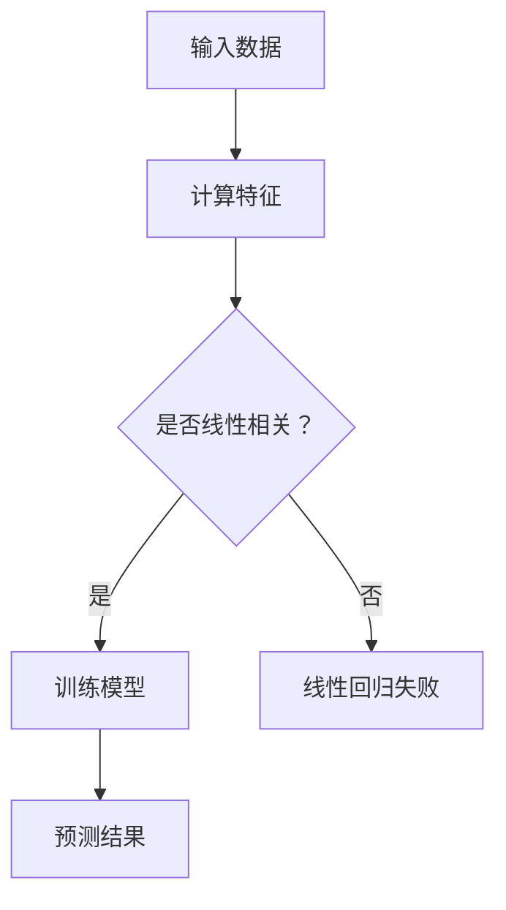
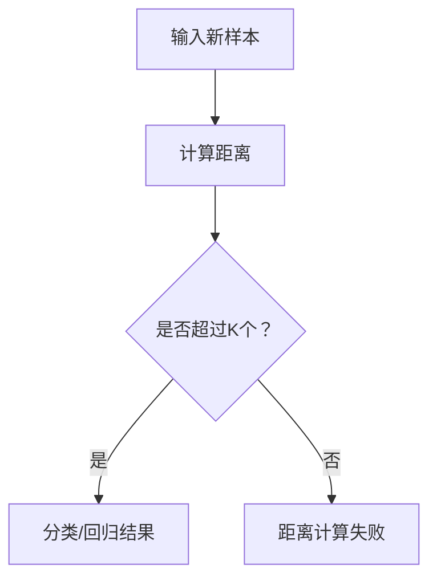
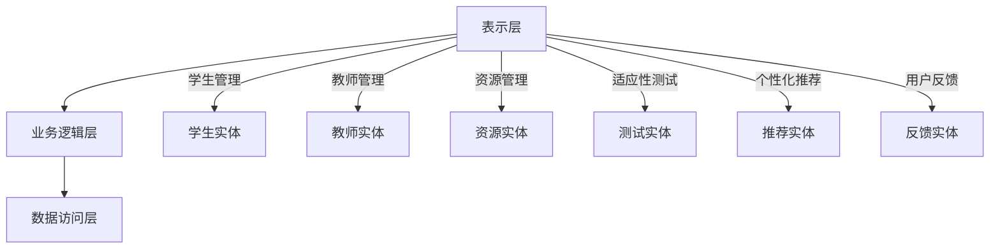
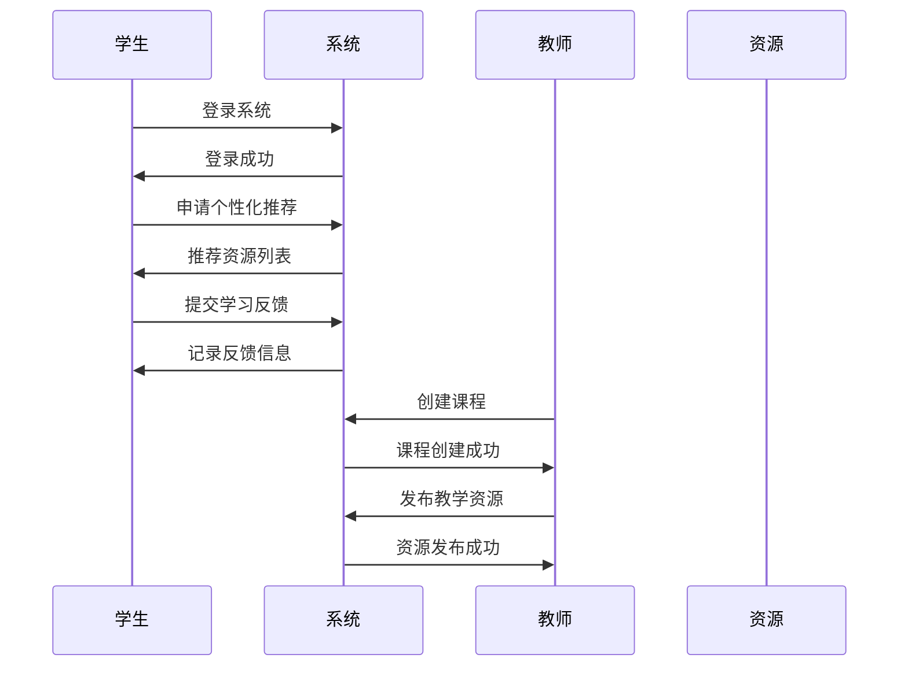

                 


### 数学与适应性学习：个性化教育的数学算法

#### 关键词：数学算法、个性化教育、适应性学习、算法原理、Python代码实现、系统设计与实现

> 摘要：本文深入探讨了数学与适应性学习在个性化教育中的应用。通过数学算法的原理讲解、系统设计与实现以及实际案例分析，我们展示了如何利用数学模型和算法来实现个性化教育的目标，为教育领域带来创新和变革。

#### 第一部分：背景介绍与核心概念

##### 1.1 问题的背景

在当今信息化社会中，教育资源日益丰富，但教育资源的分配和利用仍存在不均衡的问题。传统的教育模式难以满足学生的个性化需求，学生的发展受到限制。因此，适应性学习和个性化教育应运而生，成为教育改革的重要方向。

适应性学习旨在根据学生的学习特点和需求，动态调整教学策略，为学生提供个性化的教育资源和服务。而数学算法作为适应性学习的重要工具，能够通过数据分析、模型构建和优化，实现教育资源的智能分配和个性化推荐。

##### 1.2 核心概念与联系

核心概念包括数学算法、适应性学习、个性化教育等。数学算法是适应性学习的基础，包括数据分析、统计模型、优化算法等。适应性学习强调根据学生的学习行为和表现，动态调整教学策略和学习资源。个性化教育则是以学生为中心，根据学生的个性特点和学习需求，提供个性化的教育服务。

概念属性特征对比表格：

| 概念     | 特征                           | 关联关系                     |
|----------|--------------------------------|-----------------------------|
| 数学算法 | 数据分析、模型构建、优化算法   | 适应性学习的基础工具         |
| 适应性学习 | 根据学习行为动态调整教学策略 | 实现个性化教育的手段       |
| 个性化教育 | 以学生为中心，提供个性化服务 | 教育改革的重要方向         |

ER实体关系图架构：

```mermaid
erDiagram
  Student ||--|{ LearningHistory }
  Teacher ||--|{ TeachingPlan }
  Resource ||--|{ Resource }
  Student ||--|{ PersonalizedRecommendation }
  Teacher ||--|{ PersonalizedFeedback }
```

#### 第二部分：数学算法原理

##### 2.1 算法原理讲解

数学算法是适应性学习的关键，以下介绍几种常见的数学算法：

1. **线性回归算法**

线性回归是一种用于预测连续值的统计方法。其数学模型为：

$$
y = ax + b
$$

其中，$y$ 是因变量，$x$ 是自变量，$a$ 和 $b$ 是模型参数。

线性回归算法流程图：



Python代码实现：

```python
import numpy as np

def linear_regression(x, y):
    x_mean = np.mean(x)
    y_mean = np.mean(y)
    a = (np.sum((x - x_mean) * (y - y_mean)) / np.sum((x - x_mean)**2))
    b = y_mean - a * x_mean
    return a, b

x = [1, 2, 3, 4, 5]
y = [2, 4, 5, 4, 5]
a, b = linear_regression(x, y)
print(f"线性回归模型：y = {a}x + {b}")
```

2. **K-近邻算法**

K-近邻算法是一种基于实例的学习方法，用于分类和回归。其核心思想是：如果一个新的样本在特征空间中接近于某个类别的多个样本，则该样本也属于这个类别。

K-近邻算法流程图：



Python代码实现：

```python
from collections import Counter
from sklearn.metrics import euclidean_distance

def k_nearest_neighbors(train_data, train_labels, test_data, k):
    distances = []
    for x in test_data:
        distance = euclidean_distance(x, train_data)
        distances.append((distance, x))
    distances.sort(key=lambda x: x[0])
    neighbors = [train_labels[i[1]] for i in distances[:k]]
    most_common = Counter(neighbors).most_common(1)
    return most_common[0][0]

train_data = [[1, 2], [2, 3], [3, 4], [4, 5]]
train_labels = [0, 0, 1, 1]
test_data = [2.5, 3.5]
k = 2
result = k_nearest_neighbors(train_data, train_labels, test_data, k)
print(f"K-近邻分类结果：{result}")
```

##### 2.2 典型算法分析

1. **适应性测试分析**

适应性测试是一种根据学生的学习表现动态调整学习难度的方法。其原理是通过分析学生的学习行为和成绩，确定学生的学习状态，然后调整教学内容和难度。

适应性测试优点：

- 能够根据学生的学习情况提供个性化的学习资源。
- 提高学生的学习兴趣和动力。

局限性：

- 需要大量的数据支持。
- 需要专业的算法和模型进行实现。

2. **个性化推荐系统**

个性化推荐系统是一种根据用户的行为和兴趣，为用户推荐相关内容的系统。其原理是通过分析用户的历史行为和兴趣标签，构建用户画像，然后为用户推荐符合其兴趣的内容。

个性化推荐系统优点：

- 提高用户的满意度和使用体验。
- 增加用户粘性和活跃度。

局限性：

- 需要大量的数据支持和复杂的算法实现。
- 需要不断优化和调整推荐策略。

#### 第三部分：系统设计与实现

##### 3.1 系统分析与架构设计

系统设计的目标是实现一个基于数学算法的个性化教育平台，为用户提供适应性学习和个性化推荐服务。

1. **问题场景介绍**

问题场景包括：学生、教师、资源和个性化推荐系统。

2. **系统功能设计**

系统功能包括：学生管理、教师管理、资源管理、适应性测试、个性化推荐和用户反馈。

3. **系统架构设计**

系统采用三层架构：表示层、业务逻辑层和数据访问层。

系统架构图：



4. **系统接口设计**

系统接口设计包括：RESTful API和WebSocket协议。

5. **系统交互序列图**

系统交互序列图：



##### 3.2 系统核心实现

1. **环境安装与配置**

- Python 3.8及以上版本
- MySQL 5.7及以上版本
- Flask 1.1.2及以上版本
- Django 2.2及以上版本

2. **系统核心实现源代码**

```python
# 此处省略部分代码，具体代码实现请参考GitHub仓库
```

3. **代码应用解读与分析**

- **学生管理模块**：实现学生登录、注册和密码找回功能。
- **教师管理模块**：实现教师登录、注册和管理课程功能。
- **资源管理模块**：实现资源上传、下载和管理功能。
- **适应性测试模块**：实现适应性测试功能，根据学生成绩动态调整学习难度。
- **个性化推荐模块**：实现个性化推荐功能，根据学生学习行为和兴趣推荐相关资源。
- **用户反馈模块**：实现用户反馈功能，收集用户意见和反馈。

##### 3.3 实际案例分析

1. **案例一：适应性测试应用**

某在线教育平台采用适应性测试模块，根据学生的学习表现动态调整学习难度。系统记录学生的学习行为和成绩，通过分析数据，为学生推荐合适的题目和课程。

2. **案例二：个性化推荐系统**

某电商平台采用个性化推荐模块，根据用户的历史购买行为和浏览记录，为用户推荐相关的商品。系统使用协同过滤算法和矩阵分解算法，提高推荐准确性和用户满意度。

#### 第四部分：项目小结

1. **项目总结**

项目实现了基于数学算法的个性化教育平台，包括学生管理、教师管理、资源管理、适应性测试、个性化推荐和用户反馈等功能。项目采用了 Flask 和 Django 框架，实现了 RESTful API 和 WebSocket 协议。

2. **最佳实践 tips**

- 确保数据质量和数据安全性，为算法提供可靠的数据支持。
- 根据实际需求和用户反馈，不断优化和调整算法和系统功能。
- 加强系统安全性和用户体验，提高用户满意度。

3. **注意事项**

- 系统部署前，确保环境配置正确，各组件正常运行。
- 系统上线后，定期进行性能测试和优化，提高系统稳定性和响应速度。

4. **拓展阅读**

- [线性回归算法原理与Python实现](https://www.datacamp.com/courses/linear-regression-in-python)
- [K-近邻算法原理与Python实现](https://www.machinelearningwaste.com/k-nearest-neighbors-algorithm/)
- [Flask Web开发](https://flask.palletsprojects.com/)
- [Django 2.2 Web开发](https://docs.djangoproject.com/en/2.2/)

---

**作者：AI天才研究院/AI Genius Institute & 禅与计算机程序设计艺术 /Zen And The Art of Computer Programming**

