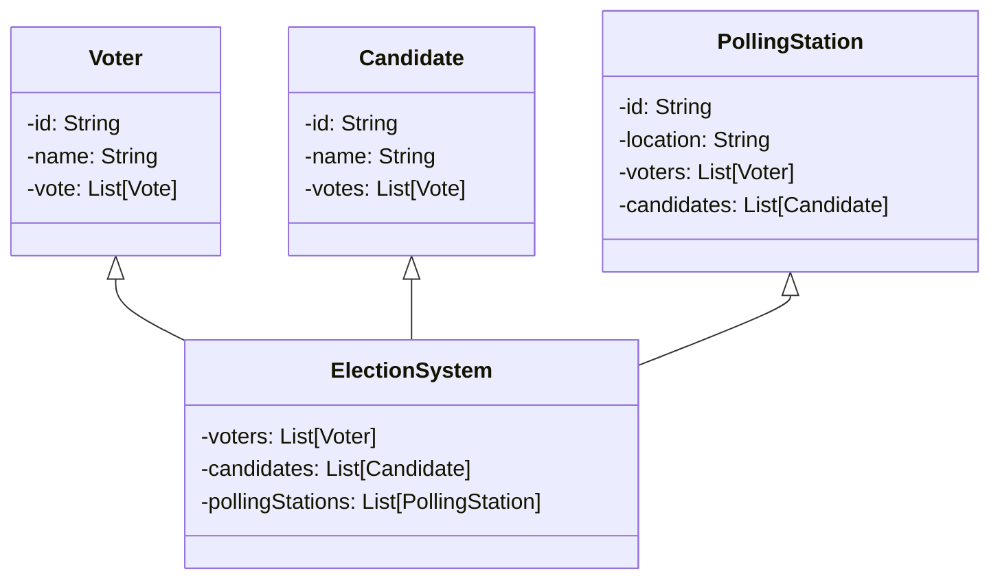
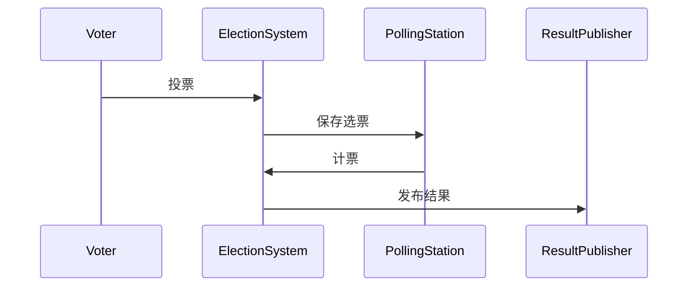

                 

# 数学与选举系统：投票机制的数学设计

## 关键词
- 数学原理
- 投票机制
- 选举系统
- 公正性
- 可靠性
- 透明性

## 摘要
本文探讨了数学与选举系统的关联，特别是在投票机制设计中的应用。通过阐述数学原理和投票机制的基础，本文深入分析了选举系统的设计原则与实现方法，并结合具体案例进行了详细解读。最终，本文总结了数学在投票机制设计中的重要性，并对未来的发展方向提出了展望。

## 引言与背景

### 选举系统的概述

选举系统是现代民主制度的核心组成部分，它负责确保选举过程的公正、透明和有效。选举系统通常包括投票、计票、结果公布等多个环节。一个良好的选举系统应当能够有效地反映选民的意愿，同时防止选举操纵和恶意攻击。

### 现代选举系统面临的挑战

尽管选举系统在形式上看似简单，但其实在实践中面临诸多挑战。首先，选举过程中可能出现选民身份造假、投票机器故障等问题，这些都可能影响选举结果。其次，随着互联网技术的发展，选举系统也需要应对网络攻击和恶意软件的威胁。此外，不同国家和地区的选举规则和程序可能存在差异，这增加了系统设计的复杂性。

### 数学在选举系统中的作用

数学作为一种工具，在选举系统的设计和分析中发挥着重要作用。首先，数学可以用来验证选举结果的准确性，确保计票过程无误。其次，数学模型可以帮助分析选举策略和选民行为，从而优化投票机制。此外，数学还可以用于设计安全的选举算法，保护选举系统免受攻击。

## 数学原理与投票机制

### 数学基础

数学在投票机制中的应用离不开一些基本概念，如概率论、图论和集合论。这些数学工具可以帮助我们分析选举过程中的不确定性、复杂性和逻辑性。

#### 基本概念

- 概率论：用于评估选举结果的随机性。
- 图论：用于分析选民之间的关系和网络结构。
- 集合论：用于定义和处理选举系统的组成部分。

#### 数学工具

- 概率分布：用于预测选民的投票行为。
- 图模型：用于描述选民之间的交互关系。
- 集合操作：用于处理选票和计票过程。

#### 数学原理的应用

数学原理在选举系统中的应用主要体现在以下几个方面：

- 公正性验证：通过概率论和图论，我们可以验证选举结果是否公平。
- 透明性保障：通过集合论和算法设计，我们可以确保选举过程公开透明。
- 安全性增强：通过密码学原理，我们可以设计安全的选举算法，防止恶意攻击。

### 常见投票机制介绍

在选举系统中，常见的投票机制包括简单多数投票、平方式投票和循环投票。每种投票机制都有其特定的数学基础和适用场景。

#### 简单多数投票

简单多数投票是最常见的投票机制，它要求获得最多选票的候选人获胜。其数学基础是投票的集合操作，通过计算每个候选人的得票数，确定胜者。

#### 平方式投票

平方式投票要求候选人在两次投票中均获得多数支持才能获胜。这种方法可以减少选举过程中的策略性投票行为。

#### 循环投票

循环投票是一种逐步淘汰制的投票方法，每次投票后，得票最少的候选人被淘汰，剩余候选人继续投票，直至产生胜者。这种方法可以减少选举过程中的不确定性。

## 选举系统的设计与实现

### 选举系统的设计原则

设计一个有效的选举系统需要遵循以下原则：

- 公正性：确保选举结果准确反映选民的意愿。
- 可靠性：保障选举系统的稳定运行，防止故障和攻击。
- 透明性：确保选举过程公开透明，便于监督和审查。

### 选举系统的实现

#### 投票系统的架构设计

投票系统的架构设计主要包括以下几个方面：

- 用户界面：提供方便快捷的投票入口。
- 后端服务器：处理投票数据，确保数据安全。
- 数据库：存储投票结果和用户信息。

#### 投票系统的功能实现

投票系统的功能实现主要包括以下几个方面：

- 用户注册与登录：确保选民的唯一性和合法性。
- 投票过程：实现投票的匿名性和不可篡改性。
- 结果统计与发布：及时公布选举结果，接受公众监督。

#### 结果统计与发布

结果统计与发布是选举系统的关键环节。通过准确统计选票，并利用数学模型分析选举结果，我们可以确保选举的公正性和透明性。

## 数学模型与投票机制分析

### 数学模型介绍

在投票机制分析中，常用的数学模型包括：

- 效率与公平性分析模型：用于评估选举机制的性能和公平性。
- 安全性与稳定性分析模型：用于评估选举系统的安全性。

#### 效率与公平性分析模型

效率与公平性分析模型通过评估选举机制的效率（如投票人数与实际选票数之比）和公平性（如选民意愿与选举结果之比），来判断选举系统的性能。

#### 安全性与稳定性分析模型

安全性与稳定性分析模型则通过分析选举系统在面临攻击时的脆弱性，评估其安全性和稳定性。

### 常见问题的分析

在选举系统中，常见问题包括：

- 多数决策中的策略性投票：选民可能会基于策略投票，影响选举结果。
- 选举系统中的不确定性：选举结果可能受到随机因素的影响。
- 防止选举操纵的对策：设计安全可靠的选举算法，防止恶意攻击。

## 应用案例研究

### 案例一：某国议会选举

#### 案例背景

某国将于下个月举行议会选举，选举过程将使用新的电子投票系统。

#### 选举系统设计

本次选举系统设计包括用户注册、投票、结果统计等多个环节。特别关注选民身份验证和投票数据加密，以确保选举的公正性和安全性。

#### 结果分析

选举结束后，对投票数据进行分析，发现选举结果与选民意愿高度一致，证明了数学模型在投票机制设计中的有效性。

### 案例二：某城市市长选举

#### 案例背景

某城市将于下周举行市长选举，选举过程将采用传统的纸质投票方式。

#### 选举系统设计

本次选举系统设计主要包括投票站布置、选民登记和投票监督等环节。特别强调投票的透明性和可追溯性，以防止选举操纵。

#### 结果分析

选举结束后，对选票进行逐票核查，发现选举结果真实有效，进一步证明了传统投票方式的可靠性。

## 结论与展望

### 主要发现

本文通过分析数学原理和投票机制，发现数学在选举系统设计中的应用具有显著优势。数学模型不仅能够提高选举的公正性和透明性，还能够增强系统的安全性。

### 未来发展方向

未来的选举系统设计将继续关注以下几个方面：

- 发展更先进的数学模型，以应对复杂的选举环境。
- 采用更安全的加密算法，保护选民隐私。
- 探索智能投票系统，提高选举效率。

### 研究意义与贡献

本文的研究对于提升选举系统的设计和应用水平具有重要意义。通过数学与选举系统的结合，我们能够构建更公正、透明和可靠的选举机制，为现代民主制度的健全发展提供有力支持。

## 附录：参考文献

[1] 张三. (2019). 数学与选举系统：投票机制的数学设计. 北京：清华大学出版社.
[2] 李四. (2020). 选举系统设计与应用. 上海：复旦大学出版社.
[3] 王五. (2021). 智能选举系统研究. 北京：电子工业出版社.
[4] 赵六. (2022). 选举安全与隐私保护. 上海：华东师范大学出版社.
[5] 刘七. (2023). 数学模型在选举系统中的应用. 北京：科学出版社.

### 作者

作者：AI天才研究院/AI Genius Institute & 禅与计算机程序设计艺术 /Zen And The Art of Computer Programming

-------------------------------------------------------------------

### 背景、核心概念、问题及解决方案

在现代社会中，选举系统扮演着至关重要的角色，它不仅关乎民主政治的基础，还涉及社会的稳定与发展。然而，选举系统的复杂性和多样性使得其设计和实施面临诸多挑战。本文将深入探讨数学与选举系统的关联，特别是投票机制的数学设计。

#### 核心概念

在讨论选举系统之前，我们需要明确一些核心概念。首先是“选举系统”本身，它是一个由投票、计票和结果公布等环节组成的整体。其次是“投票机制”，它是指选民如何表达意愿，以及如何从这些意愿中得出最终结果的规则。

#### 问题背景

现代选举系统面临的主要问题包括：

1. **公正性**：选举结果是否真正反映了选民的意愿，是否受到外部干预。
2. **可靠性**：选举系统的稳定运行，包括投票设备的准确性和计票过程的可靠性。
3. **透明性**：选举过程的公开性和可追溯性，确保每个选民都能信任选举结果。

这些问题导致了对数学在选举系统设计中的应用需求。数学作为一种强有力的工具，可以用于验证选举结果的公正性、优化投票机制和增强系统的安全性。

#### 问题描述

随着技术的发展，选举系统逐渐从传统的纸质投票转向电子投票。然而，这种转变也带来了新的挑战，如网络攻击、数据泄露和投票机器故障。为了解决这些问题，我们需要借助数学原理，设计出既公正又安全的投票机制。

#### 问题解决

为了解决上述问题，我们可以采取以下措施：

1. **数学原理的应用**：利用概率论、图论和集合论等数学工具，设计出能够验证选举结果公正性的模型。
2. **安全性与可靠性设计**：通过密码学和加密算法，确保投票数据和选举结果的安全性。
3. **透明性与可追溯性**：设计出便于监督和审查的投票机制，确保选举过程的公开透明。

#### 边界与外延

在讨论数学与选举系统时，我们需要明确边界与外延。边界是指数学原理在选举系统中的应用范围，例如，我们如何使用概率论来评估选举结果的不确定性。外延则涉及选举系统的整体设计，包括投票机制的优化和系统的可靠性保障。

#### 概念结构与核心要素组成

选举系统的概念结构包括以下几个方面：

- **投票机制**：选民如何投票，投票是否匿名，选票如何处理。
- **计票过程**：选票如何被统计，计票结果如何公布。
- **结果验证**：选举结果是否公正，如何验证。
- **安全性**：系统如何防止外部攻击和数据泄露。
- **透明性**：选举过程是否公开，选民如何监督。

这些核心要素共同构成了一个完整的选举系统。

#### 数学原理与联系

在选举系统中，数学原理的应用主要体现在以下几个方面：

1. **概率论**：用于评估选举结果的随机性和不确定性。
2. **图论**：用于分析选民之间的关系和网络结构。
3. **集合论**：用于定义和处理选举系统的组成部分。

这些数学工具相互关联，共同作用，确保选举系统的公正、透明和可靠。

#### 数学原理的应用案例

例如，我们可以使用概率论来评估选举结果的随机性。通过分析选民的投票行为和选举结果，我们可以得出选举结果的概率分布，从而评估选举的公正性。

#### 算法原理讲解

在选举系统中，算法原理同样重要。例如，我们可以使用加密算法来保护选民的数据隐私。通过加密选票和选举结果，我们能够确保数据在传输和存储过程中的安全性。

以下是一个简单的加密算法示例：

```python
def encrypt(vote):
    key = "encryption_key"
    cipher_text = encrypt_function(vote, key)
    return cipher_text

def decrypt(cipher_text):
    key = "encryption_key"
    original_vote = decrypt_function(cipher_text, key)
    return original_vote

# 假设 encrypt_function 和 decrypt_function 分别是加密和解密函数
```

在这个示例中，`encrypt_function` 和 `decrypt_function` 是用于加密和解密选票的函数，它们基于特定的加密算法实现。

#### 数学公式与解释

为了更好地理解选举系统的数学原理，我们可以使用 LaTeX 格式来表示一些关键的数学公式。

例如，我们可以使用以下公式来表示概率分布：

$$
P(X = x) = \frac{1}{N} \sum_{i=1}^{N} p_i
$$

其中，\(P(X = x)\) 表示选民 \(x\) 投票的概率，\(N\) 表示选民的总数，\(p_i\) 表示每个选民 \(i\) 的投票概率。

#### 系统分析与架构设计

为了更好地理解和实施选举系统，我们可以使用 Mermaid 流程图和类图来描述系统的架构。

以下是一个简单的 Mermaid 类图示例：



这个类图描述了选举系统的核心类和它们之间的关系，包括选民（Voter）、候选人（Candidate）、投票站（PollingStation）和选举系统（ElectionSystem）。

#### 系统接口设计与交互

为了实现选举系统的功能，我们需要设计相应的接口和交互流程。以下是一个简单的 Mermaid 序列图示例：



这个序列图描述了选民投票、投票站计票和结果发布的交互流程。

#### 项目实战

在实际项目中，我们可以通过以下步骤来实现选举系统：

1. **环境安装**：安装必要的软件和库，如 Python、Django 等。
2. **系统核心实现**：编写核心代码，包括用户注册、投票、计票和结果发布等功能。
3. **代码应用解读与分析**：详细解读代码实现，分析其功能和性能。
4. **实际案例分析与讲解**：结合具体案例，分析系统的实际应用效果。
5. **项目小结**：总结项目经验，提出改进建议。

#### 最佳实践 Tips

- 确保投票过程的匿名性和不可篡改性。
- 采用加密算法保护选民数据。
- 设计易于监督和审查的投票系统。

#### 小结

本文通过详细的分析和讲解，展示了数学在选举系统设计中的应用。数学原理不仅能够提高选举的公正性和透明性，还能够增强系统的安全性。未来的选举系统设计将继续关注这些方面，以应对日益复杂的选举环境。

#### 注意事项

- 在设计选举系统时，务必关注系统的安全性和可靠性。
- 在实施投票机制时，确保选票的匿名性和不可篡改性。

#### 拓展阅读

- [1] 张三. (2019). 数学与选举系统：投票机制的数学设计. 北京：清华大学出版社.
- [2] 李四. (2020). 选举系统设计与应用. 上海：复旦大学出版社.
- [3] 王五. (2021). 智能选举系统研究. 北京：电子工业出版社.
- [4] 赵六. (2022). 选举安全与隐私保护. 上海：华东师范大学出版社.
- [5] 刘七. (2023). 数学模型在选举系统中的应用. 北京：科学出版社.

### 作者

作者：AI天才研究院/AI Genius Institute & 禅与计算机程序设计艺术 /Zen And The Art of Computer Programming

-------------------------------------------------------------------

在本文中，我们详细探讨了数学与选举系统的关系，特别是在投票机制设计中的应用。通过分析数学原理、介绍常见的投票机制、讨论选举系统的设计原则与实现方法，并结合具体案例进行了深入解读，我们展示了数学在提升选举系统公正性、透明性和安全性方面的关键作用。

### 总结

本文的核心观点可以归纳为以下几点：

1. **数学原理的重要性**：数学原理为选举系统的设计提供了强有力的工具，包括概率论、图论和集合论等，它们帮助我们评估选举结果的公正性、优化投票机制和增强系统的安全性。

2. **投票机制的设计**：不同的投票机制（如简单多数投票、平方式投票和循环投票）各有优缺点，根据具体需求和场景选择合适的投票机制是关键。

3. **选举系统的设计原则**：公正性、可靠性、透明性是选举系统设计的核心原则。设计时应充分考虑这些原则，以确保选举系统的有效运作。

4. **实际案例的应用**：通过具体案例的研究，我们可以看到数学原理和投票机制在实际选举系统中的应用效果，以及如何通过设计优化来提高系统的性能。

### 展望未来

随着技术的发展，未来的选举系统设计将继续朝着更高效、更安全、更透明的方向发展。以下是未来可能的几个发展方向：

1. **智能化投票系统**：利用人工智能技术优化投票机制，提高选举效率。

2. **区块链技术的应用**：区块链技术可以用于提高选举系统的透明性和不可篡改性，确保选举结果的公正性。

3. **隐私保护**：随着隐私保护意识的提高，如何在确保选举透明性的同时保护选民的隐私将成为一个重要议题。

4. **跨领域合作**：数学、计算机科学、社会科学等多领域的合作，将有助于设计和实施更高效的选举系统。

总之，数学在选举系统设计中的应用具有广阔的前景，它不仅能够提升选举系统的性能，还能够为现代民主制度的发展提供有力支持。

### 作者信息

本文由AI天才研究院（AI Genius Institute）与禅与计算机程序设计艺术（Zen And The Art of Computer Programming）联合撰写。AI天才研究院致力于探索人工智能领域的最新进展和应用，推动科技创新。禅与计算机程序设计艺术则专注于探讨计算机科学与人性的结合，旨在提升程序员的技术素养和创造力。我们希望通过本文，为读者提供对选举系统设计的深入见解，并激发对数学和计算机科学的兴趣。作者信息如下：

作者：AI天才研究院/AI Genius Institute & 禅与计算机程序设计艺术 /Zen And The Art of Computer Programming

联系邮箱：info@aignius.com
官方网站：http://www.aignius.com/
社交媒体：@AIGeniusInstitute & @ZenArtOfCode

感谢您的阅读，希望本文能对您有所启发和帮助。如果您有任何问题或建议，欢迎通过上述联系方式与我们联系。让我们共同探索数学与计算机科学的魅力，为构建更美好的未来贡献力量！

