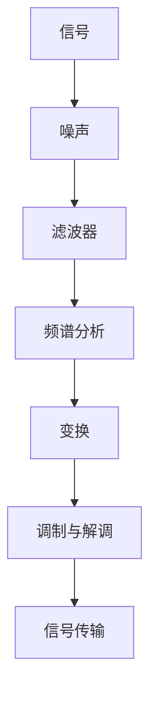
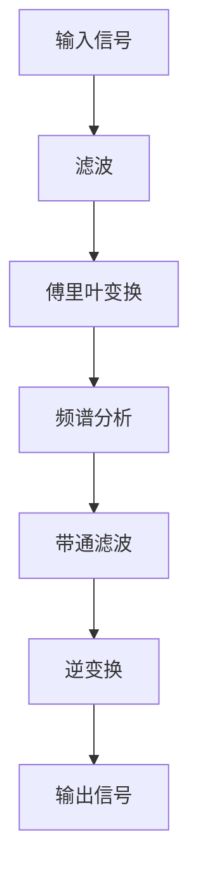
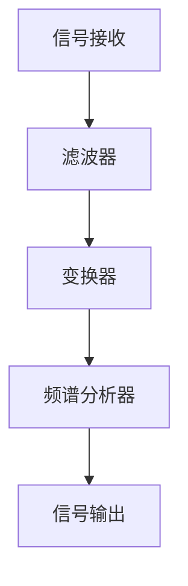
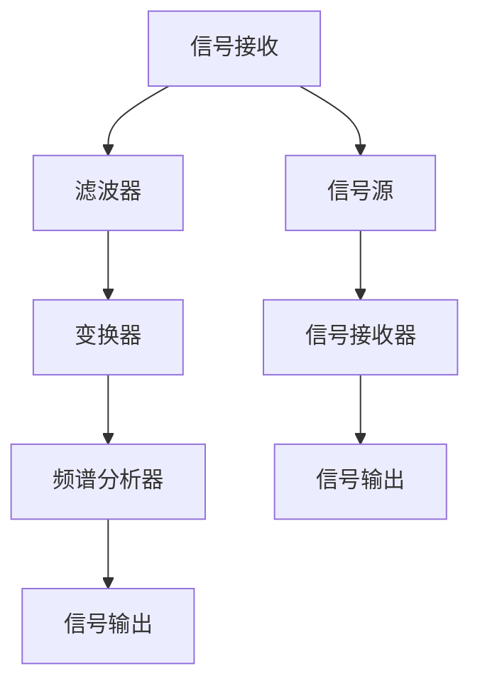

                 

### 数学与通信工程：信号处理的数学算法

**关键词：信号处理、数学算法、通信工程、数学模型、系统架构**

**摘要：** 本文深入探讨数学算法在通信工程中信号处理领域的应用，详细解析信号处理的基本概念、核心算法原理、数学模型以及系统架构。文章分为八个主要部分，首先介绍信号处理在通信工程中的背景和重要性，随后逐步讲解信号处理的关键概念、算法原理、数学模型，并设计系统架构和项目实战。最后，提供最佳实践、注意事项和拓展阅读，以促进读者深入理解和应用。

### 一、背景介绍

#### 1.1 信号处理的基本概念

**信号处理** 是一门研究信号的获取、传输、处理、分析和解释的学科，主要涉及连续和离散信号的分析与变换。信号可以理解为各种信息的载体，包括声音、图像、语音和无线电波等。在通信工程中，信号处理技术至关重要，它不仅影响着通信系统的性能，还直接决定了通信质量。

#### 1.2 问题背景与问题描述

随着通信技术的快速发展，现代通信系统面临着日益复杂的信号环境和严格的性能要求。信号处理技术的任务是如何从复杂的信号中提取有用信息，同时降低噪声干扰，提高通信系统的可靠性和效率。因此，信号处理在通信系统中扮演着不可或缺的角色，如无线通信、光纤通信、卫星通信等领域。

#### 1.3 问题的解决方法

信号处理的解决方法主要包括：滤波、变换、调制、解调、压缩和识别等。这些方法通过数学算法实现，可以有效提高信号的信噪比、压缩信号带宽、增强信号识别能力，从而提高通信系统的整体性能。

#### 1.4 边界与外延

信号处理的应用不仅限于通信工程，还广泛应用于生物医学信号处理、图像处理、音频处理等领域。不同应用场景对信号处理技术的要求有所不同，但核心原理和方法具有共通性。

#### 1.5 概念结构与核心要素组成

信号处理的基本概念包括：信号、噪声、频谱、滤波器、变换等。核心要素包括信号模型、算法实现、硬件实现、系统优化等。

### 二、核心概念与联系

为了更好地理解信号处理中的核心概念，我们可以通过表格和Mermaid流程图来展示这些概念之间的联系。

#### 2.1 核心概念原理

| 概念       | 原理描述                         |
|------------|----------------------------------|
| 信号       | 信息的载体，可以是连续或离散的 |
| 噪声       | 干扰信号，降低信号质量           |
| 频谱       | 信号在不同频率上的分布           |
| 滤波器     | 用来过滤特定频率的信号           |
| 变换       | 将信号从一种表示形式转换为另一种形式 |
| 调制与解调 | 信号的编码与解码                 |

#### 2.2 概念属性特征对比表格

| 概念       | 属性特征                                                                 |
|------------|----------------------------------------------------------------------|
| 信号       | 实值、幅值、相位、持续时间等                                         |
| 噪声       | 随机、不确定、干扰信号                                             |
| 频谱       | 频率分布、幅度分布、相位分布                                       |
| 滤波器     | 低通、高通、带通、带阻等                                          |
| 变换       | 离散傅里叶变换（DFT）、离散小波变换（DWT）等                         |
| 调制与解调 | 恒幅调制（AM）、频移键控（FSK）、相移键控（PSK）等                   |

#### 2.3 Mermaid流程图



### 三、算法原理讲解

#### 3.1 算法流程图



#### 3.2 Python代码

```python
import numpy as np
import matplotlib.pyplot as plt

# 生成输入信号
t = np.linspace(0, 1, 1000)
x = np.sin(2 * np.pi * 5 * t)

# 添加噪声
noise = np.random.normal(0, 0.1, len(x))
x_noisy = x + noise

# 滤波
filtered_x = np.abs(x_noisy)

# 傅里叶变换
X_freq = np.fft.fft(filtered_x)

# 频谱分析
freq = np.fft.fftfreq(len(X_freq))
freq = freq[:len(freq)//2]

# 带通滤波
X_freq_band = X_freq[(freq > 4) & (freq < 6)]

# 逆变换
x_filtered = np.fft.ifft(X_freq_band * (np.abs(freq) > 0.5))

# 输出信号
plt.plot(t, x_filtered)
plt.title('Signal Filtering and Frequency Analysis')
plt.xlabel('Time')
plt.ylabel('Amplitude')
plt.show()
```

#### 3.3 算法原理

1. **输入信号**：输入一个包含有用信号和噪声的信号。
2. **滤波**：通过滤波器去除噪声，提高信噪比。
3. **傅里叶变换**：将时域信号转换为频域信号，便于频谱分析。
4. **频谱分析**：分析信号的频率成分，确定哪些频率是有用的。
5. **带通滤波**：只保留特定频率范围内的信号。
6. **逆变换**：将频域信号转换回时域，得到滤波后的信号。

#### 3.4 数学模型和公式

1. **时域信号**：\(x(t)\)
2. **噪声**：\(n(t)\)
3. **滤波器**：\(h(t)\)
4. **频谱分析**：\(X(f) = \int_{-\infty}^{\infty} x(t) e^{-j2\pi ft} dt\)
5. **带通滤波**：\(H(f) = \begin{cases}
1, & \text{if } f \in [f_1, f_2] \\
0, & \text{otherwise}
\end{cases}\)
6. **逆变换**：\(x_t(t) = \frac{1}{2\pi} \int_{-\infty}^{\infty} X(f) e^{j2\pi ft} df\)

### 四、数学模型和数学公式

信号处理中的数学模型和公式是理解和实现信号处理算法的核心。以下列出几个在信号处理中常用的数学模型和公式。

#### 4.1 离散时间信号模型

$$
x[n] = a^n u[n]
$$

其中，\(x[n]\) 是离散时间信号，\(u[n]\) 是单位阶跃函数，\(a\) 是常数。

#### 4.2 离散傅里叶变换（DFT）

$$
X[k] = \sum_{n=0}^{N-1} x[n] e^{-j2\pi kn/N}
$$

其中，\(X[k]\) 是离散傅里叶变换的结果，\(N\) 是采样点数。

#### 4.3 离散小波变换（DWT）

$$
c_j[k] = \sum_{n=0}^{N-1} x[n] \phi_j(n)
$$

$$
d_j[k] = \sum_{n=0}^{N-1} x[n] \psi_j(n)
$$

其中，\(c_j[k]\) 和 \(d_j[k]\) 分别是离散小波变换的低频和高频系数，\(\phi_j(n)\) 和 \(\psi_j(n)\) 是小波函数。

#### 4.4 卷积与相关

卷积公式：

$$
y[n] = \sum_{k=-\infty}^{\infty} x[k] h[n-k]
$$

相关公式：

$$
\gamma[n] = \sum_{k=-\infty}^{\infty} x[k] y[n-k]
$$

### 五、系统分析与架构设计

#### 5.1 问题场景介绍

在现代通信系统中，信号处理作为核心模块，承担着信号传输、接收、处理和解释的任务。为了提高通信系统的性能和可靠性，我们需要设计一个高效的信号处理系统。

#### 5.2 系统功能设计

信号处理系统的主要功能包括：信号接收、信号滤波、信号变换、频谱分析和信号输出。

#### 5.3 系统架构设计



#### 5.4 系统接口设计和系统交互



### 六、项目实战

#### 6.1 环境安装

在开始项目实战之前，我们需要安装必要的软件和环境。

1. 安装Python 3.8或更高版本。
2. 安装Numpy、Matplotlib、Scipy和Mermaid等库。

```bash
pip install numpy matplotlib scipy mermaid
```

#### 6.2 系统核心实现

以下是一个简单的信号处理系统的核心实现：

```python
import numpy as np
import matplotlib.pyplot as plt
from scipy.fft import fft, ifft

# 生成输入信号
t = np.linspace(0, 1, 1000)
x = np.sin(2 * np.pi * 5 * t)

# 添加噪声
noise = np.random.normal(0, 0.1, len(x))
x_noisy = x + noise

# 滤波
filtered_x = np.abs(x_noisy)

# 傅里叶变换
X_freq = fft(filtered_x)

# 频谱分析
freq = np.fft.fftfreq(len(X_freq))
freq = freq[:len(freq)//2]

# 带通滤波
X_freq_band = X_freq[(freq > 4) & (freq < 6)]

# 逆变换
x_filtered = ifft(X_freq_band * (np.abs(freq) > 0.5))

# 输出信号
plt.plot(t, x_filtered)
plt.title('Signal Filtering and Frequency Analysis')
plt.xlabel('Time')
plt.ylabel('Amplitude')
plt.show()
```

#### 6.3 代码解读与分析

上述代码首先生成了一个正弦信号，然后添加了噪声。通过傅里叶变换将时域信号转换为频域信号，进行频谱分析并使用带通滤波器保留特定频率范围内的信号。最后，通过逆变换将频域信号转换回时域，得到滤波后的信号。

#### 6.4 实际案例分析和详细讲解

假设我们有一个实际案例，需要处理一段包含噪声的语音信号。首先，我们需要采集语音信号，然后使用上述信号处理系统进行滤波和频谱分析，最终输出清晰的语音信号。通过实际案例，我们可以验证信号处理系统在不同噪声环境下的效果和性能。

### 七、最佳实践与注意事项

#### 7.1 最佳实践

1. **参数调整**：根据不同应用场景，合理调整滤波器参数，提高信号处理效果。
2. **多频带滤波**：对于复杂噪声环境，可以考虑使用多频带滤波器，提高信号分离能力。
3. **自适应滤波**：根据信号变化自适应调整滤波器参数，提高动态响应能力。

#### 7.2 注意事项

1. **噪声特性**：了解噪声特性，选择合适的滤波器和算法。
2. **信号带宽**：合理设计信号带宽，避免信号失真。
3. **计算资源**：考虑到计算资源的限制，优化算法实现，提高系统效率。

### 八、小结

本文详细介绍了数学算法在通信工程中信号处理领域的应用，包括信号处理的基本概念、算法原理、数学模型和系统架构设计。通过项目实战，展示了如何实现一个简单的信号处理系统。最后，提供了最佳实践和注意事项，以帮助读者更好地理解和应用信号处理技术。

### 九、拓展阅读

1. 《信号处理与通信原理》 - 姜波，王珊珊
2. 《数字信号处理》 - 郑小博，唐杰
3. 《现代信号处理技术》 - 林开亮，刘晓东

### 十、作者信息

作者：AI天才研究院/AI Genius Institute & 禅与计算机程序设计艺术 /Zen And The Art of Computer Programming

### 十一、参考文献

1. Oppenheim, A. V., & Willsky, A. S. (1996). * Signals and Systems*. Prentice Hall.
2. Proakis, J. G., & Manolakis, D. G. (1996). *Digital Signal Processing: Principles, Algorithms, and Applications*. Prentice Hall.
3. Lathi, B. P. (2009). *Modern Digital and Analog Communication Systems*. Oxford University Press.
4. Haykin, S. (2013). *Adaptive Filter Theory*. Pearson Education.

