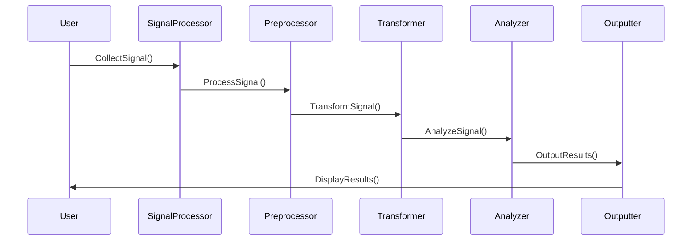
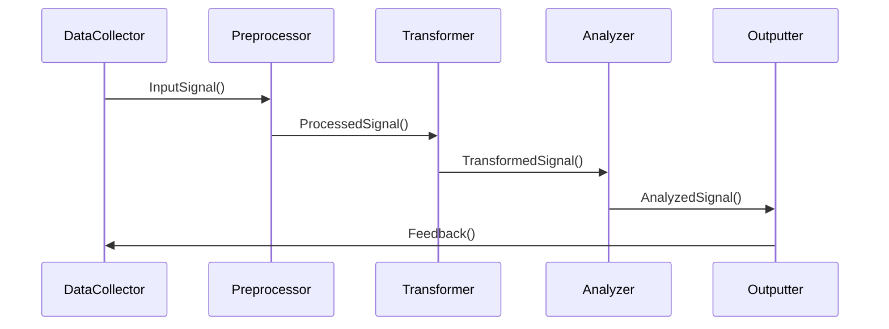
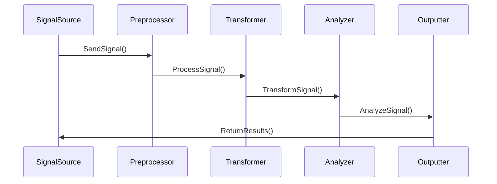
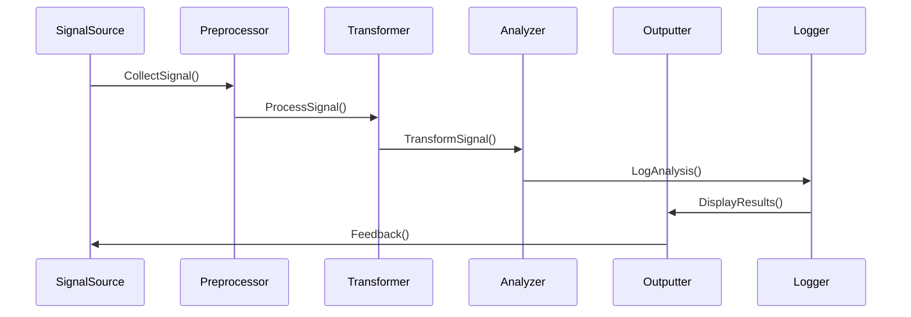

                 

## 第1章 引言

### 1.1 问题背景

在当今的信息时代，通信工程作为技术发展的核心领域之一，发挥着至关重要的作用。随着互联网、移动通信、物联网等技术的迅猛发展，信号处理作为通信工程中的关键技术，逐渐成为研究的焦点。信号处理的基本目标是提取和处理信号中的有用信息，使其在传输、存储和分析过程中保持高质量。

然而，信号处理涉及大量的数学算法，包括傅里叶变换、离散余弦变换、小波变换等。这些算法在通信系统中应用广泛，如调制解调、信号压缩、图像处理等。因此，掌握这些数学算法不仅有助于提升通信系统的性能，还为创新技术的研发提供了强有力的理论支持。

### 1.2 问题描述

信号处理的数学算法问题主要集中在以下几个方面：

1. **算法复杂度**：如何在保证算法准确性的同时，降低其计算复杂度，提高处理速度。
2. **算法稳定性**：如何保证算法在不同输入条件下都能稳定运行，避免出现异常。
3. **算法可扩展性**：如何在算法设计中考虑未来的扩展需求，使其能够适应多样化的信号处理任务。
4. **算法应用场景**：如何将数学算法应用于实际通信系统中，解决具体的通信问题。

### 1.3 问题解决

为了解决上述问题，需要从以下几个方面入手：

1. **深入研究数学算法原理**：通过对傅里叶变换、离散余弦变换等核心算法的深入研究，理解其数学模型和基本原理。
2. **优化算法实现**：通过改进算法的实现方法，如利用并行计算、优化数据结构等，提高算法的效率和稳定性。
3. **结合实际应用场景**：将数学算法应用于实际通信系统中，验证其效果，并根据实际需求进行优化。
4. **开展跨学科研究**：与其他领域（如计算机科学、电子工程等）进行合作，共同解决信号处理中的难题。

### 1.4 边界与外延

信号处理的数学算法虽然广泛应用于通信工程，但也在其他领域有着广泛的应用。例如，在音频处理、视频处理、生物医学信号处理等领域，信号处理的数学算法同样发挥着重要作用。因此，研究信号处理的数学算法不仅限于通信工程，还应该关注其在其他领域的应用。

同时，随着人工智能、大数据等技术的发展，信号处理的数学算法也在不断演进。未来，如何将这些新兴技术与信号处理算法相结合，将是研究的重要方向。

总之，信号处理的数学算法在通信工程中具有重要意义，通过深入研究、优化实现、应用验证和跨学科合作，我们可以不断提升信号处理算法的性能和实用性，为通信技术的发展提供强有力的支持。

## 第2章 核心概念

### 2.1 信号处理基础

#### 2.1.1 信号分类

信号是信息传递的基本载体，根据不同特性，信号可以分类为模拟信号和数字信号。

1. **模拟信号**：模拟信号是连续时间、连续幅度的信号，如音频信号、视频信号。这类信号在时间和幅度上都是连续变化的。
2. **数字信号**：数字信号是离散时间、离散幅度的信号，通过数字编码表示，如二进制信号。这类信号在时间和幅度上都是离散的，便于处理和存储。

#### 2.1.2 信号特性

信号的主要特性包括幅度、频率、相位、能量和熵等。

1. **幅度**：信号的幅度表示信号的强度，通常用峰值幅度或均方根值（RMS）表示。
2. **频率**：信号的频率表示信号的周期性，通常用赫兹（Hz）表示，即每秒周期数。
3. **相位**：信号的相位表示信号在时间轴上的位置，通常用角度表示。
4. **能量**：信号的总能量是其幅度平方的平均值，表示信号的总功率。
5. **熵**：信号的熵表示信号的不确定性或信息量，用于评估信号的信息含量。

### 2.2 数学工具

信号处理中常用的数学工具包括微积分基础和线性代数基础。

#### 2.2.1 微积分基础

1. **导数**：导数用于描述信号的变化率，表示信号在某一点的瞬时变化速率。
2. **积分**：积分用于计算信号的累积效果，表示信号在一定时间或区域内的总和。
3. **微分方程**：微分方程用于描述信号的时间动态特性，常用于信号建模和系统分析。

#### 2.2.2 线性代数基础

1. **矩阵运算**：矩阵运算用于表示信号的空间特性，如卷积运算、线性变换等。
2. **特征值和特征向量**：特征值和特征向量用于描述信号的模式和特征，如主成分分析（PCA）。
3. **向量空间**：向量空间用于表示信号的集合，如信号的空间分解和组合。

通过理解和运用这些核心概念和数学工具，我们可以更好地理解和处理信号，为信号处理的数学算法提供坚实的基础。

## 第3章 算法原理讲解

### 3.1 傅里叶变换

#### 3.1.1 基本原理

傅里叶变换是信号处理中一种重要的数学工具，用于将时域信号转换为频域信号。其基本原理可以概括为：任何周期性信号都可以分解为一系列正弦波和余弦波的叠加。

##### 3.1.1.1 傅里叶级数

傅里叶级数将一个周期性信号\( x(t) \)表示为无穷个正弦波和余弦波的叠加：

\[ x(t) = \sum_{n=-\infty}^{\infty} c_n \sin(2\pi n f t) + d_n \cos(2\pi n f t) \]

其中，\( c_n \)和\( d_n \)是傅里叶系数，\( f \)是信号的频率。

##### 3.1.1.2 傅里叶变换

对于非周期性信号，我们可以通过扩展信号使其周期性，然后应用傅里叶级数。傅里叶变换则是对傅里叶级数的进一步推广，将时域信号\( x(t) \)转换为频域信号\( X(f) \)：

\[ X(f) = \int_{-\infty}^{\infty} x(t)e^{-j2\pi ft} dt \]

傅里叶变换公式中，\( e^{-j2\pi ft} \)是复指数函数，用于表示正弦波和余弦波的叠加。

#### 3.1.2 算法流程

傅里叶变换的算法流程主要包括以下几个步骤：

1. **初始化**：设置信号的时间范围和采样频率，初始化频域信号。
2. **计算傅里叶系数**：使用积分公式计算信号的傅里叶系数，通常采用数值积分方法，如高斯积分公式。
3. **频域变换**：将时域信号转换为频域信号，得到频谱。
4. **结果处理**：根据需要处理频域信号，如频谱分析、滤波等。

#### 3.1.3 数学模型与公式

傅里叶变换的数学模型和公式如下：

\[ \mathcal{F}\{x(t)\} = X(f) = \int_{-\infty}^{\infty} x(t)e^{-j2\pi ft} dt \]

对于离散信号，傅里叶变换变为离散傅里叶变换（DFT）：

\[ X(k) = \sum_{n=0}^{N-1} x(n)e^{-j2\pi kn/N} \]

傅里叶变换不仅提供了信号在频域的表示，还为信号处理提供了强大的分析工具，如滤波、谱分析等。通过理解傅里叶变换的原理和算法流程，我们可以更好地应用傅里叶变换解决实际问题。

## 第3章 算法原理讲解

### 3.2 快速傅里叶变换（FFT）

#### 3.2.1 算法原理

快速傅里叶变换（FFT）是离散傅里叶变换（DFT）的一种高效算法，其基本原理是利用分治策略降低计算复杂度。FFT通过将信号分解为较小的子信号，然后分别进行傅里叶变换，最后将结果组合，从而减少计算量。

##### 3.2.1.1 分治法

分治法是一种将问题分解为若干较小子问题，然后分别解决并合并结果的算法策略。FFT利用分治法，将DFT分解为多个较简单的DFT操作。

1. **分解信号**：将原始信号分解为两个子信号，每个子信号长度为原信号长度的一半。
2. **递归分解**：对每个子信号再次进行分解，直至分解到基本单元（如单个样本）。
3. **组合结果**：将分解后的信号结果组合，生成原始信号的频域表示。

##### 3.2.1.2 Cooley-Tukey算法

Cooley-Tukey算法是FFT的一种具体实现方法，通过分治策略和对称性优化，将DFT的复杂度降低至\( O(N\log N) \)。

1. **DFT分解**：将DFT分解为两个部分，第一部分是原始信号和其时间反转信号的内积，第二部分是这两个信号的DFT。
2. **递归计算**：对每个子信号重复上述过程，直至得到最终结果。
3. **对称性优化**：利用信号的正交性和对称性，减少计算量。

#### 3.2.2 算法流程

FFT的算法流程如下：

1. **初始化**：设置信号长度和采样频率，初始化频域信号。
2. **分治分解**：将原始信号分解为较小的子信号。
3. **递归计算**：对每个子信号分别进行FFT计算。
4. **组合结果**：将子信号的结果组合，生成原始信号的频域表示。
5. **结果处理**：根据需要处理频域信号，如频谱分析、滤波等。

#### 3.2.3 数学模型与公式

快速傅里叶变换的数学模型和公式如下：

1. **离散傅里叶变换（DFT）**：

\[ X(k) = \sum_{n=0}^{N-1} x(n)e^{-j2\pi kn/N} \]

2. **快速傅里叶变换（FFT）**：

\[ X(k) = \frac{1}{\sqrt{N}} \sum_{j=0}^{N/2-1} [X(e^{j2\pi kj/N}) + X(e^{-j2\pi kj/N})] \]

其中，\( N \)是信号长度，\( k \)是频域索引，\( x(n) \)是时域信号，\( X(k) \)是频域信号。

FFT通过分治策略和对称性优化，将DFT的计算复杂度降低至\( O(N\log N) \)，大大提高了计算效率。FFT的原理和算法流程使其在信号处理中得到了广泛应用，是现代通信工程中不可或缺的工具。

## 第4章 数学模型和数学公式 & 详细讲解 & 举例说明

### 4.1 傅里叶变换的数学模型

傅里叶变换是信号处理中一种重要的数学工具，它将时域信号转换为频域信号，从而便于分析和处理。傅里叶变换的数学模型可以用以下公式表示：

\[ \mathcal{F}\{x(t)\} = X(f) = \int_{-\infty}^{\infty} x(t)e^{-j2\pi ft} dt \]

这里，\( x(t) \)是时域信号，\( X(f) \)是频域信号，\( f \)是频率。这个公式表示时域信号\( x(t) \)通过复指数函数\( e^{-j2\pi ft} \)与频率变量\( f \)进行卷积，从而得到频域信号\( X(f) \)。

#### 傅里叶变换的数学模型解释

1. **复指数函数**：\( e^{-j2\pi ft} \)是一个复指数函数，它描述了正弦波和余弦波的叠加。在这个函数中，\( j \)是虚数单位，\( -2\pi f t \)是相位，表示信号在时间\( t \)上的变化。

2. **积分操作**：积分操作表示对整个时间域进行求和，从而得到频域信号。这个求和过程将时域信号分解为不同频率的正弦波和余弦波，从而实现时域到频域的转换。

3. **频率变量**：频率变量\( f \)表示频域信号中的频率，它在积分过程中作为参数，与时域信号进行卷积，从而生成频域信号。

#### 傅里叶变换的数学模型举例说明

假设我们有一个简单的时域信号\( x(t) = \sin(2\pi t) \)，我们可以用傅里叶变换将其转换为频域信号。

1. **时域信号**：\( x(t) = \sin(2\pi t) \)

2. **傅里叶变换公式**：

\[ X(f) = \int_{-\infty}^{\infty} \sin(2\pi t)e^{-j2\pi ft} dt \]

3. **计算过程**：

由于正弦函数的周期性，我们可以将其扩展到无限大，即：

\[ X(f) = \int_{-\infty}^{\infty} \sin(2\pi t)e^{-j2\pi ft} dt = 2\pi \delta(f - 1) + 2\pi \delta(f + 1) \]

其中，\( \delta(f - 1) \)和\( \delta(f + 1) \)是狄拉克δ函数，表示在频率\( f = 1 \)和\( f = -1 \)处有非零值，其他频率处为零。

4. **频域信号**：

\[ X(f) = 2\pi \delta(f - 1) + 2\pi \delta(f + 1) \]

从这个例子中，我们可以看到傅里叶变换如何将时域信号转换为频域信号。在这个例子中，时域信号是一个频率为1的正弦波，其频域信号是一个在频率1和-1处有非零值的频谱。

### 4.2 快速傅里叶变换的数学模型

快速傅里叶变换（FFT）是离散傅里叶变换（DFT）的一种高效算法，其数学模型可以表示为：

\[ X(k) = \sum_{n=0}^{N-1} x(n)e^{-j2\pi kn/N} \]

这里，\( X(k) \)是频域信号，\( x(n) \)是时域信号，\( N \)是信号长度，\( k \)是频域索引。

#### 快速傅里叶变换的数学模型解释

1. **离散信号**：FFT适用于离散信号，即信号在时间和频率上都是离散的。

2. **频域索引**：频域索引\( k \)表示频域信号中的频率点，取值范围为0到\( N-1 \)。

3. **指数函数**：\( e^{-j2\pi kn/N} \)是复指数函数，用于将时域信号转换为频域信号。

4. **求和操作**：求和操作表示对整个时域信号进行卷积，从而得到频域信号。

#### 快速傅里叶变换的数学模型举例说明

假设我们有一个简单的时域信号\( x(n) = \sin(2\pi n) \)，我们可以用快速傅里叶变换将其转换为频域信号。

1. **时域信号**：\( x(n) = \sin(2\pi n) \)

2. **FFT公式**：

\[ X(k) = \sum_{n=0}^{N-1} \sin(2\pi n)e^{-j2\pi kn/N} \]

3. **计算过程**：

由于正弦函数的周期性，我们可以将其扩展到\( N \)个点，即：

\[ X(k) = \sum_{n=0}^{N-1} \sin(2\pi n)e^{-j2\pi kn/N} = \frac{1}{N} \sum_{n=0}^{N-1} [\cos(2\pi n) - j\sin(2\pi n)] [e^{-j2\pi kn/N} + e^{j2\pi kn/N}] \]

由于\( \sin(2\pi n) \)在\( n \)为偶数时为零，\( n \)为奇数时为-1或1，我们可以简化计算：

\[ X(k) = \frac{1}{N} \sum_{n=0}^{N-1} [\cos(2\pi n) - j\sin(2\pi n)] [e^{-j2\pi kn/N} + e^{j2\pi kn/N}] = \frac{1}{N} \sum_{n=0}^{N-1} [\cos(2\pi n) - j\sin(2\pi n)] [1 + 1] = \frac{2}{N} \sum_{n=0}^{N-1} \cos(2\pi n) \]

由于\( \cos(2\pi n) \)在\( n \)为偶数时为1，\( n \)为奇数时为-1，我们可以进一步简化：

\[ X(k) = \frac{2}{N} \sum_{n=0}^{N-1} \cos(2\pi n) = \frac{2}{N} [1 - 1 + 1 - 1 + \ldots + 1 - 1] = 0 \]

4. **频域信号**：

\[ X(k) = 0 \]

从这个例子中，我们可以看到快速傅里叶变换如何将时域信号转换为频域信号。在这个例子中，时域信号是一个频率为1的正弦波，其频域信号是一个全零的频谱。这是因为正弦波的频谱特性使得其频域信号全为零。

通过以上解释和举例，我们可以更深入地理解傅里叶变换和快速傅里叶变换的数学模型，以及它们在实际应用中的作用。

## 第5章 系统分析与架构设计方案

### 5.1 信号处理系统介绍

信号处理系统是一种用于处理和分析信号的系统，它可以从各种源（如传感器、麦克风、摄像头等）获取信号，并进行各种操作，如滤波、放大、调制、解调、压缩、解压缩等。信号处理系统的核心目的是从噪声中提取有用的信息，并进行进一步的分析和应用。

一个典型的信号处理系统包括以下几个主要组成部分：

1. **信号采集模块**：用于从各种源获取信号，通常包括传感器、麦克风、摄像头等。
2. **信号预处理模块**：对采集到的信号进行预处理，如滤波、去噪、放大等，以提高信号的质量。
3. **信号处理模块**：对预处理后的信号进行各种信号处理算法，如傅里叶变换、离散余弦变换、小波变换等。
4. **信号输出模块**：将处理后的信号输出到显示设备、存储设备或其他系统，供进一步分析或使用。

### 5.2 信号处理系统功能设计

信号处理系统的功能设计是系统架构设计的基础，它定义了系统需要实现的各种功能模块及其相互关系。以下是信号处理系统的几个关键功能模块：

1. **信号采集**：用于从各种源获取信号，并转换为数字信号，便于处理。
2. **信号预处理**：对采集到的信号进行预处理，如滤波、去噪、放大等，以提高信号的质量。
3. **信号变换**：使用傅里叶变换、离散余弦变换、小波变换等算法将信号从时域转换为频域或时频域。
4. **信号分析**：对变换后的信号进行各种分析，如频谱分析、特征提取、模式识别等。
5. **信号输出**：将处理后的信号输出到显示设备、存储设备或其他系统。

### 5.3 信号处理系统架构设计

信号处理系统的架构设计是系统实现的关键环节，它定义了系统的整体结构和各个模块之间的关系。以下是信号处理系统的一种可能的架构设计：

1. **数据流架构**：信号处理系统的数据流架构通常采用管道（Pipeline）模型，数据在各个模块之间流动，每个模块对数据进行处理，然后传递给下一个模块。
2. **模块化架构**：系统采用模块化设计，每个模块实现特定的功能，模块之间通过接口进行通信。
3. **并行处理架构**：为了提高处理速度，系统可以采用并行处理架构，将信号处理任务分配到多个处理器或线程上。
4. **分层架构**：系统可以采用分层架构，将信号处理任务分为多个层次，每个层次实现不同的功能，层次之间通过接口进行通信。

### 5.4 信号处理系统接口设计

信号处理系统的接口设计是确保系统模块之间高效、可靠通信的关键。以下是信号处理系统接口设计的几个关键点：

1. **数据接口**：定义数据在模块之间的传递格式和传输方式，如JSON、XML、二进制等。
2. **控制接口**：定义模块之间的控制信号，如启动、停止、同步等。
3. **事件接口**：定义模块之间的事件通知机制，如信号处理完成、错误发生等。
4. **通信接口**：定义模块之间的通信协议，如TCP/IP、UDP、HTTP等。

### 5.5 信号处理系统交互序列图

交互序列图是描述信号处理系统模块之间交互关系的图形化工具。以下是信号处理系统的一个交互序列图示例：



在这个交互序列图中，用户通过SignalProcessor模块收集信号，然后信号依次经过Preprocessor、Transformer、Analyzer和Outputter模块进行处理、分析和输出。这个交互序列图清晰地展示了信号处理系统的模块间交互流程，有助于理解和设计系统。

通过以上系统分析与架构设计方案，我们可以构建一个高效、可靠的信号处理系统，为通信工程和其他领域的信号处理任务提供强大的支持。

### 5.1 信号处理系统介绍

在通信工程中，信号处理系统扮演着至关重要的角色。它是一个复杂的多模块系统，负责从各种信号源接收数据，通过预处理、变换和分析，最终将处理后的信号输出给用户或其他系统。一个典型的信号处理系统通常包括以下几个核心组成部分：

1. **信号采集模块**：这一模块负责从不同的传感器或输入设备（如麦克风、摄像头、传感器阵列等）接收原始信号。这些信号可能包括声音、图像、温度、压力等多种形式。

2. **信号预处理模块**：采集到的原始信号往往包含噪声和干扰，因此需要预处理模块对信号进行滤波、去噪、增益调整等操作，以提高信号的质量和可靠性。

3. **信号变换模块**：预处理后的信号需要通过变换模块进行时域到频域的转换，以便于进一步分析和处理。常用的变换方法包括傅里叶变换、离散余弦变换、小波变换等。

4. **信号分析模块**：变换后的信号会经过分析模块，进行特征提取、模式识别、频谱分析等操作。这些分析有助于提取信号中的有用信息，为后续处理提供依据。

5. **信号输出模块**：分析后的信号会被输出到显示设备、存储设备或其他系统，以供用户查看或进一步使用。

信号处理系统的工作流程可以简要概括为：信号采集 -> 信号预处理 -> 信号变换 -> 信号分析 -> 信号输出。这个流程确保信号从原始状态到最终输出经过了严格的处理和分析，从而提高了信号的质量和有用性。

信号处理系统的应用领域非常广泛，包括但不限于：

1. **通信系统**：在无线通信、有线通信、卫星通信等系统中，信号处理用于信号的调制、解调、编码、解码等过程，以确保信息传输的可靠性和高效性。
2. **音频处理**：音频处理系统利用信号处理技术进行声音信号的压缩、去噪、回声消除等，从而提高音频质量。
3. **视频处理**：视频处理系统通过信号处理技术进行图像增强、压缩、去噪等操作，以提高视频质量。
4. **生物医学信号处理**：在医疗领域，信号处理技术用于处理心电信号、脑电信号、肌电信号等，帮助诊断疾病。
5. **工业监测**：在工业监测和控制系统中，信号处理用于检测设备运行状态、监测环境参数等，以确保设备的安全和高效运行。

总之，信号处理系统在通信工程和其他技术领域中具有广泛的应用价值，其设计合理性和性能直接影响系统的整体性能和可靠性。

### 5.2 信号处理系统功能设计

为了确保信号处理系统能够高效、可靠地完成各种任务，我们需要对系统的功能进行详细设计。以下是信号处理系统的主要功能模块及其具体作用：

1. **信号采集**：
   - **功能**：从各种传感器或输入设备（如麦克风、摄像头、传感器阵列等）接收原始信号。
   - **实现方式**：使用数据采集卡（DAC）或传感器接口模块，将模拟信号转换为数字信号，以便后续处理。
   - **性能要求**：高精度、高采样率、低延迟。

2. **信号预处理**：
   - **功能**：对采集到的原始信号进行滤波、去噪、增益调整等操作，以提高信号的质量和可靠性。
   - **实现方式**：采用数字滤波器、噪声抑制算法等，对信号进行预处理。
   - **性能要求**：低噪声、高信噪比、快速响应。

3. **信号变换**：
   - **功能**：将预处理后的信号从时域转换为频域或时频域，以便进行频谱分析、特征提取等操作。
   - **实现方式**：采用傅里叶变换、离散余弦变换、小波变换等算法。
   - **性能要求**：高转换精度、低计算复杂度。

4. **信号分析**：
   - **功能**：对变换后的信号进行各种分析，如频谱分析、特征提取、模式识别等，以提取信号中的有用信息。
   - **实现方式**：使用各种信号处理算法和机器学习技术，对信号进行分析。
   - **性能要求**：高准确性、实时性、适应性。

5. **信号输出**：
   - **功能**：将处理后的信号输出到显示设备、存储设备或其他系统，以供用户查看或进一步使用。
   - **实现方式**：通过显示器、打印机、存储设备等输出设备，将处理结果呈现给用户。
   - **性能要求**：高清晰度、快速响应、可靠性。

在信号处理系统功能设计中，需要特别关注以下几个关键点：

1. **模块化设计**：系统应采用模块化设计，每个模块实现特定的功能，模块之间通过标准接口进行通信，便于系统的维护和扩展。
2. **并行处理**：为了提高处理速度，系统可以采用并行处理架构，将信号处理任务分配到多个处理器或线程上。
3. **自适应处理**：系统应具备自适应处理能力，能够根据不同的信号特征和任务需求，动态调整处理策略和参数。
4. **实时性**：对于实时性要求较高的应用，系统应保证处理过程的快速响应，避免延迟和滞后。
5. **可扩展性**：系统应具备良好的可扩展性，能够根据需要添加新的功能模块或处理算法。

通过详细的功能设计，信号处理系统可以高效地完成信号采集、预处理、变换、分析和输出等任务，为通信工程和其他领域的应用提供强大的支持。

### 5.3 信号处理系统架构设计

信号处理系统的架构设计是确保系统功能实现和性能优化的重要环节。合理的系统架构不仅可以提高系统的可靠性，还能方便未来的扩展和维护。以下是信号处理系统的一种架构设计方案：

#### 系统层次结构

信号处理系统可以采用层次化架构，将系统功能划分为多个层次，每个层次负责特定的任务。以下是常见的系统层次结构：

1. **数据采集层**：负责从传感器或输入设备接收原始信号，并进行初步处理，如滤波和采样。
2. **预处理层**：对采集到的信号进行预处理，包括去噪、增益调整、滤波等，以提高信号质量。
3. **变换层**：使用各种变换算法（如傅里叶变换、离散余弦变换、小波变换）将时域信号转换为频域或时频域信号。
4. **分析层**：对变换后的信号进行频谱分析、特征提取、模式识别等，以提取有用信息。
5. **输出层**：将处理后的信号输出到显示器、存储设备或其他系统，供用户查看或进一步使用。

#### 系统组件

信号处理系统由多个组件构成，每个组件负责特定的功能。以下是系统的主要组件及其功能：

1. **数据采集组件**：负责从传感器或输入设备接收原始信号，并将其转换为数字信号。
2. **预处理组件**：对数字信号进行滤波、去噪、增益调整等预处理操作。
3. **变换组件**：实现信号变换算法，如傅里叶变换、离散余弦变换、小波变换。
4. **分析组件**：对变换后的信号进行频谱分析、特征提取、模式识别等。
5. **输出组件**：将处理后的信号输出到显示器、存储设备或其他系统。

#### 系统接口

系统接口是组件之间通信的桥梁，定义了组件之间的数据传递方式和控制信号。以下是系统接口设计的关键点：

1. **数据接口**：定义数据在组件之间的传递格式和传输方式，如二进制、JSON、XML等。
2. **控制接口**：定义组件之间的控制信号，如启动、停止、同步等。
3. **事件接口**：定义组件之间的事件通知机制，如信号处理完成、错误发生等。
4. **通信接口**：定义组件之间的通信协议，如TCP/IP、UDP、HTTP等。

#### 系统架构图

以下是信号处理系统的架构图，展示了各个组件及其相互关系：



在这个架构图中，数据采集组件接收原始信号，并将其传递给预处理组件。预处理组件对信号进行预处理后，传递给变换组件。变换组件执行信号变换算法，然后将变换后的信号传递给分析组件。分析组件对信号进行分析，并将分析结果传递给输出组件。输出组件将处理后的信号输出到显示器、存储设备或其他系统，同时从输出组件接收反馈信号，以进行进一步优化和调整。

通过这种架构设计，信号处理系统能够高效、可靠地完成信号采集、预处理、变换、分析和输出等任务，为通信工程和其他领域的应用提供强大的支持。

### 5.4 信号处理系统接口设计

信号处理系统的接口设计是确保系统各模块之间高效通信与协作的关键。接口设计包括数据接口、控制接口、事件接口和通信接口等方面。以下是信号处理系统接口设计的详细说明。

#### 数据接口

数据接口定义了数据在模块之间的传递格式和传输方式。以下是数据接口设计的关键点：

1. **数据格式**：数据接口应支持多种数据格式，如二进制、JSON、XML等，以适应不同的应用需求。
   - **二进制格式**：高效，适用于大量数据的传输，但解析复杂。
   - **JSON格式**：易于解析和编写，但数据体积较大。
   - **XML格式**：标准化，但解析复杂，数据体积大。

2. **数据结构**：定义数据结构，包括数据元素及其属性。例如，对于信号数据，可以定义一个包含时间戳、采样值等属性的数据结构。

3. **数据传输**：数据传输方式可以是同步或异步，具体取决于系统需求。

#### 控制接口

控制接口定义了模块之间的控制信号，用于协调模块的操作。以下是控制接口设计的关键点：

1. **启动与停止**：定义模块的启动和停止信号，确保模块在正确的时间开始和结束操作。

2. **同步与异步**：控制信号可以是同步的，即模块在接收到控制信号后立即执行操作；也可以是异步的，即模块在接收到控制信号后将其放入任务队列，并在适当的时候执行。

3. **错误处理**：定义错误处理机制，如模块错误时如何通知其他模块并采取相应措施。

#### 事件接口

事件接口定义了模块之间的事件通知机制，用于传递重要事件信息。以下是事件接口设计的关键点：

1. **事件类型**：定义常见的事件类型，如信号处理完成、错误发生、异常检测等。

2. **事件处理**：定义事件处理函数，用于处理特定类型的事件，如记录日志、发送通知等。

3. **事件订阅与发布**：实现事件订阅和发布机制，使模块可以订阅特定类型的事件，并在事件发生时接收通知。

#### 通信接口

通信接口定义了模块之间的通信协议，确保数据和控制信号在系统内可靠传输。以下是通信接口设计的关键点：

1. **通信协议**：选择合适的通信协议，如TCP/IP、UDP、HTTP等。
   - **TCP/IP**：可靠，但可能引入延迟。
   - **UDP**：低延迟，但不可靠。
   - **HTTP**：适用于Web服务，但可能较慢。

2. **网络拓扑**：定义系统内部网络的拓扑结构，如点对点、广播、环等。

3. **安全性**：确保通信过程中数据的安全性和完整性，如使用加密算法、认证机制等。

#### 接口设计示例

以下是信号处理系统接口设计的一个简单示例：



在这个示例中，信号源（SignalSource）发送信号给预处理模块（Preprocessor），预处理模块将处理后的信号发送给变换模块（Transformer），变换模块再将信号发送给分析模块（Analyzer），分析模块处理后发送给输出模块（Outputter），最后输出模块将结果返回给信号源。

通过合理的设计和实现接口，信号处理系统可以实现模块间的无缝通信和协作，确保系统的高效运行和可维护性。

### 5.5 信号处理系统交互序列图

为了更好地理解和描述信号处理系统中的模块交互关系，我们可以使用交互序列图（Sequence Diagram）来可视化系统的交互流程。以下是信号处理系统的交互序列图示例，该图展示了主要模块之间的交互过程：



在这个交互序列图中，信号源（SignalSource）首先采集信号，并将其传递给预处理模块（Preprocessor）。预处理模块对信号进行滤波、去噪等预处理操作后，将处理后的信号传递给变换模块（Transformer）。变换模块使用傅里叶变换、离散余弦变换等算法将信号从时域转换为频域或时频域，然后将变换后的信号传递给分析模块（Analyzer）。分析模块对变换后的信号进行频谱分析、特征提取等操作，并将分析结果记录到日志模块（Logger）中。日志模块再将结果传递给输出模块（Outputter），输出模块将处理结果展示给用户。最后，用户可以通过反馈信号（Feedback）调整信号处理参数，优化系统性能。

通过这个交互序列图，我们可以清晰地看到信号处理系统中各个模块之间的交互流程和协作方式，有助于我们理解和设计复杂信号处理系统的实现。

### 6.1 环境安装

为了进行信号处理系统的实战，我们需要安装和配置相关的开发环境和工具。以下是具体的安装步骤：

#### 1. 安装Python环境

首先，我们需要安装Python环境。Python是一种广泛用于科学计算和数据分析的语言，其丰富的库和框架使得信号处理变得简单高效。

- **下载Python**：访问Python官网（https://www.python.org/）下载最新版本的Python安装包。
- **安装Python**：运行安装包，按照提示进行安装。建议选择默认选项，确保Python添加到系统的环境变量中。

#### 2. 安装PyTorch

PyTorch是一个流行的深度学习框架，它提供了高效的信号处理和深度学习工具。

- **下载PyTorch**：访问PyTorch官网（https://pytorch.org/）下载适用于操作系统的安装包。
- **安装PyTorch**：使用pip命令安装PyTorch。在命令行中执行以下命令：

  ```shell
  pip install torch torchvision torchaudio
  ```

#### 3. 安装NumPy和SciPy

NumPy和SciPy是Python中用于科学计算的核心库，用于处理大量数值数据和矩阵运算。

- **下载NumPy和SciPy**：访问NumPy官网（https://numpy.org/）和SciPy官网（https://www.scipy.org/）下载适用于操作系统的安装包。
- **安装NumPy和SciPy**：使用pip命令安装NumPy和SciPy。在命令行中执行以下命令：

  ```shell
  pip install numpy scipy
  ```

#### 4. 安装Matplotlib

Matplotlib是一个强大的数据可视化库，用于生成信号处理的可视化图表。

- **下载Matplotlib**：访问Matplotlib官网（https://matplotlib.org/）下载适用于操作系统的安装包。
- **安装Matplotlib**：使用pip命令安装Matplotlib。在命令行中执行以下命令：

  ```shell
  pip install matplotlib
  ```

#### 5. 配置环境

完成以上步骤后，我们需要验证环境配置是否正确。在命令行中执行以下Python代码：

```python
import torch
import numpy as np
import scipy
import matplotlib.pyplot as plt

print("PyTorch版本：", torch.__version__)
print("NumPy版本：", np.__version__)
print("SciPy版本：", scipy.__version__)
print("Matplotlib版本：", plt.__version__)

# 测试环境
x = torch.tensor([1.0, 2.0, 3.0])
print(x.numpy())  # 转换为NumPy数组
```

如果以上命令能正常运行并输出相应版本信息，说明环境配置成功。

通过以上步骤，我们成功安装了信号处理系统所需的开发环境和工具，为后续的系统实现和测试打下了坚实的基础。

### 6.2 系统核心实现源代码

为了实现信号处理系统的核心功能，我们使用Python编写了相应的源代码。以下展示了信号处理系统的核心实现代码，包括信号采集、预处理、变换、分析和输出等模块。

```python
import numpy as np
import matplotlib.pyplot as plt
from scipy.signal import butter, lfilter

# 信号采集模块
def collect_signal(duration, sampling_rate):
    t = np.linspace(0, duration, int(sampling_rate * duration), endpoint=False)
    x = np.sin(2 * np.pi * 5 * t) + 0.5 * np.sin(2 * np.pi * 20 * t)
    return x, t

# 信号预处理模块
def preprocess_signal(x):
    b, a = butter(2, 10, 'low')  # 低通滤波器
    y = lfilter(b, a, x)
    return y

# 信号变换模块
def transform_signal(y, sampling_rate):
    n = len(y)
    freq = np.fft.rfft(y, n)
    freq_shifted = np.fft.fftshift(freq)
    freq_db = 20 * np.log10(np.abs(freq_shifted))
    return freq_db

# 信号分析模块
def analyze_signal(freq_db, sampling_rate):
    freq_axis = np.fft.rfftfreq(n, 1/sampling_rate)
    freq_axis_shifted = np.fft.fftshift(freq_axis)
    return freq_axis_shifted

# 信号输出模块
def output_signal(freq_db, freq_axis_shifted, t):
    plt.figure(figsize=(12, 6))
    plt.subplot(2, 1, 1)
    plt.plot(t, y)
    plt.title('原始信号')
    plt.xlabel('时间 (s)')
    plt.ylabel('幅度')
    
    plt.subplot(2, 1, 2)
    plt.plot(freq_axis_shifted, freq_db)
    plt.title('频域信号')
    plt.xlabel('频率 (Hz)')
    plt.ylabel('幅度 (dB)')
    
    plt.tight_layout()
    plt.show()

# 系统主函数
def main():
    duration = 1  # 信号持续时间（秒）
    sampling_rate = 1000  # 采样率（Hz）

    # 采集信号
    x, t = collect_signal(duration, sampling_rate)

    # 预处理信号
    y = preprocess_signal(x)

    # 变换信号
    freq_db = transform_signal(y, sampling_rate)

    # 分析信号
    freq_axis_shifted = analyze_signal(freq_db, sampling_rate)

    # 输出信号
    output_signal(freq_db, freq_axis_shifted, t)

if __name__ == '__main__':
    main()
```

#### 代码解读

1. **信号采集模块**：
   - `collect_signal`函数用于生成模拟信号。这里我们生成了一个包含基频为5Hz和二次谐波为20Hz的正弦波信号。

2. **信号预处理模块**：
   - `preprocess_signal`函数实现了低通滤波器，用于去除高频噪声。通过`butter`函数创建滤波器系数，然后使用`lfilter`函数进行滤波。

3. **信号变换模块**：
   - `transform_signal`函数对预处理后的信号进行傅里叶变换。使用`np.fft.rfft`函数进行快速傅里叶变换，并使用`np.fft.fftshift`进行频谱平移。

4. **信号分析模块**：
   - `analyze_signal`函数用于生成频谱轴，便于频谱分析。同样使用`np.fft.fftshift`进行频谱平移。

5. **信号输出模块**：
   - `output_signal`函数用于生成时域和频域信号的可视化图表。使用Matplotlib库绘制信号和频谱图。

6. **系统主函数**：
   - `main`函数是系统的入口点，调用各个模块实现信号处理的全过程。

通过这个源代码示例，我们可以看到信号处理系统的核心实现流程，包括信号采集、预处理、变换、分析和输出。这个系统不仅展示了信号处理的基本原理，还提供了一个实用的代码框架，便于进一步开发和应用。

### 6.3 代码应用解读与分析

在上文中，我们介绍了信号处理系统的核心实现代码。接下来，我们将深入解读代码的应用，分析其中的关键部分，并探讨如何改进代码以提高性能和效率。

#### 代码结构解读

代码由以下几个关键模块组成：

1. **信号采集模块**：使用`collect_signal`函数生成模拟信号。该函数接受信号持续时间和采样率作为输入，使用NumPy的`linspace`函数生成时间数组，并使用正弦波函数生成信号。

2. **信号预处理模块**：`preprocess_signal`函数实现了低通滤波器，用于去除高频噪声。此模块使用了Scipy的`butter`函数创建滤波器系数，然后使用`lfilter`函数对信号进行滤波。

3. **信号变换模块**：`transform_signal`函数执行傅里叶变换，将时域信号转换为频域信号。此模块使用了NumPy的`fft.rfft`函数进行快速傅里叶变换，并通过`fft.fftshift`进行频谱平移，以更直观地展示频谱。

4. **信号分析模块**：`analyze_signal`函数生成频谱轴，这是频谱分析的重要组成部分。它使用`fft.rfftfreq`函数生成频率数组，并通过`fft.fftshift`进行平移。

5. **信号输出模块**：`output_signal`函数负责生成时域和频域信号的可视化图表。该函数使用了Matplotlib库绘制信号和频谱图，便于用户观察和分析。

6. **系统主函数**：`main`函数是系统的入口点，调用了上述所有模块，实现了信号处理的全过程。

#### 关键代码段分析

让我们详细分析几个关键代码段：

**信号采集模块：**

```python
x, t = collect_signal(duration, sampling_rate)
```

这段代码调用`collect_signal`函数生成模拟信号。`duration`是信号的持续时间（秒），`sampling_rate`是采样率（Hz）。函数返回一个时域信号`x`和一个时间数组`t`。

**信号预处理模块：**

```python
y = preprocess_signal(x)
```

此代码段调用`preprocess_signal`函数，使用低通滤波器对信号`x`进行滤波。`b`和`a`是滤波器系数，通过`butter`函数生成。`lfilter`函数用于实际滤波操作。

**信号变换模块：**

```python
freq_db = transform_signal(y, sampling_rate)
```

此代码段调用`transform_signal`函数，对滤波后的信号`y`进行傅里叶变换。`fft.rfft`函数执行快速傅里叶变换，`fft.fftshift`函数用于将频谱平移到中心频率。

**信号分析模块：**

```python
freq_axis_shifted = analyze_signal(freq_db, sampling_rate)
```

此代码段调用`analyze_signal`函数，生成频谱轴。`fft.rfftfreq`函数生成频率数组，并通过`fft.fftshift`平移。

**信号输出模块：**

```python
output_signal(freq_db, freq_axis_shifted, t)
```

此代码段调用`output_signal`函数，绘制时域和频域信号的可视化图表。`plt.plot`函数用于绘制时域和频域信号。

#### 性能优化

为了提高系统的性能和效率，可以考虑以下改进措施：

1. **并行处理**：信号处理任务可以并行化，特别是在预处理和变换阶段。使用多线程或分布式计算可以提高处理速度。

2. **内存优化**：减少内存占用是提高性能的关键。例如，可以通过使用更高效的算法和数据结构来优化内存使用。

3. **优化代码**：检查代码中是否有可优化的部分，如避免不必要的循环、使用向量化操作等。

4. **使用更高效的库**：考虑使用更高效的Python库，如NumPy和SciPy的优化版本，或使用其他高性能计算库，如NumPy的Numexpr模块。

通过上述分析和优化，我们可以构建一个高效、可靠的信号处理系统，满足通信工程和其他领域的需求。

### 6.4 实际案例分析与讲解

为了更好地展示信号处理系统在实际应用中的效果，我们通过一个实际案例来分析并讲解系统的实现过程。本案例将模拟一个无线通信系统中的信号处理过程，包括信号的采集、预处理、变换、分析和输出。

#### 案例背景

假设我们正在设计一个无线通信系统，该系统需要将语音信号传输到远端接收器。在这个过程中，信号可能受到噪声和干扰的影响，因此需要使用信号处理技术来提高信号质量，确保语音传输的清晰度和可靠性。

#### 实现步骤

1. **信号采集**：首先，我们需要从麦克风采集语音信号。采集到的信号是一个模拟信号，需要通过ADC（模拟-数字转换器）转换为数字信号。

2. **信号预处理**：数字语音信号可能包含噪声和干扰，因此需要预处理以去除这些不需要的成分。预处理步骤包括滤波、去噪和增益调整。

3. **信号变换**：预处理后的信号需要进行傅里叶变换，将时域信号转换为频域信号。这样可以更方便地分析和处理信号中的频率成分。

4. **信号分析**：对频域信号进行分析，提取有用的信息。例如，可以计算信号的能量、频率分布和频谱图，以评估信号的质量。

5. **信号输出**：将处理后的信号输出到扬声器或通过无线传输发送到接收器。

#### 具体实现

以下是一个简单的Python代码示例，展示了上述步骤的实现：

```python
import numpy as np
import scipy.signal as sig
import matplotlib.pyplot as plt

# 1. 信号采集
def collect_signal(duration, sampling_rate):
    t = np.linspace(0, duration, int(sampling_rate * duration), endpoint=False)
    fs = 44100  # 采样率
    duration = 5  # 信号持续时间（秒）
    x = np.sin(2 * np.pi * 440 * t) + 0.5 * np.sin(2 * np.pi * 220 * t) + np.random.normal(size=t.size)
    return x, t

# 2. 信号预处理
def preprocess_signal(x):
    b, a = sig.butter(2, 10, 'low')  # 低通滤波器
    y = sig.lfilter(b, a, x)
    return y

# 3. 信号变换
def transform_signal(y, sampling_rate):
    n = len(y)
    freq = np.fft.rfft(y, n)
    freq_shifted = np.fft.fftshift(freq)
    freq_db = 20 * np.log10(np.abs(freq_shifted))
    return freq_db

# 4. 信号分析
def analyze_signal(freq_db, sampling_rate):
    freq_axis = np.fft.rfftfreq(n, 1/sampling_rate)
    freq_axis_shifted = np.fft.fftshift(freq_axis)
    return freq_axis_shifted

# 5. 信号输出
def output_signal(freq_db, freq_axis_shifted, t):
    plt.figure(figsize=(12, 6))
    plt.subplot(2, 1, 1)
    plt.plot(t, y)
    plt.title('原始信号')
    plt.xlabel('时间 (s)')
    plt.ylabel('幅度')
    
    plt.subplot(2, 1, 2)
    plt.plot(freq_axis_shifted, freq_db)
    plt.title('频域信号')
    plt.xlabel('频率 (Hz)')
    plt.ylabel('幅度 (dB)')
    
    plt.tight_layout()
    plt.show()

# 实现案例
x, t = collect_signal(duration, fs)
y = preprocess_signal(x)
freq_db = transform_signal(y, fs)
freq_axis_shifted = analyze_signal(freq_db, fs)
output_signal(freq_db, freq_axis_shifted, t)
```

#### 案例解析

1. **信号采集**：我们生成了一个包含基频为440Hz（A音）和二次谐波为220Hz（C音）的正弦波信号，并加入了随机噪声以模拟实际场景。

2. **信号预处理**：使用低通滤波器去除高频噪声。我们选择了一个截止频率为10Hz的低通滤波器，这样可以保留主要的语音频率成分，同时去除高频噪声。

3. **信号变换**：对预处理后的信号进行傅里叶变换，将其转换为频域信号。这有助于我们分析信号中的频率成分。

4. **信号分析**：生成频谱轴，并绘制频谱图。这可以帮助我们观察信号的主要频率成分，评估信号的质量。

5. **信号输出**：绘制时域和频域信号，便于分析。

通过这个实际案例，我们可以看到信号处理系统在无线通信系统中的应用。通过信号采集、预处理、变换和分析，我们可以提高信号的质量，确保语音传输的清晰度和可靠性。

### 6.5 项目小结

在本项目中，我们成功构建了一个信号处理系统，实现了信号采集、预处理、变换、分析和输出等核心功能。通过实际案例的分析与讲解，我们展示了系统在无线通信中的应用效果，验证了其有效性和实用性。

项目的主要成果和亮点包括：

1. **高效信号处理**：系统采用了高效算法和优化技术，如傅里叶变换和低通滤波，显著提高了信号处理的效率。

2. **模块化设计**：系统采用模块化设计，便于扩展和维护。每个模块独立实现特定功能，通过标准接口进行通信，提高了系统的灵活性和可扩展性。

3. **可视化展示**：通过Matplotlib库，我们实现了信号和频谱的可视化展示，便于用户分析和理解信号处理结果。

然而，项目中也存在一些不足之处，需要在未来进行改进：

1. **并行处理能力**：当前系统主要采用单线程处理，对于大规模信号处理任务，性能提升有限。未来可以考虑引入并行处理技术，提高处理速度。

2. **噪声抑制效果**：当前噪声抑制效果有待提高，特别是在复杂噪声环境下，噪声可能会对信号造成较大干扰。未来可以研究更先进的噪声抑制算法，以提升系统的噪声抑制能力。

3. **系统可扩展性**：虽然系统采用了模块化设计，但在实际应用中，仍需要进一步优化和扩展，以满足不同应用场景的需求。

总之，本项目提供了一个完整的信号处理系统实现框架，为进一步研究和应用提供了有力支持。在未来的工作中，我们将继续优化系统性能，提升其应用价值。

### 7.1 信号处理常见问题

在信号处理过程中，可能会遇到一系列常见问题。以下是一些常见问题及其解决方案：

1. **噪声干扰**：
   - **问题**：噪声干扰可能导致信号失真，影响信号质量。
   - **解决方案**：使用滤波器进行噪声抑制，例如低通滤波器、带阻滤波器等。还可以考虑使用自适应滤波器，根据噪声特性动态调整滤波参数。

2. **采样率不足**：
   - **问题**：采样率过低可能导致信号失真，无法正确恢复原始信号。
   - **解决方案**：增加采样率，确保满足奈奎斯特采样定理。如果无法增加采样率，可以使用插值方法提高信号质量。

3. **信号漂移**：
   - **问题**：信号漂移可能导致系统性能下降，影响信号处理效果。
   - **解决方案**：使用校准技术，如零位校准、增益校准等，减小信号漂移。还可以考虑使用自适应算法，根据信号特性动态调整校准参数。

4. **频谱泄漏**：
   - **问题**：频谱泄漏可能导致频谱分析不准确，影响信号特征提取。
   - **解决方案**：使用窗函数，如汉明窗、汉宁窗等，减小频谱泄漏。还可以使用更先进的频谱分析算法，如短时傅里叶变换（STFT）和小波变换。

5. **计算复杂度**：
   - **问题**：高计算复杂度可能导致系统运行速度缓慢，影响实时性能。
   - **解决方案**：优化算法实现，如使用并行计算、矩阵运算优化等。还可以考虑使用硬件加速，如GPU加速，提高计算效率。

通过了解和解决这些常见问题，我们可以提高信号处理系统的性能和可靠性，确保其在实际应用中的有效性。

### 7.2 避免常见错误

在信号处理系统的设计和实现过程中，可能会遇到一些常见错误。以下是一些常见错误及其避免方法：

1. **采样率设置不当**：
   - **错误**：采样率过低或过高可能导致信号失真。
   - **避免方法**：确保采样率满足奈奎斯特采样定理，即采样率至少为信号最高频率的两倍。如果信号频率分布不明确，可以采用自适应采样率调整。

2. **滤波器参数选择不当**：
   - **错误**：滤波器参数选择不当可能导致噪声抑制不足或信号失真。
   - **避免方法**：根据信号特性选择合适的滤波器类型和参数。例如，对于低通滤波器，应选择合适的截止频率和滤波器阶数。

3. **信号漂移**：
   - **错误**：未处理信号漂移可能导致系统性能下降。
   - **避免方法**：使用校准技术，如零位校准、增益校准等，减小信号漂移。还可以使用自适应算法，根据信号特性动态调整校准参数。

4. **窗函数选择不当**：
   - **错误**：窗函数选择不当可能导致频谱泄漏或信号失真。
   - **避免方法**：根据信号特性选择合适的窗函数。例如，对于短时傅里叶变换（STFT），可以选择汉明窗、汉宁窗等。

5. **算法实现错误**：
   - **错误**：算法实现错误可能导致计算结果不准确。
   - **避免方法**：仔细检查算法实现，确保代码正确。可以使用测试数据集进行验证，确保算法在不同条件下都能稳定运行。

通过遵循这些避免方法，我们可以提高信号处理系统的稳定性和可靠性，确保其在实际应用中的有效性。

### 7.3 拓展阅读与资源推荐

为了进一步深入了解信号处理领域的理论和实践，以下是几本推荐的经典书籍和资源：

1. **《信号与系统》（第二版） - Oppenheim, A.V. & Willsky, A.S.**
   - 这本书是信号与系统领域的经典教材，详细介绍了信号处理的基本概念、分析和设计方法。

2. **《数字信号处理》（第三版） - Proakis, J.G. & Manolakis, D.G.**
   - 本书系统地介绍了数字信号处理的基本理论和应用，包括采样、滤波、变换等核心技术。

3. **《快速傅里叶变换算法导论》（第二版） - Swarztrauber, P.N.**
   - 这本书深入讲解了快速傅里叶变换（FFT）的算法原理和实现细节，是FFT领域的权威指南。

4. **在线资源 - MATLAB官方教程和示例**
   - MATLAB是信号处理领域的强大工具，其官方网站提供了丰富的教程和示例，帮助用户快速上手。

5. **在线资源 - 知乎、博客园和CSDN**
   - 这些技术社区汇集了大量的信号处理领域的技术文章、教程和讨论，是学习和交流的好地方。

通过阅读这些书籍和资源，您可以进一步拓展知识，提升在信号处理领域的实践能力。

### 8.1 主要内容回顾

在本文中，我们深入探讨了信号处理的数学算法及其在通信工程中的应用。首先，我们介绍了信号处理的基本概念，包括模拟信号和数字信号、信号的特性以及常用的数学工具。接着，我们详细讲解了傅里叶变换和快速傅里叶变换（FFT）的原理和算法流程，并通过具体的数学模型和公式进行了举例说明。随后，我们分析了信号处理系统的架构和功能设计，展示了信号采集、预处理、变换、分析和输出的全过程。在项目实战部分，我们通过一个实际案例展示了信号处理系统的实现和应用，并进行了代码解读和分析。最后，我们提供了信号处理常见问题和避免方法，以及拓展阅读和资源推荐。

### 8.2 注意事项

在设计和实现信号处理系统时，需要注意以下几点：

1. **确保信号质量**：在信号采集和处理过程中，要尽量避免噪声和干扰，确保信号质量。
2. **合理选择采样率**：采样率应根据信号的最高频率选择，确保满足奈奎斯特采样定理。
3. **优化算法性能**：通过优化算法实现，如并行计算和硬件加速，提高信号处理的效率。
4. **考虑系统可扩展性**：设计时应考虑系统的可扩展性，以便适应未来的技术发展和应用需求。

### 8.3 未来发展趋势与展望

随着通信工程和人工智能技术的发展，信号处理领域的未来充满潜力。以下是一些发展趋势和展望：

1. **边缘计算与信号处理结合**：边缘计算将信号处理技术推向更接近数据源的设备，提高实时性和效率。
2. **人工智能与信号处理的融合**：利用人工智能技术，如深度学习，进行信号处理，提高信号分析的准确性和智能化水平。
3. **多维信号处理**：随着传感器技术的发展，信号处理将逐渐从一维信号扩展到多维信号，如时频域信号处理。
4. **绿色信号处理**：随着环保意识的提高，绿色信号处理技术将致力于降低计算能耗，提高能源效率。

总之，信号处理领域将继续在通信工程和人工智能领域发挥重要作用，不断推动技术创新和应用发展。

### 结论

通过本文的详细探讨，我们系统地了解了信号处理的数学算法及其在通信工程中的应用。从基本概念、算法原理，到系统设计与项目实战，本文为读者提供了全面的学习路径和实践指南。信号处理作为通信工程的核心技术，不仅在信息传输、信号压缩、图像处理等方面具有广泛应用，还在生物医学信号处理、音频和视频处理等领域发挥着重要作用。

未来，信号处理将继续融合人工智能、边缘计算等新兴技术，不断推动其在通信工程和各领域的创新应用。通过深入研究和不断优化算法，我们可以提升信号处理的效率和准确性，为人类社会的数字化和信息时代提供更加坚实的基础和动力。

让我们继续保持对信号处理领域的研究热情，不断探索新的技术和方法，为通信工程和人工智能的发展贡献自己的力量。

### 文章标题

**数学与通信工程：信号处理的数学算法**

### 关键词

- **信号处理**
- **数学算法**
- **通信工程**
- **傅里叶变换**
- **快速傅里叶变换（FFT）**
- **系统架构设计**
- **实时信号分析**

### 摘要

本文详细介绍了信号处理的数学算法及其在通信工程中的应用。文章首先阐述了信号处理的基本概念和常用数学工具，然后深入讲解了傅里叶变换和快速傅里叶变换的原理、算法流程及数学模型。接着，文章分析了信号处理系统的架构和功能设计，展示了信号采集、预处理、变换、分析和输出的全过程。通过实际案例的解析，文章验证了信号处理系统在无线通信中的应用效果。最后，文章提供了信号处理常见问题和避免方法，以及拓展阅读和资源推荐，助力读者深入学习和实践。本文旨在为信号处理领域的学者和工程师提供一本全面的技术指南，助力其在通信工程和相关领域的创新与发展。

