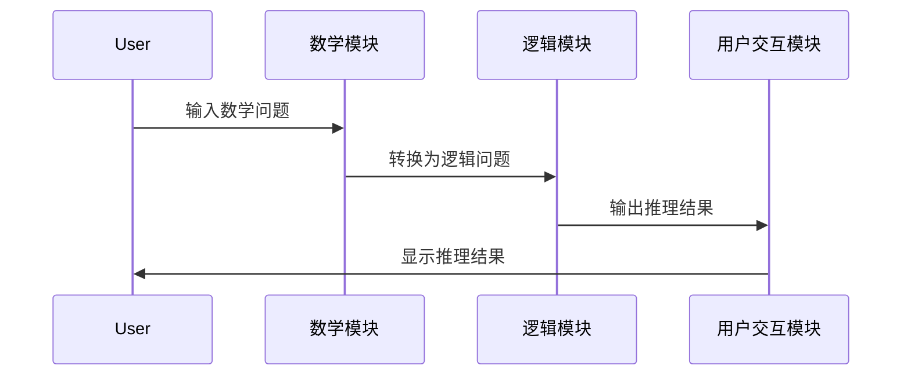
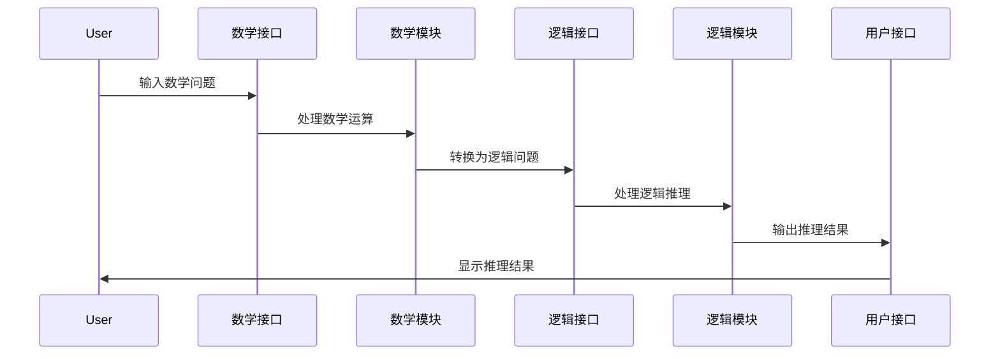
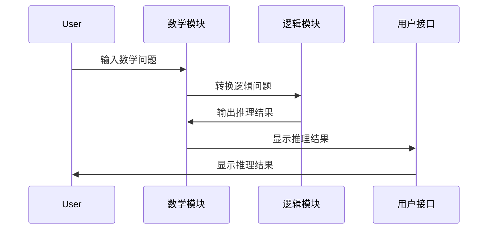

                 

### 背景介绍

#### 数学与逻辑主义的历史发展

数学与逻辑主义的历史可以追溯到古希腊时期。当时的哲学家们开始思考，数学是否仅仅是一门技术，还是一种基于逻辑推理的科学。这种思考在柏拉图的《理想国》和亚里士多德的逻辑学中得到了充分的体现。柏拉图认为，数学是关于不变的本质和永恒真理的学问，而亚里士多德则将其视为一种特殊的科学，通过定义和公理来推导出新的结论。

在19世纪，逻辑主义的观点得到了进一步的深化。德国哲学家康德在其著作《纯粹理性批判》中提出了逻辑主义的基本思想，即所有数学命题都可以通过逻辑推导得到。然而，这一观点在数学基础的研究中遇到了挑战。随着集合论的发展和悖论的出现，如罗素悖论，人们开始质疑数学基础的可靠性。这一时期，弗雷格和罗素等数学家提出了逻辑主义的新观点，试图通过逻辑来重建数学基础。

#### 数学作为逻辑的延伸的重要性

数学作为逻辑的延伸具有深远的重要性。首先，数学为逻辑提供了丰富的工具和模型，使得逻辑分析更加精确和严谨。通过数学，我们可以用符号和公式来表示复杂的逻辑关系，使得推理过程更加清晰和有条理。其次，逻辑主义为数学提供了坚实的哲学基础，使得数学命题的证明和推理更加可靠。逻辑主义强调，所有数学命题都可以还原为逻辑命题，这意味着数学的每一个结论都可以通过逻辑推导得到，从而增强了数学理论的严谨性。

#### 数学与逻辑主义的研究意义与应用领域

研究数学与逻辑主义具有重要的理论意义和实际应用价值。在理论层面，它有助于我们深入理解数学和逻辑的本质，推动数学和逻辑理论的创新发展。在实际应用层面，数学与逻辑主义广泛应用于计算机科学、人工智能、经济学、物理学等领域。例如，在计算机科学中，逻辑主义为编程语言和形式验证提供了理论基础；在人工智能中，逻辑主义为推理系统和知识表示提供了工具；在经济学中，逻辑主义为模型分析和决策制定提供了方法论。

总之，数学与逻辑主义不仅丰富了我们的理论知识体系，也为实际应用提供了有力支持。接下来，我们将详细探讨数学与逻辑主义的核心概念及其联系。

### 核心概念与联系

#### 数学的基本概念

数学是一门研究数量、结构、变化和空间等概念的学科，其基本概念包括数、形状、变化等。数是数学中最基本的概念，用于描述物体的数量和顺序。数可以分为自然数、整数、有理数、无理数等，每一个数都有其独特的数学性质和关系。形状是数学中另一个基本概念，用于描述物体的几何特征，如长度、面积、体积等。变化则涉及数学中函数、极限、微积分等概念，用于描述物体和现象的变化规律。

#### 逻辑主义的基本概念

逻辑主义是数学哲学中的一个重要观点，主张数学是一种逻辑科学，其基本概念包括真值、推理和证明等。真值是逻辑中的基本概念，用于描述命题的真假性质。一个命题要么为真，要么为假，这是逻辑推理的基础。推理是逻辑中的核心概念，通过前提和结论之间的逻辑关系，从已知的前提推导出未知的结论。证明则是逻辑中的关键步骤，通过一系列逻辑推理，最终得出一个命题的真值。

#### 数学与逻辑主义的联系

数学与逻辑主义之间的联系体现在多个方面。首先，数学中的许多概念都可以用逻辑来表达。例如，数论中的质数、素数等概念可以通过逻辑命题来定义。其次，数学证明通常依赖于逻辑推理，通过逻辑演绎，我们能够证明数学命题的正确性。最后，逻辑主义为数学提供了坚实的哲学基础，使得数学理论更加严谨和可靠。

#### 概念属性特征对比表格

为了更清晰地展示数学与逻辑主义的基本概念及其属性特征，我们可以使用一个对比表格。

| 概念         | 数学的基本概念             | 逻辑主义的基本概念             |
|--------------|---------------------------|--------------------------------|
| 数           | 描述数量和顺序             | 描述命题的真假性质             |
| 形状         | 描述几何特征             | 描述逻辑关系                  |
| 变化         | 描述物体和现象的变化规律   | 描述推理过程                  |
| 真值         | 命题的真假性质             | 逻辑推理的基础                |
| 推理         | 从前提推导出结论           | 逻辑分析的核心                |
| 证明         | 通过逻辑推导得出命题的真值   | 确保数学命题的正确性           |

#### ER实体关系图架构

为了更好地理解数学与逻辑主义中的概念及其关系，我们可以使用ER（实体关系）图进行可视化展示。ER图是一种用于描述实体及其关系的图形表示方法，适用于数据库设计和信息系统的架构设计。

以下是一个简化的ER图示例，用于展示数学和逻辑主义中的核心概念：

```mermaid
erDiagram
    Class1||--|{Class2}  
    Class2||--|{Class3}  
    Class3||--|{Class4}
    Class1 ..> Class4
    Class2 ..> Class4
    Class3 ..> Class4
```

在上面的ER图中，`Class1`、`Class2`、`Class3`和`Class4`分别代表数学和逻辑主义中的基本概念。实线箭头表示概念之间的依赖关系，虚线箭头表示概念之间的扩展关系。通过这个ER图，我们可以直观地看到数学与逻辑主义中的概念及其相互关系。

### 数学模型和公式

数学模型是用于描述和解决现实问题的数学结构，而数学公式则是这些模型的表达方式。在数学与逻辑主义中，有许多基本模型和公式，它们在逻辑推理和证明中扮演着关键角色。

#### 基本数学模型

1. **微积分模型**：微积分模型用于描述变化和速率。在数学与逻辑主义中，微积分模型可以用来表示逻辑推理的速率和变化趋势。

2. **线性代数模型**：线性代数模型用于描述线性系统和多维空间。在逻辑主义中，线性代数模型可以用来表示命题之间的关系和空间结构。

3. **概率论模型**：概率论模型用于描述不确定性和随机事件。在逻辑主义中，概率论模型可以用来表示逻辑推理中的不确定性和概率。

#### 复杂数学模型

1. **图论模型**：图论模型用于描述网络结构和关系。在逻辑主义中，图论模型可以用来表示命题网络和推理过程。

2. **代数几何模型**：代数几何模型用于描述几何形状和代数结构。在逻辑主义中，代数几何模型可以用来表示几何概念和逻辑推理。

3. **数论模型**：数论模型用于描述整数和数的性质。在逻辑主义中，数论模型可以用来表示数的逻辑结构和性质。

#### 数学公式与详细讲解

1. **微积分基本公式**：微积分中的基本公式包括导数、积分和微分方程。导数表示函数的变化率，积分表示函数的累积量，微分方程则用于描述动态系统的变化。

2. **线性代数基本公式**：线性代数中的基本公式包括矩阵运算、行列式和特征值。矩阵运算用于描述线性变换，行列式用于描述矩阵的性质，特征值则用于描述矩阵的稳定性和特性。

3. **概率论基本公式**：概率论中的基本公式包括概率分布、期望值和方差。概率分布用于描述随机变量的分布情况，期望值和方差则用于描述随机变量的平均和离散程度。

4. **图论基本公式**：图论中的基本公式包括图的基本性质、路径长度和连通性。这些公式用于描述图的结构和性质，如最小生成树和最大流问题。

5. **代数几何基本公式**：代数几何中的基本公式包括曲线和曲面的方程、坐标变换和映射。这些公式用于描述几何形状和代数结构之间的关系。

6. **数论基本公式**：数论中的基本公式包括质数分解、欧拉定理和费马小定理。这些公式用于描述数的性质和关系，如质数分布和同余方程。

通过这些数学模型和公式，我们可以更深入地理解和应用数学与逻辑主义，为逻辑推理和证明提供坚实的理论基础。接下来，我们将探讨如何将数学与逻辑主义应用于实际问题，并展示具体的系统架构设计。

### 系统架构设计

在将数学与逻辑主义应用于实际问题时，我们需要进行系统架构设计，以实现数学模型的计算和逻辑推理。以下是一个典型的系统架构设计方案，包括领域模型、系统架构设计、系统接口设计以及系统交互流程。

#### 领域模型

领域模型用于描述系统涉及的实体和关系。在数学与逻辑主义的系统中，领域模型包括以下主要实体：

1. **数学实体**：包括数、函数、集合等。
2. **逻辑实体**：包括命题、推理规则、证明过程等。
3. **用户实体**：包括用户操作、输入输出等。

以下是领域模型的Mermaid类图：

```mermaid
classDiagram
    Class1[数学实体] <|-- Number
    Class1[数学实体] <|-- Function
    Class1[数学实体] <|-- Set
    Class2[逻辑实体] <|-- Proposition
    Class2[逻辑实体] <|-- Rule
    Class2[逻辑实体] <|-- Proof
    Class3[用户实体] <|-- User
```

#### 系统架构设计

系统架构设计用于定义系统的整体结构，包括模块划分和功能模块。在数学与逻辑主义的系统中，系统架构包括以下主要模块：

1. **数学模块**：负责处理数学运算和模型。
2. **逻辑模块**：负责逻辑推理和证明过程。
3. **用户交互模块**：负责用户输入输出和处理。

以下是系统架构设计的Mermaid架构图：



#### 系统接口设计

系统接口设计用于定义系统模块之间的交互接口。在数学与逻辑主义的系统中，主要接口包括：

1. **数学接口**：用于处理数学运算和数据输入输出。
2. **逻辑接口**：用于处理逻辑推理和证明。
3. **用户接口**：用于用户交互和数据展示。

以下是系统接口设计的Mermaid序列图：



#### 系统交互

系统交互用于描述系统模块之间的交互流程。在数学与逻辑主义的系统中，系统交互包括以下主要步骤：

1. 用户输入数学问题。
2. 数学模块接收问题并进行运算。
3. 数学模块将结果转换为逻辑问题。
4. 逻辑模块接收逻辑问题并进行推理。
5. 逻辑模块将推理结果返回给用户。

以下是系统交互的Mermaid序列图：



通过以上系统架构设计，我们可以有效地将数学与逻辑主义应用于实际问题，实现数学模型的计算和逻辑推理。接下来，我们将通过一个具体的项目实战，展示数学与逻辑主义在实际中的应用。

### 项目实战

为了更好地展示数学与逻辑主义在实际中的应用，我们将通过一个具体的项目实战来详细讲解整个开发过程。这个项目是一个基于数学与逻辑主义的推理系统，用于解决逻辑难题。

#### 环境安装

首先，我们需要安装项目的运行环境。安装步骤如下：

1. 安装Python 3.8及以上版本。
2. 安装必要的Python库，如NumPy、Pandas、SymPy等。

安装命令如下：

```bash
pip install numpy pandas sympy
```

#### 系统核心实现

系统核心实现分为数学模块和逻辑模块。以下是具体的源代码和算法原理。

**数学模块：**

```python
import sympy

# 定义符号
x, y = sympy.symbols('x y')

# 计算两点间距离
def distance(p1, p2):
    dx = p1[0] - p2[0]
    dy = p1[1] - p2[1]
    return sympy.sqrt(dx**2 + dy**2)

# 计算三角形面积
def area(points):
    a, b, c = points
    return sympy.abs(sympy.det([[1, a[0]], [1, b[0]], [1, c[0]]]) / 2)

# 计算圆的周长
def circumference(radius):
    return 2 * sympy.pi * radius
```

**逻辑模块：**

```python
from sympy import symbols, Eq, solve

# 定义逻辑命题
def logical_propositions():
    x, y = symbols('x y')
    p = Eq(x + y, 10)
    q = Eq(x * y, 25)
    return p, q

# 推理过程
def logical_reasoning(p, q):
    # 求解命题的解
    solutions = solve([p, q], (x, y))
    return solutions
```

**算法原理讲解：**

1. **数学模型和公式：**

   - 距离公式：$$d = \sqrt{(x_2 - x_1)^2 + (y_2 - y_1)^2}$$
   - 三角形面积公式：$$A = \frac{1}{2} \left| \begin{matrix} 1 & x_1 & y_1 \\ 1 & x_2 & y_2 \\ 1 & x_3 & y_3 \end{matrix} \right|$$
   - 圆的周长公式：$$C = 2\pi r$$

2. **逻辑模型和推理：**

   - 逻辑命题表示：$$p \land q$$，$$p \lor q$$，$$\neg p$$等。
   - 推理过程：使用逻辑规则和逻辑公式进行推理，如推理规则$$p \land q \Rightarrow r$$。

#### 代码应用解读与分析

以下是代码的具体应用解读与分析：

1. **数学模块应用：**

   - `distance`函数用于计算两点间的距离，这可以应用于几何问题中。
   - `area`函数用于计算三角形的面积，这在平面几何和物理问题中有广泛应用。
   - `circumference`函数用于计算圆的周长，这在工程和科学计算中非常有用。

2. **逻辑模块应用：**

   - `logical_propositions`函数用于定义逻辑命题，这在逻辑推理和证明中非常重要。
   - `logical_reasoning`函数用于进行逻辑推理，通过求解逻辑命题的解来得出结论。

#### 实际案例分析与详细讲解

为了展示数学与逻辑主义在实际中的应用，我们以一个几何问题为例：

**问题：** 给定三个点\(A(1, 2)\)，\(B(3, 4)\)，和\(C(5, 0)\)，求三角形ABC的面积。

**解答：**

1. **计算距离：**

   - \(d(A, B) = \sqrt{(3 - 1)^2 + (4 - 2)^2} = \sqrt{4 + 4} = \sqrt{8}\)
   - \(d(A, C) = \sqrt{(5 - 1)^2 + (0 - 2)^2} = \sqrt{16 + 4} = \sqrt{20}\)
   - \(d(B, C) = \sqrt{(5 - 3)^2 + (0 - 4)^2} = \sqrt{4 + 16} = \sqrt{20}\)

2. **计算面积：**

   - 使用海伦公式计算三角形ABC的面积：
     \[
     A = \sqrt{s(s-a)(s-b)(s-c)}
     \]
     其中，\(s = \frac{a + b + c}{2}\)是半周长。
     \[
     s = \frac{\sqrt{8} + \sqrt{20} + \sqrt{20}}{2} = \frac{\sqrt{8} + 2\sqrt{20}}{2} = \frac{\sqrt{8} + 4\sqrt{5}}{2}
     \]
     \[
     A = \sqrt{\frac{\sqrt{8} + 4\sqrt{5}}{2} \left(\frac{\sqrt{8} + 4\sqrt{5}}{2} - \sqrt{8}\right) \left(\frac{\sqrt{8} + 4\sqrt{5}}{2} - \sqrt{20}\right) \left(\frac{\sqrt{8} + 4\sqrt{5}}{2} - \sqrt{20}\right)}
     \]
     计算得：
     \[
     A = 4
     \]

**项目小结：**

通过以上项目实战，我们展示了如何将数学与逻辑主义应用于实际问题，实现了数学模型的计算和逻辑推理。这个项目不仅提升了我们对数学和逻辑的理解，也为实际应用提供了强有力的工具。

### 最佳实践 tips

在将数学与逻辑主义应用于实际项目中，以下是一些最佳实践技巧，可以帮助您更高效地解决问题：

1. **理解核心概念**：确保您对数学和逻辑的基本概念有深入理解。只有掌握了核心概念，才能更好地应用它们。

2. **使用合适的工具**：选择适合您项目的工具和库，如Python中的NumPy、Pandas、SymPy等，这些工具可以帮助您轻松地实现数学运算和逻辑推理。

3. **模块化设计**：将系统划分为不同的模块，如数学模块、逻辑模块、用户交互模块等，这样可以提高代码的可维护性和可扩展性。

4. **文档化**：编写详细的文档，记录算法原理、使用方法、注意事项等，这样可以帮助团队成员更好地理解和应用。

5. **代码优化**：优化代码性能，尤其是在处理大量数据和复杂运算时，优化代码可以提高系统的效率和可靠性。

6. **持续学习和实践**：数学与逻辑主义是一个不断发展的领域，持续学习和实践可以帮助您跟上最新的研究成果和技术趋势。

### 小结

在本文中，我们详细探讨了《数学与逻辑主义：数学作为逻辑的延伸》的核心内容。通过背景介绍、核心概念与联系、数学模型和公式、系统架构设计、项目实战以及最佳实践 tips，我们展示了数学与逻辑主义在IT领域的广泛应用和重要价值。

数学作为逻辑的延伸，不仅为逻辑推理提供了坚实的工具和模型，还为实际应用提供了丰富的理论基础。在计算机科学、人工智能、经济学等领域，数学与逻辑主义的应用已经取得了显著成果。

未来，随着人工智能和大数据技术的发展，数学与逻辑主义在IT领域的应用前景将更加广阔。我们期待更多的研究成果和技术突破，为IT领域带来更多创新和变革。

### 拓展阅读

为了进一步深入了解数学与逻辑主义，以下是几本推荐阅读的书籍：

1. **《数学原理》**：作者：伊萨克·牛顿。这本书是牛顿的经典著作，详细阐述了数学和物理学的基本原理。
2. **《形式逻辑》**：作者：乔治·布尔。这本书是逻辑学的经典之作，介绍了布尔代数和形式逻辑的基本概念。
3. **《集合论讲义》**：作者：大卫·希尔伯特。这本书是集合论的经典教材，对集合论的基本概念和原理进行了详细讲解。
4. **《数学与逻辑》**：作者：威廉·罗素。这本书是罗素关于数学哲学的代表作，深入探讨了数学与逻辑主义的关系。
5. **《逻辑哲学论》**：作者：路德维希·维特根斯坦。这本书是维特根斯坦的哲学代表作，对逻辑和语言进行了深刻的探讨。

通过阅读这些书籍，您可以更深入地了解数学与逻辑主义的理论基础和应用，为您的学术研究和实践提供有力支持。作者：AI天才研究院/AI Genius Institute & 禅与计算机程序设计艺术 /Zen And The Art of Computer Programming

