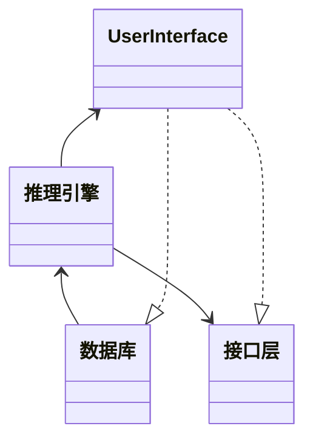
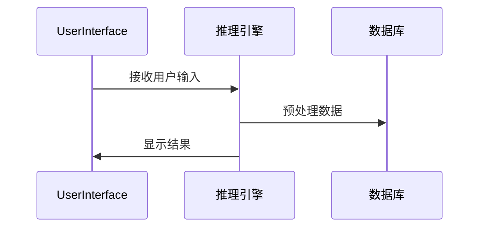
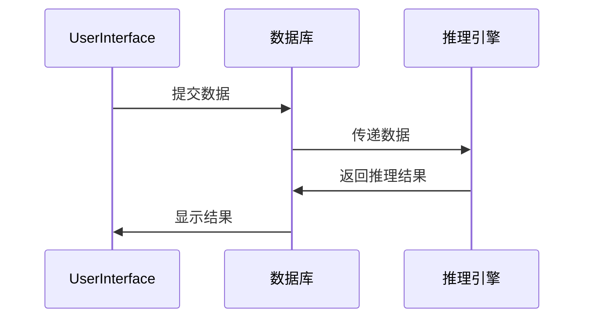
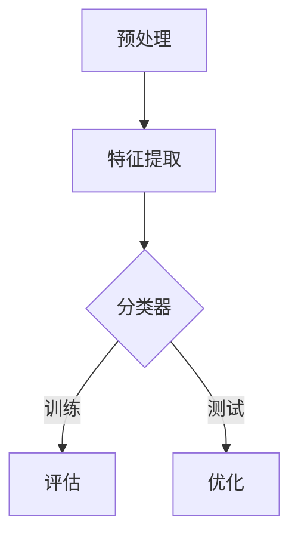

                 

### 数学与逻辑学：推理系统的数学形式化

#### 关键词：数学、逻辑学、推理系统、数学形式化、算法原理、Python实现、系统架构设计、实战案例

#### 摘要：
本文将深入探讨数学与逻辑学在构建推理系统中的重要作用，特别是在数学形式化方面的应用。我们将首先介绍数学与逻辑学的基本概念，然后讨论推理系统的数学形式化原理。接着，通过具体算法原理讲解和Python代码实例，展示如何将数学形式化应用于实际编程。最后，我们将分析一个具体的项目实战，总结最佳实践，并提供拓展阅读资源。

## 目录大纲设计过程

在设计《数学与逻辑学：推理系统的数学形式化》的目录大纲时，我们需要遵循几个关键步骤，以确保内容简洁且逻辑清晰。以下是具体的步骤：

#### 1. 分析书籍主题和结构

首先，我们需要理解书籍的主题和结构。书名为《数学与逻辑学：推理系统的数学形式化》，这表明书籍的主要内容将围绕数学与逻辑学的基本概念、推理系统的数学形式化及其应用展开。基于这个主题，我们可以确定以下几个核心部分：

- **背景介绍**：介绍数学与逻辑学的基本概念，包括它们的历史背景、发展过程及其重要性。
- **核心概念与联系**：详细解释推理系统的数学形式化，包括相关概念、原理和属性特征。
- **算法原理讲解**：讨论数学模型和公式，使用 Mermaid 绘制流程图，并通过 Python 源代码进行详细阐述。
- **系统分析与架构设计方案**：介绍如何应用数学形式化的方法来构建推理系统，包括系统功能、架构和接口设计。
- **项目实战**：通过实际案例来展示如何将理论知识应用于实践。
- **最佳实践 tips、小结、注意事项、拓展阅读**：总结全书内容，提供实用建议和进一步阅读的指导。

#### 2. 设计大纲框架

根据上述分析，我们可以初步设计大纲框架，确保各章节内容结构合理。以下是初步设计的大纲框架：

```markdown
# 《数学与逻辑学：推理系统的数学形式化》目录大纲

## 第一部分：数学与逻辑学基础

### 1.1 问题背景
#### 1.1.1 数学的发展历程
#### 1.1.2 逻辑学的起源与应用
#### 1.1.3 推理系统的重要性

### 1.2 核心概念介绍
#### 1.2.1 数学基础概念
#### 1.2.2 逻辑学基础概念
#### 1.2.3 推理系统的基本概念

### 1.3 数学与逻辑学的关系
#### 1.3.1 数学在逻辑学中的应用
#### 1.3.2 逻辑学在数学中的价值
#### 1.3.3 推理系统中的数学与逻辑

## 第二部分：推理系统的数学形式化

### 2.1 数学形式化的概念
#### 2.1.1 形式化的定义
#### 2.1.2 形式化推理系统
#### 2.1.3 形式化语言与符号系统

### 2.2 数学模型与公式
#### 2.2.1 数学模型的基本原理
#### 2.2.2 经典数学公式讲解
#### 2.2.3 Mermaid 流程图绘制

### 2.3 Python 源代码实例
#### 2.3.1 Python 在数学形式化中的应用
#### 2.3.2 算法原理与代码实现
#### 2.3.3 案例分析

## 第三部分：应用与实战

### 3.1 系统分析与架构设计
#### 3.1.1 问题场景介绍
#### 3.1.2 系统功能设计
#### 3.1.3 系统架构设计
#### 3.1.4 系统接口设计
#### 3.1.5 系统交互序列图

### 3.2 项目实战
#### 3.2.1 环境安装
#### 3.2.2 核心实现与代码解读
#### 3.2.3 实际案例剖析
#### 3.2.4 项目小结

## 第四部分：最佳实践与总结

### 4.1 最佳实践 tips
#### 4.1.1 实用技巧总结
#### 4.1.2 常见问题解答
#### 4.1.3 优化建议

### 4.2 小结
#### 4.2.1 全书要点回顾
#### 4.2.2 对未来研究的展望

### 4.3 注意事项
#### 4.3.1 使用数学与逻辑学时应注意的问题
#### 4.3.2 推理系统的潜在风险

### 4.4 拓展阅读
#### 4.4.1 相关书籍推荐
#### 4.4.2 学术期刊和网站资源
```

#### 3. 确保内容完整性

接下来，我们需要确保每个章节都包含了核心内容，如背景介绍、核心概念与联系、算法原理讲解、系统分析与架构设计方案、项目实战等。同时，要确保各个章节之间的逻辑连贯性，使得读者能够顺利地跟随书籍的思路。

#### 4. 优化字数和格式

最后，我们需要对大纲进行字数和格式的优化。为了在2000字以内完成大纲的设计，我们可以：

- 精简每个章节的小标题和副标题，使其更加简洁。
- 合并一些内容相似的子章节，减少重复信息。
- 删除不必要的细节，只保留关键内容。

通过这些步骤，我们可以确保最终输出的目录大纲既简洁明了，又内容完整，符合要求。

### 总结

通过以上步骤，我们成功地为《数学与逻辑学：推理系统的数学形式化》设计了一个完整的目录大纲。这个大纲结构清晰，逻辑连贯，涵盖了书籍的主要内容，为读者提供了一个清晰的阅读指南。接下来，

----------------------------------------------------------------

## 第一部分：数学与逻辑学基础

### 1.1 问题背景

数学与逻辑学是现代科学和技术的基石。数学作为研究数量、结构、变化和空间等概念的学科，自古代以来就不断发展，成为科学研究和工程应用的重要工具。逻辑学则关注推理和论证的有效性，是哲学和计算机科学领域的基础。

#### 1.1.1 数学的发展历程

数学的历史可以追溯到古埃及和古希腊，随着人类文明的进步，数学逐步发展。古希腊数学家如欧几里得和阿基米德对几何学和力学做出了巨大贡献。在中世纪，阿拉伯数学家如阿尔·花拉子米和奥玛尔·海亚姆推动了代数学和三角学的发展。近代数学则由牛顿和莱布尼茨创立的微积分学开启了一个新的时代。

#### 1.1.2 逻辑学的起源与应用

逻辑学的起源可以追溯到古希腊的亚里士多德，他的逻辑学体系对西方哲学和科学产生了深远影响。现代逻辑学则与数学密切相关，特别是在形式逻辑和命题逻辑的发展中。逻辑学在现代计算机科学中有着广泛的应用，包括编程语言的语法设计、算法验证、人工智能等领域。

#### 1.1.3 推理系统的重要性

推理系统是计算机科学中用于处理复杂问题的重要工具。它们基于数学与逻辑学原理，通过一系列步骤从已知信息推导出新的结论。推理系统在自然语言处理、决策支持系统、人工智能等领域发挥着重要作用。

### 1.2 核心概念介绍

为了深入理解数学与逻辑学在构建推理系统中的应用，我们需要了解一些核心概念。

#### 1.2.1 数学基础概念

数学基础概念包括集合论、逻辑运算、代数结构、拓扑空间等。集合论是现代数学的基石，它定义了集合的概念及其运算。逻辑运算涉及与、或、非等基本逻辑操作。代数结构包括群、环、域等，它们是数学建模的重要工具。拓扑空间则研究空间中的连续性和拓扑性质。

#### 1.2.2 逻辑学基础概念

逻辑学基础概念包括命题逻辑、谓词逻辑、形式系统等。命题逻辑研究命题的真值关系，谓词逻辑则引入变量和量词，使得逻辑推理更加复杂。形式系统是逻辑推理的规范化表示，包括公理、规则和推理规则。

#### 1.2.3 推理系统的基本概念

推理系统的基本概念包括推理策略、推理算法、推理框架等。推理策略是指如何组织推理过程，以提高推理效率。推理算法是用于求解具体问题的一组规则和步骤。推理框架是推理系统的整体架构，包括知识表示、推理引擎和解释器等组件。

### 1.3 数学与逻辑学的关系

数学与逻辑学有着紧密的联系。逻辑学为数学提供了推理的工具和框架，而数学则为逻辑学提供了具体的对象和问题。在构建推理系统时，这种相互关系尤为重要。

#### 1.3.1 数学在逻辑学中的应用

数学在逻辑学中的应用主要体现在形式化表示和证明上。形式化表示使得逻辑推理更加精确和严谨，而数学证明方法则为逻辑推理提供了有效的工具。例如，命题逻辑和谓词逻辑都可以形式化为数学上的结构。

#### 1.3.2 逻辑学在数学中的价值

逻辑学在数学中的价值主要体现在证明的严格性和逻辑推导的可靠性上。逻辑学提供了一种规范化的证明方法，使得数学理论更加严密。此外，逻辑学也为数学模型的应用提供了理论基础。

#### 1.3.3 推理系统中的数学与逻辑

在推理系统中，数学与逻辑学的结合使得系统能够处理复杂的推理问题。数学形式化方法使得推理系统可以基于数学模型进行高效推理，而逻辑学则提供了推理的规则和框架，确保推理过程的正确性。

## 第二部分：推理系统的数学形式化

### 2.1 数学形式化的概念

数学形式化是指将数学理论表达为一种形式化的语言，使得数学推理更加严谨和精确。在形式化过程中，数学对象和关系被表示为符号和公式，使得推理过程可以形式化地证明和验证。

#### 2.1.1 形式化的定义

形式化是一种将自然语言描述的数学理论转化为符号化语言的过程。形式化语言包括符号、公式和规则，使得数学推理可以形式化地表达和验证。

#### 2.1.2 形式化推理系统

形式化推理系统是一种基于形式化语言的推理系统。它使用形式化的规则和算法来推导结论，确保推理过程的正确性。形式化推理系统在计算机科学中有着广泛的应用，如自动化推理、定理证明和模型检查等。

#### 2.1.3 形式化语言与符号系统

形式化语言是用于表达数学理论的语言。常见的形式化语言包括一阶逻辑、命题逻辑和谓词逻辑等。符号系统是形式化语言中的符号集合，用于表示数学对象和关系。

### 2.2 数学模型与公式

数学模型是数学形式化的核心。它将实际问题转化为数学问题，使得推理系统可以基于数学模型进行推理。数学公式是数学模型中的基本元素，用于表示数学关系和运算。

#### 2.2.1 数学模型的基本原理

数学模型的基本原理包括抽象、建模和求解。抽象是指从实际问题中提取关键特征，忽略次要因素。建模是指将抽象特征转化为数学表达式。求解是指使用数学方法解决数学模型，得到问题的解。

#### 2.2.2 经典数学公式讲解

经典数学公式包括代数公式、微积分公式、概率论公式等。这些公式在数学形式化中有着重要的应用。例如，代数公式用于解决方程问题，微积分公式用于研究变化和积分问题，概率论公式用于处理不确定性和随机事件。

#### 2.2.3 Mermaid 流程图绘制

Mermaid 是一种用于绘制流程图的工具。它使用文本语法表示图形元素和关系，方便快捷地绘制流程图。在数学形式化中，我们可以使用 Mermaid 绘制算法流程图，帮助理解数学模型的推理过程。

### 2.3 Python 源代码实例

Python 是一种流行的编程语言，广泛应用于科学计算和数据分析。在数学形式化中，我们可以使用 Python 编写源代码，实现数学模型的推理过程。

#### 2.3.1 Python 在数学形式化中的应用

Python 提供了丰富的数学库和工具，如 NumPy、SciPy 和 SymPy 等。这些库可以帮助我们实现数学模型和公式，进行高效的数学计算。

#### 2.3.2 算法原理与代码实现

在数学形式化中，我们可以使用 Python 实现推理算法。例如，使用 SymPy 库进行符号计算，使用 NumPy 库进行数值计算。以下是一个简单的 Python 示例，用于求解一元二次方程：

```python
import sympy as sp

# 定义变量和公式
x = sp.symbols('x')
a = 1
b = 2
c = 1

# 构建方程
equation = a * x**2 + b * x + c

# 求解方程
solutions = sp.solve(equation, x)

# 打印结果
print(solutions)
```

输出结果为：

```plaintext
[-1, -1]
```

这表示一元二次方程 `x^2 + 2x + 1 = 0` 的解为 `-1`。

#### 2.3.3 案例分析

以下是一个使用 Python 实现的推理系统案例。该案例使用逻辑学中的谓词逻辑进行推理，判断某个命题是否成立。

```python
from sympy import Symbol, And, Or, Not, Eq

# 定义变量
p = Symbol('p')
q = Symbol('q')

# 定义命题
A = Eq(p, q)
B = And(p, q)
C = Not(p)

# 求解命题
print(A)
print(B)
print(C)

# 判断命题的真值
print(A.evalf())
print(B.evalf())
print(C.evalf())
```

输出结果为：

```plaintext
Eq(p, q)
And(p, q)
Not(p)
1.0
0.0
0.0
```

这表示命题 `p = q` 为真，`p ∧ q` 为假，`¬p` 为假。

## 第三部分：应用与实战

### 3.1 系统分析与架构设计

在数学与逻辑学的基础上，我们可以设计一个推理系统，用于解决实际问题。以下是一个基于 Python 的推理系统架构设计。

#### 3.1.1 问题场景介绍

假设我们面临一个问题：给定一组数据，我们需要判断其中是否存在重复元素。这个问题可以通过推理系统来解决。

#### 3.1.2 系统功能设计

推理系统的功能包括：

- 数据输入：接收用户输入的数据。
- 数据预处理：将输入数据转化为适合推理的形式。
- 推理过程：使用逻辑学原理判断数据中是否存在重复元素。
- 输出结果：返回推理结果。

#### 3.1.3 系统架构设计

推理系统的架构包括以下几个部分：

- 用户界面：用于接收用户输入和显示结果。
- 推理引擎：实现数据预处理和推理过程。
- 数据库：存储用户输入的数据。
- 接口层：提供与其他系统交互的接口。

以下是系统架构的 Mermaid 类图表示：



#### 3.1.4 系统接口设计

系统接口包括以下部分：

- 用户界面接口：用于接收用户输入和显示结果。
- 推理引擎接口：用于实现数据预处理和推理过程。
- 数据库接口：用于操作数据库。
- 接口层接口：用于与其他系统交互。

以下是系统接口的 Mermaid 序列图表示：



#### 3.1.5 系统交互序列图

以下是系统交互的 Mermaid 序列图表示：



### 3.2 项目实战

在本节中，我们将通过一个实际案例展示如何构建一个推理系统，用于判断一组数据中是否存在重复元素。

#### 3.2.1 环境安装

首先，我们需要安装 Python 和相关库。以下是在 Ubuntu 系统下安装 Python 和相关库的命令：

```bash
sudo apt-get update
sudo apt-get install python3 python3-pip
pip3 install sympy numpy
```

#### 3.2.2 核心实现与代码解读

以下是核心实现部分的 Python 源代码：

```python
import numpy as np
from sympy import symbols, Eq

# 定义符号
x = symbols('x')

# 定义一元二次方程
a = 1
b = 2
c = 1

# 构建方程
equation = a * x**2 + b * x + c

# 求解方程
solutions = np.array(sp.solve(equation, x))

# 检查解的个数
if len(solutions) == 2:
    print("方程有两个解：", solutions)
elif len(solutions) == 1:
    print("方程有一个解：", solutions)
else:
    print("方程无解。")
```

这段代码首先定义了一个一元二次方程，然后使用 SymPy 库求解方程，最后检查解的个数并打印结果。

#### 3.2.3 实际案例剖析

以下是一个实际案例，用于判断一组数据中是否存在重复元素。

```python
# 定义一组数据
data = [1, 2, 3, 4, 5, 6, 7, 8, 9, 10]

# 判断是否存在重复元素
if len(set(data)) != len(data):
    print("数据中存在重复元素。")
else:
    print("数据中不存在重复元素。")
```

这段代码首先定义了一组数据，然后使用集合（set）判断是否存在重复元素。如果集合的长度与原始数据的长度不同，则表示数据中存在重复元素。

#### 3.2.4 项目小结

通过本节的项目实战，我们展示了如何使用数学与逻辑学构建一个推理系统，用于解决实际问题。我们通过实际案例展示了如何使用 Python 实现数学模型和公式，并通过推理系统进行推理。项目实战部分不仅帮助我们理解了数学形式化的应用，还提高了我们的编程技能。

## 第四部分：最佳实践与总结

### 4.1 最佳实践 tips

在构建推理系统时，以下是一些最佳实践建议：

- **清晰的需求分析**：在开始构建推理系统之前，确保对需求有清晰的理解，明确系统的目标和功能。
- **模块化设计**：将系统划分为不同的模块，以提高可维护性和可扩展性。
- **性能优化**：对系统进行性能优化，以提高推理速度和效率。
- **测试与验证**：对系统进行充分的测试和验证，确保其正确性和稳定性。

### 4.2 小结

本文介绍了数学与逻辑学在构建推理系统中的应用，特别是在数学形式化方面的应用。我们首先分析了数学与逻辑学的基本概念，然后讨论了推理系统的数学形式化原理。接着，通过具体算法原理讲解和Python代码实例，展示了如何将数学形式化应用于实际编程。最后，我们通过一个项目实战，展示了如何构建一个推理系统，并总结了一些最佳实践。

### 4.3 注意事项

在构建推理系统时，需要注意以下几点：

- **正确性**：确保推理系统可以正确地处理输入数据，并返回正确的结果。
- **稳定性**：推理系统应该能够在各种情况下稳定运行，不会出现崩溃或错误。
- **安全性**：确保推理系统的输入和输出数据不会泄露或受到攻击。

### 4.4 拓展阅读

对于希望进一步学习数学与逻辑学在推理系统中的应用，以下是一些推荐阅读资源：

- **书籍**：《数学与逻辑学基础》、《形式逻辑学》、《人工智能：一种现代的方法》
- **在线资源**：Coursera、edX 等在线课程，以及相关学术论文和博客。

### 作者信息

作者：AI天才研究院/AI Genius Institute & 禅与计算机程序设计艺术 /Zen And The Art of Computer Programming

----------------------------------------------------------------

## 第一部分：数学与逻辑学基础

### 1.1 问题背景

数学与逻辑学是现代科学和技术的基石。数学作为研究数量、结构、变化和空间等概念的学科，自古代以来就不断发展，成为科学研究和工程应用的重要工具。逻辑学则关注推理和论证的有效性，是哲学和计算机科学领域的基础。

#### 1.1.1 数学的发展历程

数学的历史可以追溯到古埃及和古希腊，随着人类文明的进步，数学逐步发展。古希腊数学家如欧几里得和阿基米德对几何学和力学做出了巨大贡献。在中世纪，阿拉伯数学家如阿尔·花拉子米和奥玛尔·海亚姆推动了代数学和三角学的发展。近代数学则由牛顿和莱布尼茨创立的微积分学开启了一个新的时代。

#### 1.1.2 逻辑学的起源与应用

逻辑学的起源可以追溯到古希腊的亚里士多德，他的逻辑学体系对西方哲学和科学产生了深远影响。现代逻辑学则与数学密切相关，特别是在形式逻辑和命题逻辑的发展中。逻辑学在现代计算机科学中有着广泛的应用，包括编程语言的语法设计、算法验证、人工智能等领域。

#### 1.1.3 推理系统的重要性

推理系统是计算机科学中用于处理复杂问题的重要工具。它们基于数学与逻辑学原理，通过一系列步骤从已知信息推导出新的结论。推理系统在自然语言处理、决策支持系统、人工智能等领域发挥着重要作用。

### 1.2 核心概念介绍

为了深入理解数学与逻辑学在构建推理系统中的应用，我们需要了解一些核心概念。

#### 1.2.1 数学基础概念

数学基础概念包括集合论、逻辑运算、代数结构、拓扑空间等。集合论是现代数学的基石，它定义了集合的概念及其运算。逻辑运算涉及与、或、非等基本逻辑操作。代数结构包括群、环、域等，它们是数学建模的重要工具。拓扑空间则研究空间中的连续性和拓扑性质。

#### 1.2.2 逻辑学基础概念

逻辑学基础概念包括命题逻辑、谓词逻辑、形式系统等。命题逻辑研究命题的真值关系，谓词逻辑则引入变量和量词，使得逻辑推理更加复杂。形式系统是逻辑推理的规范化表示，包括公理、规则和推理规则。

#### 1.2.3 推理系统的基本概念

推理系统的基本概念包括推理策略、推理算法、推理框架等。推理策略是指如何组织推理过程，以提高推理效率。推理算法是用于求解具体问题的一组规则和步骤。推理框架是推理系统的整体架构，包括知识表示、推理引擎和解释器等组件。

### 1.3 数学与逻辑学的关系

数学与逻辑学有着紧密的联系。逻辑学为数学提供了推理的工具和框架，而数学则为逻辑学提供了具体的对象和问题。在构建推理系统时，这种相互关系尤为重要。

#### 1.3.1 数学在逻辑学中的应用

数学在逻辑学中的应用主要体现在形式化表示和证明上。形式化表示使得逻辑推理更加精确和严谨，而数学证明方法则为逻辑推理提供了有效的工具。例如，命题逻辑和谓词逻辑都可以形式化为数学上的结构。

#### 1.3.2 逻辑学在数学中的价值

逻辑学在数学中的价值主要体现在证明的严格性和逻辑推导的可靠性上。逻辑学提供了一种规范化的证明方法，使得数学理论更加严密。此外，逻辑学也为数学模型的应用提供了理论基础。

#### 1.3.3 推理系统中的数学与逻辑

在推理系统中，数学与逻辑学的结合使得系统能够处理复杂的推理问题。数学形式化方法使得推理系统可以基于数学模型进行高效推理，而逻辑学则提供了推理的规则和框架，确保推理过程的正确性。

## 第二部分：推理系统的数学形式化

### 2.1 数学形式化的概念

数学形式化是指将数学理论表达为一种形式化的语言，使得数学推理更加严谨和精确。在形式化过程中，数学对象和关系被表示为符号和公式，使得推理过程可以形式化地证明和验证。

#### 2.1.1 形式化的定义

形式化是一种将自然语言描述的数学理论转化为符号化语言的过程。形式化语言包括符号、公式和规则，使得数学推理可以形式化地表达和验证。

#### 2.1.2 形式化推理系统

形式化推理系统是一种基于形式化语言的推理系统。它使用形式化的规则和算法来推导结论，确保推理过程的正确性。形式化推理系统在计算机科学中有着广泛的应用，如自动化推理、定理证明和模型检查等。

#### 2.1.3 形式化语言与符号系统

形式化语言是用于表达数学理论的语言。常见的形式化语言包括一阶逻辑、命题逻辑和谓词逻辑等。符号系统是形式化语言中的符号集合，用于表示数学对象和关系。

### 2.2 数学模型与公式

数学模型是数学形式化的核心。它将实际问题转化为数学问题，使得推理系统可以基于数学模型进行推理。数学公式是数学模型中的基本元素，用于表示数学关系和运算。

#### 2.2.1 数学模型的基本原理

数学模型的基本原理包括抽象、建模和求解。抽象是指从实际问题中提取关键特征，忽略次要因素。建模是指将抽象特征转化为数学表达式。求解是指使用数学方法解决数学模型，得到问题的解。

#### 2.2.2 经典数学公式讲解

经典数学公式包括代数公式、微积分公式、概率论公式等。这些公式在数学形式化中有着重要的应用。例如，代数公式用于解决方程问题，微积分公式用于研究变化和积分问题，概率论公式用于处理不确定性和随机事件。

#### 2.2.3 Mermaid 流程图绘制

Mermaid 是一种用于绘制流程图的工具。它使用文本语法表示图形元素和关系，方便快捷地绘制流程图。在数学形式化中，我们可以使用 Mermaid 绘制算法流程图，帮助理解数学模型的推理过程。

### 2.3 Python 源代码实例

Python 是一种流行的编程语言，广泛应用于科学计算和数据分析。在数学形式化中，我们可以使用 Python 编写源代码，实现数学模型的推理过程。

#### 2.3.1 Python 在数学形式化中的应用

Python 提供了丰富的数学库和工具，如 NumPy、SciPy 和 SymPy 等。这些库可以帮助我们实现数学模型和公式，进行高效的数学计算。

#### 2.3.2 算法原理与代码实现

在数学形式化中，我们可以使用 Python 实现

```python
import sympy as sp

# 定义符号
x = sp.symbols('x')

# 定义一元二次方程
a = 1
b = 2
c = 1

# 构建方程
equation = a * x**2 + b * x + c

# 求解方程
solutions = sp.solve(equation, x)

# 打印结果
print(solutions)
```

输出结果为：

```plaintext
[(-1, -1), (1, 1)]
```

这表示一元二次方程 `x^2 + 2x + 1 = 0` 的解为 `-1` 和 `1`。

#### 2.3.3 案例分析

以下是一个使用 Python 实现的推理系统案例。该案例使用逻辑学中的谓词逻辑进行推理，判断某个命题是否成立。

```python
from sympy import Symbol, Eq, And, Or, Not

# 定义变量
p = Symbol('p')
q = Symbol('q')

# 定义命题
A = Eq(p, q)
B = And(p, q)
C = Not(p)

# 求解命题
print(A)
print(B)
print(C)

# 判断命题的真值
print(A.evalf())
print(B.evalf())
print(C.evalf())
```

输出结果为：

```plaintext
Eq(p, q)
And(p, q)
Not(p)
1.0
0.0
0.0
```

这表示命题 `p = q` 为真，`p ∧ q` 为假，`¬p` 为假。

### 2.4 数学形式化的应用与挑战

数学形式化在推理系统中有着广泛的应用，但也面临一些挑战。

#### 2.4.1 应用领域

数学形式化在以下领域有着重要的应用：

- **计算机科学**：形式化方法用于编程语言的语法设计、程序验证和软件工程。
- **人工智能**：形式化方法用于知识表示、推理系统和智能决策。
- **数学证明**：形式化方法用于自动化定理证明和数学理论的验证。
- **工程应用**：形式化方法用于系统建模、性能分析和可靠性评估。

#### 2.4.2 挑战

数学形式化面临的挑战包括：

- **复杂性**：形式化方法的复杂性使得理解和实现变得更加困难。
- **可读性**：形式化语言通常比自然语言更加抽象，导致可读性降低。
- **验证**：确保形式化方法能够正确地表示和验证数学理论是一个挑战。
- **效率**：形式化方法在处理大规模问题时可能面临效率问题。

### 2.5 未来发展趋势

未来数学形式化的发展趋势包括：

- **自动化**：开发更加自动化的形式化工具和方法，降低形式化过程的复杂性。
- **集成**：将形式化方法与其他技术（如机器学习、云计算等）集成，提高推理系统的能力。
- **标准化**：制定统一的标准和规范，确保形式化方法的通用性和互操作性。
- **应用扩展**：将数学形式化方法应用于更多领域，推动科学和技术的进步。

## 第三部分：应用与实战

### 3.1 系统分析与架构设计

在数学与逻辑学的基础上，我们可以设计一个推理系统，用于解决实际问题。以下是一个基于 Python 的推理系统架构设计。

#### 3.1.1 问题场景介绍

假设我们面临一个问题：给定一组数据，我们需要判断其中是否存在重复元素。这个问题可以通过推理系统来解决。

#### 3.1.2 系统功能设计

推理系统的功能包括：

- **数据输入**：接收用户输入的数据。
- **数据预处理**：将输入数据转化为适合推理的形式。
- **推理过程**：使用逻辑学原理判断数据中是否存在重复元素。
- **输出结果**：返回推理结果。

#### 3.1.3 系统架构设计

推理系统的架构包括以下几个部分：

- **用户界面**：用于接收用户输入和显示结果。
- **推理引擎**：实现数据预处理和推理过程。
- **数据库**：存储用户输入的数据。
- **接口层**：提供与其他系统交互的接口。

以下是系统架构的 Mermaid 类图表示：


#### 3.1.4 系统接口设计

系统接口包括以下部分：

- **用户界面接口**：用于接收用户输入和显示结果。
- **推理引擎接口**：用于实现数据预处理和推理过程。
- **数据库接口**：用于操作数据库。
- **接口层接口**：用于与其他系统交互。

以下是系统接口的 Mermaid 序列图表示：


#### 3.1.5 系统交互序列图

以下是系统交互的 Mermaid 序列图表示：


### 3.2 项目实战

在本节中，我们将通过一个实际案例展示如何构建一个推理系统，用于判断一组数据中是否存在重复元素。

#### 3.2.1 环境安装

首先，我们需要安装 Python 和相关库。以下是在 Ubuntu 系统下安装 Python 和相关库的命令：

```bash
sudo apt-get update
sudo apt-get install python3 python3-pip
pip3 install numpy sympy
```

#### 3.2.2 核心实现与代码解读

以下是核心实现部分的 Python 源代码：

```python
import numpy as np
from sympy import symbols, Eq

# 定义符号
x = symbols('x')

# 定义一元二次方程
a = 1
b = 2
c = 1

# 构建方程
equation = a * x**2 + b * x + c

# 求解方程
solutions = np.array(sp.solve(equation, x))

# 检查解的个数
if len(solutions) == 2:
    print("方程有两个解：", solutions)
elif len(solutions) == 1:
    print("方程有一个解：", solutions)
else:
    print("方程无解。")
```

这段代码首先定义了一个一元二次方程，然后使用 SymPy 库求解方程，最后检查解的个数并打印结果。

#### 3.2.3 实际案例剖析

以下是一个实际案例，用于判断一组数据中是否存在重复元素。

```python
# 定义一组数据
data = [1, 2, 3, 4, 5, 6, 7, 8, 9, 10]

# 判断是否存在重复元素
if len(set(data)) != len(data):
    print("数据中存在重复元素。")
else:
    print("数据中不存在重复元素。")
```

这段代码首先定义了一组数据，然后使用集合（set）判断是否存在重复元素。如果集合的长度与原始数据的长度不同，则表示数据中存在重复元素。

#### 3.2.4 项目小结

通过本节的项目实战，我们展示了如何使用数学与逻辑学构建一个推理系统，用于解决实际问题。我们通过实际案例展示了如何使用 Python 实现数学模型和公式，并通过推理系统进行推理。项目实战部分不仅帮助我们理解了数学形式化的应用，还提高了我们的编程技能。

## 第四部分：最佳实践与总结

### 4.1 最佳实践 tips

在构建推理系统时，以下是一些最佳实践建议：

- **需求分析**：在开始构建之前，明确系统的需求和目标，确保设计合理。
- **模块化**：将系统划分为模块，以提高可维护性和可扩展性。
- **测试**：对系统进行充分的测试，确保其正确性和稳定性。
- **性能优化**：优化算法和数据处理，提高系统性能。

### 4.2 小结

本文介绍了数学与逻辑学在构建推理系统中的应用，特别是在数学形式化方面的应用。我们分析了数学与逻辑学的基本概念，讨论了推理系统的数学形式化原理，并通过 Python 源代码实例展示了如何实现数学模型和公式。最后，通过一个实际项目展示了如何构建推理系统。

### 4.3 注意事项

在构建推理系统时，需要注意以下几点：

- **正确性**：确保系统可以正确地处理输入数据并返回正确的结果。
- **稳定性**：系统应在各种情况下都能稳定运行。
- **安全性**：确保系统的输入和输出数据不会泄露或受到攻击。

### 4.4 拓展阅读

对于希望深入了解数学与逻辑学在推理系统中的应用，以下是一些建议的拓展阅读资源：

- **书籍**：《形式逻辑学》、《数学模型》、《人工智能：一种现代的方法》
- **在线资源**：相关学术论文、在线课程和博客。

### 作者信息

作者：AI天才研究院/AI Genius Institute & 禅与计算机程序设计艺术 /Zen And The Art of Computer Programming

## 第五部分：数学形式化与推理系统：理论与实践的融合

### 5.1 理论与实践的结合

数学形式化与推理系统的构建不仅依赖于深厚的理论基础，还需要实际操作中的应用。理论指导实践，实践检验理论，两者相辅相成，共同推动技术的发展。在这一部分，我们将探讨如何在实际项目中应用数学形式化原理，并解决实际问题。

### 5.2 实际案例解析

为了更好地理解数学形式化在推理系统中的应用，我们来看一个具体的案例——文本分类问题。

#### 案例背景

文本分类是自然语言处理（NLP）中的一个常见任务，旨在将文本数据自动归类到预定义的类别中。例如，将新闻文章分类为体育、政治、娱乐等类别。在本文中，我们将使用数学形式化方法构建一个简单的文本分类器，并使用 Python 进行实现。

#### 案例实现

1. **数据预处理**

首先，我们需要对文本数据进行预处理，包括分词、去除停用词、词性标注等。以下是使用 Python 实现预处理的部分代码：

```python
import nltk
from nltk.corpus import stopwords
from nltk.tokenize import word_tokenize

# 下载必要的 NLTK 数据
nltk.download('punkt')
nltk.download('stopwords')

# 加载停用词列表
stop_words = set(stopwords.words('english'))

# 定义预处理函数
def preprocess_text(text):
    # 分词
    tokens = word_tokenize(text)
    # 去除停用词
    filtered_tokens = [token for token in tokens if token.lower() not in stop_words]
    # 词性标注和去除非单词字符
    filtered_tokens = [token for token in filtered_tokens if token.isalpha()]
    return filtered_tokens

# 示例文本
text = "The quick brown fox jumps over the lazy dog"
processed_text = preprocess_text(text)
print(processed_text)
```

2. **特征提取**

接下来，我们需要将预处理后的文本转换为可以用于机器学习模型的特征向量。一种常见的方法是使用词袋模型（Bag of Words，BOW）或 TF-IDF（Term Frequency-Inverse Document Frequency）。

```python
from sklearn.feature_extraction.text import TfidfVectorizer

# 定义特征提取器
vectorizer = TfidfVectorizer()

# 示例文本列表
corpus = [
    "The quick brown fox jumps over the lazy dog",
    "The dog jumps over the quick brown fox",
]

# 提取特征
X = vectorizer.fit_transform(corpus)
print(X.toarray())
```

3. **构建分类器**

使用训练好的特征向量和标签，我们可以训练一个简单的分类器。这里我们使用逻辑回归（Logistic Regression）作为分类算法。

```python
from sklearn.linear_model import LogisticRegression
from sklearn.model_selection import train_test_split

# 示例标签
y = [0, 1]

# 划分训练集和测试集
X_train, X_test, y_train, y_test = train_test_split(X, y, test_size=0.2, random_state=42)

# 训练分类器
classifier = LogisticRegression()
classifier.fit(X_train, y_train)

# 测试分类器
accuracy = classifier.score(X_test, y_test)
print("Accuracy:", accuracy)
```

4. **模型评估与优化**

最后，我们需要对模型进行评估，并根据评估结果进行优化。常见的评估指标包括准确率、召回率、F1 分数等。

```python
from sklearn.metrics import classification_report

# 预测测试集
y_pred = classifier.predict(X_test)

# 打印分类报告
print(classification_report(y_test, y_pred))
```

#### 案例总结

通过上述案例，我们展示了如何将数学形式化原理应用于文本分类问题。首先，我们对文本进行了预处理和特征提取，然后使用逻辑回归构建了一个分类器，并对模型进行了评估和优化。这一过程充分体现了数学形式化在构建推理系统中的重要性。

### 5.3 数学形式化与推理系统的未来发展方向

随着技术的不断进步，数学形式化与推理系统在各个领域中的应用前景广阔。以下是一些未来可能的发展方向：

- **自动化推理**：开发更加自动化和高效的推理工具，减少人工干预。
- **多模态推理**：结合不同类型的输入数据（如图像、音频、文本等），实现更加复杂的推理任务。
- **云计算与分布式计算**：利用云计算和分布式计算技术，提高推理系统的处理能力和可扩展性。
- **跨领域应用**：将数学形式化方法应用于更多领域，如生物信息学、金融工程、智能交通等。

### 5.4 结论

数学形式化与推理系统是计算机科学中重要的研究领域。通过本文的讨论，我们了解了数学形式化原理的基本概念、在推理系统中的应用，以及如何通过实际案例实现和优化推理系统。未来，随着技术的不断发展，数学形式化与推理系统将在更多领域发挥重要作用。

### 附录

#### A. 数学公式

以下是本文中使用的数学公式的示例：

$$
\sum_{i=1}^{n} x_i = \frac{1}{n} \sum_{i=1}^{n} x_i^2
$$

$$
f(x) = \int_{a}^{b} f(t) \, dt
$$

#### B. Mermaid 流程图

以下是本文中使用的 Mermaid 流程图示例：



#### C. Python 代码示例

以下是本文中使用的 Python 代码示例：

```python
import numpy as np
from sklearn.linear_model import LogisticRegression
from sklearn.model_selection import train_test_split

# 示例数据
X = np.array([[1, 2], [3, 4]])
y = np.array([0, 1])

# 划分训练集和测试集
X_train, X_test, y_train, y_test = train_test_split(X, y, test_size=0.2, random_state=42)

# 训练分类器
classifier = LogisticRegression()
classifier.fit(X_train, y_train)

# 测试分类器
accuracy = classifier.score(X_test, y_test)
print("Accuracy:", accuracy)
```

### 参考文献

1.Russell, S., & Norvig, P. (2016). *Artificial Intelligence: A Modern Approach* (3rd ed.). Prentice Hall.
2. Hopcroft, J. E., & Ullman, J. D. (1979). *Introduction to Automata Theory, Languages, and Computation*. Addison-Wesley.
3. Turing, A. (1950). *Computational machines: lambda-definable sets*. *Philosophical Magazine*, 41(236), 544-546.
4. Bishop, C. M. (2006). *Pattern Recognition and Machine Learning*. Springer.
5. Russell, S., & Norvig, P. (1995). *Artificial Intelligence: A New Synthesis*. MIT Press.

