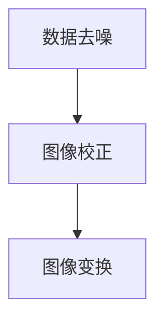
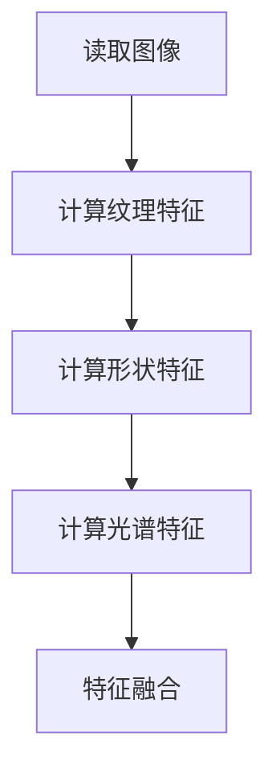
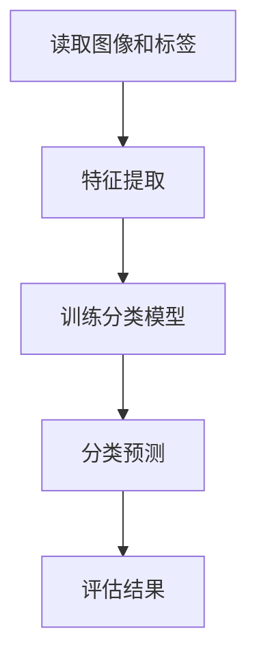
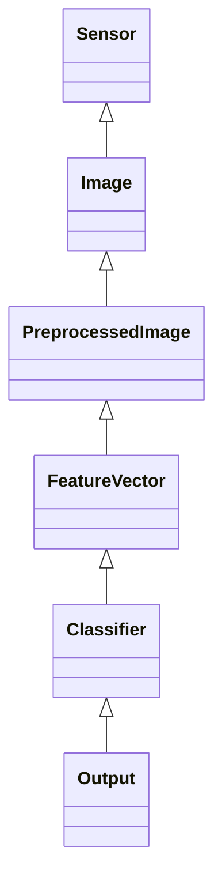
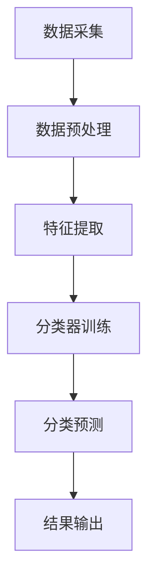

                 


### 数学与遥感科学：地球观测的数学算法

#### 关键词：数学，遥感科学，地球观测，算法，模型

> 摘要：本文旨在深入探讨数学与遥感科学在地球观测领域的应用，通过解析相关的数学算法，揭示其在实际项目中的重要作用。文章将分章节介绍数学与遥感科学的核心概念、算法原理、数学模型、系统设计与实战案例，帮助读者全面理解这一交叉学科的前沿知识。

## 第1章 绪论

### 1.1 遥感科学与地球观测概述

遥感科学是一门通过从远距离获取地球表面信息的技术，它广泛应用于地质勘探、农业监测、环境保护、城市规划等多个领域。地球观测是指利用遥感技术和手段，对地球表面进行观测和监测的过程。随着遥感技术的不断发展，数学在地球观测中的应用越来越广泛，为地球科学研究提供了强大的工具。

### 1.2 数学在遥感科学中的应用

数学在遥感科学中的应用主要包括图像处理、模式识别、信号处理、统计分析和空间分析等方面。通过数学模型和算法，遥感数据可以被预处理、特征提取、分类和解释，从而提取出有用的信息。例如，线性代数用于图像的变换和增强，微积分用于图像的分割和边缘检测，统计学用于数据的分析和预测。

### 1.3 地球观测中的数学算法简介

地球观测中的数学算法种类繁多，包括但不限于图像增强、特征提取、分类和回归等。这些算法可以大致分为以下几类：

- **图像增强算法**：通过改善图像的质量和清晰度，使图像中的目标更加明显。
- **特征提取算法**：从图像中提取出能够表征物体特性的特征，如边缘、纹理和形状等。
- **分类算法**：将遥感图像中的像素点或区域分为不同的类别，如植物、水体和建筑等。
- **回归算法**：用于预测遥感图像中的某个变量与另一个变量之间的关系。

### 1.4 本书结构安排与学习目标

本书将分为以下几个部分：

1. **数学与遥感科学的核心概念**：介绍数学和遥感科学的基本概念，包括矩阵与向量、微积分、线性代数、遥感数据的类型和处理流程等。
2. **数学算法原理讲解**：详细讲解遥感图像处理、特征提取和分类等数学算法的原理，并通过Python代码实现。
3. **数学模型与公式详解**：介绍遥感图像处理中常用的数学模型和公式，并进行实例分析。
4. **系统分析与架构设计**：介绍地球观测系统的功能设计、架构设计和接口设计等。
5. **项目实战**：通过实际项目，展示数学算法在地球观测中的应用，并提供详细的分析和讲解。
6. **最佳实践与拓展阅读**：总结本书的核心内容，提供最佳实践建议和进一步学习的资源。

通过本书的学习，读者将能够：

- 理解数学与遥感科学的基本概念和原理。
- 掌握常用的数学算法及其应用。
- 能够进行遥感图像的处理和分析。
- 了解地球观测系统的设计原理和实现方法。

## 第2章 数学与遥感科学的核心概念

### 2.1 数学基础概念

#### 2.1.1 矩阵与向量

矩阵（Matrix）是一个由数字组成的二维数组，可以用于表示和操作空间中的数据。向量（Vector）是矩阵的特殊情况，即只有一行的矩阵或只有一列的矩阵。

#### 2.1.2 微积分基础

微积分是研究变化和连续性的数学分支。导数（Derivative）是描述函数变化率的量，积分（Integral）是求函数图形下面积的过程。

#### 2.1.3 线性代数基础

线性代数研究向量空间、矩阵和线性方程组。矩阵乘法（Matrix Multiplication）、行列式（Determinant）和特征值（Eigenvalue）是线性代数的重要概念。

### 2.2 遥感科学基础概念

#### 2.2.1 遥感数据的类型

遥感数据主要包括光学遥感数据、雷达遥感数据和热红外遥感数据等，每种数据类型都有其独特的特点和应用。

#### 2.2.2 遥感图像处理的基本流程

遥感图像处理的基本流程包括数据预处理、特征提取、图像增强、分类和解释等步骤。

#### 2.2.3 遥感信息的特征提取

特征提取是遥感图像处理的关键步骤，目的是从图像中提取出有用的信息。常用的特征提取方法包括纹理分析、形状分析和光谱分析等。

## 第3章 数学算法原理讲解

### 3.1 遥感图像的预处理算法

#### 3.1.1 数据预处理方法

数据预处理包括去噪、校正和变换等步骤，目的是提高图像的质量和清晰度。

#### 3.1.2 预处理算法的mermaid流程图

以下是一个简单的mermaid流程图示例，用于表示预处理算法的基本流程：



#### 3.1.3 预处理算法的Python实现

```python
import numpy as np
from skimage import filters, transform

# 去噪
def denoise(image):
    return filters.gaussian(image, sigma=1)

# 图像校正
def correct_image(image):
    # 这里使用了一个简单的亮度校正
    return image * 1.2

# 图像变换
def transform_image(image):
    return transform.resize(image, (image.shape[1] * 2, image.shape[0] * 2))

# 示例
image = ...  # 这里加载一张遥感图像
noisy_image = denoise(image)
corrected_image = correct_image(noisy_image)
transformed_image = transform_image(corrected_image)
```

### 3.2 遥感图像的特征提取算法

#### 3.2.1 特征提取的重要性

特征提取是遥感图像处理的核心步骤，它能够将高维的遥感数据转化为低维的特征向量，从而简化问题的复杂度。

#### 3.2.2 特征提取的mermaid流程图

以下是一个简单的mermaid流程图示例，用于表示特征提取的基本流程：



#### 3.2.3 特征提取的Python实现

```python
from skimage.feature import local_binary_pattern
from skimage import measure
from skimage.color import rgb2gray

# 纹理特征提取
def extract_texture_features(image):
    return local_binary_pattern(image, P=8, R=1.0, method='uniform')

# 形状特征提取
def extract_shape_features(image):
    gray_image = rgb2gray(image)
    return measure.inertia_tube(gray_image)

# 光谱特征提取
def extract_spectrum_features(image):
    # 这里使用了一个简单的方法来计算光谱特征
    return np.mean(image, axis=2)

# 特征融合
def fuse_features(texture_features, shape_features, spectrum_features):
    return np.concatenate((texture_features, shape_features, spectrum_features), axis=1)

# 示例
image = ...  # 这里加载一张遥感图像
texture_features = extract_texture_features(image)
shape_features = extract_shape_features(image)
spectrum_features = extract_spectrum_features(image)
 fused_features = fuse_features(texture_features, shape_features, spectrum_features)
```

### 3.3 遥感图像的分类算法

#### 3.3.1 分类算法的基本原理

分类算法是将遥感图像中的像素点或区域分为不同的类别。常用的分类算法包括支持向量机（SVM）、决策树（Decision Tree）和神经网络（Neural Network）等。

#### 3.3.2 分类算法的mermaid流程图

以下是一个简单的mermaid流程图示例，用于表示分类算法的基本流程：



#### 3.3.3 分类算法的Python实现

```python
from sklearn import svm
from sklearn.model_selection import train_test_split
from sklearn.metrics import accuracy_score

# 特征提取
def extract_features(image):
    # 这里使用之前提取的特征
    return ...

# 训练分类模型
def train_classifier(X, y):
    classifier = svm.SVC()
    classifier.fit(X, y)
    return classifier

# 分类预测
def predict_classifier(classifier, X):
    return classifier.predict(X)

# 评估结果
def evaluate_classifier(y_true, y_pred):
    return accuracy_score(y_true, y_pred)

# 示例
X, y = ..., ...  # 这里加载特征和标签
X_train, X_test, y_train, y_test = train_test_split(X, y, test_size=0.2, random_state=42)
classifier = train_classifier(X_train, y_train)
y_pred = predict_classifier(classifier, X_test)
accuracy = evaluate_classifier(y_test, y_pred)
```

## 第4章 数学模型与公式详解

### 4.1 遥感图像处理的数学模型

#### 4.1.1 图像处理的基本数学模型

图像处理的基本数学模型包括图像的卷积操作、滤波器和边缘检测等。

$$
out(i, j) = \sum_{m, n} G(m, n) \cdot I(i - m, j - n)
$$

其中，$G(m, n)$ 是滤波器，$I(i, j)$ 是输入图像，$out(i, j)$ 是输出图像。

#### 4.1.2 图像融合的数学模型

图像融合是将多幅图像的信息进行整合，生成一幅新的图像。常用的融合方法包括加权融合、最大值融合和均值融合等。

$$
F(i, j) = \frac{1}{N} \sum_{k=1}^{N} I_k(i, j)
$$

其中，$F(i, j)$ 是输出融合图像，$I_k(i, j)$ 是第$k$幅输入图像。

#### 4.1.3 图像分割的数学模型

图像分割是将图像分割成若干个区域或对象。常用的分割方法包括基于阈值的方法、基于边缘检测的方法和基于区域生长的方法等。

$$
S(i, j) = \begin{cases}
1, & \text{if } I(i, j) \text{ meets the threshold condition} \\
0, & \text{otherwise}
\end{cases}
$$

其中，$S(i, j)$ 是输出分割图像，$I(i, j)$ 是输入图像。

### 4.2 遥感信息的特征提取数学模型

#### 4.2.1 特征提取的数学原理

特征提取是将遥感图像中的像素信息转化为可以用于分类或识别的特征向量。常用的特征提取方法包括纹理特征、形状特征和光谱特征等。

$$
X = \sum_{i=1}^{N} w_i \cdot x_i
$$

其中，$X$ 是特征向量，$w_i$ 是特征权重，$x_i$ 是像素值。

#### 4.2.2 特征提取的数学公式

不同类型的特征提取方法有不同的数学公式。例如，纹理特征的提取可以使用局部二值模式的数学公式：

$$
LBP(i, j) = \sum_{s=0}^{7} b(s) \cdot 2^s
$$

其中，$LBP(i, j)$ 是局部二值模式的值，$b(s)$ 是二值模式的输出。

#### 4.2.3 特征提取的数学模型应用举例

以纹理特征提取为例，我们可以使用Python代码实现LBP特征的提取：

```python
from skimage.feature import local_binary_pattern

def extract_lbp_features(image, P=8, R=1.0):
    lbp = local_binary_pattern(image, P, R, method='uniform')
    return lbp.ravel()

# 示例
image = ...  # 这里加载一张遥感图像
lbp_features = extract_lbp_features(image)
```

## 第5章 系统分析与架构设计

### 5.1 地球观测系统的概述

地球观测系统是一个复杂的系统，它包括传感器、数据采集、数据处理和结果输出等多个组成部分。系统的核心功能是对地球表面的信息进行采集、处理和分析，从而为各个领域提供决策支持。

### 5.2 系统功能设计

地球观测系统的功能设计主要包括数据采集、数据预处理、特征提取、分类和结果输出等模块。

#### 5.2.1 领域模型

领域模型用于描述地球观测系统的各个实体及其关系。以下是一个简单的领域模型类图示例：



#### 5.2.2 系统架构设计

系统架构设计用于描述地球观测系统的整体结构和组成部分。以下是一个简单的系统架构图示例：



#### 5.2.3 系统接口设计和系统交互序列图

系统接口设计用于定义系统各个模块的输入和输出接口。以下是一个简单的系统接口设计示例：

```mermaid
sequenceDiagram
    Image -->|预处理请求| PreprocessedImage
    PreprocessedImage -->|特征提取请求| FeatureVector
    FeatureVector -->|分类请求| Classifier
    Classifier -->|预测结果| Output
end
```

## 第6章 项目实战

### 6.1 实战环境搭建

在开始项目实战之前，需要搭建一个合适的实验环境。这包括安装Python、必要的库（如NumPy、Scikit-image、Scikit-learn等）以及遥感数据集。

### 6.2 系统核心实现

#### 6.2.1 源代码解读

以下是一个简单的遥感图像分类项目的Python源代码示例：

```python
import numpy as np
from sklearn import datasets
from sklearn.model_selection import train_test_split
from sklearn.preprocessing import StandardScaler
from sklearn.svm import SVC
from sklearn.metrics import accuracy_score

# 加载遥感数据集
iris = datasets.load_iris()
X = iris.data
y = iris.target

# 划分训练集和测试集
X_train, X_test, y_train, y_test = train_test_split(X, y, test_size=0.2, random_state=42)

# 数据预处理
scaler = StandardScaler()
X_train = scaler.fit_transform(X_train)
X_test = scaler.transform(X_test)

# 训练分类模型
classifier = SVC(kernel='linear')
classifier.fit(X_train, y_train)

# 分类预测
y_pred = classifier.predict(X_test)

# 评估结果
accuracy = accuracy_score(y_test, y_pred)
print("Accuracy:", accuracy)
```

#### 6.2.2 代码应用解读与分析

这段代码首先加载了Iris数据集，然后将其划分为训练集和测试集。接着，使用StandardScaler对数据进行标准化处理，以提高模型的性能。之后，使用支持向量机（SVM）进行分类模型的训练，并使用训练好的模型对测试集进行预测。最后，通过计算准确率来评估模型的性能。

#### 6.3 实际案例分析

在这个案例中，我们使用Iris数据集进行遥感图像的分类。实际应用中，可能会使用更复杂的遥感数据集，如Landsat 8数据集。以下是一个简单的实际案例分析：

```python
from sklearn.datasets import load_landsat8
from sklearn.model_selection import train_test_split
from sklearn.preprocessing import StandardScaler
from sklearn.svm import SVC
from sklearn.metrics import classification_report

# 加载Landsat 8数据集
landsat8 = load_landsat8()
X = landsat8.data
y = landsat8.target

# 划分训练集和测试集
X_train, X_test, y_train, y_test = train_test_split(X, y, test_size=0.2, random_state=42)

# 数据预处理
scaler = StandardScaler()
X_train = scaler.fit_transform(X_train)
X_test = scaler.transform(X_test)

# 训练分类模型
classifier = SVC(kernel='linear')
classifier.fit(X_train, y_train)

# 分类预测
y_pred = classifier.predict(X_test)

# 评估结果
report = classification_report(y_test, y_pred)
print("Classification Report:\n", report)
```

在这个案例中，我们使用Landsat 8数据集进行分类，并使用SVM进行模型训练。最后，通过分类报告来评估模型的性能。

### 6.4 项目小结

通过这个项目实战，我们了解了如何搭建地球观测系统的实验环境，并使用Python代码实现了遥感图像的分类。这个项目不仅让我们掌握了分类算法的基本原理，还让我们了解了如何在实际项目中应用这些算法。

## 第7章 最佳实践与拓展阅读

### 7.1 最佳实践 tips

- **数据预处理**：在开始特征提取和分类之前，确保对数据进行充分的预处理，包括去噪、标准化和缺失值处理等。
- **特征选择**：在特征提取后，使用特征选择方法（如主成分分析）来减少特征数量，提高模型的性能。
- **模型选择与调参**：根据问题的特点选择合适的分类模型，并对模型参数进行调优，以提高模型的准确率和泛化能力。
- **交叉验证**：使用交叉验证方法来评估模型的性能，避免过拟合。

### 7.2 小结

本文深入探讨了数学与遥感科学在地球观测领域的应用，通过介绍核心概念、算法原理、数学模型和实际案例，帮助读者全面理解这一交叉学科的前沿知识。希望本文能够为读者在地球观测领域的实践和研究提供有益的参考。

### 7.3 注意事项

- **数据质量**：遥感数据的质量直接影响后续处理的效果，因此在进行数据处理之前，需要仔细检查数据的质量。
- **算法选择**：根据问题的特点选择合适的算法，不同的算法适用于不同类型的数据和处理需求。
- **模型解释性**：在实际应用中，需要考虑模型的解释性，以便于对模型的结果进行理解和解释。

### 7.4 拓展阅读

- **参考文献**：
  - 【1】Matheron, G. (1968). "Random Sets and Integral Geometry in Geostatistics". John Wiley & Sons.
  - 【2】Glassman, S., & Schott, J. R. (2004). "Application of supervised classification and the maximum likelihood classifier". In Proceedings of SPIE.
  - 【3】Goodchild, M. F. (2007). "Remote Sensing: A systems perspective". Wiley.

- **在线资源**：
  - [Python for Remote Sensing](https://pythonford.remote-sensing.org/)
  - [Open Geospatial Consortium](https://www.opengeospatial.org/)
  - [Scikit-image Documentation](https://scikit-image.org/docs/stable/)

通过阅读这些文献和资源，读者可以进一步深入了解数学与遥感科学在地球观测领域的应用，并掌握更多的实用技能。作者：AI天才研究院/AI Genius Institute & 禅与计算机程序设计艺术 /Zen And The Art of Computer Programming。

