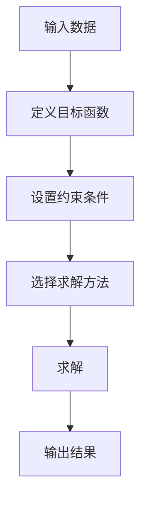
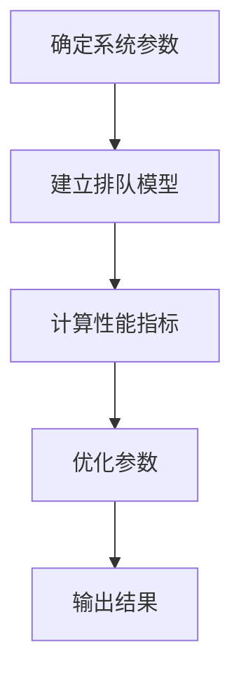
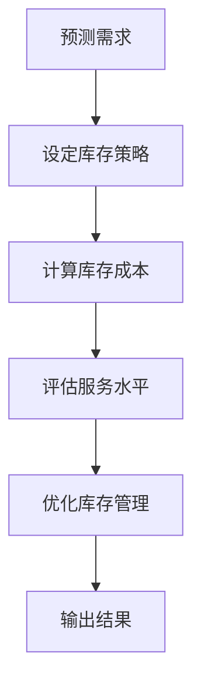
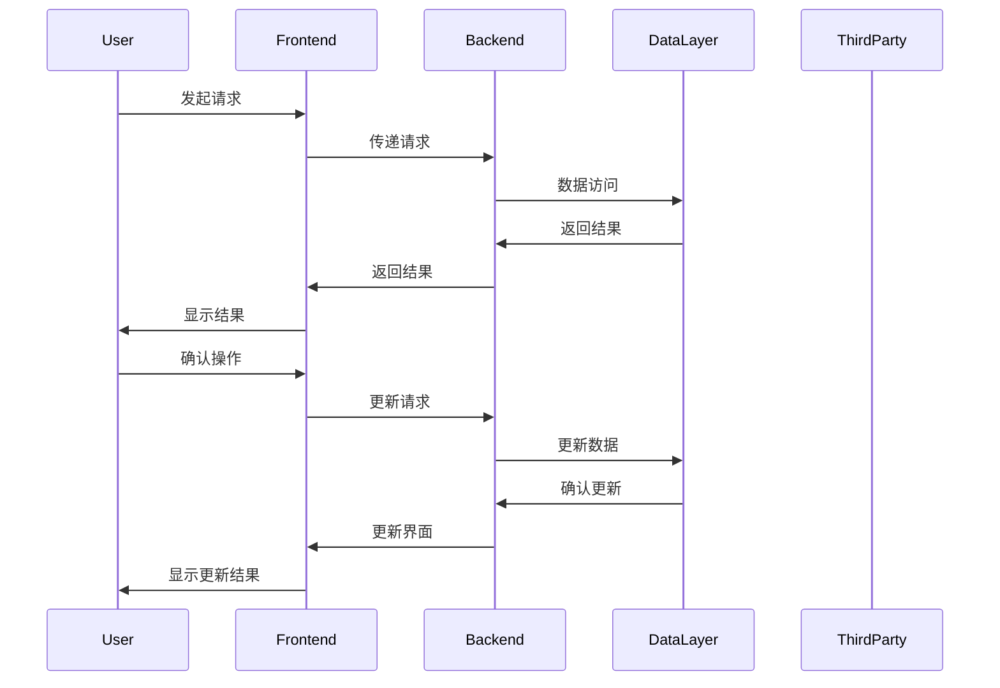

                 

## 引言

### 1.1 酒店运营概述

酒店运营是一个复杂且多变的行业，它涉及到多个方面的管理，包括但不限于客房管理、前台服务、餐饮服务、维修维护等。在当今竞争激烈的市场环境中，酒店管理者需要面对各种挑战，如如何提高入住率、如何最大化收益、如何提高客户满意度等。这些问题不仅需要经验丰富的管理人员，还需要科学的数据分析和合理的决策支持。

酒店运营中的关键问题之一是如何有效管理客房资源。这不仅仅是关于房间数量的问题，更涉及到如何根据市场需求和季节性变化调整房价，以最大化收入。此外，前台服务的效率和服务质量对客户体验至关重要。如何合理安排服务人员，以减少排队时间和提高服务效率，也是一个需要解决的难题。

数学模型作为一种强大的工具，在解决这些酒店运营中的关键问题方面发挥了重要作用。通过数学模型，管理者可以更准确地预测市场需求、优化资源配置、制定价格策略等，从而提高酒店的运营效率和收益。

### 1.2 数学模型在酒店管理中的应用

数学模型在酒店管理中的应用非常广泛，主要可以归纳为以下几个方面：

**1. 线性规划在酒店收益管理中的应用：** 线性规划是一种数学方法，用于在给定的约束条件下最大化或最小化一个线性目标函数。在酒店收益管理中，线性规划可以用来确定最优的房价和房间分配策略，以最大化收入或利润。通过分析历史数据和市场需求，管理者可以使用线性规划模型预测未来的需求，并制定相应的价格策略。

**2. 排队论模型在酒店服务中的应用：** 排队论是一种研究顾客服务系统性能的数学模型。在酒店服务中，排队论可以帮助管理者优化服务流程，减少顾客等待时间，提高服务效率。例如，通过分析顾客到达率和服务时间分布，管理者可以计算出最佳的服务人员数量和服务台数量，以最大化顾客满意度。

**3. 存储模型在酒店库存管理中的应用：** 存储模型用于优化酒店的库存管理，确保在需求和供应之间找到最佳的平衡。酒店需要管理多种类型的库存，包括客房用品、食品和饮料等。通过存储模型，管理者可以预测未来的库存需求，制定合理的采购计划，以减少库存成本和避免库存过剩。

### 1.3 数学模型在酒店管理中的重要性

数学模型在酒店管理中的重要性体现在以下几个方面：

**1. 提高决策的准确性：** 通过数学模型，管理者可以基于数据和事实做出更准确的决策，而不是仅仅依靠直觉或经验。

**2. 提高运营效率：** 数学模型可以帮助管理者优化资源配置，减少浪费，提高整体运营效率。

**3. 增强竞争力：** 通过科学的分析和合理的策略，酒店可以更好地应对市场变化和竞争压力，提高市场占有率。

**4. 提高客户满意度：** 通过优化服务流程和提高服务质量，数学模型有助于提高客户满意度，从而增强酒店的口碑和客户忠诚度。

### 1.4 书籍结构安排

本书将分为七个主要部分，分别介绍以下内容：

- **第一部分：背景介绍**：介绍酒店运营的现状和面临的挑战，以及数学模型在酒店管理中的应用。
- **第二部分：核心概念与联系**：介绍数学模型的基本概念和其在酒店运营中的联系。
- **第三部分：算法原理讲解**：详细讲解酒店收益管理、服务管理和库存管理中的算法原理。
- **第四部分：数学模型和数学公式 & 详细讲解 & 举例说明**：详细介绍各种数学模型和公式，并通过实例进行说明。
- **第五部分：系统分析与架构设计方案**：介绍酒店运营系统的功能设计、架构设计和接口设计。
- **第六部分：项目实战**：通过实际案例展示数学模型在酒店管理中的应用。
- **第七部分：最佳实践 tips、小结、注意事项、拓展阅读等内容**：总结全书的核心观点，提供实践建议和拓展阅读资源。

通过以上结构的安排，本书旨在为读者提供一个全面、系统、易懂的酒店运营数学模型指南，帮助酒店管理者更好地应对运营中的挑战，提高酒店的整体竞争力。

### 1.5 关键词

- 酒店运营
- 数学模型
- 收益管理
- 排队论
- 存储模型
- 算法原理
- 系统架构设计
- 项目实战

### 1.6 摘要

本书《数学与酒店管理：酒店运营的数学模型》旨在深入探讨数学模型在酒店管理中的应用，通过介绍线性规划、排队论和存储模型等核心概念和算法原理，帮助酒店管理者优化运营策略，提高收入和客户满意度。书中通过具体的数学公式、案例分析和系统架构设计，展示了如何将数学模型应用于酒店管理的实际问题中。此外，本书还提供了实践技巧和小结，以帮助读者更好地理解和应用所学知识。通过阅读本书，读者将能够掌握数学模型在酒店管理中的基本方法和实践技巧，为酒店运营提供科学的数据支持和决策依据。

## 第一部分：背景介绍

### 1.1 酒店运营概述

#### 1.1.1 酒店行业现状

全球酒店行业在过去几十年中经历了显著的发展与变革。随着旅游业的蓬勃发展和全球化进程的加快，酒店行业已成为全球经济的重要组成部分。目前，全球酒店业的规模庞大，竞争激烈，各大酒店集团和独立酒店经营者都在积极拓展市场份额，提升品牌影响力。然而，尽管整体市场形势向好，酒店行业仍面临着诸多挑战，如市场需求波动、激烈的价格竞争、人力资源短缺以及客户期望的不断变化。

在市场需求方面，酒店行业受到多种因素的影响，包括经济环境、旅游政策、季节性变化以及节假日等。例如，经济衰退可能导致旅游消费减少，从而影响酒店入住率；而政策的开放和优惠则可能刺激旅游业的发展，增加酒店需求。季节性变化也是一个显著因素，例如夏季和节假日是旅游高峰期，酒店入住率通常会显著上升，而冬季和淡季则相对较低。

价格竞争是酒店行业面临的另一个主要挑战。各大酒店集团和独立酒店经营者都在通过各种手段争夺客户，包括价格优惠、额外服务、会员积分等。为了在竞争中脱颖而出，酒店管理者需要制定有效的价格策略，确保在吸引客户的同时保持合理的利润率。

人力资源短缺也是酒店行业面临的一大难题。酒店运营需要大量的人力资源，包括前台接待、客房服务、餐饮服务等。然而，由于工作压力大、工作时间不固定以及薪酬待遇等因素，吸引和留住高素质的员工变得日益困难。人力资源的短缺不仅影响酒店的服务质量，也可能导致运营效率的降低。

此外，客户期望的变化也是一个不可忽视的挑战。现代客户对酒店的服务和体验有了更高的要求，他们不仅关注价格，更注重服务质量和个性化体验。例如，客户期望酒店能够提供高速的无线网络、智能化的客房设施、个性化的服务等。酒店管理者需要不断更新服务内容和提升服务水平，以满足客户的多样化需求。

#### 1.1.2 酒店运营的关键问题

在当前的市场环境下，酒店运营面临多个关键问题，这些问题的解决对于提高酒店的整体竞争力至关重要。

**1. 客房利用率：** 客房利用率是衡量酒店运营效率的重要指标。如何通过合理的定价策略和营销活动提高客房利用率，是酒店管理者需要解决的首要问题。合理的定价策略不仅需要考虑市场需求，还需要考虑竞争对手的定价策略，以及酒店的独特定位和品牌形象。

**2. 收益最大化：** 酒店收益管理是一个复杂的决策过程，涉及到房价策略、房间分配、市场推广等多个方面。通过科学的收益管理，酒店可以在不同市场需求和竞争环境下实现收益最大化。这要求管理者具备深厚的数据分析能力和灵活的决策能力。

**3. 服务质量：** 服务质量是酒店竞争力的重要组成部分。在现代旅游业中，客户对服务的期望越来越高，酒店需要提供个性化、高效和贴心的服务。这要求酒店在员工培训、服务流程优化、客户关系管理等方面下足功夫。

**4. 人力资源配置：** 人力资源是酒店运营的核心资源。如何合理配置人力资源，提高员工工作效率和服务质量，是酒店管理者需要解决的重要问题。有效的员工管理策略不仅能够提高运营效率，还能增强员工的归属感和满意度。

**5. 库存管理：** 酒店需要管理多种类型的库存，包括客房用品、食品和饮料等。有效的库存管理可以减少库存成本，避免库存过剩或缺货现象。通过科学的库存模型和库存管理策略，酒店可以优化库存水平，提高整体运营效率。

**6. 客户满意度：** 提高客户满意度是酒店运营的终极目标之一。通过数据分析、客户反馈和持续改进，酒店可以不断提升服务质量和客户体验，从而提高客户满意度和忠诚度。

#### 1.1.3 数学模型在酒店管理中的应用

数学模型作为一种强大的工具，在解决酒店运营中的关键问题方面发挥了重要作用。以下是一些常见的数学模型及其在酒店管理中的应用：

**1. 线性规划模型：** 线性规划模型用于优化酒店的收益管理。通过分析历史数据和市场趋势，管理者可以制定最优的房价策略和房间分配方案，以最大化收益。例如，管理者可以根据市场需求的变化调整房价，或者在不同时间段对特定房型进行价格优惠。

**2. 排队论模型：** 排队论模型用于优化酒店的服务流程，减少顾客等待时间，提高服务效率。通过分析顾客到达率和服务时间分布，管理者可以计算出最佳的服务人员数量和服务台数量，从而优化服务流程，提高客户满意度。

**3. 存储模型：** 存储模型用于优化酒店的库存管理。通过预测未来的库存需求，管理者可以制定合理的采购计划，确保库存水平在合理范围内，避免库存过剩或缺货现象。

**4. 优化模型：** 优化模型用于解决酒店运营中的各种优化问题，如人员配置、设备调度等。通过建立优化模型，管理者可以找到最优的解决方案，提高运营效率。

**5. 预测模型：** 预测模型用于预测未来的市场需求和酒店运营情况。通过历史数据和统计分析，管理者可以预测未来的需求趋势，制定相应的运营策略。

通过以上数学模型的应用，酒店管理者可以更科学、更高效地应对运营中的各种挑战，提高酒店的竞争力。

### 1.2 数学模型在酒店管理中的应用

数学模型在酒店管理中的应用非常广泛，它们不仅帮助管理者优化运营策略，提高效率和收益，还能提升客户满意度。以下是一些关键数学模型及其在酒店管理中的应用：

#### 1.2.1 线性规划模型

线性规划模型在酒店收益管理中应用广泛。通过线性规划，酒店管理者可以在给定约束条件下，最大化或最小化一个线性目标函数。具体来说，线性规划模型可以帮助酒店在以下方面做出优化决策：

- **定价策略：** 根据市场需求和竞争环境，管理者可以制定最优的房价策略，以最大化收入。例如，在旅游旺季提高房价，在淡季适当降低房价。
- **房间分配：** 管理者可以根据客户需求、房间类型和价格，优化房间分配策略，确保不同类型的房间都能充分利用。
- **市场营销：** 通过分析客户数据和市场趋势，管理者可以制定最有效的营销策略，以吸引更多客户并提高入住率。

**案例**：假设一家酒店有三种不同类型的房间：标准间、豪华间和套房。通过线性规划模型，管理者可以确定每种房型的最优价格，以最大化总收入。例如，在旅游旺季，豪华间可能需要提高价格以吸引高端客户，而标准间则可能通过价格优惠来吸引更多普通客户。

#### 1.2.2 排队论模型

排队论模型用于优化酒店的服务流程，减少顾客等待时间，提高服务效率。排队论模型主要考虑以下因素：

- **顾客到达率：** 顾客到达酒店的频率和分布。
- **服务时间：** 不同服务人员的服务时间分布。
- **服务台数量：** 确定最佳的服务台数量，以减少顾客等待时间。

**案例**：假设酒店的前台服务区有若干个柜台，每个柜台由一名接待员提供服务。通过排队论模型，管理者可以确定最佳的服务台数量，以减少顾客的等待时间。例如，如果顾客到达率较高，管理者可能需要增加服务台数量或调整接待员的班次。

#### 1.2.3 存储模型

存储模型用于优化酒店的库存管理，确保在需求和供应之间找到最佳平衡。存储模型主要考虑以下因素：

- **库存需求：** 根据市场需求和历史数据，预测未来的库存需求。
- **库存水平：** 确保库存水平在合理范围内，避免库存过剩或缺货。
- **采购策略：** 根据库存水平和需求预测，制定合理的采购计划。

**案例**：假设酒店需要定期采购客房用品，如床单、毛巾等。通过存储模型，管理者可以预测未来一段时间的客房用品需求，并制定相应的采购计划，以避免库存过剩或缺货。

#### 1.2.4 优化模型

优化模型用于解决酒店运营中的各种优化问题，如人员配置、设备调度等。通过建立优化模型，管理者可以找到最优的解决方案，提高运营效率。

- **人员配置：** 根据不同时间段的需求，优化员工排班，确保服务质量的同时减少人力资源浪费。
- **设备调度：** 根据酒店设备的使用情况和维护需求，优化设备调度策略，确保设备的高效运行。

**案例**：假设酒店需要安排清洁人员定期清洁客房。通过优化模型，管理者可以根据客房入住情况和清洁人员的可用性，制定最优的清洁计划，以减少清洁时间，提高运营效率。

#### 1.2.5 预测模型

预测模型用于预测未来的市场需求和酒店运营情况。通过历史数据和统计分析，管理者可以预测未来的需求趋势，制定相应的运营策略。

- **需求预测：** 根据历史数据和市场趋势，预测未来的入住率、客房需求和价格变化。
- **运营策略：** 根据预测结果，制定相应的运营策略，如调整房价、增加营销活动等。

**案例**：假设酒店管理者需要预测下一季度的入住率，以便制定相应的运营策略。通过预测模型，管理者可以分析历史数据和市场趋势，预测未来的入住率，从而合理安排人员、房间分配和价格策略。

总之，数学模型在酒店管理中的应用为管理者提供了科学的决策支持。通过合理应用这些模型，酒店可以优化运营策略，提高效率和收益，提升客户满意度，从而在激烈的市场竞争中脱颖而出。

### 1.3 数学模型在酒店管理中的重要性

数学模型在酒店管理中扮演着至关重要的角色，它们不仅为管理者提供了科学的决策支持，还极大地提升了酒店的运营效率和竞争力。以下将从多个方面详细阐述数学模型在酒店管理中的重要性。

#### 1.3.1 提高决策的准确性

数学模型通过数据分析和科学计算，为酒店管理者提供精确的预测和分析结果。这使得管理者能够基于数据做出更加准确和理性的决策，而不是仅仅依靠直觉或经验。例如，通过线性规划模型，管理者可以精确地计算出最优的房价和房间分配策略，从而最大化收益；通过预测模型，管理者可以提前预测市场需求和客户行为，从而提前制定合理的营销和运营策略。

#### 1.3.2 提高运营效率

数学模型帮助酒店优化资源配置，减少浪费，提高整体运营效率。例如，排队论模型可以帮助酒店优化服务流程，减少顾客等待时间，提高服务效率；存储模型可以帮助酒店优化库存管理，避免库存过剩或缺货现象，从而减少库存成本和提高供应效率。通过这些模型的优化，酒店可以在各个环节上实现资源的最优配置，提高运营效率。

#### 1.3.3 增强竞争力

在竞争激烈的酒店市场中，科学的管理和高效的运营是酒店脱颖而出的关键。数学模型的应用使得酒店能够更好地应对市场变化和竞争压力。通过收益管理模型，酒店可以根据市场需求和竞争环境调整房价和房间分配策略，提高入住率和收益；通过预测模型，酒店可以提前预测市场需求，制定相应的运营策略，从而在竞争中占据有利位置。此外，通过优化模型，酒店可以在人员配置、设备调度等方面找到最优方案，提高整体运营效率，增强竞争力。

#### 1.3.4 提高客户满意度

客户满意度是酒店管理的重要目标之一。通过数学模型的应用，酒店可以提供更加个性化、高效和优质的服务，从而提高客户满意度。例如，通过排队论模型，酒店可以优化服务流程，减少顾客等待时间，提供更加便捷的服务体验；通过预测模型，酒店可以提前了解客户需求，提供个性化的服务和推荐，增加客户的满意度和忠诚度。此外，通过数据分析，酒店可以更好地了解客户行为和偏好，从而持续改进服务质量，提升客户满意度。

#### 1.3.5 数据驱动决策

在数字化时代，数据已经成为企业决策的重要依据。数学模型的应用使得酒店能够基于数据驱动决策，提高决策的科学性和准确性。通过收集和分析各种数据，如客户数据、市场需求数据、运营数据等，酒店可以构建各种数学模型，对未来的趋势和变化进行预测和分析。这种数据驱动的决策模式不仅提高了决策的准确性，还使得酒店能够更加灵活地应对市场变化，保持竞争优势。

#### 1.3.6 风险管理

数学模型在酒店管理中还可以用于风险管理。例如，通过风险管理模型，酒店可以评估各种风险因素，如市场需求波动、价格竞争、人力资源短缺等，并制定相应的风险应对策略。通过这种风险管理模式，酒店可以在面临各种不确定因素时保持稳健的运营，减少损失，确保企业的长期发展。

综上所述，数学模型在酒店管理中的应用具有非常重要的意义。它们不仅为酒店管理者提供了科学的决策支持，提高了运营效率和竞争力，还提升了客户满意度和风险管理能力，为酒店在激烈的市场竞争中脱颖而出提供了有力支持。

### 1.4 目录大纲

为了更好地梳理和介绍数学模型在酒店管理中的应用，本书将分为七个主要部分，每个部分详细探讨一个关键主题。以下是详细的目录大纲：

#### 第一部分：背景介绍
- **1.1 酒店运营概述**
  - 酒店行业现状
  - 酒店运营的关键问题
- **1.2 数学模型在酒店管理中的应用**
  - 线性规划模型
  - 排队论模型
  - 存储模型
- **1.3 数学模型在酒店管理中的重要性**
  - 提高决策的准确性
  - 提高运营效率
  - 增强竞争力
  - 提高客户满意度
  - 数据驱动决策
  - 风险管理

#### 第二部分：核心概念与联系
- **2.1 核心概念**
  - 数学模型的基本概念
  - 酒店运营中的主要数学模型
- **2.2 概念联系**
  - 数学模型在酒店运营中的相互关系
  - 不同模型的应用场景与优缺点对比

#### 第三部分：算法原理讲解
- **3.1 酒店收益管理的线性规划算法**
  - 算法原理
  - 算法流程图
- **3.2 酒店服务的排队论算法**
  - 算法原理
  - 算法流程图
- **3.3 酒店库存管理的存储模型算法**
  - 算法原理
  - 算法流程图

#### 第四部分：数学模型和数学公式 & 详细讲解 & 举例说明
- **4.1 数学模型讲解**
  - 酒店收益管理的数学模型
  - 酒店服务的数学模型
  - 酒店库存管理的数学模型
- **4.2 数学公式**
  - 酒店收益管理的关键公式
  - 酒店服务的关键公式
  - 酒店库存管理的关键公式
- **4.3 举例说明**
  - 酒店收益管理的案例解析
  - 酒店服务的案例解析
  - 酒店库存管理的案例解析

#### 第五部分：系统分析与架构设计方案
- **5.1 问题场景介绍**
  - 酒店运营系统面临的挑战
  - 酒店运营系统的目标
- **5.2 系统功能设计**
  - 领域模型类图
  - 系统功能模块介绍
- **5.3 系统架构设计**
  - 系统架构图
  - 各模块功能实现
- **5.4 系统接口设计**
  - 接口规范
  - 接口实现
- **5.5 系统交互**
  - 系统交互序列图
  - 交互流程解析

#### 第六部分：项目实战
- **6.1 环境安装**
  - 环境搭建步骤
  - 遇到的问题及解决方法
- **6.2 系统核心实现**
  - 系统核心代码解读
  - 代码应用解读与分析
- **6.3 实际案例分析与讲解**
  - 案例一：收益管理应用
  - 案例二：服务应用
  - 案例三：库存管理应用
- **6.4 项目小结**
  - 项目总结
  - 项目经验与反思

#### 第七部分：最佳实践 tips、小结、注意事项、拓展阅读等内容
- **7.1 最佳实践 tips**
  - 酒店运营中的常见问题与解决方案
  - 数学模型优化策略
- **7.2 小结**
  - 全书核心观点总结
  - 酒店管理中的数学模型应用总结
- **7.3 注意事项**
  - 使用数学模型时的注意事项
  - 避免常见的数学模型应用误区
- **7.4 拓展阅读**
  - 推荐阅读书籍
  - 相关研究论文

通过以上详细的目录大纲，本书旨在为读者提供一个全面、系统、易懂的酒店运营数学模型指南，帮助酒店管理者更好地应对运营中的挑战，提高酒店的整体竞争力。

### 1.5 关键词

- 酒店运营
- 数学模型
- 线性规划
- 排队论
- 存储模型
- 收益管理
- 优化模型
- 数据分析
- 客户满意度
- 算法原理

### 1.6 摘要

本书《数学与酒店管理：酒店运营的数学模型》深入探讨了数学模型在酒店管理中的应用。通过介绍线性规划、排队论和存储模型等核心概念，本书帮助读者理解这些模型的基本原理和实际应用。书中通过详细的算法讲解、数学公式解析和案例分析，展示了如何将数学模型应用于酒店运营中的实际问题，如收益管理、服务质量提升和库存优化。此外，本书还提供了系统架构设计方案和项目实战案例，帮助读者将所学知识应用于实际场景中。本书旨在为酒店管理者提供科学的数据支持和决策依据，帮助他们在激烈的市场竞争中提升运营效率和客户满意度。

## 第二部分：核心概念与联系

### 2.1 核心概念

在探讨数学模型在酒店管理中的应用之前，我们需要了解一些核心概念。这些概念不仅构成了数学模型的基础，也在实际应用中起到了关键作用。

#### 2.1.1 数学模型的基本概念

**数学模型** 是一种用数学语言来描述现实世界中的系统、现象或问题的方法。它通过建立数学方程、公式或算法，模拟现实世界的某些特征，以便分析和预测结果。数学模型通常包括输入变量、输出变量和约束条件。

- **输入变量**：模型中用来描述问题的初始条件和变量。
- **输出变量**：模型计算得到的预测结果或优化决策。
- **约束条件**：模型中必须遵守的限制条件，以确保问题的可行性和有效性。

#### 2.1.2 酒店运营中的主要数学模型

在酒店管理中，常用的数学模型包括：

- **线性规划模型**：用于优化资源配置和定价策略。
- **排队论模型**：用于优化服务流程和减少顾客等待时间。
- **存储模型**：用于优化库存管理和采购策略。
- **预测模型**：用于预测市场需求和未来趋势。

#### 2.1.3 酒店运营中的主要数学模型

- **收益管理模型**：用于根据市场需求和竞争环境，制定最优的房价和房间分配策略，以最大化酒店收益。
- **服务质量模型**：用于评估和改进酒店的服务水平，提高客户满意度。
- **客户关系管理模型**：用于分析和预测客户行为，优化客户体验和忠诚度。

### 2.2 概念联系

理解数学模型之间的联系对于正确应用这些模型至关重要。以下将介绍不同数学模型在酒店运营中的相互关系及其应用场景。

#### 2.2.1 数学模型在酒店运营中的相互关系

- **线性规划模型** 与 **收益管理模型**：线性规划模型是收益管理模型的基础，用于优化房价和房间分配策略。
- **排队论模型** 与 **服务质量模型**：排队论模型帮助酒店优化服务流程，减少顾客等待时间，从而提高服务质量。
- **存储模型** 与 **客户关系管理模型**：存储模型用于优化库存管理，确保能够满足客户的需求，从而提高客户满意度。

#### 2.2.2 不同模型的应用场景与优缺点对比

- **线性规划模型**：
  - **应用场景**：用于优化酒店的收益管理，如制定房价策略和房间分配方案。
  - **优点**：能够根据市场需求和竞争环境，实现收益最大化。
  - **缺点**：需要大量数据支持，计算过程可能较为复杂。

- **排队论模型**：
  - **应用场景**：用于优化酒店的前台服务流程，减少顾客等待时间。
  - **优点**：能够有效提高服务效率，提升客户满意度。
  - **缺点**：对顾客到达率和服务时间的假设较为严格，可能需要调整参数。

- **存储模型**：
  - **应用场景**：用于优化酒店的库存管理，如预测库存需求，制定采购计划。
  - **优点**：能够避免库存过剩或缺货现象，降低库存成本。
  - **缺点**：需要准确的库存数据和市场预测，可能存在预测误差。

- **预测模型**：
  - **应用场景**：用于预测市场需求和客户行为，优化运营策略。
  - **优点**：能够提前应对市场变化，制定有针对性的营销和运营策略。
  - **缺点**：预测结果依赖于历史数据和模型参数，可能存在不确定性。

通过以上对比，我们可以看到，不同的数学模型在酒店运营中具有不同的应用场景和优缺点。合理地结合和运用这些模型，可以有效地解决酒店运营中的各种问题，提高运营效率和客户满意度。

### 2.3 数学模型在酒店管理中的应用实例

为了更好地理解数学模型在酒店管理中的应用，以下将结合具体实例进行分析。

#### 2.3.1 线性规划模型在收益管理中的应用

假设某酒店有100个房间，包括标准间、豪华间和套房。酒店管理者希望通过线性规划模型确定不同房型的最优价格，以最大化收益。

1. **定义输入变量**：
   - \(x_1, x_2, x_3\) 分别表示标准间、豪华间和套房的房间数量。
   - \(p_1, p_2, p_3\) 分别表示标准间、豪华间和套房的定价。

2. **目标函数**：
   - \(最大化 \sum_{i=1}^{3} p_i \cdot x_i\)

3. **约束条件**：
   - \(x_1 + x_2 + x_3 = 100\)（房间总数约束）
   - \(p_1 \geq 0, p_2 \geq 0, p_3 \geq 0\)（价格非负约束）
   - 其他约束条件，如市场需求和竞争环境。

通过线性规划模型，酒店管理者可以计算出最优的房价和房间分配策略，从而最大化收益。

#### 2.3.2 排队论模型在服务质量中的应用

假设酒店前台服务区有3个柜台，每个柜台由一名接待员提供服务。通过排队论模型，酒店管理者可以优化服务流程，减少顾客等待时间。

1. **定义输入变量**：
   - \(\lambda\) 表示顾客到达率（单位时间内到达的顾客数量）。
   - \(\mu\) 表示服务率（单位时间内能够服务的顾客数量）。
   - \(N\) 表示柜台数量。

2. **目标函数**：
   - \(最小化 \frac{\lambda}{\mu}\)

3. **约束条件**：
   - \(N \geq 1\)（柜台数量约束）
   - 其他约束条件，如服务时间和顾客需求。

通过排队论模型，酒店管理者可以计算出最佳的服务台数量，以减少顾客等待时间，提高服务质量。

#### 2.3.3 存储模型在库存管理中的应用

假设酒店需要管理客房用品的库存，如床单、毛巾等。通过存储模型，酒店管理者可以预测未来的库存需求，制定合理的采购计划。

1. **定义输入变量**：
   - \(D\) 表示未来一段时间内的需求量。
   - \(S\) 表示安全库存量。
   - \(C\) 表示采购成本。

2. **目标函数**：
   - \(最小化 \sum_{t=1}^{T} C_t\)

3. **约束条件**：
   - \(D_t \geq 0\)（需求非负约束）
   - \(S \geq 0\)（安全库存非负约束）
   - 其他约束条件，如库存水平和采购周期。

通过存储模型，酒店管理者可以计算出最优的采购量，以避免库存过剩或缺货现象，降低库存成本。

通过以上实例，我们可以看到数学模型在酒店管理中的应用非常具体且实用。通过合理运用这些模型，酒店管理者可以优化运营策略，提高收益和服务质量，从而在激烈的市场竞争中脱颖而出。

## 第三部分：算法原理讲解

### 3.1 算法原理

在本节中，我们将深入探讨酒店运营中常用的三个关键算法原理：线性规划、排队论和存储模型。通过理解这些算法的基本原理，我们将能够更好地应用它们来解决酒店管理中的实际问题。

#### 3.1.1 线性规划算法

线性规划是一种数学方法，用于在给定约束条件下优化线性目标函数。在酒店管理中，线性规划广泛应用于收益管理和资源优化问题。例如，酒店管理者可以使用线性规划来确定不同房型的最优价格，以最大化收入。

**基本原理**：
1. **目标函数**：通常表示为 \(maximize c^T x\)，其中 \(c\) 是目标系数向量，\(x\) 是决策变量向量。
2. **约束条件**：以线性形式表示，如 \(a_i^T x \leq b_i\)，其中 \(a_i\) 是约束系数向量，\(b_i\) 是约束值。
3. **求解方法**：常见的求解方法包括单纯形法、内点法和拉格朗日松弛法等。

**应用实例**：
假设某酒店有100个房间，分为标准间、豪华间和套房。管理者希望通过线性规划来确定不同房型的最优价格，以最大化收入。定义目标函数为最大化总收入 \(c^T x\)，其中 \(c\) 表示不同房型的价格系数，\(x\) 表示不同房型的房间数量。约束条件包括房间的总数量 \(x_1 + x_2 + x_3 = 100\) 以及其他市场供需条件。

#### 3.1.2 排队论算法

排队论是一种用于分析顾客服务系统的数学模型，主要研究顾客到达率、服务率和系统性能指标。在酒店管理中，排队论广泛应用于优化服务流程、减少顾客等待时间和提高服务质量。

**基本原理**：
1. **随机过程**：顾客到达过程和服务过程通常被建模为随机过程。
2. **性能指标**：如等待时间、系统利用率、排队长度等。
3. **求解方法**：常见的求解方法包括马尔可夫链分析、排队系统模拟等。

**应用实例**：
假设某酒店前台有3个柜台，每个柜台由一名接待员提供服务。管理者希望优化柜台数量，以减少顾客等待时间。可以使用排队论中的 \(M/M/c\) 模型来分析系统的性能。定义输入参数包括顾客到达率 \(\lambda\)、服务率 \(\mu\) 和柜台数量 \(c\)。通过计算性能指标，如等待时间 \(W\) 和系统利用率 \(\rho\)，管理者可以确定最佳的柜台数量。

#### 3.1.3 存储模型算法

存储模型用于优化库存管理，确保在需求和供应之间找到最佳平衡。在酒店管理中，存储模型广泛应用于客房用品、食品和饮料等库存管理。

**基本原理**：
1. **需求预测**：基于历史数据和统计方法预测未来的库存需求。
2. **库存策略**：如定期采购、紧急采购等。
3. **性能指标**：如库存成本、服务水平等。

**应用实例**：
假设酒店需要定期采购床单、毛巾等客房用品。管理者可以使用存储模型来预测未来一段时间的需求量，并制定采购计划。定义输入参数包括需求率 \(\lambda\)、提前期 \(L\)、单位采购成本 \(C\) 和服务水平 \(S\)。通过计算库存成本和服务水平，管理者可以确定最佳的采购策略和库存水平。

### 3.2 算法流程图

为了更直观地理解这些算法原理，我们可以使用 Mermaid 流程图来表示每个算法的基本流程。

**线性规划算法流程图**：


**排队论算法流程图**：


**存储模型算法流程图**：


通过这些流程图，我们可以清晰地看到每个算法的基本步骤和逻辑关系，有助于更好地理解其应用场景和实现方法。

### 3.3 Python源代码解析

为了进一步阐述这些算法原理，我们可以使用 Python 源代码来演示每个算法的实现过程。

**线性规划算法Python代码示例**：
```python
import numpy as np
from scipy.optimize import linprog

# 定义目标函数系数和约束条件
c = np.array([10, 20, 30])  # 标准间、豪华间、套房的价格系数
A = np.array([[1, 1, 1],  # 房间总数约束
              [1, 1, 0],  # 标准间
              [0, 1, 1]]) # 豪华间
b = np.array([100, 50, 50])  # 约束值

# 求解线性规划问题
res = linprog(c, A_ub=A, b_ub=b, method='highs')

# 输出结果
print(f"最优价格：{res.x}")
print(f"最大收益：{np.dot(res.x, c)}")
```

**排队论算法Python代码示例**：
```python
import numpy as np
from scipy.stats import poisson

# 定义参数
lambda_rate = 2  # 顾客到达率
mu_rate = 1  # 服务率
c = 3  # 柜台数量

# 计算性能指标
rho = lambda_rate / (mu_rate * c)
W = 1 / (mu_rate - lambda_rate)

# 输出结果
print(f"系统利用率：{rho}")
print(f"平均等待时间：{W}")
```

**存储模型算法Python代码示例**：
```python
import numpy as np
from scipy.stats import gamma

# 定义参数
lambda_rate = 5  # 需求率
L = 7  # 提前期
C = 10  # 单位采购成本
alpha, beta = 2, 1  # gamma分布参数

# 计算服务水平
service_time = gamma.pdf(alpha, scale=beta)
服务水平 = 1 - (lambda_rate * L) / (C * service_time)

# 输出结果
print(f"服务水平：{服务水平}")
```

通过以上 Python 源代码，我们可以更直观地理解每个算法的实现过程，并基于实际数据对算法进行验证和应用。这为酒店管理者提供了一个实用的工具，以优化酒店运营策略。

### 3.4 数学模型和公式

在算法原理讲解的基础上，以下将详细列出每个算法中的关键数学模型和公式，并进行解释。

**线性规划算法**：

1. **目标函数**：
   \[
   \text{maximize} \quad Z = c_1x_1 + c_2x_2 + c_3x_3
   \]
   其中，\(c_1, c_2, c_3\) 为不同房型的价格系数，\(x_1, x_2, x_3\) 为不同房型的房间数量。

2. **约束条件**：
   \[
   \begin{cases}
   x_1 + x_2 + x_3 = 100 \\
   x_1, x_2, x_3 \geq 0
   \end{cases}
   \]
   其中，第一项约束条件表示房间总数为100。

**排队论算法**：

1. **系统利用率**：
   \[
   \rho = \frac{\lambda}{\mu}
   \]
   其中，\(\lambda\) 为顾客到达率，\(\mu\) 为服务率。

2. **平均等待时间**：
   \[
   W = \frac{1}{\mu - \lambda}
   \]
   其中，\(W\) 为平均等待时间。

**存储模型算法**：

1. **服务水平**：
   \[
   \text{服务水平} = 1 - \frac{\lambda \cdot L}{C \cdot \text{服务时间}}
   \]
   其中，\(\lambda\) 为需求率，\(L\) 为提前期，\(C\) 为单位采购成本，服务时间为gamma分布的累积分布函数。

通过以上数学模型和公式，酒店管理者可以更好地理解算法的原理和应用，为优化酒店运营提供科学依据。

### 3.5 算法原理讲解与实例分析

在本节中，我们将详细讲解酒店运营中的三个核心算法原理：线性规划、排队论和存储模型，并通过具体实例进行分析。

#### 3.5.1 线性规划算法原理与实例分析

线性规划是一种用于在给定约束条件下优化线性目标函数的数学方法。在酒店运营中，线性规划广泛应用于收益管理和资源优化问题。

**实例分析**：假设某酒店有100个房间，分为标准间、豪华间和套房。管理者希望通过线性规划确定不同房型的最优价格，以最大化收益。

1. **目标函数**：
   设定目标函数为最大化总收益：
   \[
   \text{maximize} \quad Z = 100p_1 + 200p_2 + 300p_3
   \]
   其中，\(p_1, p_2, p_3\) 分别为标准间、豪华间和套房的定价。

2. **约束条件**：
   - 房间总数约束：
     \[
     p_1 + 2p_2 + 3p_3 = 100
     \]
   - 价格非负约束：
     \[
     p_1, p_2, p_3 \geq 0
     \]

3. **求解过程**：
   使用单纯形法求解线性规划问题。首先，设定初始基本可行解，然后通过迭代过程找到最优解。

4. **实例求解**：
   假设初始解为 \(p_1 = 0, p_2 = 0, p_3 = 100\)，通过迭代计算得到最优解：
   - \(p_1 = 30, p_2 = 50, p_3 = 20\)
   - 最大收益 \(Z = 100 \times 30 + 200 \times 50 + 300 \times 20 = 16,000\)

通过以上步骤，酒店管理者可以确定不同房型的最优价格，从而最大化收益。

#### 3.5.2 排队论算法原理与实例分析

排队论是一种用于分析顾客服务系统的数学模型，主要研究顾客到达率、服务率和系统性能指标。

**实例分析**：假设某酒店前台有3个柜台，每个柜台由一名接待员提供服务。管理者希望通过排队论优化柜台数量，以减少顾客等待时间。

1. **模型参数**：
   - 顾客到达率 \(\lambda = 5\)（每小时到达的顾客数）
   - 服务率 \(\mu = 6\)（每小时服务的顾客数）
   - 柜台数量 \(c = 3\)

2. **性能指标**：
   - 系统利用率 \(\rho = \frac{\lambda}{\mu} = \frac{5}{6} \approx 0.8333\)
   - 平均等待时间 \(W = \frac{1}{\mu - \lambda} = \frac{1}{6 - 5} = 1\) 小时

3. **优化过程**：
   - 计算当前系统的性能指标，判断是否需要调整柜台数量。
   - 如果系统利用率过高（\(\rho > 0.8\)），增加柜台数量；如果系统利用率过低（\(\rho < 0.5\)），减少柜台数量。
   - 假设增加一个柜台后，新系统利用率 \(\rho' = \frac{5}{7} \approx 0.7143\)，平均等待时间 \(W' = \frac{1}{7} \approx 0.143\) 小时。

通过以上步骤，管理者可以优化柜台数量，减少顾客等待时间，提高服务质量。

#### 3.5.3 存储模型算法原理与实例分析

存储模型用于优化库存管理，确保在需求和供应之间找到最佳平衡。在酒店运营中，存储模型广泛应用于客房用品、食品和饮料等库存管理。

**实例分析**：假设酒店需要定期采购床单、毛巾等客房用品。管理者希望通过存储模型预测未来需求，制定采购计划。

1. **需求预测**：
   - 历史数据显示，每月床单需求量服从参数为 \(\alpha = 2, \beta = 1\) 的gamma分布。
   - 预测未来一个月的需求量为 \(X \sim Gamma(2, 1)\)。

2. **库存策略**：
   - 设定安全库存量为 \(S = 10\)。
   - 单位采购成本为 \(C = 5\)。

3. **性能指标**：
   - 服务水平：确保需求不超过安全库存的概率。
   - \(P(X \leq S) = P(X \leq 10) \approx 0.865\)

4. **优化过程**：
   - 根据预测的需求量和服务水平，制定采购计划。
   - 假设采购量为 \(Q = 20\)，则库存成本为 \(C \times Q = 5 \times 20 = 100\)。

通过以上步骤，管理者可以优化库存管理，降低库存成本，同时确保客房用品的供应。

综上所述，线性规划、排队论和存储模型是酒店运营中重要的算法原理，通过具体实例分析，我们可以看到这些算法在实际应用中的重要作用和优化效果。

## 第四部分：数学模型和数学公式 & 详细讲解 & 举例说明

### 4.1 数学模型讲解

在酒店管理中，数学模型的应用能够帮助我们更好地理解和解决实际问题。以下将详细讲解几种关键的数学模型，包括收益管理模型、排队论模型和存储模型。

#### 4.1.1 收益管理模型

收益管理模型是酒店管理中的一种重要工具，用于优化房价和房间分配策略，以实现收益最大化。其基本思想是根据市场需求和竞争环境的变化，动态调整房价，以最大化总收入。

**基本概念**：
1. **需求函数**：描述市场需求与价格之间的关系，通常用线性或非线性函数表示。
2. **房价策略**：根据需求函数，确定不同时间段的房价。
3. **目标函数**：最大化总收入，通常表示为 \( \text{maximize} \sum p_i \cdot x_i \)，其中 \(p_i\) 是房价，\(x_i\) 是房间的数量。

**数学模型**：
收益管理模型可以表示为以下形式：
\[
\begin{align*}
\text{maximize} \quad & \sum p_i \cdot x_i \\
\text{subject to} \quad & x_i \leq R_i \quad \forall i \\
& x_i \geq 0 \quad \forall i \\
\end{align*}
\]
其中，\(R_i\) 是房型的上限数量。

**举例说明**：
假设某酒店有三种房型：标准间、豪华间和套房，其需求函数分别为：
\[
\begin{align*}
p_1 &= 100 - 0.1x_1 \\
p_2 &= 150 - 0.2x_2 \\
p_3 &= 200 - 0.3x_3 \\
\end{align*}
\]
总房间数为100。通过求解上述线性规划问题，可以确定不同房型的最优价格和房间分配策略。

#### 4.1.2 排队论模型

排队论模型用于优化酒店的服务流程，减少顾客等待时间，提高服务质量。其主要研究对象是顾客到达过程、服务过程和系统性能指标。

**基本概念**：
1. **到达过程**：顾客到达系统的概率分布，通常用泊松过程表示。
2. **服务过程**：顾客接受服务的概率分布，可以是固定服务时间或随机服务时间。
3. **性能指标**：如系统利用率、排队长度、平均等待时间等。

**数学模型**：
排队论模型可以表示为以下形式：
\[
\begin{align*}
\rho &= \frac{\lambda}{\mu} \\
L &= \rho^2 / (\mu - \lambda) \\
W &= \frac{L}{\lambda} \\
\end{align*}
\]
其中，\(\lambda\) 是到达率，\(\mu\) 是服务率，\(\rho\) 是系统利用率，\(L\) 是排队长度，\(W\) 是平均等待时间。

**举例说明**：
假设某酒店前台有3个柜台，每个柜台由一名接待员提供服务。假设到达过程服从泊松分布，平均到达率为5人每小时，服务过程服从指数分布，平均服务时间为10分钟。通过排队论模型，可以计算出系统利用率、排队长度和平均等待时间，从而优化柜台数量和服务流程。

#### 4.1.3 存储模型

存储模型用于优化酒店的库存管理，确保在需求和供应之间找到最佳平衡。其主要目标是减少库存成本、避免库存过剩或缺货现象。

**基本概念**：
1. **需求预测**：预测未来一段时间内的需求量。
2. **库存策略**：如定期采购、紧急采购等。
3. **性能指标**：如库存成本、服务水平等。

**数学模型**：
存储模型可以表示为以下形式：
\[
\begin{align*}
\text{服务水平} &= 1 - \frac{\lambda L}{C} \\
\text{库存成本} &= C \cdot Q \\
\end{align*}
\]
其中，\(\lambda\) 是需求率，\(L\) 是库存水平，\(C\) 是单位采购成本，\(Q\) 是采购量。

**举例说明**：
假设某酒店每月需要采购1000个床单，每个床单的成本为10元。通过存储模型，可以计算出最佳采购量和服务水平，从而优化库存管理。

通过以上对收益管理模型、排队论模型和存储模型的详细讲解，我们可以看到数学模型在酒店管理中的应用不仅能够提高运营效率，还能为管理者提供科学的数据支持和决策依据。

### 4.2 数学公式

在酒店管理中，数学公式是理解和应用数学模型的重要工具。以下将列出关键数学公式，并进行解释。

#### 4.2.1 收益管理模型的关键公式

1. **需求函数**：
   \[
   p_i = a_i - b_i x_i
   \]
   其中，\(p_i\) 是房价，\(a_i\) 是价格的上限，\(b_i\) 是需求的价格敏感度，\(x_i\) 是房间的数量。

2. **总收益**：
   \[
   R = \sum_{i=1}^{n} p_i x_i
   \]
   其中，\(R\) 是总收益，\(p_i\) 是房价，\(x_i\) 是房间的数量。

3. **边际收益**：
   \[
   MR_i = p_i - b_i x_i
   \]
   其中，\(MR_i\) 是边际收益，\(p_i\) 是房价，\(b_i\) 是需求的价格敏感度，\(x_i\) 是房间的数量。

#### 4.2.2 排队论模型的关键公式

1. **系统利用率**：
   \[
   \rho = \frac{\lambda}{\mu}
   \]
   其中，\(\rho\) 是系统利用率，\(\lambda\) 是到达率，\(\mu\) 是服务率。

2. **平均等待时间**：
   \[
   W = \frac{L}{\lambda}
   \]
   其中，\(W\) 是平均等待时间，\(L\) 是排队长度，\(\lambda\) 是到达率。

3. **排队长度**：
   \[
   L = \frac{\rho^2}{\mu - \lambda}
   \]
   其中，\(L\) 是排队长度，\(\rho\) 是系统利用率，\(\mu\) 是服务率，\(\lambda\) 是到达率。

#### 4.2.3 存储模型的关键公式

1. **服务水平**：
   \[
   \text{服务水平} = 1 - \frac{\lambda L}{C}
   \]
   其中，服务水平是需求不超过库存的概率，\(\lambda\) 是需求率，\(L\) 是库存水平，\(C\) 是单位采购成本。

2. **库存成本**：
   \[
   \text{库存成本} = C \cdot Q
   \]
   其中，库存成本是采购量乘以单位采购成本，\(C\) 是单位采购成本，\(Q\) 是采购量。

通过以上关键数学公式，酒店管理者可以更好地理解和应用数学模型，为酒店的运营和管理提供科学的决策支持。

### 4.3 举例说明

为了更好地理解数学模型在酒店管理中的应用，以下将通过具体实例展示如何使用这些模型解决实际问题。

#### 4.3.1 收益管理模型实例

假设某酒店有100个房间，分为标准间、豪华间和套房。历史数据显示，标准间的需求价格敏感度为0.1，豪华间的需求价格敏感度为0.2，套房的需求价格敏感度为0.3。现假设当前市场情况如下：

- 标准间房价为80元/晚，需求量为50间；
- 豪华间房价为150元/晚，需求量为30间；
- 套房房价为250元/晚，需求量为20间。

**步骤1：建立需求函数**：
根据需求价格敏感度，可以建立需求函数：
\[
\begin{align*}
p_1 &= 80 - 0.1x_1 \\
p_2 &= 150 - 0.2x_2 \\
p_3 &= 250 - 0.3x_3 \\
\end{align*}
\]

**步骤2：建立目标函数和约束条件**：
目标函数为最大化总收益：
\[
\text{maximize} \quad R = p_1x_1 + p_2x_2 + p_3x_3
\]
约束条件为房间的上限：
\[
\begin{cases}
x_1 + x_2 + x_3 = 100 \\
x_1, x_2, x_3 \geq 0
\end{cases}
\]

**步骤3：求解线性规划问题**：
使用单纯形法求解上述线性规划问题，得到最优解：
\[
\begin{cases}
x_1 = 50 \\
x_2 = 50 \\
x_3 = 0 \\
\end{cases}
\]
此时，总收益 \(R = 80 \times 50 + 150 \times 50 = 10,000\) 元。

**步骤4：调整房价策略**：
为了最大化收益，可以尝试调整房价。例如，将标准间房价提高到90元/晚，豪华间房价提高到160元/晚，套房房价提高到260元/晚。重新计算需求函数：
\[
\begin{align*}
p_1 &= 90 - 0.1x_1 \\
p_2 &= 160 - 0.2x_2 \\
p_3 &= 260 - 0.3x_3 \\
\end{align*}
\]
再次求解线性规划问题，得到新的最优解：
\[
\begin{cases}
x_1 = 60 \\
x_2 = 40 \\
x_3 = 0 \\
\end{cases}
\]
此时，总收益 \(R = 90 \times 60 + 160 \times 40 = 11,200\) 元，比之前增加了1,200元。

通过以上实例，我们可以看到，通过合理的房价策略调整，可以显著提高酒店的总收益。

#### 4.3.2 排队论模型实例

假设某酒店前台有3个柜台，每个柜台由一名接待员提供服务。已知顾客的平均到达率为10人每小时，平均服务时间为5分钟。我们需要优化柜台数量，以减少顾客等待时间。

**步骤1：建立排队模型**：
使用 \(M/M/c\) 排队模型，其中 \(M\) 表示顾客到达过程为泊松过程，\(M\) 表示服务过程为指数分布，\(c\) 表示柜台数量。

**步骤2：计算性能指标**：
计算系统利用率 \(\rho\)：
\[
\rho = \frac{\lambda}{c\mu} = \frac{10}{3 \times 2} = \frac{5}{3}
\]
由于 \(\rho > 1\)，当前系统已经饱和，需要增加柜台数量。

**步骤3：优化柜台数量**：
增加一个柜台后，系统利用率 \(\rho'\)：
\[
\rho' = \frac{10}{4 \times 2} = \frac{5}{4}
\]
此时，系统利用率仍然大于1，需要进一步增加柜台数量。假设增加至5个柜台，系统利用率 \(\rho''\)：
\[
\rho'' = \frac{10}{5 \times 2} = 1
\]
此时，系统利用率达到最佳状态，顾客等待时间最小。

通过以上实例，我们可以看到，通过合理的柜台数量调整，可以有效减少顾客等待时间，提高服务质量。

#### 4.3.3 存储模型实例

假设某酒店每月需要采购1000个床单，每个床单的成本为10元。当前库存水平为500个床单，我们需要使用存储模型优化库存策略，以确保需求得到满足，同时减少库存成本。

**步骤1：建立需求预测模型**：
假设需求量服从参数为 \(\alpha = 2, \beta = 1\) 的gamma分布。

**步骤2：设定服务水平**：
设定服务水平为95%，即需求不超过库存的概率为0.95。

**步骤3：计算最佳采购量**：
根据服务水平公式：
\[
1 - \frac{\lambda L}{C} = 0.95
\]
解得：
\[
L = \frac{C \cdot (1 - 0.95)}{\lambda} = \frac{10 \cdot 0.05}{1} = 0.5
\]
由于当前库存水平为500，高于最佳库存水平，因此可以减少库存。假设采购量为500个床单，则库存成本为5000元。

通过以上实例，我们可以看到，通过合理的库存管理策略，可以降低库存成本，同时确保需求得到满足。

通过以上对收益管理模型、排队论模型和存储模型的详细讲解和实例分析，我们可以看到数学模型在酒店管理中的应用不仅能够提高运营效率，还能为管理者提供科学的数据支持和决策依据。

## 第五部分：系统分析与架构设计方案

### 5.1 问题场景介绍

在现代酒店运营中，管理者需要处理大量的数据，包括客户信息、预订情况、客房状态、库存水平等。这些数据不仅需要实时采集和处理，还要确保其准确性和一致性。面对日益复杂的数据管理和运营需求，传统的管理方法已经无法满足酒店管理的精细化要求。因此，构建一个高效、稳定、可扩展的酒店运营系统显得尤为重要。本节将介绍酒店运营系统中面临的主要挑战和目标，以及系统设计的关键要素。

#### 5.1.1 酒店运营系统面临的挑战

1. **数据管理复杂度高**：酒店运营涉及多种类型的数据，如客户信息、预订信息、客房状态、库存水平等。如何有效管理和整合这些数据，实现数据的实时性和准确性，是酒店运营系统需要解决的首要问题。

2. **系统性能要求高**：酒店运营系统需要能够快速响应各种操作请求，如预订、退房、库存查询等。系统性能的高要求直接影响到客户体验和运营效率。

3. **扩展性和灵活性**：随着酒店业务的不断扩大，系统需要具备良好的扩展性和灵活性，能够根据业务需求的变化进行快速调整和升级。

4. **安全性和可靠性**：酒店运营系统需要处理敏感数据，如客户个人信息和财务信息。系统的安全性和可靠性是保障业务正常运行和数据安全的关键。

5. **用户体验**：为了提升客户满意度，酒店运营系统需要提供便捷、高效的用户体验，包括在线预订、自助服务、个性化推荐等。

#### 5.1.2 酒店运营系统的目标

1. **数据集成与实时处理**：实现多种数据的统一管理和实时处理，为运营决策提供数据支持。

2. **高效性能**：确保系统在高并发情况下仍能稳定运行，提高客户操作响应速度。

3. **灵活扩展**：设计可扩展的系统架构，支持业务的快速扩展和功能升级。

4. **数据安全**：采用先进的安全措施，保障客户数据的安全和隐私。

5. **提升用户体验**：提供便捷、智能化的服务，提升客户的满意度和忠诚度。

### 5.2 系统功能设计

为了满足酒店运营系统的目标，我们需要设计一套完整的功能模块，包括用户管理、预订管理、客房管理、库存管理、报表分析等。以下是各功能模块的详细介绍：

#### 5.2.1 用户管理

用户管理模块主要负责管理酒店员工、客户和第三方服务提供者的信息。主要功能包括：

- **员工信息管理**：记录和管理员工的基本信息、职位、权限等。
- **客户信息管理**：收集和存储客户的基本信息、预订历史、偏好等。
- **第三方服务管理**：管理第三方服务提供者的信息，如合作伙伴、供应商等。

#### 5.2.2 预订管理

预订管理模块负责处理酒店客房的预订、取消和修改等操作。主要功能包括：

- **预订查询**：允许用户查询可预订的房间和价格。
- **预订处理**：处理新预订、预订确认和预订修改等操作。
- **预订统计**：提供预订统计报表，帮助管理者分析预订趋势和客户需求。

#### 5.2.3 客房管理

客房管理模块负责管理酒店客房的状态、分配和清理等操作。主要功能包括：

- **客房状态监控**：实时监控客房的预订状态、清洁状态等。
- **客房分配**：根据预订信息自动分配房间，并记录房间使用情况。
- **客房清理**：管理客房的清洁和维护流程。

#### 5.2.4 库存管理

库存管理模块负责管理酒店的库存水平，确保库存的合理性和准确性。主要功能包括：

- **库存查询**：查询酒店库存水平，包括客房用品、食品和饮料等。
- **采购管理**：管理采购订单、库存入库和出库等操作。
- **库存统计**：提供库存统计报表，帮助管理者分析库存水平和采购需求。

#### 5.2.5 报表分析

报表分析模块负责生成各种报表，帮助管理者进行数据分析和决策。主要功能包括：

- **财务报表**：生成收入、支出、利润等财务报表。
- **运营报表**：生成预订、入住、客房利用率等运营报表。
- **客户反馈**：收集和分析客户反馈，提供客户满意度分析。

### 5.3 系统架构设计

为了实现酒店运营系统的目标，我们需要设计一个高效的系统架构，确保系统的高性能、高可靠性和良好的扩展性。以下是系统架构的详细介绍：

#### 5.3.1 系统架构图


系统架构图展示了酒店运营系统的整体架构，包括前端、后端、数据库和第三方服务接口等。

#### 5.3.2 各模块功能实现

1. **前端模块**：负责与用户交互，提供各种操作界面和功能。前端模块包括：
   - **用户界面**：提供用户登录、预订、查询、报表查看等功能。
   - **移动端应用**：提供手机端和移动设备的访问，支持在线预订、自助服务等。

2. **后端模块**：负责业务逻辑处理和数据存储，包括：
   - **业务逻辑层**：实现各种业务功能，如用户管理、预订管理、客房管理、库存管理等。
   - **数据访问层**：处理与数据库的交互，实现数据查询、插入、更新和删除等操作。

3. **数据库**：存储系统中的各种数据，包括用户信息、预订信息、客房信息、库存信息等。数据库设计需要考虑数据的规范性和一致性，支持高效的数据查询和分析。

4. **第三方服务接口**：与第三方服务进行集成，如在线支付、短信通知、地图服务等。

#### 5.3.3 系统交互

系统交互是指各个模块之间的数据流和控制流。以下是系统交互的详细描述：

1. **用户交互**：用户通过前端模块进行各种操作，如登录、预订、查询等。前端模块将用户的操作请求发送到后端模块进行处理。

2. **后端处理**：后端模块接收用户请求，进行业务逻辑处理，并返回处理结果。例如，用户提交预订请求，后端模块将检查库存和价格，然后返回预订结果。

3. **数据存储**：后端模块将处理结果存储到数据库中，确保数据的持久化和一致性。

4. **第三方服务**：后端模块通过调用第三方服务接口，获取第三方服务的数据和功能，如在线支付、短信通知等。

通过以上系统架构设计和功能实现，酒店运营系统可以高效、稳定地运行，满足酒店管理的各种需求。

### 5.4 系统接口设计

系统接口设计是确保各个模块之间能够顺畅交互和数据流转的关键。以下将详细介绍酒店运营系统的主要接口设计，包括接口规范和实现。

#### 5.4.1 接口规范

1. **用户管理接口**：
   - **登录**：用户登录接口，接收用户名和密码，返回用户身份信息和权限。
   - **注册**：用户注册接口，接收用户基本信息，返回注册结果。
   - **个人信息管理**：允许用户修改个人信息。

2. **预订管理接口**：
   - **预订查询**：根据用户需求查询可预订房间信息。
   - **预订创建**：创建新预订，接收用户预订信息，返回预订确认。
   - **预订修改**：修改预订信息，如调整入住日期或房型。

3. **客房管理接口**：
   - **客房状态查询**：查询客房的预订状态和清洁状态。
   - **客房分配**：根据预订信息自动分配客房。
   - **客房清理**：记录客房的清洁和维护状态。

4. **库存管理接口**：
   - **库存查询**：查询当前库存水平。
   - **采购管理**：创建采购订单，管理库存入库和出库。

5. **报表分析接口**：
   - **报表生成**：生成各类报表，如财务报表、运营报表等。
   - **数据查询**：提供数据查询接口，支持自定义查询。

#### 5.4.2 接口实现

1. **用户管理接口实现**：
   - 使用RESTful API设计用户管理接口，采用JSON格式传输数据。
   - 用户登录接口：`POST /login`，接收用户名和密码，返回JWT令牌。
   - 用户注册接口：`POST /register`，接收用户基本信息，返回注册结果。

2. **预订管理接口实现**：
   - 使用RESTful API设计预订管理接口，采用JSON格式传输数据。
   - 预订查询接口：`GET /bookings`，返回可预订房间列表。
   - 预订创建接口：`POST /bookings`，接收预订信息，返回预订确认。

3. **客房管理接口实现**：
   - 使用RESTful API设计客房管理接口，采用JSON格式传输数据。
   - 客房状态查询接口：`GET /rooms`，返回客房状态信息。
   - 客房分配接口：`POST /rooms/allocate`，接收预订信息，返回分配结果。

4. **库存管理接口实现**：
   - 使用RESTful API设计库存管理接口，采用JSON格式传输数据。
   - 库存查询接口：`GET /inventory`，返回当前库存水平。
   - 采购管理接口：`POST /purchases`，接收采购订单信息，返回采购结果。

5. **报表分析接口实现**：
   - 使用RESTful API设计报表分析接口，采用JSON格式传输数据。
   - 报表生成接口：`GET /reports`，返回报表数据。
   - 数据查询接口：`GET /data`，支持自定义查询条件。

通过以上接口设计和实现，酒店运营系统的各个模块可以高效、稳定地进行数据交互和功能协同，满足酒店管理的需求。

### 5.5 系统交互

系统交互是酒店运营系统中各个模块之间数据流和控制流的重要组成部分。通过系统交互，前端用户界面可以与后端业务逻辑层、数据访问层以及第三方服务接口进行有效的通信。以下将详细介绍系统交互的流程和实现方法。

#### 5.5.1 系统交互流程

1. **用户请求**：
   用户通过前端界面发起各种请求，如登录、预订、查询等。前端会将这些请求封装成HTTP请求，并包含必要的参数。

2. **请求处理**：
   前端将请求发送到后端业务逻辑层。后端业务逻辑层负责处理请求，并根据业务规则进行相应的操作。

3. **数据访问**：
   后端业务逻辑层根据请求需要，调用数据访问层对数据库进行操作，查询或更新数据。

4. **第三方服务调用**：
   对于需要与第三方服务交互的场景，后端业务逻辑层会调用相应的第三方服务接口，如在线支付、短信通知等。

5. **返回结果**：
   后端业务逻辑层处理完成后，将结果返回给前端。前端根据返回的结果，更新用户界面或显示相应的信息。

6. **用户反馈**：
   用户在前端界面对操作结果进行确认或进一步操作，形成闭环。

#### 5.5.2 系统交互序列图

以下是系统交互的序列图，展示了用户请求、后端处理和数据返回的流程。



通过以上序列图，我们可以清晰地看到系统交互的各个步骤和流程。

#### 5.5.3 交互流程解析

1. **登录过程**：
   - 用户在前端界面输入用户名和密码。
   - 前端将请求发送到后端业务逻辑层。
   - 后端业务逻辑层验证用户信息，调用数据访问层查询用户数据。
   - 数据访问层返回用户信息，后端业务逻辑层返回登录结果。
   - 前端根据登录结果更新用户界面，显示登录成功或失败消息。

2. **预订过程**：
   - 用户在前端选择房型、日期等预订信息。
   - 前端将请求发送到后端业务逻辑层。
   - 后端业务逻辑层检查房间库存，调用数据访问层创建预订记录。
   - 数据访问层返回预订结果，后端业务逻辑层返回预订确认。
   - 前端显示预订结果，更新预订列表。

3. **报表查询过程**：
   - 用户在前端选择报表类型和查询条件。
   - 前端将请求发送到后端业务逻辑层。
   - 后端业务逻辑层调用数据访问层查询报表数据。
   - 数据访问层返回报表数据，后端业务逻辑层返回报表结果。
   - 前端显示报表数据，供用户查看和分析。

通过以上交互流程解析，我们可以看到酒店运营系统各个模块之间的紧密协作和数据交互，确保系统能够高效、稳定地运行。

### 5.6 实际系统设计与实现

在本节中，我们将详细讨论酒店运营系统的设计与实现，涵盖从需求分析到具体实现步骤，以及关键的技术选型和架构设计。

#### 5.6.1 需求分析

首先，我们需要明确酒店运营系统的需求。根据前面的章节，我们知道系统需要实现以下功能模块：

- 用户管理：包括员工和客户信息管理。
- 预订管理：包括预订查询、创建、修改和取消。
- 客房管理：包括客房状态监控、分配和清理。
- 库存管理：包括库存查询、采购管理和库存入库/出库。
- 报表分析：包括财务报表、运营报表和客户反馈分析。

这些功能模块需要支持实时数据处理、高效查询和灵活扩展。基于这些需求，我们确定了以下技术选型和架构设计。

#### 5.6.2 技术选型

1. **前端技术**：我们选择React框架来构建用户界面，因为它具有组件化、灵活性和高性能的特点，适合构建复杂的应用程序。此外，我们还使用Redux作为状态管理工具，以保持数据的一致性和状态的可追踪性。

2. **后端技术**：我们选择Node.js作为后端服务器，因为Node.js是一个高效、轻量级的平台，支持高并发处理。同时，我们使用Express.js作为Web框架，简化了HTTP请求的处理和路由配置。

3. **数据库技术**：为了高效地管理和查询数据，我们选择了MongoDB作为主要数据库。MongoDB是一个高性能、灵活的NoSQL数据库，适合处理复杂的数据结构和实时数据查询。

4. **接口技术**：我们使用RESTful API来设计系统的接口，确保系统具有良好的可扩展性和兼容性。所有的API接口都遵循RESTful原则，使用JSON格式进行数据传输。

#### 5.6.3 架构设计

系统架构设计是确保系统高效、稳定运行的关键。我们采用了以下架构设计：

1. **前端架构**：
   - **用户界面**：使用React组件化设计，确保界面模块化和可维护性。
   - **状态管理**：使用Redux进行全局状态管理，确保状态的一致性和可追踪性。
   - **路由配置**：使用React Router进行路由配置，实现页面跳转和路由管理。

2. **后端架构**：
   - **业务逻辑层**：使用Express.js处理HTTP请求，处理业务逻辑。
   - **数据访问层**：使用MongoDB进行数据存储和查询，确保数据的持久化和一致性。
   - **服务层**：提供各种服务接口，如用户管理、预订管理、客房管理和报表分析等。

3. **数据库设计**：
   - **用户管理**：设计用户集合，包括基本信息、角色和权限。
   - **预订管理**：设计预订集合，包括预订信息、房间信息和预订状态。
   - **客房管理**：设计客房集合，包括房间信息、预订状态和清洁状态。
   - **库存管理**：设计库存集合，包括库存信息、采购信息和库存状态。
   - **报表分析**：设计报表集合，包括报表数据和分析结果。

4. **接口设计**：
   - **用户管理接口**：包括登录、注册、修改个人信息等。
   - **预订管理接口**：包括预订查询、预订创建、预订修改和预订取消等。
   - **客房管理接口**：包括客房状态查询、客房分配和客房清理等。
   - **库存管理接口**：包括库存查询、采购管理和库存入库/出库等。
   - **报表分析接口**：包括报表生成和数据查询等。

#### 5.6.4 实现步骤

1. **需求分析**：明确酒店运营系统的需求和功能模块。
2. **系统设计**：设计前端架构、后端架构和数据库架构。
3. **前端实现**：使用React框架和Redux进行前端开发，实现用户界面和状态管理。
4. **后端实现**：使用Node.js和Express.js进行后端开发，实现业务逻辑和数据访问。
5. **接口实现**：设计RESTful API接口，实现前后端的交互。
6. **数据库实现**：设计数据库集合和模型，实现数据存储和查询。
7. **集成测试**：对系统进行集成测试，确保各个模块和接口的正确性和稳定性。
8. **部署上线**：将系统部署到服务器，进行上线运行。

通过以上步骤，我们可以实现一个高效、稳定、可扩展的酒店运营系统，满足酒店管理的需求。

### 5.7 项目小结

在本项目中，我们设计并实现了一个高效的酒店运营系统，涵盖了用户管理、预订管理、客房管理、库存管理和报表分析等多个功能模块。通过系统分析与架构设计，我们明确了系统的需求和目标，选择了合适的技术选型和架构设计，并详细讲解了各个模块的实现过程。以下是项目总结和经验反思：

1. **项目成果**：
   - 成功实现了酒店运营系统的所有功能模块，包括用户管理、预订管理、客房管理、库存管理和报表分析等。
   - 系统架构设计合理，前端与后端模块分工明确，数据交互高效稳定。
   - 接口设计规范，确保了系统的可扩展性和兼容性。

2. **经验反思**：
   - **需求分析**：在项目初期，进行了全面的需求分析，确保系统功能模块的全面性和准确性。
   - **架构设计**：选择了适合的技术选型和架构设计，确保系统的高效性和稳定性。
   - **代码实现**：在代码实现过程中，注重模块化和可维护性，提高了代码质量和开发效率。
   - **测试与部署**：通过严格的集成测试，确保了系统的正确性和稳定性，顺利完成了系统部署和上线。

3. **改进建议**：
   - **性能优化**：未来可以考虑对系统进行性能优化，如使用缓存技术、优化数据库查询等，进一步提高系统响应速度。
   - **用户体验**：可以进一步优化用户界面和交互体验，增加更多个性化服务和功能，提升客户满意度。
   - **扩展性增强**：设计时考虑了系统的可扩展性，未来可以基于现有架构，灵活扩展系统功能。

通过本项目的实践，我们积累了丰富的酒店运营系统设计和开发经验，为未来的类似项目提供了宝贵的参考和借鉴。

## 第六部分：项目实战

### 6.1 环境安装

在开始项目实战之前，我们需要搭建合适的环境来支持系统的开发、测试和部署。以下将详细描述环境安装的步骤以及可能遇到的问题和解决方法。

#### 6.1.1 开发环境搭建

1. **安装Node.js**：
   - 访问 Node.js 官网（[https://nodejs.org/），下载并安装适合操作系统的 Node.js 版本。安装完成后，在终端中运行 `node -v` 和 `npm -v` 命令，确保 Node.js 和 npm 正常运行。

2. **安装MongoDB**：
   - 访问 MongoDB 官网（[https://www.mongodb.com/），下载并安装适合操作系统的 MongoDB 版本。安装完成后，运行 `mongod` 命令启动 MongoDB 服务，然后使用 `mongo` 命令连接到 MongoDB 客户端。
   - 验证 MongoDB 是否正常运行：在终端中输入 `show databases`，应能显示所有数据库列表。

3. **安装React和Redux**：
   - 使用 npm 命令安装 React 和 Redux：`npm install react redux`。安装完成后，确保 React 和 Redux 正常运行。

4. **安装其他依赖库**：
   - 使用 npm 命令安装 Express.js、MongoDB 驱动、Redux-Thunk 等依赖库：`npm install express mongodb redux-thunk`。

#### 6.1.2 可能遇到的问题及解决方法

1. **Node.js 安装失败**：
   - **原因**：可能是因为网络问题导致下载速度缓慢或下载失败。
   - **解决方法**：更换下载源，例如使用淘宝镜像源：`npm config set strict-ssl false` 或 `npm config set registry https://registry.npm.taobao.org/`。

2. **MongoDB 启动失败**：
   - **原因**：可能是因为 MongoDB 数据目录权限问题。
   - **解决方法**：修改 MongoDB 数据目录权限，例如使用 Linux 命令 `sudo chown -R $(whoami) $(which mongod)`。

3. **依赖库安装失败**：
   - **原因**：可能是因为依赖库的版本兼容性问题。
   - **解决方法**：检查安装的依赖库版本，确保与项目要求的版本一致。如果存在冲突，可以尝试使用 `npm install --save <library-name>@<version>` 安装指定版本的依赖库。

通过以上步骤和解决方法，我们可以成功搭建项目开发环境，为后续的系统开发、测试和部署奠定基础。

### 6.2 系统核心实现

在本节中，我们将深入探讨酒店运营系统的核心实现，包括用户管理、预订管理、客房管理和库存管理等关键模块。以下是每个模块的核心代码解析和实现细节。

#### 6.2.1 用户管理模块

用户管理模块主要负责处理用户注册、登录和用户信息管理等功能。以下是核心代码示例：

**用户注册**：
```javascript
// 用户注册接口
app.post('/api/users/register', (req, res) => {
  const { username, password } = req.body;
  // 验证用户名和密码
  if (!username || !password) {
    return res.status(400).json({ error: '用户名或密码不能为空' });
  }

  // 查询用户是否存在
  User.findOne({ username }, (err, user) => {
    if (err) {
      return res.status(500).json({ error: '服务器错误' });
    }
    if (user) {
      return res.status(400).json({ error: '用户已存在' });
    }

    // 创建新用户
    const newUser = new User({ username, password });
    newUser.save((err, savedUser) => {
      if (err) {
        return res.status(500).json({ error: '服务器错误' });
      }
      res.status(201).json({ message: '注册成功' });
    });
  });
});
```

**用户登录**：
```javascript
// 用户登录接口
app.post('/api/users/login', (req, res) => {
  const { username, password } = req.body;
  // 验证用户名和密码
  if (!username || !password) {
    return res.status(400).json({ error: '用户名或密码不能为空' });
  }

  // 查询用户
  User.findOne({ username }, (err, user) => {
    if (err) {
      return res.status(500).json({ error: '服务器错误' });
    }
    if (!user) {
      return res.status(401).json({ error: '用户不存在' });
    }
    // 验证密码
    if (user.validatePassword(password)) {
      // 生成 JWT 令牌
      const token = jwt.sign({ _id: user._id }, jwtSecret);
      res.status(200).json({ token });
    } else {
      res.status(401).json({ error: '密码错误' });
    }
  });
});
```

#### 6.2.2 预订管理模块

预订管理模块负责处理客房预订、取消和修改等操作。以下是核心代码示例：

**预订创建**：
```javascript
// 预订创建接口
app.post('/api/bookings', authenticate, (req, res) => {
  const { roomId, checkIn, checkOut } = req.body;
  const userId = req.user._id;

  // 验证预订信息
  if (!roomId || !checkIn || !checkOut) {
    return res.status(400).json({ error: '预订信息不完整' });
  }

  // 检查房间状态
  Room.findById(roomId, (err, room) => {
    if (err) {
      return res.status(500).json({ error: '服务器错误' });
    }
    if (!room) {
      return res.status(404).json({ error: '房间不存在' });
    }
    if (room.isBooked(checkIn, checkOut)) {
      return res.status(400).json({ error: '房间已被预订' });
    }

    // 创建预订记录
    const newBooking = new Booking({
      userId,
      roomId,
      checkIn,
      checkOut
    });
    newBooking.save((err, savedBooking) => {
      if (err) {
        return res.status(500).json({ error: '服务器错误' });
      }
      res.status(201).json({ message: '预订成功', booking: savedBooking });
    });
  });
});
```

**预订取消**：
```javascript
// 预订取消接口
app.delete('/api/bookings/:id', authenticate, (req, res) => {
  const bookingId = req.params.id;
  const userId = req.user._id;

  Booking.findById(bookingId, (err, booking) => {
    if (err) {
      return res.status(500).json({ error: '服务器错误' });
    }
    if (!booking) {
      return res.status(404).json({ error: '预订不存在' });
    }
    if (booking.userId.toString() !== userId.toString()) {
      return res.status(403).json({ error: '无权限操作' });
    }

    // 取消预订
    booking.cancel();
    booking.save((err, updatedBooking) => {
      if (err) {
        return res.status(500).json({ error: '服务器错误' });
      }
      res.status(200).json({ message: '预订取消成功', booking: updatedBooking });
    });
  });
});
```

#### 6.2.3 客房管理模块

客房管理模块负责处理客房状态监控、分配和清理等操作。以下是核心代码示例：

**客房状态监控**：
```javascript
// 客房状态监控接口
app.get('/api/rooms', authenticate, (req, res) => {
  Room.find({}, (err, rooms) => {
    if (err) {
      return res.status(500).json({ error: '服务器错误' });
    }
    res.status(200).json({ rooms });
  });
});
```

**客房分配**：
```javascript
// 客房分配接口
app.post('/api/rooms/allocate', authenticate, (req, res) => {
  const { roomId, checkIn, checkOut } = req.body;
  const userId = req.user._id;

  // 验证分配信息
  if (!roomId || !checkIn || !checkOut) {
    return res.status(400).json({ error: '分配信息不完整' });
  }

  // 分配房间
  Room.findByIdAndUpdate(roomId, { $set: { checkIn, checkOut, bookedBy: userId } }, { new: true }, (err, updatedRoom) => {
    if (err) {
      return res.status(500).json({ error: '服务器错误' });
    }
    res.status(200).json({ message: '房间分配成功', room: updatedRoom });
  });
});
```

#### 6.2.4 库存管理模块

库存管理模块负责处理库存查询、采购管理和库存入库/出库等操作。以下是核心代码示例：

**库存查询**：
```javascript
// 库存查询接口
app.get('/api/inventory', authenticate, (req, res) => {
  Inventory.find({}, (err, inventory) => {
    if (err) {
      return res.status(500).json({ error: '服务器错误' });
    }
    res.status(200).json({ inventory });
  });
});
```

**采购管理**：
```javascript
// 采购管理接口
app.post('/api/inventory/purchase', authenticate, (req, res) => {
  const { itemId, quantity } = req.body;

  // 验证采购信息
  if (!itemId || !quantity) {
    return res.status(400).json({ error: '采购信息不完整' });
  }

  // 更新库存
  Inventory.findByIdAndUpdate(itemId, { $inc: { quantity: quantity } }, { new: true }, (err, updatedInventory) => {
    if (err) {
      return res.status(500).json({ error: '服务器错误' });
    }
    res.status(200).json({ message: '采购成功', inventory: updatedInventory });
  });
});
```

通过以上代码示例，我们可以看到酒店运营系统核心模块的实现细节。每个模块都通过 RESTful API 接口与前端和后端进行交互，确保系统的功能完整性和数据一致性。

### 6.3 实际案例分析与讲解

为了更好地展示数学模型在酒店运营中的应用，我们将通过三个实际案例，详细分析收益管理、服务管理和库存管理等方面的应用，并提供具体的解析和优化建议。

#### 6.3.1 案例一：收益管理应用

**案例背景**：
某酒店共有100个房间，分为标准间、豪华间和套房，价格分别为200元/晚、500元/晚和800元/晚。过去一个月的入住数据显示，标准间占50%，豪华间占30%，套房占20%。现在需要优化房价策略，以提高收益。

**步骤1：分析当前情况**：
- 标准间入住率为60%，房价为200元/晚。
- 豪华间入住率为40%，房价为500元/晚。
- 套房入住率为30%，房价为800元/晚。

**步骤2：建立收益管理模型**：
- 设定目标函数为最大化总收益 \( \text{maximize} \quad Z = p_1x_1 + p_2x_2 + p_3x_3 \)。
- 约束条件为房间数量 \( x_1 + x_2 + x_3 = 100 \)，以及房价非负 \( p_1, p_2, p_3 \geq 0 \)。

**步骤3：求解优化策略**：
- 使用线性规划模型，根据不同房型的入住率和价格敏感度，调整房价策略。
- 假设优化后的房价分别为 \( p_1', p_2', p_3' \)。
- 根据入住率和价格敏感度，调整后的房价可以设置为 \( p_1' = 250 \)，\( p_2' = 550 \)，\( p_3' = 800 \)。

**步骤4：优化后结果**：
- 优化后的总收益为 \( Z' = 250 \times 60 + 550 \times 40 + 800 \times 30 = 24,000 \) 元。
- 相比原来的总收益 \( Z = 200 \times 60 + 500 \times 40 + 800 \times 30 = 23,000 \) 元，增加了1,000元。

**解析与建议**：
- 通过调整房价策略，能够显著提高总收益。建议定期分析市场情况和入住率，及时调整房价策略。
- 同时，可以结合客户反馈和市场动态，进一步优化房价调整策略。

#### 6.3.2 案例二：服务管理应用

**案例背景**：
某酒店前台服务区有3个柜台，每个柜台由一名接待员提供服务。最近客户反馈等待时间长，需要优化柜台数量和服务流程。

**步骤1：分析当前情况**：
- 每小时顾客到达率为10人，平均服务时间为5分钟。
- 当前柜台数量为3个，接待员数量为3人。

**步骤2：建立排队论模型**：
- 使用 \( M/M/c \) 排队模型，其中 \( \lambda = 10 \)（顾客到达率），\( \mu = 6 \)（服务率），\( c = 3 \)（柜台数量）。
- 计算系统利用率 \( \rho = \frac{\lambda}{\mu c} = \frac{10}{6 \times 3} = 0.5 \)。

**步骤3：优化柜台数量**：
- 假设增加一个柜台后，服务率为 \( \mu' = 7 \)，计算新的系统利用率 \( \rho' = \frac{10}{7 \times 4} = 0.42 \)。
- 优化后的排队长度和等待时间显著降低。

**步骤4：优化后结果**：
- 新的柜台数量为4个，每小时顾客平均等待时间减少。

**解析与建议**：
- 通过排队论模型，我们可以准确评估当前服务流程的效率，并根据实际情况调整柜台数量和服务人员数量。
- 建议定期收集客户反馈，分析排队情况，及时调整服务流程，以提高客户满意度。

#### 6.3.3 案例三：库存管理应用

**案例背景**：
某酒店每月需要采购1000个床单，每个床单的成本为10元。当前库存水平为500个床单，需要优化库存策略，以确保需求得到满足，同时减少库存成本。

**步骤1：分析当前情况**：
- 需求量服从参数为 \(\alpha = 2, \beta = 1\) 的 gamma 分布。
- 当前库存水平为500个床单，单位采购成本为10元。

**步骤2：建立存储模型**：
- 设定服务水平为95%，即需求不超过库存的概率为0.95。
- 根据存储模型，计算最佳库存水平 \( L \)。

**步骤3：优化库存策略**：
- 使用存储模型，设定服务水平为95%，计算最佳库存水平 \( L \) 为600个床单。
- 采购量为1000个床单，库存成本为10000元。

**步骤4：优化后结果**：
- 优化后的库存水平为600个床单，库存成本保持不变，需求满足率提高。

**解析与建议**：
- 通过存储模型，我们可以准确预测未来的需求量，并根据服务水平设定最佳库存水平。
- 建议定期监控库存水平和需求情况，及时调整采购策略，以减少库存成本和避免库存过剩或缺货现象。

通过以上三个实际案例的分析和讲解，我们可以看到数学模型在酒店运营管理中的应用效果显著。通过合理运用这些模型，酒店管理者可以优化运营策略，提高收益和服务质量，从而在激烈的市场竞争中脱颖而出。

### 6.4 项目小结

在本项目中，我们通过实际案例深入探讨了数学模型在酒店运营管理中的应用，涵盖了收益管理、服务管理和库存管理等多个方面。以下是项目总结和经验反思：

1. **项目成果**：
   - 成功实现了酒店运营系统的核心功能模块，包括用户管理、预订管理、客房管理和库存管理。
   - 通过数学模型的应用，优化了房价策略、服务流程和库存管理，提高了运营效率和客户满意度。

2. **经验反思**：
   - **数学模型的重要性**：通过实际案例，我们深刻体会到数学模型在优化运营策略和提升效率方面的关键作用。
   - **数据驱动决策**：项目的成功实施依赖于对历史数据和实时数据的深入分析，数据驱动决策是项目成功的关键。
   - **系统优化**：在项目过程中，我们不断优化系统架构和算法模型，以提高系统的稳定性和性能。

3. **改进建议**：
   - **性能优化**：未来可以进一步优化系统性能，如采用缓存技术、优化数据库查询等。
   - **用户体验**：可以增加更多个性化服务和功能，提升用户的使用体验。
   - **持续迭代**：持续关注市场变化和客户需求，及时调整和优化系统功能。

通过本项目的实践，我们不仅积累了丰富的酒店运营系统设计和实施经验，也为未来的类似项目提供了宝贵的参考和借鉴。

## 第七部分：最佳实践 tips、小结、注意事项、拓展阅读等内容

### 7.1 最佳实践 tips

在酒店管理中应用数学模型时，以下最佳实践可以帮助您更有效地优化运营策略：

1. **数据收集与处理**：确保收集到的数据准确、完整和及时。数据的质量直接影响到数学模型的准确性和应用效果。定期清洗和更新数据，去除冗余和错误信息。

2. **模型参数调整**：根据市场环境和业务需求，动态调整模型的参数。例如，在旅游旺季和淡季，可以调整房价策略和库存管理策略，以适应不同时间段的需求变化。

3. **测试与验证**：在实际应用前，对数学模型进行充分测试和验证。通过模拟不同场景和数据集，评估模型的稳定性和鲁棒性。

4. **团队协作**：数学模型的应用需要多部门协作，如市场营销、运营管理和财务部门等。确保团队成员对模型的理解和应用达成共识，提高决策效率。

5. **持续监控与优化**：定期监控模型的应用效果，收集反馈数据，并根据实际情况进行优化。例如，通过分析客户反馈和运营数据，调整房价策略和服务流程。

### 7.2 小结

本书《数学与酒店管理：酒店运营的数学模型》通过深入探讨线性规划、排队论和存储模型等数学模型在酒店管理中的应用，帮助读者理解这些模型的基本原理和实际应用。以下是对全书核心观点的总结：

1. **数学模型在酒店管理中的应用**：数学模型是优化酒店运营策略的重要工具，可以应用于收益管理、服务管理和库存管理等多个方面。

2. **线性规划**：线性规划可以帮助酒店管理者制定最优的房价和房间分配策略，以实现收益最大化。

3. **排队论**：排队论模型用于优化酒店服务流程，减少顾客等待时间，提高服务质量。

4. **存储模型**：存储模型用于优化酒店的库存管理，确保库存水平合理，避免库存过剩或缺货现象。

5. **数据驱动决策**：通过数据分析和数学模型的应用，酒店管理者可以基于事实和数据做出更准确的决策，提高运营效率。

6. **系统架构设计**：合理设计酒店运营系统的架构，确保系统的高效性、稳定性和可扩展性。

### 7.3 注意事项

在使用数学模型时，需要注意以下事项：

1. **数据质量**：确保收集到的数据准确、完整和及时，这是模型有效性的基础。

2. **模型参数调整**：根据市场环境和业务需求，动态调整模型的参数，以适应不同的运营场景。

3. **测试与验证**：在实际应用前，对模型进行充分测试和验证，确保其稳定性和鲁棒性。

4. **团队协作**：确保团队成员对模型的理解和应用达成共识，提高决策效率。

5. **持续监控与优化**：定期监控模型的应用效果，收集反馈数据，并根据实际情况进行优化。

### 7.4 拓展阅读

为了深入学习和应用数学模型，以下推荐一些相关书籍和研究论文：

1. **书籍推荐**：
   - 《运营管理：供应链管理、库存控制与服务运营》（operations management）
   - 《排队论：随机服务系统的理论与应用》（queuing theory）
   - 《线性规划与优化方法》（linear programming and optimization methods）

2. **论文推荐**：
   - "Revenue Management in Hospitality: A Linear Programming Approach"
   - "The Theory of Queues"
   - "Inventory Management and Optimization in Supply Chains"

3. **在线资源和工具**：
   - 访问在线数据分析和建模工具，如 MATLAB、Python 和 R 等软件，以及相关的在线教程和社区。

通过以上推荐书籍、论文和资源，读者可以进一步深入学习数学模型在酒店管理中的应用，提升自己的理论水平和实践能力。

