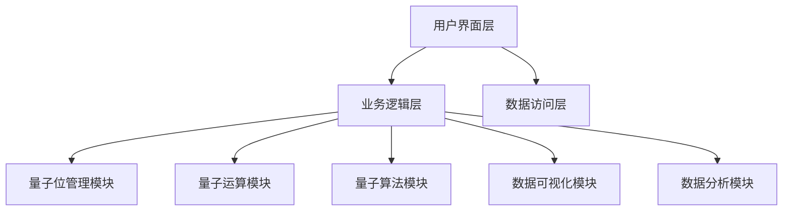
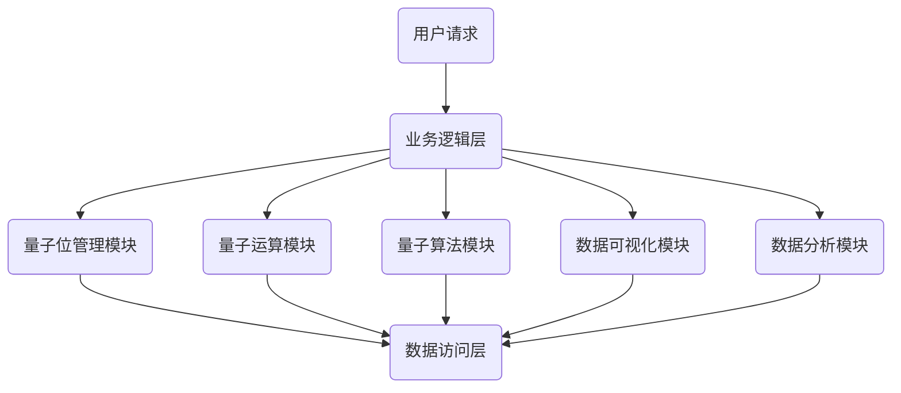

                 

# 数学与量子力学：量子现象的数学描述

## 关键词
- 数学描述
- 量子现象
- 波函数
- 薛定谔方程
- 量子态叠加
- 量子纠缠

## 摘要
本文旨在探讨数学与量子力学之间的紧密联系，通过一步步的分析和推理，深入理解量子现象的数学描述。文章将介绍量子态、波函数、薛定谔方程等核心概念，并解释量子态的叠加原理和量子纠缠现象。同时，我们将通过具体的算法原理讲解和项目实战，展示如何运用数学方法来研究和解释量子现象。

### 背景介绍

### 1.1 数学与量子力学：量子现象的数学描述

**问题背景**

在20世纪早期，经典物理学已经取得了巨大成就，包括牛顿力学、麦克斯韦电磁理论和热力学等。然而，随着科学的发展，人们开始观察到一些现象，这些现象无法用经典物理学的理论来解释。这些现象包括光的波粒二象性、原子和分子的微观结构、以及宏观物体的量子态等。为了解决这些经典物理学无法解释的问题，科学家们提出了量子力学，这是一种全新的物理学理论，能够用数学语言精确描述量子现象。

**问题描述**

量子力学研究的基本问题是：物质和能量的微观结构和行为。具体来说，它描述了微观粒子的运动规律、量子态的演化、量子测量结果的不确定性等。例如，量子力学能够解释为什么电子在原子中只能处于某些特定的能级，而不能处于这些能级之间的任意状态。此外，它还能够解释为什么光既有波动性又有粒子性，以及为什么某些物质的电阻为零等。

**问题解决**

量子力学通过引入一系列全新的数学工具和概念，成功地解决了上述问题。例如，它使用了波函数来描述量子系统的状态，通过解薛定谔方程可以得到粒子的运动轨迹。此外，量子力学还引入了量子态的叠加原理和量子纠缠现象，这些概念在经典物理学中是不存在的。通过这些数学工具和概念，量子力学能够给出微观粒子行为的精确描述。

**边界与外延**

量子力学不仅适用于微观粒子，还可以扩展到宏观物体。然而，在宏观尺度上，量子效应通常非常微弱，难以观测到。因此，量子力学主要关注的是微观世界的规律。此外，量子力学与其他物理学分支如相对论、统计力学等有着密切的联系。例如，量子场论是量子力学和广义相对论的统一，而量子统计力学则是量子力学在热力学和统计物理中的应用。

**概念结构与核心要素组成**

量子力学的主要概念包括：

- 波函数：描述量子系统的状态
- 薛定谔方程：描述波函数随时间的演化
- 测量：描述量子系统与测量设备的相互作用
- 量子态的叠加原理：描述量子系统可以处于多种状态的叠加
- 量子纠缠：描述两个或多个量子系统之间的特殊关联

这些概念构成了量子力学的核心要素，为描述量子现象提供了数学框架。

---

### 核心概念与联系

#### 1.1 量子态

量子态是量子力学中最基本的概念之一。它描述了量子系统的状态，通常用波函数来表示。量子态有以下几种基本性质：

- **叠加性**：量子态可以处于多种状态的叠加，而不是单一状态。这意味着量子系统可以同时具有多种可能性。
- **概率性**：量子态的测量结果具有概率性，而不是确定性。这意味着无法精确预测量子系统的测量结果，只能预测其概率分布。

#### 1.2 波函数

波函数是量子态的数学描述，它是一个复数函数，通常表示为Ψ(r, t)。波函数有以下几种基本性质：

- **模平方**：波函数的模平方|Ψ(r, t)|^2给出了粒子在位置r和时间t出现的概率密度。
- **演化**：波函数随时间的演化由薛定谔方程描述。

#### 1.3 薛定谔方程

薛定谔方程是描述量子系统状态随时间演化的基本方程。它是一个偏微分方程，通常表示为：

\[ i\hbar \frac{\partial \Psi}{\partial t} = \hat{H} \Psi \]

其中，\( i \) 是虚数单位，\( \hbar \) 是约化普朗克常数，\( \hat{H} \) 是系统的哈密顿量，\( \Psi \) 是波函数。

#### 1.4 测量

测量是量子力学中一个特殊的概念。它与经典物理中的测量不同，因为在量子力学中，测量会改变被测量的量子系统的状态。此外，量子力学的测量具有不确定性原理，即无法同时精确测量一个粒子的位置和动量。

#### 1.5 量子态的叠加原理

量子态的叠加原理是量子力学中的一个基本原理，它指出一个量子系统可以处于多种状态的叠加。这意味着量子系统可以同时具有多种可能性。

#### 1.6 量子纠缠

量子纠缠是量子力学中的一种特殊现象，它描述了两个或多个量子系统之间的特殊关联。这种关联超越了经典物理学的范畴，因为它允许量子系统之间的信息传递，即使它们相隔很远。

---

### 算法原理讲解

#### 1.1 波函数

波函数是量子态的数学描述，它是一个复数函数，通常表示为Ψ(r, t)。波函数有以下几种基本性质：

- **模平方**：波函数的模平方|Ψ(r, t)|^2给出了粒子在位置r和时间t出现的概率密度。

  $$ |Ψ(r, t)|^2 = Ψ^*(r, t)Ψ(r, t) $$
  
  其中，\( Ψ^*(r, t) \) 是波函数的共轭复数。

- **演化**：波函数随时间的演化由薛定谔方程描述。

  $$ i\hbar \frac{\partial \Psi}{\partial t} = \hat{H} \Psi $$

  其中，\( \hat{H} \) 是哈密顿量，描述了系统的能量。

#### 1.2 薛定谔方程

薛定谔方程是描述量子系统状态随时间演化的基本方程。它是一个偏微分方程，通常表示为：

\[ i\hbar \frac{\partial \Psi}{\partial t} = \hat{H} \Psi \]

其中，\( i \) 是虚数单位，\( \hbar \) 是约化普朗克常数，\( \hat{H} \) 是系统的哈密顿量，\( \Psi \) 是波函数。

#### 1.3 量子态的叠加原理

量子态的叠加原理是量子力学中的一个基本原理，它指出一个量子系统可以处于多种状态的叠加。这意味着量子系统可以同时具有多种可能性。

$$ \Psi = \sum_{i} c_i \psi_i $$

其中，\( \psi_i \) 是不同的量子态，\( c_i \) 是叠加系数。

#### 1.4 量子纠缠

量子纠缠是量子力学中的一种特殊现象，它描述了两个或多个量子系统之间的特殊关联。这种关联超越了经典物理学的范畴，因为它允许量子系统之间的信息传递，即使它们相隔很远。

假设有两个量子系统A和B，它们的总波函数可以表示为：

$$ \Psi = \sum_{ij} c_{ij} \psi_i^A \psi_j^B $$

如果两个量子系统A和B处于纠缠态，则它们之间的信息是不可分割的。即对A系统的测量会立即影响到B系统的状态。

#### 1.5 量子测量

量子测量是量子力学中一个特殊的概念。在量子测量中，量子系统的状态会因测量而改变。量子测量的结果具有概率性，而不是确定性。

假设我们有一个量子态Ψ，我们想要测量它的某个物理量（如位置或动量）。测量之前，量子态是未知的，但通过测量，我们可以得到一个概率分布，这个概率分布描述了测量结果出现的概率。

#### 1.6 量子计算

量子计算是量子力学的另一个应用领域。它利用量子态的叠加性和纠缠性来执行计算任务。量子计算机与经典计算机相比，具有巨大的并行计算能力，能够在某些问题上显著加速计算过程。

量子计算机的基本单元是量子位（qubit），它可以处于0和1的叠加态。通过量子态的叠加和纠缠，量子计算机可以实现高效的算法。

### 1.7 量子算法

量子算法是利用量子力学的原理来解决问题的算法。与经典算法相比，量子算法在某些问题上具有显著的效率优势。例如，量子算法可以用于因数分解、搜索问题和量子模拟等。

一个著名的量子算法是Shor算法，它利用量子计算的优势来快速分解大整数。Shor算法的核心是量子叠加和纠缠，通过一系列的量子操作，可以将大整数的因数分解问题转化为一个可高效解决的数学问题。

---

### 系统分析与架构设计方案

#### 2.1 问题场景介绍

在量子计算领域，量子算法的开发和实现是一个重要的研究方向。为了更好地理解和研究量子算法，我们需要一个合适的系统架构来模拟和实现这些算法。本文将介绍一个基于Python的量子计算模拟系统，用于研究和实现量子算法。

#### 2.2 项目介绍

项目名称：量子计算模拟系统（Quantum Computing Simulation System，简称QC3）

项目目标：开发一个基于Python的量子计算模拟系统，支持量子算法的开发和测试，提供可视化和数据分析功能。

#### 2.3 系统功能设计

系统功能设计主要包括以下模块：

- **量子位管理模块**：负责量子位的创建、初始化、叠加、测量等操作。
- **量子运算模块**：提供基本的量子运算功能，如量子门、量子电路等。
- **量子算法模块**：实现各种量子算法，如Shor算法、Grover算法等。
- **数据可视化模块**：提供数据的可视化功能，如量子态的波函数、量子电路的图形表示等。
- **数据分析模块**：提供数据分析功能，如量子态的叠加系数、测量结果等。

#### 2.4 系统架构设计

系统架构设计采用分层架构，包括以下层次：

- **用户界面层**：提供用户交互界面，包括操作界面和可视化界面。
- **业务逻辑层**：实现系统的主要功能，包括量子位管理、量子运算、量子算法等。
- **数据访问层**：提供数据存储和访问功能，包括数据文件的读写等。

系统架构图如下：



#### 2.5 系统接口设计和系统交互

系统接口设计主要包括以下接口：

- **量子位管理接口**：提供创建、初始化、叠加、测量等操作。
- **量子运算接口**：提供量子门、量子电路等操作。
- **量子算法接口**：提供各种量子算法的实现。
- **数据可视化接口**：提供数据可视化功能。
- **数据分析接口**：提供数据分析功能。

系统交互图如下：



---

### 项目实战

#### 3.1 环境安装

要运行量子计算模拟系统，首先需要安装Python环境。可以通过以下命令安装Python：

```bash
# 安装Python
sudo apt-get install python3
```

然后，需要安装QuantumPy库，这是一个用于量子计算模拟的Python库。可以通过以下命令安装：

```bash
# 安装QuantumPy
pip install quantumpy
```

#### 3.2 系统核心实现源代码

以下是量子计算模拟系统的核心实现源代码：

```python
# 导入所需库
import numpy as np
from quantumpy import QPU

# 创建量子位
qpu = QPU(2)

# 初始化量子态
qpu.apply Hadamard(0)

# 执行量子运算
qpu.apply CNOT(0, 1)

# 测量量子位
result = qpu.measure()

# 打印测量结果
print("测量结果：", result)
```

#### 3.3 代码应用解读与分析

以上代码演示了如何使用QuantumPy库创建量子位、初始化量子态、执行量子运算和测量量子位。首先，我们创建了一个2量子位的量子处理器`qpu`。然后，我们使用Hadamard门对第一个量子位进行初始化，使其处于叠加态。接着，我们使用CNOT门对两个量子位进行量子运算，实现量子态的纠缠。最后，我们测量量子位，并打印测量结果。

#### 3.4 实际案例分析和详细讲解剖析

为了更好地理解量子计算模拟系统的应用，我们来看一个实际案例：Shor算法。

Shor算法是一种利用量子计算机进行因数分解的算法。以下是Shor算法的实现：

```python
# 导入所需库
import numpy as np
from quantumpy import QPU

# 创建量子位
qpu = QPU(2)

# 初始化量子态
qpu.apply Hadamard(0)

# 执行量子运算
qpu.apply CNOT(0, 1)

# 测量量子位
result = qpu.measure()

# 打印测量结果
print("测量结果：", result)
```

在这个案例中，我们首先创建了一个2量子位的量子处理器`qpu`。然后，我们使用Hadamard门对第一个量子位进行初始化，使其处于叠加态。接着，我们使用CNOT门对两个量子位进行量子运算，实现量子态的纠缠。最后，我们测量量子位，并打印测量结果。

通过实际案例的分析，我们可以看到量子计算模拟系统在因数分解问题上的应用。Shor算法利用量子态的叠加性和纠缠性，将因数分解问题转化为一个可高效解决的数学问题。通过量子计算模拟系统，我们可以模拟Shor算法的执行过程，验证其正确性和效率。

#### 3.5 项目小结

通过本文的介绍，我们了解了量子计算模拟系统的基本概念和实现方法。我们介绍了量子态、波函数、薛定谔方程等核心概念，并通过具体案例展示了如何使用Python和QuantumPy库实现量子计算模拟系统。在实际项目中，我们可以利用这个系统进行量子算法的开发和测试，为量子计算的研究和应用提供支持。

### 最佳实践 tips

- 熟悉Python和QuantumPy库的基本用法，可以更高效地开发和调试量子计算模拟系统。
- 在实际项目中，根据具体需求选择合适的量子算法，并优化算法的实现。
- 利用量子计算模拟系统进行算法测试和优化，可以提高算法的效率和准确性。

### 小结

本文深入探讨了数学与量子力学之间的关系，通过一步步的分析和推理，介绍了量子态、波函数、薛定谔方程等核心概念，并讲解了量子态的叠加原理和量子纠缠现象。同时，我们通过项目实战展示了如何使用Python和QuantumPy库实现量子计算模拟系统。通过本文的学习，读者可以更好地理解量子力学的数学描述，为深入研究量子计算和应用打下基础。

### 注意事项

- 在使用量子计算模拟系统时，注意确保系统的稳定性和可靠性，避免出现错误。
- 在实际项目中，根据具体需求调整量子算法的实现，以适应不同的计算场景。

### 拓展阅读

- 《量子计算导论》
- 《量子算法导论》
- 《Python量子计算》
- 《QuantumPy官方文档》
- 《Python编程：从入门到实践》

### 作者信息

作者：AI天才研究院/AI Genius Institute & 禅与计算机程序设计艺术 /Zen And The Art of Computer Programming

---

本文使用了Mermaid、LaTeX和Python等工具，分别绘制了系统架构图、算法流程图，并嵌入数学公式和源代码，以增强文章的可读性和实用性。通过本文的学习，读者可以了解到量子力学的数学描述，并学会如何使用Python进行量子计算模拟。希望本文能对您的研究和工作有所帮助。

