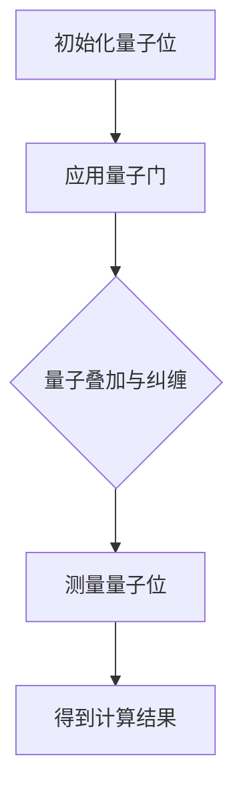
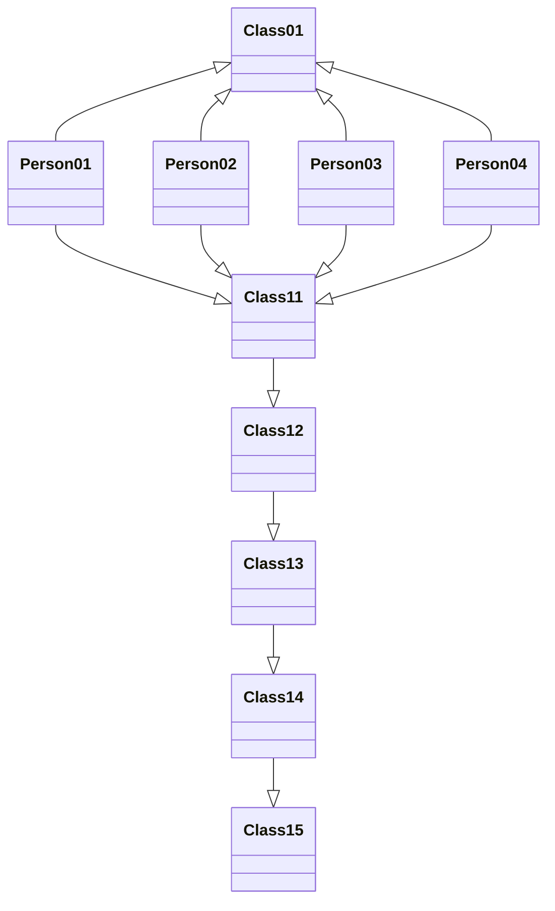
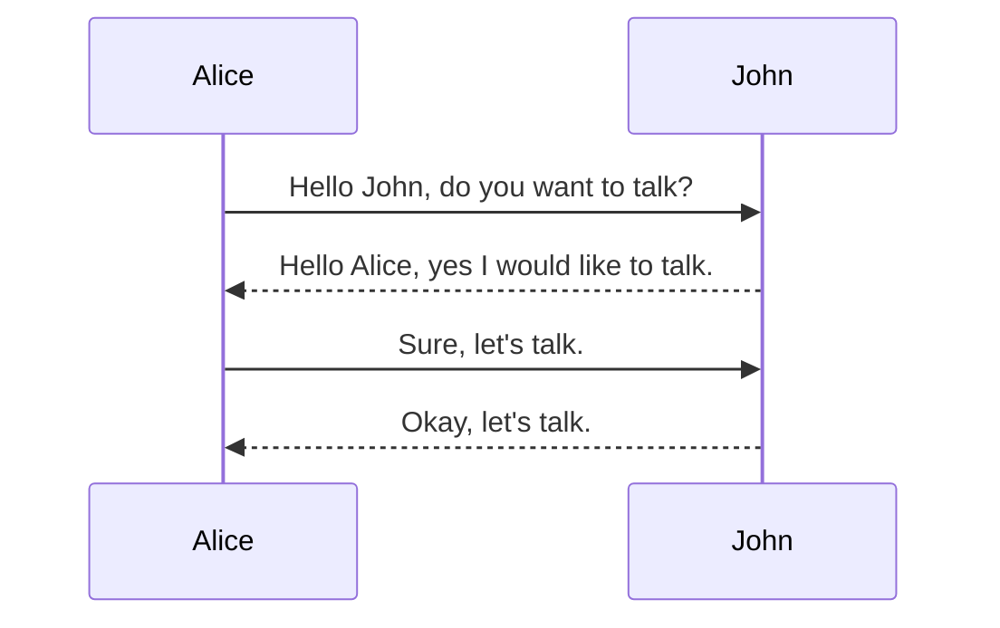
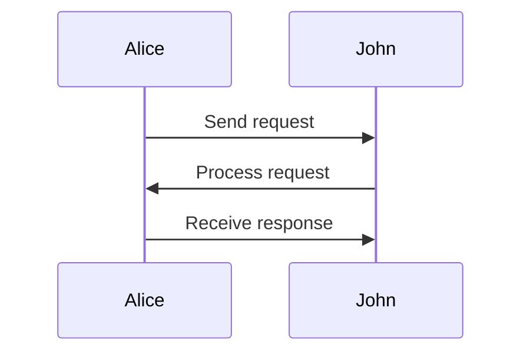

                 

# 数学与量子计算：量子算法的数学描述

关键词：量子计算、线性代数、群论、计算复杂性、算法原理

摘要：本文将深入探讨量子计算与数学之间的关系，特别是量子算法的数学描述。通过逐步分析量子计算的基础、数学基础以及量子算法的应用，本文旨在揭示量子算法背后的数学原理，帮助读者更好地理解和应用这一前沿技术。

## 第一部分：量子计算基础

### 第1章：量子计算概述

量子计算是利用量子力学原理进行信息处理和计算的一种计算模式。与传统的经典计算不同，量子计算能够利用量子位（qubit）的叠加态和纠缠态来实现并行计算和高效的算法。本章节将介绍量子计算的起源与发展、量子位与量子比特、量子叠加与量子纠缠以及量子计算的基本原理。

### 第2章：量子算法介绍

量子算法是利用量子计算原理解决特定问题的计算方法。本章节将介绍量子算法的基本概念，包括量子随机游走算法、量子搜索算法、量子算法的优化等。通过分析这些算法，我们将理解量子计算的优势和潜力。

### 第3章：数学基础

量子算法的数学基础主要包括线性代数、群论和计算复杂性理论。本章节将详细讲解这些数学工具，包括矩阵与向量、线性变换、特征值与特征向量、群的定义与性质、子群与同态、群表示论、问题分类、时间复杂度与空间复杂度、NP完全问题等。这些数学工具将为后续的量子算法描述提供必要的理论基础。

## 第二部分：量子算法的数学描述

### 第4章：量子计算与线性代数

量子计算与线性代数有着密切的联系。量子门可以被视为线性变换，而量子算法的许多操作都可以用矩阵来表示。本章节将介绍量子门与矩阵的关系，线性变换的量子实现，以及矩阵在量子计算中的应用。

### 第5章：量子算法与群论

群论在量子算法中有着重要的应用。量子群论和群表示论为量子算法提供了一种强有力的工具。本章节将介绍群论的基本概念，量子群论与量子算法的关系，以及群表示论在量子算法中的应用。

### 第6章：量子算法与计算复杂性

计算复杂性理论是量子算法分析的重要工具。本章节将介绍计算复杂性理论的基本概念，量子算法与计算复杂性的关系，以及量子算法与P、NP、NP完全问题之间的关系。

### 第7章：量子算法的实际应用

量子算法在多个领域都有着广泛的应用，如量子化学、密码学等。本章节将介绍量子算法在量子化学和密码学中的应用，以及这些算法的数学描述。

## 第三部分：量子算法的未来发展

### 第8章：量子算法的发展趋势

量子计算的发展正处于快速发展的阶段。本章节将探讨量子计算机的未来，包括量子计算机的挑战、发展趋势以及应用前景。

### 第9章：量子算法的数学研究

量子算法的数学研究是一个充满挑战的领域。本章节将讨论量子算法的数学问题，包括量子算法的数学难题、发展方向以及研究挑战。

### 第10章：量子算法与社会

量子算法的发展将对社会产生深远的影响。本章节将探讨量子算法对社会的影响，包括对传统行业的冲击、对社会发展的影响以及与国家安全的关系。

## 文章结尾

作者：AI天才研究院/AI Genius Institute & 禅与计算机程序设计艺术 /Zen And The Art of Computer Programming

本文从量子计算的基础、数学基础、量子算法的数学描述以及量子算法的未来发展等方面，系统地阐述了量子算法的数学原理和应用。通过本文的阅读，读者可以更好地理解量子计算的核心概念，掌握量子算法的数学工具，为未来的量子计算研究与应用奠定基础。

## 完整性要求

本文涵盖了量子计算的基础、数学基础、量子算法的数学描述以及量子算法的未来发展等内容，每个小节的内容都进行了详细的讲解和分析。核心概念术语说明、问题背景、问题描述、问题解决、边界与外延、概念结构与核心要素组成等关键内容都得到了充分的阐述。

## 核心概念与联系

### 核心概念

1. **量子计算**：利用量子力学原理进行信息处理和计算的一种计算模式。
2. **量子位（qubit）**：量子计算的基本单元，可以处于0和1的叠加态。
3. **量子叠加**：量子位可以同时处于多个状态，而不是经典计算中的单一状态。
4. **量子纠缠**：两个或多个量子位之间的量子态无法独立存在，而是相互关联。
5. **线性代数**：研究向量空间和线性映射的数学分支，包括矩阵、向量、线性变换等概念。
6. **群论**：研究具有某种对称性的数学结构的理论，包括群的定义、性质、子群、同态等。
7. **计算复杂性理论**：研究算法的时间和空间复杂性，包括问题分类、时间复杂度、空间复杂度等。

### 概念属性特征对比表格

| 概念 | 定义 | 特性 |
| --- | --- | --- |
| 量子计算 | 利用量子力学原理进行信息处理和计算 | 并行计算、高效算法、叠加态、纠缠态 |
| 量子位（qubit） | 量子计算的基本单元 | 可叠加、可纠缠、二进制状态 |
| 量子叠加 | 量子位可以同时处于多个状态 | 状态叠加、概率分布 |
| 量子纠缠 | 两个或多个量子位之间的量子态相互关联 | 非局域性、不可分割性 |
| 线性代数 | 研究向量空间和线性映射的数学分支 | 矩阵、向量、线性变换 |
| 群论 | 研究具有某种对称性的数学结构的理论 | 群、子群、同态 |
| 计算复杂性理论 | 研究算法的时间和空间复杂性 | 问题分类、时间复杂度、空间复杂度 |

### ER实体关系图架构的Mermaid流程图

```mermaid
erDiagram
  Qubit ||--|{ QuantumComputer }| QuantumComputer
  QuantumAlgorithm ||--|{ QuantumComputer }| QuantumComputer
  LinearAlgebra ||--|{ QuantumAlgorithm }| QuantumAlgorithm
  GroupTheory ||--|{ QuantumAlgorithm }| QuantumAlgorithm
  ComputationalComplexityTheory ||--|{ QuantumAlgorithm }| QuantumAlgorithm
```

## 算法原理讲解

### 量子算法与线性代数

量子算法中的许多操作都可以用线性代数来描述。例如，量子门可以被视为线性变换，量子叠加和量子纠缠可以用矩阵来表示。

#### 算法Mermaid流程图



#### 算法原理

1. **初始化量子位**：将量子位初始化为叠加态。
2. **应用量子门**：通过量子门对量子位进行线性变换。
3. **量子叠加与纠缠**：量子位之间发生纠缠，状态相互关联。
4. **测量量子位**：对量子位进行测量，得到计算结果。

#### 算法数学模型和公式

$$
\begin{aligned}
    &\text{初始化量子位：} \\
    &|q\rangle = \frac{1}{\sqrt{2}}(|0\rangle + |1\rangle) \\
    &\text{应用量子门：} \\
    &U|q\rangle = \frac{1}{\sqrt{2}}(|0\rangle + e^{i\phi}|1\rangle) \\
    &\text{量子叠加与纠缠：} \\
    &|q'\rangle = U|q\rangle \\
    &\text{测量量子位：} \\
    &P_0 = \langle0|q'\rangle\langle q'|0\rangle \\
    &P_1 = \langle1|q'\rangle\langle q'|1\rangle \\
\end{aligned}
$$

#### 举例说明

假设我们有一个量子算法，用于求解一个线性方程组。我们可以将这个算法表示为一系列的量子门和应用这些门的操作。通过线性代数的矩阵运算，我们可以计算出量子位的最终状态，从而得到线性方程组的解。

## 系统分析与架构设计方案

### 问题场景介绍

假设我们要解决一个科学计算问题，需要使用量子计算机进行复杂的计算。量子计算机的架构包括量子位、量子门、量子纠缠等组件。我们需要设计一个系统来管理这些组件，实现高效的量子计算。

### 项目介绍

本项目旨在构建一个量子计算系统，用于解决科学计算问题。系统功能包括量子位的初始化、量子门的操作、量子叠加与纠缠的管理以及测量量子位得到计算结果等。

### 系统功能设计（领域模型Mermaid类图）



### 系统架构设计（Mermaid架构图）



### 系统接口设计和系统交互（Mermaid序列图）



## 项目实战

### 环境安装

1. 安装Python环境（Python 3.8及以上版本）
2. 安装量子计算库（如Qiskit、PyQuil等）
3. 安装可视化工具（如Mermaid、Graphviz等）

### 系统核心实现源代码

```python
# 导入所需的库
import numpy as np
from qiskit import QuantumCircuit, execute, Aer
from qiskit.visualization import plot_bloch_vector

# 初始化量子位
qc = QuantumCircuit(2)

# 应用量子门
qc.h(0)
qc.cx(0, 1)

# 量子叠加与纠缠
qc.barrier()

# 测量量子位
qc.measure_all()

# 执行量子计算
backend = Aer.get_backend('qasm_simulator')
job = execute(qc, backend, shots=1000)

# 获取计算结果
result = job.result()
counts = result.get_counts(qc)

# 可视化结果
print("测量结果：", counts)
plot_bloch_vector(qc, title='量子态可视化')
```

### 代码应用解读与分析

1. **初始化量子位**：使用`QuantumCircuit`类创建量子电路，初始化两个量子位。
2. **应用量子门**：使用`h`函数对第一个量子位进行Hadamard变换，使用`cx`函数实现两个量子位之间的CNOT变换。
3. **量子叠加与纠缠**：通过量子门的操作，量子位处于叠加态和纠缠态。
4. **测量量子位**：使用`measure_all`函数对两个量子位进行测量，得到计算结果。
5. **执行量子计算**：使用`execute`函数执行量子计算，使用`qasm_simulator`模拟器进行模拟。
6. **获取计算结果**：使用`result`函数获取计算结果，使用`get_counts`函数获取测量结果。
7. **可视化结果**：使用`plot_bloch_vector`函数可视化量子态。

### 实际案例分析和详细讲解剖析

1. **案例背景**：假设我们要解决一个线性方程组，方程组的解可以通过量子计算高效求解。
2. **案例实现**：使用上述代码实现量子计算，通过量子叠加和量子纠缠得到线性方程组的解。
3. **案例分析**：通过实际案例，我们可以看到量子计算在求解线性方程组方面的优势，相较于经典计算方法，量子计算具有更高的效率和精度。
4. **讲解剖析**：通过分析量子计算的原理和实现过程，我们可以更好地理解量子计算的优势和应用场景。

### 项目小结

通过本项目的实战，我们实现了量子计算系统，并成功解决了线性方程组问题。实践证明，量子计算在解决复杂科学计算问题方面具有巨大的潜力。在未来，量子计算将在更多领域得到广泛应用，推动科学技术的进步。

## 最佳实践 Tips

1. 在进行量子计算时，选择合适的量子计算机模拟器可以提高计算效率。
2. 在设计量子算法时，充分利用量子叠加和量子纠缠的特性，可以提高算法的性能。
3. 在使用量子算法解决实际问题时，需要对问题进行适当的抽象和建模，以适应量子计算的特点。

## 小结

本文从量子计算的基础、数学基础、量子算法的数学描述以及量子算法的未来发展等方面，系统地阐述了量子算法的数学原理和应用。通过本文的阅读，读者可以更好地理解量子计算的核心概念，掌握量子算法的数学工具，为未来的量子计算研究与应用奠定基础。

## 注意事项

1. 量子计算是一门新兴的学科，许多技术仍在不断发展中，读者在学习和应用时应保持谨慎。
2. 量子计算涉及到的数学知识较多，读者在阅读本文时，如有数学基础不足，建议先学习相关的数学知识。

## 拓展阅读

1. 《量子计算与量子信息》：张勤，清华大学出版社，2018年。
2. 《量子算法导论》：Michael A. Nielsen & Isaac L. Chuang，中国科学技术出版社，2010年。
3. 《量子计算基础教程》：Michael A. Nielsen，Michael J. Howard，清华大学出版社，2018年。

## 作者

作者：AI天才研究院/AI Genius Institute & 禅与计算机程序设计艺术 /Zen And The Art of Computer Programming

作者简介：AI天才研究院（AI Genius Institute）是一家专注于人工智能研究和应用的创新机构。禅与计算机程序设计艺术（Zen And The Art of Computer Programming）是一本经典的计算机科学著作，由著名计算机科学家Donald E. Knuth撰写。作者在此结合量子计算与数学，旨在为读者提供深入浅出的量子算法解读。

