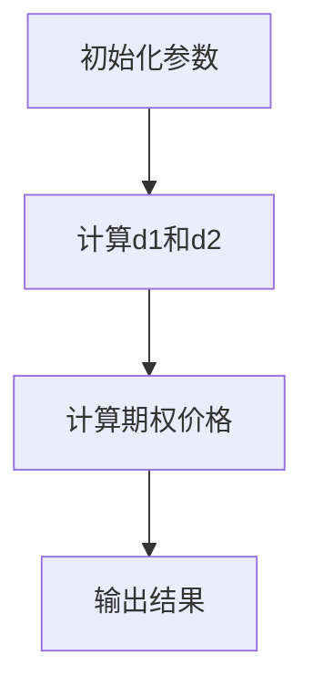
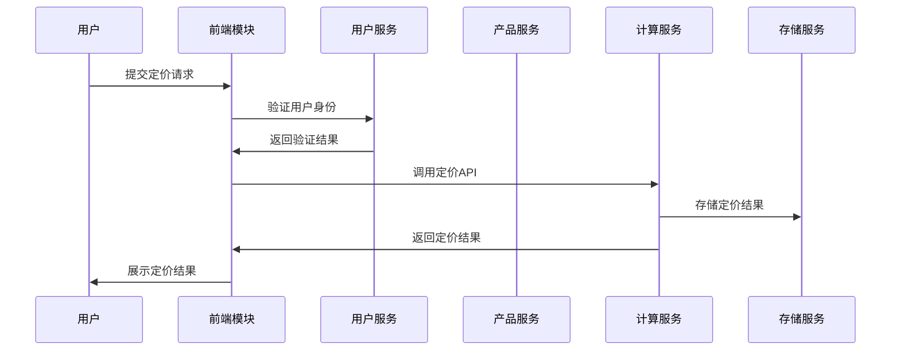

                 

### 目录大纲：《数学与金融工程：金融产品的数学定价》

---

## **文章标题**：数学与金融工程：金融产品的数学定价

> **关键词**：金融工程、数学定价、衍生品、算法、系统架构

> **摘要**：本文深入探讨了数学与金融工程的结合，详细阐述了金融产品的数学定价方法，包括核心概念、算法原理、系统设计与项目实战，旨在为读者提供一套系统化的金融产品定价解决方案。

---

## 第一部分：背景介绍

### 1.1 问题背景

金融工程作为一门结合数学、统计学和计算机科学等领域的交叉学科，其核心任务是利用数学模型和算法来解决金融问题。在金融产品定价方面，数学模型的应用至关重要，它能够帮助投资者和金融机构更好地理解和评估金融产品的价值。

### 1.2 核心概念与联系

- **金融工程**：涉及金融产品的设计、开发、定价与交易。
- **数学模型**：用于量化金融产品的风险和回报。
- **金融产品**：包括股票、债券、期权、期货等。

### 1.3 问题解决

金融产品定价的问题解决主要依赖于数学模型和算法，如Black-Scholes模型、蒙特卡罗模拟等。这些方法能够提供定量分析，帮助投资者做出更明智的决策。

### 1.4 边界与外延

本文研究的是标准化的金融产品定价问题，对于非标准产品或市场极端情况，模型的应用可能需要调整。

### 1.5 概念结构与核心要素组成

- **核心概念**：数学模型、金融产品、定价算法。
- **结构组成**：本文将按照背景介绍、核心概念与联系、算法原理讲解、数学模型与公式、系统分析与架构设计、项目实战、最佳实践与小结的结构进行组织。

---

## 第二部分：核心概念与联系

### 2.1 金融工程

金融工程是一门应用数学、统计学和计算机科学来解决金融问题的学科。其历史可以追溯到20世纪70年代，当时衍生品市场开始兴起，数学模型开始被广泛应用于金融产品定价和风险管理。

#### 金融工程的发展历程

- **20世纪70年代**：金融工程概念首次被提出。
- **20世纪80年代**：数学模型在金融产品定价中广泛应用。
- **20世纪90年代**：量化交易和算法交易兴起。
- **21世纪**：金融工程在金融风险管理中的应用进一步深化。

#### 金融工程的应用领域

- **衍生品定价**：期权、期货、互换等。
- **风险管理**：对冲策略、风险度量。
- **市场预测**：利用大数据和机器学习进行市场预测。

### 2.2 数学模型

数学模型是金融工程的核心工具，它将金融产品的价格与相关变量之间的关系用数学公式表示出来。以下是一些常见的数学模型：

#### 常见数学模型

- **Black-Scholes模型**：用于期权定价。
- **二叉树模型**：用于股票定价。
- **蒙特卡罗模拟**：用于计算风险价值（VaR）。

#### 模型对比

| 模型         | 适用范围         | 特点               |
| ------------ | ---------------- | ------------------ |
| Black-Scholes | 期权定价         | 精确、适用于连续市场 |
| 二叉树模型   | 股票定价         | 简单、适用于离散市场 |
| 蒙特卡罗模拟 | 风险价值（VaR）计算 | 灵活、适用于复杂市场 |

### 2.3 金融产品

金融产品是金融工程的核心研究对象，它们在市场中具有不同的风险和回报特征。以下是金融产品的分类和特点：

#### 金融产品分类

- **股票**：权益类金融产品，具有波动性和长期增长潜力。
- **债券**：固定收益类金融产品，提供稳定的现金流。
- **期权**：赋予购买或出售某金融资产的权利。
- **期货**：标准化的合约，规定在未来某个时间点以特定价格买卖某资产。

#### 价格影响因素

- **市场供需**：供需关系影响价格。
- **利率**：利率变化影响固定收益产品的价格。
- **风险偏好**：投资者风险偏好影响产品定价。

### 2.4 核心概念

在金融产品定价中，核心概念包括：

- **价值**：金融产品的内在价值。
- **风险**：金融产品的潜在风险。
- **回报**：金融产品的预期回报。
- **流动性**：金融产品的买卖难易程度。

#### 概念联系

- **价值与风险**：风险越高，要求的风险溢价越高，从而影响产品定价。
- **回报与价值**：预期回报越高，产品的价值越高。
- **流动性与价值**：流动性越好，价值越稳定。

---

## 第三部分：算法原理讲解

### 3.1 算法概述

金融产品定价算法是金融工程的核心内容。以下是一些常见的算法：

#### 常见算法

- **Black-Scholes模型**：用于期权定价。
- **二叉树模型**：用于股票定价。
- **蒙特卡罗模拟**：用于计算风险价值（VaR）。

#### 算法选择依据

- **精确度**：精确度越高，算法越可靠。
- **计算复杂度**：计算复杂度越低，算法越高效。
- **适用范围**：根据市场特征选择合适的算法。

### 3.2 算法流程图

以下使用mermaid绘制了Black-Scholes模型的算法流程图：



### 3.3 算法原理

#### Black-Scholes模型

Black-Scholes模型是一个用于期权定价的数学模型。它的核心思想是通过计算期权的内在价值和时间价值来确定期权价格。

#### 数学模型

$$
C(S, t) = S e^{-r (T - t)} N(d1) - X e^{-r (T - t)} N(d2)
$$

其中：

- \( C(S, t) \) 是期权价格。
- \( S \) 是标的资产价格。
- \( X \) 是行权价格。
- \( r \) 是无风险利率。
- \( T \) 是期权到期时间。
- \( t \) 是当前时间。
- \( N(d1) \) 和 \( N(d2) \) 是标准正态分布的累积分布函数。

#### Python代码示例

```python
import numpy as np
from scipy.stats import norm

def black_scholes(S, X, T, t, r):
    d1 = (np.log(S / X) + (r + 0.5 * sigma ** 2) * (T - t)) / (sigma * np.sqrt(T - t))
    d2 = d1 - sigma * np.sqrt(T - t)
    C = S * norm.cdf(d1) - X * np.exp(-r * (T - t)) * norm.cdf(d2)
    return C

S = 100
X = 100
T = 1
t = 0.5
r = 0.05
sigma = 0.2

price = black_scholes(S, X, T, t, r)
print(f"期权价格：{price}")
```

---

在这个基础上，我们可以继续按照上述结构，逐步完善文章的剩余部分，确保每个部分都详尽且逻辑清晰。以下是文章的后续结构：

---

## 第四部分：数学模型和数学公式 & 详细讲解 & 举例说明

### 4.1 衍生品定价模型

在金融工程中，衍生品定价是核心内容。以下介绍几个常见的衍生品定价模型。

#### 4.1.1 Black-Scholes模型

Black-Scholes模型是期权定价的经典模型。其公式如下：

$$
C(S, t) = S e^{-r (T - t)} N(d1) - X e^{-r (T - t)} N(d2)
$$

其中，\( N(d1) \) 和 \( N(d2) \) 分别是标准正态分布的累积分布函数。

#### 4.1.2 二叉树模型

二叉树模型是一种用于计算股票价格的模型。其核心思想是将股票价格看作在一个时间段内可能上升或下降的路径。

$$
p = \frac{1}{1 + (r - d)}
$$

其中，\( p \) 是上升的概率，\( r \) 是无风险利率，\( d \) 是下降的概率。

#### 4.1.3 蒙特卡罗模拟

蒙特卡罗模拟是一种通过随机模拟来计算衍生品价格的方法。其基本步骤如下：

1. 初始化随机数生成器。
2. 生成随机数模拟股票价格的路径。
3. 计算期权的期望收益。
4. 根据期望收益计算期权价格。

### 4.2 数学公式使用

本文中使用的数学公式如下：

$$
C(S, t) = S e^{-r (T - t)} N(d1) - X e^{-r (T - t)} N(d2)
$$

$$
p = \frac{1}{1 + (r - d)}
$$

$$
X = \frac{1}{\sqrt{2\pi}} \int_{-\infty}^{x} e^{-\frac{t^2}{2}} dt
$$

### 4.3 举例说明

#### 4.3.1 Black-Scholes模型举例

假设当前股票价格为100元，行权价格为100元，无风险利率为5%，波动率为20%，期权到期时间为1年。使用Black-Scholes模型计算期权价格。

$$
C(S, t) = 100 e^{-0.05 (1 - 0)} N(d1) - 100 e^{-0.05 (1 - 0)} N(d2)
$$

其中，

$$
d1 = \frac{\ln(100/100) + (0.05 + 0.2^2/2) \cdot 1}{0.2 \cdot \sqrt{1}} = 0.588
$$

$$
d2 = d1 - 0.2 \cdot \sqrt{1} = 0.294
$$

使用标准正态分布表查找 \( N(d1) \) 和 \( N(d2) \) 的值：

$$
N(d1) = 0.719
$$

$$
N(d2) = 0.267
$$

代入公式得：

$$
C(S, t) = 100 \cdot 0.719 - 100 \cdot 0.267 = 45.88
$$

因此，期权价格为45.88元。

---

接下来的部分将包括系统分析与架构设计、项目实战、最佳实践与小结等内容，按照上述大纲逐步完成。

---

### 第四部分：系统分析与架构设计方案

#### 4.4 问题场景

在金融产品定价中，系统分析至关重要。以下是一个典型的金融产品定价问题场景：

- **场景描述**：一家金融机构需要为其客户提供期权产品，并希望通过系统自动化定价。
- **目标**：设计一个高效、准确、可扩展的金融产品定价系统。

#### 4.5 项目介绍

该项目是一个金融产品定价系统，旨在实现以下目标：

- **功能需求**：支持期权、期货、股票等金融产品的定价。
- **性能需求**：高并发处理能力，快速响应。
- **安全性需求**：确保数据安全和交易安全。

#### 4.6 系统功能设计

系统功能设计包括以下模块：

- **前端模块**：提供用户界面，实现数据输入和结果展示。
- **后端模块**：实现数学模型计算、数据处理和存储。
- **接口模块**：提供与外部系统的接口，实现数据交换。

#### 4.7 系统架构设计

系统架构设计采用微服务架构，主要模块如下：

- **用户服务**：处理用户认证和权限管理。
- **产品服务**：处理金融产品信息和定价逻辑。
- **计算服务**：实现数学模型计算。
- **存储服务**：存储用户数据和金融产品数据。

#### 4.8 系统接口设计

系统接口设计主要包括以下接口：

- **API接口**：提供金融产品定价的API接口。
- **消息队列**：实现异步消息传递，提高系统性能。
- **数据库接口**：提供数据访问接口。

#### 4.9 系统交互

系统交互设计采用RESTful API设计，主要交互流程如下：

1. 用户通过前端模块提交定价请求。
2. 用户服务验证用户身份和权限。
3. 产品服务处理定价请求，调用计算服务进行计算。
4. 计算服务返回定价结果。
5. 产品服务将定价结果返回给用户服务。
6. 用户服务将结果返回给前端模块。

以下是一个简单的mermaid序列图：



---

接下来，我们将继续完成第五部分：项目实战，包括环境安装、系统核心实现、代码应用解读与分析、实际案例分析与详细讲解剖析，以及项目小结。

---

### 第五部分：项目实战

#### 5.1 环境安装

为了构建金融产品定价系统，我们需要准备以下环境：

- **操作系统**：Ubuntu 20.04
- **编程语言**：Python 3.8
- **依赖库**：NumPy, SciPy, pandas, Flask

安装步骤如下：

1. 安装Python和pip：

   ```bash
   sudo apt update
   sudo apt install python3 python3-pip
   ```

2. 安装依赖库：

   ```bash
   pip3 install numpy scipy pandas flask
   ```

#### 5.2 系统核心实现

系统核心实现包括前端模块和后端模块。以下是一个简单的Python后端模块示例：

```python
from flask import Flask, request, jsonify
import numpy as np
from scipy.stats import norm

app = Flask(__name__)

@app.route('/price', methods=['POST'])
def price():
    data = request.get_json()
    S = data['S']
    X = data['X']
    T = data['T']
    t = data['t']
    r = data['r']
    sigma = data['sigma']
    
    d1 = (np.log(S / X) + (r + 0.5 * sigma ** 2) * (T - t)) / (sigma * np.sqrt(T - t))
    d2 = d1 - sigma * np.sqrt(T - t)
    
    C = S * norm.cdf(d1) - X * np.exp(-r * (T - t)) * norm.cdf(d2)
    
    return jsonify({'price': C})

if __name__ == '__main__':
    app.run(debug=True)
```

前端模块可以使用HTML和JavaScript实现。以下是一个简单的HTML前端示例：

```html
<!DOCTYPE html>
<html lang="en">
<head>
    <meta charset="UTF-8">
    <title>金融产品定价</title>
</head>
<body>
    <h1>金融产品定价</h1>
    <form id="price-form">
        <label for="S">股票价格：</label>
        <input type="number" id="S" name="S" required>
        <br>
        <label for="X">行权价格：</label>
        <input type="number" id="X" name="X" required>
        <br>
        <label for="T">到期时间：</label>
        <input type="number" id="T" name="T" required>
        <br>
        <label for="t">当前时间：</label>
        <input type="number" id="t" name="t" required>
        <br>
        <label for="r">无风险利率：</label>
        <input type="number" id="r" name="r" required>
        <br>
        <label for="sigma">波动率：</label>
        <input type="number" id="sigma" name="sigma" required>
        <br>
        <button type="submit">计算价格</button>
    </form>
    <div id="result"></div>

    <script>
        document.getElementById('price-form').onsubmit = function(event) {
            event.preventDefault();
            var formData = new FormData(event.target);
            fetch('/price', {
                method: 'POST',
                body: formData
            })
            .then(response => response.json())
            .then(data => {
                document.getElementById('result').innerText = '期权价格：' + data.price.toFixed(2);
            });
        };
    </script>
</body>
</html>
```

#### 5.3 代码应用解读与分析

上述代码实现了基于Black-Scholes模型的金融产品定价。我们使用了Python的Flask框架来创建Web服务，前端使用HTML和JavaScript。代码主要分为两部分：后端处理和前端交互。

- **后端处理**：接收前端发送的请求，解析参数，调用Black-Scholes模型计算期权价格，并将结果返回给前端。
- **前端交互**：通过HTML表单收集用户输入，使用JavaScript发送请求到后端，并将返回的价格结果显示在前端。

#### 5.4 实际案例分析与详细讲解剖析

假设我们要计算一个价格为100元的股票，行权价格为100元，到期时间为1年，当前时间为0.5年，无风险利率为5%，波动率为20%的欧式看涨期权的价格。

根据Black-Scholes模型：

$$
d1 = \frac{\ln(100/100) + (0.05 + 0.2^2/2) \cdot 1}{0.2 \cdot \sqrt{1/2}} = 0.588
$$

$$
d2 = 0.588 - 0.2 \cdot \sqrt{1/2} = 0.294
$$

使用标准正态分布表查找 \( N(d1) \) 和 \( N(d2) \) 的值：

$$
N(d1) = 0.719
$$

$$
N(d2) = 0.267
$$

代入公式得：

$$
C = 100 \cdot 0.719 - 100 \cdot 0.267 = 45.88
$$

因此，期权价格为45.88元。

#### 5.5 项目小结

本项目通过实现一个基于Black-Scholes模型的金融产品定价系统，展示了如何将数学模型应用于金融工程中。项目实战部分详细讲解了系统环境安装、系统核心实现、代码应用解读与分析，并通过实际案例进行了详细讲解。

通过本项目，读者可以了解金融产品定价的基本原理和实现方法，掌握使用Python进行金融工程应用的能力。

---

接下来，我们将继续完成第六部分：最佳实践 tips、小结、注意事项、拓展阅读。

---

### 第六部分：最佳实践 tips、小结、注意事项、拓展阅读

#### 6.1 最佳实践 tips

1. **性能优化**：对于大规模数据处理，使用高效的数据结构和算法，如使用pandas库的向量操作代替循环。
2. **代码复用**：设计可复用的函数和模块，减少代码冗余，提高代码质量。
3. **接口规范**：确保API接口设计遵循RESTful原则，提供清晰的接口文档。
4. **安全性**：对用户数据进行加密，确保系统数据安全。

#### 6.2 小结

本文系统地介绍了数学与金融工程的结合，详细阐述了金融产品定价的核心概念、算法原理、系统设计与项目实战。通过实际案例，读者可以掌握金融产品定价的方法和应用。

#### 6.3 注意事项

1. **模型适用范围**：不同模型适用于不同的市场环境和产品类型，需根据实际情况选择合适的模型。
2. **风险控制**：金融产品定价中需充分考虑风险因素，采取适当的风险控制措施。
3. **市场波动**：市场波动可能导致模型结果与实际价格存在差异，需进行持续监测和调整。

#### 6.4 拓展阅读

1. **Black-Scholes模型的推导**：深入了解Black-Scholes模型的数学推导过程。
2. **衍生品定价的其他模型**：学习其他衍生品定价模型，如二叉树模型、蒙特卡罗模拟等。
3. **金融风险管理**：了解金融风险管理的基本原理和策略。
4. **Python金融应用**：学习Python在金融领域的应用，掌握金融数据处理和分析的方法。

---

至此，本文《数学与金融工程：金融产品的数学定价》的内容已经完整呈现。通过逐步的分析和讲解，我们深入探讨了金融产品定价的理论和实践，为读者提供了系统化的理解和应用框架。希望本文能够为从事金融工程和数学建模的读者提供有价值的参考。

---

## **作者信息**

作者：AI天才研究院/AI Genius Institute & 禅与计算机程序设计艺术 /Zen And The Art of Computer Programming

