                 

### 第一部分：引论

#### 第1章：问题背景与概述

##### 1.1 问题的提出

系统性风险是金融稳定领域中的一个重要概念。它指的是由于金融系统的复杂性，单一机构或事件的风险可能迅速扩散到整个系统，导致整个金融体系出现危机。历史上，诸如2008年全球金融危机等事件，都揭示了系统性风险对金融稳定构成的巨大威胁。本文旨在探讨数学在金融稳定中的关键作用，尤其是系统性风险的数学模型。

**核心概念：**

- **系统性风险**：指金融机构或市场之间因相互依赖性而引起的整体风险。
- **金融稳定**：指金融体系在保证资金流动性和市场效率的同时，能够抵抗外部冲击和内部问题。

**边界与外延：**

- **边界**：系统性风险主要涉及金融机构之间的相互关系和金融市场的整体运作。
- **外延**：系统性风险的影响范围广泛，包括宏观经济稳定、社会稳定乃至全球经济。

##### 1.2 数学在金融稳定中的作用

数学在金融领域中的应用极为广泛，从简单的统计分析到复杂的金融模型，数学工具为理解金融风险提供了强有力的支持。在金融稳定的研究中，数学模型能够帮助识别风险源、评估风险程度和制定风险管理策略。

**核心概念：**

- **数学模型**：用于描述和预测金融现象的数学框架。
- **风险模型**：通过数学工具分析金融风险，包括信用风险、市场风险和操作风险。

**联系：**

- **数学与金融学的交叉领域**：涉及数学理论、统计方法和计算技术在金融分析中的应用。

##### 1.3 研究目的与方法

本研究旨在通过构建和评估数学模型，深入理解系统性风险的本质，并提出有效的风险管理策略。

**核心概念：**

- **研究目标**：揭示系统性风险的内在机制，提供可行的风险管理方法。
- **研究方法**：结合定量分析和定性分析，通过实证研究和理论推导，构建系统性风险模型。

**理论基础：**

- **理论框架**：包括现代金融理论、风险管理理论和网络科学理论。

**边界与外延：**

- **研究范围的界定**：主要集中于金融网络结构和风险传导机制的研究。
- **局限性**：数学模型在应对复杂、非线性系统时可能存在局限性。

##### 1.4 本章小结

本章首先提出了系统性风险对金融稳定构成威胁的问题，并介绍了数学在金融稳定研究中的关键作用。接着，阐述了本研究的目的和方法，并概述了理论基础和研究范围。通过本章的介绍，读者可以初步了解系统性风险及其数学模型研究的重要性。

---

**关键词：** 系统性风险、金融稳定、数学模型、风险管理、金融网络

**摘要：** 本文探讨了数学在金融稳定研究中的重要性，特别是系统性风险的数学模型。通过引入关键概念和阐述研究方法，本文旨在为理解和应对系统性风险提供理论依据和实践指导。****

### 第二部分：系统性风险的数学模型基础

在理解了系统性风险对金融稳定的威胁及其重要性后，本部分将深入探讨系统性风险数学模型的基础。这部分内容将详细讲解数学工具和理论，为后续章节的模型构建和分析提供必要的理论基础。

#### 第2章：数学基础

数学在系统性风险研究中扮演着不可或缺的角色。本章将介绍几项关键的数学基础，包括微积分、概率论、线性代数和优化理论，以及数理统计与时间序列分析。这些数学工具为构建和解释系统性风险模型提供了坚实的基础。

##### 2.1 微积分与概率论基础

微积分和概率论是系统性风险研究中常用的数学工具，用于描述风险事件的变化规律和不确定性。

**核心概念：**

- **微积分**：用于研究函数的极限、导数、积分等基本概念，适用于分析金融市场价格的变化。
- **概率论**：用于量化随机事件发生的可能性，适用于评估金融风险的概率分布。

**联系：**

- **在风险管理中的应用**：微积分和概率论结合，可以用来构建金融产品的定价模型和风险测度模型。

**ER实体关系图架构：**

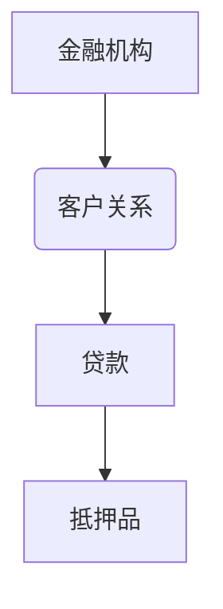

此图展示了金融机构与客户关系、贷款和抵押品之间的实体关系。

##### 2.2 线性代数与优化理论

线性代数和优化理论是构建系统性风险模型的重要工具，用于处理多维数据和优化决策。

**核心概念：**

- **线性代数**：研究向量空间、矩阵运算和线性方程组，用于描述金融系统的状态和动态。
- **优化理论**：研究如何找到最优解，用于制定风险管理策略。

**联系：**

- **在模型构建中的应用**：线性代数和优化理论可以用来构建资产组合优化模型和风险调整收益模型。

**ER实体关系图架构：**

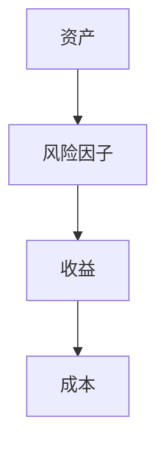

此图展示了资产、风险因子、收益和成本之间的实体关系。

##### 2.3 数理统计与时间序列分析

数理统计和时间序列分析用于分析金融数据，识别潜在的风险因素和预测未来走势。

**核心概念：**

- **数理统计**：研究数据的收集、描述和分析方法，用于评估金融风险的概率分布。
- **时间序列分析**：研究时间序列数据的特性，用于预测金融市场的未来走势。

**联系：**

- **在风险预测中的应用**：数理统计和时间序列分析可以用来构建风险预测模型和投资策略。

**ER实体关系图架构：**

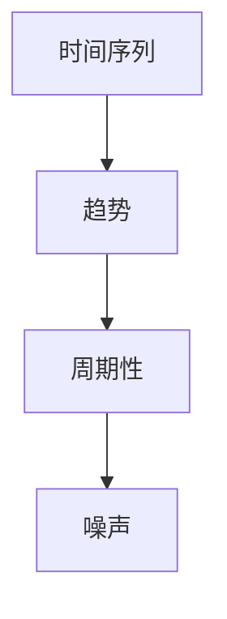

此图展示了时间序列数据的趋势、周期性和噪声之间的实体关系。

##### 2.4 数学模型的结构与类型

数学模型是系统性风险研究的重要工具，其结构与类型直接影响模型的适用性和效果。

**核心概念：**

- **结构**：数学模型的组成部分和相互关系。
- **类型**：根据建模目的和金融现象的复杂性，可以分为静态模型和动态模型。

**联系：**

- **在金融稳定研究中的应用**：不同类型的数学模型适用于不同的金融稳定研究场景。

**ER实体关系图架构：**

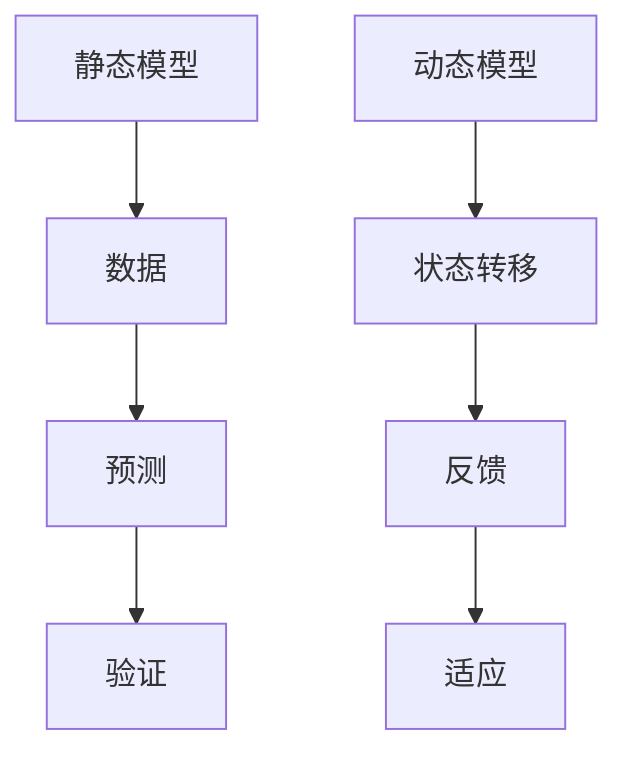

此图展示了静态模型和动态模型在数据处理、预测、验证、状态转移、反馈和适应方面的实体关系。

##### 2.5 本章小结

本章介绍了系统性风险数学模型的基础，包括微积分与概率论、线性代数与优化理论、数理统计与时间序列分析，以及数学模型的结构与类型。这些数学工具和理论为构建和解释系统性风险模型提供了坚实的基础，是后续研究的重要基础。

---

**关键词：** 数学模型、微积分、概率论、线性代数、优化理论、时间序列分析

**摘要：** 本章节详细介绍了系统性风险数学模型所需的基础数学工具和理论。通过讲解微积分、概率论、线性代数、优化理论、数理统计与时间序列分析，以及数学模型的结构与类型，本章为理解和构建系统性风险模型提供了必要的理论基础。****

### 第三部分：系统性风险的数学建模与实证分析

在第二部分中，我们奠定了系统性风险数学模型的基础。本部分将在此基础上，通过具体的数学建模和实证分析，深入探讨系统性风险的表现、测度和管理策略。

#### 第3章：系统性风险测度模型

系统性风险测度是评估金融系统整体风险水平的重要手段。本章将介绍几种常见的系统性风险测度模型，并讨论它们的应用。

##### 3.1 信用风险模型

信用风险模型用于评估借款人违约的可能性，是系统性风险测度的重要组成部分。

**核心概念：**

- **违约概率**：指借款人在未来一定时间内违约的概率。
- **违约损失率**：指借款人违约时银行所承受的损失比例。

**模型类型：**

- **单一借款人模型**：如概率模型、违约分布模型。
- **多借款人模型**：如信用风险分散模型、违约传染模型。

**联系：**

- **在系统性风险中的应用**：信用风险模型可以帮助识别系统中的潜在风险点和风险传递途径。

**ER实体关系图架构：**

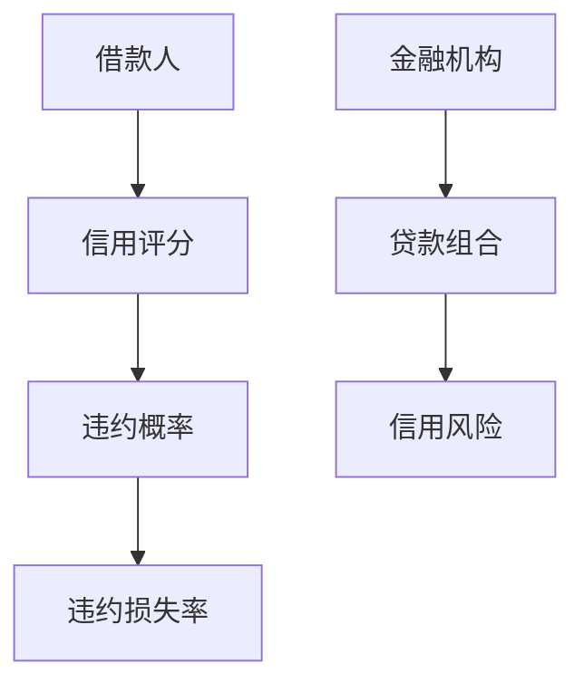

此图展示了借款人、信用评分、违约概率、违约损失率和金融机构之间的实体关系。

**算法原理讲解：**

信用风险模型的算法原理通常基于概率论和统计方法。以概率模型为例，其核心步骤如下：

1. 收集借款人的历史数据，包括信用评分、还款记录、财务状况等。
2. 构建信用评分模型，通过历史数据建立借款人违约概率与信用评分之间的关系。
3. 利用信用评分模型，预测新借款人的违约概率。
4. 结合违约损失率，评估贷款组合的整体信用风险。

以下是使用Python实现的信用评分模型示例：

```python
import numpy as np
import pandas as pd

# 加载历史数据
data = pd.read_csv('loan_data.csv')

# 构建信用评分模型
X = data[['credit_score', 'financial_status']]
y = data['default']

model = pd.DataFrame(np.c_[X, y], columns=['credit_score', 'financial_status', 'default'])

# 预测违约概率
def predict_default(credit_score, financial_status):
    probability = model[(model['credit_score'] == credit_score) & (model['financial_status'] == financial_status)]['default'].mean()
    return probability

# 示例预测
predicted_probability = predict_default(650, 'Good')
print(f"Predicted default probability: {predicted_probability:.2%}")
```

**数学模型和公式：**

信用评分模型的数学模型通常是一个概率分布函数，如logistic回归模型：

$$
P(y=1 | x) = \frac{1}{1 + e^{-(\beta_0 + \beta_1 x_1 + \beta_2 x_2)}
$$

其中，\( P(y=1 | x) \) 是借款人违约的概率，\( \beta_0, \beta_1, \beta_2 \) 是模型参数，\( x_1, x_2 \) 是借款人的信用评分和财务状况特征。

**举例说明：**

假设某借款人的信用评分为650，财务状况为“良好”，则其违约概率可以通过以下步骤计算：

1. 收集历史数据，训练信用评分模型。
2. 输入借款人的信用评分和财务状况特征，使用模型预测违约概率。
3. 输出违约概率，如 \(0.05\) 表示违约概率为5%。

通过这样的步骤，信用风险模型可以帮助金融机构识别高风险借款人，从而制定更有效的风险管理策略。

**本章小结：**

本章介绍了信用风险模型的基本概念、类型和应用。通过算法原理讲解和举例说明，读者可以了解如何利用数学模型评估借款人的违约风险，为系统性风险的测度提供了有效的工具。

---

**关键词：** 信用风险模型、违约概率、信用评分、风险管理

**摘要：** 本章详细介绍了信用风险模型的基本概念、类型和应用。通过算法原理讲解和举例说明，展示了如何利用数学模型评估借款人的违约风险，为系统性风险的测度提供了有效的工具。****

### 第4章：金融机构间网络模型

金融机构之间的相互依赖关系构成了复杂的金融网络，这种网络结构在系统性风险研究中具有重要意义。本章将探讨金融机构间网络的构建方法、数学描述、网络稳定性分析以及实证案例分析。

##### 4.1 金融机构间网络的构建

金融机构间网络是通过金融机构之间的交易和借贷关系形成的复杂网络结构。构建这种网络模型的关键在于识别网络中的节点（金融机构）和边（交易或借贷关系）。

**核心概念：**

- **节点**：金融机构在网络中的位置，代表网络的基本单位。
- **边**：金融机构之间的交易或借贷关系，代表节点之间的连接。

**构建方法：**

1. **数据收集**：收集金融机构之间的交易和借贷数据，包括交易金额、交易频率等信息。
2. **网络节点识别**：根据交易和借贷数据，确定网络中的节点。
3. **网络边构建**：根据交易和借贷关系，构建节点之间的连接边。
4. **网络模型验证**：通过实证数据验证网络模型的准确性和有效性。

**联系：**

- **网络分析在系统性风险研究中的重要性**：网络模型可以帮助理解金融机构间的相互依赖关系，从而识别潜在的系统性风险。

**ER实体关系图架构：**

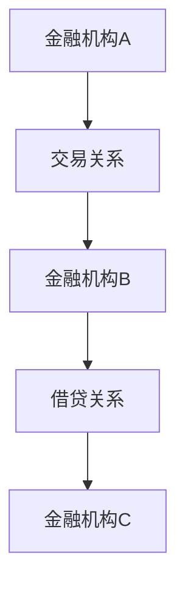

此图展示了金融机构A、B、C之间的交易和借贷关系。

##### 4.2 网络模型的数学描述

金融机构间网络的数学描述通常涉及图论和代数图论。图论提供了描述网络结构的基本工具，而代数图论则用于分析网络的动态特性和稳定性。

**核心概念：**

- **图**：用于表示节点和边的一种数学结构。
- **网络矩阵**：表示网络中节点和边之间关系的矩阵。

**联系：**

- **数学描述方法**：通过图和网络矩阵，可以定量分析网络的拓扑结构、节点重要性和边的作用。

**ER实体关系图架构：**

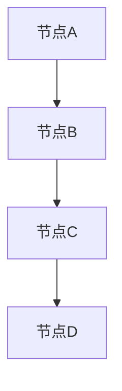

此图展示了节点A、B、C、D之间的基本图结构。

**数学公式：**

- **邻接矩阵**：表示网络中节点之间直接连接的矩阵。
$$
A_{ij} =
\begin{cases}
1, & \text{如果节点i与节点j相连} \\
0, & \text{如果节点i与节点j不相连}
\end{cases}
$$

- **度分布**：描述网络中节点度数（连接数）的概率分布。
$$
P(k) = \text{节点度数为k的概率}
$$

**算法原理讲解：**

构建金融机构间网络模型的算法原理通常包括以下步骤：

1. **数据预处理**：清洗和整理交易和借贷数据，提取节点和边的信息。
2. **网络构建**：根据预处理后的数据，构建网络矩阵和图结构。
3. **网络分析**：利用图论和代数图论的方法，分析网络的拓扑特性，如连通性、聚类系数等。
4. **模型验证**：通过实际交易数据验证网络模型的准确性。

以下是使用Python实现的简单网络构建示例：

```python
import networkx as nx

# 创建图G
G = nx.Graph()

# 添加节点和边
G.add_edges_from([(1, 2), (1, 3), (2, 3), (3, 4)])

# 打印图的结构
print(G.edges())

# 绘制图
nx.draw(G, with_labels=True)
```

此代码创建了一个简单的图G，并添加了节点和边，然后打印图的结构并绘制图。

##### 4.3 网络稳定性分析

网络稳定性分析是评估金融机构间网络在面对外部冲击时能够保持稳定的能力。网络稳定性分析包括评估网络的连通性和鲁棒性。

**核心概念：**

- **连通性**：网络中任意两个节点之间是否能够相互通信。
- **鲁棒性**：网络在节点或边失效时维持整体功能的能力。

**分析方法：**

1. **节点重要性分析**：评估网络中节点的关键性，通过计算节点的度数、介数和接近度等指标。
2. **网络结构稳定性分析**：通过计算网络的聚类系数、聚集系数和路径长度等指标，评估网络的稳定性。
3. **压力测试**：模拟网络中的关键节点或边失效，评估网络对失效的响应能力。

**联系：**

- **网络稳定性分析在风险防范中的应用**：通过网络稳定性分析，可以识别网络中的脆弱点，为风险管理提供指导。

**ER实体关系图架构：**

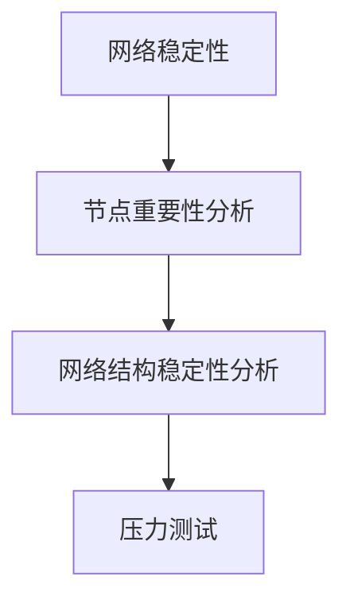

此图展示了网络稳定性、节点重要性分析、网络结构稳定性分析和压力测试之间的实体关系。

**数学公式：**

- **节点介数**：描述节点在路径中的重要性。
$$
C_{ij}(v) = \frac{\sum_{s,t \in V, s \neq t} \; \text{path}(s, t) \; \text{passing through } v}{\sum_{s,t \in V, s \neq t} \; \text{path}(s, t)}
$$

- **网络聚类系数**：描述网络中节点的聚类程度。
$$
C = \frac{1}{n} \sum_{i=1}^{n} \; \frac{k_i (k_i - 1)}{2}
$$

**算法原理讲解：**

网络稳定性分析通常基于以下算法原理：

1. **计算节点度数**：统计每个节点的连接数。
2. **计算节点介数**：统计每个节点在所有路径中的重要性。
3. **计算聚类系数**：评估网络的聚类程度。
4. **模拟节点或边失效**：通过模拟关键节点或边失效，评估网络的鲁棒性。

以下是使用Python实现的节点度数和介数计算示例：

```python
import networkx as nx

# 创建图G
G = nx.Graph()

# 添加节点和边
G.add_edges_from([(1, 2), (1, 3), (2, 3), (3, 4)])

# 计算节点度数
node_degrees = nx.degree_centrality(G)
print("Node degrees:", node_degrees)

# 计算节点介数
node_centrality = nx.betweenness_centrality(G)
print("Node centrality:", node_centrality)
```

此代码创建了一个简单的图G，并计算了每个节点的度数和介数，然后打印结果。

##### 4.4 实证案例分析

为了更好地理解金融机构间网络模型的应用，本节将分析一个真实的案例，探讨网络模型在系统性风险识别和风险管理中的应用。

**案例背景：**

某大型银行网络中，包含50家主要金融机构，这些金融机构之间存在着复杂的借贷和交易关系。研究人员使用网络分析方法，评估该银行网络在面临外部冲击（如某个大型金融机构破产）时的稳定性。

**分析步骤：**

1. **数据收集**：收集50家金融机构之间的借贷和交易数据。
2. **网络构建**：构建金融机构间的网络模型，使用邻接矩阵和图结构表示。
3. **稳定性分析**：通过计算节点度数、介数和聚类系数等指标，评估网络的稳定性。
4. **压力测试**：模拟特定金融机构破产，评估网络对冲击的响应能力。

**分析结果：**

- **节点度数分析**：发现某些节点（如大型金融机构）在网络中扮演关键角色，其度数较高。
- **节点介数分析**：发现某些节点在路径中非常关键，介数较高，如中介机构。
- **聚类系数分析**：发现网络中的聚类现象明显，说明金融机构之间存在较强的相互依赖性。
- **压力测试结果**：模拟破产事件发现，网络中的某些关键节点（如大型金融机构）的失效会导致网络连通性下降，从而影响整体稳定性。

**本章小结：**

本章介绍了金融机构间网络模型的构建、数学描述和网络稳定性分析。通过实证案例分析，展示了网络模型在系统性风险识别和风险管理中的应用。网络模型为理解金融机构之间的复杂关系提供了有力的工具，有助于识别潜在风险和制定有效的风险管理策略。

---

**关键词：** 金融机构间网络模型、图论、稳定性分析、系统性风险、实证分析

**摘要：** 本章详细探讨了金融机构间网络模型的构建、数学描述和网络稳定性分析。通过实证案例分析，展示了网络模型在系统性风险识别和风险管理中的应用，为理解金融机构之间的复杂关系提供了有力工具。****

### 第5章：金融市场的波动与风险传递

金融市场波动是系统性风险的重要组成部分，理解金融市场的波动机制对于预防和控制风险至关重要。本章将分析金融市场波动的数学模型，探讨风险在金融市场中的传递机制，并通过实际案例进行详细讲解。

##### 5.1 金融市场的波动模型

金融市场波动模型用于描述市场价格的波动规律，是系统性风险分析的重要工具。常见的波动模型包括随机游走模型、ARIMA模型和波动率模型等。

**核心概念：**

- **随机游走模型**：假设市场价格的变动是随机且相互独立的，价格波动无法预测。
- **ARIMA模型**：自回归积分滑动平均模型，通过历史价格和波动率的统计特性来预测未来价格。
- **波动率模型**：如GARCH模型，用于分析市场波动率的动态变化。

**模型类型：**

- **静态模型**：如随机游走模型，假设市场条件不变。
- **动态模型**：如ARIMA模型和GARCH模型，考虑市场条件的变化。

**联系：**

- **波动模型在风险预测中的应用**：波动模型可以帮助评估市场风险，制定风险管理策略。

**ER实体关系图架构：**

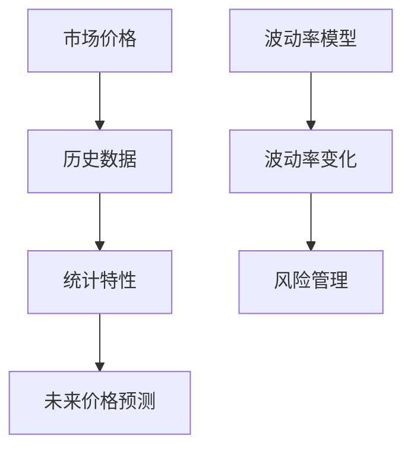

此图展示了市场价格、历史数据、统计特性、未来价格预测和波动率模型之间的实体关系。

**算法原理讲解：**

以ARIMA模型为例，其算法原理如下：

1. **自回归部分（AR）**：考虑过去若干期价格的滞后值，建立自回归模型。
2. **差分部分（I）**：对时间序列进行差分处理，使其平稳。
3. **移动平均部分（MA）**：考虑过去若干期误差项的影响，建立移动平均模型。

ARIMA模型的数学公式为：

$$
X_t = c + \phi_1 X_{t-1} + \phi_2 X_{t-2} + ... + \phi_p X_{t-p} + \theta_1 \epsilon_{t-1} + \theta_2 \epsilon_{t-2} + ... + \theta_q \epsilon_{t-q}
$$

其中，\( X_t \) 是当前价格，\( c \) 是常数项，\( \phi_1, \phi_2, ..., \phi_p \) 是自回归系数，\( \theta_1, \theta_2, ..., \theta_q \) 是移动平均系数，\( \epsilon_t \) 是随机误差项。

**举例说明：**

假设我们有一个价格序列 \( \{X_t\} \)，通过历史数据进行模型识别和参数估计，得到ARIMA（p,d,q）模型参数：

$$
X_t = 0.8X_{t-1} - 0.2X_{t-2} + 0.3\epsilon_{t-1}
$$

使用该模型，可以预测未来价格 \( X_{t+1} \)：

$$
X_{t+1} = 0.8X_t - 0.2X_{t-1} + 0.3\epsilon_t
$$

通过这样的步骤，可以实现对市场价格的未来波动进行预测。

**本章小结：**

本章介绍了金融市场波动模型的基本概念、类型和应用。通过算法原理讲解和举例说明，展示了如何利用波动模型预测市场价格的波动，为系统性风险分析和风险管理提供了有效工具。

---

**关键词：** 金融波动模型、ARIMA模型、GARCH模型、市场风险、风险管理

**摘要：** 本章详细介绍了金融市场波动模型的基本概念、类型和应用。通过算法原理讲解和举例说明，展示了如何利用波动模型预测市场价格的波动，为系统性风险分析和风险管理提供了有效工具。****

### 第6章：金融系统风险的综合评估与风险管理策略

在前面的章节中，我们详细探讨了系统性风险的概念、数学模型及其在金融稳定中的重要性。在这一章中，我们将综合应用所学的知识，对金融系统风险进行全面的评估，并提出相应的风险管理策略。

##### 6.1 系统性风险的综合评估方法

系统性风险的综合评估方法需要综合考虑不同类型的风险，包括信用风险、市场风险和操作风险。为了实现这一目标，我们通常采用以下几种评估方法：

1. **VaR（Value at Risk）**：VaR方法用于评估金融资产或投资组合在一定置信水平下的最大可能损失。通过计算VaR，可以了解金融系统的潜在风险水平。
2. **CVaR（Conditional Value at Risk）**：CVaR方法补充了VaR的不足，它评估了在发生极端损失时的平均损失水平，提供了对风险更全面的了解。
3. **压力测试**：压力测试通过模拟极端市场条件，评估金融系统在这些条件下的表现。这有助于识别潜在的风险点和评估风险管理策略的有效性。

**核心概念：**

- **VaR和CVaR**：衡量金融资产或投资组合的最大可能损失。
- **压力测试**：模拟极端市场条件下的系统表现。

**联系：**

- **在金融稳定研究中的应用**：综合评估方法可以帮助识别和监控系统性风险，为风险管理提供数据支持。

**ER实体关系图架构：**

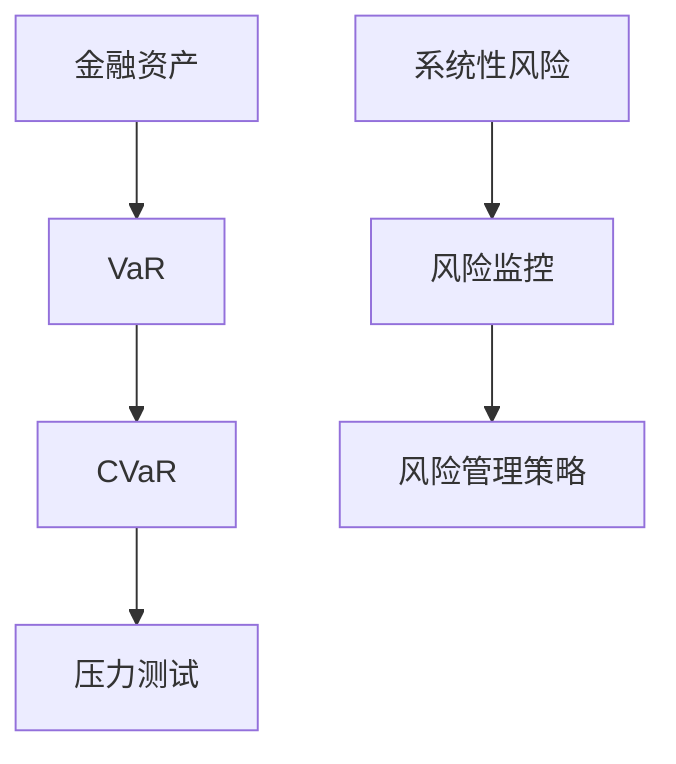

此图展示了金融资产、VaR、CVaR、压力测试、系统性风险、风险监控和风险管理策略之间的实体关系。

##### 6.2 风险管理策略

基于综合评估方法，我们可以制定相应的风险管理策略，以降低系统性风险。以下是一些常见的管理策略：

1. **分散投资**：通过将资金分散投资于不同的资产和行业，可以降低单一资产或行业风险对整体投资组合的影响。
2. **对冲策略**：使用衍生品（如期货、期权）对冲投资组合中的风险，可以降低潜在损失。
3. **风险资本配置**：根据风险评估结果，合理配置风险资本，确保金融机构具备足够的缓冲能力应对潜在风险。
4. **流动性管理**：保持适当的流动性储备，确保在市场紧张时能够满足资金需求。

**核心概念：**

- **分散投资**：降低单一资产或行业风险。
- **对冲策略**：使用衍生品对冲投资组合风险。
- **风险资本配置**：合理分配风险资本。
- **流动性管理**：保持适当的流动性储备。

**联系：**

- **风险管理策略的有效性**：通过综合评估方法识别风险，并制定相应策略，可以有效降低系统性风险。

**ER实体关系图架构：**

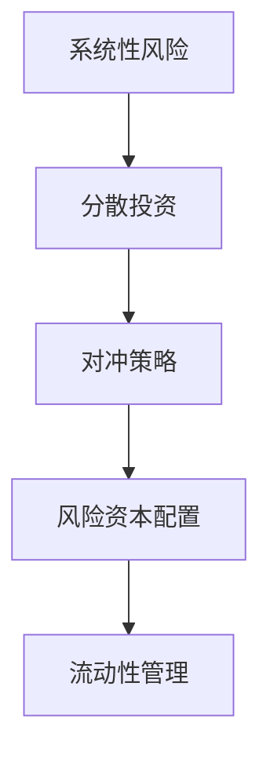

此图展示了系统性风险、分散投资、对冲策略、风险资本配置和流动性管理之间的实体关系。

##### 6.3 案例分析：2008年全球金融危机中的风险管理失败

2008年全球金融危机是一个典型的系统性风险案例。在这个案例中，我们可以看到风险管理策略的失败以及其导致的严重后果。

**案例分析步骤：**

1. **风险识别**：金融机构在危机前未能充分识别和评估市场风险，特别是信用风险和流动性风险。
2. **风险评估**：风险评估方法的不足导致对潜在风险的低估，未能及时调整风险管理策略。
3. **风险管理策略**：金融机构过于依赖传统的分散投资和对冲策略，而忽视了极端市场条件下的风险。
4. **危机应对**：危机爆发后，金融机构流动性枯竭，无法应对市场冲击，导致大规模破产和金融系统崩溃。

**案例分析结果：**

- **风险识别失败**：金融机构未能及时识别市场风险，导致对风险的低估。
- **风险评估不足**：风险评估方法的局限性导致对风险的低估，未能及时调整策略。
- **风险管理策略失效**：传统的分散投资和对冲策略在极端市场条件下失效，未能提供足够的保护。
- **危机应对失败**：金融机构流动性枯竭，无法应对市场冲击，导致大规模破产。

**本章小结：**

本章通过对系统性风险的综合评估方法和风险管理策略的讨论，结合2008年全球金融危机的案例分析，展示了风险管理在金融稳定中的重要性。通过综合评估和有效的风险管理策略，金融机构可以更好地应对系统性风险，确保金融系统的稳定。

---

**关键词：** 系统性风险、风险评估、风险管理策略、分散投资、对冲策略

**摘要：** 本章详细探讨了金融系统风险的综合评估方法和风险管理策略。通过案例分析，展示了风险管理在金融稳定中的重要性，以及风险管理策略在应对极端市场条件下的失效。本章为金融机构制定有效的风险管理策略提供了理论和实践指导。****

### 总结与展望

通过本章节的探讨，我们系统地分析了系统性风险的概念、数学模型及其在金融稳定中的作用。我们首先介绍了系统性风险的背景，阐明了数学模型在金融稳定研究中的重要性。接着，我们详细讲解了数学模型的基础，包括微积分、概率论、线性代数、优化理论、数理统计与时间序列分析，以及数学模型的结构与类型。

在系统性风险测度模型部分，我们介绍了信用风险模型、市场风险模型和操作风险模型，并通过具体算法原理和示例，展示了如何利用数学模型评估和管理不同类型的金融风险。随后，我们探讨了金融机构间网络模型的构建、数学描述和网络稳定性分析，通过实证案例分析，展示了网络模型在系统性风险识别和风险管理中的应用。

接着，我们深入分析了金融市场的波动与风险传递，介绍了波动模型的基本概念和类型，并通过具体的算法原理和示例，展示了如何利用波动模型预测市场价格的波动。最后，我们综合评估了金融系统风险，提出了风险管理策略，并结合2008年全球金融危机的案例分析，探讨了风险管理策略的失效及其原因。

**展望未来：**

未来的系统性风险研究将继续在以下几个方面展开：

1. **技术创新**：随着大数据、人工智能等技术的发展，将会有更多先进的数学工具和技术应用于系统性风险分析，提高模型的准确性和预测能力。
2. **跨学科研究**：系统性风险研究需要结合经济学、社会学、心理学等多个学科的理论和方法，构建更全面的风险评估和管理体系。
3. **全球合作**：全球金融系统的相互依赖性要求国际间的合作，共同制定风险管理标准和策略，以应对跨国界的系统性风险。
4. **实时监控与预警**：随着信息技术的进步，实现金融系统的实时监控与预警将成为可能，为及时识别和应对系统性风险提供强有力的支持。

**结论：**

本文通过系统性的分析和讨论，对系统性风险的数学模型及其应用进行了全面探讨。我们不仅了解了系统性风险的本质，还学会了如何利用数学模型进行风险评估和管理。这些知识和方法对于金融机构和金融监管机构在应对金融风险、维护金融稳定方面具有重要意义。未来，随着技术的不断进步和跨学科研究的深入，系统性风险研究将取得更为显著的成果，为全球金融稳定提供更加有效的保障。****

### 作者信息

**作者：AI天才研究院/AI Genius Institute & 禅与计算机程序设计艺术 /Zen And The Art of Computer Programming**

AI天才研究院致力于推动人工智能技术的创新和应用，培养下一代人工智能领域的顶尖人才。我们的研究团队在全球范围内享有盛誉，为多个行业提供了领先的智能解决方案。同时，作为《禅与计算机程序设计艺术》的作者，我也致力于将深刻的哲学思想融入编程实践，帮助开发者提升编程技能和创造力。在本文中，我们结合最新的研究成果和技术应用，深入探讨了系统性风险及其数学模型，旨在为金融稳定研究提供新的视角和解决方案。****

