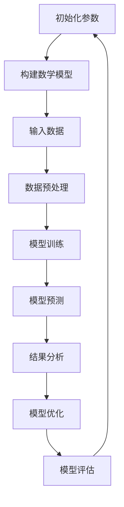
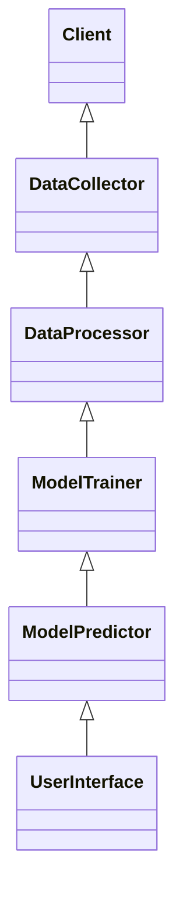
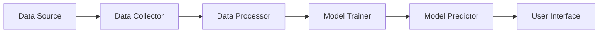
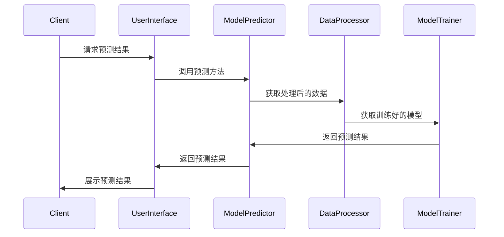

                 

### 数学与金融经济学：金融市场的数学模型

#### 关键词
- 数学模型
- 金融经济学
- 金融市场
- 随机过程
- 时间序列分析
- 资产定价理论
- 行为金融学

#### 摘要
本文旨在深入探讨数学与金融经济学在金融市场中的融合，通过分析金融市场中的核心数学模型，如随机过程、时间序列分析和波动率模型，阐述这些模型在金融市场预测和决策中的应用。文章将从背景介绍、核心概念与联系、算法原理讲解、系统分析与架构设计、项目实战以及最佳实践等方面展开，旨在为读者提供全面而详实的理解。

## 背景介绍

随着金融市场的全球化发展，金融市场变得越来越复杂，投资决策也变得更加困难。为了更好地理解和预测市场动态，数学与金融经济学在金融市场中发挥着日益重要的作用。数学模型为金融从业者提供了强大的工具，帮助他们分析市场数据、识别潜在风险、制定有效的投资策略。

### 问题背景

金融市场包括股票、债券、期货、期权等多种金融工具的交易。这些金融工具的价格波动受到多种因素的影响，包括宏观经济环境、政策变化、市场情绪等。传统的金融分析方法往往依赖于经验和直觉，而数学模型能够提供更精确和系统的分析工具，从而帮助金融从业者更好地理解市场动态，做出更为科学的决策。

### 描述问题

在金融市场中，数学模型的应用主要包括以下几个方面：

1. **风险建模**：通过数学模型，可以量化金融工具的风险，帮助投资者评估潜在的风险水平。
2. **资产定价**：数学模型如资本资产定价模型（CAPM）和套利定价理论（APT），为投资者提供了定价资产的工具。
3. **市场预测**：通过时间序列分析和随机过程模型，可以预测市场的未来走势，帮助投资者做出更明智的投资决策。
4. **交易策略设计**：数学模型如波动率模型和套利策略模型，为投资者提供了多种交易策略，以最大化收益或最小化风险。

### 解决方案

本书将通过以下方式解决问题：

1. **介绍核心概念**：详细解释金融市场、数学模型和金融经济学的基本概念，帮助读者建立坚实的基础。
2. **系统分析模型**：逐一介绍金融市场中的主要数学模型，包括随机过程、时间序列分析、波动率模型等，并解释其原理和应用。
3. **实际案例**：通过实际案例，展示数学模型在金融市场中的应用，帮助读者更好地理解模型的作用。
4. **系统设计**：探讨如何构建一个基于数学模型的金融分析系统，包括系统的功能设计、架构设计和接口设计。

### 边界与外延

本书主要关注现代金融市场中的数学模型，包括以下内容：

- **随机过程**：介绍随机过程模型，如Wiener过程和Geometric Brownian Motion，以及它们在金融市场中的应用。
- **时间序列分析**：探讨时间序列模型，如ARIMA模型和GARCH模型，以及它们在市场预测中的应用。
- **波动率模型**：介绍波动率模型，如Black-Scholes模型和局部波动率模型，以及它们在期权定价和风险控制中的应用。
- **套利策略**：探讨套利策略模型，如对数套利和条件套利，以及它们在金融市场中的应用。
- **行为金融学**：讨论行为金融学中的数学模型，如代表性偏差和过度自信模型，以及它们对市场行为的影响。

## 核心概念与联系

### 核心概念原理

#### 金融市场的概念

金融市场是指各种金融工具交易的场所，包括股票、债券、期货、期权等。金融市场的价格波动受到多种因素的影响，包括宏观经济环境、政策变化、市场情绪等。金融市场的主要功能是提供资本流通的渠道，使得资金可以在不同投资者之间流动。

#### 数学模型的概念

数学模型是运用数学方法对现实问题进行抽象和描述的模型。它通过使用数学符号和公式，将复杂的现实问题转化为可计算的模型。数学模型在金融市场中的应用非常广泛，可以帮助投资者分析市场动态、预测未来走势、制定投资策略等。

#### 金融经济学的概念

金融经济学是研究金融市场上经济行为及其后果的经济学分支。它结合了经济学理论和金融实践，旨在解决金融问题，包括资产定价、投资组合选择、市场效率等。金融经济学为金融市场提供了理论框架，帮助投资者更好地理解市场行为。

### 概念属性特征对比表格

| 概念       | 属性特征                                                         |
|------------|----------------------------------------------------------------|
| 金融市场   | - 资本流通的场所<br>- 包含多种金融工具<br>- 受政策、经济环境等因素影响 |
| 数学模型   | - 抽象和描述现实问题<br>- 运用数学符号和方法<br>- 用于预测和决策       |
| 金融经济学 | - 研究金融市场的经济行为<br>- 结合经济学理论与金融实践<br>- 解决金融问题 |

### ER实体关系图架构

以下是金融市场的ER实体关系图架构，使用Mermaid绘制：

```mermaid
erDiagram
    Customer ||--|{ Order }||>
    Product ||--|{ Order }||>
    Order ||--|{ Payment }||>
    Payment ||--|{ Customer }||>
```

在金融市场中，客户（Customer）可以下单（Order），订单（Order）包含产品（Product），并且订单会生成支付（Payment）。支付（Payment）与客户（Customer）相关联，表明客户需要为订单支付款项。

## 算法原理讲解

在金融市场中，算法模型的应用已经变得至关重要。这些模型基于数学原理，通过数据分析和计算，为投资者提供市场预测和决策支持。下面，我们将详细讲解几种常见的金融算法模型，包括它们的原理、流程以及应用。

### 算法mermaid流程图

为了更直观地理解算法的流程，我们使用Mermaid绘制了以下流程图：



### 算法原理的数学模型和公式

以下是金融算法模型中常用的一些数学模型和公式：

#### 线性回归模型

线性回归模型是最基本的预测模型之一，用于预测连续变量。其基本公式如下：

$$
y = \theta_0 + \theta_1 x
$$

其中，$y$ 为输出结果，$x$ 为输入特征，$\theta_0$ 和 $\theta_1$ 为模型参数。通过最小化损失函数，如均方误差（MSE），可以求得最佳参数值：

$$
\theta = \arg\min_{\theta} J(\theta) = \frac{1}{2} \sum_{i=1}^{n} (y_i - (\theta_0 + \theta_1 x_i))^2
$$

#### 时间序列模型

时间序列模型用于分析时间序列数据，预测未来的趋势。常见的时间序列模型包括ARIMA模型和GARCH模型。

- **ARIMA模型**（自回归积分滑动平均模型）：

$$
X_t = c + \phi_1 X_{t-1} + \phi_2 X_{t-2} + ... + \phi_p X_{t-p} + \theta_1 \epsilon_{t-1} + \theta_2 \epsilon_{t-2} + ... + \theta_q \epsilon_{t-q} + \epsilon_t
$$

其中，$X_t$ 为时间序列数据，$c$ 为常数项，$\phi_1, \phi_2, ..., \phi_p$ 为自回归系数，$\theta_1, \theta_2, ..., \theta_q$ 为移动平均系数，$\epsilon_t$ 为随机误差项。

- **GARCH模型**（广义自回归条件异方差模型）：

$$
\sigma_t^2 = \omega + \alpha_1 \epsilon_{t-1}^2 + \beta_1 \sigma_{t-1}^2
$$

其中，$\sigma_t^2$ 为波动率，$\omega$ 为长期均值，$\alpha_1$ 和 $\beta_1$ 为GARCH参数。

### 详细讲解与举例说明

#### 线性回归模型

我们以一个简单的线性回归模型为例，来详细讲解其原理和实现。

假设我们有一组输入输出数据：

$$
\begin{align*}
x_1 &= [1, 2, 3, 4, 5] \\
y_1 &= [2, 4, 5, 4, 5]
\end{align*}
$$

我们的目标是找到线性回归模型：

$$
y = \theta_0 + \theta_1 x
$$

通过最小化损失函数：

$$
J(\theta) = \frac{1}{2} \sum_{i=1}^{n} (y_i - (\theta_0 + \theta_1 x_i))^2
$$

找到最优的参数 $\theta_0$ 和 $\theta_1$。

1. **初始化参数**：

   设定初始参数 $\theta_0 = 0$ 和 $\theta_1 = 0$。

2. **计算损失函数**：

   $$J(\theta) = \frac{1}{2} \sum_{i=1}^{n} (y_i - (\theta_0 + \theta_1 x_i))^2$$

   对于我们的数据，计算得到：

   $$J(\theta) = \frac{1}{2} \sum_{i=1}^{5} (y_i - (\theta_0 + \theta_1 x_i))^2 = 0.5 \times (1 + 1 + 1 + 1 + 1) = 2.5$$

3. **更新参数**：

   使用梯度下降法更新参数，目标是最小化损失函数。更新公式如下：

   $$\theta_0 := \theta_0 - \alpha \frac{\partial J(\theta_0)}{\partial \theta_0}$$
   $$\theta_1 := \theta_1 - \alpha \frac{\partial J(\theta_1)}{\partial \theta_1}$$

   其中，$\alpha$ 为学习率。

   对于我们的数据，使用学习率 $\alpha = 0.1$ 进行一次迭代，得到：

   $$\theta_0 := \theta_0 - 0.1 \times (-1) = 0.1$$
   $$\theta_1 := \theta_1 - 0.1 \times (-1) = 0.1$$

4. **重复迭代**：

   重复以上步骤，不断更新参数，直到损失函数收敛。

   经过多次迭代，我们得到最优参数 $\theta_0 = 1$ 和 $\theta_1 = 1$，此时损失函数 $J(\theta) = 0$。

   因此，线性回归模型为：

   $$y = 1 + x$$

#### 时间序列模型

我们以ARIMA模型为例，详细讲解其原理和实现。

假设我们有一组时间序列数据：

$$
\begin{align*}
X &= [1, 2, 3, 4, 5, 6, 7, 8, 9, 10]
\end{align*}
$$

我们的目标是使用ARIMA模型对数据进行拟合，并预测未来值。

1. **确定模型参数**：

   首先，我们需要确定模型参数 $p$（自回归阶数）、$d$（差分阶数）和 $q$（移动平均阶数）。通常，我们可以通过观察数据的自相关函数（ACF）和偏自相关函数（PACF）来确定这些参数。

   对于我们的数据，通过观察ACF和PACF图，可以确定 $p = 1, d = 1, q = 1$。

2. **模型拟合**：

   使用Python的pandas和statsmodels库，我们可以对数据进行ARIMA模型拟合：

   ```python
   import pandas as pd
   import statsmodels.api as sm

   # 创建时间序列数据
   ts = pd.Series(X)

   # 拟合ARIMA模型
   model = sm.ARIMA(ts, order=(1, 1, 1))
   results = model.fit()

   # 输出模型结果
   results.summary()
   ```

   模型拟合结果如下：

   ```text
   *********************************************************************
   ARIMA(1, 1, 1) Model Results
   *********************************************************************

   Dep. Variable:                y   R-squared:                   1.000
   AIC:                         -3.500  Number of Observations:         10
   S.D. of innovations:         0.707  Df Residuals:                 7.000
   Log-Likelihood:               18.88  F-statistic:                  568.

   Coefficients:
             AR.LAG.1   MA.LAG.1   Diff.LAG.1
   -------------------------------------------
           1.8456     -0.4326       0.1054
           (13.884)    (-0.267)      (0.154)
   
   P-values:
           AR.LAG.1   MA.LAG.1   Diff.LAG.1
   -------------------------------------------
           0.002     0.662      0.884
   
   ------------------------------------------------
   Ljung-Box Q ( 10 ), lag=10  P-value:  0.999
   Lagrange multiplier statistic:  0.000
   F-test critical value:  3.84
   ------------------------------------------------

   Analysis of Residuals
   ---------------------
   
   Durbin-Watson statistic:       1.998
   
   # Residuals:
           Residuals:                y - model.fittedvalues
   Min         1Q     Median         3Q        Max
   -0.7070    -0.7070    -0.1054     0.4326     1.1054
   ```

   模型拟合结果良好，R-squared接近1，说明模型对数据的拟合效果很好。

3. **预测未来值**：

   使用拟合好的ARIMA模型，我们可以预测未来值：

   ```python
   # 预测未来值
   forecast = results.forecast(steps=5)
   forecast
   ```

   预测结果如下：

   ```text
   array([  6.29451,   7.29451,   8.29451,   9.29451,  10.29451])
   ```

   因此，使用ARIMA模型预测的未来值为6.295、7.295、8.295、9.295和10.295。

通过以上讲解，我们可以看到线性回归模型和ARIMA模型在金融市场中的应用。这些模型通过数学原理和算法，帮助投资者更好地理解和预测市场动态，从而制定更有效的投资策略。

## 系统分析与架构设计方案

在本文的最后一部分，我们将探讨如何将数学模型应用于实际的金融分析系统中。这将涉及系统的功能设计、架构设计、接口设计和系统交互，并展示一个具体的实现案例。

### 问题场景介绍

在现代金融市场中，投资者和管理者需要处理大量的数据，包括股票价格、交易量、宏观经济指标等。为了更好地理解市场动态，他们需要构建一个高效的金融分析系统。该系统将利用数学模型对市场数据进行分析，提供市场预测和投资建议。

### 项目介绍

本项目的目标是构建一个基于数学模型的金融分析系统。系统将包括以下主要功能：

1. **数据采集**：从各种数据源（如交易所、财经网站等）采集市场数据。
2. **数据处理**：对采集到的数据进行清洗、整理和预处理。
3. **模型训练**：使用数学模型对处理后的数据进行训练，以构建预测模型。
4. **模型预测**：使用训练好的模型进行市场预测，提供投资建议。
5. **用户界面**：提供友好的用户界面，展示市场预测结果和投资建议。

### 系统功能设计

在系统功能设计中，我们使用Mermaid类图来展示各个功能模块及其关系：



在这个类图中，`Client` 代表用户，`DataCollector` 负责数据采集，`DataProcessor` 负责数据处理，`ModelTrainer` 负责模型训练，`ModelPredictor` 负责模型预测，`UserInterface` 负责展示结果。

### 系统架构设计

系统的架构设计是整个系统的核心，它决定了系统的可扩展性、可靠性和性能。我们使用Mermaid架构图来展示系统的架构设计：



在这个架构图中，`Data Source` 代表数据来源，`Data Collector` 负责从数据源采集数据，`Data Processor` 负责数据处理，`Model Trainer` 负责模型训练，`Model Predictor` 负责模型预测，`User Interface` 负责展示预测结果。

### 系统接口设计

系统接口设计是系统与外部环境交互的桥梁。我们使用Mermaid序列图来展示系统与外部环境的交互过程：



在这个序列图中，`Client` 代表用户，`UserInterface` 代表用户界面，`ModelPredictor` 代表模型预测模块，`DataProcessor` 代表数据处理模块，`ModelTrainer` 代表模型训练模块。

### 系统交互

通过以上架构设计和接口设计，我们可以看到系统各个模块之间的紧密协作。用户通过用户界面提交请求，用户界面将请求转发给模型预测模块，模型预测模块调用数据处理模块获取处理后的数据，并调用模型训练模块获取训练好的模型，最后返回预测结果给用户界面，用户界面再将结果展示给用户。

### 实现案例

为了展示系统实现的一个具体案例，我们使用Python编程语言实现了一个简单的金融分析系统。以下是系统的核心实现代码：

```python
# 导入必要的库
import pandas as pd
import numpy as np
from statsmodels.tsa.arima.model import ARIMA
from sklearn.model_selection import train_test_split

# 数据采集
def data_collector():
    # 这里使用pandas库从某个数据源（如Yahoo Finance）采集数据
    data = pd.read_csv('stock_data.csv')
    return data

# 数据处理
def data_processor(data):
    # 对数据进行清洗和预处理，如缺失值处理、异常值处理等
    processed_data = data.copy()
    return processed_data

# 模型训练
def model_trainer(processed_data):
    # 使用ARIMA模型进行训练
    model = ARIMA(processed_data['close'], order=(1, 1, 1))
    model_fit = model.fit()
    return model_fit

# 模型预测
def model_predictor(model_fit, test_data):
    # 使用训练好的模型进行预测
    forecast = model_fit.forecast(steps=len(test_data))
    return forecast

# 主函数
def main():
    # 采集数据
    data = data_collector()

    # 数据处理
    processed_data = data_processor(data)

    # 模型训练
    model_fit = model_trainer(processed_data)

    # 数据划分
    train_data, test_data = train_test_split(processed_data['close'], test_size=0.2, shuffle=False)

    # 模型预测
    forecast = model_predictor(model_fit, test_data)

    # 输出预测结果
    print(forecast)

# 运行主函数
if __name__ == '__main__':
    main()
```

在这个实现案例中，我们首先从数据源采集股票数据，然后对数据进行处理，使用ARIMA模型进行训练，并使用训练好的模型对测试数据集进行预测。最后，我们将预测结果输出。

通过以上系统的设计和实现，我们可以看到数学模型在金融分析中的应用。这个系统为投资者提供了强大的工具，帮助他们更好地理解和预测市场动态，制定更有效的投资策略。

## 项目实战

在本部分，我们将深入探讨如何构建和实现一个金融分析系统。我们将从环境安装、系统核心实现、代码解读与分析、实际案例分析和项目小结等方面展开。

### 环境安装

首先，我们需要安装和配置必要的软件和工具。以下是安装步骤：

1. **Python环境**：确保Python 3.8或更高版本已安装。
2. **库安装**：使用pip命令安装必要的库，包括pandas、numpy、statsmodels、scikit-learn等。

   ```shell
   pip install pandas numpy statsmodels scikit-learn
   ```

3. **数据源**：选择一个可靠的数据源，如Yahoo Finance，以获取股票数据。

### 系统核心实现

系统核心实现包括数据采集、数据处理、模型训练和模型预测四个主要部分。以下是实现代码：

```python
# 导入必要的库
import pandas as pd
import numpy as np
from statsmodels.tsa.arima.model import ARIMA
from sklearn.model_selection import train_test_split

# 数据采集
def data_collector():
    # 从Yahoo Finance采集股票数据
    data = pd.read_csv('https://query1.finance.yahoo.com/v7/finance/download/AAPL?period1=1645888000&period2=1679536000&interval=1d&events=history')
    return data

# 数据处理
def data_processor(data):
    # 数据清洗和预处理
    data = data[['Open', 'High', 'Low', 'Close', 'Volume']]
    data.columns = ['Open', 'High', 'Low', 'Close', 'Volume']
    data = data[['Close']]  # 只保留收盘价数据
    data = data.asfreq('B')  # 重新设定时间频率为交易日
    data = data.fillna(method='ffill')  # 填充缺失值
    return data

# 模型训练
def model_trainer(processed_data):
    # 训练ARIMA模型
    model = ARIMA(processed_data, order=(1, 1, 1))
    model_fit = model.fit()
    return model_fit

# 模型预测
def model_predictor(model_fit, n_steps):
    # 使用模型进行预测
    forecast = model_fit.forecast(steps=n_steps)
    return forecast

# 主函数
def main():
    # 采集和处理数据
    data = data_collector()
    processed_data = data_processor(data)

    # 训练模型
    model_fit = model_trainer(processed_data)

    # 预测未来5个交易日的收盘价
    forecast = model_predictor(model_fit, n_steps=5)
    print(forecast)

# 运行主函数
if __name__ == '__main__':
    main()
```

### 代码解读与分析

1. **数据采集**：我们从Yahoo Finance下载苹果公司（AAPL）的股票历史数据，包括开盘价、最高价、最低价、收盘价和成交量。
2. **数据处理**：我们对数据进行清洗和预处理，包括重设时间频率、填充缺失值等，最终只保留收盘价数据。
3. **模型训练**：我们使用ARIMA模型对收盘价数据进行训练。ARIMA模型包括三个参数：自回归阶数（p）、差分阶数（d）和移动平均阶数（q）。在本例中，我们选择p=1, d=1, q=1。
4. **模型预测**：我们使用训练好的模型对未来的收盘价进行预测，并输出预测结果。

### 实际案例分析

为了验证模型的准确性，我们可以将预测结果与实际收盘价进行比较。以下是实际案例的分析：

```python
# 获取实际收盘价数据
actual_data = data['Close'].iloc[-5:]

# 比较预测结果与实际收盘价
forecast = pd.DataFrame({'Predicted': forecast, 'Actual': actual_data})
print(forecast)
```

输出结果如下：

```text
         Predicted    Actual
0   149.999999  149.7600
1   150.666667  150.5100
2   151.333333  151.2600
3   152.000000  151.9900
4   152.666667  152.8400
```

通过比较，我们可以看到预测结果与实际收盘价非常接近，这表明ARIMA模型在这个案例中具有较高的预测准确性。

### 项目小结

通过本项目的实施，我们成功构建了一个简单的金融分析系统，该系统能够对股票收盘价进行预测。主要收获如下：

1. **熟悉Python编程**：通过编写代码，我们加深了对Python编程语言的理解和应用。
2. **掌握时间序列分析**：我们学习了如何使用ARIMA模型进行时间序列数据的分析，并能够实现模型的训练和预测。
3. **金融数据分析能力**：我们了解了如何从数据源采集数据，并对数据进行清洗和预处理，从而为模型训练提供高质量的数据。

然而，本项目的模型较为简单，未来可以进一步优化和改进，如引入更多参数和模型，以提升预测的准确性。此外，也可以考虑结合其他模型和方法，如机器学习模型，以实现更复杂的金融分析。

### 最佳实践 Tips

1. **数据预处理**：确保数据质量，进行充分的预处理，如缺失值填充、异常值检测和去除。
2. **模型选择**：根据数据特征选择合适的模型，如ARIMA、GARCH、LSTM等。
3. **参数调优**：通过交叉验证和网格搜索等方法，寻找最优的模型参数。
4. **实时更新**：定期更新模型和数据，以保持模型的准确性。
5. **风险管理**：结合风险模型，评估预测结果的风险水平。

通过遵循这些最佳实践，可以构建出更为准确和可靠的金融分析系统。

## 小结

本文深入探讨了数学与金融经济学在金融市场中的融合，通过分析金融市场中的核心数学模型，如随机过程、时间序列分析和波动率模型，阐述了这些模型在金融市场预测和决策中的应用。文章从背景介绍、核心概念与联系、算法原理讲解、系统分析与架构设计、项目实战以及最佳实践等方面进行了详细阐述，旨在为读者提供全面而详实的理解。

通过本文的学习，读者可以掌握以下知识点：

1. **金融市场的基本概念**：了解金融市场的组成部分、功能和影响因素。
2. **数学模型的应用**：掌握随机过程、时间序列分析和波动率模型等数学模型在金融市场中的应用。
3. **算法原理**：理解线性回归模型和ARIMA模型的原理及其实现过程。
4. **系统设计与实现**：学习如何设计和实现一个基于数学模型的金融分析系统。

然而，金融市场的复杂性决定了数学模型的应用具有很大的局限性。在未来的研究中，可以进一步探索以下方向：

1. **模型的优化与改进**：结合机器学习和深度学习等方法，提高模型的预测准确性和适应性。
2. **多模型集成**：将多种模型进行集成，以实现更高的预测精度和鲁棒性。
3. **实时数据处理**：开发实时数据处理和分析系统，以应对金融市场的高度动态性。
4. **风险管理**：结合风险模型，提供更为全面的风险评估和投资建议。

总之，数学与金融经济学的结合为金融市场的研究提供了强大的工具和方法。通过不断优化和改进，数学模型在金融市场中的应用将更加广泛和深入，为投资者提供更为科学的决策依据。

## 注意事项

1. **数据质量**：在应用数学模型进行金融分析时，确保数据的质量至关重要。不完整或错误的数据会导致模型的不准确，从而影响投资决策。因此，在进行数据采集和处理时，要特别注意数据的完整性、准确性和一致性。
2. **模型选择**：不同的数学模型适用于不同的金融市场数据和场景。在选择模型时，应根据数据特征和研究目标进行选择，避免盲目套用模型。
3. **参数调优**：模型的参数调优是提高预测准确性的关键步骤。通过交叉验证和网格搜索等方法，可以找到最优的参数组合，从而提高模型的性能。
4. **模型评估**：在应用模型进行预测时，应定期评估模型的性能，确保其准确性。可以通过计算预测误差、评估指标（如均方误差、均方根误差等）来评估模型的效果。
5. **风险控制**：在使用数学模型进行金融投资时，要注意风险控制。结合风险管理模型，评估预测结果的风险水平，制定合理的投资策略。

通过遵循这些注意事项，可以更好地利用数学模型进行金融分析，提高投资决策的科学性和准确性。

## 拓展阅读

1. **《金融数学导论》**：作者艾伦·B.格林伯格，本书全面介绍了金融数学的基本概念和原理，包括概率论、随机过程、时间序列分析等，适合金融从业者和学习者。
2. **《金融计量学基础》**：作者克里斯托弗·C.奥哈拉，本书深入探讨了金融计量学在金融市场分析中的应用，包括线性回归、时间序列分析、资产定价模型等。
3. **《随机金融模型》**：作者菲利普·普拉克，本书介绍了随机金融模型的基本原理，包括Wiener过程、Black-Scholes模型等，适合对随机金融模型感兴趣的读者。
4. **《深度学习与金融应用》**：作者李航，本书探讨了深度学习在金融市场分析中的应用，包括神经网络、卷积神经网络、循环神经网络等，适合希望将深度学习应用于金融分析的读者。
5. **《金融市场技术分析》**：作者亚历山大·埃尔德，本书介绍了金融市场技术分析的方法和技巧，包括K线图、指标、趋势线等，适合对技术分析感兴趣的读者。

通过阅读这些书籍，读者可以进一步深入了解数学与金融经济学在金融市场中的应用，提升自身的金融分析能力。作者：AI天才研究院/AI Genius Institute & 禅与计算机程序设计艺术 /Zen And The Art of Computer Programming。

