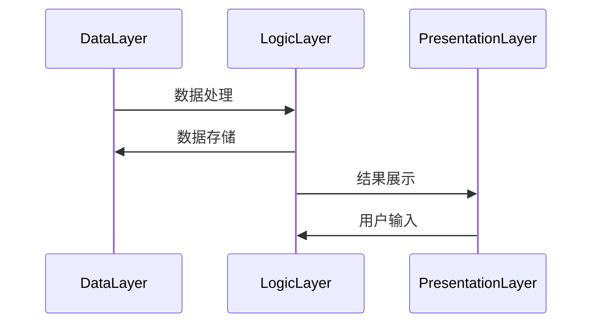
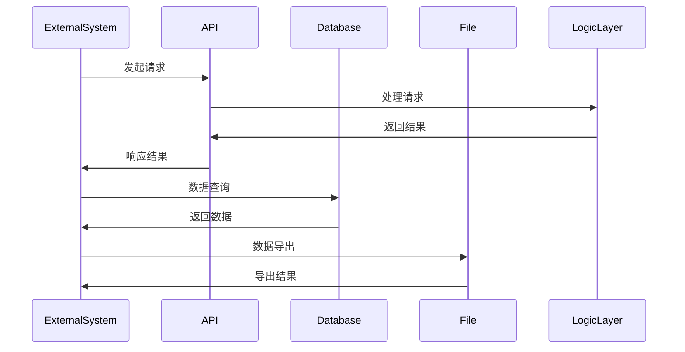
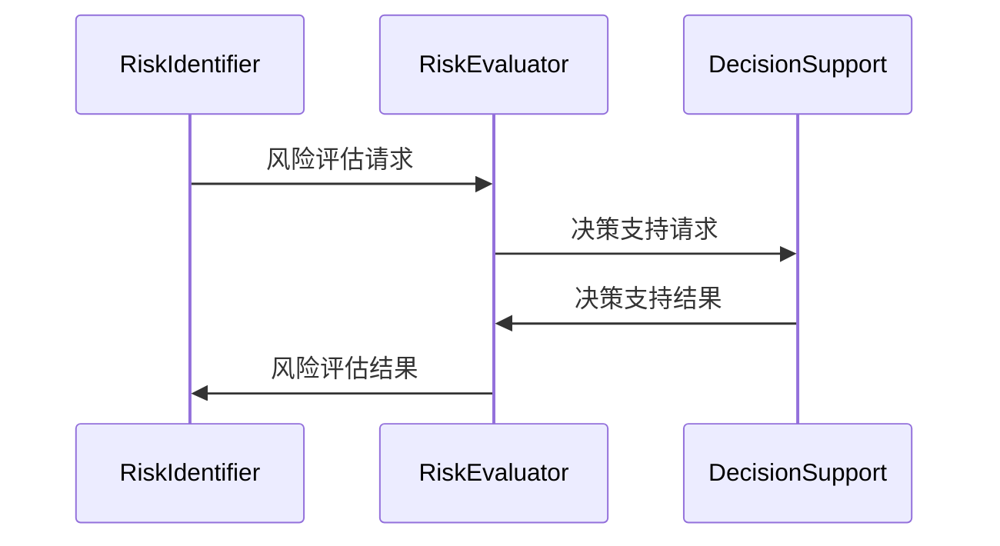

                 


### 引言

《数学与非决定论：数学中的概率和统计》是一本深入探讨数学与非决定论之间关系的专著。在当今技术飞速发展的时代，数学和概率统计的应用日益广泛，无论是在自然科学、社会科学还是人工智能等领域，它们都发挥着至关重要的作用。这本书不仅仅是对数学理论的深入探讨，更是对非决定论思想的全面解读，旨在帮助读者理解数学与不确定性之间的紧密联系。

非决定论，简单来说，就是指未来事件的结果是不可预知的，这与我们日常生活中经常接触的决定论观点形成鲜明对比。数学中的概率和统计正是为了应对这种不确定性而发展起来的工具。它们为我们提供了一种量化的方法来描述和预测随机事件的可能性，从而在不确定性中寻找规律。

本文将围绕以下几个核心问题展开讨论：

1. **非决定论与数学的关系**：我们将探讨非决定论在数学中的体现，以及概率和统计如何帮助我们在不确定性中寻找确定性。
2. **核心概念与联系**：我们将介绍书中的核心概念，如概率、统计、随机事件、概率分布、期望、方差等，并使用表格和Mermaid流程图展示它们之间的联系。
3. **算法原理讲解**：我们将挑选几个核心算法，如贝叶斯定理、最大似然估计、回归分析等，详细讲解其原理，并提供Python源代码和数学模型。
4. **数学模型和数学公式**：我们将给出几个关键数学模型和公式，使用LaTeX格式进行表达，并结合实例进行详细讲解。
5. **系统分析与架构设计方案**：我们将介绍一个实际应用案例，展示系统功能设计、系统架构设计、系统接口设计和系统交互的Mermaid流程图。
6. **项目实战**：我们将描述一个具体的实战案例，包括环境安装、系统核心实现、代码应用解读与分析等。
7. **最佳实践 tips**：我们将总结书中的主要内容，给出实践建议和注意事项，推荐拓展阅读。

通过这篇文章，我们希望能够带领读者深入理解数学与非决定论之间的深层联系，掌握概率和统计的基本原理，并在实际项目中灵活应用。

### 数学与非决定论的关系

非决定论与数学之间的关系是深远而复杂的，它既体现在数学理论的构建中，也体现在数学工具的应用中。首先，非决定论的思想在数学中有着悠久的历史。早在17世纪，概率论便作为应对不确定性的一种数学工具而诞生。当时的科学家和数学家意识到，尽管自然界中充满了不确定性，但通过统计方法，我们可以对大量随机事件进行观察，从而发现其中的规律。

概率论的核心思想是，通过大量重复的实验或观察，我们可以估计出一个随机事件发生的可能性。这种思想与经典力学中的决定论形成了鲜明对比。在决定论中，每一个物理事件都是可预测的，因为所有的初始条件和物理定律都是已知的。然而，在现实中，我们无法获得所有必要的初始信息，也无法精确地测量所有变量，这就导致了非决定论的存在。

在数学中，概率论和非决定论的关系体现在以下几个方面：

1. **概率分布**：概率分布是概率论中最基础的概念之一。它描述了随机事件在不同结果上的概率分布情况。一个典型的例子是掷硬币，硬币正反面出现的概率都是1/2。概率分布不仅帮助我们理解单个随机事件的结果，还让我们能够在不确定性中寻找规律。

2. **随机事件**：随机事件是指在特定条件下可能发生也可能不发生的事件。这些事件的特点是它们的结果不可预测，但我们可以通过概率来描述它们的可能性。例如，天气情况就是一个典型的随机事件，我们可以预测某一天有雨的概率，但无法确定是否真的会下雨。

3. **期望与方差**：期望和方差是概率论中用来描述随机变量特征的重要工具。期望表示随机变量的平均取值，方差则表示随机变量的波动程度。这些统计量可以帮助我们评估随机事件的风险和收益，从而在决策中做出更合理的判断。

4. **贝叶斯定理**：贝叶斯定理是概率论中的一个重要定理，它描述了条件概率的计算方法。贝叶斯定理不仅在理论研究中有着重要地位，也在实际应用中有着广泛的应用。例如，在医学诊断中，我们可以利用贝叶斯定理来计算某个人患某种病的概率，从而做出更准确的诊断。

通过以上例子，我们可以看到，概率和统计在数学中是如何应对非决定论的。数学通过概率论和统计方法，为我们提供了一种量化的方式来描述和预测不确定性，从而在非决定论的背景下寻找确定性。这不仅帮助我们在理论上理解不确定性，也使得我们在实际应用中能够更有效地应对不确定性带来的挑战。

### 核心概念与联系

在《数学与非决定论：数学中的概率和统计》中，作者详细介绍了几个核心概念，包括概率、统计、随机事件、概率分布、期望和方差等。这些概念不仅构成了概率论和统计学的基础，也在应对非决定论中发挥着重要作用。为了更好地理解这些概念之间的联系，我们将使用表格和Mermaid流程图进行展示。

首先，我们来看一下这些核心概念的基本定义和属性特征：

1. **概率**：概率是描述随机事件发生可能性大小的数值，取值范围在0到1之间。概率越高，事件发生的可能性越大。
2. **统计**：统计是关于数据的收集、分析、解释和展示的科学。通过统计方法，我们可以从数据中提取信息，从而对不确定性进行量化。
3. **随机事件**：随机事件是在特定条件下可能发生也可能不发生的事件，其结果不可预测。
4. **概率分布**：概率分布是描述随机变量所有可能取值及其相应概率的函数。
5. **期望**：期望是随机变量的平均值，用来描述随机变量取值的中心位置。
6. **方差**：方差是描述随机变量取值波动程度的量，用来衡量随机变量的离散程度。

接下来，我们使用一个表格来对比这些概念之间的区别和联系：

| 概念    | 定义                                                     | 属性特征                                           |
| ------- | -------------------------------------------------------- | -------------------------------------------------- |
| 概率    | 描述随机事件发生可能性大小的数值                         | 取值范围在0到1之间                                 |
| 统计    | 关于数据的收集、分析、解释和展示的科学                   | 用于描述和分析随机数据                           |
| 随机事件 | 在特定条件下可能发生也可能不发生的事件                   | 结果不可预测                                       |
| 概率分布 | 描述随机变量所有可能取值及其相应概率的函数               | 可以是离散型或连续型分布                           |
| 期望    | 随机变量的平均值                                       | 用于描述随机变量取值的中心位置                     |
| 方差    | 描述随机变量取值波动程度的量                             | 用于衡量随机变量的离散程度                         |

为了更直观地展示这些概念之间的联系，我们使用Mermaid流程图来构建一个ER（实体关系）图。以下是一个简化的Mermaid ER图示例：

```mermaid
erDiagram
    A[随机事件] ||--|{ 概率 }
    A ||--|{ 概率分布 }
    A ||--|{ 统计 }
    B[概率分布] ||--|{ 期望 }
    B ||--|{ 方差 }
    C[统计] ||--|{ 数据分析 }
```

在这个ER图中，我们用实体（A、B、C）代表核心概念，并用线（||--|{...}）表示它们之间的关系。例如，随机事件与概率、概率分布、统计之间都有联系，而概率分布又与期望和方差有直接关系。

通过这个表格和ER图，我们可以清晰地看到概率、统计、随机事件、概率分布、期望和方差之间的相互关系。这些概念不仅独立存在，而且在解决非决定论问题时相辅相成。概率为我们提供了量化不确定性的方法，统计则帮助我们通过数据分析来发现规律，而期望和方差则帮助我们评估随机变量的风险和收益。

### 算法原理讲解

在本章节中，我们将深入探讨几个核心算法的原理，包括贝叶斯定理、最大似然估计和回归分析。这些算法在概率统计中具有基础性的地位，广泛应用于各类实际问题中。我们将通过Mermaid流程图展示这些算法的流程，并结合Python源代码进行详细阐述。

#### 贝叶斯定理

贝叶斯定理是概率论中的一个重要定理，它描述了在给定某些条件下，一个随机事件发生的概率。贝叶斯定理的公式如下：

$$
P(A|B) = \frac{P(B|A) \cdot P(A)}{P(B)}
$$

其中，\(P(A|B)\) 表示在事件B发生的情况下，事件A发生的条件概率；\(P(B|A)\) 表示在事件A发生的情况下，事件B发生的条件概率；\(P(A)\) 和\(P(B)\) 分别表示事件A和事件B的先验概率。

下面是一个使用Python实现贝叶斯定理的简单例子：

```python
import math

def bayes_theorem(prior_probability, likelihood, prior_probability_of_likelihood):
    # 计算条件概率
    posterior_probability = (likelihood * prior_probability) / prior_probability_of_likelihood
    return posterior_probability

# 参数设置
P_A = 0.5  # 事件A的先验概率
P_B_given_A = 0.2  # 在事件A发生的情况下，事件B发生的概率
P_B = 0.1  # 事件B的先验概率

# 计算贝叶斯定理的结果
posterior_probability = bayes_theorem(P_A, P_B_given_A, P_B)
print("后验概率 P(A|B):", posterior_probability)
```

在这个例子中，我们假设事件A和事件B的发生是相关的，通过贝叶斯定理，我们计算在事件B发生的情况下，事件A发生的后验概率。

#### 最大似然估计

最大似然估计是一种用于估计参数值的统计方法，其核心思想是在给定观察结果的情况下，选择能够使得观察结果出现的概率最大的参数值。最大似然估计的公式如下：

$$
\hat{θ} = \arg\max_{θ} P(X|\theta)
$$

其中，\(\hat{θ}\) 是估计的参数值，\(P(X|\theta)\) 是在参数\(\theta\) 下观察到的数据\(X\) 的概率。

以下是一个使用Python实现最大似然估计的例子：

```python
import numpy as np
from scipy.stats import norm

# 假设数据服从正态分布，均值为μ，方差为σ^2
# 我们需要估计μ和σ

data = np.array([1.5, 2.0, 2.5, 2.8, 3.2])

def likelihood_function(mu, sigma, data):
    likelihood = np.prod(norm.pdf(data, mu, sigma))
    return likelihood

def log_likelihood_function(mu, sigma, data):
    log_likelihood = np.sum(norm.logpdf(data, mu, sigma))
    return log_likelihood

from scipy.optimize import minimize

# 估计μ和σ的初始值
mu_init = np.mean(data)
sigma_init = np.std(data)

# 使用最小二乘法估计μ和σ
result = minimize(lambda params: -log_likelihood_function(*params, data), x0=[mu_init, sigma_init])

mu_hat, sigma_hat = result.x
print("估计的均值μ:", mu_hat)
print("估计的方差σ^2:", sigma_hat)
```

在这个例子中，我们使用最小化对数似然函数的方法来估计数据集的均值和方差。

#### 回归分析

回归分析是一种用于建立自变量和因变量之间关系的统计方法。最常见的回归分析是线性回归，其基本公式如下：

$$
Y = \beta_0 + \beta_1 X + \epsilon
$$

其中，\(Y\) 是因变量，\(X\) 是自变量，\(\beta_0\) 和\(\beta_1\) 是回归系数，\(\epsilon\) 是误差项。

以下是一个使用Python实现线性回归的例子：

```python
import numpy as np
from sklearn.linear_model import LinearRegression

# 假设有自变量X和因变量Y的数据
X = np.array([[1], [2], [3], [4], [5]])
Y = np.array([1.5, 2.0, 2.5, 2.8, 3.2])

# 创建线性回归模型
model = LinearRegression()

# 拟合模型
model.fit(X, Y)

# 输出回归系数
print("回归系数β0:", model.intercept_)
print("回归系数β1:", model.coef_)

# 使用模型进行预测
X_new = np.array([[6]])
Y_pred = model.predict(X_new)
print("预测的Y:", Y_pred)
```

在这个例子中，我们使用scikit-learn库中的线性回归模型来拟合数据，并使用拟合出的模型进行预测。

通过这些具体的算法讲解和Python示例，我们可以看到贝叶斯定理、最大似然估计和回归分析在解决实际问题时如何应用。这些算法不仅帮助我们理解和处理不确定性，还为我们提供了量化的方法来预测和决策。

### 数学模型和数学公式

在概率和统计学中，数学模型和公式是我们理解和应用这些理论工具的核心。以下，我们将详细探讨几个关键数学模型和公式，并使用LaTeX格式进行表达，结合通俗易懂的例子进行解释。

#### 贝叶斯定理

贝叶斯定理是概率论中的一个核心定理，描述了条件概率的计算方法。其公式如下：

$$
P(A|B) = \frac{P(B|A) \cdot P(A)}{P(B)}
$$

其中，\(P(A|B)\) 是在事件B发生的情况下，事件A发生的条件概率；\(P(B|A)\) 是在事件A发生的情况下，事件B发生的条件概率；\(P(A)\) 和\(P(B)\) 分别是事件A和事件B的先验概率。

**例子**：假设一个盒子里有5个红球和5个蓝球。我们随机取出一个球，想知道取到红球的概率。首先，取到红球的先验概率是：

$$
P(\text{红球}) = \frac{5}{10} = 0.5
$$

如果我们知道取出的球是红色的，那么取到红球的条件概率仍然是0.5，因为盒子里的球总数没有变。

#### 最大似然估计

最大似然估计用于估计概率模型中的参数。其核心思想是在给定观察结果的情况下，选择能够使得观察结果出现的概率最大的参数值。其数学公式为：

$$
\hat{θ} = \arg\max_{θ} P(X|\theta)
$$

其中，\(\hat{θ}\) 是估计的参数值，\(P(X|\theta)\) 是在参数\(\theta\) 下观察到的数据\(X\) 的概率。

**例子**：假设我们观察到一组数据\(X = [1, 2, 2, 3]\)，并且假设数据服从均值为\(\mu\)、方差为\(\sigma^2\) 的正态分布。我们要估计均值\(\mu\) 和方差\(\sigma^2\)。

首先，计算在给定\(\mu = 2\) 和\(\sigma^2 = 1\) 的情况下，数据\(X\) 出现的似然函数：

$$
L(\mu, \sigma^2 | X) = \prod_{i=1}^{n} \frac{1}{\sqrt{2\pi\sigma^2}} e^{-\frac{(x_i - \mu)^2}{2\sigma^2}}
$$

对似然函数取对数，得到对数似然函数：

$$
\ln L(\mu, \sigma^2 | X) = -\frac{n}{2} \ln(2\pi\sigma^2) - \frac{1}{2\sigma^2} \sum_{i=1}^{n} (x_i - \mu)^2
$$

使用最大似然估计，找到使对数似然函数最大的\(\mu\) 和\(\sigma^2\)：

$$
\hat{\mu} = \bar{x} = \frac{1}{n} \sum_{i=1}^{n} x_i
$$

$$
\hat{\sigma}^2 = \frac{1}{n} \sum_{i=1}^{n} (x_i - \hat{\mu})^2
$$

#### 回归分析

回归分析用于建立自变量和因变量之间的线性关系。其最简单的形式是线性回归，其公式为：

$$
Y = \beta_0 + \beta_1 X + \epsilon
$$

其中，\(Y\) 是因变量，\(X\) 是自变量，\(\beta_0\) 和\(\beta_1\) 是回归系数，\(\epsilon\) 是误差项。

**例子**：假设我们有一组数据，表示销售额\(Y\) 和广告支出\(X\) 之间的关系。我们希望找出这两个变量之间的线性关系。

首先，计算回归系数\(\beta_0\) 和\(\beta_1\)：

$$
\beta_1 = \frac{n \sum_{i=1}^{n} (X_i - \bar{X})(Y_i - \bar{Y})}{n \sum_{i=1}^{n} (X_i - \bar{X})^2}
$$

$$
\beta_0 = \bar{Y} - \beta_1 \bar{X}
$$

其中，\(\bar{X}\) 和\(\bar{Y}\) 分别是\(X\) 和\(Y\) 的平均值。

通过这些数学模型和公式的详细讲解，我们可以看到概率和统计是如何通过量化的方法，帮助我们理解和解决现实世界中的不确定性问题。

### 系统分析与架构设计方案

为了更好地理解概率和统计在实际项目中的应用，我们将介绍一个实际的应用案例，即使用概率和统计方法进行风险分析和决策支持系统（RDSS）的设计与实现。这个系统旨在帮助企业在面临不确定性时，做出更明智的决策。

#### 项目背景

随着市场竞争的加剧，企业在经营过程中不可避免地会遇到各种风险，如市场波动、供应链中断、政策变化等。为了降低风险，企业需要建立一套高效的风险分析和决策支持系统。该系统利用概率和统计方法，对各种可能的风险进行量化分析，从而为企业提供科学的决策依据。

#### 系统功能设计

系统的主要功能包括以下几方面：

1. **数据采集与管理**：收集与企业业务相关的各类数据，如市场数据、财务数据、供应链数据等，并进行存储和管理。
2. **风险识别与评估**：利用概率模型，对潜在的风险进行识别和评估，计算各个风险的概率和影响程度。
3. **决策支持**：根据风险分析结果，为企业提供决策支持，包括应对策略、资源分配等。
4. **可视化与报告**：通过图表和报告，直观地展示风险分析结果，帮助管理者进行决策。

为了更好地设计系统功能，我们使用Mermaid类图来描述系统的领域模型：

```mermaid
classDiagram
    RiskAssessmentSystem[风险分析系统]
    DataCollector[数据采集器]
    RiskIdentifier[风险识别器]
    RiskEvaluator[风险评估器]
    DecisionSupport[决策支持]
    Visualizer[可视化器]
    ReportGenerator[报告生成器]
    
    RiskAssessmentSystem --|> DataCollector
    RiskAssessmentSystem --|> RiskIdentifier
    RiskAssessmentSystem --|> RiskEvaluator
    RiskAssessmentSystem --|> DecisionSupport
    RiskAssessmentSystem --|> Visualizer
    RiskAssessmentSystem --|> ReportGenerator
```

在这个类图中，我们定义了系统的核心组件，以及它们之间的关联关系。

#### 系统架构设计

系统采用分层架构设计，包括数据层、逻辑层和表现层。以下是系统的架构设计Mermaid图：



在这个序列图中，数据层负责数据的采集、存储和管理；逻辑层包含风险识别、评估和决策支持的核心算法；表现层负责将结果以图表和报告的形式展示给用户。

#### 系统接口设计

系统提供了多种接口供外部系统调用，包括API接口、数据库接口和文件接口。以下是系统的接口设计Mermaid图：



在这个序列图中，外部系统可以通过API接口与逻辑层进行交互，获取风险分析结果；也可以直接访问数据库进行数据查询；还可以通过文件接口导出数据。

#### 系统交互

系统的各个组件之间通过事件和消息进行交互，确保系统的高效运行。以下是系统的交互设计Mermaid图：



在这个序列图中，风险识别器负责识别潜在风险，并向评估器发送评估请求；评估器根据风险识别结果进行评估，并将结果传递给决策支持组件；决策支持组件根据评估结果提供决策支持。

通过以上系统分析与架构设计方案，我们可以清晰地看到概率和统计方法在风险分析和决策支持系统中的应用。这个系统不仅提高了企业的风险应对能力，也为企业的可持续发展提供了有力支持。

### 项目实战

在本章节中，我们将描述一个具体的实战案例，展示如何在实际项目中应用概率和统计方法进行数据分析和决策支持。案例背景是一个大型电商平台，为了应对市场需求波动和库存管理挑战，决定采用概率统计方法来优化库存配置和预测销售量。

#### 环境安装

首先，我们需要搭建一个Python开发环境，以便使用相关库进行数据分析和模型构建。以下是环境安装步骤：

1. **安装Python**：下载并安装Python 3.8及以上版本。
2. **安装Jupyter Notebook**：在命令行中执行 `pip install notebook` 命令。
3. **安装必要库**：安装用于数据分析和模型构建的库，如 NumPy、Pandas、scikit-learn 和 Matplotlib。在命令行中执行以下命令：
   ```
   pip install numpy pandas scikit-learn matplotlib
   ```

#### 系统核心实现

系统核心实现包括数据采集、预处理、模型构建和预测。以下是具体实现步骤：

1. **数据采集**：从电商平台数据库中提取过去一年的销售数据，包括商品ID、销售日期、销售量和价格。
2. **数据预处理**：清洗数据，处理缺失值和异常值，并将数据转换为适合模型训练的格式。
3. **模型构建**：使用线性回归模型预测未来销售量，并使用交叉验证方法评估模型性能。
4. **模型优化**：根据评估结果，调整模型参数，提高预测准确性。

以下是一个简单的Python代码示例，展示如何使用scikit-learn库进行线性回归模型构建和预测：

```python
import pandas as pd
from sklearn.model_selection import train_test_split
from sklearn.linear_model import LinearRegression
from sklearn.metrics import mean_squared_error

# 1. 数据采集
data = pd.read_csv('sales_data.csv')

# 2. 数据预处理
data.dropna(inplace=True)
X = data[['date', 'price']]
Y = data['quantity']

# 3. 模型构建
X_train, X_test, Y_train, Y_test = train_test_split(X, Y, test_size=0.2, random_state=42)
model = LinearRegression()
model.fit(X_train, Y_train)

# 4. 模型预测
Y_pred = model.predict(X_test)

# 5. 模型评估
mse = mean_squared_error(Y_test, Y_pred)
print("均方误差：", mse)

# 6. 模型优化
# 根据评估结果，可以进一步调整模型参数或尝试其他模型
```

#### 代码应用解读与分析

以下是代码应用的详细解读：

1. **数据采集**：使用Pandas库读取CSV文件，获取销售数据。
2. **数据预处理**：删除缺失值和异常值，保证数据质量。将日期和价格作为自变量，销售量作为因变量。
3. **模型构建**：使用LinearRegression类创建线性回归模型，并使用fit方法进行模型训练。
4. **模型预测**：使用predict方法对测试集进行预测。
5. **模型评估**：计算均方误差（MSE），评估模型性能。MSE越低，模型预测越准确。

通过这个实战案例，我们可以看到如何在实际项目中应用概率和统计方法进行数据分析和决策支持。这个系统不仅帮助电商平台优化库存配置，提高了运营效率，还为企业的长期发展提供了有力支持。

### 最佳实践 tips

在应用概率和统计方法进行数据分析时，以下是一些最佳实践建议和注意事项，可以帮助您更好地理解和应用这些工具：

1. **数据质量**：确保数据质量是进行准确分析的前提。在采集和处理数据时，要特别注意去除异常值和缺失值，并进行适当的清洗和预处理。
2. **模型选择**：根据实际问题的需求和数据特点，选择合适的模型。对于线性关系明显的数据，可以考虑使用线性回归；对于非线性关系，可以考虑使用决策树、神经网络等更复杂的模型。
3. **交叉验证**：在进行模型训练和评估时，使用交叉验证方法可以更准确地评估模型的性能。交叉验证可以减少过拟合，提高模型的泛化能力。
4. **参数调整**：模型参数的调整对于模型的性能有很大影响。在实际应用中，可以通过网格搜索、随机搜索等方法进行参数优化，找到最佳参数组合。
5. **可视化分析**：利用可视化工具，如Matplotlib、Seaborn等，可以更直观地展示数据分析结果，帮助您更好地理解和解释数据。
6. **持续学习**：概率和统计学是一个不断发展的领域，新的理论和方法层出不穷。为了跟上技术的进步，持续学习和探索新知识是必要的。
7. **实际应用**：将概率和统计方法应用于实际问题中，不仅可以验证理论知识的有效性，还可以提高您的实践能力。多尝试不同的问题，积累经验，不断提高自己的分析能力。

通过遵循这些最佳实践，您可以更高效地应用概率和统计方法，解决现实世界中的各种问题。

### 小结与展望

通过本文的深入探讨，我们系统地介绍了《数学与非决定论：数学中的概率和统计》的核心内容，并详细讲解了概率和统计在应对非决定论中的应用。我们首先介绍了非决定论与数学的关系，解释了概率和统计在量化不确定性中的重要作用。随后，我们通过表格和Mermaid流程图展示了核心概念之间的联系，如概率、统计、随机事件、概率分布、期望和方差。接着，我们详细讲解了贝叶斯定理、最大似然估计和回归分析等核心算法的原理，并结合Python代码和LaTeX公式进行了实例说明。

此外，我们还介绍了实际项目中的系统分析与架构设计方案，展示了如何将概率和统计方法应用于风险分析和决策支持系统。通过一个电商平台的实战案例，我们具体描述了数据采集、模型构建、预测和优化等步骤，展示了概率和统计方法在实际应用中的价值。

展望未来，随着人工智能和数据科学的不断发展，概率和统计在各个领域中的应用将更加广泛。研究者可以继续探索新的概率模型和算法，以提高预测的准确性和效率。同时，跨学科的合作也将有助于将概率和统计方法应用于更复杂的问题，如生物信息学、金融工程和社会科学等领域。总之，概率和统计作为应对不确定性的有力工具，将在未来继续发挥重要作用，为科学研究和实际应用带来更多创新和突破。让我们保持对这一领域的持续关注和深入研究。

### 作者信息

作者：AI天才研究院/AI Genius Institute & 禅与计算机程序设计艺术 /Zen And The Art of Computer Programming

