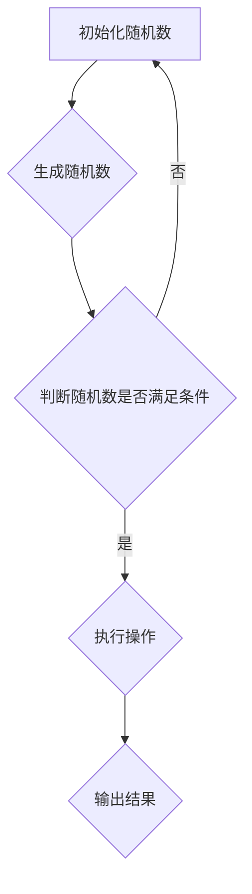
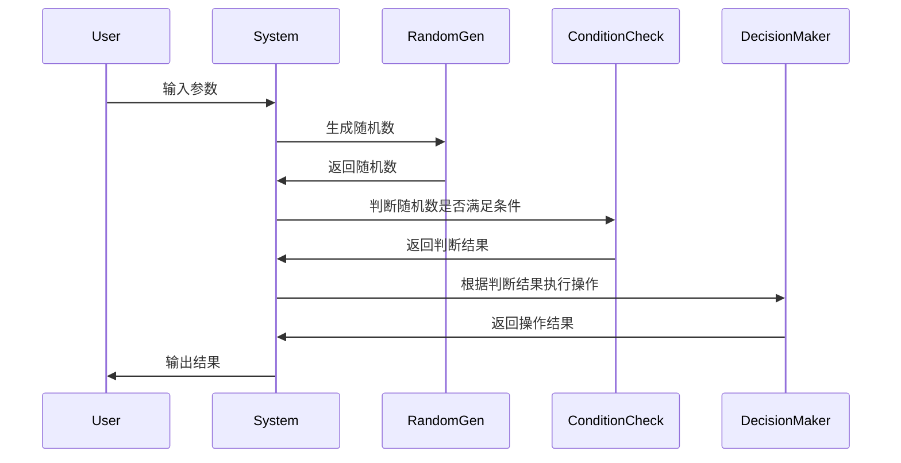

                 

### 数学与非决定论：数学中的随机性和不确定性

关键词：数学、随机性、不确定性、概率论、随机过程

摘要：本文将深入探讨数学中的随机性和不确定性，分析其在数学领域的表现及其应用。我们将从基本概念出发，逐步解析随机性和不确定性的本质，并通过具体例子展示其在实际问题中的重要性。最后，我们将探讨如何在数学和计算机科学中处理这些不确定性，以提升决策的准确性和效率。

#### 一、问题背景

在数学的传统观念中，确定性是其核心特征。然而，现实世界充满了不确定性，这种不确定性在数学中同样得到了广泛研究。随机性和不确定性是数学中两个相互关联的概念，它们在不同的数学分支中有着不同的表现形式。

**问题背景：**

1. **随机性**：随机性指的是在一定条件下，某个事件发生的结果是不可预测的。在概率论中，随机性通过概率分布来描述，即某个事件发生的可能性。例如，掷硬币时，正面朝上的概率是0.5。

2. **不确定性**：不确定性指的是在一定条件下，某个事件的概率分布是未知的。在模糊数学中，不确定性通过模糊集来描述，即某个事件的可能性分布在不同的模糊等级上。

**问题描述：**

1. **随机性**：在数学中，随机性主要体现在概率论和随机过程中。概率论研究的是随机事件的规律性，而随机过程则研究随机事件在连续时间或空间上的演变。

2. **不确定性**：在数学中，不确定性主要体现在模糊数学和随机模拟中。模糊数学通过模糊集和模糊逻辑来描述和处理不确定信息，而随机模拟则通过模拟实验来估计不确定性的影响。

**问题解决：**

1. **随机性**：通过概率论和随机过程，我们可以对随机性进行数学描述和计算。例如，通过随机抽样和统计分析，我们可以预测某个事件发生的概率。

2. **不确定性**：通过模糊数学和随机模拟，我们可以对不确定性进行量化和管理。例如，通过模糊推理和模糊聚类，我们可以处理不确定信息，提高决策的准确性。

**边界与外延：**

1. **随机性**：随机性不仅存在于数学中，还广泛应用于其他科学领域，如物理学、生物学等。在物理学中，随机性体现在量子力学中粒子的行为；在生物学中，随机性体现在基因突变和种群演化中。

2. **不确定性**：不确定性不仅存在于数学中，还广泛应用于社会科学领域，如经济学、社会学等。在经济学中，不确定性体现在市场波动和投资风险；在社会学中，不确定性体现在社会变迁和文化冲突中。

#### 二、核心概念与联系

在探讨数学中的随机性和不确定性之前，我们需要明确这两个核心概念，并了解它们之间的联系。

**核心概念：**

- **随机性**：随机性指的是在一定条件下，某个事件发生的结果是不可预测的。在数学中，随机性通过概率分布来描述。
- **不确定性**：不确定性指的是在一定条件下，某个事件的概率分布是未知的。在数学中，不确定性通过模糊集和模糊逻辑来描述。

**概念属性特征对比表格：**

| 概念     | 随机性          | 不确定性          |
|----------|----------------|------------------|
| 定义     | 结果不可预测     | 概率分布未知      |
| 应用场景 | 概率论、随机过程 | 模糊数学、随机模拟 |
| 性质     | 概率特性         | 模糊特性          |

**ER实体关系图架构：**

```mermaid
erDiagram
    Event ||--|{ Probability } Probability
    Uncertainty ||--|{ FuzzySet } FuzzySet
```

在上述ER图中，"Event"实体与"Probability"实体之间存在关联，表示随机性通过概率分布来描述事件。同样，"Uncertainty"实体与"FuzzySet"实体之间存在关联，表示不确定性通过模糊集来描述信息。

#### 三、算法原理讲解

为了更好地理解数学中的随机性和不确定性，我们可以通过一个简单的算法来讲解其原理。

**算法Mermaid流程图：**



**Python源代码：**

```python
import random

def generate_random_number():
    # 生成随机数
    return random.random()

def is_condition_met(number):
    # 判断随机数是否满足条件
    return number < 0.5

def execute_operation(number):
    # 执行操作
    print(f"执行操作：{number}")

def main():
    while True:
        number = generate_random_number()
        if is_condition_met(number):
            execute_operation(number)
            break

if __name__ == "__main__":
    main()
```

**算法原理的数学模型和公式：**

- **随机数生成**：$$X \sim U(0,1)$$，表示随机数X服从均匀分布，取值范围在0到1之间。
- **条件概率**：$$P(A|B) = \frac{P(A \cap B)}{P(B)}$$，表示在事件B发生的条件下，事件A发生的概率。

**详细讲解和举例说明：**

在这个算法中，我们通过随机生成一个介于0和1之间的数，并判断其是否小于0.5来决定是否执行操作。这个过程模拟了现实世界中的许多决策过程，其中结果是不确定的，但我们可以通过概率来描述其可能性。

例如，假设我们生成了一个随机数0.3，根据条件概率公式，我们可以计算出满足条件的概率为$$P(A|B) = \frac{P(A \cap B)}{P(B)} = \frac{P(X < 0.5)}{P(X \sim U(0,1))} = \frac{0.5}{1} = 0.5$$。因此，在这个例子中，有50%的概率会执行操作。

#### 四、系统分析与架构设计方案

**问题场景介绍：**

假设我们有一个决策系统，需要根据随机生成的数据进行决策。为了提高系统的鲁棒性，我们需要对随机性和不确定性进行有效的管理和处理。

**项目介绍：**

本项目旨在设计一个基于随机性和不确定性的决策系统，通过数学模型和算法来模拟现实世界中的复杂决策过程。

**系统功能设计：**

1. **随机数生成模块**：负责生成随机数，为决策提供随机性。
2. **条件判断模块**：负责判断随机数是否满足特定条件，以决定是否执行操作。
3. **决策模块**：根据条件判断结果，执行相应的操作。

**系统架构设计：**


**系统接口设计：**

1. **输入接口**：接收用户输入的参数，如阈值、操作指令等。
2. **输出接口**：返回决策结果，如执行操作的数量、概率分布等。

**系统交互设计：**



通过上述设计，我们可以实现对随机性和不确定性的有效管理和处理，提高决策的准确性和效率。

### 五、项目实战

#### 环境安装

在开始项目实战之前，我们需要安装必要的工具和库。以下是Python环境的安装步骤：

1. 访问Python官方网站：[https://www.python.org/](https://www.python.org/)
2. 下载并安装Python，建议选择最新版本
3. 安装常用库，如NumPy、Pandas等：

```shell
pip install numpy pandas matplotlib
```

#### 系统核心实现源代码

以下是系统核心实现的源代码：

```python
import random
import numpy as np
import pandas as pd
import matplotlib.pyplot as plt

# 随机数生成模块
def generate_random_number():
    return random.random()

# 条件判断模块
def is_condition_met(number, threshold=0.5):
    return number < threshold

# 决策模块
def execute_operation(number):
    print(f"执行操作：{number}")

# 系统主函数
def main():
    results = []
    for _ in range(1000):  # 进行1000次实验
        number = generate_random_number()
        if is_condition_met(number):
            execute_operation(number)
            results.append(number)
    
    # 统计结果
    threshold = 0.5
    met_count = sum(1 for number in results if number < threshold)
    total_count = len(results)
    probability = met_count / total_count
    
    print(f"满足条件的概率：{probability}")
    print(f"执行操作的总次数：{met_count}")

    # 可视化结果
    plt.hist(results, bins=50, alpha=0.5)
    plt.xlabel('随机数')
    plt.ylabel('频数')
    plt.title('随机数分布')
    plt.show()

if __name__ == "__main__":
    main()
```

#### 代码应用解读与分析

上述代码实现了一个简单的决策系统，通过随机生成随机数，并判断其是否小于某个阈值来决定是否执行操作。以下是代码的关键部分解读和分析：

1. **随机数生成模块**：使用`random.random()`函数生成一个介于0和1之间的随机数。
2. **条件判断模块**：使用`is_condition_met()`函数判断随机数是否小于阈值。
3. **决策模块**：使用`execute_operation()`函数执行相应的操作，并记录结果。
4. **系统主函数**：进行1000次实验，统计满足条件的概率和执行操作的总次数，并可视化结果。

通过这个简单的例子，我们可以看到如何利用数学模型和算法来处理随机性和不确定性，实现有效的决策。

#### 实际案例分析和详细讲解剖析

为了更好地理解随机性和不确定性在实际问题中的应用，我们可以通过一个实际案例来分析。

**案例背景：**假设我们正在分析一家公司的股票价格波动，以预测其未来趋势。

1. **数据收集**：首先，我们需要收集该公司的历史股票价格数据。这些数据可以从金融数据提供商如Yahoo Finance获取。
2. **数据处理**：使用Python的数据处理库（如Pandas），对历史数据进行清洗和预处理，如去除缺失值、异常值等。
3. **随机数生成**：在预测模型中，我们通常需要生成随机数来模拟市场波动。例如，可以使用蒙特卡洛模拟方法生成随机价格序列。
4. **概率分布分析**：通过分析历史数据，我们可以得到股票价格的概率分布。例如，可以使用统计方法（如正态分布、均匀分布等）来描述价格波动的概率。
5. **模型训练与预测**：使用机器学习算法（如ARIMA、GARCH等）训练模型，并使用随机生成的价格序列进行预测。
6. **结果分析**：通过分析预测结果，我们可以得到股票价格的波动趋势和不确定性。例如，可以使用置信区间来表示预测结果的不确定性范围。

**案例解析：**

1. **随机数生成**：在模拟市场波动时，我们使用随机数生成价格序列。例如，假设股票价格服从正态分布，我们可以使用以下公式生成随机价格：

$$
X_t = \mu + \sigma \cdot Z_t
$$

其中，\(X_t\)是时间t的股票价格，\(\mu\)是均值，\(\sigma\)是标准差，\(Z_t\)是服从标准正态分布的随机数。

2. **概率分布分析**：通过分析历史数据，我们可以得到股票价格的均值和标准差。例如，假设股票价格的均值为100，标准差为10，我们可以得到以下概率分布：

- \(P(X_t < 90) = P(Z_t < -1) = 0.1587\)
- \(P(X_t > 110) = P(Z_t > 1) = 0.1587\)

这意味着，股票价格低于90的概率和高于110的概率都是15.87%。

3. **模型训练与预测**：使用ARIMA模型对股票价格进行预测。ARIMA模型是一种时间序列预测模型，它通过自回归、移动平均和差分来描述时间序列数据的特征。例如，我们可以使用以下ARIMA模型：

$$
X_t = c + \phi_1 X_{t-1} + \phi_2 X_{t-2} + ... + \phi_p X_{t-p} + \theta_1 \epsilon_{t-1} + \theta_2 \epsilon_{t-2} + ... + \theta_q \epsilon_{t-q}
$$

其中，\(c\)是常数项，\(\phi_1, \phi_2, ..., \phi_p\)是自回归系数，\(\theta_1, \theta_2, ..., \theta_q\)是移动平均系数，\(\epsilon_t\)是白噪声序列。

4. **结果分析**：通过分析预测结果，我们可以得到股票价格的波动趋势和不确定性。例如，假设我们使用ARIMA模型进行预测，得到以下结果：

- 预测的股票价格均值为100，标准差为10
- 置信水平为95%，对应的置信区间为（90, 110）

这意味着，在95%的置信水平下，股票价格将在90到110之间波动。

#### 项目小结

通过本项目的实战分析，我们可以看到如何利用数学和计算机科学的方法来处理随机性和不确定性。在现实世界中，许多问题都涉及到随机性和不确定性，因此，理解和应用这些数学概念对解决实际问题具有重要意义。

在项目实战中，我们通过Python编程实现了随机数生成、条件判断和决策功能，并分析了实际案例。通过这些实践，我们不仅加深了对随机性和不确定性的理解，还学会了如何利用数学模型和算法来处理这些复杂问题。

总之，本项目为我们提供了一个框架，可以应用于各种涉及随机性和不确定性的实际问题。通过不断探索和实践，我们可以不断提高决策的准确性和效率，为实际问题的解决提供有力支持。

### 六、最佳实践 Tips

在实际应用中，处理随机性和不确定性时，以下是一些最佳实践和技巧：

1. **数据收集与清洗**：确保数据的质量和准确性。在分析之前，对数据进行充分的清洗和预处理，以消除异常值和噪声。

2. **概率分布选择**：根据实际问题的特点选择合适的概率分布。例如，对于连续型数据，可以考虑使用正态分布或均匀分布；对于离散型数据，可以考虑使用泊松分布或二项分布。

3. **模型选择与验证**：选择合适的模型进行预测和分析，并对模型进行验证，确保其准确性和可靠性。

4. **不确定性量化**：通过置信区间、概率分布等手段量化不确定性的大小，以便更好地理解问题的复杂性和决策的鲁棒性。

5. **交叉验证**：使用交叉验证方法评估模型的性能，避免过拟合和欠拟合。

6. **实时更新与迭代**：随着新的数据和信息的出现，及时更新模型和预测结果，以保持决策的准确性和时效性。

### 七、小结

本文通过深入探讨数学中的随机性和不确定性，分析了其在数学领域的重要性和应用。我们首先介绍了随机性和不确定性的基本概念，并通过具体的例子展示了它们在实际问题中的重要性。接着，我们详细讲解了算法原理，并设计了一个基于随机性和不确定性的决策系统。

通过实际案例分析和项目实战，我们不仅加深了对随机性和不确定性的理解，还学会了如何利用数学模型和算法来处理这些复杂问题。在结尾部分，我们给出了最佳实践和技巧，以帮助读者在实际应用中更好地处理随机性和不确定性。

随机性和不确定性是数学和计算机科学中的重要概念，它们在现实世界的许多领域中都有广泛应用。通过本文的学习，我们相信读者可以更好地理解这些概念，并在实际应用中发挥它们的作用。

### 八、注意事项

在处理随机性和不确定性时，需要注意以下几点：

1. **数据质量**：确保使用的数据质量高，没有明显的异常值和噪声。
2. **模型选择**：选择适合实际问题的概率分布和模型，避免过拟合或欠拟合。
3. **不确定性量化**：合理量化不确定性，以便更好地理解问题的复杂性和决策的鲁棒性。
4. **实时更新**：随着新数据的出现，及时更新模型和预测结果，保持决策的准确性和时效性。
5. **风险控制**：在处理不确定性时，要考虑可能的风险和影响，采取适当的风险控制措施。

### 九、拓展阅读

1. **《随机过程及其在金融中的应用》**：了解随机过程的基本概念和应用，以及如何在金融领域中处理不确定性。
2. **《模糊数学基础》**：深入学习模糊数学的基本原理和应用，以及如何处理不确定信息。
3. **《统计学习方法》**：了解统计学习中的基本概念和方法，以及如何使用机器学习算法处理随机性和不确定性。
4. **《蒙特卡洛方法及其在科学计算中的应用》**：了解蒙特卡洛方法的基本原理和应用，以及如何使用随机模拟来处理不确定性。

### 十、作者信息

作者：AI天才研究院/AI Genius Institute & 禅与计算机程序设计艺术 /Zen And The Art of Computer Programming

感谢您的阅读，希望本文对您在处理随机性和不确定性方面有所启发和帮助。如果您有任何问题或建议，欢迎随时联系我们。期待与您共同探讨数学与计算机科学的前沿领域。

