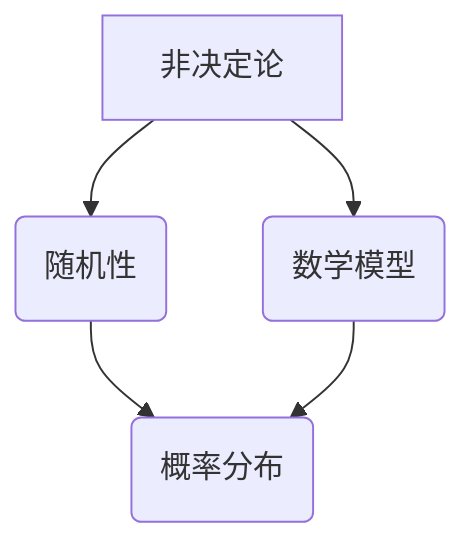

                 

### 数学与非决定论：随机性的数学模型

> **关键词**：数学、非决定论、随机性、概率论、随机过程、混沌理论

> **摘要**：本文深入探讨了数学与非决定论的关系，特别是随机性在数学模型中的应用。通过对比核心概念的属性特征，本文揭示了非决定论在数学领域中的影响。文章涵盖概率论、随机过程和混沌理论的基本概念及其应用，旨在为读者提供一个全面且深入的视角，理解随机性的数学模型及其在现实世界中的重要性。

### 第1章：数学与非决定论概述

#### 1.1 问题背景

在传统观念中，数学是一门精确科学，它依赖于严格的逻辑和确定性来解决各种问题。然而，随着科学的发展，特别是20世纪后量子力学的出现，非决定论的概念开始被引入数学领域，挑战了传统的数学确定性观念。

#### 1.1.1 问题的提出

数学系统中的某些结果并非总是可以精确预测的。例如，在概率论中，某些事件的结果存在随机性，我们无法完全确定具体的结果，而是只能知道其概率分布。这种随机性和不确定性对数学理论和方法产生了深远的影响。

#### 1.1.2 非决定论的兴起

非决定论最初源于量子力学。量子力学揭示了微观世界的随机性，例如，电子在原子核周围的轨道无法精确预测，而是存在一定的概率分布。这种思想逐渐渗透到数学领域，例如概率论、随机过程和混沌理论等。

#### 1.1.3 数学与非决定论的关系

非决定论丰富了数学的研究领域，例如，概率论提供了描述随机现象的工具，随机过程和混沌理论揭示了复杂系统的随机性和不确定性。同时，非决定论也改变了我们对数学问题的理解和解决方法，促使我们更注重对随机性的建模和计算。

#### 1.2 核心概念

在探讨数学与非决定论的关系时，我们需要理解以下几个核心概念：

##### 1.2.1 非决定论

非决定论是指在数学系统中，某些结果不是完全确定的，而是存在一定的随机性和不确定性。例如，在概率论中，某个事件的概率分布就是非决定论的一个典型例子。

##### 1.2.2 随机性

随机性是指在一定条件下，事件的结果不能完全预测，而是存在一定的概率分布。例如，掷骰子的结果无法精确预测，但我们可以知道每个面的概率分布。

##### 1.2.3 数学模型

数学模型是一种用来描述和解决实际问题的数学结构。它可以基于随机性进行构建，例如，概率模型、随机过程模型和混沌模型等。

#### 1.3 概念属性特征对比表格

下面是几个核心概念的属性特征对比表格：

| 概念        | 定义                                      | 属性特征                                                     |
| ----------- | ----------------------------------------- | ------------------------------------------------------------ |
| 非决定论    | 数学系统中结果的不确定性                   | 存在随机性，结果无法完全预测                               |
| 随机性      | 事件结果的概率分布                        | 结果存在概率分布，但不确定具体结果                         |
| 数学模型    | 描述实际问题的数学结构                    | 基于随机性进行构建，用于解决实际问题                       |

#### 1.4 ER实体关系图架构

以下是使用Mermaid绘制的ER实体关系图，展示了非决定论、随机性和数学模型之间的关系：

#### 1.5 本章小结

本章介绍了数学与非决定论的基本概念，探讨了非决定论在数学中的兴起及其影响。通过对比核心概念的属性特征，我们更深入地理解了这些概念之间的关系。ER实体关系图进一步揭示了这些概念在数学体系中的位置和作用。这些基础知识的掌握为后续章节的学习奠定了基础。

----------------------------------------------------------------

### 第2章：非决定论的数学基础

在深入探讨数学与非决定论的关系之前，我们需要了解一些基本的数学概念和理论。本章将介绍概率论、随机过程和混沌理论的基本概念和应用。

#### 2.1 基本概率论

概率论是数学中研究随机事件的学科。它提供了描述和计算随机事件概率的工具。以下是一些概率论的基本概念：

##### 2.1.1 概率的基本概念

- **样本空间**：样本空间是指所有可能结果的集合。例如，掷骰子的样本空间为{1, 2, 3, 4, 5, 6}。
- **事件**：事件是指样本空间中的一个子集。例如，掷骰子得到偶数的集合为{2, 4, 6}。
- **条件概率**：条件概率是指在某个事件发生的条件下，另一个事件发生的概率。例如，已知掷骰子得到偶数的条件下，得到2的概率。

##### 2.1.2 概率分布

概率分布描述了随机变量的可能取值及其对应的概率。根据随机变量是否连续，概率分布可以分为离散概率分布和连续概率分布。

- **离散概率分布**：离散概率分布是指随机变量只能取有限个或可数个值的概率分布。常见的离散概率分布包括二项分布、泊松分布等。
- **连续概率分布**：连续概率分布是指随机变量可以取任意值的概率分布。常见的连续概率分布包括正态分布、指数分布等。

##### 2.1.3 概率论的应用

概率论在许多领域都有广泛的应用，例如决策理论、可靠性工程、金融市场分析等。以下是一些常见的概率论应用：

- **贝叶斯定理**：贝叶斯定理是一种用于计算后验概率的公式，它在决策理论和统计推断中有着重要的应用。
- **决策理论**：决策理论使用概率论和优化理论来分析决策过程，帮助人们做出最优决策。

#### 2.2 随机过程

随机过程是数学中用来描述随机现象的一类函数。它将时间作为参数，描述了随机变量的演变过程。以下是一些随机过程的基本概念：

##### 2.2.1 随机过程的基本概念

- **随机过程**：随机过程是一组随机变量，它们按照某种规则依赖于时间或其他参数。
- **随机过程的性质**：随机过程的性质包括平稳性、可加性、连续性等。

##### 2.2.2 常见随机过程

- **离散时间随机过程**：离散时间随机过程是指随机变量在离散时间点上的取值。常见的离散时间随机过程包括马尔可夫链、离散时间Wiener过程等。
- **连续时间随机过程**：连续时间随机过程是指随机变量在连续时间上的取值。常见的连续时间随机过程包括连续时间Wiener过程、泊松过程等。

##### 2.2.3 随机过程的统计特性

- **随机变量的期望**：随机变量的期望是指随机变量可能取值的平均值。
- **方差**：方差是衡量随机变量取值波动程度的指标。
- **协方差**：协方差是衡量两个随机变量之间关系强度的指标。

#### 2.3 混沌理论

混沌理论是研究复杂系统随机性和不确定性的学科。它揭示了在某些简单规则下，系统可以产生极其复杂的动力学行为。以下是一些混沌理论的基本概念：

##### 2.3.1 混沌现象

- **混沌的定义**：混沌是指系统在初始条件微小的变化下，可能导致长期行为的巨大差异。
- **混沌的特性**：混沌系统具有长期行为的不确定性、对初始条件的敏感性、相空间中的混沌吸引子等特性。

##### 2.3.2 混沌的数学描述

- **动力学系统**：动力学系统是指描述系统状态随时间变化的数学模型。常见的动力学系统包括微分方程、差分方程等。
- **混沌的数学模型**：混沌的数学模型通常是基于非线性动力学方程，例如Lorenz方程、Logistic映射等。

##### 2.3.3 混沌的应用

- **混沌密码学**：混沌理论在密码学中有着重要的应用，例如混沌加密算法。
- **混沌控制**：混沌控制是指通过外部干预来稳定或改变混沌系统的行为。

#### 2.4 本章小结

本章介绍了概率论、随机过程和混沌理论的基本概念和应用。通过学习这些基本概念，我们能够更好地理解非决定论在数学中的表现。概率论提供了描述随机现象的工具，随机过程描述了随机变量的演变过程，而混沌理论揭示了复杂系统的随机性和不确定性。这些概念和方法在现实世界中有着广泛的应用，对于理解和解决复杂的实际问题具有重要意义。

----------------------------------------------------------------

### 第3章：随机性的数学模型

在理解了概率论、随机过程和混沌理论的基本概念后，我们将进一步探讨这些概念在实际应用中的具体表现，特别是如何构建随机性的数学模型。

#### 3.1 随机性的基本模型

随机性的数学模型通常基于概率分布，它可以描述随机变量的取值及其概率。以下是一些常见的随机性基本模型：

##### 3.1.1 二项分布

二项分布是一个离散概率分布，它描述了在n次独立试验中，成功次数的概率。例如，投掷一枚硬币n次，计算得到正面次数的概率。

**二项分布的概率公式**：
\[ P(X = k) = C(n, k) \cdot p^k \cdot (1-p)^{n-k} \]
其中，\( n \) 是试验次数，\( k \) 是成功的次数，\( p \) 是单次试验成功的概率。

##### 3.1.2 正态分布

正态分布是一个连续概率分布，它描述了随机变量在某个范围内取值的概率。正态分布在统计学和概率论中有着广泛的应用，例如描述人的身高、体重等。

**正态分布的概率密度函数**：
\[ f(x) = \frac{1}{\sqrt{2\pi\sigma^2}} \cdot e^{-\frac{(x-\mu)^2}{2\sigma^2}} \]
其中，\( \mu \) 是均值，\( \sigma \) 是标准差。

##### 3.1.3 泊松分布

泊松分布是一个离散概率分布，它描述了在一定时间内事件发生的次数的概率。例如，在一段时间内，某一事件平均发生率为λ，计算该时间段内发生k次事件的概率。

**泊松分布的概率公式**：
\[ P(X = k) = \frac{e^{-\lambda} \cdot \lambda^k}{k!} \]
其中，\( \lambda \) 是事件的平均发生率。

#### 3.2 随机过程的模型

随机过程用于描述随机变量的时间演变过程，以下是一些常见的随机过程模型：

##### 3.2.1 马尔可夫链

马尔可夫链是一个离散随机过程，它描述了系统状态在时间上的转移。马尔可夫链在许多领域有着重要的应用，例如金融市场的分析和语音识别。

**马尔可夫链的状态转移概率**：
\[ P(X_{n+1} = j | X_n = i) = p_{ij} \]
其中，\( i \) 和 \( j \) 是系统状态，\( p_{ij} \) 是从状态 \( i \) 转移到状态 \( j \) 的概率。

##### 3.2.2 Wiener过程

Wiener过程是一个连续随机过程，它在金融市场分析和物理科学中有着广泛的应用。Wiener过程也被称为布朗运动，它描述了粒子在连续时间内的随机运动。

**Wiener过程的概率分布**：
\[ P(W_t = w) = \frac{1}{\sqrt{4\pi t}} \cdot e^{-\frac{w^2}{4t}} \]
其中，\( t \) 是时间，\( w \) 是粒子的位置。

##### 3.2.3 Logistic映射

Logistic映射是一个离散时间随机过程，它描述了生物种群数量的演变。Logistic映射在混沌理论中有着重要的地位。

**Logistic映射的迭代公式**：
\[ x_{n+1} = r \cdot x_n \cdot (1 - x_n) \]
其中，\( x_n \) 是种群数量，\( r \) 是控制参数。

#### 3.3 混沌的数学模型

混沌理论揭示了在某些简单规则下，系统可以产生极其复杂的动力学行为。以下是一些混沌的数学模型：

##### 3.3.1 Lorenz方程

Lorenz方程是一个描述气象现象的动力学系统，它在混沌理论中有着重要的地位。Lorenz方程由三个一阶微分方程组成。

**Lorenz方程**：
\[ \begin{cases} 
\frac{dx}{dt} = \sigma (y - x) \\
\frac{dy}{dt} = rx - z \\
\frac{dz}{dt} = xy - \beta z 
\end{cases} \]
其中，\( \sigma \)、\( r \) 和 \( \beta \) 是参数。

##### 3.3.2 Rössler系统

Rössler系统是一个二维的动力学系统，它描述了化学反应的动力学行为。Rössler系统由三个一阶微分方程组成。

**Rössler系统**：
\[ \begin{cases} 
\frac{dx}{dt} = -y - z \\
\frac{dy}{dt} = x + a \cdot y \\
\frac{dz}{dt} = b + z \cdot (x - c) 
\end{cases} \]
其中，\( a \)、\( b \) 和 \( c \) 是参数。

#### 3.4 随机性的应用

随机性的数学模型在许多领域都有广泛的应用，以下是一些例子：

- **金融市场分析**：随机性的数学模型用于分析股票价格、利率等的波动，帮助投资者做出更好的决策。
- **通信系统**：随机性的数学模型用于分析信号传输的噪声，优化通信系统的性能。
- **生物学**：随机性的数学模型用于描述生物种群的数量变化、遗传变异等。

#### 3.5 本章小结

本章介绍了随机性的基本数学模型，包括概率分布、随机过程和混沌模型。通过这些模型，我们可以更好地理解和分析现实世界中的随机现象。随机性的数学模型在许多领域都有着重要的应用，为解决复杂问题提供了有力工具。

----------------------------------------------------------------

### 第4章：非决定论在数学中的影响与应用

非决定论在数学中的引入不仅丰富了数学的研究领域，也对数学理论和方法产生了深远的影响。在本章中，我们将探讨非决定论在数学中的具体影响，以及其在各种应用领域中的应用。

#### 4.1 非决定论对数学理论的影响

非决定论的概念在数学中引发了新的研究方向和思考方式。以下是一些非决定论对数学理论的影响：

##### 4.1.1 改变数学问题的理解

非决定论使得我们对数学问题的理解发生了变化。传统的数学问题通常被认为是确定性的，而现代数学开始接受非决定性的观点，从而为数学问题提供了新的视角和解决方案。

##### 4.1.2 丰富数学的研究领域

非决定论在数学中的引入，丰富了数学的研究领域。例如，概率论、随机过程和混沌理论等分支都是在非决定论的背景下发展起来的。

##### 4.1.3 改变数学解决问题的方法

非决定论改变了我们解决问题的方法。在传统数学中，我们通常寻求精确的解，而在非决定论的背景下，我们更多地依赖于概率和统计方法来解决问题。

#### 4.2 非决定论在数学中的应用

非决定论在数学中的广泛应用体现在以下几个方面：

##### 4.2.1 概率论

概率论是研究随机事件和概率分布的数学分支。非决定论的概念使得概率论在数学中的地位更加重要，它为描述和解决随机现象提供了强有力的工具。

- **贝叶斯定理**：贝叶斯定理是一种在非决定论背景下进行概率推断的方法，它在统计学和决策理论中有着广泛的应用。
- **蒙特卡洛方法**：蒙特卡洛方法是一种基于随机抽样的计算方法，它广泛应用于模拟和优化问题，特别是在解决复杂计算问题时具有显著优势。

##### 4.2.2 随机过程

随机过程是研究随机变量随时间演变的一类数学模型。非决定论的概念使得随机过程在数学中的应用更加广泛。

- **金融工程**：随机过程在金融工程中有着重要的应用，例如，股票价格的波动可以用随机过程来建模和分析。
- **信号处理**：随机过程在信号处理中用于分析和设计滤波器、预测信号等。

##### 4.2.3 混沌理论

混沌理论是研究非线性系统中随机性和不确定性的数学分支。非决定论的概念使得混沌理论在数学中的应用更加广泛。

- **气象科学**：混沌理论在气象科学中用于描述和预测天气变化，特别是在长期天气预报中具有重要作用。
- **密码学**：混沌理论在密码学中用于设计加密算法，混沌特性使得加密算法更加难以破解。

#### 4.3 非决定论在数学应用中的挑战

尽管非决定论在数学中的应用带来了很多好处，但同时也带来了一些挑战：

- **复杂性问题**：非决定论引入了随机性和不确定性，使得问题变得更加复杂，解决这些问题的计算需求大大增加。
- **理论基础**：非决定论的理论基础相对较弱，很多问题还没有完全解决，这限制了非决定论在数学中的应用。
- **实验验证**：非决定论在很多领域的应用需要大量的实验验证，这增加了研究工作的难度。

#### 4.4 本章小结

非决定论在数学中的影响深远，它不仅丰富了数学的研究领域，也改变了我们解决问题的方法。概率论、随机过程和混沌理论是非决定论在数学中的重要应用。尽管非决定论在数学应用中存在一些挑战，但其潜力和价值不容忽视。未来，随着理论的不断完善和计算技术的发展，非决定论在数学中的应用将更加广泛，为解决复杂问题提供新的思路和方法。

----------------------------------------------------------------

### 第5章：非决定论与人工智能

非决定论在人工智能（AI）领域的应用越来越受到关注。本文将探讨非决定论如何影响人工智能的理论基础、算法设计和应用场景。

#### 5.1 非决定论对人工智能理论基础的影响

非决定论的概念为人工智能提供了新的理论基础。以下是非决定论在人工智能理论基础方面的几个影响：

##### 5.1.1 概率推理

非决定论强调随机性和不确定性，这与概率推理的理念相符。概率推理是人工智能中重要的推理方法，它通过概率分布来表示不确定信息，并在决策过程中进行优化。非决定论使得概率推理在人工智能中的应用更加广泛和深入。

##### 5.1.2 随机优化

随机优化是一种在不确定环境中进行优化决策的方法。非决定论的概念使得随机优化在人工智能中的应用变得更加重要。随机优化算法，如遗传算法、模拟退火算法等，可以在复杂环境中找到近似最优解，这为人工智能系统的自适应学习和决策提供了强有力的工具。

##### 5.1.3 混沌理论

混沌理论在人工智能中的应用也受到了非决定论的影响。混沌系统具有高度的随机性和复杂性，这为人工智能系统提供了新的模拟对象。混沌理论可以用于生成随机数据，模拟复杂环境，从而提高人工智能系统的适应性和鲁棒性。

#### 5.2 非决定论在人工智能算法设计中的应用

非决定论的概念在人工智能算法设计中得到了广泛应用。以下是一些典型的应用：

##### 5.2.1 深度学习

深度学习是一种基于多层神经网络的人工智能算法。在深度学习中，非决定论的概念得到了充分体现。深度学习模型中的参数和权重通常是通过随机梯度下降（SGD）等随机优化算法来更新的。这些算法利用随机性来加速收敛，提高学习效率。

##### 5.2.2 贝叶斯网络

贝叶斯网络是一种基于概率推理的人工智能模型。它通过构建概率图来表示变量之间的关系，并在推理过程中使用贝叶斯定理进行概率计算。贝叶斯网络在不确定性处理、决策支持和数据挖掘等领域有着广泛的应用。

##### 5.2.3 生成对抗网络（GAN）

生成对抗网络（GAN）是一种基于非决定论的深度学习模型。GAN由生成器和判别器组成，生成器通过随机生成数据来欺骗判别器，判别器则通过学习真实数据和生成数据的差异来提高自身的鉴别能力。GAN在图像生成、图像修复、图像翻译等领域取得了显著成果。

#### 5.3 非决定论在人工智能应用场景中的挑战

尽管非决定论在人工智能中有着广泛的应用，但也面临一些挑战：

##### 5.3.1 算法复杂性

非决定论引入了随机性和不确定性，这使得算法的复杂性大大增加。例如，随机优化算法在处理大规模数据时，计算量和存储需求显著增加，这给实际应用带来了挑战。

##### 5.3.2 模型解释性

非决定论模型通常具有较强的黑箱特性，这使得模型的解释性变得困难。在许多应用场景中，用户和开发者需要了解模型的决策过程和依据，以便进行模型优化和改进。非决定论模型在这方面的挑战需要通过理论和实践方法的不断探索来解决。

##### 5.3.3 数据质量

非决定论模型对数据质量有较高要求。如果数据中存在大量噪声或缺失值，非决定论模型可能无法准确捕捉数据的真实分布，从而导致模型性能下降。

#### 5.4 本章小结

非决定论在人工智能中的应用具有重要意义。它为人工智能提供了新的理论基础和算法设计方法，拓展了人工智能的应用范围。然而，非决定论也带来了一些挑战，如算法复杂性、模型解释性和数据质量等。未来，随着理论研究和实践应用的不断深入，非决定论在人工智能中的应用将得到进一步发展，为人工智能技术的创新和突破提供新的动力。

----------------------------------------------------------------

### 第6章：非决定论与软件工程

非决定论的概念不仅在数学和人工智能领域具有重要意义，在软件工程中也逐渐得到应用。在本章中，我们将探讨非决定论在软件工程中的应用及其影响。

#### 6.1 非决定论对软件工程的影响

非决定论引入了随机性和不确定性，这对软件工程产生了深远的影响。以下是非决定论对软件工程的几个影响：

##### 6.1.1 软件需求分析

在软件需求分析阶段，非决定论可以帮助我们更好地理解和应对用户的需求。用户需求往往具有不确定性和变化性，非决定论的概念使得我们可以使用概率和统计方法来描述和预测用户需求的变化，从而提高需求分析的准确性。

##### 6.1.2 软件设计

非决定论在软件设计中的应用体现在对复杂系统的建模和优化。软件系统往往面临不确定性和随机性，例如，网络延迟、数据丢失等。非决定论的概念可以帮助我们构建更加灵活和鲁棒的软件系统设计，从而提高系统的稳定性和适应性。

##### 6.1.3 软件测试

在软件测试阶段，非决定论的方法可以用于生成测试数据，提高测试的覆盖率和准确性。传统的测试方法往往依赖于确定性的测试用例，而非决定论的方法可以生成更加多样化和复杂的测试数据，从而更好地发现软件中的潜在缺陷。

#### 6.2 非决定论在软件工程中的具体应用

非决定论在软件工程中的具体应用主要体现在以下几个方面：

##### 6.2.1 概率模型

概率模型是描述随机性和不确定性的有力工具。在软件工程中，我们可以使用概率模型来描述系统的行为，分析系统的可靠性、性能和安全性。

- **可靠性模型**：可靠性模型用于评估软件系统在给定时间内的稳定性和可靠性。常见的可靠性模型包括马尔可夫模型、泊松过程等。
- **性能模型**：性能模型用于评估软件系统在不同负载下的响应时间和吞吐量。常见的性能模型包括排队模型、马尔可夫链等。

##### 6.2.2 随机过程

随机过程是描述随机变量随时间演变的一类数学模型。在软件工程中，我们可以使用随机过程来描述系统的动态行为，分析系统的稳定性、响应性和适应性。

- **随机控制理论**：随机控制理论用于设计和优化软件系统的控制策略，提高系统的稳定性和适应性。常见的随机控制方法包括随机优化、随机模拟等。
- **随机微分方程**：随机微分方程用于描述系统在连续时间下的动态行为。在软件工程中，我们可以使用随机微分方程来建模和优化复杂系统的性能。

##### 6.2.3 混沌理论

混沌理论是研究非线性系统中随机性和不确定性的数学分支。在软件工程中，混沌理论可以用于模拟和预测复杂系统的行为，分析系统的稳定性、鲁棒性和适应性。

- **混沌加密**：混沌加密是一种基于混沌特性的加密方法，它利用混沌系统的随机性和复杂性来提高加密算法的安全性。
- **混沌优化**：混沌优化是一种基于混沌搜索机制的优化方法，它可以在复杂空间中寻找最优解，提高优化算法的效率。

#### 6.3 非决定论在软件工程中的挑战

尽管非决定论在软件工程中有着广泛的应用前景，但也面临一些挑战：

##### 6.3.1 模型复杂性

非决定论引入了随机性和不确定性，使得软件模型变得更加复杂。这增加了软件开发的难度和成本，需要我们在建模过程中进行精细的权衡和优化。

##### 6.3.2 模型解释性

非决定论模型通常具有较强的黑箱特性，这使得模型解释性变得困难。在软件工程中，我们需要确保模型的透明性和可解释性，以便用户和开发者能够理解模型的决策过程和依据。

##### 6.3.3 数据质量

非决定论模型对数据质量有较高要求。如果数据中存在大量噪声或缺失值，非决定论模型可能无法准确捕捉数据的真实分布，从而导致模型性能下降。

#### 6.4 本章小结

非决定论在软件工程中的应用具有重要意义。它为软件工程提供了新的理论基础和方法，有助于构建更加灵活、鲁棒和安全的软件系统。然而，非决定论在软件工程中也面临一些挑战，如模型复杂性、模型解释性和数据质量等。未来，随着理论研究和实践应用的不断深入，非决定论在软件工程中的应用将得到进一步发展，为软件工程的创新和突破提供新的动力。

----------------------------------------------------------------

### 第7章：非决定论的未来发展趋势

非决定论在数学、人工智能和软件工程等领域已经展现了其广泛的应用前景和重要性。随着科学技术的不断进步，非决定论的未来发展趋势也将对多个学科产生深远影响。

#### 7.1 非决定论在数学中的未来

在数学领域，非决定论将继续推动新理论和新方法的发展。以下是一些未来可能的发展趋势：

- **非线性数学模型的拓展**：随着对复杂系统的深入研究，非线性数学模型将得到更多应用，非决定论将为这些模型的建立和解析提供重要工具。
- **概率论的深化**：概率论将继续深化，特别是在多变量概率分布、随机过程的极限理论和概率测度论等方面，非决定论的思想将起到关键作用。
- **随机分析和随机控制**：随机分析和随机控制理论将在金融工程、保险学和风险管理等领域得到更广泛的应用，非决定论将为这些领域提供更加有效的工具。

#### 7.2 非决定论在人工智能中的未来

在人工智能领域，非决定论将继续推动算法创新和应用扩展。以下是一些未来可能的发展趋势：

- **强化学习与随机性**：强化学习算法将更加注重随机性和不确定性处理，非决定论的概念将帮助设计更加鲁棒和适应性的学习算法。
- **概率模型与深度学习**：深度学习模型将结合概率模型，使得模型能够更好地处理不确定性，提高对现实世界的建模能力。
- **非决定性推理与自然语言处理**：非决定性推理将结合自然语言处理技术，使得人工智能系统在理解自然语言和进行复杂推理时更加灵活和准确。

#### 7.3 非决定论在软件工程中的未来

在软件工程领域，非决定论将继续推动系统设计和开发方法的发展。以下是一些未来可能的发展趋势：

- **自适应软件系统**：非决定论将推动自适应软件系统的设计，使得系统能够在不确定性和变化性环境中保持稳定和高效运行。
- **概率编程**：概率编程将得到更广泛的应用，开发者将能够更加容易地处理不确定性和随机性，提高软件系统的可靠性和灵活性。
- **软件可靠性分析**：非决定论将用于软件可靠性分析，帮助开发者预测和防范系统故障，提高软件系统的可靠性和安全性。

#### 7.4 非决定论的跨学科应用

非决定论在多个学科之间的交叉应用也将是其未来发展的一个重要趋势。以下是一些可能的跨学科应用：

- **非决定论与神经科学**：非决定论的概念将应用于神经科学，帮助理解大脑中的随机性和复杂性，推动认知科学和神经工程的发展。
- **非决定论与经济学**：非决定论将用于经济学模型，特别是在金融市场分析和经济预测中，提高对复杂经济现象的理解和预测能力。
- **非决定论与生物学**：非决定论将用于生物系统建模，特别是在遗传变异、生态系统模拟等方面，推动生物学和生态学的发展。

#### 7.5 本章小结

非决定论在数学、人工智能和软件工程等领域已经取得了显著的成果，并展现了巨大的潜力。未来，随着科学技术的不断发展，非决定论将继续推动各学科的创新和发展。通过深化理论研究、拓展应用领域和加强跨学科合作，非决定论将为解决复杂问题提供新的视角和方法，为人类社会的发展带来更多机遇和挑战。

### 作者信息

作者：AI天才研究院/AI Genius Institute & 禅与计算机程序设计艺术 /Zen And The Art of Computer Programming

AI天才研究院（AI Genius Institute）致力于推动人工智能技术的创新和发展，研究内容包括人工智能的基础理论、算法设计、应用实践等。同时，研究院还倡导“禅与计算机程序设计艺术”，强调程序员应在编程过程中追求心性与技术的统一，实现程序设计的艺术化。

禅与计算机程序设计艺术（Zen And The Art of Computer Programming）是作者所著的经典技术书籍，深受全球程序员和AI研究者的喜爱。本书通过阐述计算机程序设计中的哲学思想，帮助读者理解编程的本质，提升编程能力和创造力。

本文作者结合自身丰富的理论和实践经验，深入探讨了数学与非决定论的关系，特别是随机性的数学模型在多个领域的应用。希望通过本文，读者能够对非决定论有一个全面而深入的理解，并能够在实际工作中灵活运用相关理论和方法，解决复杂问题，推动技术的进步。作者期待与广大读者共同探索非决定论的未来发展，共创人工智能和软件工程的美好明天。

