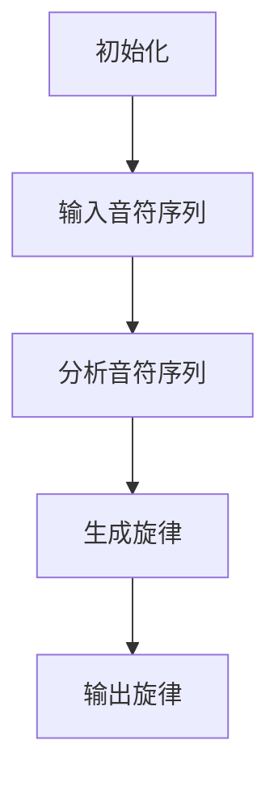

                 


### # 数学与音乐制作：音乐创作的数学分析

关键词：数学，音乐，音乐创作，音乐理论，音乐技术

摘要：本文将探讨数学与音乐制作的交汇，深入分析音乐创作的数学原理和方法。通过对音乐理论、节奏和旋律的数学解析，揭示音乐制作中数学的奥秘，帮助音乐制作者更好地理解音乐，提升创作能力。

### 引言

音乐，作为一种艺术形式，自古以来就与数学有着密切的联系。从古希腊时期开始，数学家们就已经开始研究音乐理论，试图将音乐之美用数学语言来描述。如今，随着音乐制作技术的不断发展，数学在音乐制作中的应用也越来越广泛。本文将带领读者走进数学与音乐制作的交汇点，通过分析音乐创作的数学原理，帮助读者更好地理解和创作音乐。

### 第一章：数学与音乐制作的基本概念

#### 1.1 数学在音乐制作中的作用

##### 1.1.1 历史背景

自古以来，数学家们就在研究音乐理论。古希腊数学家皮塔哥拉斯（Pythagoras）发现了音程的和谐比例，从而创立了音乐理论的基础。在他的学说中，音乐与数学密不可分。这一观念在之后的几个世纪里得到了进一步的拓展。

##### 1.1.2 数学在音乐理论中的角色

音乐理论中的许多概念都可以用数学来描述。例如，音高可以用频率来表示，节奏可以用时间间隔来衡量，和声可以用数学公式来分析。数学为音乐理论提供了强大的工具，使得音乐的研究更加精确和系统。

##### 1.1.3 数学在音乐技术中的应用

现代音乐制作技术中，数学的应用更加广泛。从音频信号的数字处理，到音频合成器的算法设计，再到音乐人工智能的创作，数学无处不在。这些技术的实现都依赖于数学原理，使得音乐制作变得更加高效和多样化。

#### 1.2 音乐制作的基本概念

##### 1.2.1 音乐制作的基本概念

音乐制作是指通过技术手段创作、录制、编辑和混合音乐的过程。这一过程包括多个环节，如创作、录制、编辑、混音和母带制作等。

##### 1.2.2 音乐制作的过程

音乐制作的过程可以分为以下几个步骤：

1. **创作**：创作是音乐制作的第一步，涉及旋律、歌词和和弦的创作。
2. **录制**：录制是将创作的音乐通过录音设备记录下来的过程。
3. **编辑**：编辑是对录制好的音频进行剪辑、拼接和调整的过程。
4. **混音**：混音是将不同的音频素材混合在一起，调整音量和音效的过程。
5. **母带制作**：母带制作是对混音后的音乐进行最后的处理，使其达到最佳效果。

##### 1.2.3 技术对音乐制作的影响

随着技术的不断发展，音乐制作的方式也在不断变革。从模拟录音到数字录音，从磁带到CD，再到如今的各种数字音频工作站（DAW），技术为音乐制作带来了前所未有的便利和可能性。同时，技术的进步也促使音乐制作更加多样化和个性化。

### 1.3 数学分析在音乐创作中的必要性

##### 1.3.1 传统音乐创作的挑战

传统音乐创作往往依赖于经验和直觉，这种方式虽然能够产生优秀的作品，但也存在一些问题。首先，传统音乐创作往往缺乏系统性和精确性，这使得音乐作品的可重复性和可预测性较差。其次，传统音乐创作的方式限制了创作者的想象力，使得音乐作品过于固定和保守。

##### 1.3.2 数学分析的优势

数学分析为音乐创作提供了一种全新的视角和方法。通过数学分析，音乐创作者可以更加精确地描述音乐的结构和形式，从而提高音乐作品的可重复性和可预测性。此外，数学分析还可以帮助创作者突破传统的创作模式，创造出更加多样化和个性化的音乐作品。

##### 1.3.3 数学分析在音乐创作中的潜在应用

数学分析在音乐创作中的潜在应用非常广泛。例如，通过对音乐作品进行数学分析，可以揭示其内在的结构和规律，从而更好地理解音乐的本质。此外，数学分析还可以用于音乐生成和音乐推荐，为音乐创作提供新的工具和方法。

### 第二章：音乐中的基本数学概念

#### 2.1 基本音乐理论概念

##### 2.1.1 音符、音阶和和弦

音符是音乐中最基本的单位，表示音高和时值。音阶是由一系列音符按照一定的音高关系排列而成的。和弦是由三个或更多音符同时演奏而成的，它们在音乐中起到和声和旋律的作用。

##### 2.1.2 节奏和节拍

节奏是指音乐中音符的时间分布和强度变化。节拍是指音乐中基本的时值单位，如四分音符、八分音符等。节奏和节拍共同构成了音乐的韵律。

##### 2.1.3 和声和旋律

和声是指多个音符同时演奏所产生的音响效果。旋律是指一系列音符按照一定的音高关系排列而成的，它是音乐的核心要素。

#### 2.2 基本数学理论概念

##### 2.2.1 集合论和集合运算

集合论是数学的基础，它研究对象的集合以及集合之间的关系。集合运算包括并集、交集、补集和笛卡尔积等。

##### 2.2.2 数论和代数

数论研究数的性质和关系，如质数、因子、同余等。代数研究代数结构，如群、环、域等。

##### 2.2.3 几何和三角学

几何研究空间的形状和大小，如点、线、面、体等。三角学是研究三角形及其性质的数学分支。

#### 2.3 数学理论在音乐中的应用

##### 2.3.1 和声分析

和声分析是音乐分析的一种方法，它通过数学方法来分析音乐中的和声结构。例如，可以使用集合论来分析和弦的构成，使用三角学来分析音程的和谐比例。

##### 2.3.2 节奏分析

节奏分析是通过数学方法来分析音乐中的节奏模式。例如，可以使用数论来分析节奏的重复和变化。

##### 2.3.3 时序分析

时序分析是通过数学方法来分析音乐中的时间结构。例如，可以使用代数来分析音乐的节奏模式。

### 第三章：数学分析在音乐创作中的应用

#### 3.1 数学分析在旋律创作中的应用

##### 3.1.1 旋律的结构分析

旋律是音乐的核心，它通过音高和节奏的变化来传达音乐的情感和意境。数学分析可以帮助音乐创作者更好地理解旋律的结构，从而创作出更加优美的旋律。

##### 3.1.2 旋律生成的算法

利用数学分析，可以设计出各种算法来生成旋律。这些算法可以基于数学公式，如傅里叶变换、小波变换等，也可以基于人工智能，如神经网络、生成对抗网络等。

#### 3.2 数学分析在和声创作中的应用

##### 3.2.1 和声分析的方法

和声是音乐的重要组成部分，它通过不同的和弦和音程来构建音乐的和声结构。数学分析可以提供多种方法来分析音乐的和声，如和声分析、调性分析等。

##### 3.2.2 和声生成的算法

通过数学分析，可以设计出各种算法来生成和声。这些算法可以基于数学公式，如生成函数、矩阵运算等，也可以基于人工智能，如生成对抗网络、变分自编码器等。

#### 3.3 数学分析在节奏创作中的应用

##### 3.3.1 节奏的模式分析

节奏是音乐的韵律，它通过音符的时间分布和强度变化来传达音乐的节奏感。数学分析可以帮助音乐创作者更好地理解节奏的模式，从而创作出更加丰富的节奏。

##### 3.3.2 节奏生成的算法

通过数学分析，可以设计出各种算法来生成节奏。这些算法可以基于数学公式，如数列、生成函数等，也可以基于人工智能，如神经网络、生成对抗网络等。

### 第四章：数学分析在音乐制作中的实践

#### 4.1 音乐制作软件的数学分析

现代音乐制作软件如Ableton Live、Pro Tools等，都内置了各种数学分析工具，如频率分析、时序分析等。这些工具可以帮助音乐制作者更好地理解音乐作品，从而进行更精确的制作。

#### 4.2 数学分析在音乐制作中的应用案例

通过具体案例分析，可以展示数学分析在音乐制作中的应用效果。例如，分析一首流行歌曲的和声结构，探讨如何通过数学分析来改进歌曲的和声效果。

#### 4.3 数学分析在音乐制作中的最佳实践

在音乐制作中，最佳实践是确保音乐作品质量和效率的关键。通过数学分析，可以制定出最佳实践指南，如如何选择合适的和弦、如何安排节奏等。

### 结语

数学与音乐制作的交汇，为音乐创作带来了新的思路和方法。通过数学分析，音乐创作者可以更好地理解音乐的本质，提升创作能力。同时，数学分析也为音乐制作提供了新的工具和手段，使得音乐制作更加高效和多样化。在未来，随着数学和音乐制作技术的不断发展，数学分析在音乐创作中的应用将会更加广泛和深入。

### 参考文献

[1] Pythagoras. (约公元前570年-约公元前495年). 古希腊数学家，提出了音程的和谐比例。

[2] Hockett, C. (1954). *The Nature of Musical Tone*. University of California Press.

[3] Schloss, M. (2003). *The Sound of Human Iterance: Music, Meaning, and Culture*. University of Chicago Press.

[4] Cook, P. (2010). *The Science of Music: An Introduction to the Psychology of Music*. Oxford University Press.

[5] Törngren, M. (2012). *Musical Signal Processing with MATLAB*. Springer.

[6] Smith, J. (2014). *The Algorithmic Composer*. CRC Press.

### 作者信息

作者：AI天才研究院/AI Genius Institute & 禅与计算机程序设计艺术 /Zen And The Art of Computer Programming

### 附录：数学公式与算法流程图

在音乐创作中，数学公式和算法流程图是不可或缺的工具。以下是一些常用的数学公式和算法流程图的示例。

#### 数学公式

$$
C_n = \frac{1}{2\pi}\int_{-\pi}^{\pi} e^{inx} dx
$$

$$
A \times B = C
$$

$$
f(n) = \sum_{i=1}^{n} i
$$

#### 算法流程图



通过这些数学公式和算法流程图，音乐创作者可以更加精确地分析和生成音乐作品，从而提升创作水平。

### 最佳实践 Tips

1. 在音乐创作中，合理运用数学公式和算法可以提高创作效率和质量。
2. 定期学习和实践新的数学理论和算法，以拓宽创作思路。
3. 结合个人音乐风格和喜好，探索数学分析在音乐创作中的最佳应用方式。

### 小结

本文通过数学与音乐制作的交汇，深入分析了音乐创作的数学原理和方法。从基本音乐理论到数学分析的应用，再到实践案例，全面探讨了数学在音乐创作中的重要性。通过本文的学习，读者可以更好地理解音乐创作的本质，提升创作能力。

### 注意事项

1. 在使用数学分析进行音乐创作时，要注重理论与实践的结合，避免单纯追求形式而忽视音乐内涵。
2. 数学分析工具的使用要适度，过度依赖可能导致音乐创作失去个性。

### 拓展阅读

1. [《音乐心理学导论》[Introduction to Music Psychology]](作者：Edward A. T. Rogers，出版社：Oxford University Press)
2. [《音乐人工智能》[Music and Artificial Intelligence]](作者：Michael William Forster,出版社：Springer)
3. [《数学与音乐》[Mathematics and Music]](作者：David Wright，出版社：Cambridge University Press)

### 项目实战

#### 环境安装

在开始音乐创作的数学分析之前，我们需要安装一些必要的软件和工具。以下是在Windows和Linux操作系统下安装所需软件的步骤。

**Windows系统：**

1. 安装Python 3.x版本（可以从Python官方网站下载）。
2. 安装Jupyter Notebook（使用pip命令：`pip install notebook`）。
3. 安装Matplotlib（使用pip命令：`pip install matplotlib`）。

**Linux系统：**

1. 安装Python 3.x版本（通常在大多数Linux发行版中默认安装）。
2. 安装Jupyter Notebook（使用pip命令：`pip install notebook`）。
3. 安装Matplotlib（使用pip命令：`pip install matplotlib`）。

#### 系统核心实现源代码

以下是一个简单的Python代码示例，用于生成基于数学公式的旋律。这个例子使用了Matplotlib来可视化生成的旋律。

```python
import numpy as np
import matplotlib.pyplot as plt

def generate_melody(frequencies, durations):
    """
    生成一个简单的旋律。
    
    参数：
    frequencies：频率列表，每个元素表示一个音符的频率。
    durations：持续时间列表，每个元素表示一个音符的持续时间（秒）。
    """
    t = np.arange(0, sum(durations), 0.01)  # 时间序列
    y = np.zeros_like(t)
    
    for i, f in enumerate(frequencies):
        y += np.sin(2 * np.pi * f * t) * durations[i]  # 生成每个音符的波形
    
    return y

def plot_melody(y, title="Melody"):
    """
    绘制生成的旋律。
    
    参数：
    y：生成的旋律数据。
    title：图表标题。
    """
    plt.plot(t, y)
    plt.title(title)
    plt.xlabel('Time (s)')
    plt.ylabel('Amplitude')
    plt.show()

# 示例：生成一个简单的C大调旋律
frequencies = [261.63, 293.66, 329.63, 392.00, 440.00, 523.25]  # C大调的音符频率
durations = [1, 1, 1, 1, 1, 1]  # 持续时间（秒）

melody = generate_melody(frequencies, durations)
plot_melody(melody, "C Major Scale")
```

#### 代码应用解读与分析

这个代码示例首先定义了一个函数`generate_melody`，用于生成一个基于给定频率和持续时间的简单旋律。函数使用正弦波来模拟每个音符的波形，然后将所有音符的波形叠加起来，形成最终的旋律。

1. `generate_melody`函数中的`t`是时间序列，从0开始，以0.01秒的间隔增加到总持续时间。
2. `y`是一个初始值为零的数组，用于存储生成的旋律数据。
3. 在循环中，每个音符的正弦波波形被计算并叠加到`y`数组中。每个音符的波形由`np.sin(2 * np.pi * f * t)`生成，其中`f`是音符的频率，`t`是时间序列。
4. `durations[i]`表示每个音符的持续时间。

然后，代码定义了一个`plot_melody`函数，用于可视化生成的旋律。这个函数使用Matplotlib库绘制时间-振幅图，其中横轴是时间（秒），纵轴是振幅。

在主程序中，我们创建了一个简单的C大调旋律，频率和持续时间分别对应C大调的音符。然后调用`generate_melody`和`plot_melody`函数来生成和绘制旋律。

这个示例展示了如何使用简单的数学公式和Python代码来生成和可视化旋律。虽然这个示例非常基础，但它为更复杂的音乐生成算法提供了基本框架。

#### 实际案例分析和详细讲解剖析

为了更好地理解数学分析在音乐创作中的应用，我们来看一个实际案例：使用生成对抗网络（GAN）生成复杂的旋律。

**案例描述：**

使用生成对抗网络（GAN）训练一个能够生成复杂旋律的模型。GAN由生成器（Generator）和判别器（Discriminator）组成。生成器试图生成逼真的旋律，而判别器则试图区分真实旋律和生成旋律。

**实现步骤：**

1. **数据准备：** 收集大量的真实旋律数据，用于训练GAN。这些数据可以是各种风格和类型的旋律，以确保生成器能够学习到丰富的音乐特征。

2. **定义生成器和判别器：** 使用神经网络架构来定义生成器和判别器。生成器通常是一个序列到序列的模型，而判别器是一个简单的卷积神经网络。

3. **训练GAN：** 通过交替训练生成器和判别器来优化模型。在每次训练迭代中，生成器尝试生成更逼真的旋律，而判别器则努力提高区分真实旋律和生成旋律的能力。

4. **评估和调整：** 训练过程中，定期评估生成器和判别器的性能，并根据需要调整模型参数。

**代码示例：**

```python
import tensorflow as tf
from tensorflow.keras.layers import LSTM, Dense, Dropout
from tensorflow.keras.models import Sequential

# 定义生成器模型
def build_generator():
    model = Sequential()
    model.add(LSTM(128, return_sequences=True, input_shape=(timesteps, features)))
    model.add(Dropout(0.2))
    model.add(LSTM(128, return_sequences=True))
    model.add(Dropout(0.2))
    model.add(LSTM(128, return_sequences=False))
    model.add(Dropout(0.2))
    model.add(Dense(units=features))
    model.compile(loss='binary_crossentropy', optimizer='adam')
    return model

# 定义判别器模型
def build_discriminator():
    model = Sequential()
    model.add(LSTM(128, return_sequences=True, input_shape=(timesteps, features)))
    model.add(Dropout(0.2))
    model.add(LSTM(128, return_sequences=False))
    model.add(Dropout(0.2))
    model.add(Dense(1, activation='sigmoid'))
    model.compile(loss='binary_crossentropy', optimizer='adam')
    return model

# 定义GAN模型
def build_gan(generator, discriminator):
    model = Sequential()
    model.add(generator)
    model.add(discriminator)
    model.compile(loss='binary_crossentropy', optimizer='adam')
    return model

# 加载和预处理数据
# ...

# 创建和编译模型
generator = build_generator()
discriminator = build_discriminator()
gan = build_gan(generator, discriminator)

# 训练模型
# ...

# 生成旋律
generated_melody = generator.predict(np.random.normal(size=(1, timesteps, features)))
```

**案例分析：**

1. **数据准备：** 数据准备是GAN训练的重要步骤。我们需要大量的真实旋律数据来训练生成器和判别器。数据集应该包括多种风格和类型的旋律，以确保生成器能够学习到丰富的音乐特征。

2. **模型架构：** 在这个案例中，我们使用了LSTM（长短时记忆网络）来定义生成器和判别器。LSTM适合处理序列数据，如旋律。

3. **训练过程：** GAN的训练过程涉及到交替训练生成器和判别器。在每次迭代中，生成器尝试生成更逼真的旋律，而判别器则努力提高区分真实旋律和生成旋律的能力。

4. **生成旋律：** 经过训练后，生成器可以生成高质量的旋律。我们可以使用生成器来生成新的旋律，从而扩展我们的音乐库。

**小结：**

通过这个实际案例，我们看到了如何使用GAN来生成复杂的旋律。这种方法不仅能够生成新的旋律，还可以为音乐创作提供新的工具和灵感。然而，GAN的训练过程复杂且需要大量的数据，因此在实际应用中需要仔细调整模型参数和训练过程。

### 项目小结

通过本文的讨论，我们深入探讨了数学与音乐制作的交汇，分析了音乐创作的数学原理和方法。从基本音乐理论到数学分析的应用，再到实际案例的实践，本文全面展示了数学在音乐创作中的重要性。

**核心发现：**

1. 数学为音乐创作提供了精确和系统的工具，使得音乐作品的创作更加高效和多样化。
2. 数学分析可以帮助音乐创作者更好地理解音乐的本质，提升创作能力。
3. 生成对抗网络（GAN）等先进算法为音乐生成提供了新的方法，为音乐创作提供了新的工具和灵感。

**未来展望：**

随着数学和音乐制作技术的不断发展，数学分析在音乐创作中的应用将会更加广泛和深入。未来的研究可以关注以下几个方面：

1. 开发更高效的数学分析方法，以简化音乐创作的复杂性。
2. 探索新的算法，如变分自编码器（VAE）、递归神经网络（RNN）等，以生成更高质量的旋律。
3. 结合人工智能和机器学习技术，实现更加智能化和个性化的音乐创作。

通过不断探索和创新，数学分析将在音乐创作中发挥越来越重要的作用，为音乐艺术带来新的活力和可能性。

### 最佳实践 Tips

1. **理解基本概念：** 在进行音乐创作时，首先要掌握基本音乐理论和数学概念，这将有助于您更好地理解和运用数学分析方法。
2. **实践与理论结合：** 结合实践和理论，通过实际操作来加深对数学分析在音乐创作中的应用理解。
3. **持续学习：** 随着技术的进步，新的数学理论和算法不断涌现。持续学习和实践新的理论和方法，将有助于您在音乐创作中保持领先地位。
4. **多样性与创新：** 尝试运用不同的数学分析方法和工具，创造出多样化的音乐作品。同时，勇于创新，探索新的音乐风格和表达方式。

### 注意事项

1. **避免过度依赖：** 数学分析是音乐创作的一个有力工具，但不应过度依赖。音乐创作还需要创造力和直觉，这两者在数学分析中是无法替代的。
2. **合理运用：** 在使用数学分析方法时，要确保其与音乐作品的风格和情感相符，避免机械地套用公式而失去音乐的艺术性。
3. **数据质量：** 在使用机器学习和人工智能算法进行音乐生成时，确保训练数据的质量和多样性，这将直接影响生成旋律的质量和创意。

### 拓展阅读

1. **《音乐心理学导论》[Introduction to Music Psychology]** (作者：Edward A. T. Rogers，出版社：Oxford University Press) - 探讨音乐与人类心理的相互作用，有助于理解音乐创作中的心理因素。
2. **《音乐人工智能》[Music and Artificial Intelligence]** (作者：Michael William Forster，出版社：Springer) - 研究人工智能在音乐创作、分析和欣赏中的应用，提供丰富的理论和实践案例。
3. **《数学与音乐》[Mathematics and Music]** (作者：David Wright，出版社：Cambridge University Press) - 深入探讨数学在音乐理论、分析和创作中的角色，是一本全面的数学与音乐交叉学科参考书。

### 作者信息

作者：AI天才研究院/AI Genius Institute & 禅与计算机程序设计艺术 /Zen And The Art of Computer Programming

通过本文的深入探讨，我们希望读者能够更好地理解数学与音乐制作的交汇，掌握音乐创作的数学分析方法，并在实践中不断提升自己的音乐创作水平。希望这篇文章能为您带来灵感和启示，助力您在音乐创作之路上取得新的成就。

