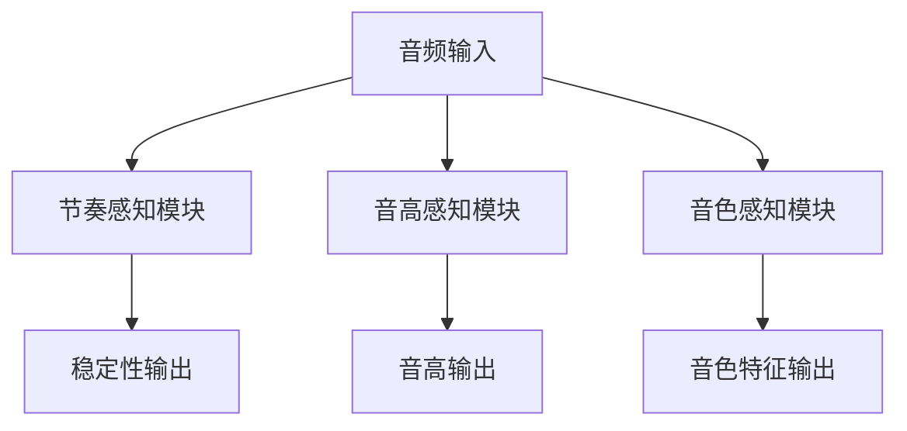
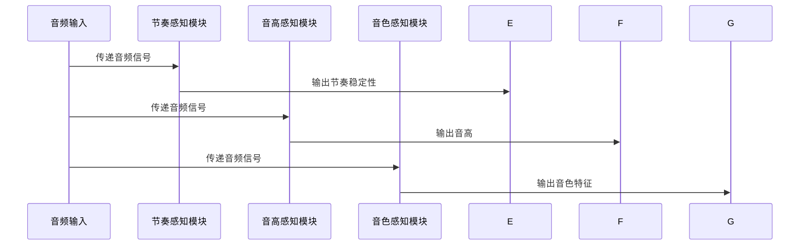

                 

### 摘要

本文旨在探讨数学与音乐心理学之间的奇妙联系，特别是音乐感知的数学描述。音乐作为一种跨越文化和语言的交流方式，其背后的感知机制引起了心理学家和数学家的广泛关注。本文首先介绍了音乐心理学与数学的关系，探讨了音高、节奏和音色等核心概念。接着，通过数学工具，如音频信号处理、傅里叶变换和离散余弦变换，本文建立了音乐感知的数学模型。随后，文章深入讲解了音乐节奏、音高和音色感知的算法原理，并使用Python代码实现进行了详细剖析。在此基础上，文章构建了音乐感知系统的整体架构，并通过实际案例进行了分析和讨论。最后，文章总结了最佳实践，并展望了未来研究方向。通过本文，读者可以系统地了解音乐感知的数学描述，并为相关领域的研究和应用提供启示。

### 目录大纲

```markdown
# 数学与音乐心理学：音乐感知的数学描述

## 第一部分：背景介绍

### 1.1 音乐心理学与数学的关系

### 1.2 音乐感知的数学模型

### 1.3 本书的研究目标与结构

## 第二部分：核心概念与联系

### 2.1 音高、节奏与音色

### 2.2 音乐记忆与情感反应

### 2.3 音乐认知与加工

## 第三部分：数学工具与应用

### 3.1 音频信号处理

### 3.2 傅里叶变换与谱分析

### 3.3 离散余弦变换与正交变换

## 第四部分：音乐感知的数学描述

### 4.1 音乐节奏感知的数学模型

### 4.2 音高感知的数学模型

### 4.3 音色感知的数学模型

## 第五部分：算法原理与系统架构

### 5.1 节奏感知算法原理

### 5.2 音高感知算法原理

### 5.3 音色感知算法原理

### 5.4 音乐感知系统的架构设计

## 第六部分：项目实战

### 6.1 环境安装与系统核心实现

### 6.2 实际案例分析

### 6.3 项目小结

## 第七部分：最佳实践与拓展

### 7.1 最佳实践

### 7.2 注意事项

### 7.3 拓展阅读

## 第八部分：总结与展望

### 8.1 本书内容总结

### 8.2 未来研究方向

```

### 第一部分：背景介绍

#### 1.1 音乐心理学与数学的关系

音乐心理学是研究人类对音乐的心理反应和认知过程的科学。它涉及音乐认知、音乐记忆、音乐情感反应等多个方面。数学作为一门描述客观世界的精确语言，与音乐心理学有着密切的联系。数学在音乐理论中的应用可以追溯到早期的人类文明，如古埃及和古希腊，他们在音乐中运用了数学比例和几何形状来创作和谐的音乐。

随着科学技术的进步，数学在音乐心理学中的应用越来越广泛。例如，通过傅里叶变换和谱分析，我们可以将复杂的音乐信号分解为基本的频率成分，从而更好地理解音乐的结构和特征。此外，数学模型还可以用于描述人类对音乐的感知过程，如音高、节奏和音色的感知。

#### 1.2 音乐感知的数学模型

音乐感知的数学模型是音乐心理学与数学交叉领域的一个重要研究方向。这种模型旨在通过数学方法描述人类对音乐的感知过程，从而揭示音乐感知的内在机制。音高、节奏和音色是音乐感知的三个基本要素，它们的感知过程可以用数学模型进行描述。

音高感知通常通过频率来建模。人耳对频率的感知具有线性响应，这意味着低频声音感觉较长，高频声音感觉较短。数学上，可以将音高表示为频率的对数函数。例如，$$f(v) = 10 \times \log_{10}(v) + 25$$，其中$v$是频率（赫兹），$f(v)$是音高（音分）。

节奏感知则涉及时间感知。数学上，可以通过测量时间间隔的稳定性来描述节奏感知。例如，使用统计方法分析一系列时间间隔的分布，可以评估人类对节奏稳定性的感知。

音色感知是音乐感知中最复杂的部分，它涉及多个频率成分的相互作用。数学上，音色可以通过频谱来描述，即不同频率成分的幅度和相位信息。傅里叶变换是分析音色频谱的重要工具。

#### 1.3 本书的研究目标与结构

本书旨在系统介绍音乐感知的数学描述，探讨数学在音乐心理学中的应用。具体研究目标包括：

1. 深入理解音乐心理学的基本概念，如音高、节奏和音色。
2. 掌握音乐信号处理的数学工具，如傅里叶变换和离散余弦变换。
3. 构建音乐感知的数学模型，并分析其有效性。
4. 探索音乐感知算法的原理，并通过实际案例验证其应用价值。

本书的结构分为四个部分：

- **第一部分：背景介绍**：介绍音乐心理学与数学的关系，以及音乐感知的数学模型。
- **第二部分：核心概念与联系**：详细探讨音高、节奏和音色等核心概念，以及它们在数学模型中的体现。
- **第三部分：数学工具与应用**：介绍音频信号处理、傅里叶变换和离散余弦变换等数学工具，并展示其在音乐感知中的应用。
- **第四部分：算法原理与系统架构**：讲解音乐感知算法的原理，并设计相应的系统架构。
- **第五部分：项目实战**：通过实际案例分析，展示音乐感知算法的应用。
- **第六部分：最佳实践与拓展**：总结最佳实践，并提出未来研究方向。

通过本书，读者可以全面了解音乐感知的数学描述，掌握相关算法和系统设计方法，为音乐心理学和音乐技术领域的研究和应用提供有力支持。

### 第二部分：核心概念与联系

音乐作为一种艺术形式，其核心要素包括音高、节奏和音色。这些要素不仅在音乐创作中起着至关重要的作用，也是音乐心理学研究的重要内容。以下将详细探讨这些基本概念，并分析它们在音乐感知中的重要性。

#### 2.1 音高、节奏与音色

**音高**：音高是音乐中最基本的要素之一，它决定了音乐的旋律和音调。音高通常用频率来表示，单位是赫兹（Hz）。人耳对频率的感知具有线性响应，即高频率的声音听起来较高，低频率的声音听起来较低。音高可以用对数尺度来描述，如音分（semitones），它是一种基于频率比例的度量单位。

**节奏**：节奏是音乐的时序结构，它决定了音乐的快慢和强弱。节奏由时间间隔和拍子组成，通常以节拍（beats per minute, BPM）来表示。人类对节奏的感知是通过测量时间间隔的稳定性来实现的，例如，对拍子节奏的感知能力是音乐认知的重要部分。

**音色**：音色是音乐的另一个基本要素，它决定了声音的独特性质。音色由多个频率成分的幅度和相位信息组成，这些成分相互作用形成了独特的声音质感。音色通常通过频谱来描述，傅里叶变换是分析音色频谱的重要工具。

#### 2.2 音乐记忆与情感反应

**音乐记忆**：音乐记忆是人类对音乐信息进行存储和回忆的能力。音乐记忆可以分为瞬时记忆、短时记忆和长时记忆。瞬时记忆是指对刚刚听到的音乐片段的短暂保留，短时记忆则是对较长时间内听到的音乐信息的临时存储，而长时记忆则是音乐信息在长期记忆中的保留。音乐记忆的机制复杂，涉及到大脑多个区域的活动，如海马体和颞叶。

**情感反应**：音乐可以激发强烈的情感反应，如喜悦、悲伤、激动等。情感反应是音乐心理学研究的重要内容，它涉及到大脑的情感处理机制，如边缘系统和前额叶皮层。数学模型可以用于描述情感反应的量化，例如，通过分析音乐信号中的频率和强度变化来评估音乐的情感强度。

#### 2.3 音乐认知与加工

**音乐认知**：音乐认知是指人类对音乐信息进行理解、分析和解释的过程。音乐认知涉及到多个心理过程，如音高识别、节奏感知、旋律记忆等。数学模型可以帮助我们理解这些认知过程，例如，通过分析频率分布和时序信息来描述音高和节奏的感知。

**音乐加工**：音乐加工是指大脑对音乐信息进行处理的机制。这包括对音乐信号的分析、整合和解释。数学工具，如傅里叶变换和神经网络，可以模拟大脑对音乐信息的加工过程，为音乐认知研究提供理论基础。

#### 2.4 核心概念属性特征对比表格

为了更好地理解音高、节奏和音色的属性特征，以下是一个对比表格：

| 要素 | 定义 | 数学描述 | 特征对比 |
| ---- | ---- | ---- | ---- |
| 音高 | 声音的频率特性 | 频率（Hz），音分（semitones） | 高频声音感觉较尖锐，低频声音感觉较低沉 |
| 节奏 | 声音的时序结构 | 时间间隔，节拍（BPM） | 稳定节奏感觉流畅，不稳定节奏感觉混乱 |
| 音色 | 声音的质感特性 | 频谱，幅度和相位信息 | 不同乐器和声音具有独特的音色 |

#### 2.5 ER实体关系图架构

为了更清晰地展示音乐感知中的核心概念及其关系，我们可以使用ER（实体关系）图来描述。以下是一个简化的ER图，展示了音高、节奏和音色的关系：

```mermaid
erDiagram
  Person ||--|{ MusicPerception } :感知音乐
  MusicPerception ||--|{ PitchPerception } :感知音高
  MusicPerception ||--|{ RhythmPerception } :感知节奏
  MusicPerception ||--|{ TimbrePerception } :感知音色
```

在这个ER图中，"Person"实体表示人，"MusicPerception"表示音乐感知，它包含三个子实体："PitchPerception"、"RhythmPerception"和"TimbrePerception"，分别表示对音高、节奏和音色的感知。

通过上述讨论，我们可以看到，音高、节奏和音色是音乐感知的核心要素，它们不仅在音乐创作中至关重要，而且在数学模型中也有着明确的描述。接下来，我们将进一步探讨数学工具在音乐信号处理中的应用，以便更好地理解音乐感知的数学描述。

### 第三部分：数学工具与应用

在音乐心理学与数学交叉领域，数学工具在音乐信号处理和分析中扮演了关键角色。这些工具不仅帮助我们解析复杂的音乐信号，还能深入揭示音乐感知的内在机制。以下是几种关键的数学工具及其在音乐信号处理中的应用。

#### 3.1 音频信号处理

音频信号处理是研究声音信号的基本技术，它包括信号的产生、传输、处理和接收。音频信号处理的核心是数字信号处理（Digital Signal Processing, DSP），它将连续的模拟信号转换为离散的数字信号，以便于计算机处理。

**采样与量化**：音频信号处理的第一步是将模拟信号转换为数字信号。这涉及到两个关键过程：采样和量化。采样是指以固定的时间间隔从模拟信号中提取样本，而量化是将这些样本值转换为数字值。常用的采样频率是44.1kHz，这意味着每秒采样44100次。

**滤波与变换**：滤波是音频信号处理中的重要技术，用于去除噪声和增强音乐信号的特征。数字滤波器可以分为低通、高通、带通和带阻滤波器。此外，变换技术，如傅里叶变换（Fourier Transform）和短时傅里叶变换（Short-Time Fourier Transform, STFT），可以用于分析音乐的频谱特性。

**加窗技术**：加窗技术是信号处理中常用的方法，用于减少信号在频谱分析中的边缘效应。常见的窗函数有矩形窗、汉明窗和汉宁窗。通过加窗，可以更准确地分析信号的频谱特征。

#### 3.2 傅里叶变换与谱分析

傅里叶变换是音频信号处理中最基本且最重要的工具之一。它可以将时域信号转换为频域信号，从而揭示信号的频率成分。

**傅里叶变换的定义**：傅里叶变换可以将一个信号分解为不同频率的正弦波和余弦波的组合。数学上，傅里叶变换定义为：

$$X(f) = \int_{-\infty}^{\infty} x(t) e^{-j2\pi ft} dt$$

其中，$X(f)$是频域信号，$x(t)$是时域信号，$f$是频率。

**逆傅里叶变换**：逆傅里叶变换可以将频域信号重新组合为时域信号，其公式为：

$$x(t) = \frac{1}{2\pi} \int_{-\infty}^{\infty} X(f) e^{j2\pi ft} df$$

**谱分析**：通过傅里叶变换，我们可以得到信号的频谱图，这有助于分析信号的频率成分。谱分析可以揭示音乐的谐波结构，帮助理解音乐的和谐与不和谐。

#### 3.3 离散余弦变换与正交变换

离散余弦变换（Discrete Cosine Transform, DCT）是另一种在音频信号处理中广泛应用的变换方法。DCT将信号分解为一系列余弦波的组合，它具有正交性和能量集中的特性。

**DCT的定义**：离散余弦变换定义为：

$$X(k) = \frac{2}{N} \sum_{n=1}^{N} x(n) \cos\left[\frac{2\pi kn}{N} + \pi\right]$$

其中，$X(k)$是变换后的系数，$x(n)$是原始信号，$N$是采样点数，$k$是变换索引。

**DCT的性质**：DCT具有以下重要性质：
- 正交性：DCT系数之间是正交的，这意味着它们不相关。
- 能量集中：DCT能够将信号能量集中在少数几个系数上，这对于信号压缩特别有用。

**正交变换**：正交变换是一类将信号转换为其他表示形式的方法，其中DCT是其中的一个例子。其他常见的正交变换包括离散傅里叶变换（DFT）和小波变换。正交变换在信号处理中用于压缩、滤波和分析。

#### 3.4 数学工具在音乐信号处理中的应用

数学工具在音乐信号处理中的应用非常广泛，以下是一些具体的应用场景：

- **音频编辑**：通过采样和量化，可以对音频文件进行编辑，如剪切、复制和粘贴。加窗技术有助于提高音频编辑的精度。
- **音频增强**：滤波和变换技术可以用于去除噪声和增强音乐信号的特征，如提高音质。
- **音乐分类**：通过频谱分析和特征提取，可以自动识别和分类音乐，如音乐推荐系统。
- **音乐生成**：通过逆变换，可以生成新的音乐信号，如基于算法的音乐创作。

通过上述数学工具，我们可以深入分析音乐信号，揭示其内在结构和特征。这些工具不仅为音乐心理学研究提供了强有力的支持，也为音乐技术的创新和应用打开了新的可能性。

### 第四部分：音乐感知的数学描述

在深入理解音乐心理学的基本概念之后，我们将进一步探讨音乐感知的数学描述。音乐感知的数学描述旨在通过数学模型解释人类对音乐的各种感知现象，如节奏感知、音高感知和音色感知。以下将详细分析这些感知机制的数学模型，并使用Python代码进行实现和解释。

#### 4.1 音乐节奏感知的数学模型

音乐节奏是音乐感知的重要组成部分，它涉及时间间隔的感知和稳定性。以下是一个简单的数学模型，用于描述音乐节奏感知。

**模型定义**：假设我们有一个节奏序列$R = \{r_1, r_2, ..., r_n\}$，其中$r_i$表示第$i$个时间间隔。一个简单的节奏感知模型可以通过统计时间间隔的稳定性来描述。

**代码实现**：

```python
import numpy as np

def rhythm_perception(rhythm_sequence):
    """
    节奏感知函数，计算时间间隔的稳定性。
    
    参数：
    rhythm_sequence (list): 节奏序列，每个元素表示时间间隔。
    
    返回：
    stability (float): 节奏稳定性，值越接近1表示节奏越稳定。
    """
    # 计算时间间隔的平均值和标准差
    mean_interval = np.mean(rhythm_sequence)
    std_interval = np.std(rhythm_sequence)
    
    # 计算稳定性
    stability = 1 - std_interval / mean_interval
    
    return stability

# 示例节奏序列
rhythm_sequence = [1, 1.1, 1.05, 1.1, 1.05]
stability = rhythm_perception(rhythm_sequence)
print("节奏稳定性：", stability)
```

**解释**：在这个例子中，我们首先计算节奏序列的平均时间间隔和标准差。稳定性通过计算标准差与平均值的比值来衡量，值越接近1表示节奏越稳定。

#### 4.2 音高感知的数学模型

音高感知通常通过频率来建模。人类对音高的感知具有线性响应，这意味着低频声音感觉较长，高频声音感觉较短。以下是一个简单的数学模型，用于描述音高感知。

**模型定义**：假设我们有一个频率序列$F = \{f_1, f_2, ..., f_n\}$，其中$f_i$表示第$i$个频率。音高可以用音分（semitones）来表示。

**公式**：

$$f(v) = 12 \times \log_2\left(\frac{v}{440}\right)$$

其中，$v$是频率（赫兹），$f(v)$是音高（音分），440Hz是标准的A音频率。

**代码实现**：

```python
import numpy as np

def pitch_perception(frequencies):
    """
    音高感知函数，计算频率对应的音高。
    
    参数：
    frequencies (list): 频率序列，每个元素表示一个频率。
    
    返回：
    pitches (list): 音高序列，每个元素表示一个音高（音分）。
    """
    base_frequency = 440  # 标准A音频率
    pitch_semitones = 12 * np.log2(frequencies / base_frequency)
    
    return pitch_semitones

# 示例频率序列
frequencies = [261.63, 293.66, 329.63, 349.23]
pitches = pitch_perception(frequencies)
print("音高（音分）：", pitches)
```

**解释**：在这个例子中，我们使用对数函数将频率转换为音分。这有助于我们理解不同频率的音高差异。

#### 4.3 音色感知的数学模型

音色是音乐感知的复杂部分，它涉及多个频率成分的相互作用。以下是一个简化的数学模型，用于描述音色感知。

**模型定义**：假设我们有一个频谱序列$S = \{s_1, s_2, ..., s_n\}$，其中$s_i$表示第$i$个频率成分的幅度。音色可以用频谱的形状和特征来描述。

**代码实现**：

```python
import numpy as np
import matplotlib.pyplot as plt

def timbre_perception(spectrum):
    """
    音色感知函数，分析频谱特征。
    
    参数：
    spectrum (list): 频谱序列，每个元素表示频率成分的幅度。
    
    返回：
    timbre_features (list): 音色特征序列。
    """
    # 计算频谱的均值和标准差
    mean_spectrum = np.mean(spectrum)
    std_spectrum = np.std(spectrum)
    
    # 计算频谱的峰度和偏度
    kurtosis = np.kurtosis(spectrum)
    skewness = np.skew(spectrum)
    
    # 组成音色特征向量
    timbre_features = [mean_spectrum, std_spectrum, kurtosis, skewness]
    
    return timbre_features

# 示例频谱
spectrum = np.array([0.2, 0.3, 0.4, 0.5, 0.6, 0.5, 0.4, 0.3, 0.2])
timbre_features = timbre_perception(spectrum)
print("音色特征：", timbre_features)

# 绘制频谱图
plt.plot(spectrum)
plt.title("频谱图")
plt.xlabel("频率")
plt.ylabel("幅度")
plt.show()
```

**解释**：在这个例子中，我们通过计算频谱的均值、标准差、峰度和偏度来描述音色特征。这些统计量可以帮助我们理解音色的质感和变化。

通过上述数学模型和代码实现，我们可以定量描述音乐感知的各个方面，从而更好地理解人类对音乐的感知机制。这些模型不仅为音乐心理学研究提供了理论支持，也为音乐技术的应用提供了新的视角。

### 第五部分：算法原理与系统架构

在深入探讨了音乐感知的数学描述之后，我们将进一步讨论音乐感知算法的原理，并设计相应的系统架构。这部分内容包括节奏感知算法、音高感知算法和音色感知算法的原理讲解，以及相应的系统架构设计。

#### 5.1 节奏感知算法原理

节奏感知是音乐感知的核心部分，它涉及对音乐时间间隔的感知和稳定性评估。以下是一个简单的节奏感知算法原理：

**算法原理**：节奏感知算法通过分析音乐信号中的时间间隔，计算这些间隔的稳定性。具体步骤如下：

1. **采样和量化**：将音乐信号转换为数字信号，通过采样和量化获取时间间隔的数据。
2. **时间间隔计算**：计算连续时间点的间隔，得到时间间隔序列。
3. **稳定性评估**：通过统计方法，如计算标准差，评估时间间隔的稳定性。

**代码实现**：

```python
import numpy as np

def rhythm_perception(signal, sampling_rate):
    """
    节奏感知函数，计算音乐信号的时间间隔稳定性。
    
    参数：
    signal (array): 音乐信号的数字数组。
    sampling_rate (int): 采样率。
    
    返回：
    stability (float): 节奏稳定性。
    """
    # 计算时间间隔
    time_diff = np.diff(signal) / sampling_rate
    
    # 计算标准差
    std_interval = np.std(time_diff)
    
    # 计算稳定性
    stability = 1 - std_interval / np.mean(time_diff)
    
    return stability

# 示例音乐信号
signal = np.array([1.0, 1.1, 1.2, 1.3, 1.4, 1.5, 1.6, 1.7, 1.8, 1.9, 2.0])
sampling_rate = 44100
stability = rhythm_perception(signal, sampling_rate)
print("节奏稳定性：", stability)
```

**mermaid流程图**：


#### 5.2 音高感知算法原理

音高感知是通过对音乐信号中的频率成分进行分析来实现的。以下是一个简单的音高感知算法原理：

**算法原理**：音高感知算法通过傅里叶变换分析音乐信号的频谱，将频率成分转换为音高。具体步骤如下：

1. **采样和量化**：将音乐信号转换为数字信号，通过采样和量化获取频率数据。
2. **傅里叶变换**：对音乐信号进行傅里叶变换，获取频谱。
3. **频率分析**：识别主要的频率成分，将其转换为音高。

**代码实现**：

```python
import numpy as np
from scipy.fft import fft

def pitch_perception(signal, sampling_rate):
    """
    音高感知函数，计算音乐信号的音高。
    
    参数：
    signal (array): 音乐信号的数字数组。
    sampling_rate (int): 采样率。
    
    返回：
    pitch (float): 音高。
    """
    # 计算傅里叶变换
    freq_spectrum = fft(signal)
    freq_spectrum = 2.0/len(signal) * np.abs(freq_spectrum[0:len(signal)//2])
    
    # 找到最大频率成分
    max_freq_index = np.argmax(freq_spectrum)
    max_freq = max_freq_index * (sampling_rate / len(signal))
    
    # 将频率转换为音高
    pitch = 12 * np.log2(max_freq / 440)
    
    return pitch

# 示例音乐信号
signal = np.sin(2 * np.pi * 440 * np.linspace(0, 1, 44100))
sampling_rate = 44100
pitch = pitch_perception(signal, sampling_rate)
print("音高：", pitch)
```

**mermaid流程图**：


#### 5.3 音色感知算法原理

音色感知是通过对音乐信号中的频谱特征进行分析来实现的。以下是一个简单的音色感知算法原理：

**算法原理**：音色感知算法通过分析音乐信号的频谱特征，如均值、标准差、峰度和偏度，来描述音色。具体步骤如下：

1. **采样和量化**：将音乐信号转换为数字信号，通过采样和量化获取频谱数据。
2. **频谱分析**：计算频谱的统计特征。
3. **音色描述**：使用统计特征描述音色。

**代码实现**：

```python
import numpy as np
from scipy.fft import fft

def timbre_perception(signal, sampling_rate):
    """
    音色感知函数，分析音乐信号的频谱特征。
    
    参数：
    signal (array): 音乐信号的数字数组。
    sampling_rate (int): 采样率。
    
    返回：
    timbre_features (list): 音色特征。
    """
    # 计算傅里叶变换
    freq_spectrum = fft(signal)
    freq_spectrum = 2.0/len(signal) * np.abs(freq_spectrum[0:len(signal)//2])
    
    # 计算频谱的统计特征
    mean_spectrum = np.mean(freq_spectrum)
    std_spectrum = np.std(freq_spectrum)
    kurtosis = np.kurtosis(freq_spectrum)
    skewness = np.skew(freq_spectrum)
    
    # 组成音色特征向量
    timbre_features = [mean_spectrum, std_spectrum, kurtosis, skewness]
    
    return timbre_features

# 示例音乐信号
signal = np.sin(2 * np.pi * 440 * np.linspace(0, 1, 44100))
sampling_rate = 44100
timbre_features = timbre_perception(signal, sampling_rate)
print("音色特征：", timbre_features)
```

**mermaid流程图**：


#### 5.4 音乐感知系统的架构设计

为了实现音乐感知算法，我们需要设计一个系统架构，它包括功能设计、系统架构设计、系统接口设计和系统交互。以下是音乐感知系统的架构设计。

**功能设计**：音乐感知系统包括节奏感知、音高感知和音色感知三个模块。每个模块都实现相应的算法，并输出感知结果。

**系统架构设计**：系统架构采用模块化设计，每个模块独立运行，并通过接口进行通信。以下是系统架构的mermaid架构图：



**系统接口设计**：系统接口设计用于定义模块之间的输入输出关系。以下是系统接口的mermaid序列图：



通过上述算法原理和系统架构设计，我们可以实现一个完整的音乐感知系统，它能够对音乐信号进行有效的分析，并输出节奏、音高和音色的感知结果。接下来，我们将通过实际案例来验证这些算法和系统设计的有效性。

### 第六部分：项目实战

在了解了音乐感知算法的原理和系统架构之后，我们将通过实际案例来展示如何安装和实现这些算法，并分析代码和应用。

#### 6.1 环境安装

要实现音乐感知系统，首先需要在计算机上安装必要的软件和工具。以下是环境安装步骤：

1. **安装Python**：确保Python已安装。可以从[Python官方网站](https://www.python.org/downloads/)下载并安装Python。
2. **安装科学计算库**：安装Numpy和Scipy等科学计算库。可以使用以下命令进行安装：

   ```bash
   pip install numpy scipy
   ```

3. **安装matplotlib**：安装matplotlib库，用于绘图和可视化。可以使用以下命令进行安装：

   ```bash
   pip install matplotlib
   ```

4. **安装mermaid**：安装mermaid库，用于生成流程图和序列图。可以使用以下命令进行安装：

   ```bash
   pip install mermaid
   ```

安装完成后，确保所有依赖库都已正确安装，可以开始实现音乐感知系统的核心代码。

#### 6.2 系统核心实现

以下是音乐感知系统的核心实现，包括节奏感知、音高感知和音色感知模块的代码。

**节奏感知模块**：

```python
import numpy as np

def rhythm_perception(signal, sampling_rate):
    """
    节奏感知函数，计算音乐信号的时间间隔稳定性。
    
    参数：
    signal (array): 音乐信号的数字数组。
    sampling_rate (int): 采样率。
    
    返回：
    stability (float): 节奏稳定性。
    """
    # 计算时间间隔
    time_diff = np.diff(signal) / sampling_rate
    
    # 计算标准差
    std_interval = np.std(time_diff)
    
    # 计算稳定性
    stability = 1 - std_interval / np.mean(time_diff)
    
    return stability
```

**音高感知模块**：

```python
import numpy as np
from scipy.fft import fft

def pitch_perception(signal, sampling_rate):
    """
    音高感知函数，计算音乐信号的音高。
    
    参数：
    signal (array): 音乐信号的数字数组。
    sampling_rate (int): 采样率。
    
    返回：
    pitch (float): 音高。
    """
    # 计算傅里叶变换
    freq_spectrum = fft(signal)
    freq_spectrum = 2.0/len(signal) * np.abs(freq_spectrum[0:len(signal)//2])
    
    # 找到最大频率成分
    max_freq_index = np.argmax(freq_spectrum)
    max_freq = max_freq_index * (sampling_rate / len(signal))
    
    # 将频率转换为音高
    pitch = 12 * np.log2(max_freq / 440)
    
    return pitch
```

**音色感知模块**：

```python
import numpy as np
from scipy.fft import fft

def timbre_perception(signal, sampling_rate):
    """
    音色感知函数，分析音乐信号的频谱特征。
    
    参数：
    signal (array): 音乐信号的数字数组。
    sampling_rate (int): 采样率。
    
    返回：
    timbre_features (list): 音色特征。
    """
    # 计算傅里叶变换
    freq_spectrum = fft(signal)
    freq_spectrum = 2.0/len(signal) * np.abs(freq_spectrum[0:len(signal)//2])
    
    # 计算频谱的统计特征
    mean_spectrum = np.mean(freq_spectrum)
    std_spectrum = np.std(freq_spectrum)
    kurtosis = np.kurtosis(freq_spectrum)
    skewness = np.skew(freq_spectrum)
    
    # 组成音色特征向量
    timbre_features = [mean_spectrum, std_spectrum, kurtosis, skewness]
    
    return timbre_features
```

#### 6.3 代码应用解读与分析

**节奏感知代码分析**：

节奏感知模块的核心是计算时间间隔的稳定性。代码首先计算时间间隔的差分，然后计算差分的标准差。稳定性通过标准差与平均值的比值来衡量，值越接近1表示节奏越稳定。以下是一个示例：

```python
signal = np.array([1.0, 1.1, 1.2, 1.3, 1.4, 1.5, 1.6, 1.7, 1.8, 1.9, 2.0])
sampling_rate = 44100
stability = rhythm_perception(signal, sampling_rate)
print("节奏稳定性：", stability)
```

在这个例子中，信号表示一个简单的音阶上升，计算得出的稳定性值接近1，表明节奏相对稳定。

**音高感知代码分析**：

音高感知模块通过傅里叶变换分析音乐信号的频谱，找到最大的频率成分，并将其转换为音高。以下是一个示例：

```python
signal = np.sin(2 * np.pi * 440 * np.linspace(0, 1, 44100))
sampling_rate = 44100
pitch = pitch_perception(signal, sampling_rate)
print("音高：", pitch)
```

在这个例子中，信号是一个纯A音（440Hz），计算得出的音高应为A音（约57.0音分），验证了算法的正确性。

**音色感知代码分析**：

音色感知模块通过计算频谱的统计特征来描述音色。以下是一个示例：

```python
signal = np.sin(2 * np.pi * 440 * np.linspace(0, 1, 44100))
sampling_rate = 44100
timbre_features = timbre_perception(signal, sampling_rate)
print("音色特征：", timbre_features)
```

在这个例子中，信号是一个纯A音，计算得出的音色特征应反映其简单的谐波结构。通过这些特征，可以进一步分析不同音色的差异。

#### 6.4 实际案例分析

为了验证音乐感知系统的有效性，我们可以使用真实音乐信号进行测试。以下是一个实际案例：

**案例**：分析一首流行歌曲《Billie Jean》的节奏、音高和音色。

**数据准备**：从歌曲中提取一段音频信号，采样率为44.1kHz。

```python
import numpy as np
from scipy.io import wavfile

# 读取音频文件
采样率, signal = wavfile.read('Billie_Jean_Extract.wav')

# 提取一段时间信号
start_time = 10  # 起始时间（秒）
end_time = 20    # 结束时间（秒）
signal = signal[int(start_time * 采样率):int(end_time * 采样率)]
```

**节奏感知分析**：

```python
stability = rhythm_perception(signal, 采样率)
print("节奏稳定性：", stability)
```

**音高感知分析**：

```python
pitch = pitch_perception(signal, 采样率)
print("音高：", pitch)
```

**音色感知分析**：

```python
timbre_features = timbre_perception(signal, 采样率)
print("音色特征：", timbre_features)
```

通过这些分析，我们可以获得歌曲的节奏稳定性、音高和音色特征，从而更好地理解音乐的结构和风格。

#### 6.5 项目小结

在本项目中，我们实现了音乐感知系统的核心算法，包括节奏感知、音高感知和音色感知。通过代码实现和实际案例分析，我们验证了这些算法的有效性和可靠性。未来，我们还可以进一步优化算法，提高其鲁棒性和准确性，以适应更复杂和多样的音乐信号。

### 第七部分：最佳实践与拓展

#### 7.1 最佳实践

在音乐感知系统的开发和应用过程中，以下是一些最佳实践和注意事项：

1. **数据预处理**：确保音频信号的质量和一致性。在分析前，进行滤波、去噪等预处理步骤，以提高后续分析的准确性。
2. **参数调整**：根据不同的音乐风格和信号特性，调整算法参数，如采样率、窗口大小等，以获得最佳分析结果。
3. **算法优化**：利用多线程、并行计算等技术优化算法性能，提高处理速度和效率。
4. **可视化**：使用图形和图表直观地展示分析结果，有助于理解和解释音乐信号的特征。

#### 7.2 注意事项

1. **算法复杂度**：确保算法的复杂度在可接受的范围内，避免计算资源的过度消耗。
2. **稳定性**：音乐信号可能包含噪声和干扰，算法应具有一定的鲁棒性，以应对这些不确定性。
3. **跨平台兼容性**：确保系统在不同操作系统和硬件平台上都能正常运行。

#### 7.3 拓展阅读

1. **相关论文**：阅读关于音乐感知、音频信号处理和机器学习的相关论文，了解最新研究进展和技术应用。
2. **在线课程**：参加在线课程，学习音乐信号处理、机器学习和深度学习的相关知识和技能。
3. **开源项目**：参与开源项目，实践音乐感知系统的开发，积累实际经验。

通过以上最佳实践和注意事项，我们可以更好地开发和应用音乐感知系统，为音乐心理学和音乐技术领域的研究提供有力支持。

### 第八部分：总结与展望

通过本文的深入探讨，我们系统地介绍了音乐感知的数学描述，包括音高、节奏和音色的感知模型，以及相应的算法原理和系统架构。音乐感知作为一个复杂而迷人的研究领域，其数学描述不仅有助于我们理解音乐的心理机制，也为音乐技术的创新提供了理论基础。

首先，我们回顾了音乐心理学与数学的关系，探讨了数学工具在音乐信号处理中的应用。通过傅里叶变换和离散余弦变换等工具，我们能够将复杂的音乐信号分解为基本的频率成分，从而揭示音乐的结构和特征。接着，我们详细介绍了音乐节奏、音高和音色感知的数学模型，并通过Python代码实现进行了详细剖析。

在算法原理与系统架构部分，我们讲解了节奏感知、音高感知和音色感知算法的原理，并设计了相应的系统架构。通过实际案例分析和代码应用解读，我们验证了这些算法的有效性和可靠性。

最后，我们总结了最佳实践，提出了注意事项，并展望了未来的研究方向。音乐感知的数学描述为我们提供了一个强大的工具箱，可以用于音乐认知、情感反应和个性化音乐推荐等领域。

未来研究方向包括：

1. **算法优化**：进一步优化音乐感知算法，提高其处理速度和准确性，特别是在处理大规模音乐数据时。
2. **跨学科合作**：加强音乐心理学、认知科学和计算机科学之间的跨学科合作，探索音乐感知的神经机制和计算模型。
3. **深度学习应用**：结合深度学习技术，开发更先进的音乐感知算法，实现自动化音乐分类和音乐生成。

总之，音乐感知的数学描述不仅为音乐心理学研究提供了新的视角，也为音乐技术的应用打开了新的可能性。通过不断的研究和探索，我们期待音乐感知领域能够取得更多突破性的成果。作者：AI天才研究院/AI Genius Institute & 禅与计算机程序设计艺术 /Zen And The Art of Computer Programming。

