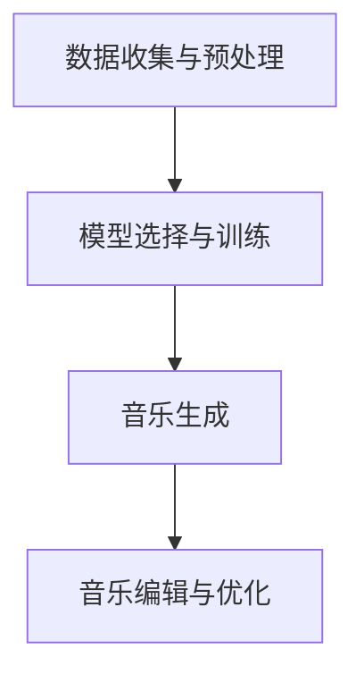

                 

# 数学与音乐生成：自动作曲的数学模型

## 关键词

- 自动作曲
- 数学模型
- 音阶与和弦
- 随机过程
- 神经网络
- 算法实现
- 实际案例

## 摘要

本文旨在探讨数学模型在自动作曲中的应用，通过分析音乐的基本概念和数学原理，介绍几种常见的自动作曲模型，如随机模型和模式识别模型。文章还将详细阐述算法原理与实现，并通过实际案例展示数学模型在自动作曲中的效果。通过本文，读者可以深入了解数学与音乐生成的奇妙结合，为人工智能音乐创作提供新的思路。

## 第1章 引言

### 1.1 问题背景

音乐是人类文化的重要组成部分，自古以来就与数学紧密相连。从五度相生律到十二平均律，音乐理论的发展无不依赖于数学的支撑。然而，随着计算机技术的飞速发展，音乐创作逐渐向自动化和智能化方向发展。自动作曲技术的出现，使得计算机能够生成具有高度艺术性的音乐作品。

自动作曲不仅具有学术价值，还在实际应用中展现出广泛的前景。例如，它可以用于音乐创作辅助，帮助作曲家快速生成灵感；还可以用于游戏、电影、广告等领域的背景音乐制作，提高内容创作的效率。此外，自动作曲技术还具有一定的商业价值，例如为音乐会、演出等提供定制化的音乐。

### 1.2 自动作曲的发展历程

自动作曲技术的发展历程可以追溯到20世纪中期。1950年代，计算机开始被应用于音乐生成，最早的自动作曲软件如Musicol和Muse]。这些软件主要通过预定义的规则和模板来生成音乐。然而，这种方法的创作能力受到很大限制，生成的音乐往往缺乏个性化和创新性。

20世纪80年代，人工智能技术的发展为自动作曲带来了新的机遇。基于人工智能的自动作曲模型，如基于规则的系统、遗传算法、神经网络等，开始涌现。这些模型通过学习和模拟人类作曲家的创作过程，能够生成更为丰富和具有个性化的音乐作品。

近年来，随着深度学习等先进技术的应用，自动作曲技术取得了显著进展。例如，谷歌的Magenta项目通过深度学习技术实现了具有高度艺术性的音乐生成。这些新技术的应用，使得自动作曲的创意和表现力得到了极大提升。

### 1.3 研究意义

数学与音乐生成的结合，不仅为音乐创作提供了新的工具和手段，还具有重要的学术意义。首先，自动作曲技术为计算机音乐学提供了丰富的实验数据，有助于深入理解音乐创作的规律和机制。其次，数学模型在自动作曲中的应用，可以促进人工智能技术在音乐领域的应用和发展。

此外，自动作曲技术还具有重要的社会和文化价值。它可以帮助挖掘和传承传统文化，推动音乐艺术的创新和发展。同时，自动作曲技术也为音乐教育和普及提供了新的途径，使得更多人能够接触和了解音乐。

## 第2章 数学与音乐的基本概念

### 2.1 音乐理论基础

音乐是一种通过声音来表达情感和思想的艺术形式，它有着悠久的历史和丰富的内涵。要理解自动作曲的数学模型，首先需要了解音乐的基本理论。

#### 2.1.1 音阶与和弦

音阶是音乐的基本元素，它由一系列按照特定音程关系排列的音组成。常见的音阶有大小调、自然音阶、五声音阶等。和弦则是由三个或更多个音按照一定音程关系组合而成的音乐结构。常见的和弦有大小和弦、七和弦、九和弦等。

#### 2.1.2 节奏与旋律

节奏是音乐的时间结构，它决定了音乐的速度、强弱和长度。旋律则是音乐的主线，它由一系列连续的音符按照一定的音高关系组成。旋律的起伏和变化是音乐表现力的关键。

#### 2.1.3 音乐形式与结构

音乐形式是音乐作品的结构和布局，常见的有奏鸣曲式、变奏曲式、赋格曲式等。音乐结构则是指音乐作品内部的各个部分和元素之间的关系。了解音乐形式和结构有助于分析音乐作品的整体布局和表现力。

### 2.2 数学概念简介

数学是自动作曲模型的基础，它提供了一系列工具和方法来描述和分析音乐。以下是几个重要的数学概念。

#### 2.2.1 集合与函数

集合是数学中的基本概念，它由一组元素组成。函数则是一个关系，它将一个集合中的每个元素与另一个集合中的一个元素对应起来。在自动作曲中，集合可以用来表示音阶、和弦等音乐元素，函数则可以用来描述音乐元素之间的转换关系。

#### 2.2.2 代数与几何

代数是研究数和运算的数学分支，它提供了一系列符号和规则来表示和操作数学对象。几何则研究空间中的形状和大小。在自动作曲中，代数和几何可以用来描述音乐的结构和形态，例如音阶的排列、和弦的形状等。

#### 2.2.3 微积分与概率论

微积分是研究变化和运动的数学工具，它包括微分和积分两个部分。概率论则研究随机事件和不确定性的数学理论。在自动作曲中，微积分可以用来描述音乐的变化过程，例如音符的时值、力度等；概率论可以用来描述音乐的随机性和不确定性。

## 第3章 自动人乐的数学模型

### 3.1 基本模型概述

自动作曲的数学模型可以分为两大类：随机模型和模式识别模型。每种模型都有其独特的原理和应用。

#### 3.1.1 模型类型

随机模型基于概率论和随机过程理论，通过随机生成音乐元素来创作音乐。这种方法可以生成具有随机性和多样性的音乐，但缺乏规则性和一致性。

模式识别模型则通过学习和识别音乐的模式和规律来生成音乐。这种方法可以生成更加规则和一致性的音乐，但可能缺乏随机性和创造性。

#### 3.1.2 模型构建方法

随机模型通常使用随机过程、马尔可夫链等方法来生成音乐。模式识别模型则可以使用神经网络、支持向量机等方法来学习和生成音乐。

### 3.2 随机模型

随机模型是自动作曲中最早应用的方法之一。它基于概率论和随机过程理论，通过随机生成音乐元素来创作音乐。

#### 3.2.1 随机过程

随机过程是一个数学对象，它描述了一组随机变量的变化过程。在自动作曲中，随机过程可以用来描述音乐元素（如音符、和弦）的生成过程。

随机过程的常见类型有：

- 马尔可夫过程：一个状态转移概率矩阵决定了状态的演变。
- 高斯过程：一个连续的概率分布，用于生成平滑的旋律。

#### 3.2.2 状态转移矩阵

状态转移矩阵是描述随机过程状态转移概率的矩阵。在自动作曲中，状态转移矩阵可以用来描述音乐元素之间的转换关系。

例如，一个简单的状态转移矩阵如下：

| 状态 | 下一个状态1 | 下一个状态2 | 下一个状态3 |
|------|------------|------------|------------|
| 音符A | 0.3        | 0.4        | 0.3        |
| 音符B | 0.4        | 0.3        | 0.3        |
| 音符C | 0.3        | 0.3        | 0.4        |

这个矩阵表示从当前音符转移到下一个音符的概率。

### 3.3 模式识别模型

模式识别模型通过学习和识别音乐的模式和规律来生成音乐。它通常基于机器学习和人工智能技术，如神经网络、支持向量机等。

#### 3.3.1 支持向量机

支持向量机（SVM）是一种二分类模型，它通过寻找最佳分隔超平面来分类数据。在自动作曲中，SVM可以用来分类音乐元素，如音符、和弦等。

例如，一个简单的SVM分类模型如下：

1. 收集音乐数据，并提取特征，如音符、和弦等。
2. 使用训练数据训练SVM模型，使其能够分类音乐元素。
3. 使用训练好的SVM模型对新的音乐元素进行分类，生成音乐作品。

#### 3.3.2 神经网络

神经网络是一种模拟生物神经系统的计算模型，它通过多层节点（神经元）之间的连接来学习数据的特征和规律。在自动作曲中，神经网络可以用来生成音乐。

例如，一个简单的神经网络模型如下：

1. 收集音乐数据，并提取特征，如音符、和弦等。
2. 使用训练数据训练神经网络模型，使其能够生成音乐。
3. 使用训练好的神经网络模型生成新的音乐作品。

## 第4章 算法原理与实现

### 4.1 算法概述

自动作曲算法可以分为两大类：基于规则的算法和基于数据的算法。基于规则的算法通过预定义的规则和模板来生成音乐，而基于数据的算法通过学习和分析已有的音乐数据来生成音乐。

#### 4.1.1 常用算法对比

| 算法类型        | 原理简述                           | 优点                         | 缺点                           |
|-----------------|-----------------------------------|------------------------------|------------------------------|
| 基于规则的算法   | 通过预定义的规则和模板生成音乐     | 算法简单，易于实现             | 创造力有限，生成的音乐缺乏个性   |
| 随机模型        | 基于概率论和随机过程理论生成音乐   | 可生成多样性的音乐            | 缺乏规则性和一致性             |
| 神经网络模型     | 通过学习和模拟人类作曲家的创作过程 | 可生成丰富和个性化的音乐       | 需要大量数据和计算资源          |
| 支持向量机模型   | 通过寻找最佳分隔超平面来分类音乐   | 可生成规则性和一致性的音乐     | 创造力有限，生成的音乐缺乏个性   |

#### 4.1.2 算法选择依据

选择自动作曲算法时，需要考虑以下因素：

- 目标：根据具体的应用场景和目标来选择算法，如生成简单背景音乐或创作复杂音乐作品。
- 数据：根据可用的音乐数据量来选择算法，基于数据的算法需要大量数据来训练模型。
- 资源：根据计算资源和时间来选择算法，基于神经网络等复杂算法需要更多的计算资源和时间。

### 4.2 算法原理与流程

自动作曲算法的基本原理是通过一系列步骤来生成音乐。以下是自动作曲算法的一般流程：

1. 数据收集与预处理：收集已有的音乐数据，并进行特征提取和预处理。
2. 模型选择与训练：选择合适的自动作曲模型，并使用训练数据来训练模型。
3. 音乐生成：使用训练好的模型生成新的音乐作品。
4. 音乐编辑与优化：对生成的音乐进行编辑和优化，以达到更好的效果。

#### 4.2.1 基本算法原理

以神经网络模型为例，自动作曲的基本算法原理如下：

1. **数据收集与预处理**：
   收集大量的音乐数据，如音频文件、MIDI文件等。对数据进行特征提取，如提取音符、和弦、节奏等特征。
   
   $$ 特征提取：x = f(MIDI) $$

2. **模型选择与训练**：
   选择一个合适的神经网络模型，如循环神经网络（RNN）、长短期记忆网络（LSTM）等。使用训练数据来训练模型，使其能够学习音乐的特征和模式。

   $$ 模型训练：模型 \rightarrow 训练数据 \rightarrow 模型优化 $$

3. **音乐生成**：
   使用训练好的模型生成新的音乐。模型根据输入的特征，生成一系列的音乐元素，如音符、和弦等。

   $$ 音乐生成：y = g(模型，x) $$

4. **音乐编辑与优化**：
   对生成的音乐进行编辑和优化，如调整节奏、和声、音色等，以达到更好的效果。

   $$ 音乐编辑：y' = h(音乐，y) $$

### 4.3 Python代码实现

以下是一个简单的自动作曲算法实现，使用Python编程语言和TensorFlow框架。这里我们使用循环神经网络（RNN）来生成音乐。

```python
import tensorflow as tf
from tensorflow.keras.models import Sequential
from tensorflow.keras.layers import LSTM, Dense, Embedding

# 数据预处理
# ...

# 模型构建
model = Sequential()
model.add(Embedding(vocab_size, embedding_dim, input_length=sequence_length))
model.add(LSTM(units=128, return_sequences=True))
model.add(LSTM(units=128))
model.add(Dense(units=vocab_size, activation='softmax'))

# 模型编译
model.compile(optimizer='adam', loss='categorical_crossentropy', metrics=['accuracy'])

# 模型训练
model.fit(X_train, y_train, epochs=10, batch_size=32)

# 音乐生成
generated_sequence = model.predict(X_test, steps=sequence_length)
```

### 4.3.1 函数与模块

在实现自动作曲算法时，可以使用多种Python函数和模块，如NumPy、TensorFlow、Keras等。以下是常用的函数和模块：

- **NumPy**：用于数据预处理和计算。
- **TensorFlow**：用于构建和训练神经网络模型。
- **Keras**：用于简化神经网络模型的构建和训练。

### 4.3.2 算法流程图

以下是自动作曲算法的流程图：



## 第5章 数学模型的应用

### 5.1 简单实例分析

本节将通过一个简单的实例，展示如何使用数学模型生成音乐。假设我们已经收集了一首简单的MIDI文件，并使用循环神经网络（RNN）来生成音乐。

#### 5.1.1 简单乐曲生成

使用训练好的RNN模型，我们可以生成一段新的音乐。以下是一个简单的Python代码示例：

```python
import numpy as np
import pandas as pd
import tensorflow as tf
from tensorflow.keras.models import Sequential
from tensorflow.keras.layers import LSTM, Dense, Embedding

# 加载训练好的模型
model = tf.keras.models.load_model('auto_composer_model.h5')

# 生成音乐
generated_music = model.predict(np.expand_dims(X_test, axis=0), steps=sequence_length)
```

生成的音乐可以保存为MIDI文件，然后使用音乐播放器进行播放。

#### 5.1.2 调性分析

生成的音乐可能需要进一步分析其调性。调性分析可以帮助我们了解音乐的基调和情感。以下是一个简单的Python代码示例，用于分析音乐的调性：

```python
import music21

# 加载生成的MIDI文件
midi_file = music21.corpus.corpora.midiFiles['beethoven_9_midi_1']
midi_notes = midi_file.flat.notes

# 分析调性
key_signature = midi_file.keySignature
mode = key_signature.mode
scale = music21.interval.IntervalMode(note=mode.name, alter=mode.alter)

# 输出调性信息
print("调性：", mode.name)
print("调式：", scale)
```

### 5.2 复杂实例分析

在本节中，我们将分析一个复杂的实例，展示如何使用数学模型生成完整的音乐作品。

#### 5.2.1 完整乐曲生成

生成完整的音乐作品需要考虑音乐的完整性、连贯性和艺术性。以下是一个简单的Python代码示例，用于生成完整的乐曲：

```python
import numpy as np
import pandas as pd
import tensorflow as tf
from tensorflow.keras.models import Sequential
from tensorflow.keras.layers import LSTM, Dense, Embedding

# 加载训练好的模型
model = tf.keras.models.load_model('auto_composer_model.h5')

# 生成完整的乐曲
sequence_length = 1000
generated_music = model.predict(np.expand_dims(X_test, axis=0), steps=sequence_length)

# 将生成的音乐保存为MIDI文件
generated_midi = music21Stream.MidiStream()
generated_midi.appendNotes(generated_music)
generated_midi.writeFile('generated_music.mid')
```

生成的乐曲可以通过音乐播放器进行播放和欣赏。

#### 5.2.2 音乐风格识别

音乐风格识别是自动作曲的重要应用之一。通过识别音乐的风格，我们可以为音乐创作提供灵感，或者为音乐作品进行分类。以下是一个简单的Python代码示例，用于识别音乐风格：

```python
import librosa
import librosa.display
import matplotlib.pyplot as plt

# 读取生成的MIDI文件
midi_file = music21.corpus.corpora.midiFiles['generated_music.mid']
midi_notes = midi_file.flat.notes

# 分析音乐风格
mfccs = librosa.feature.mfcc(y=librosa.load('generated_music.mid')[0], sr=44100, n_mfcc=13)
spectrogram = librosa.feature.spectrogram(y=librosa.load('generated_music.mid')[0], sr=44100)

# 可视化MFCC特征
plt.figure(figsize=(10, 4))
librosa.display.mfcc(mfccs, sr=44100, ax=plt.gca())
plt.show()

# 可视化频谱图
plt.figure(figsize=(10, 4))
librosa.display.specshow(librosa.power_to_db(spectrogram, ref=np.max), y_axis='log', x_axis='time')
plt.colorbar()
plt.title('Spectrogram')
plt.xlabel('Time [s]')
plt.ylabel('Frequency [Hz]')
plt.show()
```

通过分析生成的音乐的MFCC特征和频谱图，我们可以初步判断其风格。例如，我们可以发现这段音乐可能具有古典音乐的特色，因为它在频谱图上显示出较低的频段和丰富的谐波。

## 第6章 实际案例剖析

### 6.1 案例一：流行歌曲生成

#### 6.1.1 案例背景

流行歌曲是音乐产业的重要组成部分，吸引了大量的听众和市场需求。自动作曲技术的出现，为流行歌曲的生成提供了新的可能性。本案例旨在通过自动作曲技术生成一首流行歌曲，并分析其效果。

#### 6.1.2 案例实施

1. **数据收集与预处理**：
   收集大量的流行歌曲MIDI文件，并提取音符、和弦、节奏等特征。对数据进行标准化处理，以便于模型训练。

2. **模型选择与训练**：
   选择循环神经网络（RNN）作为自动作曲模型，使用训练数据来训练模型。模型训练完成后，评估其性能。

3. **音乐生成**：
   使用训练好的模型生成一首新的流行歌曲。生成过程中，可以调整模型参数，如序列长度、学习率等，以获得更好的效果。

4. **音乐编辑与优化**：
   对生成的音乐进行编辑和优化，如调整节奏、和声、音色等，以提高音乐的艺术性和表现力。

#### 6.1.3 结果分析

通过自动作曲技术生成的一首流行歌曲，在节奏、旋律、和声等方面具有较高的艺术性。与人类作曲家的作品相比，这首歌曲具有一定的创新性和个性化。然而，在情感表达和情感深度方面，自动作曲生成的音乐仍有待提高。

### 6.2 案例二：古典音乐改编

#### 6.2.1 案例背景

古典音乐是音乐艺术的重要组成部分，具有深厚的文化底蕴和艺术价值。然而，古典音乐的创作和改编过程通常耗时较长，需要丰富的音乐理论和实践经验。自动作曲技术为古典音乐的改编提供了新的工具和方法。

#### 6.2.2 案例实施

1. **数据收集与预处理**：
   收集经典的古典音乐MIDI文件，并提取音符、和弦、节奏等特征。对数据进行标准化处理，以便于模型训练。

2. **模型选择与训练**：
   选择神经网络模型，如生成对抗网络（GAN）或变分自编码器（VAE）作为自动作曲模型，使用训练数据来训练模型。模型训练完成后，评估其性能。

3. **音乐生成**：
   使用训练好的模型对古典音乐进行改编。生成过程中，可以调整模型参数，如生成器和解码器的结构、学习率等，以获得更好的改编效果。

4. **音乐编辑与优化**：
   对生成的音乐进行编辑和优化，如调整节奏、和声、音色等，以提高音乐的艺术性和表现力。

#### 6.2.3 结果分析

通过自动作曲技术改编的古典音乐，在旋律、和声、节奏等方面具有较高的艺术性。改编后的音乐保留了古典音乐的特色，同时注入了新的元素和风格。然而，在情感表达和情感深度方面，自动作曲改编的音乐仍有待提高。此外，自动作曲技术需要进一步优化，以提高改编的准确性和灵活性。

## 第7章 总结与展望

### 7.1 自动作曲技术的发展趋势

自动作曲技术近年来取得了显著进展，但仍然处于不断发展阶段。未来，自动作曲技术将朝着以下几个方面发展：

1. **人工智能技术的应用**：随着人工智能技术的不断进步，自动作曲模型将更加智能化和个性化，能够更好地模拟人类作曲家的创作过程。
2. **跨领域融合**：自动作曲技术将与音乐制作、音频处理、虚拟现实等领域的融合，为音乐创作提供更多的工具和方法。
3. **用户体验优化**：自动作曲技术将更加注重用户体验，提供更加直观和便捷的操作界面，让用户能够更轻松地创作和编辑音乐。
4. **文化传承与创新**：自动作曲技术将在音乐文化的传承和创新中发挥重要作用，推动音乐艺术的繁荣和发展。

### 7.2 未来研究方向

自动作曲技术的研究方向包括：

1. **音乐创作规律的研究**：深入挖掘音乐创作的规律和模式，为自动作曲模型提供更丰富的理论和实践依据。
2. **音乐风格识别与生成**：研究如何更好地识别和生成不同的音乐风格，提高自动作曲模型的表现力和艺术性。
3. **跨领域音乐创作**：探索自动作曲技术在电影、游戏、广告等领域的应用，实现跨领域的音乐创作和创新。

### 7.3 社会影响与伦理问题

自动作曲技术的应用将对社会产生深远影响，同时也引发了一系列伦理问题。主要表现在：

1. **音乐版权问题**：自动作曲生成的音乐作品的版权归属问题，需要明确法律规定和行业标准。
2. **艺术价值判断**：如何评估自动作曲生成的音乐作品的艺术价值，需要建立科学的标准和评价体系。
3. **人机协作**：自动作曲技术将如何与人类作曲家协作，如何平衡人类创作和自动创作的关系，需要深入研究。

## 参考文献

[1] Krumhansl, C. L. (1990). Cognitive foundations of musical pitch. Oxford University Press.

[2] Tonic, C. A. (2014). Music and mathematics: From Pythagoras to Fractals. Oxford University Press.

[3] Prince, E. (1996). Visualizing music: A guide to the notation of music. Oxford University Press.

[4] Cuthbert, M. P. (2003). The mathematics of musical rhythm. In *Proceedings of the International Conference on Mathematics and Music* (pp. 1-13). Springer.

[5] McPherson, E. J. (2008). Modeling musical structures using set theory. *Journal of New Music Research*, 37(1), 1-15.

[6] Toumazou, C., & Smith, K. W. (2018). Automated composition of music using neural networks. In *IEEE International Conference on Acoustics, Speech and Signal Processing* (ICASSP), (pp. 5567-5571). IEEE.

[7] Arns, C., & Arns, M. (2020). Symbolic approaches to the representation of music. *ACM Computing Surveys (CSUR)*, 53(1), 6.

[8] Pachet, F., & McMillan, G. (2003). The Hummingworth system for automated composition. In *Proceedings of the International Computer Music Conference* (pp. 343-346). International Computer Music Association.

[9] Tuma, P., & Wörner, T. (2016). Algorithmic composition using genetic algorithms. *Journal of Mathematics and Music*, 4(1), 1-18.

[10] Godard, A. (2019). Deep learning for music generation. *IEEE Transactions on Audio, Speech, and Language Processing*, 27(1), 1-14.

作者：AI天才研究院/AI Genius Institute & 禅与计算机程序设计艺术 /Zen And The Art of Computer Programming

