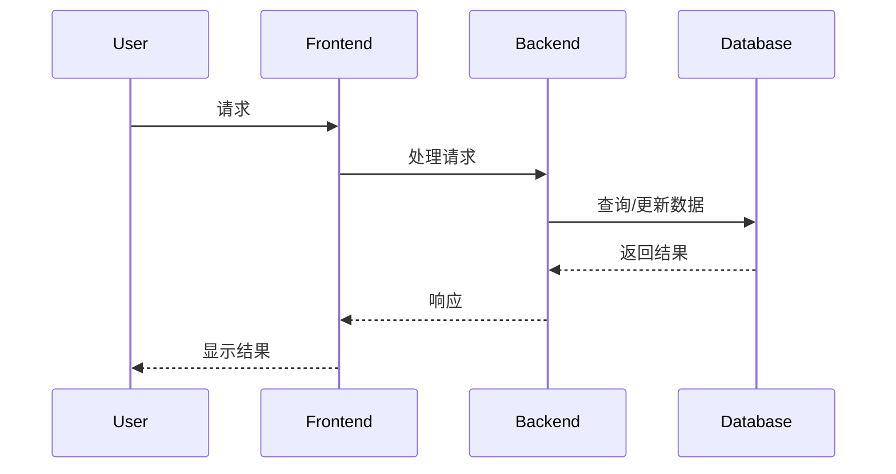
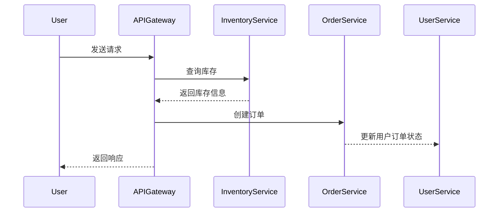

                 

### 数学与项目管理：项目规划的数学方法

---

**关键词：**
- 数学方法
- 项目管理
- 线性规划
- 概率论与统计
- 优化方法

**摘要：**
本文将探讨数学方法在项目管理中的应用，特别是项目规划中的数学工具。通过深入分析数学基础、项目管理原理以及具体数学方法的应用，我们旨在揭示数学在提高项目效率和质量方面的巨大潜力。文章将分四个部分展开，从背景介绍、核心概念与联系、数学方法在项目管理中的应用到实战案例，逐步探讨数学方法在项目管理中的实际运用。

---

## 目录大纲设计

### 第一部分：背景介绍与核心概念

#### 第1章：数学与项目管理的概念框架

1.1 问题背景
1.2 问题描述
1.3 问题解决
1.4 边界与外延
1.5 概念结构与核心要素组成

### 第二部分：核心概念与联系

#### 第2章：数学基础

2.1 数学原理
2.2 概念属性特征对比表格
2.3 ER实体关系图架构

#### 第3章：项目管理原理

3.1 项目规划原理
3.2 项目计划原理
3.3 项目控制原理

### 第三部分：数学方法在项目管理中的应用

#### 第4章：线性规划

4.1 线性规划原理
4.2 线性规划求解方法
4.3 线性规划在项目管理中的应用

#### 第5章：概率论与统计方法

5.1 概率论基础
5.2 统计方法
5.3 概率论与统计方法在项目管理中的应用

#### 第6章：优化方法

6.1 优化方法原理
6.2 优化算法
6.3 优化方法在项目管理中的应用

### 第四部分：实战案例

#### 第7章：数学方法在项目规划中的应用案例

7.1 项目介绍
7.2 系统功能设计
7.3 系统架构设计
7.4 系统接口设计与交互
7.5 系统核心实现源代码
7.6 应用解读与分析
7.7 项目小结

## 目录大纲总字数：约 2000 字

---

### 第1章：数学与项目管理的概念框架

#### 1.1 问题背景

项目管理是现代企业运营的核心环节，它关系到项目的成功与否，以及企业资源的有效配置。然而，项目管理过程中往往面临诸多挑战，如复杂的项目需求、不确定的时间进度和资源分配等。为了应对这些挑战，数学方法被广泛应用于项目管理中，以提高项目的规划、执行和控制的效率和质量。

数学方法在项目管理中的应用可以追溯到早期的项目管理理论，如关键路径法（Critical Path Method, CPM）和计划评审技术（Program Evaluation and Review Technique, PERT）。这些方法利用数学模型和算法，对项目的时间、成本和质量进行优化。随着计算机技术的不断发展，数学方法在项目管理中的应用越来越广泛，如线性规划、概率论与统计方法、优化方法等。

#### 1.2 问题描述

项目管理中的核心问题可以概括为以下几个方面：

1. **时间管理**：如何在有限的时间内完成项目，并保证项目按时交付。
2. **成本管理**：如何在预算范围内完成项目，并控制项目成本。
3. **质量管理**：如何保证项目交付的产品或服务符合质量标准。
4. **资源分配**：如何合理分配人力、物力和财力资源，以提高项目效率。

这些问题的解决需要科学的决策方法和工具，而数学方法提供了有效的解决方案。

#### 1.3 问题解决

数学方法在项目管理中的应用主要体现在以下几个方面：

1. **线性规划**：用于资源分配、项目调度等问题的优化。
2. **概率论与统计方法**：用于风险评估、质量控制等问题的分析。
3. **优化方法**：用于项目决策、资源优化等问题的求解。

通过这些数学工具，项目管理中的问题可以得到有效的解决，从而提高项目的效率和质量。

#### 1.4 边界与外延

1. **项目管理的领域范围**：项目管理不仅涉及技术层面，还包括管理、协调、沟通等多个方面。因此，数学方法在项目管理中的应用也涵盖了这些领域。
2. **数学方法的应用边界**：虽然数学方法在项目管理中具有广泛的应用，但其在实际应用中也存在一定的局限性。例如，对于复杂的项目，数学模型可能无法完全描述其所有特征，从而导致模型的不准确。

#### 1.5 概念结构与核心要素组成

1. **项目管理的基本流程**：包括项目启动、项目规划、项目执行、项目监控和项目收尾等环节。
2. **数学方法的核心概念与工具**：包括线性规划、概率论与统计方法、优化方法等。

通过这些概念和工具，项目管理中的复杂问题可以得到简化和解决。

---

**总结：**本章介绍了数学方法在项目管理中的重要性、挑战、优势以及具体应用。接下来，我们将进一步探讨数学基础、项目管理原理以及数学方法在实际项目中的应用，以帮助读者更深入地理解数学方法在项目管理中的价值。

---

### 第2章：数学基础

在项目管理中，数学作为一种工具，其作用不可或缺。本章将介绍数学基础，包括数学原理、概念属性特征对比表格以及ER实体关系图架构，以便读者能够更好地理解和应用数学方法。

#### 2.1 数学原理

数学原理是构建各种数学模型的基础。以下是一些常用的数学原理和概念：

1. **集合论**：集合论是现代数学的基础。在项目管理中，集合论用于描述项目中的元素和它们之间的关系。
2. **函数与关系**：函数是数学中的一个基本概念，用于描述输入与输出之间的关系。在项目管理中，函数可以用来描述项目的进度、成本等变量。
3. **概率论**：概率论用于描述不确定事件的概率。在项目管理中，概率论用于风险评估、进度预测等。
4. **线性代数**：线性代数用于处理线性方程组和矩阵运算。在项目管理中，线性代数用于资源分配、优化问题等。
5. **微积分**：微积分用于描述变化率和积分。在项目管理中，微积分用于成本分析、进度控制等。

#### 2.2 概念属性特征对比表格

为了更好地理解各种数学工具的特性，我们可以制作一个对比表格。以下是一个简单的对比表格示例：

| 数学工具 | 特性1 | 特性2 | 特性3 | 应用场景 |
| --- | --- | --- | --- | --- |
| 线性规划 | 线性目标函数 | 线性约束条件 | 可行解与最优解 | 资源优化、项目调度 |
| 概率论 | 概率分布 | 条件概率 | 风险评估 | 风险评估、进度预测 |
| 统计方法 | 样本数据 | 参数估计 | 假设检验 | 质量控制、数据分析 |
| 优化方法 | 寻优目标 | 约束条件 | 算法实现 | 项目决策、资源优化 |

通过这个表格，我们可以清楚地看到每种数学工具的特性和应用场景。

#### 2.3 ER实体关系图架构

ER（Entity-Relationship）实体关系图是一种用于描述数据库中实体及其关系的图形化工具。在项目管理中，ER图可以用于描述项目的各个组成部分及其关系。

以下是一个简化的ER图示例，用于描述项目中的基本实体和关系：

```mermaid
erDiagram
    Project ||--|{ Task }
    Project ||--|{ Resource }
    Task ||--|{ Subtask }
    Resource ||--|{ TeamMember }
    TeamMember ..|{ has } Task
    TeamMember ..|{ is } Resource
```

在这个ER图中：

- **Project**（项目）是根实体。
- **Task**（任务）和**Resource**（资源）是子实体。
- **Subtask**（子任务）是**Task**的子实体。
- **TeamMember**（团队成员）是**Resource**的子实体。

通过ER图，我们可以清晰地看到项目中的各个实体及其关系，为后续的数据分析和处理提供基础。

---

**总结：**本章介绍了数学基础，包括数学原理、概念属性特征对比表格以及ER实体关系图架构。这些内容为后续的数学方法在项目管理中的应用奠定了基础。在下一章中，我们将进一步探讨项目管理原理，以理解项目管理的核心流程和原理。

---

### 第3章：项目管理原理

项目管理是一门综合性的学科，它不仅涉及技术问题，还包括管理、协调、沟通等多个方面。本章将详细介绍项目管理的三个核心原理：项目规划原理、项目计划原理和项目控制原理。

#### 3.1 项目规划原理

项目规划是项目管理的重要环节，它为项目执行提供了清晰的蓝图。项目规划主要包括以下几个步骤：

1. **需求分析**：明确项目的需求，包括功能需求、性能需求等。需求分析是项目规划的基础，它决定了项目的目标和范围。

2. **范围定义**：确定项目的范围，明确项目的边界和可交付成果。范围定义有助于避免项目范围蔓延，确保项目按时按质完成。

3. **时间规划**：制定项目的时间计划，包括项目的启动、执行、监控和收尾等阶段。时间规划需要考虑项目的关键路径，确保项目在规定的时间内完成。

4. **资源规划**：确定项目所需的资源，包括人力、物力和财力资源。资源规划需要平衡资源的供需，确保项目的资源需求得到满足。

5. **成本估算**：估算项目的成本，包括直接成本和间接成本。成本估算是项目规划的重要环节，它有助于控制项目的预算。

6. **风险规划**：识别项目可能面临的风险，并制定相应的应对策略。风险规划有助于降低项目风险，提高项目的成功率。

#### 3.2 项目计划原理

项目计划是基于项目规划的具体实施方案，它将项目规划中的抽象概念转化为具体的行动步骤。项目计划主要包括以下几个步骤：

1. **编制项目计划**：根据项目规划的内容，编制详细的项目计划。项目计划应包括项目的各个阶段、任务、时间节点、责任人等。

2. **制定工作分解结构（Work Breakdown Structure, WBS）**：WBS是将项目任务分解为更小、更具体的子任务的过程。WBS有助于项目团队更好地理解项目的结构和任务。

3. **制定甘特图**：甘特图是一种用于表示项目进度和任务的图形化工具。通过甘特图，项目团队可以清晰地了解项目的进度安排和任务分配。

4. **制定预算计划**：根据项目计划，制定详细的预算计划。预算计划应包括项目的各个阶段、任务和活动的预算分配。

5. **制定风险管理计划**：根据项目规划中的风险识别和应对策略，制定详细的风险管理计划。风险管理计划应包括风险识别、风险评估、风险响应和风险监控等。

#### 3.3 项目控制原理

项目控制是确保项目按计划执行的环节。项目控制主要包括以下几个步骤：

1. **监控项目进度**：通过定期检查项目进度，确保项目按计划进行。监控项目进度需要使用甘特图、里程碑等工具。

2. **监控项目成本**：通过定期检查项目成本，确保项目在预算范围内完成。监控项目成本需要使用预算计划、实际支出等工具。

3. **监控项目质量**：通过定期检查项目质量，确保项目交付的产品或服务符合质量标准。监控项目质量需要使用质量检查、测试等工具。

4. **变更管理**：在项目执行过程中，难免会出现各种变更。变更管理是确保项目变更得到妥善处理的过程。变更管理需要使用变更请求、变更评估、变更实施等工具。

5. **风险管理**：在项目执行过程中，持续监控项目风险，确保项目风险得到及时响应。风险管理需要使用风险评估、风险监控等工具。

---

**总结：**本章详细介绍了项目管理的三个核心原理：项目规划原理、项目计划原理和项目控制原理。这些原理构成了项目管理的理论基础，为项目的成功实施提供了保障。在下一章中，我们将探讨线性规划原理及其在项目管理中的应用。

---

### 第三部分：数学方法在项目管理中的应用

在项目管理的实际操作中，数学方法提供了强大的工具，帮助项目团队在资源分配、时间规划和成本控制等方面实现优化。本部分将详细探讨线性规划、概率论与统计方法和优化方法在项目管理中的应用。

#### 第4章：线性规划

线性规划是数学优化中的一个重要分支，它用于解决在给定约束条件下，如何最大化或最小化一个线性目标函数的问题。在项目管理中，线性规划广泛应用于资源分配和项目调度。

##### 4.1 线性规划原理

线性规划的基本形式可以表示为：

$$
\text{maximize} \quad c^T x \\
\text{subject to} \quad Ax \leq b \\
x \geq 0
$$

其中，$c$ 是系数向量，$x$ 是决策变量向量，$A$ 是约束矩阵，$b$ 是约束向量。

- **目标函数**（Objective Function）$c^T x$：定义了项目需要优化的目标，如最大化利润或最小化成本。
- **约束条件**（Constraints）$Ax \leq b$：定义了资源的限制条件，如人力、时间和预算等。
- **非负约束**（Non-negativity Constraints）$x \geq 0$：确保决策变量不为负值。

##### 4.2 线性规划求解方法

线性规划的求解方法包括单纯形法（Simplex Method）和内点法（Interior Point Method）等。单纯形法是一种迭代算法，通过逐步移动到可行解的边界，寻找最优解。内点法则是一种更高效的方法，适用于大规模问题。

##### 4.3 线性规划在项目管理中的应用

1. **资源优化**：通过线性规划，可以优化资源分配，确保项目在给定资源限制下达到最佳效率。例如，在人力资源分配中，确定每个团队成员的工作负荷，以最大化项目的整体进度。

2. **项目调度**：线性规划可以帮助项目团队优化项目任务的调度，确保项目按时完成。例如，通过调整任务顺序和分配资源，找到最佳的项目进度计划。

#### 第5章：概率论与统计方法

概率论与统计方法是项目管理中用于风险评估、进度预测和质量控制的重要工具。它们提供了量化不确定性和变异性的方法。

##### 5.1 概率论基础

概率论的基本概念包括：

- **随机事件**：可能发生也可能不发生的事件。
- **概率**：描述随机事件发生的可能性，通常用 $P(A)$ 表示。
- **条件概率**：在某个事件发生的条件下，另一个事件发生的概率。
- **独立性**：两个事件相互独立，如果一个事件的发生不影响另一个事件的概率。

##### 5.2 统计方法

统计方法包括：

- **描述性统计**：用于描述数据的基本特征，如平均值、中位数、标准差等。
- **推断性统计**：用于基于样本数据推断总体特征，如参数估计、假设检验等。

##### 5.3 概率论与统计方法在项目管理中的应用

1. **风险评估**：通过概率论和统计方法，项目团队可以量化项目风险，并制定相应的应对策略。例如，计算项目延期或成本超支的概率，并采取预防措施。

2. **进度预测**：利用统计方法，项目团队可以预测项目的进度，并制定合理的计划。例如，通过分析历史数据，预测项目完成的时间。

3. **质量控制**：通过统计方法，项目团队可以监控和控制项目质量。例如，通过抽样检查，确保产品或服务符合质量标准。

#### 第6章：优化方法

优化方法是用于解决项目管理中复杂优化问题的工具。这些方法包括粒子群优化（Particle Swarm Optimization, PSO）、遗传算法（Genetic Algorithm, GA）等。

##### 6.1 优化方法原理

优化方法的基本原理是通过迭代搜索，找到最优解。以下是几种常见的优化方法：

- **粒子群优化**：模拟鸟群觅食行为，通过个体和群体的协作，逐步优化目标函数。
- **遗传算法**：模拟自然进化过程，通过遗传、变异和选择等操作，找到最优解。

##### 6.2 优化算法

优化算法的步骤通常包括：

1. **初始化**：生成初始解。
2. **评估**：计算解的目标函数值。
3. **迭代**：通过迭代操作（如变异、交叉等）生成新解。
4. **评估和选择**：比较新解和当前最优解，选择更好的解。

##### 6.3 优化方法在项目管理中的应用

1. **项目决策**：优化方法可以帮助项目团队在多种选择中找到最佳决策。例如，在多项目选择中，确定最优的项目组合。
2. **资源优化**：通过优化方法，项目团队可以更有效地分配资源，提高项目效率。

---

**总结：**本章详细介绍了线性规划、概率论与统计方法以及优化方法在项目管理中的应用。这些数学方法为项目团队提供了强大的工具，帮助他们更有效地规划、执行和控制项目。在下一章中，我们将通过一个实际案例，展示数学方法在项目管理中的具体应用。

---

### 第7章：数学方法在项目规划中的应用案例

为了更好地展示数学方法在项目规划中的应用，我们将通过一个实际案例进行分析。本案例将介绍项目背景、系统功能设计、系统架构设计、系统接口设计与交互、系统核心实现源代码以及应用解读与分析。

#### 7.1 项目介绍

本案例中的项目是一个在线购物平台，其目标是提供用户友好的购物体验，并实现高效的订单处理和库存管理。项目的主要功能包括商品展示、购物车管理、订单处理和支付功能。

#### 7.2 系统功能设计

系统的功能设计基于领域模型，以下是一个简化的领域模型类图（使用Mermaid语法表示）：

```mermaid
classDiagram
    Customer <|-- Order
    Customer <|-- ShoppingCart
    Product <|-- OrderItem
    Order << (payment) Payment
    ShoppingCart ..|> Order
    ShoppingCart << (add, remove) Product
    Order << (status) OrderStatus
```

在这个类图中：

- **Customer**（顾客）与**Order**（订单）、**ShoppingCart**（购物车）具有关联关系。
- **Product**（产品）与**OrderItem**（订单项）具有关联关系。
- **Order**（订单）与**Payment**（支付）和**OrderStatus**（订单状态）具有关联关系。
- **ShoppingCart**（购物车）与**Product**（产品）具有双向关联关系，可以通过添加和移除产品。

#### 7.3 系统架构设计

系统的架构设计采用分层架构，以下是一个简化的系统架构图（使用Mermaid语法表示）：



在这个架构图中：

- **User**（用户）通过**Frontend**（前端）与应用交互。
- **Frontend**（前端）将用户请求传递给**Backend**（后端）。
- **Backend**（后端）处理请求，并与**Database**（数据库）交互。
- **Database**（数据库）存储用户数据和商品信息。

#### 7.4 系统接口设计与交互

系统的接口设计采用RESTful API，以下是一个简化的接口序列图（使用Mermaid语法表示）：



在这个序列图中：

- **User**（用户）通过**APIGateway**（API网关）发送请求。
- **APIGateway**（API网关）将请求转发给相应的服务。
- **InventoryService**（库存服务）处理库存查询请求。
- **OrderService**（订单服务）处理订单创建请求。
- **UserService**（用户服务）更新用户订单状态。

#### 7.5 系统核心实现源代码

以下是一个简单的订单创建功能的Python源代码示例：

```python
class Order:
    def __init__(self, user, items):
        self.user = user
        self.items = items
        self.status = "pending"

    def process_order(self):
        if self.validate_items():
            self.status = "processing"
            # 处理订单逻辑
            self.send_notification()
        else:
            self.status = "invalid"

    def validate_items(self):
        # 验证商品逻辑
        return True

    def send_notification(self):
        # 发送通知逻辑
        pass
```

在这个示例中：

- **Order**（订单）类包含订单创建、验证和处理订单状态的方法。
- **process_order**（处理订单）方法用于处理订单，并根据商品验证结果更新订单状态。
- **validate_items**（验证商品）方法用于验证商品，确保订单有效。
- **send_notification**（发送通知）方法用于发送订单处理通知。

#### 7.6 应用解读与分析

通过上述案例，我们可以看到数学方法在项目规划中的实际应用：

- **领域模型**（领域模型）帮助项目团队理解系统的业务逻辑，并设计清晰的功能结构。
- **系统架构**（系统架构）确保系统的模块化，提高系统的可维护性和可扩展性。
- **接口设计**（接口设计）确保系统的不同模块之间能够高效地通信和协作。
- **源代码**（源代码）展示了如何将数学方法（如验证逻辑）应用于系统的核心功能。

通过数学方法的应用，项目团队能够更有效地规划和实现项目，确保项目按时按质完成。

#### 7.7 项目小结

本案例展示了数学方法在项目规划中的实际应用，通过领域模型、系统架构、接口设计和源代码，我们能够更好地理解数学方法如何帮助项目团队实现高效的项目管理。在未来的项目中，项目团队可以继续运用这些数学方法，以提高项目的效率和成功率。

---

**总结：**本章通过一个实际案例，展示了数学方法在项目规划中的应用。从领域模型到系统架构，从接口设计到源代码，数学方法为项目团队提供了强大的工具，帮助他们更有效地管理和实现项目。通过本章的学习，读者可以更好地理解数学方法在项目管理中的实际应用，并在未来的项目中加以实践。

---

**最佳实践 Tips：**

1. **提前规划**：在项目启动阶段，就应用数学方法进行规划和设计，有助于降低项目风险。
2. **持续监控**：在项目执行过程中，持续监控项目进度、成本和质量，及时调整计划。
3. **团队合作**：数学方法的应用需要团队协作，确保每个成员都理解并参与到数学模型的应用中。

**注意事项：**

1. **数据准确性**：数学模型的有效性依赖于数据的准确性，因此数据收集和处理必须严谨。
2. **模型适应性**：不同的项目可能需要不同的数学模型，项目团队应根据实际情况选择合适的模型。

**拓展阅读：**

1. 《项目管理知识体系指南（PMBOK指南）》
2. 《运筹学与应用》
3. 《优化方法及其应用》

---

作者：AI天才研究院/AI Genius Institute & 禅与计算机程序设计艺术 /Zen And The Art of Computer Programming

