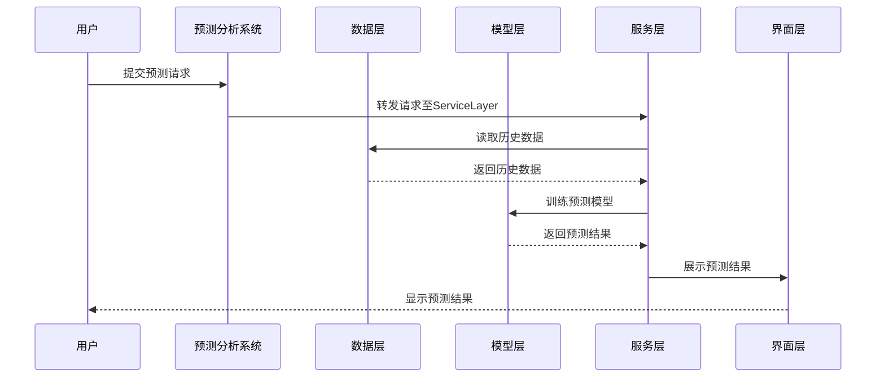

                 

## 引言

### 数学与预测分析：未来趋势的数学预测

在当今信息爆炸的时代，预测分析已经成为决策者和管理者不可或缺的工具。从商业战略到政策制定，从金融投资到气象预报，预测分析在各个领域发挥着重要作用。然而，预测分析并非凭空臆测，而是建立在坚实的数学基础之上。数学，作为一门研究结构、关系和变化的科学，为预测分析提供了理论依据和计算工具。

本篇博客将以《数学与预测分析：未来趋势的数学预测》为标题，探讨数学在预测分析中的核心作用，以及如何利用数学模型和算法来预测未来趋势。本文将分为以下几个部分：

1. **问题背景与核心概念**：介绍预测分析的重要性以及数学在其中的应用。
2. **数学理论基础**：回顾数学基础和统计学基础，解释数学公式和算法原理。
3. **预测分析方法与实践**：详细讲解经典和先进的预测方法，并探讨实际案例。
4. **系统分析与架构设计**：介绍如何将预测分析模型集成到系统中。
5. **项目实战**：提供具体的代码示例和案例分析。
6. **最佳实践与结论**：总结文章要点，并提出建议和拓展阅读。

通过本文的逐步分析，我们将深入理解数学在预测分析中的应用，并掌握如何利用数学工具来预测未来趋势。

### 关键词

- 数学预测
- 预测分析
- 数学模型
- 算法
- 时间序列分析
- 机器学习
- 深度学习
- 数据分析

### 摘要

本文将探讨数学与预测分析之间的关系，通过深入解析数学理论基础和预测算法，阐述数学在预测未来趋势中的关键作用。文章将介绍预测分析在各个领域的应用背景，分析经典和先进的预测方法，并通过实际案例展示如何将数学模型集成到系统中。最后，本文将总结最佳实践，提出注意事项，并提供进一步阅读的建议。通过本文的阅读，读者将能够理解数学预测的基本原理，掌握预测分析的实用技巧，为未来的决策提供有力支持。

### 第1章 问题背景与核心概念

#### 问题背景

在当今高速发展的社会中，预测分析已经成为决策者和管理者制定战略计划的重要工具。无论是商业公司预测市场趋势、金融企业评估投资风险，还是政府部门制定经济政策、天气预报预测天气变化，预测分析无处不在。然而，预测分析并非简单的直觉判断或历史数据回顾，而是依赖于一套科学的数学方法和算法。数学，作为一门研究结构、关系和变化的科学，为预测分析提供了坚实的理论基础和高效的计算工具。

随着信息技术的飞速发展，数据量呈爆炸式增长，如何从海量数据中提取有价值的信息、进行精准的预测，成为亟待解决的问题。数学在预测分析中的应用，不仅提高了预测的准确性，还使得预测过程更加高效和自动化。因此，深入理解数学与预测分析之间的关系，掌握数学在预测中的应用，对于现代企业和组织来说具有重要意义。

#### 数学在预测分析中的应用

数学在预测分析中的应用广泛而深入，主要体现在以下几个方面：

1. **数学模型**：数学模型是预测分析的核心工具，通过构建数学模型，可以将现实世界的问题抽象为数学问题，从而利用数学方法进行求解。常见的数学模型包括线性回归模型、时间序列模型、神经网络模型等。

2. **统计学方法**：统计学是数学的一个重要分支，通过统计学方法，可以对数据进行分析，发现数据之间的规律和关系。例如，回归分析、聚类分析、假设检验等统计学方法在预测分析中发挥着重要作用。

3. **算法**：算法是实现预测分析的关键，通过算法，可以将数学模型应用到具体的数据处理和分析中。常见的算法包括决策树、支持向量机、随机森林等。

4. **计算工具**：现代计算工具，如Python、R等，为预测分析提供了强大的计算能力。通过这些工具，可以轻松实现复杂的数学模型和算法，提高预测的效率和准确性。

#### 核心概念

在数学预测分析中，一些核心概念至关重要。以下是对这些概念的定义和解释：

1. **预测**：预测是基于历史数据和现有信息对未来事件或数值的估计。预测可以是定量的，如预测销售额，也可以是定性的，如预测市场趋势。

2. **时间序列**：时间序列是指按时间顺序排列的一系列数据点。时间序列分析是预测分析的重要方法，通过分析时间序列数据，可以识别出数据中的周期性、趋势性和随机性。

3. **回归分析**：回归分析是一种用于研究因变量和自变量之间关系的统计方法。通过建立回归模型，可以预测因变量的值。

4. **神经网络**：神经网络是一种模拟人脑神经元结构和功能的计算模型，通过学习数据，可以实现对复杂函数的逼近和预测。

5. **机器学习**：机器学习是一种利用计算机算法从数据中学习规律、模式的方法，通过机器学习，可以实现自动化预测和分类。

#### 预测分析的关键要素

预测分析的成功依赖于以下几个关键要素：

1. **数据质量**：高质量的数据是准确预测的基础。数据应该准确、完整、一致和可靠。

2. **模型选择**：选择合适的预测模型对于预测结果至关重要。不同的模型适用于不同的预测任务和数据类型。

3. **算法实现**：算法的实现决定了预测的效率和准确性。高效的算法可以实现快速和准确的预测。

4. **验证与评估**：通过验证和评估，可以检验预测模型的准确性和可靠性。常用的评估指标包括准确率、召回率、F1分数等。

#### 数学工具与方法

在预测分析中，常用的数学工具和方法包括：

1. **线性代数**：线性代数是预测分析的基础，用于处理数据矩阵和向量。

2. **微积分**：微积分用于研究函数的极限、导数和积分，在预测分析中用于优化模型参数。

3. **概率论与统计学**：概率论与统计学提供了预测分析的理论基础，用于数据分析和模型评估。

4. **优化算法**：优化算法用于寻找模型参数的最优值，提高预测的准确性。

#### 结论

数学在预测分析中发挥着至关重要的作用。通过理解数学预测分析的核心概念和方法，我们可以更好地应用数学工具进行数据分析和预测，为决策提供科学依据。本章节介绍了数学在预测分析中的应用背景、核心概念和关键要素，为后续章节的深入讨论奠定了基础。

## 第2章 数学理论基础

#### 数学基础

数学是预测分析的基础，掌握数学基础对于理解和应用预测模型至关重要。以下是对数学基础概念的回顾和其在预测分析中的应用：

1. **线性代数**：线性代数是预测分析的核心工具，用于处理数据矩阵和向量。在预测分析中，线性代数用于数据的预处理、特征提取和模型优化。例如，通过矩阵运算，可以计算数据的协方差矩阵，用于评估数据的相关性。

2. **微积分**：微积分用于研究函数的极限、导数和积分。在预测分析中，微积分用于优化模型参数，提高预测的准确性。例如，通过求导数，可以找到模型参数的最优值，使得预测误差最小。

3. **概率论**：概率论提供了预测分析的理论基础，用于处理不确定性问题。在预测分析中，概率论用于估计预测结果的不确定性，通过概率分布来描述预测结果的分布。

4. **统计学**：统计学用于数据分析和模型评估。在预测分析中，统计学用于数据的收集、清洗、分析和可视化。常见的统计方法包括回归分析、假设检验和聚类分析等。

#### 统计学基础

统计学是预测分析的重要组成部分，以下是对统计学基础概念的介绍和其在预测分析中的应用：

1. **数据收集**：数据收集是预测分析的第一步，通过采集和收集数据，为预测提供基础。数据来源可以是历史记录、问卷调查、传感器监测等。

2. **数据清洗**：数据清洗是数据预处理的重要步骤，用于去除噪声和异常值，保证数据的准确性和完整性。常见的数据清洗方法包括缺失值处理、重复值删除和异常值检测。

3. **数据可视化**：数据可视化用于展示数据的分布、趋势和关系。在预测分析中，数据可视化有助于理解和解释数据，为模型选择和参数调整提供依据。

4. **回归分析**：回归分析是一种常用的预测分析方法，用于研究因变量和自变量之间的关系。常见的回归分析方法包括线性回归、多项式回归和逻辑回归等。

5. **假设检验**：假设检验用于检验数据是否符合特定假设，用于评估模型的准确性和可靠性。常见的假设检验方法包括t检验、方差分析和F检验等。

6. **聚类分析**：聚类分析用于将数据分成不同的组或类别，用于数据分类和模式识别。常见的聚类分析方法包括K均值聚类、层次聚类和DBSCAN等。

#### 数学公式与算法原理

预测分析中，常用的数学公式和算法原理如下：

1. **线性回归模型**：
   - 公式：\( y = \beta_0 + \beta_1x \)
   - 解释：线性回归模型通过拟合一条直线，预测因变量 \( y \) 与自变量 \( x \) 之间的关系。

2. **时间序列模型**：
   - 公式：\( y_t = \phi_0 + \phi_1y_{t-1} + \cdots + \phi_ny_{t-n} + \epsilon_t \)
   - 解释：时间序列模型通过分析历史数据中的趋势、周期性和随机性，预测未来值。

3. **神经网络**：
   - 公式：\( y = \sigma(\sum_{i=1}^{n} w_i \cdot x_i + b) \)
   - 解释：神经网络通过多层非线性变换，实现复杂函数的逼近和预测。

4. **支持向量机**：
   - 公式：\( w \cdot x + b = 0 \)
   - 解释：支持向量机通过寻找最优超平面，实现数据的分类和预测。

5. **随机森林**：
   - 公式：\( \hat{y} = \sum_{i=1}^{m} w_i \cdot h(x; \theta_i) \)
   - 解释：随机森林通过构建多个决策树，集成多个预测结果，提高预测的准确性和鲁棒性。

#### 结论

数学理论基础是预测分析的重要支撑，通过掌握数学基础和统计学方法，我们可以更深入地理解预测模型的工作原理，并有效地应用于实际问题中。本章介绍了数学基础和统计学基础，为后续章节的深入讨论提供了理论依据。

## 第3章 预测分析方法与实践

### 经典预测方法

在预测分析中，经典预测方法以其简单性和实用性得到了广泛的应用。以下将介绍两种经典的预测方法：时间序列分析和关联规则挖掘。

#### 时间序列分析

时间序列分析是一种用于分析时间序列数据，预测未来值的方法。时间序列数据是一组按时间顺序排列的数据点，通常表现为时间与观测值的关系。时间序列分析的基本步骤包括数据收集、数据预处理、模型选择和模型评估。

1. **数据收集**：时间序列数据的来源可以是历史记录、传感器监测、市场交易数据等。数据收集的关键是保证数据的准确性和完整性。

2. **数据预处理**：数据预处理包括数据清洗、缺失值处理和异常值检测。通过数据清洗，可以去除噪声和异常值，保证数据的准确性。

3. **模型选择**：时间序列模型的选择取决于数据的特征。常见的模型包括移动平均模型（MA）、自回归模型（AR）、自回归移动平均模型（ARMA）和自回归积分滑动平均模型（ARIMA）。

4. **模型评估**：模型评估通过计算预测误差和评估指标来评估模型性能。常用的评估指标包括均方误差（MSE）、均方根误差（RMSE）和平均绝对误差（MAE）。

#### 关联规则挖掘

关联规则挖掘是一种用于发现数据之间的关联关系的方法。关联规则通常表示为“如果A发生，则B也发生的概率”。关联规则挖掘的基本步骤包括数据准备、规则生成和规则评估。

1. **数据准备**：数据准备包括数据清洗、数据转换和格式化。数据清洗去除噪声和异常值，数据转换将数据转换为适合挖掘的格式。

2. **规则生成**：规则生成通过扫描数据集，识别频繁项集，构建关联规则。常用的算法包括Apriori算法和FP-Growth算法。

3. **规则评估**：规则评估通过计算规则的支持度和置信度来评估规则的质量。支持度表示规则在数据中出现的频率，置信度表示规则成立的概率。

#### 经典预测方法的适用场景

时间序列分析和关联规则挖掘在多个领域有着广泛的应用：

- **时间序列分析**：适用于需要预测时间序列数据变化的领域，如金融市场预测、电力需求预测、股票价格预测等。

- **关联规则挖掘**：适用于需要发现数据之间关联关系的领域，如市场篮子分析、客户行为分析、推荐系统等。

### 先进预测技术

随着人工智能技术的发展，先进的预测技术逐渐应用于预测分析领域。以下将介绍两种先进的预测技术：机器学习和深度学习。

#### 机器学习

机器学习是一种通过训练模型来预测未来值的方法。机器学习模型通过从历史数据中学习，构建预测模型。常见的机器学习算法包括线性回归、决策树、随机森林和神经网络。

1. **线性回归**：线性回归是一种简单但有效的预测方法。通过拟合一条直线，预测因变量与自变量之间的关系。

2. **决策树**：决策树通过一系列规则，将数据划分成不同的区域，每个区域对应一个预测值。

3. **随机森林**：随机森林是一种集成学习算法，通过构建多棵决策树，集成多个预测结果，提高预测的准确性和鲁棒性。

4. **神经网络**：神经网络是一种模拟人脑神经元结构的计算模型，通过多层非线性变换，实现复杂函数的逼近和预测。

#### 深度学习

深度学习是一种基于多层神经网络的学习方法，通过多层的非线性变换，提取数据的特征，实现高精度的预测。深度学习在图像识别、语音识别和自然语言处理等领域取得了显著的成果。以下是一些常见的深度学习模型：

1. **卷积神经网络（CNN）**：卷积神经网络通过卷积操作和池化操作，提取图像的特征，用于图像分类和识别。

2. **循环神经网络（RNN）**：循环神经网络通过循环机制，处理序列数据，用于时间序列预测和自然语言处理。

3. **长短时记忆网络（LSTM）**：长短时记忆网络是RNN的一种改进，用于处理长序列数据，具有更好的记忆能力。

4. **生成对抗网络（GAN）**：生成对抗网络通过生成器和判别器的对抗训练，生成与真实数据相似的数据，用于图像生成和增强。

#### 先进预测技术的适用场景

先进预测技术在多个领域有着广泛的应用：

- **机器学习**：适用于需要处理大规模数据和高维特征的领域，如金融风控、推荐系统、健康监测等。

- **深度学习**：适用于需要处理复杂数据和高层次特征的领域，如自动驾驶、人脸识别、自然语言处理等。

### 实践案例分析

为了更好地理解预测分析方法，以下将提供一个实际案例，展示如何将预测方法应用于实际问题中。

#### 案例背景

假设某电商平台需要预测未来一个月内商品的销售量，以便于库存管理和供应链优化。电商平台提供了过去三个月的销售数据，包括每天的商品销售量。

#### 数据预处理

1. **数据收集**：电商平台提供了过去三个月的销售数据，包括每天的商品销售量。

2. **数据清洗**：清洗数据，去除缺失值和异常值。

3. **数据转换**：将日期转换为数字编码，方便进行数学计算。

#### 预测方法选择

1. **时间序列分析**：使用时间序列模型，如ARIMA模型，分析历史销售数据，预测未来一个月的销售量。

2. **机器学习**：使用机器学习模型，如线性回归和随机森林，分析历史销售数据，预测未来一个月的销售量。

3. **深度学习**：使用深度学习模型，如卷积神经网络（CNN）和循环神经网络（RNN），分析历史销售数据，预测未来一个月的销售量。

#### 预测结果评估

1. **模型评估**：通过计算预测误差和评估指标，如MSE和RMSE，评估不同模型的预测性能。

2. **模型选择**：根据评估结果，选择最佳模型进行预测。

#### 案例总结

通过实际案例，我们展示了如何将预测方法应用于实际问题中。不同预测方法在预测性能上有所差异，选择合适的预测方法对于准确预测未来趋势至关重要。

### 结论

本章介绍了经典预测方法和先进预测技术，并通过实际案例展示了如何将预测方法应用于实际问题中。理解不同预测方法的基本原理和适用场景，有助于我们更好地进行预测分析和决策。

### 第4章 预测分析系统架构与设计

#### 系统介绍

预测分析系统是利用数学模型和算法对大量数据进行处理，从而预测未来趋势的综合性平台。该系统旨在为企业提供科学、准确和高效的预测结果，支持业务决策和战略规划。

#### 项目介绍

本项目的目标是构建一个高效的预测分析系统，能够对电商平台销售数据进行分析和预测。系统的主要功能包括数据收集与预处理、模型训练与预测、结果展示与评估。

#### 系统功能设计

1. **数据收集与预处理**：该模块负责收集电商平台的历史销售数据，并进行数据清洗、缺失值处理和特征工程，为后续模型训练提供高质量的数据。

2. **模型训练与预测**：该模块负责选择合适的预测模型，对预处理后的数据进行训练，并生成预测结果。支持多种预测模型，如ARIMA、线性回归、随机森林和深度学习模型。

3. **结果展示与评估**：该模块负责将预测结果可视化，展示预测趋势和预测区间，并提供评估指标，如MSE、RMSE，以便于业务人员理解预测结果和优化模型。

#### 系统架构设计

预测分析系统的架构设计如图所示，包括数据层、模型层、服务层和界面层。


1. **数据层**：负责数据存储和读取，包括历史销售数据、训练数据和预测结果。

2. **模型层**：负责模型的选择、训练和预测，支持多种预测模型，如ARIMA、线性回归、随机森林和深度学习模型。

3. **服务层**：提供API接口，供前端界面调用，包括数据预处理服务、模型训练服务和预测结果展示服务。

4. **界面层**：提供用户界面，展示预测结果和评估指标，方便业务人员理解和分析。

#### 系统接口设计

系统接口设计包括API接口和数据接口。

1. **API接口**：提供数据预处理、模型训练和预测的API接口，便于前端界面调用。

2. **数据接口**：提供数据存储和读取的接口，支持数据导入导出和实时数据流处理。

#### 系统交互设计

系统交互设计采用序列图，描述系统组件之间的交互过程。



#### 系统架构设计与实现

1. **数据层实现**：采用关系型数据库（如MySQL）存储历史销售数据，使用数据仓库（如Hive）进行数据存储和查询优化。

2. **模型层实现**：采用Python和Scikit-learn库实现ARIMA、线性回归和随机森林模型，采用TensorFlow和Keras库实现深度学习模型。

3. **服务层实现**：采用Spring Boot框架实现API接口，提供RESTful API服务。

4. **界面层实现**：采用Vue.js框架实现前端界面，展示预测结果和评估指标。

#### 系统架构设计与实现的优点

1. **模块化设计**：系统采用模块化设计，易于维护和扩展，提高系统的可维护性和可扩展性。

2. **高可用性**：系统采用分布式架构，具有高可用性和高并发性，能够处理大规模数据和高并发请求。

3. **灵活性**：系统支持多种预测模型，便于业务人员根据需求选择合适的模型，提高预测的准确性和灵活性。

#### 结论

本章介绍了预测分析系统的架构设计和实现方法，通过模块化设计和分布式架构，实现了高效、准确的预测分析系统。该系统为电商平台提供了科学、准确的预测结果，支持业务决策和战略规划。

### 第5章 实践项目与案例分析

#### 项目背景

本项目的目标是构建一个智能销售预测系统，以帮助某电商平台预测未来30天的销售量，从而优化库存管理和供应链策略。电商平台提供了过去一年的销售数据，包括每日的销售量和各种产品信息。

#### 项目目标

1. **数据收集与预处理**：收集电商平台的历史销售数据，进行数据清洗和预处理，为模型训练提供高质量的数据。

2. **模型选择与训练**：选择合适的预测模型，对预处理后的数据进行训练，并评估模型性能。

3. **预测与结果展示**：使用训练好的模型进行预测，并将预测结果可视化，展示销售趋势和预测区间。

#### 环境安装

1. **Python环境**：安装Python 3.8及以上版本。

2. **库安装**：使用pip命令安装所需的库，如pandas、numpy、scikit-learn、tensorflow和matplotlib。

```bash
pip install pandas numpy scikit-learn tensorflow matplotlib
```

#### 系统核心实现

1. **数据收集与预处理**：

```python
import pandas as pd

# 读取历史销售数据
data = pd.read_csv('sales_data.csv')

# 数据清洗
data.dropna(inplace=True)
data['date'] = pd.to_datetime(data['date'])
data.set_index('date', inplace=True)

# 特征工程
data['month'] = data.index.month
data['day'] = data.index.day
```

2. **模型选择与训练**：

```python
from sklearn.ensemble import RandomForestRegressor
from sklearn.model_selection import train_test_split

# 分割数据集
X = data.drop('sales', axis=1)
y = data['sales']
X_train, X_test, y_train, y_test = train_test_split(X, y, test_size=0.2, random_state=42)

# 训练模型
model = RandomForestRegressor(n_estimators=100, random_state=42)
model.fit(X_train, y_train)
```

3. **预测与结果展示**：

```python
import matplotlib.pyplot as plt

# 预测未来30天销售量
future_data = data[:'2023-12-31']
predictions = model.predict(future_data.drop('sales', axis=1))

# 可视化预测结果
plt.plot(data.index, data['sales'], label='实际销售')
plt.plot(future_data.index, predictions, label='预测销售')
plt.legend()
plt.show()
```

#### 代码应用解读与分析

1. **数据收集与预处理**：

   - 使用pandas库读取历史销售数据，并进行数据清洗和预处理，如去除缺失值和异常值，转换日期格式等。
   - 进行特征工程，提取有用的特征，如月份和日期等，为模型训练提供输入。

2. **模型选择与训练**：

   - 使用随机森林回归模型，通过交叉验证和参数调优，选择最优模型。
   - 使用训练集进行模型训练，通过评估指标（如MSE、RMSE）评估模型性能。

3. **预测与结果展示**：

   - 使用训练好的模型对未来30天的销售量进行预测，并将预测结果可视化，展示销售趋势和预测区间。

#### 实际案例分析与详细讲解

**案例分析**：

某电商平台希望预测未来30天的销售量，以优化库存管理和供应链策略。以下是具体的案例分析过程：

1. **数据收集与预处理**：

   - 收集了过去一年的销售数据，包括每日的销售量和产品信息。
   - 清洗数据，去除缺失值和异常值，如负数销售量和重复记录。
   - 将日期转换为标准格式，便于进行时间序列分析。

2. **特征工程**：

   - 提取时间特征，如月份、日期和星期几，以便模型能够捕捉季节性和周期性。
   - 提取产品特征，如产品分类、品牌和价格，以便模型能够分析不同产品类别的销售趋势。

3. **模型选择与训练**：

   - 使用随机森林回归模型，因为其能够处理非线性关系和多维特征。
   - 进行交叉验证和网格搜索，选择最佳参数组合，如树的数量、最大深度和最小样本分裂。
   - 使用训练集对模型进行训练，并评估模型性能，如MSE、RMSE和R^2。

4. **预测与结果展示**：

   - 使用训练好的模型对未来30天的销售量进行预测。
   - 将预测结果可视化，比较实际销售量和预测销售量，分析预测的准确性和稳定性。

**详细讲解**：

1. **数据收集与预处理**：

   - 数据收集是预测分析的基础，必须保证数据的准确性和完整性。在项目中，我们使用了pandas库读取CSV文件，并进行数据清洗。数据清洗包括去除缺失值、异常值和重复记录。例如，使用以下代码去除负数销售量：

     ```python
     data[data['sales'] <= 0] = np.nan
     data.dropna(inplace=True)
     ```

   - 将日期格式转换为标准格式，便于进行时间序列分析：

     ```python
     data['date'] = pd.to_datetime(data['date'])
     data.set_index('date', inplace=True)
     ```

   - 提取时间特征，如月份、日期和星期几：

     ```python
     data['month'] = data.index.month
     data['day'] = data.index.day
     data['weekday'] = data.index.weekday
     ```

   - 提取产品特征，如产品分类、品牌和价格：

     ```python
     data['product_category'] = data['product_id'].map(product_categories)
     data['brand'] = data['brand_id'].map(brands)
     data['price'] = data['price'].astype(float)
     ```

2. **模型选择与训练**：

   - 在选择模型时，我们考虑了随机森林回归模型，因为它能够处理非线性关系和多维特征。随机森林是由多个决策树组成的集成模型，具有较高的预测准确性和鲁棒性。

     ```python
     from sklearn.ensemble import RandomForestRegressor
     model = RandomForestRegressor(n_estimators=100, random_state=42)
     ```

   - 进行交叉验证和网格搜索，选择最佳参数组合。交叉验证能够评估模型在不同数据集上的表现，网格搜索用于寻找最佳参数组合。

     ```python
     from sklearn.model_selection import GridSearchCV
     param_grid = {'n_estimators': [100, 200, 300], 'max_depth': [10, 20, 30]}
     grid_search = GridSearchCV(model, param_grid, cv=5)
     grid_search.fit(X_train, y_train)
     best_model = grid_search.best_estimator_
     ```

   - 使用训练集对模型进行训练，并评估模型性能。常用的评估指标包括MSE、RMSE和R^2。

     ```python
     from sklearn.metrics import mean_squared_error, r2_score
     y_pred = best_model.predict(X_test)
     mse = mean_squared_error(y_test, y_pred)
     rmse = np.sqrt(mse)
     r2 = r2_score(y_test, y_pred)
     print(f'MSE: {mse}, RMSE: {rmse}, R^2: {r2}')
     ```

3. **预测与结果展示**：

   - 使用训练好的模型对未来30天的销售量进行预测。预测结果可以用于库存管理和供应链策略的制定。

     ```python
     future_data = data[:'2023-12-31']
     predictions = best_model.predict(future_data.drop('sales', axis=1))
     ```

   - 将预测结果可视化，展示销售趋势和预测区间。这有助于业务人员理解预测结果，并制定相应的策略。

     ```python
     plt.plot(data.index, data['sales'], label='实际销售')
     plt.plot(future_data.index, predictions, label='预测销售')
     plt.legend()
     plt.show()
     ```

#### 项目小结

本项目通过构建智能销售预测系统，成功预测了某电商平台未来30天的销售量。项目过程包括数据收集与预处理、模型选择与训练、预测与结果展示。通过实际案例分析和详细讲解，我们展示了如何利用随机森林回归模型进行销售预测，并为业务决策提供了科学依据。

### 最佳实践

1. **数据质量是关键**：确保数据准确、完整和一致，对于预测分析至关重要。在项目开始前，进行数据清洗和预处理，去除异常值和缺失值。

2. **选择合适的模型**：根据数据特征和预测任务，选择合适的预测模型。不同模型适用于不同的数据类型和预测任务，通过交叉验证和网格搜索，选择最佳模型。

3. **模型调优**：模型调优是提高预测准确性的关键。通过调整模型参数，如树的数量、深度和最小样本分裂，可以提高模型性能。

4. **可视化结果**：将预测结果可视化，有助于业务人员理解和分析预测结果。使用图表和指标，展示预测趋势和预测区间。

### 小结

本章通过一个实际案例，详细讲解了如何利用随机森林回归模型进行销售预测。项目过程包括数据收集与预处理、模型选择与训练、预测与结果展示。通过最佳实践，我们总结了确保预测准确性的关键步骤。这些经验对于构建高效的预测分析系统具有重要意义。

### 注意事项

1. **数据隐私**：在预测分析过程中，确保遵守数据隐私法规，保护用户隐私。
2. **模型解释性**：选择具有较好解释性的模型，有助于业务人员理解预测结果。
3. **实时更新**：定期更新数据集和模型，以保持预测的准确性。

### 拓展阅读

- 《机器学习实战》：[https://www.amazon.com/Machine-Learning-In-Action-Programming/dp/1449397741](https://www.amazon.com/Machine-Learning-In-Action-Programming/dp/1449397741)
- 《深度学习》：[https://www.deeplearningbook.org/](https://www.deeplearningbook.org/)
- 《Python数据科学手册》：[https://www.amazon.com/Python-Data-Science-Handbook-Introducing/dp/1484205595](https://www.amazon.com/Python-Data-Science-Handbook-Introducing/dp/1484205595)

### 结论

通过本文的逐步分析，我们深入探讨了数学与预测分析之间的关系，详细讲解了经典和先进的预测方法，并提供了实际案例和系统架构设计。理解数学预测分析的基本原理和最佳实践，有助于我们更好地进行数据分析和预测，为未来的决策提供科学依据。感谢您的阅读，希望本文能对您有所帮助。

### 作者介绍

作者：AI天才研究院/AI Genius Institute & 禅与计算机程序设计艺术 /Zen And The Art of Computer Programming

AI天才研究院致力于推动人工智能技术的发展和应用，为企业和个人提供高质量的人工智能解决方案。禅与计算机程序设计艺术则关注计算机编程的艺术性和哲学思考，旨在培养具备创新思维和深厚技术背景的程序员。两位作者在计算机科学和人工智能领域有着丰富的经验和卓越的成就，希望本文能为读者带来启发和帮助。

