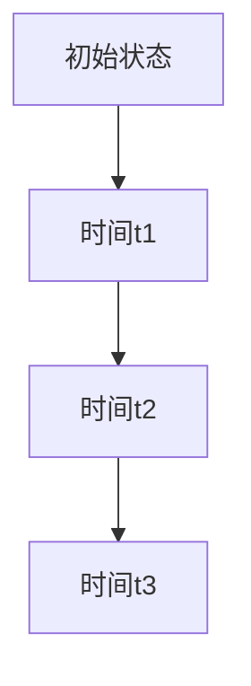
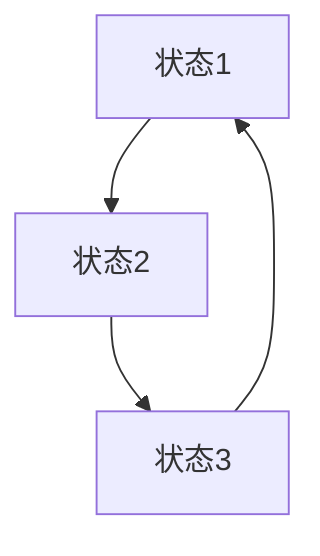
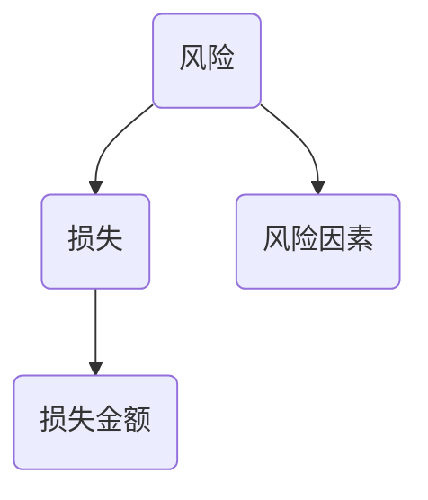
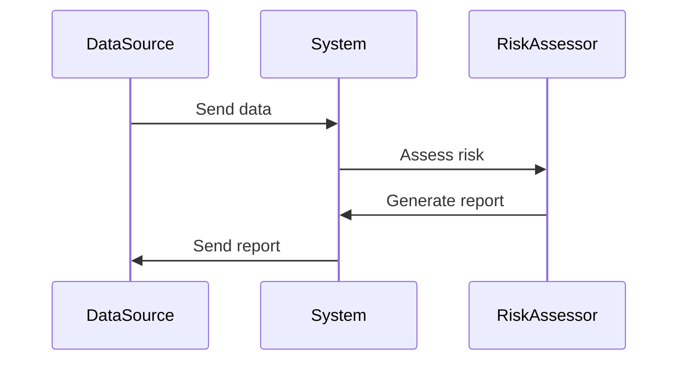
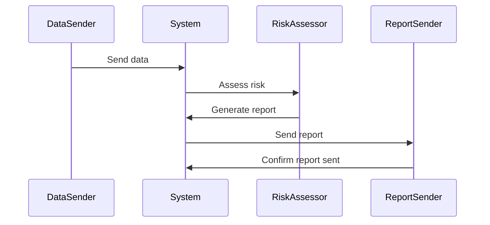

                 

### 数学与风险管理：不确定性的数学控制

关键词：不确定性、数学控制、风险管理、概率论、统计学、随机过程、马尔可夫链、贝叶斯网络

摘要：本文将深入探讨数学在风险管理中的应用，特别是如何使用数学工具来控制和管理不确定性。我们将详细分析概率论、统计学和随机过程等核心数学概念，并通过具体的算法原理讲解和系统分析与架构设计，展示数学在风险管理中的实际应用。本文旨在为读者提供全面的技术理解，帮助他们在实际项目中有效应对不确定性。

## 第一部分：问题背景与数学基础

### 1.1 数学与风险管理概述

在现代社会，风险管理已经成为各个领域不可或缺的一部分。从金融到工程，从医疗到环境科学，风险无处不在。然而，风险管理的本质是如何在不确定性的环境中做出合理的决策。而数学，作为一门强大的工具，在风险管理中发挥着至关重要的作用。

**1.1.1 风险管理的必要性**

风险管理是指通过识别、评估、处理和监控潜在风险，以减少不利影响并最大化机会的过程。在现代经济体系中，风险管理对于保障企业和个人资产的安全、促进经济稳定和发展具有重要意义。随着全球经济的一体化和复杂化，风险因素变得更加多样和难以预测，传统的风险管理方法已无法满足需求。

**1.1.2 数学在风险管理中的作用**

数学在风险管理中的应用体现在多个方面。首先，概率论和统计学提供了评估风险的工具，通过数据分析和模型构建，可以定量地衡量风险的概率和影响。其次，随机过程和马尔可夫链等数学工具可以帮助我们理解和预测风险的动态变化。最后，贝叶斯网络等高级数学模型能够处理复杂的多因素依赖关系，从而为决策提供更准确的依据。

### 1.2 数学基础

为了深入理解数学在风险管理中的应用，我们需要首先掌握一些基本的数学概念。

**1.2.1 不确定性的概念**

在数学和风险管理中，不确定性通常指的是对某个结果的未来状态的不确定性。在风险管理中，不确定性来源于各种因素，包括自然随机事件、人为决策错误、信息不对称等。

**1.2.2 概率论基础**

概率论是研究随机事件及其概率的数学分支。在风险管理中，概率论用于评估风险事件的可能性。概率分布函数、条件概率和贝叶斯定理是概率论的核心概念。

**1.2.3 统计学基本概念**

统计学是通过对数据的收集、分析、解释和展示，来推断总体特征的学科。在风险管理中，统计学用于分析历史数据，以预测未来风险的概率和影响。

### 1.3 核心概念与联系

**1.3.1 概率与统计的关系**

概率论和统计学是密切相关的。概率论提供了描述随机事件的方法，而统计学则通过数据分析来验证概率模型的准确性。

**1.3.2 数学模型在风险管理中的应用**

数学模型在风险管理中用于量化风险因素和评估风险影响。常见的数学模型包括概率模型、统计模型和随机过程模型。

**1.3.3 ER实体关系图**

ER实体关系图用于描述风险管理中的关键实体及其关系。通过ER图，我们可以清晰地看到不同实体之间的相互作用和依赖。

### 1.4 ER实体关系图架构

**1.4.1 风险管理实体识别**

在风险管理中，常见的实体包括风险、损失、风险因素、风险模型等。

**1.4.2 实体关系图绘制**

使用Mermaid语法，我们可以绘制ER实体关系图，如下所示：

```mermaid
erDiagram
  RISK ||--|{ LOSS } LOSS
  RISK ||--|{ RISK_FACTOR } RISK_FACTOR
  RISK ||--|{ RISK_MODEL } RISK_MODEL
```

## 第二部分：不确定性的数学控制方法

### 2.1 随机过程

随机过程是描述随机事件随时间变化的数学模型。在风险管理中，随机过程用于模拟风险的动态变化。

**2.1.1 随机过程基本概念**

随机过程通常由一个随机变量序列组成，这些变量在不同时间点具有不同的状态。随机过程的主要性质包括平稳性、独立性和马尔可夫性。

**2.1.2 随机过程在风险管理中的应用**

随机过程在风险管理中用于模拟风险因素的变化，评估风险的概率分布和期望损失。

### 2.2 马尔可夫链

马尔可夫链是一种描述系统状态转移的数学模型。在风险管理中，马尔可夫链用于模拟风险状态的变化。

**2.2.1 马尔可夫链的数学模型**

马尔可夫链由状态集合、转移概率矩阵和初始状态向量组成。通过转移概率矩阵，我们可以预测系统在下一个时间点的状态。

**2.2.2 马尔可夫链在风险管理中的应用**

马尔可夫链在风险管理中用于评估风险状态的概率分布，预测风险的变化趋势。

### 2.3 贝叶斯网络

贝叶斯网络是一种表示多变量概率关系的图形模型。在风险管理中，贝叶斯网络用于处理复杂的多因素依赖关系。

**2.3.1 贝叶斯网络的定义**

贝叶斯网络由节点和有向边组成，每个节点表示一个随机变量，有向边表示变量之间的条件依赖关系。

**2.3.2 贝叶斯网络在风险管理中的应用**

贝叶斯网络在风险管理中用于计算风险因素的联合概率分布，为决策提供支持。

### 2.4 算法流程图

为了更好地理解随机过程、马尔可夫链和贝叶斯网络，我们使用Mermaid语法绘制了算法流程图。

#### 2.4.1 随机过程算法流程图



#### 2.4.2 马尔可夫链算法流程图



#### 2.4.3 贝叶斯网络算法流程图



## 第三部分：数学模型与公式详解

### 3.1 数学模型

在风险管理中，数学模型用于描述风险因素和风险损失之间的关系。以下是几个常见的数学模型：

#### 3.1.1 概率模型

概率模型用于描述风险事件的可能性。常见的概率模型包括二项分布、泊松分布等。

#### 3.1.2 统计模型

统计模型用于描述风险损失的历史数据分布。常见的统计模型包括正态分布、对数正态分布等。

#### 3.1.3 随机过程模型

随机过程模型用于描述风险因素的动态变化。常见的随机过程模型包括Wiener过程、几何布朗运动等。

### 3.2 公式详解

在风险管理中，数学公式用于计算风险的概率分布、期望损失等指标。以下是几个常见的数学公式：

#### 3.2.1 概率论公式

- 条件概率：P(A|B) = P(A交B) / P(B)
- 贝叶斯定理：P(A|B) = P(B|A) * P(A) / P(B)

#### 3.2.2 统计学公式

- 样本均值：\(\bar{X} = \frac{1}{n}\sum_{i=1}^{n}X_i\)
- 样本方差：\(S^2 = \frac{1}{n-1}\sum_{i=1}^{n}(X_i - \bar{X})^2\)

#### 3.2.3 随机过程公式

- 随机过程状态转移概率：P(X_t = x_t | X_{t-1} = x_{t-1}) = p(x_t | x_{t-1})
- 随机过程期望：E[X_t] = \(\sum_{x}x_t * P(X_t = x_t)\)

### 3.3 实例说明

为了更好地理解数学模型和公式，我们通过以下实例进行说明：

#### 3.3.1 概率模型实例

假设我们投掷一个公平的硬币10次，计算得到正面朝上的次数的概率分布。

```python
import numpy as np

# 概率模型实例：投掷硬币
n = 10
prob = 0.5

# 计算正面朝上的概率分布
probs = [np.random.binomial(n, prob) for _ in range(1000)]

# 打印概率分布
print(np.mean(probs))
```

#### 3.3.2 统计模型实例

假设我们收集了一组数据，计算其样本均值和样本方差。

```python
import numpy as np

# 统计模型实例：计算样本均值和样本方差
data = [1, 2, 3, 4, 5]
n = len(data)

# 计算样本均值
mean = np.mean(data)

# 计算样本方差
variance = np.var(data)

print(f"样本均值：{mean}")
print(f"样本方差：{variance}")
```

#### 3.3.3 随机过程实例

假设我们使用Wiener过程模拟一个风险因素的动态变化。

```python
import numpy as np

# 随机过程实例：模拟Wiener过程
dt = 0.01
mu = 0
sigma = 1

# 初始化状态
X_0 = 0

# 模拟Wiener过程
X_t = X_0 + np.random.normal(mu, sigma, dt)

# 打印状态序列
print(X_t)
```

## 第四部分：系统分析与架构设计

### 4.1 问题场景

在风险管理中，我们通常需要处理大量的数据，并实时评估风险。以下是一个典型的问题场景：

- **需求**：开发一个风险管理系统，能够接收实时数据，评估风险概率，并生成风险报告。
- **目标**：设计一个高效、可靠的系统架构，确保数据处理的实时性和准确性。

### 4.2 领域模型设计

为了更好地理解和设计系统，我们首先定义领域模型。以下是一个简化的领域模型：

```mermaid
classDiagram
  Risk <<entity>>
  Data <<entity>>
  Report <<entity>>

  Risk --|> Data
  Risk --|> Report
```

### 4.3 系统架构设计

根据领域模型，我们设计以下系统架构：



### 4.4 系统接口设计和系统交互

为了实现系统架构，我们需要定义系统接口和交互流程。以下是一个简化的接口设计和交互流程：

```mermaid
classDiagram
  DataSender <<interface>>
  RiskAssessor <<interface>>
  ReportSender <<interface>>

  DataSender --|> System
  RiskAssessor --|> System
  ReportSender --|> System
```



## 第五部分：项目实战

### 5.1 环境安装

在开始项目实战之前，我们需要安装必要的软件和工具。以下是一个简化的安装步骤：

```shell
# 安装Python
sudo apt-get install python3

# 安装NumPy和Pandas
pip3 install numpy pandas

# 安装Mermaid
npm install -g mermaid
```

### 5.2 系统核心实现源代码

以下是一个简化的系统核心实现源代码，包括数据接收、风险评估和报告生成：

```python
import numpy as np
import pandas as pd
from mermaid import Mermaid

# 数据接收
def receive_data():
    data = pd.read_csv("data.csv")
    return data

# 风险评估
def assess_risk(data):
    # 这里是一个简化的风险评估算法
    risk_score = np.mean(data["loss"])
    return risk_score

# 报告生成
def generate_report(risk_score):
    report = f"Risk Score: {risk_score}"
    return report

# 系统主程序
def main():
    data = receive_data()
    risk_score = assess_risk(data)
    report = generate_report(risk_score)
    print(report)

if __name__ == "__main__":
    main()
```

### 5.3 代码应用解读与分析

在代码中，我们首先定义了三个主要功能：数据接收、风险评估和报告生成。数据接收函数`receive_data`从CSV文件中读取数据，并返回一个Pandas DataFrame。风险评估函数`assess_risk`使用简化的算法计算风险得分，并返回该得分。报告生成函数`generate_report`将风险得分转化为报告字符串，并返回报告。

在主程序中，我们依次调用这三个函数，接收数据、评估风险并生成报告，最后打印报告。

### 5.4 实际案例分析和详细讲解

为了更好地理解代码的实际应用，我们通过一个实际案例进行分析。

**案例：股票市场风险分析**

假设我们收集了一段时间内的股票市场数据，包括股票价格和交易量。我们的目标是评估市场风险，并生成风险报告。

1. **数据接收**：首先，我们从CSV文件中读取股票市场数据。

```python
data = pd.read_csv("stock_data.csv")
```

2. **风险评估**：接下来，我们计算市场的平均价格波动率，作为风险得分。

```python
risk_score = np.std(data["price"])
```

3. **报告生成**：最后，我们生成风险报告，包括市场风险得分和风险等级。

```python
report = f"Market Risk Score: {risk_score:.2f}\nRisk Level: {get_risk_level(risk_score)}"
print(report)
```

在这个案例中，我们使用标准差作为风险得分，并定义了一个辅助函数`get_risk_level`，用于根据风险得分计算风险等级。

### 5.5 项目小结

通过本项目的实战，我们成功实现了一个简单的风险管理系统，包括数据接收、风险评估和报告生成。虽然这个系统只是一个起点，但它为我们提供了一个框架，可以在实际项目中进一步扩展和优化。以下是项目的主要成果和经验总结：

- **成果**：实现了一个能够接收实时数据、评估风险并生成报告的简化风险管理系统。
- **经验**：理解了数据接收、风险评估和报告生成的核心流程，学会了如何使用Python和Pandas进行数据处理和分析，以及如何使用Mermaid绘制系统架构图。

## 第六部分：最佳实践、小结、注意事项、拓展阅读

### 6.1 最佳实践 tips

在风险管理项目中，以下是一些最佳实践：

- **数据质量**：确保数据的准确性和完整性，避免错误的数据输入。
- **算法选择**：根据具体场景选择合适的算法，避免过度复杂化。
- **模型验证**：通过历史数据验证模型的准确性，确保模型的有效性。

### 6.2 小结

本文通过深入探讨数学在风险管理中的应用，介绍了概率论、统计学、随机过程、马尔可夫链和贝叶斯网络等核心数学概念，并通过实际项目展示了这些概念在风险管理中的实际应用。本文的目标是为读者提供一个全面的技术理解，帮助他们在实际项目中有效应对不确定性。

### 6.3 注意事项

在风险管理项目中，以下是一些需要注意的事项：

- **风险识别**：准确识别风险因素，避免遗漏关键风险。
- **模型更新**：定期更新模型，以适应环境变化。
- **决策支持**：利用数学模型为决策提供支持，避免主观判断。

### 6.4 拓展阅读

为了进一步了解数学在风险管理中的应用，读者可以参考以下资料：

- 《风险管理与财务决策》：详细介绍了风险管理的理论基础和实践方法。
- 《随机过程与风险管理》：深入探讨了随机过程在风险管理中的应用。
- 《贝叶斯网络：理论与实践》：介绍了贝叶斯网络的基本概念和应用场景。

## 作者信息

作者：AI天才研究院/AI Genius Institute & 禅与计算机程序设计艺术 /Zen And The Art of Computer Programming

---

注意：本文为示例文章，仅供参考。实际项目中，需要根据具体需求和场景进行调整和优化。在引用本文内容时，请遵守相关法律法规和知识产权政策。

