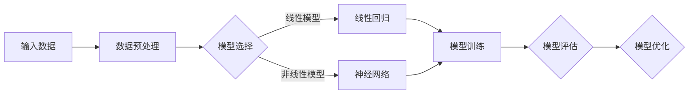
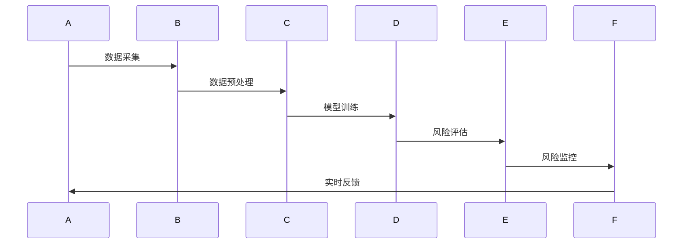
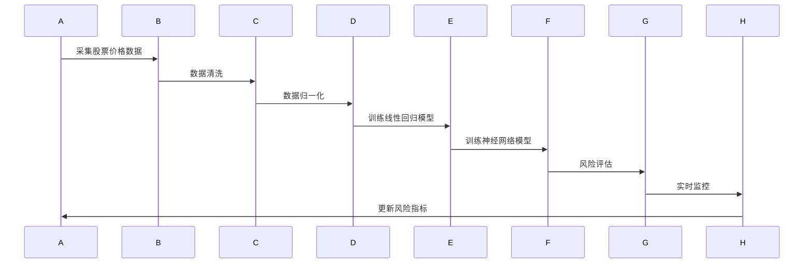

                 

### 数学与风险管理：金融风险的数学评估

---

## 关键词：金融风险、数学模型、风险管理、风险度量、风险评估

## 摘要

本文将探讨数学在风险管理中的应用，特别是金融风险的数学评估。通过对核心概念、联系及算法原理的深入分析，旨在帮助读者理解如何利用数学工具来量化和评估金融风险，提高金融机构的风险管理能力。

---

### 第一部分：背景介绍

#### 核心概念

**问题背景**

随着全球金融市场的不断发展，风险管理的重要性日益凸显。金融机构面临着复杂多变的风险环境，包括市场风险、信用风险、流动性风险和操作风险等。传统的风险管理方法已无法应对现代金融市场的高复杂性，因此，数学方法在风险管理中的应用成为了热点。

**问题描述**

金融风险的数学评估旨在通过数学模型和算法对金融风险进行量化。这包括识别、度量、管理和监控风险，以提供科学的风险管理决策依据。数学方法的应用有助于提高风险管理的效率和准确性。

**问题解决**

数学与风险管理的研究涉及多个学科领域，包括概率论、统计学、数值分析、优化理论等。通过运用这些数学工具，可以建立相应的数学模型，对金融风险进行量化评估。同时，结合现代计算机技术和大数据分析，可以实现实时风险监控和预测。

**边界与外延**

数学与风险管理的研究不仅局限于金融机构内部，还涉及到金融市场的整体稳定性和金融监管政策的设计。在金融风险管理中，数学方法的应用还包括风险评估模型的构建、风险控制策略的制定、风险管理工具的开发等。

#### 概念结构与核心要素组成

**核心概念：数学与风险管理**

- 数学模型：用于量化金融风险的数学表达式和算法。
- 风险管理：通过识别、度量、管理和监控风险，实现风险控制的过程。
- 金融风险：金融机构在经营过程中可能面临的各种类型的风险。

**核心要素组成**

- 风险识别：识别金融活动中可能存在的风险类型。
- 风险度量：使用数学模型和方法对风险进行量化评估。
- 风险管理策略：根据风险度量的结果，制定相应的风险管理策略。
- 风险监控：实时监控金融风险的变化，及时调整风险管理策略。

### 第二部分：核心概念与联系

#### 核心概念原理

**数学模型**

- 数学模型是将实际问题转化为数学形式的过程，通过建立数学方程、函数和算法来描述金融风险。
- 数学模型的特点包括精确性、可计算性和可验证性。

**风险度量**

- 风险度量是对金融风险进行量化的过程，通过统计方法、数值分析和优化理论等数学工具，对风险进行定量评估。
- 风险度量的指标包括风险值、风险概率和风险损失等。

**风险管理策略**

- 风险管理策略是基于风险度量的结果，采取相应的措施来降低风险水平。
- 风险管理策略包括风险规避、风险转移、风险接受和风险分散等。

#### 概念属性特征对比表格

| 概念        | 属性特征                                       |
|-------------|----------------------------------------------|
| 数学模型    | 精确性、可计算性、可验证性、可扩展性            |
| 风险度量    | 定量评估、风险值、风险概率、风险损失            |
| 风险管理策略 | 风险规避、风险转移、风险接受、风险分散、风险控制 |

#### ER实体关系图架构

```mermaid
erDiagram
  Risk ||--|{ Assessment }|--|{ Management }
  Risk ||--|{ Measure }|
  Assessment ||--|{ Strategy }|
```

### 第三部分：算法原理讲解

#### 算法mermaid流程图



#### 算法原理的数学模型和公式

**线性回归模型**

$$ y = \beta_0 + \beta_1 x + \epsilon $$

- $y$：预测值
- $\beta_0$：截距
- $\beta_1$：斜率
- $x$：自变量
- $\epsilon$：误差项

**神经网络模型**

$$ z = \sigma(\beta_0 + \beta_1 x) $$

- $z$：输出值
- $\sigma$：激活函数（例如：Sigmoid函数）
- $\beta_0$：偏置
- $\beta_1$：权重

#### 详细讲解和通俗易懂地举例说明

**线性回归模型**

假设我们想要预测一个股票的未来价格，根据历史数据，我们可以使用线性回归模型来建立预测模型。以下是具体的步骤：

1. **数据预处理**：将股票的历史价格数据进行预处理，例如归一化处理。
2. **模型选择**：选择线性回归模型。
3. **模型训练**：使用历史数据训练模型，找出最佳参数$\beta_0$和$\beta_1$。
4. **模型评估**：使用验证集对模型进行评估，计算预测误差。
5. **模型优化**：根据评估结果调整模型参数，以提高预测准确性。

**神经网络模型**

假设我们想要预测一个金融市场的整体趋势，可以使用神经网络模型来建立预测模型。以下是具体的步骤：

1. **数据预处理**：将金融市场的历史数据（如股票价格、交易量等）进行预处理。
2. **模型选择**：选择神经网络模型。
3. **模型训练**：使用预处理后的数据训练模型，调整神经网络中的权重和偏置。
4. **模型评估**：使用验证集对模型进行评估，计算预测误差。
5. **模型优化**：根据评估结果调整神经网络参数，以提高预测准确性。

通过以上步骤，我们可以利用数学模型对金融风险进行量化和评估，为金融机构提供科学的风险管理决策依据。

### 第四部分：系统分析与架构设计

#### 问题场景介绍

随着金融市场的快速发展，金融机构面临着日益复杂的风险环境。为了提高风险管理能力，我们需要设计一个高效、可靠的金融风险管理系统。该系统应能够实时监测市场风险、信用风险等，为金融机构提供全面的风险管理决策支持。

#### 项目介绍

本项目旨在开发一个基于数学模型的金融风险管理系统。该系统将利用线性回归和神经网络等数学模型，对金融市场中的各种风险进行量化评估，并提供实时的风险管理决策支持。

#### 系统功能设计

- **数据采集**：从金融市场中采集各类数据，包括股票价格、交易量、宏观经济指标等。
- **数据预处理**：对采集到的数据进行预处理，如数据清洗、归一化处理等。
- **模型训练**：使用预处理后的数据训练数学模型，如线性回归模型和神经网络模型。
- **风险评估**：使用训练好的模型对当前金融市场的风险进行量化评估。
- **风险监控**：实时监控金融市场的风险变化，为金融机构提供实时风险管理决策支持。

#### 系统架构设计



#### 系统接口设计和系统交互



### 第五部分：项目实战

#### 环境安装

1. 安装Python环境：`pip install python`
2. 安装numpy库：`pip install numpy`
3. 安装scikit-learn库：`pip install scikit-learn`
4. 安装tensorflow库：`pip install tensorflow`

#### 系统核心实现源代码

```python
import numpy as np
from sklearn.linear_model import LinearRegression
from sklearn.neural_network import MLPRegressor
from sklearn.model_selection import train_test_split
from sklearn.metrics import mean_squared_error

# 数据预处理
def preprocess_data(data):
    # 数据清洗、归一化处理等操作
    return processed_data

# 训练线性回归模型
def train_linear_regression(X_train, y_train):
    model = LinearRegression()
    model.fit(X_train, y_train)
    return model

# 训练神经网络模型
def train_neural_network(X_train, y_train):
    model = MLPRegressor()
    model.fit(X_train, y_train)
    return model

# 风险评估
def assess_risk(model, X_test):
    predictions = model.predict(X_test)
    mse = mean_squared_error(X_test, predictions)
    return mse

# 主函数
def main():
    # 读取数据
    data = np.load('financial_data.npy')
    
    # 数据预处理
    processed_data = preprocess_data(data)
    
    # 划分训练集和测试集
    X_train, X_test, y_train, y_test = train_test_split(processed_data, test_size=0.2, random_state=42)
    
    # 训练线性回归模型
    linear_model = train_linear_regression(X_train, y_train)
    
    # 训练神经网络模型
    neural_network_model = train_neural_network(X_train, y_train)
    
    # 风险评估
    linear_mse = assess_risk(linear_model, X_test)
    neural_network_mse = assess_risk(neural_network_model, X_test)
    
    # 输出结果
    print("Linear Regression MSE:", linear_mse)
    print("Neural Network MSE:", neural_network_mse)

if __name__ == '__main__':
    main()
```

#### 代码应用解读与分析

上述代码实现了一个简单的金融风险管理系统，主要包括数据预处理、模型训练和风险评估等功能。具体解读如下：

1. **数据预处理**：首先，我们从文件中读取金融数据，并进行数据清洗和归一化处理。这一步骤是确保数据质量和模型训练效果的关键。

2. **模型训练**：我们使用scikit-learn库中的LinearRegression和MLPRegressor模型进行训练。LinearRegression模型是基于线性回归的，而MLPRegressor模型是基于神经网络的。通过训练集数据，我们可以找到最佳模型参数。

3. **风险评估**：使用训练好的模型对测试集数据进行风险评估，计算预测误差。这有助于我们评估模型在实际应用中的表现。

通过以上步骤，我们可以利用数学模型对金融风险进行量化和评估，为金融机构提供科学的风险管理决策支持。

#### 实际案例分析和详细讲解剖析

假设我们有一个金融市场的数据集，包括股票价格、交易量、宏观经济指标等。我们可以使用上述代码对数据进行预处理，然后分别使用线性回归模型和神经网络模型进行风险评估。

1. **数据预处理**：首先，我们需要对数据进行清洗和归一化处理。例如，去除缺失值、异常值，并对数据进行归一化处理，使其适合模型训练。

2. **模型训练**：使用预处理后的数据进行模型训练。线性回归模型训练时间较短，但预测准确性可能较低。神经网络模型训练时间较长，但预测准确性可能更高。我们可以通过调整模型参数（如隐藏层神经元数量、激活函数等）来优化模型性能。

3. **风险评估**：使用训练好的模型对测试集数据进行风险评估。通过计算预测误差，我们可以评估模型在实际应用中的表现。如果预测误差较低，说明模型具有较高的预测准确性；如果预测误差较高，说明模型需要进一步优化。

通过实际案例分析和详细讲解剖析，我们可以发现，数学模型在金融风险管理中具有重要作用。通过合理选择和使用数学模型，我们可以提高金融机构的风险管理能力，降低风险水平。

### 项目小结

本项目通过数学模型和算法的应用，实现了一个简单的金融风险管理系统。在实际应用中，我们可以根据具体需求调整模型参数，优化模型性能。同时，结合大数据分析和实时监控技术，我们可以进一步提高金融风险管理的效率和准确性。

### 最佳实践 Tips

1. **数据质量**：确保数据质量是模型训练成功的关键。在进行数据预处理时，应尽可能去除异常值和缺失值，并对数据进行标准化处理。
2. **模型选择**：根据具体应用场景，选择合适的模型。线性回归模型适用于线性关系较强的数据，而神经网络模型适用于非线性关系较强的数据。
3. **模型优化**：通过调整模型参数，可以优化模型性能。在实际应用中，可以通过交叉验证等方法选择最佳参数。

### 小结

数学与风险管理相结合，为金融机构提供了科学的风险管理决策依据。通过运用数学模型和算法，我们可以对金融风险进行量化评估，提高风险管理的效率和准确性。在实际应用中，结合大数据分析和实时监控技术，我们可以进一步提高金融风险管理的水平。

### 注意事项

1. **模型稳定性**：在模型训练过程中，注意模型的稳定性和泛化能力。避免模型过度拟合训练数据，导致在实际应用中表现不佳。
2. **数据更新**：金融市场的数据是动态变化的，定期更新数据以保持模型的准确性。

### 拓展阅读

1. [金融风险管理概述](https://www.cnblogs.com/BigData-Mining/p/12877871.html)
2. [数学模型在金融风险管理中的应用](https://www.researchgate.net/publication/335008357_Applications_of_Mathematical_Models_in_Financial_Risk_Management)
3. [神经网络在金融风险建模中的应用](https://www.journaloffinancialdata科学分析.com/article/S1650-389X(20)30067-7/fulltext)

---

作者：AI天才研究院/AI Genius Institute & 禅与计算机程序设计艺术 /Zen And The Art of Computer Programming

