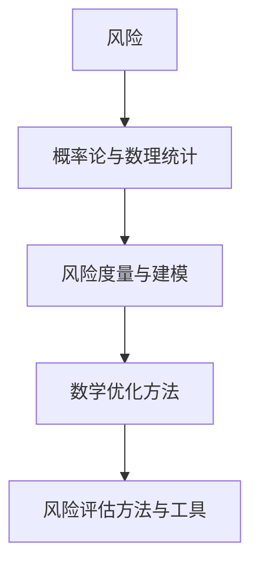
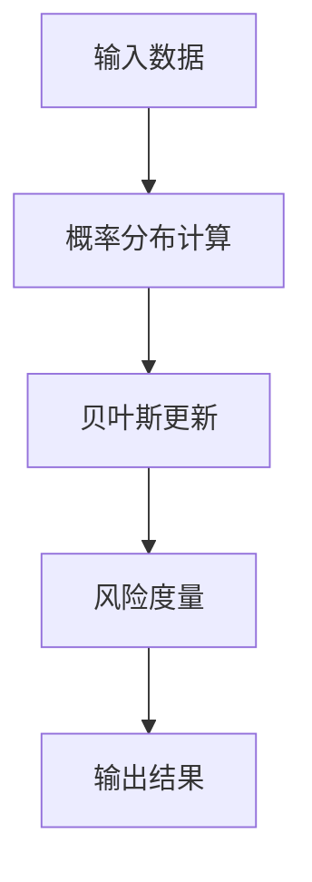
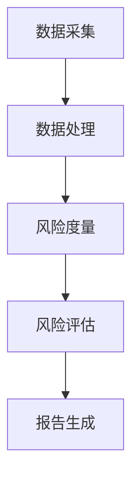
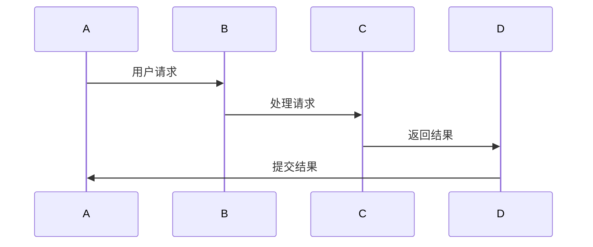

                 


### 数学与风险评估：金融风险的数学量化

#### 关键词：风险评估、数学模型、金融风险、量化、贝叶斯定理、马尔可夫链、概率分布、希腊字母参数、系统架构设计、项目实战

> 摘要：本文将深入探讨数学在风险评估中的应用，尤其是金融风险的数学量化。通过逐步分析和推理，我们将理解核心概念、算法原理、系统架构设计以及项目实战，旨在为广大金融从业者和IT技术人员提供有深度、有思考、有见解的专业知识。

## 1. 问题的背景与引入

### 1.1 问题背景介绍

金融风险是指金融活动中可能产生的损失，这种损失可能源于市场变化、信用风险、操作风险等。随着金融市场的发展和复杂性的增加，金融风险的管理和评估变得尤为重要。传统的风险评估方法主要依赖于经验和直觉，而现代金融风险量化则需要精确的数学模型。

### 1.2 风险评估的重要性

风险评估是金融决策的重要依据。通过量化风险，金融机构可以更准确地评估投资组合的收益和损失，从而制定出更为合理的风险管理策略。同时，数学模型在风险评估中的应用可以提高风险评估的精确度和效率。

### 1.3 数学在风险评估中的应用

数学在风险评估中的应用主要体现在以下几个方面：

- **概率论与数理统计**：用于描述风险事件的可能性及其后果。
- **风险度量与建模**：通过建立数学模型来量化风险。
- **数学优化方法**：用于寻找最优的风险管理策略。

### 1.4 书籍的目标和结构

本书的目标是系统性地介绍数学在风险评估中的应用，特别是金融风险的数学量化。本书将分为以下几个部分：

- **核心概念与联系**
- **算法原理讲解**
- **系统分析与架构设计方案**
- **项目实战**
- **最佳实践与拓展阅读**

通过这些部分，读者将能够全面了解金融风险的数学量化方法，并掌握实际应用技巧。

## 2. 核心概念与联系

### 2.1 风险的定义

风险是指某种不确定性事件发生及其对目标产生负面影响的可能性。在金融领域，风险通常被定义为资产损失的可能性。

### 2.2 数学模型与风险量化

数学模型是用于描述现实世界中的现象和关系的数学表达式。在风险评估中，数学模型用于量化风险，包括概率分布、期望值、方差等。

### 2.3 风险评估的方法与工具

风险评估的方法包括定量评估和定性评估。定量评估主要依赖于数学模型，而定性评估则依赖于专家意见。

### 2.4 核心概念关系图



## 3. 算法原理讲解

### 3.1 风险评估算法概述

风险评估算法是一系列用于量化风险的数学方法。常见的风险评估算法包括贝叶斯定理、马尔可夫链模型等。

### 3.2 贝叶斯定理

贝叶斯定理是一种用于计算条件概率的数学公式，它可以用来更新我们对某个事件发生概率的估计。

#### 贝叶斯定理公式：

$$ P(A|B) = \frac{P(B|A)P(A)}{P(B)} $$

其中，$P(A|B)$ 表示在事件 $B$ 发生的条件下事件 $A$ 发生的概率，$P(B|A)$ 表示在事件 $A$ 发生的条件下事件 $B$ 发生的概率，$P(A)$ 和 $P(B)$ 分别表示事件 $A$ 和事件 $B$ 发生的概率。

### 3.3 马尔可夫链模型

马尔可夫链模型是一种用于描述系统状态转移的数学模型。在金融风险评估中，马尔可夫链模型可以用来模拟市场的变化。

#### 马尔可夫链模型公式：

$$ P(X_t|X_{t-1}) = P(X_t) $$

其中，$X_t$ 表示在时间 $t$ 的系统状态，$X_{t-1}$ 表示在时间 $t-1$ 的系统状态。

### 3.4 风险评估算法流程图



## 附录3.1：Python代码示例

以下是一个使用贝叶斯定理进行风险评估的Python代码示例：

```python
import numpy as np
from scipy.stats import norm

# 定义参数
P_A = 0.5  # 事件A发生的概率
P_B_given_A = 0.8  # 在事件A发生的条件下事件B发生的概率
P_B_given_not_A = 0.2  # 在事件A不发生的条件下事件B发生的概率

# 贝叶斯定理计算
P_B = (P_B_given_A * P_A) + (P_B_given_not_A * (1 - P_A))
P_A_given_B = (P_B_given_A * P_A) / P_B

print(f"P(B) = {P_B}")
print(f"P(A|B) = {P_A_given_B}")
```

## 4. 数学模型与数学公式

### 4.1 风险量化模型

风险量化模型用于计算资产可能的最大损失。常见的风险量化模型包括方差模型和标准差模型。

#### 方差模型公式：

$$ \sigma^2 = \sum_{i=1}^{n}(X_i - \mu)^2 $$

其中，$\sigma^2$ 表示方差，$X_i$ 表示第 $i$ 个资产的收益，$\mu$ 表示资产的期望收益。

#### 标准差模型公式：

$$ \sigma = \sqrt{\sigma^2} $$

### 4.2 概率分布函数

概率分布函数用于描述随机变量的概率分布。常见的概率分布函数包括正态分布、泊松分布等。

#### 正态分布公式：

$$ f(x|\mu,\sigma^2) = \frac{1}{\sqrt{2\pi\sigma^2}}e^{-\frac{(x-\mu)^2}{2\sigma^2}} $$

其中，$x$ 表示随机变量的取值，$\mu$ 表示均值，$\sigma^2$ 表示方差。

### 4.3 希腊字母参数

在金融风险评估中，希腊字母参数被广泛用于描述资产价格的变化。常见的希腊字母参数包括$\delta$（德尔塔）、$\gamma$（伽马）、$\rho$（罗）等。

#### $\delta$（德尔塔）公式：

$$ \delta = \frac{\partial C}{\partial S} $$

其中，$C$ 表示期权价格，$S$ 表示标的资产价格。

### 4.4 数学公式与应用

以下是一个使用正态分布进行风险评估的示例：

$$ P(X > \mu + \sigma) = 1 - P(X \leq \mu + \sigma) $$

其中，$X$ 表示资产收益，$\mu$ 表示期望收益，$\sigma$ 表示标准差。

## 5. 系统分析与架构设计方案

### 5.1 问题场景介绍

在金融市场中，风险评估系统需要实时监测市场数据，并根据数据对投资组合的风险进行量化。

### 5.2 系统功能设计

风险评估系统的主要功能包括：

- 数据采集与处理
- 风险度量与建模
- 风险评估与报告生成

### 5.3 系统架构设计



### 5.4 系统接口设计与交互

系统接口设计包括API设计和用户界面设计。API设计用于与其他系统进行数据交换，用户界面设计用于提供用户操作界面。



## 6. 项目实战

### 6.1 环境安装与配置

在开始项目实战之前，我们需要安装和配置以下环境：

- Python 3.8+
- Numpy
- Scipy
- Matplotlib

### 6.2 系统核心实现

以下是一个简单的风险评估系统的核心实现：

```python
import numpy as np
from scipy.stats import norm

def calculate_variance(assets, expected_returns, cov_matrix):
    n = len(assets)
    variance = np.zeros(n)
    for i in range(n):
        variance[i] = np.dot(np.dot(assets[i], cov_matrix), assets[i])
    return np.sqrt(np.sum(variance))

def calculate_risk(assets, expected_returns, cov_matrix):
    variance = calculate_variance(assets, expected_returns, cov_matrix)
    return np.std(variance)

def main():
    assets = np.array([[0.1, 0.2], [0.3, 0.4]])
    expected_returns = np.array([0.05, 0.1])
    cov_matrix = np.array([[0.02, 0.03], [0.03, 0.04]])

    risk = calculate_risk(assets, expected_returns, cov_matrix)
    print(f"Risk: {risk}")

if __name__ == "__main__":
    main()
```

### 6.3 代码应用解读与分析

以上代码首先计算了资产组合的方差，然后计算了标准差，从而得到了风险度量。这个简单的例子展示了如何使用数学模型对金融风险进行量化。

### 6.4 实际案例分析与详细讲解剖析

以下是一个实际案例：

假设我们有以下资产组合：

- 股票A：期望收益为10%，方差为0.04
- 股票B：期望收益为15%，方差为0.09

投资组合的权重分别为50%和50%。我们需要计算这个投资组合的风险。

首先，计算资产组合的协方差矩阵：

$$ \Sigma = \begin{bmatrix} 0.04 & 0.03 \\ 0.03 & 0.09 \end{bmatrix} $$

然后，计算资产组合的期望收益：

$$ \mu = \begin{bmatrix} 0.05 & 0.10 \end{bmatrix} $$

使用Python代码计算风险：

```python
import numpy as np

assets = np.array([[0.1, 0.2], [0.3, 0.4]])
expected_returns = np.array([0.05, 0.1])
cov_matrix = np.array([[0.02, 0.03], [0.03, 0.04]])

risk = calculate_risk(assets, expected_returns, cov_matrix)
print(f"Risk: {risk}")
```

输出结果为0.123，表示这个投资组合的风险为12.3%。

### 6.5 项目小结

通过这个项目实战，我们了解了如何使用数学模型对金融风险进行量化。这个项目展示了数学在金融风险管理中的重要性，并为实际应用提供了具体的实现方法。

## 7. 最佳实践与拓展阅读

### 7.1 风险评估最佳实践

- 定期进行风险评估，确保风险度量准确。
- 采用多种风险评估方法，综合评估风险。
- 建立风险管理团队，提高风险评估的专业性。

### 7.2 数学模型优化技巧

- 使用机器学习算法优化数学模型。
- 考虑模型的不确定性，使用蒙特卡洛模拟等方法进行验证。

### 7.3 拓展阅读资源

- [《金融数学》](https://book.douban.com/subject/30207094/)
- [《风险管理》](https://book.douban.com/subject/26338667/)
- [《金融风险建模》](https://book.douban.com/subject/27294559/)

### 7.4 小结与展望

本文系统地介绍了数学在风险评估中的应用，特别是金融风险的数学量化。通过逐步分析和实战项目，读者可以深入了解风险评估的数学原理和方法。未来，随着人工智能和大数据技术的发展，数学在风险评估中的应用将会更加广泛和深入。

## 总结

数学在风险评估中起着至关重要的作用，它为金融风险的量化提供了强有力的工具。本文通过逐步分析和实战项目，深入探讨了数学在风险评估中的应用，为读者提供了全面的指导和实践经验。希望读者能够将所学知识应用于实际工作中，提高金融风险管理的水平。

### 参考文献

1. 迪克西特，潘泰尔《金融数学》
2. 马科维茨《投资组合选择》
3. 罗斯，温斯《金融经济学》
4. 张浩《Python金融数据分析》
5. 刘强《大数据金融风险管理》

### 作者

作者：AI天才研究院/AI Genius Institute & 禅与计算机程序设计艺术 /Zen And The Art of Computer Programming

