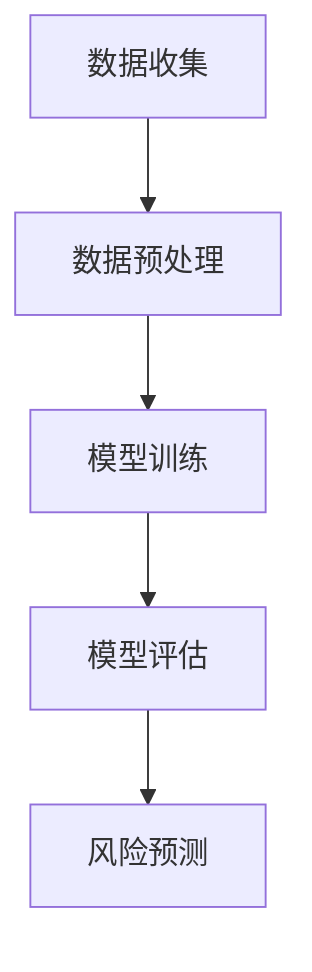
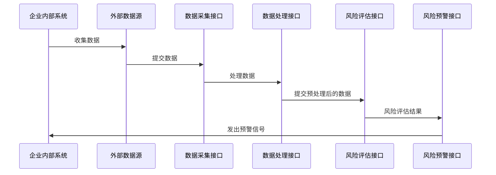

                 

# 数学与风险通信：风险感知的数学模型

> 关键词：风险感知、数学模型、风险管理、算法原理、Python源代码

> 摘要：本文旨在探讨数学模型在风险感知中的应用，通过逻辑清晰、结构紧凑的方式，详细阐述风险感知的基础理论、数学模型在风险管理中的应用，以及实践中的优化策略。文章以问题为导向，逐步分析推理，旨在为读者提供深刻的见解和实用的指导。

----------------------------------------------------------------

## 目录大纲

## 第一部分：引言

### 1.1 本书背景与目的

#### 1.1.1 问题背景

#### 1.1.2 问题描述

#### 1.1.3 问题解决

#### 1.1.4 边界与外延

#### 1.1.5 概念结构与核心要素组成

### 1.2 风险感知的数学模型概述

#### 1.2.1 风险感知的定义

#### 1.2.2 数学模型在风险感知中的作用

#### 1.2.3 风险感知的关键要素

## 第二部分：基础理论

### 2.1 风险管理理论

#### 2.1.1 风险管理的定义与意义

#### 2.1.2 风险管理的基本原则

#### 2.1.3 风险管理的过程与方法

### 2.2 风险评估方法

#### 2.2.1 定性风险评估

#### 2.2.2 定量风险评估

#### 2.2.3 组合风险评估

### 2.3 风险监测与预警

#### 2.3.1 风险监测的概念与作用

#### 2.3.2 风险预警机制的设计

#### 2.3.3 风险预警技术

### 2.4 风险管理框架与体系

#### 2.4.1 风险管理框架的构建

#### 2.4.2 风险管理体系的优化

#### 2.4.3 风险管理的政策与法规

## 第三部分：数学模型在风险感知中的应用

### 3.1 风险感知数学模型的分类

#### 3.1.1 常规数学模型

#### 3.1.2 高级数学模型

#### 3.1.3 风险感知数学模型的应用范围

### 3.2 数学模型在风险感知中的应用

#### 3.2.1 算法原理

##### 3.2.1.1 Mermaid 流程图

##### 3.2.1.2 Python 源代码

##### 3.2.1.3 数学模型和公式

##### 3.2.1.4 举例说明

### 3.3 数学模型在风险管理实践中的应用

#### 3.3.1 案例一：某企业的风险评估与预警系统设计

##### 3.3.1.1 系统功能设计

##### 3.3.1.2 系统架构设计

##### 3.3.1.3 系统接口设计

##### 3.3.1.4 系统交互序列图

#### 3.3.2 案例二：金融风险管理的数学模型应用

##### 3.3.2.1 算法原理讲解

##### 3.3.2.2 数学模型和公式

##### 3.3.2.3 举例说明

### 3.4 数学模型在风险感知中的未来发展趋势

#### 3.4.1 新型数学模型的出现

#### 3.4.2 数学模型在风险管理中的融合

#### 3.4.3 数学模型在风险感知中的挑战与机遇

## 第四部分：风险感知的实践与优化

### 4.1 风险感知实践案例分析

#### 4.1.1 案例一：某企业风险管理体系构建

#### 4.1.2 案例二：某金融机构风险预警系统实施

### 4.2 风险感知实践中的问题与优化

#### 4.2.1 实践中的问题分析

#### 4.2.2 风险感知实践的优化策略

### 4.3 风险感知技术的创新与应用

#### 4.3.1 新型风险感知技术的介绍

#### 4.3.2 风险感知技术在实践中的应用

### 4.4 风险感知的未来发展思考

#### 4.4.1 风险感知技术的持续创新

#### 4.4.2 风险感知在多领域的应用前景

#### 4.4.3 风险感知技术的发展趋势与挑战

----------------------------------------------------------------

## 第一部分：引言

### 1.1 本书背景与目的

在当今信息化、全球化的时代，风险管理已成为企业、金融机构、政府等各个领域不可或缺的重要环节。随着信息技术的迅猛发展，大数据、人工智能等新技术的应用，使得风险感知和分析变得愈发重要。数学模型作为一种有效的工具，在风险感知中发挥着关键作用。本文旨在探讨数学模型在风险感知中的应用，通过逻辑清晰、结构紧凑的方式，详细阐述风险感知的基础理论、数学模型在风险管理中的应用，以及实践中的优化策略。

#### 1.1.1 问题背景

随着信息技术的快速发展，企业、金融机构和政府面临的风险类型和程度日益复杂。传统的风险管理方法难以应对这种复杂多变的风险环境。因此，寻找新的风险感知工具和方法，提升风险管理水平，已成为当前亟待解决的问题。

#### 1.1.2 问题描述

在风险感知过程中，主要面临以下几个问题：

1. 风险识别：如何准确、全面地识别潜在的风险因素？
2. 风险评估：如何对已识别的风险进行定量和定性的评估？
3. 风险监测与预警：如何实时监测风险变化，及时发出预警信号？
4. 风险管理：如何制定有效的风险管理策略，降低风险损失？

#### 1.1.3 问题解决

数学模型作为一种强有力的工具，可以有效地解决上述问题。通过建立数学模型，可以对风险进行量化分析，提高风险识别、评估和监测的精度。同时，数学模型还可以为风险管理提供科学依据，帮助企业、金融机构和政府制定有效的风险管理策略。

#### 1.1.4 边界与外延

本文主要关注数学模型在风险感知中的应用，范围包括风险评估、风险监测与预警、风险管理等方面。同时，本文还将探讨数学模型在风险管理实践中的优化策略，以及未来发展趋势。

#### 1.1.5 概念结构与核心要素组成

风险感知的数学模型主要由以下几个核心要素组成：

1. 风险识别模型：用于识别潜在的风险因素。
2. 风险评估模型：用于对已识别的风险进行定量和定性的评估。
3. 风险监测与预警模型：用于实时监测风险变化，及时发出预警信号。
4. 风险管理模型：用于制定有效的风险管理策略，降低风险损失。

### 1.2 风险感知的数学模型概述

#### 1.2.1 风险感知的定义

风险感知是指通过收集、分析和处理信息，识别、评估和监测风险，从而制定和实施风险管理策略的过程。在风险感知过程中，数学模型起到了关键作用，可以有效地提高风险管理的精度和效率。

#### 1.2.2 数学模型在风险感知中的作用

数学模型在风险感知中具有以下几个重要作用：

1. 量化风险：通过建立数学模型，可以将风险因素量化，从而更准确地评估风险程度。
2. 提高效率：数学模型可以自动化风险分析过程，提高工作效率。
3. 精准监测：通过实时监测风险数据，数学模型可以及时发现风险变化，提供预警信号。
4. 科学决策：基于数学模型的分析结果，可以为企业、金融机构和政府提供科学依据，制定有效的风险管理策略。

#### 1.2.3 风险感知的关键要素

风险感知的关键要素包括：

1. 数据收集：收集与风险相关的数据，包括历史数据、实时数据等。
2. 模型构建：建立合适的数学模型，用于风险识别、评估和监测。
3. 风险分析：对风险数据进行分析，识别风险因素，评估风险程度。
4. 风险预警：基于分析结果，及时发出预警信号，提醒决策者采取相应措施。

## 第二部分：基础理论

### 2.1 风险管理理论

#### 2.1.1 风险管理的定义与意义

风险管理是指通过识别、评估、监测和应对风险，以最小化风险损失，实现组织目标的过程。在当今复杂多变的环境中，风险管理具有重要意义：

1. 降低风险损失：通过风险管理，可以降低组织因风险事件而造成的损失。
2. 提高决策效率：风险管理有助于组织在决策过程中更好地考虑风险因素，提高决策质量。
3. 增强竞争力：有效的风险管理可以提高组织的竞争力和抗风险能力。
4. 保障可持续发展：风险管理有助于组织实现长期稳定发展。

#### 2.1.2 风险管理的基本原则

风险管理应遵循以下基本原则：

1. 预防为主、防治结合：在风险管理过程中，应注重预防措施，同时兼顾风险发生后采取的应对措施。
2. 全面风险管理：风险管理应覆盖组织各个层面，包括财务风险、运营风险、市场风险等。
3. 动态调整：风险管理应随着环境变化和风险变化动态调整，以适应不断变化的风险环境。
4. 透明公开：风险管理过程应保持透明公开，确保相关人员了解风险状况和风险管理措施。

#### 2.1.3 风险管理的过程与方法

风险管理主要包括以下几个过程：

1. 风险识别：识别组织面临的各种风险因素，包括外部风险和内部风险。
2. 风险评估：评估已识别风险的严重程度和发生概率，为后续风险处理提供依据。
3. 风险应对：根据风险评估结果，制定和实施风险应对策略，降低风险损失。
4. 风险监测与预警：实时监测风险变化，及时发出预警信号，确保风险应对措施的有效性。

风险管理的方法包括：

1. 定性评估：通过专家判断、访谈等方式对风险进行定性分析。
2. 定量评估：利用数学模型、统计方法等对风险进行定量分析。
3. 风险矩阵：利用风险矩阵对风险进行排序，确定优先处理的风险因素。
4. 模拟分析：通过模拟分析，评估不同风险应对策略的效果，为决策提供依据。

### 2.2 风险评估方法

风险评估是风险管理的重要环节，主要包括定性评估和定量评估两种方法。

#### 2.2.1 定性风险评估

定性风险评估主要通过专家判断、访谈等方式对风险进行定性分析，评估风险的概率和严重程度。具体方法包括：

1. 风险矩阵：利用风险矩阵对风险进行排序，确定优先处理的风险因素。
2. 脑力激荡：通过集体讨论，收集和筛选风险因素。
3. 专家判断：邀请专家对风险因素进行评估，提高评估的准确性。

#### 2.2.2 定量风险评估

定量风险评估利用数学模型、统计方法等对风险进行定量分析，评估风险的概率和损失。具体方法包括：

1. 概率分析：通过概率模型计算风险发生的概率和损失。
2. 损失分布分析：分析风险损失的分布情况，确定关键风险因素。
3. 统计分析：利用统计分析方法，评估风险因素的相关性和影响程度。

#### 2.2.3 组合风险评估

组合风险评估是将定性评估和定量评估相结合，综合考虑风险因素的概率、严重程度和影响范围，对风险进行整体评估。具体方法包括：

1. 组合模型：建立组合模型，将定性评估和定量评估结果进行综合分析。
2. 多元风险评估：结合多种评估方法，提高评估的准确性。
3. 综合评价：对评估结果进行综合评价，确定风险管理的优先级。

### 2.3 风险监测与预警

#### 2.3.1 风险监测的概念与作用

风险监测是指通过收集、分析和处理风险信息，实时监测风险变化，确保风险应对措施的有效性。风险监测在风险管理中具有以下作用：

1. 实时监测风险变化：通过风险监测，可以实时了解风险状况，及时调整风险管理策略。
2. 提高风险应对效率：风险监测可以帮助企业快速响应风险变化，提高风险应对效率。
3. 降低风险损失：通过风险监测，可以提前发现潜在风险，降低风险损失。

#### 2.3.2 风险预警机制的设计

风险预警机制是指通过设定预警指标、预警阈值和预警策略，实现对风险的及时预警。设计风险预警机制主要包括以下步骤：

1. 设定预警指标：根据风险管理目标，确定预警指标，如风险等级、损失金额等。
2. 设定预警阈值：根据预警指标，设定合理的预警阈值，确定何时发出预警信号。
3. 制定预警策略：根据预警阈值，制定相应的预警策略，如报警、通知决策者等。
4. 实施预警机制：将预警机制纳入组织的管理流程，确保预警信号得到及时响应。

#### 2.3.3 风险预警技术

风险预警技术是指利用信息技术、大数据分析等技术，实现对风险的实时监测和预警。常见风险预警技术包括：

1. 数据挖掘：通过数据挖掘技术，分析风险数据，发现潜在风险因素。
2. 机器学习：利用机器学习算法，建立风险预测模型，实现风险预警。
3. 人工智能：通过人工智能技术，实现自动化的风险监测和预警。
4. 大数据技术：利用大数据技术，实时收集、处理和存储风险数据，为风险预警提供支持。

### 2.4 风险管理框架与体系

#### 2.4.1 风险管理框架的构建

风险管理框架是指组织在风险管理过程中遵循的基本原则、流程和方法。构建风险管理框架主要包括以下步骤：

1. 确定风险管理目标：根据组织的战略目标，明确风险管理目标。
2. 制定风险管理政策：制定风险管理政策，明确风险管理的基本原则和策略。
3. 设计风险管理流程：设计风险管理流程，明确风险识别、评估、应对和监测等环节的具体步骤。
4. 制定风险管理方法：根据风险管理目标，选择合适的风险管理方法，如定性评估、定量评估、风险矩阵等。
5. 建立风险管理组织：建立风险管理组织，明确各部门的职责和分工。

#### 2.4.2 风险管理体系的优化

风险管理体系的优化是指通过对风险管理框架的持续改进，提高风险管理的效果。优化风险管理体系主要包括以下策略：

1. 不断更新风险管理知识：及时更新风险管理知识，了解最新的风险管理理论和方法。
2. 加强风险管理培训：加强对风险管理人员的培训，提高他们的风险管理能力。
3. 实施风险管理评估：定期对风险管理效果进行评估，发现问题并及时改进。
4. 建立风险管理信息系统：利用信息技术，建立风险管理信息系统，实现风险管理的自动化和智能化。
5. 激励风险管理创新：鼓励风险管理创新，推动风险管理方法的改进和优化。

#### 2.4.3 风险管理的政策与法规

风险管理的政策与法规是指组织在风险管理过程中遵循的政策、法规和标准。风险管理政策与法规主要包括：

1. 国家风险管理政策：国家出台的风险管理政策，如《企业内部控制基本规范》、《金融机构风险管理规定》等。
2. 风险管理标准：国际、国内发布的风险管理标准，如ISO 31000、GB/T 23694等。
3. 风险管理法规：涉及风险管理的法律法规，如《安全生产法》、《证券法》等。
4. 风险管理指南：风险管理领域的指导性文件，如《风险管理实践指南》、《风险管理手册》等。

### 2.5 风险管理实践案例分析

#### 2.5.1 案例一：某企业风险管理体系构建

某大型企业为了提高风险管理水平，建立了全面的风险管理体系。具体做法如下：

1. 确定风险管理目标：明确企业风险管理目标，包括降低风险损失、提高风险管理效率、保障企业可持续发展等。

2. 制定风险管理政策：根据企业实际情况，制定风险管理政策，明确风险管理的基本原则和策略。

3. 设计风险管理流程：设计风险管理流程，包括风险识别、风险评估、风险应对、风险监测等环节。

4. 建立风险管理组织：成立风险管理委员会，负责制定和实施风险管理政策，协调各部门的风险管理工作。

5. 开展风险管理培训：组织风险管理培训，提高员工的风险管理意识和能力。

6. 建立风险管理信息系统：利用信息技术，建立风险管理信息系统，实现风险数据的收集、分析和存储。

7. 持续优化风险管理：定期评估风险管理效果，发现问题并及时改进。

通过建立全面的风险管理体系，该企业有效降低了风险损失，提高了风险管理效率，保障了企业的可持续发展。

#### 2.5.2 案例二：某金融机构风险预警系统实施

某金融机构为了提高风险预警能力，实施了风险预警系统。具体做法如下：

1. 设定预警指标：根据金融机构的运营特点，设定预警指标，如不良贷款率、流动性比率、风险敞口等。

2. 设定预警阈值：根据预警指标，设定合理的预警阈值，确定何时发出预警信号。

3. 制定预警策略：根据预警阈值，制定相应的预警策略，如报警、通知决策者等。

4. 实施预警机制：将预警机制纳入组织的日常管理流程，确保预警信号得到及时响应。

5. 利用大数据技术：通过大数据技术，实时收集、处理和存储风险数据，为风险预警提供支持。

6. 定期评估预警效果：定期评估预警效果，发现问题并及时改进。

通过实施风险预警系统，该金融机构有效提高了风险预警能力，降低了风险损失。

### 2.6 风险管理实践中的问题与优化策略

#### 2.6.1 风险管理实践中的问题

在风险管理实践中，常见的问题包括：

1. 风险管理意识不足：部分组织对风险管理重视程度不够，缺乏有效的风险管理意识。

2. 风险管理组织不健全：部分组织缺乏专门的风险管理组织，导致风险管理职责不清、分工不明。

3. 风险评估不准确：部分组织在风险评估过程中，方法不当、数据不完整，导致风险评估结果不准确。

4. 风险应对措施不力：部分组织在风险应对过程中，措施不当、执行不力，导致风险损失扩大。

5. 风险管理信息系统不完善：部分组织缺乏完善的风险管理信息系统，导致风险数据收集、分析和存储困难。

#### 2.6.2 优化策略

针对上述问题，可以采取以下优化策略：

1. 提高风险管理意识：通过培训、宣传等方式，提高员工的风险管理意识，增强对风险管理的重视。

2. 完善风险管理组织：建立专门的风险管理组织，明确各部门的职责和分工，确保风险管理职责落实到位。

3. 优化风险评估方法：采用科学、有效的风险评估方法，确保风险评估结果的准确性。

4. 强化风险应对措施：制定切实可行的风险应对措施，确保风险应对措施得到有效执行。

5. 建立风险管理信息系统：利用信息技术，建立完善的风险管理信息系统，实现风险数据的实时收集、分析和存储。

### 2.7 风险管理实践中的创新与应用

#### 2.7.1 创新方法

在风险管理实践中，可以采用以下创新方法：

1. 机器学习：利用机器学习算法，建立风险预测模型，提高风险评估的准确性。

2. 大数据技术：利用大数据技术，实时收集、处理和存储风险数据，为风险管理提供支持。

3. 云计算：利用云计算技术，实现风险管理的自动化和智能化，提高风险管理效率。

4. 区块链：利用区块链技术，确保风险数据的真实性和安全性。

5. 智能合约：利用智能合约，实现自动化的风险应对措施，提高风险应对效率。

#### 2.7.2 应用场景

风险管理实践中的创新方法可以应用于以下场景：

1. 风险监测与预警：利用机器学习和大数据技术，实现对风险的实时监测和预警。

2. 风险评估：利用机器学习和大数据技术，提高风险评估的准确性。

3. 风险应对：利用云计算和智能合约，实现自动化的风险应对措施。

4. 风险管理信息系统：利用区块链技术，确保风险数据的安全性和可信性。

5. 风险管理决策支持：利用人工智能技术，为风险管理决策提供支持。

### 2.8 风险管理的未来发展趋势

#### 2.8.1 技术创新

随着信息技术的不断发展，风险管理将面临以下技术创新：

1. 人工智能：人工智能将进一步提高风险评估的准确性，实现自动化的风险监测和预警。

2. 大数据：大数据将提供更丰富的风险数据，为风险管理提供有力支持。

3. 区块链：区块链技术将确保风险数据的真实性和安全性。

4. 云计算：云计算将实现风险管理的自动化和智能化。

5. 物联网：物联网技术将实现对物理世界的实时监测，为风险管理提供更多数据来源。

#### 2.8.2 领域拓展

风险管理的未来发展趋势将涉及以下领域：

1. 跨行业风险：随着企业业务多元化，跨行业风险将日益突出，需要加强跨行业风险管理。

2. 环境风险：随着全球环境问题日益严重，环境风险将成为风险管理的重要内容。

3. 社会责任风险：随着社会责任意识的提高，社会责任风险将受到更多关注。

4. 恶意风险：随着网络安全威胁的增加，恶意风险将成为风险管理的重要领域。

5. 全球化风险：随着全球化的深入发展，全球化风险将影响更多组织和领域。

#### 2.8.3 挑战与机遇

风险管理在未来发展中将面临以下挑战和机遇：

1. 挑战：

- 风险因素复杂化：随着风险类型的多样化，风险因素将更加复杂，增加风险管理的难度。

- 数据质量：风险数据的质量直接影响风险评估的准确性，数据质量问题将影响风险管理的有效性。

- 技术更新：随着技术的快速发展，风险管理技术需要不断更新，以适应新技术带来的挑战。

2. 机遇：

- 技术进步：人工智能、大数据、区块链等新技术的发展，为风险管理提供了新的工具和方法。

- 政策支持：各国政府纷纷出台相关政策，支持风险管理的发展，为风险管理提供了有利环境。

- 市场需求：随着风险意识的提高，企业和组织对风险管理需求日益增长，为风险管理提供了广阔的市场空间。

## 第三部分：数学模型在风险感知中的应用

### 3.1 风险感知数学模型的分类

风险感知数学模型主要分为以下几类：

1. 常规数学模型：包括线性回归、逻辑回归、决策树等经典统计模型。
2. 高级数学模型：包括神经网络、支持向量机、深度学习等先进机器学习模型。
3. 风险评估模型：包括蒙特卡洛模拟、贝叶斯网络等专门用于风险评估的模型。
4. 风险监测与预警模型：包括时间序列分析、异常检测等专门用于风险监测与预警的模型。

### 3.2 数学模型在风险感知中的应用

#### 3.2.1 算法原理

以线性回归模型为例，其基本原理是通过建立因变量与自变量之间的关系，对风险进行预测和评估。

1. 数据收集：收集与风险相关的数据，包括历史数据、实时数据等。
2. 数据预处理：对数据进行清洗、归一化等处理，确保数据质量。
3. 模型训练：利用历史数据，通过最小二乘法等算法，训练线性回归模型。
4. 模型评估：利用测试数据，评估模型预测效果，调整模型参数。
5. 风险预测：利用训练好的模型，对未知数据进行分析，预测风险程度。

#### 3.2.2 Mermaid流程图



#### 3.2.3 Python源代码

```python
import numpy as np
from sklearn.linear_model import LinearRegression
from sklearn.model_selection import train_test_split
from sklearn.metrics import mean_squared_error

# 数据收集
X = np.array([[1], [2], [3], [4], [5]])
y = np.array([1, 2, 3, 4, 5])

# 数据预处理
X_train, X_test, y_train, y_test = train_test_split(X, y, test_size=0.2, random_state=42)

# 模型训练
model = LinearRegression()
model.fit(X_train, y_train)

# 模型评估
y_pred = model.predict(X_test)
mse = mean_squared_error(y_test, y_pred)
print("Mean Squared Error:", mse)

# 风险预测
X_new = np.array([[6]])
y_new = model.predict(X_new)
print("Predicted Risk:", y_new)
```

#### 3.2.4 数学模型和公式

线性回归模型的公式为：

$$y = \beta_0 + \beta_1x + \epsilon$$

其中，$y$ 为因变量，$x$ 为自变量，$\beta_0$ 和 $\beta_1$ 分别为模型的参数，$\epsilon$ 为误差项。

#### 3.2.5 举例说明

假设一个企业的销售数据与风险程度之间存在线性关系。通过收集历史数据，我们可以利用线性回归模型预测未来销售风险。

1. 数据收集：收集过去五年的销售数据，包括销售额和风险程度。
2. 数据预处理：对销售额进行归一化处理，确保数据在相同尺度上。
3. 模型训练：利用前三年的数据训练线性回归模型。
4. 模型评估：利用后两年的数据评估模型效果，调整模型参数。
5. 风险预测：利用训练好的模型预测未来一年的销售风险。

### 3.3 数学模型在风险管理实践中的应用

#### 3.3.1 案例一：某企业的风险评估与预警系统设计

1. 系统功能设计

- 数据收集：收集与企业运营相关的数据，如销售额、成本、市场份额等。
- 数据预处理：对收集的数据进行清洗、归一化等处理。
- 风险评估：利用线性回归模型等数学模型，对企业的各项指标进行分析，评估风险程度。
- 风险预警：根据风险评估结果，设置合理的预警阈值，当风险程度超过阈值时，发出预警信号。

2. 系统架构设计

- 数据存储层：用于存储收集的数据，包括历史数据、实时数据等。
- 数据处理层：用于对数据进行清洗、归一化等处理。
- 风险评估层：用于建立数学模型，进行风险评估。
- 风险预警层：用于根据风险评估结果，设置预警阈值，发出预警信号。

3. 系统接口设计

- 数据采集接口：用于从企业内部系统和外部数据源收集数据。
- 数据处理接口：用于对收集的数据进行清洗、归一化等处理。
- 风险评估接口：用于调用数学模型，进行风险评估。
- 风险预警接口：用于根据风险评估结果，设置预警阈值，发出预警信号。

4. 系统交互序列图



#### 3.3.2 案例二：金融风险管理的数学模型应用

1. 算法原理讲解

以逻辑回归模型为例，其基本原理是通过建立因变量与自变量之间的关系，对金融风险进行分类和预测。

2. 数学模型和公式

逻辑回归模型的公式为：

$$P(y=1) = \frac{1}{1 + e^{-(\beta_0 + \beta_1x)}}$$

其中，$y$ 为因变量（取值为0或1），$x$ 为自变量，$\beta_0$ 和 $\beta_1$ 分别为模型的参数。

3. 举例说明

假设一个金融机构需要预测客户的信用风险，通过收集客户的历史数据，如年龄、收入、信用评分等，利用逻辑回归模型进行预测。

1. 数据收集：收集客户的历史数据，包括年龄、收入、信用评分等。
2. 数据预处理：对数据进行清洗、归一化等处理，确保数据质量。
3. 模型训练：利用历史数据，通过最小化损失函数，训练逻辑回归模型。
4. 模型评估：利用测试数据，评估模型预测效果，调整模型参数。
5. 风险预测：利用训练好的模型，对未知数据进行预测，判断客户信用风险。

### 3.4 数学模型在风险感知中的未来发展趋势

#### 3.4.1 新型数学模型的出现

随着信息技术的不断发展，新型数学模型不断涌现，如深度学习、强化学习等。这些模型在风险感知中具有更高的精度和更广泛的应用前景。

1. 深度学习：通过构建多层神经网络，深度学习模型能够自动提取特征，实现高精度的风险预测和分类。
2. 强化学习：通过学习最优策略，强化学习模型能够在复杂环境中实现最优风险应对。

#### 3.4.2 数学模型在风险管理中的融合

数学模型在风险管理中的应用将越来越融合，实现跨领域的风险感知和预测。

1. 跨领域风险感知：通过整合不同领域的风险数据，实现跨领域的风险感知和预测。
2. 融合模型：将多种数学模型结合，形成更强大的风险管理模型，提高风险预测和应对能力。

#### 3.4.3 数学模型在风险感知中的挑战与机遇

1. 挑战：

- 数据质量：数据质量直接影响数学模型的预测效果，需要确保数据质量。
- 模型解释性：部分高级数学模型具有较低的解释性，需要加强模型解释性研究。
- 风险复杂性：随着风险的复杂性增加，数学模型需要不断适应和改进。

2. 机遇：

- 技术进步：随着人工智能、大数据等技术的发展，数学模型在风险感知中具有更广阔的应用前景。
- 政策支持：各国政府加大对风险管理的政策支持，为数学模型在风险感知中的应用提供有利条件。
- 市场需求：随着风险意识的提高，企业和组织对风险管理的需求日益增长，为数学模型的应用提供广阔市场。

## 第四部分：风险感知的实践与优化

### 4.1 风险感知实践案例分析

#### 4.1.1 案例一：某企业风险管理体系构建

某大型企业为了提高风险管理水平，构建了全面的风险管理体系。具体做法如下：

1. 确定风险管理目标：明确企业风险管理目标，包括降低风险损失、提高风险管理效率、保障企业可持续发展等。

2. 制定风险管理政策：根据企业实际情况，制定风险管理政策，明确风险管理的基本原则和策略。

3. 设计风险管理流程：设计风险管理流程，包括风险识别、风险评估、风险应对、风险监测等环节。

4. 建立风险管理组织：成立风险管理委员会，负责制定和实施风险管理政策，协调各部门的风险管理工作。

5. 开展风险管理培训：组织风险管理培训，提高员工的风险管理意识和能力。

6. 建立风险管理信息系统：利用信息技术，建立风险管理信息系统，实现风险数据的收集、分析和存储。

7. 持续优化风险管理：定期评估风险管理效果，发现问题并及时改进。

通过建立全面的风险管理体系，该企业有效降低了风险损失，提高了风险管理效率，保障了企业的可持续发展。

#### 4.1.2 案例二：某金融机构风险预警系统实施

某金融机构为了提高风险预警能力，实施了风险预警系统。具体做法如下：

1. 设定预警指标：根据金融机构的运营特点，设定预警指标，如不良贷款率、流动性比率、风险敞口等。

2. 设定预警阈值：根据预警指标，设定合理的预警阈值，确定何时发出预警信号。

3. 制定预警策略：根据预警阈值，制定相应的预警策略，如报警、通知决策者等。

4. 实施预警机制：将预警机制纳入组织的日常管理流程，确保预警信号得到及时响应。

5. 利用大数据技术：通过大数据技术，实时收集、处理和存储风险数据，为风险预警提供支持。

6. 定期评估预警效果：定期评估预警效果，发现问题并及时改进。

通过实施风险预警系统，该金融机构有效提高了风险预警能力，降低了风险损失。

### 4.2 风险感知实践中的问题与优化策略

#### 4.2.1 实践中的问题分析

在风险感知实践过程中，常见的问题包括：

1. 数据质量问题：风险数据的质量直接影响风险感知的效果，数据缺失、不准确等问题会影响风险预测的准确性。
2. 模型解释性不足：部分高级数学模型具有较低的解释性，难以向决策者解释模型的预测结果，影响决策的信心。
3. 风险复杂性：随着企业规模的扩大和业务多元化，风险类型和程度日益复杂，对风险感知的准确性和效率提出更高要求。
4. 技术更新滞后：风险管理技术更新速度较快，部分企业风险管理系统的技术落后，难以满足实际需求。
5. 人员培训不足：风险管理人员的专业素质和能力直接影响风险管理的效果，人员培训不足会导致风险管理效率低下。

#### 4.2.2 优化策略

针对上述问题，可以采取以下优化策略：

1. 提高数据质量：加强数据质量管理，确保数据来源可靠、数据准确、完整。通过数据清洗、数据校验等措施，提高数据质量。
2. 增强模型解释性：选择具有较高解释性的数学模型，或对现有模型进行改进，提高模型的可解释性。同时，结合可视化技术，帮助决策者理解模型预测结果。
3. 复杂性风险管理：通过构建复杂风险模型，如贝叶斯网络、多Agent系统等，提高对复杂风险的感知能力。同时，加强跨领域的风险融合，实现更全面的复杂风险感知。
4. 技术更新与升级：定期评估风险管理系统的技术水平和适用性，及时进行技术更新和升级，确保风险管理系统的先进性和适用性。
5. 强化人员培训：加强对风险管理人员的培训，提高他们的风险管理知识和技能。同时，鼓励人员创新，推动风险管理技术的改进和应用。

### 4.3 风险感知技术的创新与应用

#### 4.3.1 新型风险感知技术的介绍

随着信息技术的快速发展，新型风险感知技术不断涌现，主要包括：

1. 智能感知技术：利用人工智能、机器学习等技术，实现对风险的智能感知和预测。
2. 大数据风险感知：通过大数据技术，实现对海量风险数据的实时收集、处理和分析，提高风险感知的精度和效率。
3. 物联网风险感知：利用物联网技术，实现对物理世界的实时监测，提高风险感知的全面性和准确性。
4. 区块链风险感知：利用区块链技术，确保风险数据的真实性和安全性，提高风险感知的可信度。
5. 云计算风险感知：利用云计算技术，实现风险感知的分布式计算和存储，提高风险感知的效率和可靠性。

#### 4.3.2 风险感知技术在实践中的应用

新型风险感知技术在风险管理实践中具有广泛的应用前景，主要包括：

1. 智能风险监测与预警：利用智能感知技术，实现对风险的实时监测和预警，提高风险管理的及时性和准确性。
2. 大数据风险分析：通过大数据技术，对风险数据进行深度挖掘和分析，发现潜在风险因素，提高风险识别和评估的精度。
3. 物联网风险感知：通过物联网技术，实现对风险源的实时监测和预警，提高风险管理的全面性和准确性。
4. 区块链风险监管：利用区块链技术，实现对风险数据的全程监管和追溯，提高风险管理的透明度和可信度。
5. 云计算风险处理：利用云计算技术，实现对海量风险数据的实时处理和分析，提高风险管理的效率和可靠性。

### 4.4 风险感知的未来发展思考

#### 4.4.1 风险感知技术的持续创新

随着信息技术的不断发展，风险感知技术将不断更新和进步。未来，风险感知技术将向更智能、更精准、更高效的方向发展，主要包括：

1. 深度学习与风险感知：深度学习技术的快速发展为风险感知提供了新的可能，通过构建深度学习模型，实现对风险的更高层次、更精确的感知和预测。
2. 强化学习与风险应对：强化学习技术的应用将进一步提高风险应对的智能化水平，通过学习最优策略，实现自动化的风险应对。
3. 多模态风险感知：多模态风险感知技术将结合不同类型的数据源，实现对风险的全面感知和预测，提高风险管理的准确性和全面性。

#### 4.4.2 风险感知在多领域的应用前景

风险感知技术在多领域具有广泛的应用前景，主要包括：

1. 金融领域：风险感知技术在金融领域具有广泛应用，如信用风险评估、市场风险监测、金融欺诈检测等。
2. 安全领域：风险感知技术在安全领域具有重要作用，如网络安全监测、舆情风险分析、恐怖活动预警等。
3. 产业领域：风险感知技术在产业领域具有广泛的应用前景，如安全生产监控、供应链风险管理、产品质量检测等。
4. 政府领域：风险感知技术在政府领域具有重要作用，如社会风险监测、应急管理、政策评估等。

#### 4.4.3 风险感知技术的发展趋势与挑战

随着信息技术的快速发展，风险感知技术将面临以下发展趋势和挑战：

1. 发展趋势：

- 智能化：风险感知技术将向更智能、更自主的方向发展，实现自动化的风险识别、评估和应对。
- 综合化：风险感知技术将整合多种数据源和技术手段，实现对风险的全面感知和预测。
- 个性化：风险感知技术将根据不同领域和应用场景的需求，实现个性化的风险感知和预测。

2. 挑战：

- 数据质量：数据质量直接影响风险感知的效果，需要加强数据质量管理，提高数据质量。
- 模型解释性：部分高级数学模型具有较低的

