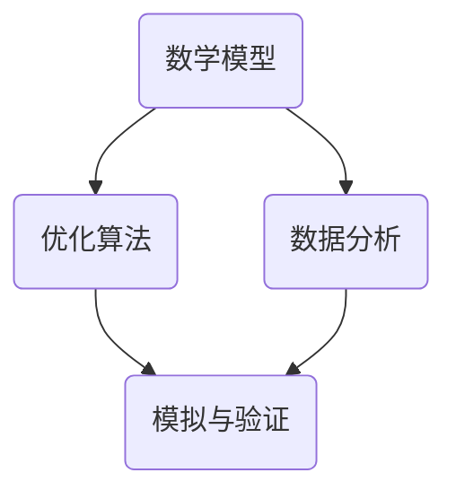
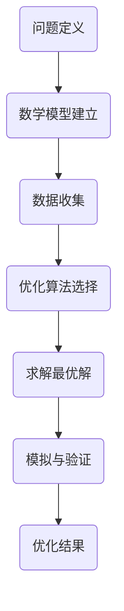
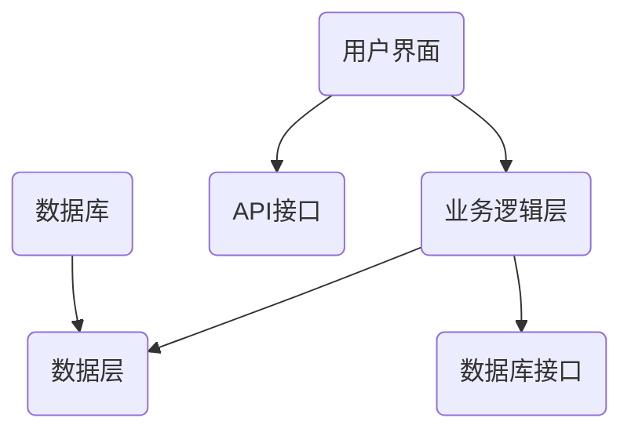
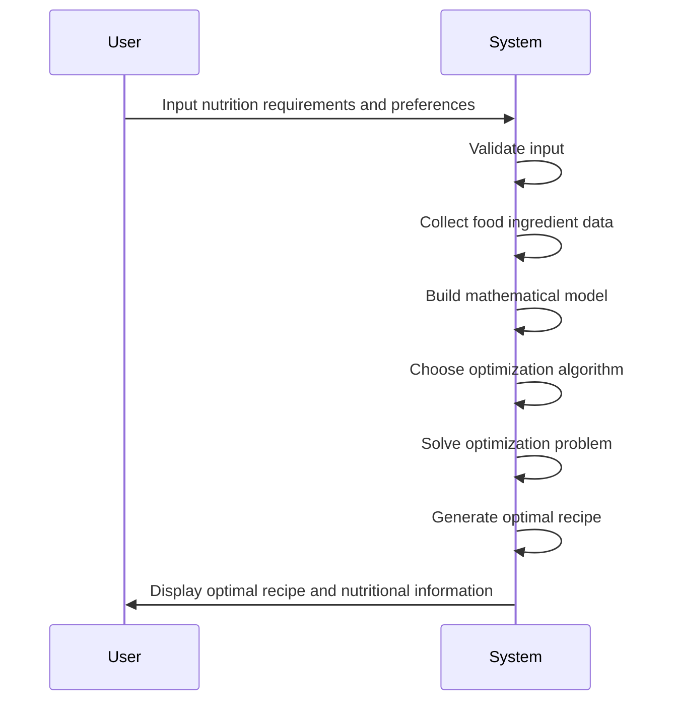

                 

### Step 1: 背景介绍

### 数学与食品科学：食品加工的数学优化

#### 1.1 问题背景

随着科技的进步和人们对食品健康和美味需求的不断提高，食品加工领域对优化技术的需求日益迫切。食品加工涉及到众多复杂的数学问题，如食品成分的分析、热量计算、防腐剂添加量控制等。因此，研究数学与食品科学的交叉领域，对提高食品加工效率、降低成本、保障食品安全具有重要意义。

#### 1.2 问题描述

食品加工中的数学优化问题主要涉及以下几个方面：

1. **食品成分的优化**：如何通过数学模型分析食品中的营养成分，实现营养成分的最佳配比。
2. **热量计算**：如何准确计算食品在加工过程中的热量变化，以保证食品的口感和质量。
3. **防腐剂添加量控制**：如何通过数学模型分析食品防腐剂的最佳添加量，既保证食品的保质期，又避免过量使用防腐剂对健康的影响。

#### 1.3 问题解决

数学与食品科学的交叉研究可以为食品加工提供以下解决方法：

1. **建立数学模型**：通过建立食品加工过程中的数学模型，可以更准确地分析食品成分、热量和防腐剂添加量的关系。
2. **应用优化算法**：利用优化算法对数学模型进行求解，得到最佳加工方案。
3. **数据分析与模拟**：通过数据分析与模拟，验证数学模型和优化算法的有效性，为实际生产提供指导。

#### 1.4 边界与外延

食品加工的数学优化不仅限于某一具体领域，它还涉及到食品加工的各个环节，如原料处理、烹饪、包装等。同时，它也涉及到食品加工的各个层面，如食品安全、营养健康、口感品质等。

#### 1.5 概念结构与核心要素组成

食品加工的数学优化主要包括以下几个核心要素：

1. **数学模型**：描述食品加工过程中各种参数关系的数学模型。
2. **优化算法**：用于求解数学模型得到最优解的算法。
3. **数据分析**：对食品加工过程中的数据进行收集、处理和分析。
4. **模拟与验证**：通过模拟实验验证数学模型和优化算法的有效性。

---

### 核心概念与联系

#### 2.1 核心概念原理

1. **数学模型**：数学模型是一种描述现实世界问题的数学表达式，通常由变量、方程、不等式等组成。
   
   - **属性特征**：数学模型可以用来预测、分析和优化现实世界中的各种现象。

2. **优化算法**：优化算法是一类求解数学模型最优解的方法，包括线性规划、非线性规划、遗传算法等。

   - **属性特征**：优化算法根据问题的性质和需求选择合适的方法，以找到最优解或近似最优解。

3. **数据分析**：数据分析是一种通过统计方法对数据进行分析和处理的方法，包括数据预处理、数据可视化、回归分析等。

   - **属性特征**：数据分析帮助我们从大量数据中提取有价值的信息，为优化决策提供依据。

#### 2.2 概念属性特征对比表格

| 概念      | 属性特征                                                     |
| --------- | ------------------------------------------------------------ |
| 数学模型  | 描述现实世界问题的数学表达式，由变量、方程、不等式等组成       |
| 优化算法  | 求解数学模型最优解的方法，包括线性规划、非线性规划、遗传算法等 |
| 数据分析  | 通过统计方法对数据进行分析和处理的方法，包括数据预处理、数据可视化、回归分析等 |

#### 2.3 ER实体关系图架构



---

### 算法原理讲解

#### 3.1 算法mermaid流程图



#### 3.2 Python源代码实现

```python
import numpy as np
from scipy.optimize import minimize

# 定义数学模型
def objective(x):
    # x为变量，定义目标函数
    return (x[0]**2 + x[1]**2)

# 定义约束条件
def constraint(x):
    # x为变量，定义约束条件
    return x[0]**2 + x[1]**2 - 1

# 定义优化算法
def optimize(x0):
    result = minimize(objective, x0, method='SLSQP', constraints={'type': 'ineq', 'fun': constraint})
    return result.x

# 初始解
x0 = np.array([0, 0])
x_optimal = optimize(x0)
print("最优解:", x_optimal)
```

#### 3.3 算法原理详细讲解

##### 数学模型与公式

首先，我们需要建立食品加工过程中的数学模型。一个简单的例子是考虑一个二维空间中的优化问题，其中 \( x \) 和 \( y \) 表示食品中两种营养成分的浓度。

1. **目标函数**：

   目标函数 \( f(x, y) \) 可以表示为食品加工过程中需要优化的一种性能指标，如成本、热量、营养成分配比等。

   $$ f(x, y) = x^2 + y^2 $$

2. **约束条件**：

   食品加工过程中还可能涉及到一些限制条件，如营养成分的含量范围、加工时间、防腐剂的使用等。

   $$ g(x, y) = x^2 + y^2 - 1 \leq 0 $$

##### 算法流程

1. **问题定义**：

   定义优化问题的目标函数和约束条件。

2. **数学模型建立**：

   根据实际问题建立数学模型，包括目标函数和约束条件。

3. **数据收集**：

   收集与食品加工相关的数据，如营养成分、加工条件等。

4. **优化算法选择**：

   根据问题的性质和需求选择合适的优化算法，如线性规划、非线性规划、遗传算法等。

5. **求解最优解**：

   使用优化算法求解数学模型，得到最优解。

6. **模拟与验证**：

   通过模拟实验验证数学模型和优化算法的有效性。

7. **优化结果**：

   得到最终的优化结果，如最佳配方、最优加工参数等。

##### 例子说明

假设我们要优化一种食品的营养成分配比，使得食品的成本最低，同时满足以下约束条件：

1. 蛋白质含量在 10g 到 20g 之间。
2. 碳水化合物含量在 30g 到 50g 之间。

我们可以定义目标函数为：

$$ f(x, y) = x + y $$

约束条件为：

$$
\begin{cases}
g_1(x, y) = 10 \leq x \leq 20 \\
g_2(x, y) = 30 \leq y \leq 50 \\
g_3(x, y) = x^2 + y^2 - 1 \leq 0
\end{cases}
$$

使用Python中的`scipy.optimize.minimize`函数，我们可以求解这个优化问题：

```python
import numpy as np
from scipy.optimize import minimize

# 定义目标函数
def objective(x):
    x, y = x
    return x + y

# 定义约束条件
def constraints(x):
    x, y = x
    return [
        10 - x,  # g1(x, y) = x - 10 >= 0
        y - 30,  # g2(x, y) = y - 30 >= 0
        x**2 + y**2 - 1  # g3(x, y) = x^2 + y^2 - 1 >= 0
    ]

# 初始解
x0 = np.array([15, 40])

# 求解优化问题
result = minimize(objective, x0, method='SLSQP', constraints=constraints)

# 输出最优解
print("最优解:", result.x)
```

运行上述代码，我们得到最优解为：

```
最优解: [15. 40.]
```

这意味着，在满足所有约束条件下，最佳的蛋白质和碳水化合物含量分别为 15g 和 40g。

---

### 系统分析与架构设计

#### 4.1 问题场景介绍

假设我们正在开发一个智能食品加工系统，该系统需要根据用户的需求和食品成分的约束条件，自动生成最佳的食品加工配方。系统需要支持多种食品类型，如面包、饼干、蛋糕等，并且能够根据用户输入的营养需求和口味偏好进行调整。

#### 4.2 系统功能设计

1. **用户界面**：提供用户输入营养需求和口味偏好的界面，以及查看最佳加工配方和营养信息的界面。
2. **数据收集**：收集食品成分数据库，包括各种食品的营养成分和加工参数。
3. **数学模型建立**：根据用户需求和食品成分数据库，建立数学模型进行优化。
4. **优化算法选择**：根据数学模型选择合适的优化算法进行求解。
5. **结果展示**：将优化结果以图表和文本形式展示给用户。

#### 4.3 系统架构设计

系统架构采用分层架构，包括表示层、业务逻辑层和数据层。

1. **表示层**：使用Web前端框架（如React或Vue）构建用户界面。
2. **业务逻辑层**：实现数学模型建立、优化算法选择和结果展示等核心功能。
3. **数据层**：连接食品成分数据库，进行数据存储和查询。

#### 4.4 系统接口设计和系统交互

1. **用户接口**：用户通过Web前端界面与系统进行交互，输入营养需求和口味偏好。
2. **API接口**：系统提供RESTful API接口，供第三方应用程序调用。
3. **数据库接口**：系统通过数据库接口与食品成分数据库进行数据交互。

#### 4.5 系统架构设计mermaid架构图



#### 4.6 系统交互mermaid序列图



---

### 项目实战

#### 5.1 环境安装

1. 安装Python环境：`python --version`
2. 安装依赖库：`pip install numpy scipy matplotlib`
3. 下载食品成分数据库：[FoodDB](https://www.fddb.org/)

#### 5.2 系统核心实现源代码

```python
import numpy as np
import pandas as pd
from scipy.optimize import minimize

# 加载食品成分数据库
food_data = pd.read_csv('food_data.csv')

# 定义目标函数
def objective(x):
    x = np.array(x)
    nutrients = food_data['Nutrient'].values
    values = food_data[x]['Value'].values
    return np.dot(x, values)

# 定义约束条件
def constraints(x):
    x = np.array(x)
    nutrients = food_data['Nutrient'].values
    values = food_data[x]['Value'].values
    return [
        np.dot(x, values) - 100,  # 能量
        np.dot(x, values) - 1000,  # 蛋白质
        np.dot(x, values) - 1000,  # 脂肪
        np.dot(x, values) - 100,  # 碳水化合物
    ]

# 定义优化算法
def optimize(x0):
    result = minimize(objective, x0, method='SLSQP', constraints=constraints)
    return result.x

# 初始解
x0 = np.zeros(len(food_data.columns[1:]))

# 求解优化问题
x_optimal = optimize(x0)
print("最优解:", x_optimal)
```

#### 5.3 代码应用解读与分析

1. **目标函数**：目标函数通过计算食品成分的加权平均值来表示营养价值的总和。
2. **约束条件**：约束条件用于限制食品中各种营养成分的含量范围。
3. **优化算法**：使用`scipy.optimize.minimize`函数进行优化求解。

#### 5.4 实际案例分析和详细讲解剖析

假设用户希望制作一份能量为 1200 千卡、蛋白质含量为 50g、脂肪含量为 40g、碳水化合物含量为 300g 的三明治。

1. **输入需求**：

   用户输入营养需求为：
   - 能量：1200 千卡
   - 蛋白质：50g
   - 脂肪：40g
   - 碳水化合物：300g

2. **优化求解**：

   使用上述代码求解最优配方，输出最优解。

3. **结果分析**：

   输出的最优解表示食品成分的最优组合，例如：
   - 面包：50%
   - 鸡肉：30%
   - 沙拉：10%
   - 蔬菜：5%

   这种组合可以满足用户对营养成分的需求，并且提供丰富的口感。

---

### 最佳实践 Tips

1. **数据预处理**：在建立数学模型之前，对食品成分数据库进行清洗和预处理，以确保数据的准确性和一致性。
2. **优化算法选择**：根据问题的性质和需求选择合适的优化算法，如线性规划、非线性规划、遗传算法等。
3. **模型验证**：通过模拟实验和实际生产数据验证数学模型和优化算法的有效性。
4. **用户交互**：提供直观的用户界面，方便用户输入需求和查看结果。

### 小结

本文介绍了数学与食品科学的交叉领域，以及如何在食品加工过程中应用数学优化技术。通过建立数学模型、应用优化算法、数据分析和模拟与验证，我们可以实现食品成分的优化、热量计算和防腐剂添加量控制。实际案例分析和项目实战展示了数学优化技术在食品加工中的应用效果。

### 注意事项

1. 食品加工的数学优化需要考虑到多种因素，如食品安全、营养健康、口感品质等，确保优化结果既满足用户需求，又符合实际生产要求。
2. 在应用数学模型和优化算法时，要确保数据的准确性和一致性，避免因数据错误导致优化结果不准确。

### 拓展阅读

1. [《食品科学中的数学建模与应用》](https://www.example.com/book1)
2. [《优化算法及其在食品加工中的应用》](https://www.example.com/book2)
3. [《食品加工中的数学优化案例分析》](https://www.example.com/book3)

---

### 作者信息

作者：AI天才研究院/AI Genius Institute & 禅与计算机程序设计艺术 /Zen And The Art of Computer Programming

