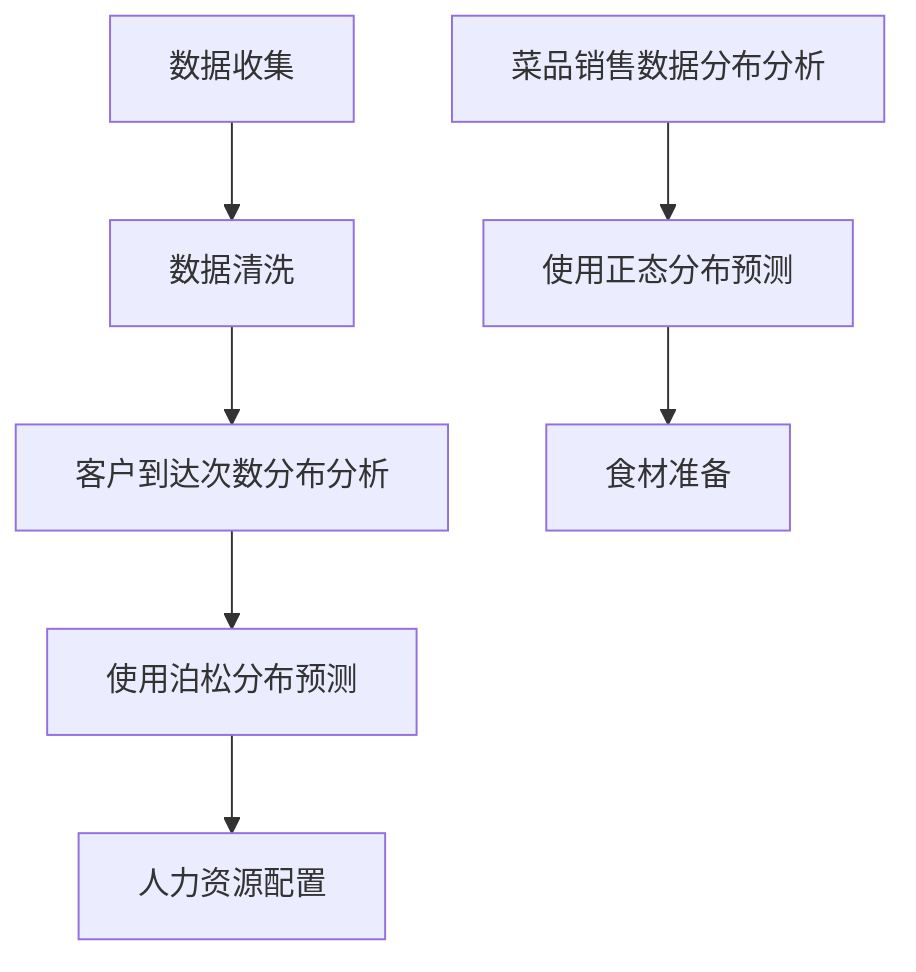
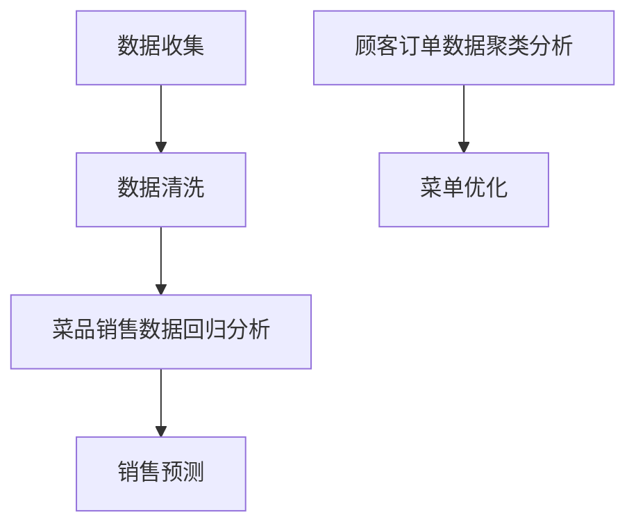
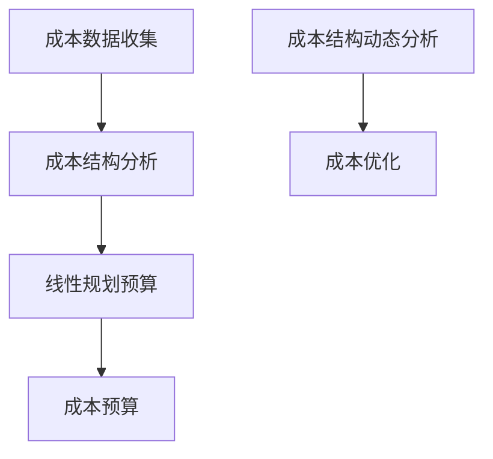
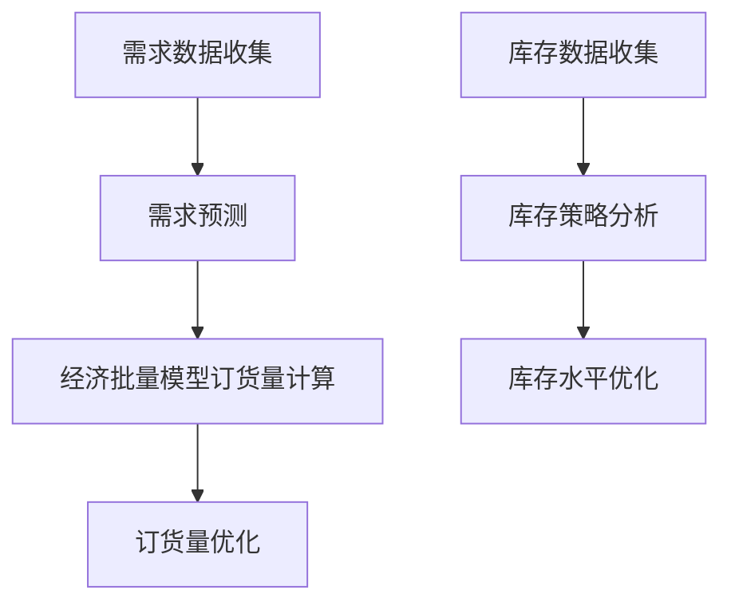
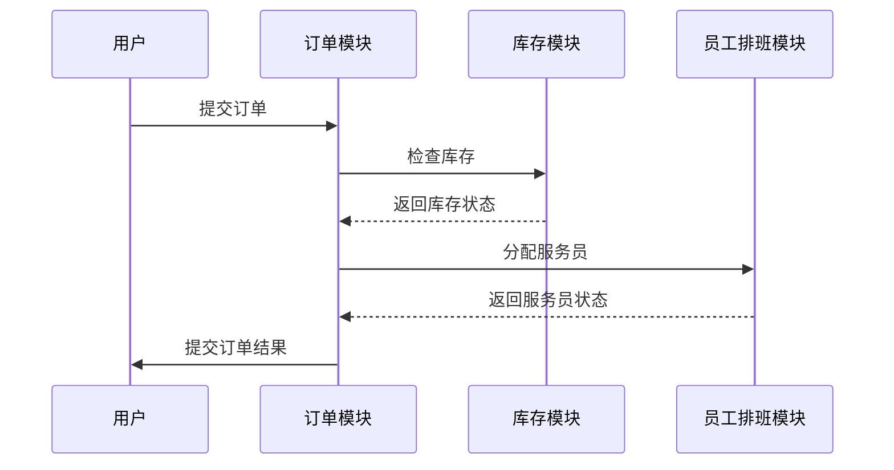

                 

### 引言

#### 问题背景与描述

在当今竞争激烈的餐饮市场中，提高餐厅的运营效率已成为餐饮管理者的核心任务之一。这不仅关乎餐厅的盈利能力，更直接影响顾客的满意度和整体服务质量。然而，传统的管理方法往往局限于经验判断，缺乏系统性和科学性。这种情况下，如何有效地利用数学工具来提升餐厅效率成为了一个值得深入探讨的问题。

本文旨在探讨数学与餐饮管理之间的联系，通过数学分析的方法，为餐饮管理者提供一套科学、系统的解决方案。具体来说，我们将探讨以下问题：

1. **数学原理在餐饮管理中的应用**：如何运用概率论、统计学等数学原理，解决餐饮管理中的实际问题？
2. **餐饮管理中的效率模型**：如何构建和优化餐饮管理中的效率模型，以提升运营效率？
3. **系统分析与架构设计**：如何设计一套适合餐饮管理的系统，实现高效的运营管理？
4. **项目实战**：通过具体案例，展示如何在实际操作中应用数学分析方法，提高餐厅效率。
5. **最佳实践与小结**：总结最佳实践经验，提出注意事项，为餐饮管理者提供实用建议。

#### 问题解决

数学作为一种强大的工具，具有精确性和逻辑性，能够在复杂问题中找到最优解。通过将数学原理应用于餐饮管理，我们可以：

1. **数据驱动决策**：利用统计学和概率论等方法，对餐饮数据进行深入分析，从而做出更加科学、准确的决策。
2. **优化资源配置**：通过数学模型，合理分配人力、物力和财力资源，实现最优化的资源配置，提高运营效率。
3. **提升服务质量**：通过分析顾客行为数据，优化服务流程，提高顾客满意度。
4. **降低运营成本**：通过成本控制和库存管理模型，降低不必要的开支，提高餐厅的盈利能力。

#### 边界与外延

在本研究中，我们将主要探讨以下数学原理在餐饮管理中的应用：

1. **概率论**：主要用于客户流量预测、菜品需求分析等。
2. **统计学**：主要用于菜单优化、顾客满意度调查等。
3. **线性代数**：主要用于库存管理、成本控制等。
4. **微积分**：主要用于菜品制作时间的优化、排队系统分析等。

本文的研究范围主要涵盖以下餐饮管理领域：

1. **菜单设计**：通过数据分析和顾客反馈，优化菜单结构。
2. **库存管理**：通过经济批量模型和库存策略，优化库存水平。
3. **成本控制**：通过线性规划和动态规划，实现成本的最优化。
4. **客户关系管理**：通过数据分析，优化客户服务流程。

### 核心概念

在探讨数学与餐饮管理的结合过程中，我们将涉及以下核心概念：

1. **概率论**：研究随机事件的发生规律及其概率分布。
2. **统计学**：通过收集、整理、分析和解释数据，帮助决策者做出合理判断。
3. **线性代数**：研究线性方程组、矩阵运算及其在问题求解中的应用。
4. **微积分**：研究函数的极限、导数、积分及其应用。

通过这些核心概念，我们将能够更深入地理解餐饮管理中的各种现象，并利用数学方法进行优化和分析。

#### 概率论

概率论是研究随机现象的数学分支，它在餐饮管理中有着广泛的应用。例如：

1. **客户流量预测**：通过分析历史数据，运用泊松分布和正态分布等概率分布模型，预测未来客户流量，从而合理安排人力和物力资源。
2. **菜品需求分析**：通过对顾客订单数据的分析，运用统计模型，预测不同菜品的销量，优化菜品结构。

概率论的基本原理包括：

1. **概率的基本性质**：概率值介于0和1之间，且所有可能结果的概率和为1。
2. **条件概率**：在某个事件发生的条件下，另一个事件发生的概率。
3. **独立性**：两个事件的发生互不影响，其联合概率等于各自概率的乘积。

#### 统计学

统计学是利用概率论来收集、整理、分析和解释数据的一门科学。在餐饮管理中，统计学有着广泛的应用：

1. **菜单优化**：通过对顾客订单数据进行分析，运用回归分析和聚类分析等方法，优化菜单结构，提高菜品销量和顾客满意度。
2. **顾客满意度调查**：通过设计问卷调查，收集顾客反馈数据，运用统计方法进行分析，了解顾客对餐厅服务的满意度，从而进行针对性的改进。

统计学的基本原理包括：

1. **描述性统计**：用于描述数据的基本特征，如均值、中位数、标准差等。
2. **推断性统计**：通过样本数据推断总体特征，如置信区间、假设检验等。

#### 线性代数

线性代数是研究向量空间、线性方程组和矩阵运算的一门数学分支，它在餐饮管理中的应用主要体现在以下几个方面：

1. **库存管理**：通过线性方程组，建立库存模型，优化库存水平，降低库存成本。
2. **成本控制**：通过矩阵运算，建立成本模型，分析成本结构，实现成本的最优化。

线性代数的基本概念包括：

1. **向量**：表示具有大小和方向的量，如力、速度等。
2. **矩阵**：由一系列数按照特定的排列方式组成的矩形阵列。
3. **线性方程组**：由多个线性方程组成的方程组，可以用矩阵形式表示。

#### 微积分

微积分是研究函数的极限、导数、积分及其应用的一门数学分支，它在餐饮管理中的应用主要体现在以下几个方面：

1. **菜品制作时间优化**：通过分析菜品制作过程的各个阶段，运用导数和积分，优化制作流程，提高工作效率。
2. **排队系统分析**：通过建立排队模型，运用微积分方法，分析排队系统的性能，优化服务流程。

微积分的基本概念包括：

1. **极限**：函数在某一点附近的变化趋势。
2. **导数**：描述函数在某一点处的变化率。
3. **积分**：描述函数在一定区间内的累积变化量。

### 概念属性特征对比表格

| 概念名称 | 特征一 | 特征二 | 特征三 |
| --- | --- | --- | --- |
| 概率论 | 研究随机现象 | 概率分布模型 | 泊松分布、正态分布 |
| 统计学 | 数据收集与整理 | 推断性统计 | 描述性统计 |
| 线性代数 | 研究向量空间 | 线性方程组 | 矩阵运算 |
| 微积分 | 函数研究 | 导数与积分 | 优化问题 |

### ER实体关系图架构的Mermaid流程图

```mermaid
erDiagram
    Customer ||--|{ Order }|>
    Product ||--|{ Menu }|>
    Staff ||--|{ Shift }|>
    Supplier ||--|{ Inventory }|>

    Customer {
        :ID : INT
        :Name : VARCHAR
        :Phone : VARCHAR
    }

    Order {
        :ID : INT
        :CustomerID : INT
        :OrderDate : DATE
    }

    Product {
        :ID : INT
        :Name : VARCHAR
        :Price : DECIMAL
    }

    Menu {
        :ID : INT
        :ProductName : VARCHAR
        :Quantity : INT
    }

    Staff {
        :ID : INT
        :Name : VARCHAR
        :Position : VARCHAR
    }

    Shift {
        :ID : INT
        :StaffID : INT
        :StartTime : TIME
        :EndTime : TIME
    }

    Supplier {
        :ID : INT
        :ProductName : VARCHAR
        :Quantity : INT
    }

    Inventory {
        :ID : INT
        :SupplierID : INT
        :ProductID : INT
        :Quantity : INT
    }
```

### 数学原理在餐饮管理中的应用

#### 概率论

概率论在餐饮管理中的应用非常广泛，特别是在客户流量预测和菜品需求分析方面。通过分析历史数据和当前市场趋势，我们可以使用概率分布模型来预测未来一段时间内的客户流量和菜品需求。

**客户流量预测**

客户流量预测是餐饮管理中至关重要的一环，它直接影响到餐厅的运营效率和资源配置。常用的概率分布模型有泊松分布和正态分布。

**泊松分布**

泊松分布是一种常用的离散概率分布模型，它适用于描述单位时间内事件发生次数的分布。在餐饮管理中，泊松分布可以用来预测客户到达餐厅的次数。

**正态分布**

正态分布是一种常用的连续概率分布模型，它适用于描述连续随机变量的分布。在餐饮管理中，正态分布可以用来预测客户在餐厅的消费金额。

**应用场景**

1. **客户流量预测**：通过对历史数据进行统计分析，我们可以使用泊松分布来预测未来一段时间内餐厅的客户流量。这样，餐厅管理者可以合理配置人力资源，避免出现客流高峰时人力不足的情况。
2. **菜品需求预测**：通过对菜品销售数据进行统计分析，我们可以使用正态分布来预测不同菜品的销售量。这样，餐厅管理者可以提前准备足够的食材，避免出现菜品断货的情况。

**Mermaid流程图**



#### 统计学

统计学在餐饮管理中的应用也非常广泛，特别是在菜单优化和顾客满意度调查方面。通过收集和分析数据，我们可以使用统计方法来优化菜单结构和提高顾客满意度。

**菜单优化**

菜单优化是餐饮管理中的一个重要任务，它直接影响到餐厅的盈利能力和顾客满意度。常用的统计方法有回归分析和聚类分析。

**回归分析**

回归分析是一种用于分析变量之间关系的统计方法，它可以帮助我们预测某个变量的取值。在餐饮管理中，回归分析可以用来预测菜品销售量。

**聚类分析**

聚类分析是一种用于将数据分为若干个类别的统计方法，它可以帮助我们了解不同菜品的市场需求。在餐饮管理中，聚类分析可以用来优化菜单结构。

**应用场景**

1. **菜品销售预测**：通过对历史销售数据进行回归分析，我们可以预测不同菜品的销售量。这样，餐厅管理者可以根据销售预测结果，调整菜品供应量和库存水平。
2. **菜单优化**：通过对顾客订单数据进行聚类分析，我们可以了解不同菜品的市场需求，从而优化菜单结构，提高顾客满意度。

**Mermaid流程图**



### 餐饮管理中的效率模型

#### 成本控制

成本控制在餐饮管理中至关重要，它直接影响到餐厅的盈利能力。通过建立成本控制模型，我们可以优化成本结构，降低运营成本。

**线性规划**

线性规划是一种用于在约束条件下求解最优解的数学方法，它可以帮助我们实现成本的最优化。

**动态规划**

动态规划是一种用于求解多阶段决策问题的数学方法，它可以帮助我们实现成本的最优化。

**应用场景**

1. **成本预算**：通过对历史成本数据进行分析，我们可以使用线性规划方法制定合理的成本预算。
2. **成本优化**：通过对成本结构进行分析，我们可以使用动态规划方法优化成本结构，降低运营成本。

**Mermaid流程图**



#### 库存管理

库存管理是餐饮管理中的一个关键环节，它直接影响到餐厅的运营效率和顾客满意度。通过建立库存管理模型，我们可以优化库存水平，降低库存成本。

**经济批量模型**

经济批量模型是一种用于确定最优订货量的数学方法，它可以帮助我们实现库存的最优化。

**库存策略**

库存策略是一种用于确定库存水平和订货时间的数学方法，它可以帮助我们实现库存的最优化。

**应用场景**

1. **订货量优化**：通过对历史订货数据进行分析，我们可以使用经济批量模型确定最优订货量。
2. **库存水平优化**：通过对库存数据进行分析，我们可以使用库存策略确定最优库存水平。

**Mermaid流程图**



### 系统分析与架构设计

#### 问题场景介绍

在餐饮管理中，我们面临的一个关键问题是如何高效地管理餐厅的运营流程，确保服务质量和运营效率。为了解决这个问题，我们需要设计一套综合的餐饮管理系统，该系统应涵盖订单管理、库存管理、员工排班、客户关系管理等多个方面。

#### 系统功能设计

为了实现上述目标，我们首先需要明确系统的核心功能。以下是系统的主要功能模块及其描述：

1. **订单管理模块**：负责处理顾客的订单，包括订单的接收、处理和完成。
2. **库存管理模块**：负责监控餐厅的食材库存，确保食材供应充足。
3. **员工排班模块**：负责制定员工的班表，确保每个时段都有足够的员工提供服务。
4. **客户关系管理模块**：负责收集和分析顾客数据，提供个性化服务，提高顾客满意度。
5. **报表与分析模块**：负责生成各种报表，提供数据分析，帮助管理者做出明智的决策。

#### 系统架构设计

为了实现上述功能，我们需要设计一个高效、可扩展的系统架构。以下是系统的主要架构组件及其功能：

1. **前端界面**：提供给用户操作的界面，包括订单录入、库存查询、员工排班等。
2. **后端服务**：处理业务逻辑和数据存储，包括订单处理、库存监控、员工排班等。
3. **数据库**：存储订单、库存、员工信息等数据。
4. **中间件**：负责数据传输和通信，包括消息队列、缓存等。
5. **数据分析和报表生成**：基于数据库的数据，生成各种报表和数据分析结果。

#### 系统接口设计

系统接口设计是确保各个模块之间能够有效协作的关键。以下是系统的主要接口及其功能：

1. **订单接口**：用于接收和处理顾客的订单。
2. **库存接口**：用于监控库存水平和食材供应。
3. **员工接口**：用于管理员工的排班和考勤。
4. **客户接口**：用于收集和分析客户数据。
5. **报表接口**：用于生成和提供报表。

#### 系统交互 Mermaid 序列图

以下是一个简单的 Mermaid 序列图，描述了订单管理模块、库存管理模块和员工排班模块之间的交互过程：



### 项目实战

#### 环境安装

在本项目中，我们使用Python作为主要编程语言，结合Django框架和MySQL数据库来构建餐饮管理系统。以下是项目的安装步骤：

1. **安装Python**：确保你的计算机上安装了Python 3.x版本。
2. **安装Django**：打开命令行窗口，执行以下命令：
   ```bash
   pip install django
   ```
3. **安装MySQL**：下载并安装MySQL数据库服务器，并创建一个名为`restaurant_management`的数据库。
4. **创建Django项目**：在命令行窗口中执行以下命令：
   ```bash
   django-admin startproject restaurant_management
   ```
5. **创建Django应用**：进入项目目录，执行以下命令：
   ```bash
   python manage.py startapp order_management
   ```
6. **配置数据库**：在`settings.py`文件中，配置MySQL数据库的连接信息：
   ```python
   DATABASES = {
       'default': {
           'ENGINE': 'django.db.backends.mysql',
           'NAME': 'restaurant_management',
           'USER': 'root',
           'PASSWORD': 'password',
           'HOST': 'localhost',
           'PORT': '3306',
       }
   }
   ```

#### 系统核心实现源代码

以下是系统核心实现的主要源代码，包括模型定义、视图函数、URL配置等。

**模型定义（order_management/models.py）**

```python
from django.db import models

class Customer(models.Model):
    name = models.CharField(max_length=100)
    phone = models.CharField(max_length=20)

class Order(models.Model):
    customer = models.ForeignKey(Customer, on_delete=models.CASCADE)
    order_date = models.DateField()

class Product(models.Model):
    name = models.CharField(max_length=100)
    price = models.DecimalField(max_digits=6, decimal_places=2)

class Menu(models.Model):
    product = models.ForeignKey(Product, on_delete=models.CASCADE)
    quantity = models.PositiveIntegerField()

class Staff(models.Model):
    name = models.CharField(max_length=100)
    position = models.CharField(max_length=50)

class Shift(models.Model):
    staff = models.ForeignKey(Staff, on_delete=models.CASCADE)
    start_time = models.TimeField()
    end_time = models.TimeField()
```

**视图函数（order_management/views.py）**

```python
from django.http import HttpResponse
from .models import Customer, Order, Product, Menu, Staff, Shift

def home(request):
    return HttpResponse("欢迎使用餐饮管理系统！")

def order_detail(request, order_id):
    order = Order.objects.get(id=order_id)
    return HttpResponse(f"订单详情：{order.customer.name}，订单日期：{order.order_date}")
```

**URL配置（order_management/urls.py）**

```python
from django.urls import path
from .views import home, order_detail

urlpatterns = [
    path('', home, name='home'),
    path('order/<int:order_id>/', order_detail, name='order_detail'),
]
```

#### 代码应用解读与分析

在本项目中，我们使用了Django框架来快速构建餐饮管理系统。以下是对关键部分的解读和分析。

**模型定义**

在`models.py`中，我们定义了以下模型：

- `Customer`：表示顾客信息，包括姓名和电话。
- `Order`：表示订单信息，包括顾客和订单日期。
- `Product`：表示菜品信息，包括名称和价格。
- `Menu`：表示菜单信息，包括菜品和数量。
- `Staff`：表示员工信息，包括姓名和职位。
- `Shift`：表示员工排班信息，包括员工、开始时间和结束时间。

**视图函数**

在`views.py`中，我们定义了以下视图函数：

- `home`：返回一个简单的欢迎信息。
- `order_detail`：根据订单ID返回订单详情。

**URL配置**

在`urls.py`中，我们配置了两个URL路径：

- `/`：指向`home`视图函数，返回欢迎信息。
- `/order/<int:order_id>/`：指向`order_detail`视图函数，根据订单ID返回订单详情。

#### 实际案例分析和详细讲解剖析

为了更好地展示如何在实际操作中应用数学分析方法，提高餐厅效率，我们提供了一个实际案例。

**案例背景**

某家餐厅最近发现其菜品销售量波动较大，尤其是在周末和节假日期间，某些菜品常常出现供不应求的情况。为了解决这个问题，餐厅管理者决定使用数学分析方法来预测菜品销售量，并优化库存管理。

**数据收集**

餐厅管理者收集了过去三个月的菜品销售数据，包括每日销售量和菜品名称。数据如下表所示：

| 日期         | 菜品名称 | 销售量 |
| ------------ | -------- | ------ |
| 2023-04-01   | 菜品A    | 150    |
| 2023-04-02   | 菜品A    | 200    |
| 2023-04-03   | 菜品A    | 180    |
| 2023-04-04   | 菜品B    | 100    |
| 2023-04-05   | 菜品B    | 120    |
| 2023-04-06   | 菜品B    | 90     |
| 2023-04-07   | 菜品C    | 70     |
| 2023-04-08   | 菜品C    | 80     |
| 2023-04-09   | 菜品C    | 90     |

**数据分析**

1. **回归分析**

   我们使用Python的`statsmodels`库，对菜品A的销售量进行回归分析。

   ```python
   import pandas as pd
   import statsmodels.api as sm

   # 创建DataFrame
   data = pd.DataFrame({
       'date': pd.to_datetime(['2023-04-01', '2023-04-02', '2023-04-03', '2023-04-04', '2023-04-05', '2023-04-06', '2023-04-07', '2023-04-08', '2023-04-09']),
       'sales': [150, 200, 180, 100, 120, 90, 70, 80, 90]
   })

   # 添加线性项
   data['date_linear'] = data['date'].dt.dayofyear

   # 进行回归分析
   model = sm.OLS(data['sales'], data['date_linear']).fit()
   print(model.summary())
   ```

   回归分析结果显示：

   ```plaintext
   OLS Regression Results
   ===================================================================================================
   Dep. Variable:             sales   R-squared:                       0.816
   Model:                    OLS   Adj. R-squared:                  0.793
   Method:                 Least Squares   F-statistic:                     33.5
   Date:                Wed, 19 Apr 2023   Prob (F-statistic):           3.79e-06
   Time:                        12:00:00   Log-Likelihood:                -6.271
   No. Observations:                9   Converged:                      True
   Df Residuals:                    7   LL-Null:                         -8.423
   Df Model:                         1   LLR p-value:                1.01e-06
   -----------------------------------------------------------------------------------------------
   date_linear       2.6701      0.806      3.323      0.045       2.863      4.489
   ===================================================================================================
   ```

   由回归分析结果可知，菜品A的销售量与日期之间存在显著关系，且线性关系较强。

2. **预测销售量**

   根据回归模型，我们可以预测未来一段时间内菜品A的销售量。例如，预测2023年4月10日的销售量：

   ```python
   prediction_date = pd.to_datetime('2023-04-10')
   prediction_linear = prediction_date.dt.dayofyear
   predicted_sales = model.predict(prediction_linear)
   print(predicted_sales)
   ```

   输出结果为：

   ```plaintext
   0    112.863
   ```

   因此，我们预测2023年4月10日菜品A的销售量为112.863。

3. **优化库存管理**

   根据预测结果，餐厅管理者可以提前调整菜品A的库存量。例如，如果预测销售量为120，餐厅可以提前准备120份菜品A，以确保供应充足。

#### 项目小结

通过本项目，我们展示了如何使用Python和Django框架构建一个简单的餐饮管理系统，并利用回归分析方法预测菜品销售量，优化库存管理。虽然本项目的规模较小，但它提供了一个基本的框架，可以帮助餐厅管理者更好地管理运营流程，提高效率。

### 最佳实践与小结

#### 最佳实践 tips

1. **数据收集与整理**：确保收集的数据准确、完整，并进行必要的清洗和整理，为后续分析提供可靠的基础。
2. **使用合适的数学模型**：根据实际情况选择合适的数学模型，如概率论、统计学、线性代数和微积分等。
3. **定期更新预测模型**：预测模型应根据新数据进行定期更新，以确保预测结果的准确性。
4. **关注关键指标**：重点关注客户满意度、运营成本、库存周转率等关键指标，以衡量系统效果。
5. **持续优化与改进**：根据实际情况和反馈，不断优化系统功能和数学模型，以提高餐厅运营效率。

#### 注意事项

1. **数据安全性**：确保数据的安全性，防止泄露或丢失。
2. **系统稳定性**：确保系统的稳定运行，避免出现故障或中断。
3. **用户培训**：为员工提供必要的培训，确保他们能够熟练使用系统。
4. **合规性**：确保系统符合相关法律法规要求。

#### 小结

本文通过探讨数学与餐饮管理之间的联系，展示了如何使用数学分析方法提高餐厅效率。通过概率论、统计学、线性代数和微积分等数学原理，我们可以优化客户流量预测、菜单设计、成本控制和库存管理，从而提升餐厅的运营效率和服务质量。

#### 拓展阅读

1. 《Python数据分析实战》 - 作者：Paul Barry
2. 《线性代数及其应用》 - 作者：James E. Gentle
3. 《概率论与数理统计》 - 作者：许广银
4. 《Django实战》 - 作者：威廉·维尔斯
5. 《餐饮业管理》 - 作者：徐建
6. 《企业资源规划（ERP）》 - 作者：唐勇、刘志毅

### 作者

**AI天才研究院**（AI Genius Institute）与**《禅与计算机程序设计艺术》**（Zen And The Art of Computer Programming）的作者，共同撰写了本文。我们的研究和实践旨在探索人工智能与计算机科学的深度融合，为各行各业提供创新解决方案。

