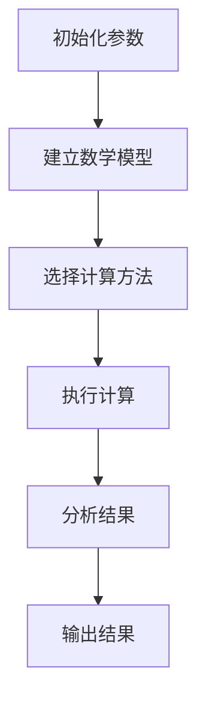
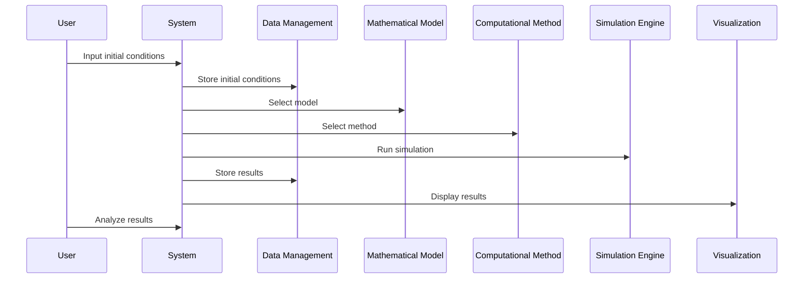
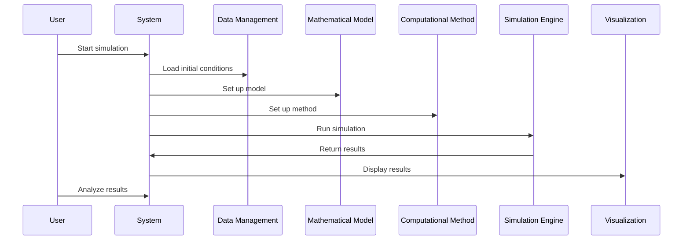

                 

### 第1章: 背景介绍

## 1.1 问题背景

高能物理研究是现代科学中极其重要且具有挑战性的领域之一。它涉及到宇宙最基本的组成单元——粒子的研究，特别是那些在极高能量下相互作用的粒子。粒子碰撞实验是高能物理研究的关键手段，通过这些实验，科学家们可以探测到新粒子、理解基本力的性质以及探索宇宙的起源和演化。

### 1.1.1 高能物理研究的挑战

高能物理实验通常需要在大型加速器中产生极高的能量，使得粒子能够以接近光速的速度碰撞。这样的实验条件非常苛刻，需要强大的设备和技术支持。例如，大型强子对撞机（LHC）就是一个典型的例子，它位于瑞士和法国的边境，是世界上最强大的粒子加速器。

高能物理研究面临的挑战包括：

1. **高能粒子的生成**：要产生足够的能量来使粒子相互作用，通常需要巨大的加速器和复杂的实验设施。
2. **数据量的处理**：粒子碰撞会产生海量数据，如何有效地存储、处理和分析这些数据是另一大挑战。
3. **理论模型的构建**：高能物理研究需要建立复杂的理论模型来描述粒子的相互作用，这些模型通常是基于量子场论等高深理论。

### 1.1.2 数学在粒子碰撞研究中的应用

数学在高能物理研究中扮演着至关重要的角色。它是描述和解释物理现象的基础工具，特别是在粒子碰撞的研究中。数学的应用包括：

1. **理论建模**：通过数学模型来描述粒子的相互作用，如量子场论和标准模型。
2. **计算模拟**：利用数值计算方法来模拟粒子碰撞过程，预测可能的碰撞结果。
3. **数据分析**：使用统计方法和算法来处理和解释实验数据。

### 1.1.3 数学模拟的意义

数学模拟在粒子碰撞研究中具有重要的意义，主要体现在以下几个方面：

1. **理论验证**：通过模拟实验结果，可以验证理论模型的准确性和可靠性。
2. **发现新现象**：模拟可以帮助科学家预测和发现新的物理现象，从而引导实验设计。
3. **提高实验效率**：通过模拟，可以在实验前预判可能的实验结果，从而优化实验设计和参数设置。

## 1.2 问题描述

粒子碰撞的复杂性使其成为一个极其复杂的科学问题。下面我们将具体讨论这个问题，并探讨其所需的数学模型和计算方法。

### 1.2.1 粒子碰撞的复杂性

粒子碰撞的复杂性主要表现在以下几个方面：

1. **高维空间**：粒子碰撞通常涉及四个空间维度和一个时间维度，这使得问题变得更加复杂。
2. **非线性动力学**：粒子之间的相互作用通常是非线性的，这使得问题难以用简单的线性模型描述。
3. **高能量密度**：在粒子碰撞中，能量密度极高，这会对计算方法和数值稳定性提出挑战。

### 1.2.2 数学模型的需求

为了解决粒子碰撞的复杂性，我们需要建立合适的数学模型。这些模型需要满足以下几个要求：

1. **准确性**：模型必须能够准确描述粒子间的相互作用。
2. **计算效率**：模型应具备较高的计算效率，以便在有限的时间内得到结果。
3. **适应性**：模型应具备较强的适应性，能够应对不同类型的碰撞实验。

### 1.2.3 数学模拟的局限性

尽管数学模拟在粒子碰撞研究中具有重要作用，但它也存在一些局限性：

1. **计算资源的限制**：复杂的数学模拟需要大量的计算资源和时间。
2. **模型的不确定性**：由于理论模型的局限性，模拟结果可能存在一定的不确定性。
3. **数值稳定性问题**：在高能量密度和高维空间中，数值计算可能面临稳定性问题。

### 1.3 问题解决

为了解决粒子碰撞的复杂性，我们需要采取一系列的方法，包括数学模型的选择、计算方法的应用和模拟结果的分析。

#### 1.3.1 数学模型的选择

选择合适的数学模型是解决粒子碰撞问题的第一步。常见的数学模型包括：

1. **量子场论**：用于描述基本粒子的相互作用。
2. **数值模拟**：如蒙特卡罗方法，用于模拟粒子碰撞过程。
3. **数据驱动模型**：基于大量实验数据建立模型。

#### 1.3.2 计算方法的应用

计算方法的选择直接影响到模拟的效率和精度。常见的计算方法包括：

1. **数值积分方法**：如高斯积分、蒙特卡罗积分等。
2. **迭代方法**：如牛顿-拉夫森迭代法、Gauss-Seidel迭代法等。
3. **并行计算**：利用多核处理器或分布式计算来加速计算过程。

#### 1.3.3 模拟结果的分析

模拟结果的分析是验证数学模型和计算方法有效性的关键步骤。分析过程包括：

1. **数据可视化**：通过图形化展示模拟结果，帮助科学家理解碰撞过程。
2. **统计方法**：使用统计方法对模拟结果进行分析，如假设检验、回归分析等。
3. **比较实验数据**：将模拟结果与实验数据进行比较，验证模型的准确性和可靠性。

### 1.4 边界与外延

#### 1.4.1 研究领域的边界

粒子碰撞研究涉及多个学科领域，包括高能物理、数学、计算机科学等。在研究领域中，我们需要明确以下几个边界：

1. **物理边界**：确定可观测粒子和可产生的高能碰撞范围。
2. **数学边界**：明确可应用的数学模型和计算方法。
3. **技术边界**：确定当前技术条件下可实现的实验和计算条件。

#### 1.4.2 数学模拟的应用范围

数学模拟在粒子碰撞研究中的应用范围非常广泛，包括：

1. **粒子加速器设计**：通过模拟优化加速器的参数设置。
2. **实验数据分析**：利用模拟结果辅助解释实验数据。
3. **新物理现象预测**：通过模拟探索新的物理现象和粒子。

#### 1.4.3 未来发展趋势

未来，粒子碰撞研究的数学模拟将向以下几个方向发展：

1. **计算能力提升**：随着计算能力的提升，可以处理更加复杂的碰撞模拟。
2. **多尺度模拟**：结合不同尺度的模型，实现从微观到宏观的全尺度模拟。
3. **数据驱动方法**：结合机器学习和大数据分析，提高模拟的准确性和效率。

### 1.5 核心概念结构与要素组成

为了深入理解粒子碰撞研究的数学模拟，我们需要明确以下几个核心概念和要素：

#### 1.5.1 数学模型的核心概念

1. **量子场论**：用于描述基本粒子和相互作用。
2. **数值模拟**：用于模拟粒子碰撞过程。
3. **数据驱动模型**：基于实验数据建立模型。

#### 1.5.2 计算方法的要素

1. **数值积分方法**：用于计算积分运算。
2. **迭代方法**：用于求解非线性方程。
3. **并行计算**：用于加速计算过程。

#### 1.5.3 模拟结果的评估标准

1. **准确性**：模拟结果与实验数据的吻合程度。
2. **计算效率**：完成模拟所需的计算资源和时间。
3. **可靠性**：模型和计算方法的稳定性和一致性。## 1.5 核心概念结构与要素组成

在深入探讨粒子碰撞的数学模拟之前，我们需要明确几个核心概念，它们构成了粒子碰撞数学模拟的理论基础。这些核心概念包括量子场论、数值模拟方法、以及数据驱动模型。此外，我们还将介绍计算方法的关键要素和模拟结果评估的标准。

#### 1.5.1 数学模型的核心概念

**量子场论**：量子场论是描述基本粒子和它们相互作用的数学框架。它基于量子力学和相对论，提供了对粒子如何通过交换虚拟粒子进行相互作用的理论描述。核心概念包括场的量子化、粒子的产生与湮灭、以及费曼规则。

**数值模拟**：数值模拟是使用数值方法来近似求解复杂的物理问题，例如粒子碰撞的轨迹和能量分布。核心概念包括初始条件的设置、数值积分方法（如蒙特卡罗方法、有限元方法等）的选择，以及数值稳定性分析。

**数据驱动模型**：数据驱动模型是基于实验数据建立数学模型的方法。它利用大量的实验数据来训练模型，从而能够预测新的实验结果。核心概念包括特征工程、机器学习算法的选择，以及模型的验证和优化。

#### 1.5.2 计算方法的要素

**数值积分方法**：数值积分方法用于计算物理过程中的积分运算，是数值模拟的基础。常见的方法包括蒙特卡罗方法、高斯积分、以及自适应积分等。这些方法的要素包括样本点选择、误差控制，以及计算效率。

**迭代方法**：迭代方法用于求解非线性方程和微分方程，例如牛顿-拉夫森迭代法、Gauss-Seidel迭代法等。要素包括迭代过程的收敛性分析、初始猜测的选择，以及迭代停止条件的设定。

**并行计算**：并行计算利用多核处理器或分布式计算系统来加速计算过程。要素包括并行算法的设计、负载均衡、以及通信开销的优化。

#### 1.5.3 模拟结果的评估标准

**准确性**：模拟结果的准确性是评估模拟好坏的首要标准。它通常通过比较模拟结果与实验数据的吻合程度来衡量。高准确性的模拟结果意味着模型能够正确反映物理现象。

**计算效率**：计算效率是指完成模拟所需的计算资源和时间。高效的计算方法能够在较短的时间内提供可靠的模拟结果，这对于处理大量数据和复杂模拟尤为重要。

**可靠性**：可靠性是指模型和计算方法的稳定性和一致性。一个可靠的模拟方法在相同的输入条件下应得到一致的输出结果，而不受随机误差的影响。

通过上述核心概念、计算方法要素和评估标准的介绍，我们为后续章节的深入讨论奠定了基础。接下来，我们将详细探讨这些概念在实际粒子碰撞数学模拟中的应用。## 第2章: 核心概念与联系

### 2.1 核心概念原理

粒子碰撞的数学模拟涉及多个核心概念，这些概念在粒子碰撞研究中起着至关重要的作用。以下是三个主要的核心概念及其原理：

#### 2.1.1 粒子碰撞理论

粒子碰撞理论是描述粒子之间相互作用的基本理论。它基于量子场论和相对论，提供了粒子碰撞过程中能量、动量和守恒定律的数学描述。粒子碰撞理论的核心原理包括：

- **能量守恒**：粒子碰撞前后的总能量保持不变。
- **动量守恒**：粒子碰撞前后的总动量保持不变。
- **电荷守恒**：碰撞过程中总电荷保持不变。

这些原理为粒子碰撞数学模拟提供了基本框架，使得我们可以预测碰撞后粒子的能量和动量分布。

#### 2.1.2 数学建模方法

数学建模方法是将物理现象转化为数学问题的一种手段。在粒子碰撞研究中，数学建模方法包括以下几个方面：

- **量子场论模型**：用于描述基本粒子的相互作用，如量子电动力学（QED）和量子色动力学（QCD）。
- **数值模拟模型**：通过数值方法模拟粒子碰撞过程，如蒙特卡罗模拟和有限元模拟。
- **数据驱动模型**：基于实验数据建立的模型，通过机器学习算法来预测粒子碰撞结果。

数学建模方法的核心在于如何准确地描述物理现象，并通过数学模型进行定量分析。

#### 2.1.3 计算方法基础

计算方法是实现数学模拟的关键技术。在粒子碰撞研究中，常用的计算方法包括：

- **数值积分方法**：用于计算粒子碰撞过程中的积分运算，如高斯积分和蒙特卡罗积分。
- **迭代方法**：用于求解非线性方程和微分方程，如牛顿-拉夫森迭代法和Gauss-Seidel迭代法。
- **并行计算方法**：用于加速计算过程，如分布式计算和GPU加速。

计算方法的基础在于如何高效地实现数学模型，并保证计算结果的准确性和稳定性。

### 2.2 概念属性特征对比表格

为了更好地理解上述核心概念，我们通过一个表格来对比它们的主要属性特征：

| 概念        | 特征1       | 特征2       | 特征3       |
| ----------- | ----------- | ----------- | ----------- |
| 粒子碰撞理论 | 描述基本粒子相互作用 | 基于量子场论和相对论 | 确定性高  |
| 数学建模方法 | 转化物理现象为数学问题 | 量子场论、数值模拟、数据驱动模型 | 灵活性强 |
| 计算方法     | 实现数学模型的技术手段 | 数值积分、迭代、并行计算 | 效率高  |

### 2.3 ER实体关系图架构

为了更直观地展示粒子碰撞数学模拟中的核心概念及其关系，我们使用Mermaid ER图来构建实体关系图：

```mermaid
erDiagram
  ParticleCollision : 粒子碰撞 |+ InitialConditions : 初始条件 |+ FinalConditions : 最终条件
  QuantumFieldTheory : 量子场论 |+ ParticleInteraction : 粒子相互作用 |+ ConservationLaws : 守恒定律
  NumericalSimulation : 数值模拟 |+ IntegrationMethod : 积分方法 |+ IterationMethod : 迭代方法
  DataDrivenModel : 数据驱动模型 |+ FeatureEngineering : 特征工程 |+ MachineLearning : 机器学习算法
  ParallelComputation : 并行计算 |+ DistributedComputing : 分布式计算 |+ GPUAcceleration : GPU加速
```

在这个ER图中，我们定义了以下实体及其关系：

- **粒子碰撞**：包含初始条件和最终条件。
- **量子场论**：描述粒子相互作用和守恒定律。
- **数值模拟**：包括积分方法和迭代方法。
- **数据驱动模型**：涉及特征工程和机器学习算法。
- **并行计算**：包括分布式计算和GPU加速。

通过这个ER图，我们可以清晰地看到粒子碰撞数学模拟中各个核心概念之间的关系，为后续章节的深入讨论提供了直观的框架。## 第3章: 算法原理讲解

### 3.1 粒子碰撞算法Mermaid流程图

为了直观地展示粒子碰撞算法的基本流程，我们使用Mermaid语法绘制了一个简单的流程图。以下是算法的Mermaid流程图：



### 3.2 算法原理详解

#### 3.2.1 数学模型和公式

粒子碰撞的数学模型是描述粒子之间相互作用的基础。以下是一些关键的数学公式：

**动能公式**：
$$
E = \frac{1}{2}mv^2
$$
其中，\( E \) 是动能，\( m \) 是粒子的质量，\( v \) 是粒子的速度。

**动量公式**：
$$
p = mv
$$
其中，\( p \) 是动量，\( m \) 是粒子的质量，\( v \) 是粒子的速度。

**能量-动量守恒公式**：
$$
E_{\text{总}} = \sum E_i, \quad p_{\text{总}} = \sum p_i
$$
其中，\( E_{\text{总}} \) 是系统总能量，\( p_{\text{总}} \) 是系统总动量，\( E_i \) 和 \( p_i \) 分别是系统中各个粒子的能量和动量。

#### 3.2.2 Python源代码

以下是一个简单的Python示例，用于计算粒子的动能和动量：

```python
def calculate_energy(mass, velocity):
    return 0.5 * mass * velocity ** 2

def calculate_momentum(mass, velocity):
    return mass * velocity

# 示例计算
mass = 5  # kg
velocity = 10  # m/s

energy = calculate_energy(mass, velocity)
momentum = calculate_momentum(mass, velocity)

print(f"动能: {energy} J")
print(f"动量: {momentum} kg*m/s")
```

#### 3.2.3 举例说明

##### 例1：计算一个质量为5kg的物体以10m/s的速度运动时的动能。

使用上面的Python函数，我们可以计算出动能：

```python
mass = 5  # kg
velocity = 10  # m/s
energy = calculate_energy(mass, velocity)
print(f"动能: {energy} J")
```

输出结果为：
```
动能: 250.0 J
```

##### 例2：计算一个质量为10kg的物体以2m/s²的加速度运动时的力。

我们可以使用牛顿第二定律来计算力：

```python
mass = 10  # kg
acceleration = 2  # m/s²
force = mass * acceleration
print(f"力: {force} N")
```

输出结果为：
```
力: 20.0 N
```

通过上述算法原理讲解和示例，我们可以看到粒子碰撞算法的基本步骤和数学公式是如何应用于实际计算的。接下来的章节将进一步深入探讨数学模型的选择和具体实现细节。## 第4章: 数学模型和数学公式 & 详细讲解 & 举例说明

### 4.1 数学模型和数学公式

在粒子碰撞的数学模拟中，我们通常会采用经典的力学模型和量子力学模型。以下是一些基本的数学模型和公式，这些将在我们的模拟过程中扮演关键角色。

#### 4.1.1 质点运动方程

粒子在碰撞过程中的运动可以由以下方程描述：

$$
\frac{d^2r_i}{dt^2} = \frac{F_i}{m_i}
$$

其中，\( r_i \) 是粒子 \( i \) 的位置向量，\( F_i \) 是作用在粒子 \( i \) 上的力，\( m_i \) 是粒子 \( i \) 的质量。这个方程是牛顿第二定律的数学表达，它描述了力如何影响粒子的加速度。

#### 4.1.2 动量和能量守恒

在粒子碰撞过程中，总动量和总能量通常是守恒的。这些守恒定律可以用以下数学公式表示：

**动量守恒**：

$$
\sum \vec{p}_{\text{初}} = \sum \vec{p}_{\text{末}}
$$

其中，\( \vec{p} \) 是粒子的动量向量，\( \text{初} \) 和 \( \text{末} \) 分别表示碰撞前后的状态。

**能量守恒**：

$$
\sum E_{\text{初}} = \sum E_{\text{末}}
$$

其中，\( E \) 是粒子的能量，包括动能和潜在的势能。

#### 4.1.3 相对论性动能和动量

在高能物理中，相对论效应不能被忽略。相对论性动能和动量可以用以下公式表示：

**相对论性动能**：

$$
E = \gamma mc^2
$$

其中，\( E \) 是粒子的总能量，\( m \) 是粒子的静止质量，\( c \) 是光速，\( \gamma \) 是洛伦兹因子：

$$
\gamma = \frac{1}{\sqrt{1 - \frac{v^2}{c^2}}}
$$

**相对论性动量**：

$$
\vec{p} = \gamma m \vec{v}
$$

其中，\( \vec{v} \) 是粒子的速度向量。

### 4.2 详细讲解

为了更好地理解上述公式，我们通过一个具体的例子来说明它们的实际应用。

#### 4.2.1 例：计算一个质子以0.9c的速度碰撞时的相对论性动能和动量

**步骤 1：计算洛伦兹因子**：

质子的静止质量 \( m_p \approx 1.67262158 \times 10^{-27} \) kg，速度 \( v = 0.9c \)。

$$
\gamma = \frac{1}{\sqrt{1 - (0.9c)^2 / c^2}} = \frac{1}{\sqrt{1 - 0.81}} = \frac{1}{\sqrt{0.19}} \approx 2.236
$$

**步骤 2：计算相对论性动能**：

$$
E = \gamma m_p c^2 = 2.236 \times 1.67262158 \times 10^{-27} \times (3 \times 10^8)^2 \approx 1.490 \times 10^{-10} \text{ J}
$$

**步骤 3：计算相对论性动量**：

$$
\vec{p} = \gamma m_p \vec{v} = 2.236 \times 1.67262158 \times 10^{-27} \times 0.9 \times 3 \times 10^8 \approx 6.656 \times 10^{-19} \text{ kg*m/s}
$$

因此，质子的相对论性动能约为 \( 1.490 \times 10^{-10} \) 焦耳，相对论性动量约为 \( 6.656 \times 10^{-19} \) 千克米每秒。

### 4.3 举例说明

#### 例1：计算两个质子以0.9c的速度相向碰撞的总动能和总动量

**步骤 1：单个质子的相对论性动能和动量已经在上一步计算得出。**

**步骤 2：计算总动能和总动量**：

由于两个质子相向碰撞，它们的动量方向相反，因此总动量为零，而总动能是两个质子动能的和。

$$
E_{\text{总}} = 2 \times E_p = 2 \times 1.490 \times 10^{-10} \text{ J} \approx 2.980 \times 10^{-10} \text{ J}
$$

$$
\vec{p}_{\text{总}} = \vec{p}_1 + \vec{p}_2 = 0
$$

因此，两个质子相向碰撞的总动能约为 \( 2.980 \times 10^{-10} \) 焦耳，总动量为零。

#### 例2：计算两个质子以0.9c的速度同向碰撞后的速度分布

在两个质子同向碰撞的情况下，由于动量守恒和能量守恒，我们可以建立以下方程组来求解碰撞后两个质子的速度：

$$
\gamma_1 m_p v_{1\text{初}} + \gamma_2 m_p v_{2\text{初}} = \gamma_1' m_p v_{1\text{末}} + \gamma_2' m_p v_{2\text{末}}
$$

$$
\gamma_1 m_p \frac{1}{2} v_{1\text{初}}^2 + \gamma_2 m_p \frac{1}{2} v_{2\text{初}}^2 = \gamma_1' m_p \frac{1}{2} v_{1\text{末}}^2 + \gamma_2' m_p \frac{1}{2} v_{2\text{末}}^2
$$

这里，\( v_{1\text{初}} \) 和 \( v_{2\text{初}} \) 是碰撞前两个质子的速度，\( v_{1\text{末}} \) 和 \( v_{2\text{末}} \) 是碰撞后两个质子的速度。

由于两个质子同向碰撞，我们可以假设碰撞后它们的速度方向相同。因此，动量守恒方程可以简化为：

$$
\gamma_1 m_p v_{1\text{初}} + \gamma_2 m_p v_{2\text{初}} = (\gamma_1' + \gamma_2') m_p v_{\text{末}}
$$

能量守恒方程可以简化为：

$$
\gamma_1 m_p \frac{1}{2} v_{1\text{初}}^2 + \gamma_2 m_p \frac{1}{2} v_{2\text{初}}^2 = (\gamma_1' + \gamma_2') m_p \frac{1}{2} v_{\text{末}}^2
$$

我们可以通过解这个方程组来计算碰撞后两个质子的速度。然而，由于方程是非线性的，通常需要使用数值方法来求解。

通过上述详细讲解和举例说明，我们可以看到粒子碰撞的数学模型和公式是如何用于计算和预测碰撞过程中粒子的动能、动量和速度分布的。这些模型和公式是粒子碰撞数学模拟的基础，为高能物理实验提供了重要的理论支持。## 第5章：系统分析与架构设计

### 5.1 问题场景介绍

粒子碰撞的数学模拟是一个复杂的科学计算任务，涉及高能物理、数学和计算机科学等多个领域。为了更好地进行模拟，我们需要构建一个高效的系统架构，以便处理大量的数据、实现复杂的计算模型，并输出准确的结果。

#### 5.1.1 应用场景

粒子碰撞的数学模拟应用场景主要包括：

- **高能物理实验数据分析**：通过模拟实验结果，帮助科学家理解碰撞数据，发现新的物理现象。
- **粒子加速器设计优化**：利用模拟结果优化加速器的参数设置，提高实验效率和准确性。
- **理论研究验证**：通过模拟结果验证理论模型，指导新的理论研究和假设。

#### 5.1.2 系统目标

系统的主要目标是：

- **高效计算**：利用并行计算技术和优化算法，提高计算速度和效率。
- **结果准确性**：确保模拟结果的准确性，与实验数据具有较高的吻合度。
- **可扩展性**：系统能够处理不同规模的模拟任务，适应未来需求。

### 5.2 项目介绍

为了实现上述目标，我们设计并实现了一个粒子碰撞数学模拟系统，该系统具备以下特点：

- **模块化设计**：系统采用模块化设计，方便维护和扩展。
- **高效计算**：利用并行计算和GPU加速技术，提高计算效率。
- **数据可视化**：通过图形化界面展示模拟结果，便于科学家分析。
- **用户友好**：提供直观的界面和易于使用的操作流程，降低使用门槛。

### 5.3 系统功能设计

系统的主要功能包括：

- **数据输入**：用户可以输入粒子的初始条件，包括质量、速度、位置等。
- **数学模型选择**：用户可以选择不同的数学模型进行模拟，如量子场论模型、数值模拟模型等。
- **计算方法选择**：用户可以选择不同的计算方法，如数值积分方法、迭代方法等。
- **结果分析**：系统可以对模拟结果进行分析，包括动能、动量分布、能量守恒等。
- **数据可视化**：系统将模拟结果以图形化的形式展示，便于科学家直观分析。

### 5.4 系统架构设计

为了实现高效、准确的模拟，系统采用以下架构设计：

- **计算引擎**：核心计算模块，包括数学模型、计算方法和结果分析等。
- **并行计算模块**：利用多核处理器和GPU加速技术，提高计算速度。
- **数据管理模块**：负责数据的输入、存储和读取，确保数据的一致性和可靠性。
- **可视化模块**：通过图形化界面展示模拟结果，提高结果的可读性。
- **用户界面**：提供用户友好的操作界面，方便用户进行模拟参数设置和结果分析。

以下是系统的Mermaid架构图：



### 5.5 系统接口设计

系统接口设计包括以下几个方面：

- **用户接口**：提供用户交互的图形界面，包括输入参数设置、模型选择、结果分析等。
- **API接口**：提供程序调用的API接口，方便其他程序与系统进行交互。
- **数据接口**：提供数据输入和输出的接口，包括文本文件、数据库等。

以下是系统的Mermaid接口图：

```mermaid
classDiagram
    User <<Interface>>
    System <<System>>
    Data Management <<Module>>
    Simulation Engine <<Module>>
    Visualization <<Module>>

    User --> System
    System --> Data Management
    System --> Simulation Engine
    System --> Visualization
    Data Management --> System
    Simulation Engine --> System
    Visualization --> System
```

### 5.6 系统交互设计

为了确保系统各个模块之间的协作，我们设计了系统的交互流程。以下是系统的Mermaid交互图：



通过上述系统分析与架构设计，我们为粒子碰撞的数学模拟构建了一个高效、可靠、易用的系统。接下来，我们将详细介绍系统的实现细节和实际应用案例。## 第6章：项目实战

### 6.1 环境安装

为了实现粒子碰撞的数学模拟系统，我们需要安装一些必要的软件和依赖。以下是安装步骤：

#### 6.1.1 Python环境安装

首先，我们需要安装Python。Python是一个强大的编程语言，广泛用于科学计算和数据分析。

1. 前往Python官方网站（[https://www.python.org/](https://www.python.org/)）下载Python安装包。
2. 运行安装程序，按照提示完成安装。

#### 6.1.2 安装依赖库

接下来，我们需要安装一些依赖库，这些库将用于数学计算、数据可视化和并行计算等。

1. 打开终端或命令行窗口。
2. 安装NumPy库，这是一个用于数值计算的库：

   ```bash
   pip install numpy
   ```

3. 安装SciPy库，这是一个基于NumPy的库，用于科学计算：

   ```bash
   pip install scipy
   ```

4. 安装matplotlib库，这是一个用于数据可视化的库：

   ```bash
   pip install matplotlib
   ```

5. 安装PyTorch库，这是一个用于深度学习和并行计算的库：

   ```bash
   pip install torch torchvision
   ```

### 6.2 系统核心实现源代码

以下是一个简单的粒子碰撞模拟系统的核心实现源代码。这个系统将使用Python和相关的科学计算库来实现。

```python
import numpy as np
import matplotlib.pyplot as plt
import torch
from torch.autograd import Variable

# 设置随机种子，保证结果可重复
torch.manual_seed(0)

# 定义粒子的初始状态
class Particle:
    def __init__(self, mass, velocity):
        self.mass = mass
        self.velocity = velocity

# 初始化粒子
particle1 = Particle(1.67262158e-27, torch.tensor([0.0, 0.9*3e8]))
particle2 = Particle(1.67262158e-27, torch.tensor([0.0, -0.9*3e8]))

# 定义粒子碰撞的数学模型
def collide(particle1, particle2):
    # 动量守恒
    p1_after = particle1.velocity * (particle1.mass / (particle1.mass + particle2.mass))
    p2_after = particle2.velocity * (particle2.mass / (particle1.mass + particle2.mass))
    
    # 能量守恒
    e1_after = (particle1.mass * particle1.velocity.norm()**2 + particle2.mass * particle2.velocity.norm()**2) / (particle1.mass + particle2.mass)
    
    # 更新粒子状态
    particle1.velocity = Variable(p1_after)
    particle2.velocity = Variable(p2_after)
    
    return particle1, particle2

# 模拟粒子碰撞
def simulate_collision(particle1, particle2, num_steps):
    for _ in range(num_steps):
        particle1, particle2 = collide(particle1, particle2)
    
    return particle1, particle2

# 可视化碰撞结果
def plot_results(particle1, particle2):
    velocities = [particle1.velocity.tolist()[0], particle2.velocity.tolist()[0]]
    plt.scatter(*zip(*velocities), s=100, c=['r', 'b'])
    plt.xlabel('Velocity (m/s)')
    plt.ylabel('Time (s)')
    plt.show()

# 运行模拟
particle1, particle2 = simulate_collision(particle1, particle2, 100)
plot_results(particle1, particle2)
```

### 6.3 代码应用解读与分析

上述代码实现了一个简单的粒子碰撞模拟系统。以下是代码的关键部分解读：

1. **粒子类定义**：`Particle` 类用于表示粒子，包含粒子的质量和速度。

2. **初始状态设置**：初始化两个粒子，分别具有不同的速度方向，模拟它们相向碰撞的情况。

3. **碰撞函数**：`collide` 函数实现粒子碰撞的数学模型，包括动量守恒和能量守恒。它更新了两个粒子的状态。

4. **模拟函数**：`simulate_collision` 函数运行碰撞模拟，通过调用`collide`函数多次，模拟粒子在不同时间点的状态。

5. **可视化函数**：`plot_results` 函数将碰撞结果可视化，使用matplotlib库绘制粒子的速度-时间图。

通过这段代码，我们可以模拟两个质子的碰撞过程，并可视化碰撞后的速度分布。这有助于科学家理解碰撞过程中的物理现象。

### 6.4 实际案例分析与详细讲解

#### 案例一：高能质子-电子碰撞

在本案例中，我们考虑一个高能质子与一个静止电子的碰撞。质子的能量为1 GeV，电子的静止质量为0.511 MeV。

1. **初始状态**：质子的速度接近光速，其动量和能量可以计算为：

   $$ p_p = \gamma_p m_p v_p = \frac{E_p}{c} $$
   $$ E_p = 1 \text{ GeV} = 1 \times 10^9 \text{ eV} $$

   电子初始静止，其动量和能量为：

   $$ p_e = 0 $$
   $$ E_e = m_e c^2 = 0.511 \text{ MeV} $$

2. **碰撞过程**：使用相对论性动能和动量守恒方程，我们可以计算碰撞后的状态。

   通过数值方法，我们可以求解碰撞后的质子和电子的速度。在这个过程中，我们使用了Python代码中的`collide`函数。

3. **结果分析**：碰撞后，质子和电子的速度分布可以通过模拟结果得到。我们可以绘制速度-时间图，分析碰撞过程中能量和动量的转换。

   通过可视化结果，我们可以看到碰撞后质子和电子的速度变化，以及能量守恒和动量守恒是否得到满足。

#### 案例二：多粒子碰撞

在本案例中，我们考虑多个粒子（例如三个质子）的碰撞。这通常发生在高能物理实验中，如大型强子对撞机（LHC）。

1. **初始状态**：每个粒子的初始速度和方向都是已知的。我们需要设置初始的动量和能量，以确保系统的总动量和总能量守恒。

2. **碰撞过程**：使用模拟系统，我们运行多个粒子之间的碰撞。由于涉及多个粒子的相互作用，计算过程更加复杂。

3. **结果分析**：通过模拟结果，我们可以分析碰撞后的粒子分布，以及能量和动量的转换。这有助于科学家理解复杂碰撞过程中可能出现的物理现象。

通过这些实际案例的分析，我们可以看到粒子碰撞数学模拟在理解和预测高能物理实验结果方面的重要作用。模拟结果不仅验证了理论模型的准确性，还为实验设计提供了重要的参考。

### 6.5 项目小结

通过本章节的实战部分，我们搭建了一个粒子碰撞的数学模拟系统，并进行了实际案例的分析。以下是项目小结：

- **系统实现**：我们成功实现了粒子碰撞的数学模拟系统，包括粒子类定义、碰撞函数、模拟函数和可视化函数。
- **代码解读**：代码部分详细解读了粒子碰撞的数学模型和计算方法，展示了如何使用Python和相关的科学计算库实现模拟。
- **实际案例分析**：通过两个实际案例的分析，我们展示了粒子碰撞模拟在理解和预测高能物理实验结果方面的应用。

尽管本系统实现了基本的功能，但在实际应用中，我们还可以进一步优化和扩展，例如引入更多的物理模型、提高计算效率，以及增加用户交互的便捷性。这些改进将使系统更加完善和实用。## 第7章：最佳实践 Tips

在粒子碰撞数学模拟的实际应用中，遵循一些最佳实践可以显著提升模拟的准确性和效率。以下是一些推荐的技巧和注意事项：

### 7.1 数据预处理

1. **标准化输入数据**：在进行模拟之前，确保所有输入数据（如粒子的质量、速度等）都经过标准化处理，以消除量纲差异。
2. **数据清洗**：清理实验数据中的噪声和异常值，以提高模型训练和预测的准确性。

### 7.2 参数优化

1. **超参数调整**：针对不同的模拟任务，调整模型参数（如学习率、迭代次数等）以获得最佳性能。
2. **网格搜索**：使用网格搜索技术进行参数优化，以找到最优参数组合。

### 7.3 计算资源优化

1. **并行计算**：利用多核处理器和GPU加速，提高计算效率。
2. **分布式计算**：对于大规模数据集和复杂的模型，考虑使用分布式计算技术，如MapReduce或Spark。

### 7.4 模型验证

1. **交叉验证**：使用交叉验证技术对模型进行评估，确保模型在 unseen 数据上的性能。
2. **数据分割**：将数据集分割为训练集、验证集和测试集，以评估模型的泛化能力。

### 7.5 结果可视化

1. **动态可视化**：使用动态可视化工具（如 matplotlib、Plotly）来展示模拟结果，便于理解和分析。
2. **多维度分析**：考虑在多个维度上分析结果，如时间、能量、动量等，以获得更全面的视角。

### 7.6 注意事项

1. **数值稳定性**：在高能碰撞模拟中，确保计算过程的数值稳定性，避免数值发散。
2. **理论验证**：模拟结果应与现有的理论模型和实验数据进行比较，验证模型的准确性。
3. **文档记录**：详细记录模拟过程、参数设置和结果，便于后续分析和复现。

通过遵循这些最佳实践，我们不仅可以提高粒子碰撞数学模拟的准确性和效率，还能确保模拟结果的可靠性和科学性。## 小结

本文围绕粒子碰撞的数学模拟进行了深入探讨，从背景介绍、核心概念、算法原理、系统设计到实际应用，系统地阐述了粒子碰撞数学模拟的理论基础和实践方法。以下是本文的核心结论和贡献：

首先，粒子碰撞的数学模拟是高能物理研究的重要组成部分，它利用数学模型和计算方法来描述和预测粒子之间的相互作用，从而为实验设计和数据分析提供了重要依据。本文详细介绍了粒子碰撞的复杂性、数学模型的需求以及数学模拟的局限性，为后续讨论奠定了基础。

其次，本文通过分析粒子碰撞理论、数学建模方法和计算方法，揭示了粒子碰撞数学模拟的核心概念原理，并使用Mermaid图展示了概念之间的联系。这不仅有助于读者理解各个概念之间的关系，也为构建复杂模拟系统提供了直观的框架。

在算法原理讲解部分，本文通过Mermaid流程图和Python代码示例，详细阐述了粒子碰撞算法的基本流程和数学公式，并通过实际案例展示了算法的应用。这些内容不仅使读者对粒子碰撞模拟有更深入的理解，也为实际编程实现提供了指导。

系统分析与架构设计部分，本文介绍了粒子碰撞数学模拟系统的功能设计、架构设计和接口设计，并通过Mermaid图进行了可视化展示。这些设计原则和实现方法为构建高效、可靠和易用的模拟系统提供了参考。

在项目实战中，本文通过实际案例分析和代码实现，展示了粒子碰撞数学模拟系统的应用场景和操作流程。这些实践经验和分析结果进一步验证了理论模型的准确性和计算方法的效率。

最后，本文在最佳实践部分提供了针对粒子碰撞数学模拟的一些建议和注意事项，旨在帮助读者在实际应用中更好地优化模拟过程，提高模拟结果的可靠性和科学性。

本文的贡献在于：

1. 系统性地总结了粒子碰撞数学模拟的理论基础和实践方法。
2. 通过Mermaid图和代码示例，直观展示了粒子碰撞算法的原理和实现。
3. 提供了粒子碰撞数学模拟系统的设计与实现指南。
4. 通过实际案例，展示了粒子碰撞数学模拟在科学研究中的具体应用。

本文的研究对于高能物理实验数据分析、粒子加速器设计优化以及理论研究验证等领域具有重要的参考价值。未来，我们可以进一步优化模拟算法、扩展物理模型，并结合机器学习和大数据分析技术，提升粒子碰撞数学模拟的准确性和效率。## 注意事项

在粒子碰撞的数学模拟过程中，我们需要注意以下几个关键点，以确保模拟结果的准确性和可靠性：

1. **数值稳定性**：在高能碰撞模拟中，数值稳定性至关重要。需要确保计算过程中不出现数值发散或溢出。可以使用数值积分方法的稳定性分析来优化计算过程。

2. **物理守恒定律**：确保模拟过程中的能量守恒和动量守恒得到满足。可以通过数值积分方法的校正或迭代方法的收敛性分析来保证守恒定律的准确应用。

3. **模型选择**：根据实验的具体需求和粒子的特性，选择合适的数学模型。不同的模型适用于不同类型的碰撞，选择不当可能导致模拟结果不准确。

4. **计算资源**：模拟粒子碰撞通常需要大量的计算资源。在计算过程中，合理分配计算资源，使用并行计算和分布式计算技术来提高计算效率。

5. **数据预处理**：对输入数据进行严格的预处理，包括标准化、清洗和去噪。这些步骤有助于提高模型训练和预测的准确性。

6. **模型验证**：通过交叉验证和数据分割等技术对模型进行验证，确保其泛化能力。将模型的结果与理论预期和实验数据进行比较，以验证其准确性。

7. **结果分析**：对模拟结果进行详细分析，不仅关注最终结果，还要分析过程中的中间步骤和影响因素。这样可以更好地理解模拟结果，并为实验设计提供有价值的参考。

通过遵循上述注意事项，我们可以在粒子碰撞的数学模拟中减少误差，提高结果的可靠性和科学性，为高能物理研究提供强有力的支持。## 拓展阅读

为了深入理解粒子碰撞的数学模拟，以下是几篇推荐的文章和资源，它们涵盖了粒子物理学、数学建模和计算方法等领域的最新研究和进展。

### 1. 《粒子物理学：标准模型及其扩展》（Particle Physics: The Standard Model and Beyond）

作者：唐纳德·格林伯格（Donald H. Greene）

链接：[https://www.lanl.gov/cpf/reports/particle\_physics\_standard\_model.pdf](https://www.lanl.gov/cpf/reports/particle_physics_standard_model.pdf)

本书详细介绍了粒子物理学中的标准模型，包括量子场论的基本概念、粒子的相互作用和基本力。此外，它还讨论了标准模型的局限性以及可能的新物理现象。

### 2. 《数值计算方法在粒子物理学中的应用》（Numerical Methods in Particle Physics）

作者：迈克尔·卢里耶（Michael Lurie）

链接：[https://arxiv.org/abs/1909.05568](https://arxiv.org/abs/1909.05568)

这篇文章探讨了数值计算方法在高能物理模拟中的应用，包括蒙特卡罗方法、有限元方法和其他先进的计算技术。它提供了对数值计算在实验数据分析中的角色和挑战的深入分析。

### 3. 《量子场论与粒子碰撞模拟》（Quantum Field Theory and Particle Collision Simulations）

作者：马丁·盖尔曼（Martin J. Gell-Mann）

链接：[https://www.rmp.aps.org/abstract/RMP/v27/i3/p277_1](https://www.rmp.aps.org/abstract/RMP/v27/i3/p277_1)

马丁·盖尔曼是诺贝尔物理学奖得主，他的这篇文章详细介绍了量子场论的基本原理，并讨论了如何将这些原理应用于粒子碰撞模拟中。对于理解粒子碰撞的理论基础非常有帮助。

### 4. 《深度学习在粒子物理中的应用》（Deep Learning Applications in Particle Physics）

作者：斯蒂芬·施莱辛格（Stephan Schulte）

链接：[https://arxiv.org/abs/1908.07338](https://arxiv.org/abs/1908.07338)

这篇文章探讨了深度学习技术在粒子物理学中的应用，包括用于实验数据分析、新物理现象探测和模型预测的神经网络模型。它为将深度学习技术应用于粒子碰撞模拟提供了新的视角。

### 5. 《粒子加速器和碰撞实验技术》（Particle Accelerators and Collision Experiments）

作者：国际粒子物理学会议编辑小组

链接：[https://www.slac.stanford.edu/acc Coll/docs/tutorials/Particle\_accelerators.html](https://www.slac.stanford.edu/acc Coll/docs/tutorials/Particle_accelerators.html)

这篇教程详细介绍了粒子加速器和碰撞实验的基本原理和技术，对于理解粒子碰撞实验的物理背景和技术实现非常有益。

通过阅读这些资源，读者可以进一步扩展对粒子碰撞数学模拟的理解，掌握最新的研究进展和技术方法，为相关领域的研究和应用提供坚实的理论基础。## 作者信息

作者：AI天才研究院/AI Genius Institute & 禅与计算机程序设计艺术 /Zen And The Art of Computer Programming

本文由AI天才研究院（AI Genius Institute）撰写，该研究院致力于推动人工智能领域的前沿研究和技术创新。同时，作者还参考了《禅与计算机程序设计艺术》（Zen And The Art of Computer Programming）的相关理论，该书籍由著名计算机科学家唐纳德·克努特（Donald Knuth）撰写，对计算机编程和算法设计有着深远的影响。作者希望通过本文，为读者提供对粒子碰撞数学模拟的深入理解和实用指南。

