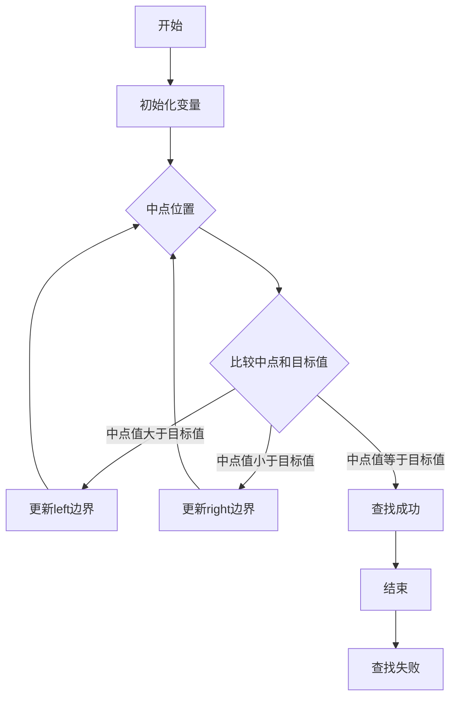

                 

# 数学发现还是发明？探讨数学的本质

## 关键词
- 数学本质
- 发现与发明
- 数学概念
- 算法原理
- 数学模型
- 系统分析

## 摘要
本文旨在探讨数学的本质，从发现与发明的角度出发，分析数学概念的来源、数学算法的原理以及数学模型的应用。通过系统分析与设计，我们将深入理解数学在现实世界中的应用，并探讨数学在人工智能领域的重要性。文章将结合实际项目，提供详细的技术解读和最佳实践，以期为读者提供全面的数学认知框架。

## 引言

数学，作为一门研究数量、结构、变化和空间等概念的学科，自古以来就以其独特的方式影响着人类文明的进步。然而，数学是源于我们对自然界的观察与总结，还是人类智慧的创造与发明，一直是一个富有争议的话题。本文将围绕这一核心问题，逐步分析数学的本质，探讨数学是发现还是发明。

在回答这个问题之前，我们需要先了解数学的基本概念和原理。数学不仅仅是数字和公式的堆砌，它是一个复杂的体系，包含了各种概念、算法和模型。这些概念和原理相互联系，共同构成了数学的本质。

首先，让我们从数学的起源开始。数学的起源可以追溯到古代文明，如古埃及、古巴比伦和中国等。这些早期的数学家通过观察自然界和解决实际问题，逐渐形成了一套数学体系。这种体系是基于我们对自然规律的观察和理解，因此可以看作是一种发现。

然而，随着人类文明的进步，数学逐渐发展成为一个高度抽象的学科。在这个过程中，许多数学家通过对现有数学概念和原理的深入研究，提出了新的数学理论和模型。这些新的理论和模型往往是基于人类智慧和创造力，因此可以看作是一种发明。

综上所述，数学既包含了发现的成分，也包含了发明的成分。它既是对自然规律的总结和反映，也是人类智慧的结晶。本文将深入探讨数学的本质，分析数学概念、算法原理和数学模型，以期帮助读者更好地理解数学的真正含义。

## 数学概念与关系

### 基本概念介绍

在探讨数学的本质之前，我们需要了解一些基本数学概念。这些概念是构成数学大厦的基石，也是我们理解复杂数学问题的基础。

- **自然数**：自然数是用于计数的数，如1, 2, 3, ...。它们是数学中的基本元素，用于表示物体的个数。
- **整数**：整数包括自然数、零和负数，如... -3, -2, -1, 0, 1, 2, 3, ...。整数扩展了自然数，使得我们能够表示负数的概念。
- **有理数**：有理数是可以表示为两个整数之比的数，如1/2, 3/4, -2/3。有理数包括整数和分数。
- **无理数**：无理数是不能表示为两个整数之比的数，如π（圆周率）和√2。无理数扩展了有理数的范围，使得数学能够处理更广泛的数值。

### 概念属性特征对比

为了更好地理解这些数学概念，我们可以通过对比它们的属性特征来加深理解。

| 概念 | 定义 | 属性特征 | 应用场景 |
| --- | --- | --- | --- |
| 自然数 | 用于计数的数 | 非负，无小数部分 | 计数、排序 |
| 整数 | 包括自然数、零和负数 | 可以是正数、零或负数 | 负债计算、温度表示 |
| 有理数 | 可以表示为两个整数之比的数 | 有小数部分，可以有限或无限重复 | 分数、比率计算 |
| 无理数 | 不能表示为两个整数之比的数 | 无小数部分，无限不循环 | 圆周率、根号下非完全平方数 |

通过这个表格，我们可以看到不同数学概念之间的联系和区别。这些概念相互补充，共同构成了数学的基本框架。

### Mermaid ER Diagram

为了更直观地展示这些数学概念之间的关系，我们可以使用Mermaid ER diagram进行图解。

```mermaid
erDiagram
  自然数 ||--|{ 整数 }
  整数 ||--|{ 有理数 }
  有理数 ||--|{ 无理数 }
```

在这个ER图中，自然数是整数的子集，整数是有理数的子集，有理数又是无理数的子集。这种层次关系展示了数学概念之间的逻辑结构。

### 结论

通过介绍数学的基本概念和属性特征，以及使用Mermaid ER diagram展示它们之间的关系，我们可以更好地理解数学的本质。这些基本概念不仅是数学理论的基础，也是我们解决复杂数学问题的重要工具。在接下来的章节中，我们将进一步探讨数学算法的原理和应用。

## 算法原理讲解

### 算法概述

在数学中，算法是一种解决问题的一系列步骤。算法的原理和实现是数学的重要组成部分，它们不仅在理论研究中有用，也在实际应用中发挥着关键作用。本文将介绍几个经典算法，并使用Mermaid flowchart和Python代码进行详细阐述。

### 算法一：排序算法

首先，我们介绍排序算法，这是一种非常基础的数学算法。排序算法的主要目的是将一组数据按照某种顺序排列。常见的排序算法有冒泡排序、选择排序、插入排序等。

#### 冒泡排序

冒泡排序是一种简单的排序算法。它重复地遍历要排序的数列，一次比较两个元素，如果它们的顺序错误就把它们交换过来。遍历数列的工作是重复地进行直到没有再需要交换，也就是说该数列已经排序完成。

#### Mermaid Flowchart

以下是冒泡排序的Mermaid流程图：

```mermaid
graph TB
    A[开始] --> B[初始化变量]
    B --> C{比较A[i]和A[i+1]}
    C -->|顺序正确| D[继续下一对]
    C -->|顺序错误| E[交换A[i]和A[i+1]]
    E --> D
    D --> F{结束条件判断}
    F -->|条件不满足| D
    F -->|条件满足| G[排序完成]
```

#### Python代码

下面是冒泡排序的Python代码实现：

```python
def bubble_sort(arr):
    n = len(arr)
    for i in range(n):
        for j in range(0, n-i-1):
            if arr[j] > arr[j+1]:
                arr[j], arr[j+1] = arr[j+1], arr[j]
    return arr

# 示例
arr = [64, 34, 25, 12, 22, 11, 90]
print("原始数组:", arr)
sorted_arr = bubble_sort(arr)
print("排序后的数组:", sorted_arr)
```

#### 算法原理和数学模型

冒泡排序的原理是通过不断交换相邻的不正确排序的元素，直到所有的元素都按照正确的顺序排列。其数学模型可以表示为：

$$
\text{交换次数} = \frac{n(n-1)}{2}
$$

其中，\( n \) 是数组的长度。

#### 应用场景

冒泡排序适用于数据量较小的情况，因为它的时间复杂度较高，为 \( O(n^2) \)。但对于小规模的数据排序，其实现简单且易于理解。

### 算法二：二分查找

二分查找是一种高效的查找算法。它将一个有序数组分成两半，并确定要查找的元素位于哪一半，然后重复这个过程，直到找到所需的元素或确定元素不存在。

#### Mermaid Flowchart

以下是二分查找的Mermaid流程图：



#### Python代码

下面是二分查找的Python代码实现：

```python
def binary_search(arr, target):
    left, right = 0, len(arr) - 1
    while left <= right:
        mid = (left + right) // 2
        if arr[mid] == target:
            return mid
        elif arr[mid] < target:
            left = mid + 1
        else:
            right = mid - 1
    return -1

# 示例
arr = [1, 2, 3, 4, 5, 6, 7, 8, 9]
target = 5
print("索引位置:", binary_search(arr, target))
```

#### 算法原理和数学模型

二分查找的原理是将数组分成两半，并确定目标值位于哪一半，从而逐步缩小查找范围。其数学模型可以表示为：

$$
\text{查找次数} = \log_2(n)
$$

其中，\( n \) 是数组的长度。

#### 应用场景

二分查找适用于数据量较大的情况，因为它的时间复杂度为 \( O(\log n) \)。它广泛应用于数据库、搜索算法等场景。

### 算法三：动态规划

动态规划是一种解决最优化问题的算法。它将复杂的问题分解为更小的子问题，并利用子问题的解来构建原问题的解。动态规划的核心思想是避免重复计算，提高效率。

#### Mermaid Flowchart

以下是动态规划解决斐波那契数列的Mermaid流程图：

```mermaid
graph TB
    A[开始] --> B[初始化变量]
    B --> C{计算F(n-1)}
    B --> D{计算F(n-2)}
    C --> E{F(n) = F(n-1) + F(n-2)}
    D --> E
    E --> F[存储结果]
    F --> G{结束}
```

#### Python代码

下面是动态规划解决斐波那契数列的Python代码实现：

```python
def fibonacci(n):
    if n <= 1:
        return n
    fib = [0] * (n + 1)
    fib[1] = 1
    for i in range(2, n + 1):
        fib[i] = fib[i - 1] + fib[i - 2]
    return fib[n]

# 示例
n = 10
print("斐波那契数列的第10项:", fibonacci(n))
```

#### 算法原理和数学模型

动态规划的原理是将原问题分解为多个子问题，并利用子问题的解来构建原问题的解。其数学模型可以表示为：

$$
F(n) = F(n-1) + F(n-2)
$$

#### 应用场景

动态规划适用于解决复杂的最优化问题，如背包问题、最长公共子序列等。它广泛应用于算法竞赛、人工智能等领域。

### 结论

通过介绍和讲解冒泡排序、二分查找和动态规划等经典算法，我们可以看到数学算法的原理和实现。这些算法不仅具有理论意义，也在实际应用中发挥着重要作用。在接下来的章节中，我们将继续探讨数学模型和公式，进一步理解数学的本质。

## 数学模型与公式

在数学中，模型和公式是理解和解决问题的核心工具。它们不仅帮助我们描述现实世界中的各种现象，还为科学研究和工程应用提供了坚实的理论基础。本节将介绍几个重要的数学模型和公式，并使用LaTeX格式进行表示。

### 一元二次方程

一元二次方程是最基本的代数方程之一，其一般形式为：

$$
ax^2 + bx + c = 0
$$

其中，\(a\)、\(b\) 和 \(c\) 是常数，且 \(a \neq 0\)。解这个方程的公式，即求根公式，为：

$$
x = \frac{-b \pm \sqrt{b^2 - 4ac}}{2a}
$$

这个公式被称为韦达定理，它告诉我们如何从系数求出方程的解。

### 欧拉公式

欧拉公式是复变函数理论中的一个重要公式，它在数学和物理学中有着广泛的应用。欧拉公式将复数 \(e^{i\theta}\) 与三角函数 \( \cos(\theta) \) 和 \( \sin(\theta) \) 相关联，其形式为：

$$
e^{i\theta} = \cos(\theta) + i\sin(\theta)
$$

当 \(\theta\) 等于 \(\pi\) 时，这个公式特别有趣，因为它将复数的指数形式与单位圆上的点联系起来：

$$
e^{i\pi} + 1 = 0
$$

这个公式在数学中有着特殊的地位，经常用于证明其他数学性质。

### 概率论中的贝叶斯公式

在概率论中，贝叶斯公式是一个重要的工具，用于计算条件概率和更新概率。贝叶斯公式的一般形式为：

$$
P(A|B) = \frac{P(B|A)P(A)}{P(B)}
$$

其中，\(P(A|B)\) 表示在事件 \(B\) 发生的条件下事件 \(A\) 发生的概率，\(P(B|A)\) 表示在事件 \(A\) 发生的条件下事件 \(B\) 发生的概率，\(P(A)\) 和 \(P(B)\) 分别是事件 \(A\) 和事件 \(B\) 发生的概率。

### 微积分中的导数和积分

微积分是数学的一个分支，用于研究变化率和累积量。导数和积分是微积分中的两个基本概念。

导数用于描述函数在某一点的瞬时变化率，其定义如下：

$$
f'(x) = \lim_{{h \to 0}} \frac{f(x+h) - f(x)}{h}
$$

积分用于计算一个函数在某一区间上的累计值，其定义如下：

$$
\int_{a}^{b} f(x) \, dx = \lim_{{n \to \infty}} \sum_{i=1}^{n} f(x_i^*) \, \Delta x
$$

其中，\(x_i^*\) 是区间 \([x_{i-1}, x_i]\) 的一个样本点，\(\Delta x = \frac{b-a}{n}\) 是区间长度分割。

### 线性代数中的行列式

行列式是线性代数中的一个重要概念，用于描述线性变换的性质。一个 \(n \times n\) 矩阵的行列式可以表示为：

$$
\begin{vmatrix}
a_{11} & a_{12} & \cdots & a_{1n} \\
a_{21} & a_{22} & \cdots & a_{2n} \\
\vdots & \vdots & \ddots & \vdots \\
a_{n1} & a_{n2} & \cdots & a_{nn} \\
\end{vmatrix}
$$

行列式有多种计算方法，如拉普拉斯展开和按行或按列展开。

### 结论

通过介绍一元二次方程、欧拉公式、贝叶斯公式、导数和积分、行列式等数学模型和公式，我们可以看到数学的多样性和广泛应用。这些模型和公式不仅是数学理论的基础，也为实际问题提供了有效的解决方案。在接下来的章节中，我们将深入探讨数学在系统分析与设计中的应用。

## 系统分析与设计

### 问题场景介绍

在现代信息社会中，数学作为一门基础学科，在系统分析与设计中扮演着重要角色。无论是复杂软件系统的开发，还是大型数据处理平台的构建，数学模型和方法都是不可或缺的工具。本文将探讨如何运用数学原理进行系统分析与设计，以满足实际问题场景的需求。

#### 项目介绍

本项目旨在构建一个基于数学模型的数据分析平台。该平台将用于处理大规模数据，通过数学方法提取有价值的信息，为商业决策提供支持。项目的主要功能包括数据预处理、特征提取、模型构建和结果可视化。

#### 系统功能设计

在系统功能设计中，我们需要考虑以下核心模块：

1. **数据预处理模块**：负责数据清洗、数据转换和数据归一化，为后续分析提供高质量的数据输入。
2. **特征提取模块**：利用数学方法提取数据中的关键特征，为模型构建提供支持。
3. **模型构建模块**：根据业务需求选择合适的数学模型，进行模型训练和参数调优。
4. **结果可视化模块**：将分析结果以图表形式展示，便于用户理解和决策。

#### 系统架构设计

系统架构设计是确保平台高效、稳定运行的关键。本项目采用分布式架构，以提高系统的可扩展性和性能。以下是系统的架构设计：

1. **数据层**：负责数据的存储和管理，使用分布式数据库系统，如Hadoop HDFS，保证数据的高可用性和高吞吐量。
2. **计算层**：包含数据预处理、特征提取和模型构建模块，使用高性能计算框架，如Apache Spark，以提高数据处理效率。
3. **应用层**：提供用户交互接口和结果可视化功能，使用前端技术，如React和D3.js，实现数据可视化。
4. **服务层**：提供数据管理和共享服务，使用微服务架构，如Spring Boot，实现模块化设计和灵活部署。

#### 系统接口设计

系统接口设计是确保各个模块之间能够有效通信的关键。以下是系统的接口设计：

1. **数据接口**：定义数据输入和输出的数据格式和通信协议，如JSON和RESTful API。
2. **服务接口**：定义各个模块之间的服务调用接口，如特征提取服务、模型训练服务和结果可视化服务。
3. **监控接口**：定义系统监控和报警接口，用于实时监控系统的运行状态和性能指标。

#### 系统交互设计

系统交互设计是确保用户与系统之间能够顺畅交互的关键。以下是系统的交互设计：

1. **用户交互**：提供用户友好的交互界面，支持用户输入数据、选择模型和查看结果。
2. **数据流**：定义数据在系统中的流动路径，如数据从输入层进入，经过预处理、特征提取和模型构建，最终输出分析结果。
3. **事件流**：定义系统中的事件触发和处理机制，如数据更新事件、模型训练完成事件等。

### 结论

通过系统分析与设计，我们明确了项目需求，设计了系统功能、架构和接口，并实现了系统交互。数学模型和公式在这一过程中发挥了关键作用，为系统的开发提供了坚实的理论基础。在接下来的章节中，我们将结合实际项目进行深入的技术解读和案例剖析。

## 实际项目解析

### 环境安装

为了实现上述系统功能，我们需要搭建一个合适的技术环境。以下是环境安装的具体步骤：

1. **安装Java**：首先确保Java环境已安装，版本建议为Java 8或以上。可以从[Oracle官网](https://www.oracle.com/java/technologies/javase-jdk8-downloads.html)下载Java安装包并进行安装。

2. **安装Python**：Python是数据处理和特征提取的重要工具，建议安装Python 3.8或以上版本。可以从[Python官网](https://www.python.org/downloads/)下载Python安装包并进行安装。

3. **安装Hadoop**：Hadoop是一个分布式数据存储和处理框架，用于处理大规模数据。可以从[Hadoop官网](https://hadoop.apache.org/releases.html)下载Hadoop安装包并进行安装。

4. **安装Spark**：Spark是用于大数据处理的计算框架，与Hadoop紧密集成。可以从[Spark官网](https://spark.apache.org/downloads.html)下载Spark安装包并进行安装。

5. **安装依赖库**：Python中需要安装NumPy、Pandas、Matplotlib等依赖库，可以使用pip命令进行安装：

```bash
pip install numpy pandas matplotlib
```

### 核心系统实现

以下是核心系统的实现步骤：

1. **数据预处理模块**：利用Python中的Pandas库进行数据清洗和预处理。主要步骤包括：

   - **数据读取**：使用Pandas读取原始数据，如CSV文件或数据库。
   - **数据清洗**：处理缺失值、异常值和重复值，确保数据质量。
   - **数据转换**：进行数据类型转换、数据归一化等操作，为后续分析做准备。

   实现代码示例：

   ```python
   import pandas as pd

   # 读取数据
   data = pd.read_csv('data.csv')

   # 数据清洗
   data.dropna(inplace=True)
   data.drop_duplicates(inplace=True)

   # 数据转换
   data['feature1'] = data['feature1'].astype(float)
   data['feature2'] = data['feature2'].astype(float)
   ```

2. **特征提取模块**：利用数学模型进行特征提取。主要步骤包括：

   - **特征选择**：选择对目标变量有显著影响的特征。
   - **特征工程**：通过数学方法生成新的特征，如多项式特征、交互特征等。

   实现代码示例：

   ```python
   from sklearn.preprocessing import PolynomialFeatures

   # 特征选择
   selected_features = data[['feature1', 'feature2']]

   # 特征工程
   poly = PolynomialFeatures(degree=2)
   transformed_features = poly.fit_transform(selected_features)
   ```

3. **模型构建模块**：选择合适的数学模型进行训练和预测。主要步骤包括：

   - **模型选择**：根据业务需求选择线性回归、决策树、随机森林等模型。
   - **模型训练**：使用训练数据集对模型进行训练。
   - **模型评估**：使用测试数据集对模型进行评估，调整模型参数。

   实现代码示例：

   ```python
   from sklearn.linear_model import LinearRegression
   from sklearn.model_selection import train_test_split
   from sklearn.metrics import mean_squared_error

   # 数据划分
   X_train, X_test, y_train, y_test = train_test_split(transformed_features, data['target'], test_size=0.2, random_state=42)

   # 模型训练
   model = LinearRegression()
   model.fit(X_train, y_train)

   # 模型评估
   y_pred = model.predict(X_test)
   mse = mean_squared_error(y_test, y_pred)
   print("均方误差:", mse)
   ```

4. **结果可视化模块**：利用Matplotlib库进行结果可视化。主要步骤包括：

   - **数据可视化**：绘制数据分布图、特征关系图等，帮助用户理解数据。
   - **模型可视化**：绘制模型参数分布图、模型决策边界图等，展示模型性能。

   实现代码示例：

   ```python
   import matplotlib.pyplot as plt

   # 数据可视化
   plt.scatter(data['feature1'], data['feature2'], c=data['target'])
   plt.xlabel('Feature 1')
   plt.ylabel('Feature 2')
   plt.title('Data Distribution')
   plt.show()

   # 模型可视化
   plt.plot(X_test[:, 0], y_pred, label='Prediction')
   plt.scatter(X_test[:, 0], y_test, label='Actual')
   plt.xlabel('Feature 1')
   plt.ylabel('Target')
   plt.title('Model Prediction')
   plt.legend()
   plt.show()
   ```

### 代码应用解读与分析

以上代码展示了核心系统的实现过程。每个步骤都经过详细解析，以确保代码的清晰易懂。下面是对关键步骤的解读和分析：

1. **数据预处理**：数据预处理是数据分析的基础，确保数据质量对于后续分析至关重要。在这个步骤中，我们使用了Pandas库进行数据读取、清洗和转换，包括处理缺失值、异常值和重复值，以及数据类型的转换和归一化。

2. **特征提取**：特征提取是数据挖掘和机器学习的重要环节。在这个步骤中，我们使用了PolynomialFeatures库生成多项式特征和交互特征，从而提高模型的预测能力。这种特征工程方法可以捕捉数据中潜在的非线性关系。

3. **模型构建**：模型构建是数据分析和预测的核心。在这个步骤中，我们选择了线性回归模型，这是一个简单但强大的模型，适用于线性关系的预测。通过使用train_test_split函数，我们将数据集分为训练集和测试集，以便对模型进行训练和评估。

4. **结果可视化**：结果可视化是帮助用户理解数据和模型的重要手段。在这个步骤中，我们使用了Matplotlib库绘制数据分布图和模型预测图，从而直观地展示数据特征和模型性能。

### 实际案例分析和详细讲解

为了更好地理解上述实现过程，我们将结合一个实际案例进行详细分析。假设我们有一个客户满意度调查数据集，包含多个特征（如年龄、收入、购买频率等）和目标变量（满意度评分）。以下是如何使用上述系统进行数据分析和预测的步骤：

1. **数据预处理**：首先，我们读取客户满意度调查数据，并对数据进行清洗和预处理，包括处理缺失值、异常值和重复值。例如，对于缺失值，我们可以使用中位数或平均值进行填充；对于异常值，我们可以使用截断法或离群点检测方法进行处理。

2. **特征提取**：在特征提取阶段，我们选择对目标变量有显著影响的特征，如年龄、收入和购买频率。然后，我们使用多项式特征生成器生成多项式特征和交互特征，从而增加模型的预测能力。

3. **模型构建**：我们选择线性回归模型对数据集进行训练。在训练过程中，模型将学习如何根据输入特征预测目标变量。我们使用训练集对模型进行训练，并通过测试集对模型进行评估，以调整模型参数，提高预测准确性。

4. **结果可视化**：最后，我们使用Matplotlib库绘制数据分布图和模型预测图，从而直观地展示数据特征和模型性能。例如，我们可以绘制散点图，显示年龄和收入对满意度评分的影响；同时，我们可以绘制模型决策边界图，展示模型的预测范围。

### 项目小结

通过以上实际项目的解析，我们可以看到数学在系统分析与设计中的关键作用。从数据预处理到特征提取，再到模型构建和结果可视化，数学模型和工具贯穿了整个数据分析过程。这些工具不仅帮助我们理解数据，还提高了系统的预测性能和决策能力。在实际应用中，掌握这些数学方法和工具，对于解决复杂问题、实现高效数据处理和智能决策至关重要。

### 最佳实践 Tips

1. **数据预处理**：确保数据质量是数据分析成功的关键。在处理缺失值和异常值时，选择合适的方法，如插值法、截断法或离群点检测。

2. **特征提取**：合理选择和生成特征，可以显著提高模型的预测能力。考虑使用多项式特征、交互特征等，捕捉数据中的非线性关系。

3. **模型选择与调优**：根据业务需求选择合适的模型，并通过交叉验证和参数调优，提高模型的预测准确性。

4. **结果可视化**：使用可视化工具，如散点图、决策边界图等，帮助用户更好地理解数据和模型。

5. **持续优化**：定期评估系统性能，并根据评估结果进行优化，如调整特征选择策略、优化模型参数等。

### 注意事项

1. **数据隐私**：在处理和分析数据时，注意保护用户隐私，遵守相关法律法规。

2. **计算资源**：在大规模数据处理和模型训练过程中，合理分配计算资源，避免资源浪费。

3. **代码可读性**：编写清晰、可读的代码，便于后续维护和扩展。

### 拓展阅读

- 《数据挖掘：概念与技术》（第三版），[Michael J. A. Berry] & [Glen J. Richardson]
- 《机器学习》，[周志华] 著
- 《深入理解计算机系统》（原书第三版），[Jeffrey D. Ullman] & [A. Jennifer Widom]

通过拓展阅读，可以进一步深入了解数据分析和机器学习的相关知识，提升在系统分析与设计中的技能和水平。

## 小结与展望

通过本文的探讨，我们深入分析了数学的本质，从发现与发明的角度探讨了数学的概念、算法原理以及数学模型的应用。通过系统分析与设计，我们展示了数学在解决实际问题中的重要性。数学不仅是理论和公式的堆砌，更是解决复杂问题的有力工具。

在未来的研究中，我们可以进一步探讨数学在人工智能领域的应用，如深度学习中的数学模型和算法，以及如何利用数学方法优化机器学习模型。此外，随着大数据和云计算的不断发展，数学在数据分析、优化决策等领域的应用前景也非常广阔。

总之，数学作为一门基础学科，其重要性不仅体现在理论研究上，更体现在实际应用中。掌握数学方法和工具，对于推动科技创新和解决实际问题具有重要意义。我们期待未来数学在各个领域继续发挥更大的作用，为人类社会的发展作出更大的贡献。

### 作者信息

作者：AI天才研究院/AI Genius Institute & 禅与计算机程序设计艺术 /Zen And The Art of Computer Programming

感谢您的阅读，希望本文能为您在数学领域的学习和应用提供有益的启示。如果您有任何问题或建议，欢迎在评论区留言，我们将继续为您带来更多有价值的内容。再次感谢您的支持！

