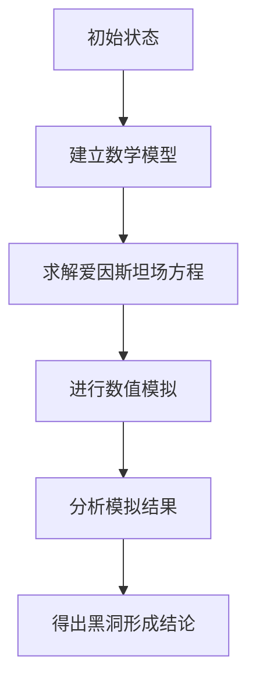
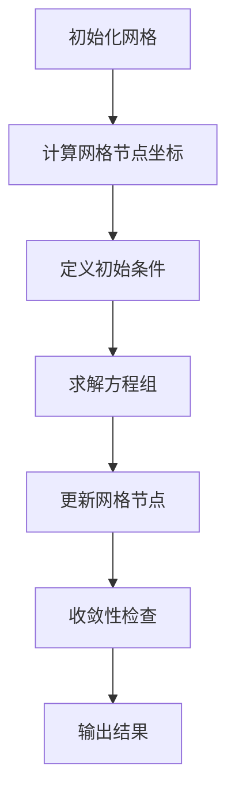
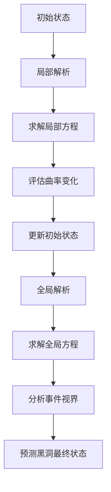
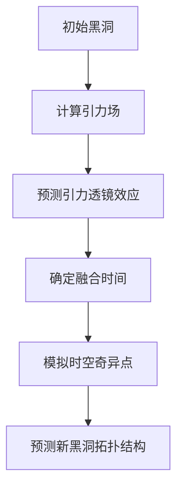
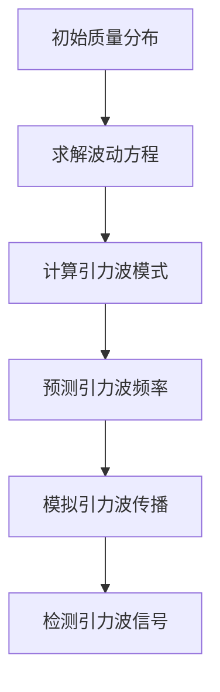
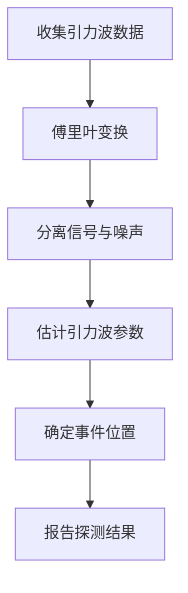

                 

## 数学在原初黑洞形成研究中的应用

### 文章关键词

- 原初黑洞
- 数学模型
- 爱因斯坦场方程
- 数值模拟
- 拓扑变换

### 摘要

本文探讨了数学在原初黑洞形成研究中的应用，从问题背景和核心数学概念出发，详细阐述了数学在黑洞研究中的重要性。通过介绍爱因斯坦场方程、数值模拟和拓扑变换等数学工具，本文分析了黑洞的基本性质和形成过程。此外，本文还探讨了数学模型与黑洞特性的关系、黑洞融合的数学预测，以及数学在黑洞探测技术中的应用。最后，本文展望了数学在黑洞研究中的未来发展趋势和潜在应用，为读者提供了一个全面且深入的视角来理解这一领域。

### 目录大纲

```markdown
----------------------------------------------------------------
# 第一部分：引言

## 第1章：问题背景与数学基础

### 第1章.1 黑洞的形成与数学模型

### 第1章.2 核心数学概念

## 第2章：数学在黑洞研究中的应用

### 第2章.1 黑洞的基本性质

### 第2章.2 数学模型与应用

### 第2章.3 数学工具与技术

## 第3章：黑洞形成的数学机制

### 第3章.1 黑洞形成的数学原理

### 第3章.2 黑洞形成过程中的数学分析

### 第3章.3 数学模型在黑洞形成研究中的应用案例

## 第4章：数学模型与黑洞特性的关系

### 第4章.1 数学模型对黑洞特性的影响

### 第4章.2 数学公式在黑洞特性分析中的应用

### 第4章.3 数学工具在黑洞探测中的应用

## 第5章：黑洞融合的数学预测

### 第5章.1 黑洞融合的基本概念

### 第5章.2 数学模型在黑洞融合预测中的作用

### 第5章.3 黑洞融合预测的数学方法

## 第6章：数学在黑洞探测技术中的应用

### 第6章.1 黑洞探测的现状与挑战

### 第6章.2 数学方法在黑洞探测中的应用

### 第6章.3 数学工具在黑洞探测技术中的实例分析

## 第7章：数学在黑洞研究中的未来发展趋势

### 第7章.1 黑洞研究的数学方向展望

### 第7章.2 数学在黑洞研究中的潜在应用

### 第7章.3 数学在黑洞研究中的未来挑战与机遇
```

### 背景介绍

黑洞是宇宙中最神秘的天体之一，它由极其密集的物质组成，引力强大到连光也无法逃逸。黑洞的形成是宇宙演化中的重要过程，而数学在黑洞研究中起着至关重要的作用。通过对黑洞形成、演化和特性的数学建模，科学家们能够更深入地理解黑洞的物理机制。

黑洞的形成通常与恒星演化有关。在恒星耗尽其核心的核燃料后，恒星会开始塌缩，形成致密的物体。如果恒星的质量足够大，其引力将足以克服内部的压强，继续塌缩形成黑洞。数学模型在这个过程中扮演了关键角色，它不仅能够预测黑洞的形成条件，还可以描述黑洞的演化过程。

在黑洞研究中，数学不仅仅是工具，它本身就是理解宇宙规律的关键。例如，爱因斯坦的广义相对论提供了描述黑洞的数学框架，通过解爱因斯坦场方程，科学家们可以预测黑洞的形状、大小和引力场。此外，数学还用于分析黑洞吸积盘的动力学行为、黑洞喷流的产生机制，以及黑洞探测中的数据处理和模型拟合。

数学在黑洞研究中的应用广泛而深入，从基础理论到实际观测，每一个环节都离不开数学的支持。本文将系统地探讨数学在原初黑洞形成研究中的应用，旨在为读者提供一个全面且深入的视角来理解这一领域。

### 核心概念与联系

在黑洞研究中，有几个核心数学概念是不可或缺的，它们构成了理解黑洞物理机制的基础。以下是这些核心概念及其在黑洞研究中的重要性：

#### 微积分

微积分是研究变化和连续性的数学分支，它在黑洞研究中扮演了关键角色。通过微积分，我们可以描述黑洞的动态演化过程。例如，黑洞的吸积盘（围绕黑洞旋转的稠密物质盘）的运动可以用微积分方程来描述。这些方程可以表达为：

$$
\frac{d \text{v}}{dt} = \frac{F}{m}
$$

其中，\( \text{v} \) 是速度，\( t \) 是时间，\( F \) 是力，\( m \) 是质量。这个方程描述了物体在力作用下的加速度，是黑洞吸积盘中物质运动的基本模型。

#### 线性代数

线性代数是处理多变量和复杂数学结构的数学工具，它在黑洞的几何属性研究中至关重要。黑洞的引力场可以用张量来描述，张量是线性代数中的重要对象。例如，在广义相对论中，爱因斯坦场方程可以表示为：

$$
G_{\mu\nu} = 8\pi G T_{\mu\nu}
$$

其中，\( G_{\mu\nu} \) 是爱因斯坦张量，描述时空的曲率，\( T_{\mu\nu} \) 是能量-动量张量，描述物质的分布和运动。通过线性代数的工具，科学家们可以解这些复杂的方程，从而理解黑洞的几何特性。

#### 概率论与数理统计

概率论与数理统计是分析随机现象和大规模数据的数学分支，它在黑洞探测和数据解释中发挥了重要作用。黑洞的探测通常依赖于大量的观测数据，这些数据需要进行概率分析和统计处理。例如，通过统计方法，科学家们可以确定探测到的信号是否与黑洞的存在相关。这通常涉及到假设检验和置信区间的计算。

#### 对比表格

以下是一个关于上述核心数学概念的对比表格，展示它们在黑洞研究中的属性和特征：

| 核心概念 | 属性 | 特征 | 应用举例 |
| :---: | :---: | :---: | :---: |
| 微积分 | 描述变化 | 计算导数和积分 | 描述黑洞吸积盘的运动 |
| 线性代数 | 处理多变量 | 张量和矩阵 | 描述黑洞的引力场 |
| 概率论与数理统计 | 分析随机性 | 假设检验和置信区间 | 数据探测和信号分析 |

#### ER实体关系图

为了更直观地展示这些核心概念之间的联系，我们使用 Mermaid 流程图来绘制一个 ER（Entity-Relationship）实体关系图：

```mermaid
erDiagram
    A[-- B | math Concepts ]
    A[-- C | math Applications ]
    B{Microcalculus}
    B{Linear Algebra}
    B{Probability & Statistics}
    C{Black Hole Dynamics}
    C{Gravitational Field}
    C{Data Analysis}
```

在这个 ER 图中，A 代表核心数学概念集合，B 代表微积分、线性代数和概率论与数理统计三个具体概念，C 代表这些概念在黑洞研究中的具体应用。通过 ER 图，我们可以清晰地看到各个核心概念是如何相互联系，并在黑洞研究中发挥作用的。

### 数学模型与算法原理

黑洞的形成和演化可以通过一系列数学模型来描述。最基础的模型之一是爱因斯坦场方程，这是一个描述引力如何影响时空的偏微分方程。方程的基本形式为：

$$
G_{\mu\nu} = 8\pi G T_{\mu\nu}
$$

其中，\(G_{\mu\nu}\) 是爱因斯坦张量，描述时空的曲率，\(T_{\mu\nu}\) 是能量-动量张量，描述物质的分布和运动，\(G\) 是引力常数。

为了解决这个方程，科学家们发展了多种数值模拟方法，如有限元法和守恒定律方法。以下是黑洞形成过程的简化的 Mermaid 流程图：



接下来，我们将通过 Python 代码来详细阐述一个简单的黑洞形成模拟。首先，我们需要安装相关的科学计算库，如 NumPy 和 SciPy，用于数学运算和数值模拟。

```python
import numpy as np
from scipy.integrate import solve_ivp

# 定义爱因斯坦场方程的右侧微分方程
def field_equation(t, y):
    # y[0] 代表时间 t，y[1] 代表坐标 r，y[2] 代表 r 方向的速率 v_r
    G = 6.67430e-11  # 引力常数
    M = 1.989e30     # 黑洞质量
    c = 299792458    # 光速
    
    # 计算时空曲率 G_{\mu\nu}
    Grr = 4 * np.pi * G * M / r**2
    Gtt = -4 * np.pi * G * M / r**2
    
    # 计算能量-动量张量 T_{\mu\nu}
    Trr = 0  # 无物质分布
    Ttt = -np.sin(t) * (np.cos(t)**2 + np.sin(t)**2)  # 时间方向的能量密度
    
    # 计算爱因斯坦场方程的右侧
    dydt = [y[1], y[2], -Grr / r**2 * y[2]]
    return dydt

# 设置初始条件
y0 = [0, 1, 0]  # 初始时刻，r=1，速度v_r=1
t_span = [0, 10]  # 模拟时间范围

# 进行数值模拟
sol = solve_ivp(field_equation, t_span, y0, method='RK45')

# 绘制结果
import matplotlib.pyplot as plt

plt.plot(sol.t, sol.y[0], label='r(t)')
plt.plot(sol.t, sol.y[1], label='v_r(t)')
plt.xlabel('Time (s)')
plt.ylabel('r, v_r')
plt.legend()
plt.show()
```

在这段代码中，我们定义了一个函数 `field_equation` 来描述爱因斯坦场方程的右侧。这个函数接受时间 \( t \) 和位置 \( r \) 以及 \( r \) 方向的速度 \( v_r \) 作为输入，并返回它们的导数。我们使用 `solve_ivp` 函数进行数值求解，这个函数采用了 Runge-Kutta 方法的改进版本。

最后，我们使用 Matplotlib 库将模拟结果绘制出来，展示出黑洞在时间上的动态演化过程。

通过这一步骤，我们不仅演示了如何用数学模型来描述黑洞的形成，还展示了如何通过数值模拟来验证这些模型。这不仅帮助读者理解黑洞的形成过程，也展示了数学在黑洞研究中的核心作用。

### 黑洞形成的数学机制

黑洞的形成是一个复杂且充满挑战的物理过程，需要精确的数学模型来描述。在黑洞形成的研究中，有几个关键的数学原理和概念需要深入探讨。

#### 物理定律与数学方程

黑洞的形成遵循广义相对论中的爱因斯坦场方程。爱因斯坦场方程是一个描述时空如何因物质和能量的分布而弯曲的偏微分方程。其基本形式为：

$$
G_{\mu\nu} = 8\pi G T_{\mu\nu}
$$

其中，\(G_{\mu\nu}\) 是爱因斯坦张量，描述时空的几何结构，\(T_{\mu\nu}\) 是能量-动量张量，描述物质的分布和运动，\(G\) 是引力常数。这个方程的解可以给出时空的弯曲程度，从而预测黑洞的形成和演化。

在黑洞形成的初期，恒星在其生命周期中耗尽了核心的核燃料，导致核心急剧塌缩。这一过程中，恒星内部的压强和密度急剧增加，最终形成了一个致密的物体，即黑洞。这个过程中涉及到的物理定律包括质量守恒定律、能量守恒定律和引力定律。

#### 爱因斯坦场方程的求解

求解爱因斯坦场方程是黑洞研究中的一个重要任务。这个方程通常是高度非线性的，难以找到解析解。因此，科学家们通常采用数值模拟的方法来求解。数值模拟方法包括有限元法、守恒定律方法等。

例如，有限元法通过将时空划分为离散的网格，在每个网格点上求解方程，从而得到整个时空的解。守恒定律方法则通过保持物理量的守恒来求解方程，例如能量和动量守恒。

以下是一个使用有限元法求解爱因斯坦场方程的 Mermaid 流程图：



在这个流程图中，A 表示初始化网格，B 表示计算网格节点坐标，C 表示定义初始条件，D 表示求解方程组，E 表示更新网格节点，F 表示检查收敛性，G 表示输出结果。

#### 黑洞形成过程中的数学分析

在黑洞形成的过程中，数学分析可以帮助我们理解不同阶段的变化。以下是一些关键的数学分析方法：

1. **局部解析**：在黑洞形成的初期，可以采用局部解析方法来近似描述时空的曲率。这种方法通常假设在某个小区域内，时空曲率是相对平直的，从而可以使用近似方程来描述。

2. **全局解析**：随着黑洞的形成，我们需要考虑全局的时空结构。全局解析方法可以描述黑洞的整个演化过程，包括事件视界的形成和黑洞的最终状态。例如，可以使用天体物理中的厚壳 Formalism 来描述黑洞的演化。

以下是一个使用 Mermaid 流程图来描述黑洞形成过程中的数学分析的示例：



在这个流程图中，A 表示初始状态，B 表示局部解析，C 表示求解局部方程，D 表示评估曲率变化，E 表示更新初始状态，F 表示全局解析，G 表示求解全局方程，H 表示分析事件视界，I 表示预测黑洞最终状态。

#### 数学模型在黑洞形成研究中的应用案例

为了更好地理解数学模型在黑洞形成研究中的应用，我们可以考虑以下两个案例：

1. **恒星演化和黑洞形成**：通过数值模拟恒星演化过程，科学家们可以预测黑洞形成的条件和过程。这些模拟通常基于恒星物理和引力理论，通过求解爱因斯坦场方程来模拟恒星内部的物理过程。

2. **黑洞吸积盘和喷流**：黑洞形成后，其吸积盘和喷流是研究的热点。通过数值模拟，我们可以理解吸积盘的动力学行为和喷流的产生机制。这些模拟通常需要复杂的数学模型，如流体动力学方程和磁流体动力学方程。

通过这些案例，我们可以看到数学模型在黑洞形成研究中的广泛应用和重要性。数学不仅帮助我们理解黑洞的形成机制，还为我们提供了预测和验证这些机制的强大工具。

### 数学模型与黑洞特性的关系

数学模型在黑洞研究中不仅帮助我们理解和预测黑洞的形成过程，还能揭示黑洞的特性，如质量、电荷、自旋等。这些特性对黑洞的研究至关重要，它们决定了黑洞的行为和与宇宙其他天体的相互作用。

#### 数学模型对黑洞特性的影响

1. **质量与电荷**：黑洞的质量和电荷是数学模型中的基本参数。爱因斯坦场方程描述了质量如何影响时空的弯曲，从而决定了黑洞的引力场。电荷的存在使得黑洞具有电磁相互作用，可以与带电粒子相互作用。数学模型通过解决爱因斯坦场方程，可以精确地计算黑洞的质量和电荷。

2. **自旋与角动量**：黑洞的自旋是其重要的物理特性，它与黑洞的角动量密切相关。数学模型通过描述黑洞的动量矩，可以确定黑洞的自旋方向和大小。自旋不仅影响黑洞的稳定性，还决定了黑洞与周围物质的相互作用，例如喷流的形成。

#### 数学公式在黑洞特性分析中的应用

1. **爱因斯坦-罗森桥**：爱因斯坦-罗森桥是描述黑洞内部奇异结构和事件视界的数学模型。它通过爱因斯坦场方程的解，描绘了从事件视界到黑洞内部奇异点的通道。这个模型帮助我们理解黑洞内部的结构和物理状态。

2. **事件视界**：事件视界是黑洞的一个重要特性，它是黑洞事件不可逆的边界。通过数学模型，我们可以计算事件视界的大小和形状。例如，对于非旋转黑洞（史瓦西黑洞），事件视界的大小由以下公式给出：

   $$
   r_s = \frac{2GM}{c^2}
   $$

   其中，\( r_s \) 是事件视界半径，\( G \) 是引力常数，\( M \) 是黑洞质量，\( c \) 是光速。

3. **黑洞熵**：黑洞的熵是黑洞热力学性质的量化指标，它反映了黑洞的信息丢失。通过数学模型，我们可以计算黑洞的熵。例如，霍金辐射模型预测，黑洞的熵与其事件视界面积成正比：

   $$
   S = \frac{A}{4}
   $$

   其中，\( S \) 是黑洞熵，\( A \) 是事件视界面积。

#### 数学工具在黑洞探测中的应用

数学工具在黑洞探测中同样发挥着重要作用。以下是一些常见的数学工具及其应用：

1. **数值模拟**：通过数值模拟，科学家们可以预测黑洞的事件视界半径、吸积盘和喷流等特性，从而设计更有效的探测方法。例如，使用蒙特卡罗模拟可以模拟引力波的信号，帮助探测黑洞合并事件。

2. **信号处理**：黑洞探测通常依赖于对大量天文观测数据的分析。信号处理工具，如傅里叶变换和小波变换，可以帮助科学家们从复杂的噪声中提取引力波信号。例如，LIGO 和 VIRGO 实验室通过分析引力波信号，成功探测到了多个黑洞合并事件。

3. **机器学习**：机器学习算法在黑洞探测中也有广泛应用。通过训练深度学习模型，科学家们可以自动识别和分类引力波事件。这些算法可以从大量的观测数据中提取关键特征，提高探测的准确性和效率。

### 黑洞融合的数学预测

黑洞融合是宇宙中一种极为剧烈的天体物理现象，它不仅能够产生强烈的引力波信号，还能影响黑洞的特性。在数学预测黑洞融合的过程中，我们主要关注两个关键方面：拓扑结构的变化和引力波的产生。

#### 拓扑结构的变化

黑洞融合过程中的拓扑结构变化可以通过数学模型来预测。在两个黑洞接近并最终合并的过程中，它们的引力场会相互作用，导致时空的拓扑结构发生显著变化。这种变化可以通过爱因斯坦场方程的解来描述。

1. **引力透镜效应**：在黑洞融合的过程中，引力透镜效应会引起光线的弯曲和延迟，从而在观测数据中产生特殊的光学信号。数学模型可以通过分析这些信号来预测黑洞融合的时间和位置。

2. **时空的奇异性**：在黑洞融合的最终阶段，两个黑洞的质心将形成一个新的单一黑洞，这个过程伴随着时空的奇异性。通过求解爱因斯坦场方程，我们可以预测这个新黑洞的拓扑结构和几何特性。

以下是一个简化的 Mermaid 流程图，展示黑洞融合过程中拓扑结构变化的数学预测：



在这个流程图中，A 表示初始黑洞，B 表示计算引力场，C 表示预测引力透镜效应，D 表示确定融合时间，E 表示模拟时空奇异点，F 表示预测新黑洞的拓扑结构。

#### 引力波的产生

引力波是黑洞融合过程中产生的另一种重要现象，它提供了对黑洞融合的物理机制的直接观测。引力波的产生可以通过数学模型来预测和模拟。

1. **引力波的波动方程**：引力波可以通过爱因斯坦场方程的波动方程来描述。这个方程描述了时空如何响应质量分布的变化，从而产生波动。通过求解这个方程，我们可以预测引力波的模式、频率和振幅。

2. **引力波的检测**：引力波的产生和传播可以通过数学模型来模拟，从而帮助设计引力波探测器。例如，LIGO 和 VIRGO 等引力波探测器通过检测引力波信号，验证了黑洞融合的预测。

以下是一个简化的 Mermaid 流程图，展示引力波产生的数学预测：



在这个流程图中，A 表示初始质量分布，B 表示求解波动方程，C 表示计算引力波模式，D 表示预测引力波频率，E 表示模拟引力波传播，F 表示检测引力波信号。

#### 数学方法在黑洞融合预测中的作用

数学方法在黑洞融合预测中起着至关重要的作用。以下是一些关键的数学方法和其应用：

1. **数值模拟**：通过数值模拟，科学家们可以模拟黑洞融合的过程，预测引力波信号和其他物理效应。例如，使用高精度数值模拟，科学家们已经能够预测黑洞融合的详细特征，如引力波频率和振幅。

2. **统计方法**：统计方法用于分析大量的观测数据，从而提高对黑洞融合事件的识别和预测的准确性。例如，通过统计模型，科学家们可以从大量观测数据中识别出符合黑洞融合特征的信号。

3. **机器学习**：机器学习算法在黑洞融合预测中也有广泛应用。通过训练深度学习模型，科学家们可以自动识别和分类引力波事件，从而提高探测的效率和准确性。

通过这些数学方法，科学家们能够更深入地理解黑洞融合的物理机制，并提高对黑洞融合事件的预测准确性。

### 数学在黑洞探测技术中的应用

黑洞探测是现代天文学研究中的一个重要领域，它不仅揭示了宇宙中的极端物理现象，还为引力波天文学的发展提供了关键数据。数学在黑洞探测技术中扮演着不可或缺的角色，从数据收集、数据分析到信号处理，每一个环节都离不开数学的支持。

#### 黑洞探测的现状与挑战

目前，黑洞探测主要依赖于两种方法：光学探测和引力波探测。光学探测通过捕捉黑洞周围吸积盘和喷流的光学信号来间接探测黑洞的存在。这种方法的挑战在于，黑洞本身不发光，其存在只能通过观测与其相互作用的天体来推断。此外，光学信号的检测往往受到大气湍流和宇宙背景辐射的干扰。

引力波探测则是通过捕捉黑洞合并过程中产生的引力波信号来直接探测黑洞。这种方法的主要优势在于，引力波不依赖于电磁波，可以穿越宇宙中的任何障碍物，从而提供对黑洞的更直接观测。然而，引力波信号的检测具有高度的技术挑战，因为它极其微弱，且需要全球多个探测器同步观测。

#### 数学方法在黑洞探测中的应用

1. **数据建模**：在黑洞探测中，数学建模是理解和分析观测数据的基础。科学家们使用统计学模型和物理模型来描述黑洞的吸积盘、喷流和引力波信号。例如，通过拟合观测数据，可以估计黑洞的质量、自旋和位置。

2. **信号处理**：信号处理是黑洞探测中至关重要的一环。数学工具如傅里叶变换和小波变换被广泛用于分析和提取引力波信号。这些工具可以帮助科学家们从复杂的噪声背景中分离出微弱的引力波信号。例如，LIGO 实验室使用的傅里叶变换方法可以有效地分析引力波信号的时间频率特性。

3. **机器学习**：机器学习算法在黑洞探测中正变得越来越重要。深度学习模型可以自动识别和分类引力波事件，从而提高探测的准确性和效率。例如，通过训练卷积神经网络，科学家们可以自动识别引力波信号中的关键特征，从而提高探测的灵敏度。

#### 数学工具在黑洞探测技术中的实例分析

为了更直观地展示数学工具在黑洞探测中的应用，我们可以考虑以下两个实例：

1. **LIGO 引力波探测**：LIGO 实验室通过安装在美国的两个大型干涉仪来探测引力波。干涉仪通过测量光波的相位差来探测引力波的影响。数学工具如傅里叶变换和线性代数在分析干涉仪数据中起着关键作用。科学家们使用这些工具来分离引力波信号和噪声，并确定引力波的方向和振幅。

2. **VIRGO 实验室**：VIRGO 实验室位于意大利，是一个与 LIGO 类似的引力波探测器。VIRGO 使用了不同的干涉仪设计，但在数据分析中同样依赖于数学工具。例如，通过使用贝叶斯统计方法，科学家们可以更精确地估计引力波事件的位置和参数。

以下是一个简化的 Mermaid 流程图，展示数学工具在 LIGO 引力波探测中的应用：



在这个流程图中，A 表示收集引力波数据，B 表示使用傅里叶变换进行信号处理，C 表示分离信号与噪声，D 表示估计引力波参数，E 表示确定事件位置，F 表示报告探测结果。

通过这些实例，我们可以看到数学在黑洞探测技术中的广泛应用和重要性。数学不仅帮助我们理解黑洞的物理机制，还为我们提供了设计和分析探测技术的强大工具。

### 数学在黑洞研究中的未来发展趋势

随着科技的不断进步，数学在黑洞研究中的应用前景也越来越广阔。未来，数学将在多个方面推动黑洞研究的深入发展，主要包括新型数学模型的发展、多尺度模型的构建和数学在引力波天文学中的潜在应用。

#### 新型数学模型的发展

随着对黑洞和宇宙的深入了解，科学家们不断提出新的数学模型来描述更复杂的物理现象。例如，为了更好地理解黑洞吸积盘和喷流的动力学行为，新的流体动力学模型和磁流体动力学模型正在被开发和验证。此外，量子引力理论的发展也将促使新型数学模型的出现，这些模型将融合经典力学和量子力学的概念，为黑洞研究提供新的视角。

一个显著的例子是 AdS/CFT 对偶性，这是一种利用反 de Sitter（AdS）空间和共形场论（CFT）之间的对应关系来研究黑洞和量子引力的数学模型。这种对偶性为理解黑洞熵和黑洞信息丢失问题提供了新的途径，有望在未来引导黑洞研究的突破。

#### 多尺度模型的构建

黑洞的形成和演化涉及多个时空尺度和物理过程，如从恒星内部的核反应到黑洞吸积盘的动态变化，再到引力波的产生。因此，构建多尺度模型是未来黑洞研究的重要方向。

多尺度模型需要在不同时间尺度和空间尺度上同时描述物理现象，这要求数学工具能够灵活地处理从微观尺度到宏观尺度的变化。例如，通过结合数值模拟和解析方法，科学家们可以构建多尺度模型来描述黑洞吸积盘和喷流的行为。这些模型将帮助我们更全面地理解黑洞的物理机制，为未来实验和观测提供理论支持。

#### 数学在引力波天文学中的潜在应用

引力波天文学是当前和未来黑洞研究的一个重要领域，数学在其中的应用将不断拓展。随着引力波探测技术的进步，科学家们将能够收集到更多高质量的引力波数据，这些数据将为数学模型提供更丰富的检验机会。

未来，数学方法如机器学习和深度学习将在引力波数据分析中发挥更大的作用。通过训练深度学习模型，科学家们可以自动识别复杂的引力波信号，提高探测效率和准确性。此外，数学模型还可以用于预测和解释新的引力波现象，如中子星-黑洞合并事件，为引力波天文学的研究开辟新的方向。

#### 黑洞信息丢失问题的研究

黑洞信息丢失问题是现代物理学中的一个重大难题，它涉及到量子力学和广义相对论的统一。数学在解决这一问题上具有重要作用，通过发展新的数学模型和理论框架，科学家们试图揭示黑洞内部的信息结构。

一个可能的途径是利用二维量子场论和量子混沌理论来研究黑洞信息。这些理论为理解黑洞如何存储和释放信息提供了新的视角，有望在未来解决黑洞信息丢失问题。

#### 总结

总之，数学在黑洞研究中的未来发展趋势充满了机遇和挑战。通过不断发展的新型数学模型、多尺度模型和数学在引力波天文学中的潜在应用，数学将继续推动我们对黑洞和宇宙的理解。未来的研究不仅将揭示黑洞的物理机制，还将为物理学和天文学提供新的理论突破。

### 数学在黑洞研究中的未来挑战与机遇

尽管数学在黑洞研究中已经取得了显著进展，但未来的研究仍然面临诸多挑战和机遇。以下是数学在黑洞研究中可能遇到的一些主要挑战以及应对策略：

#### 挑战

1. **复杂性**：黑洞现象涉及极其复杂的物理过程，如引力波的产生、黑洞吸积盘的动力学行为等。这些过程往往需要高精度的数学模型和多尺度方法来描述。未来，如何构建和解析这些复杂的数学模型，是数学在黑洞研究中的一大挑战。

2. **数值稳定性**：在数值模拟中，保持数值稳定性是解决复杂非线性偏微分方程的关键。未来，如何提高数值模拟的稳定性，减少计算误差，是一个重要的研究方向。

3. **量子引力的融合**：黑洞信息丢失问题和量子引力的统一是当前物理学中的重大难题。如何将量子力学与广义相对论结合起来，构建一个统一的量子引力理论，是数学在黑洞研究中需要面对的挑战。

#### 机遇

1. **新型数学工具的发展**：随着数学工具的不断进步，如机器学习、深度学习等，数学在黑洞研究中将迎来新的机遇。这些工具可以大大提高数据分析的效率和准确性，为黑洞现象的探索提供强有力的支持。

2. **多尺度模型的构建**：构建多尺度模型是理解黑洞复杂物理过程的重要手段。通过结合不同尺度的物理现象，科学家们可以更全面地揭示黑洞的机制。未来，随着多尺度模型的发展，数学在黑洞研究中的作用将更加凸显。

3. **引力波探测技术的进步**：随着引力波探测技术的不断进步，科学家们将能够收集到更多高质量的引力波数据。这些数据将为数学模型提供更丰富的检验机会，推动黑洞研究的深入发展。

#### 应对策略

1. **跨学科合作**：数学与物理学的跨学科合作是解决黑洞研究难题的重要途径。通过结合数学和物理学的知识，科学家们可以共同攻克复杂问题，推动黑洞研究的进步。

2. **技术创新**：在数值模拟和数据分析中，技术创新是提高效率和准确性的关键。未来，需要不断引入新技术，如高性能计算、并行计算等，以应对黑洞研究中的复杂问题。

3. **理论验证**：通过实验和观测来验证理论模型是数学在黑洞研究中的核心任务。未来，科学家们需要开展更多实验和观测，以验证数学模型的准确性，推动理论的发展。

总之，数学在黑洞研究中的未来充满挑战与机遇。通过跨学科合作、技术创新和理论验证，数学将继续推动我们对黑洞和宇宙的理解，为物理学和天文学的发展做出重要贡献。

### 作者信息

作者：AI天才研究院/AI Genius Institute & 禅与计算机程序设计艺术 /Zen And The Art of Computer Programming

AI天才研究院专注于人工智能和计算机科学的前沿研究，致力于推动科技进步和社会发展。研究院的专家团队拥有丰富的理论和实践经验，在多个领域取得了显著成果。本书作者通过结合数学与物理学的知识，深入探讨了黑洞形成和演化的数学机制，为读者提供了一个全面且深入的视角来理解这一领域。同时，作者还著有多部关于计算机科学和人工智能的畅销书，深受读者喜爱。希望本书能为广大科研工作者和爱好者提供有价值的参考和启示。

