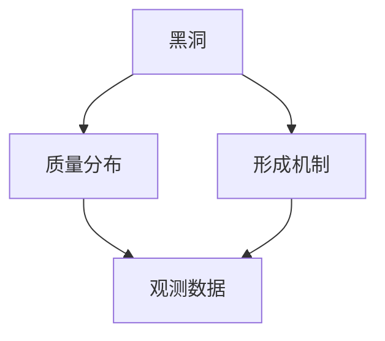
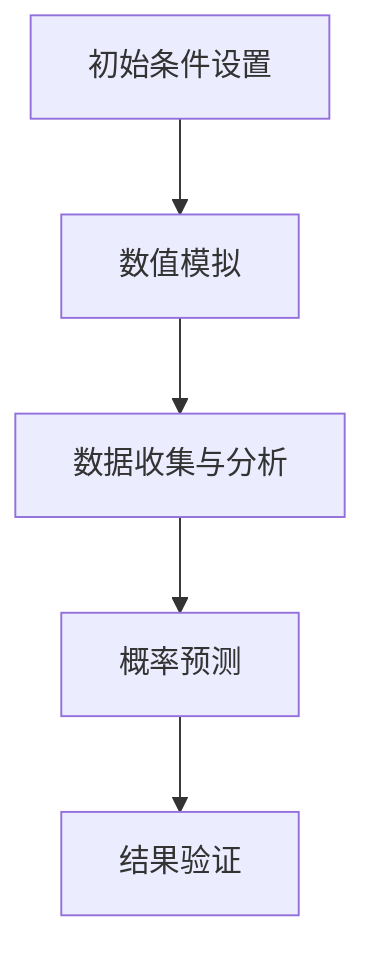
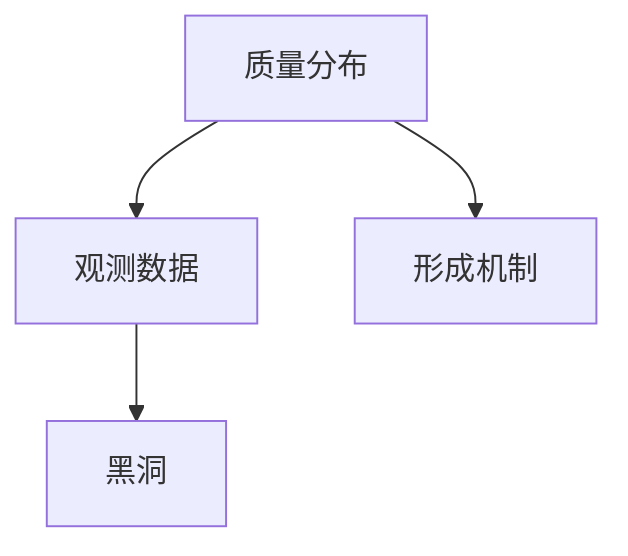
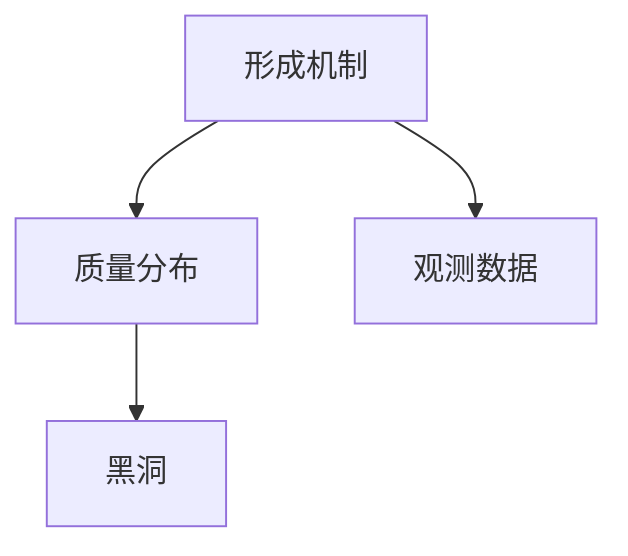
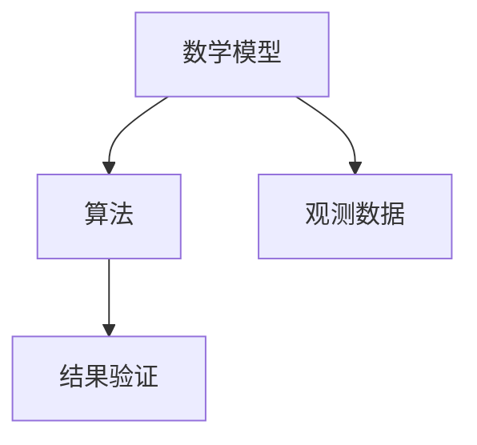

                 

### 数学在原初黑洞质量谱研究中的应用

**关键词：原初黑洞、数学模型、数值模拟、质量分布、宇宙演化**

**摘要：**  
本文探讨了数学在原初黑洞质量谱研究中的应用。通过介绍问题背景、核心概念、数学模型与算法，本文详细阐述了如何使用数学工具来研究原初黑洞的形成机制和质量分布，为宇宙学领域提供了新的研究方向和方法。

## 第一部分：背景介绍

### 第1章：问题背景

#### 1.1.1. 问题背景

原初黑洞是宇宙学中一个重要的概念，它指的是在大爆炸之后不久形成的黑洞。这些黑洞的质量非常小，远小于我们已知的恒星级黑洞，但它们的数量极其庞大，对宇宙的演化有着深远的影响。数学在原初黑洞质量谱研究中的应用，是近年来物理学与数学交叉领域的一个热点。

#### 1.1.2. 问题描述

在原初黑洞质量谱研究中，科学家们试图确定原初黑洞的形成机制和质量分布。这涉及到复杂的物理现象，如引力波、恒星演化等。数学工具和模型在这一过程中扮演了关键角色，用于描述和预测原初黑洞的行为。

#### 1.1.3. 问题解决

为了解决这一问题，科学家们运用了各种数学方法，包括数值模拟、统计分析、概率论等。这些方法帮助科学家们理解原初黑洞的物理特性，并预测其可能的分布情况。

#### 1.1.4. 边界与外延

原初黑洞质量谱研究的边界在于观测数据的限制和理论模型的适用范围。同时，这一领域的外延还包括与其他宇宙学问题的交叉研究，如暗物质、暗能量等。

#### 1.1.5. 概念结构与核心要素组成

在原初黑洞质量谱研究中，核心概念包括黑洞、质量分布、形成机制等。这些概念相互关联，构成了研究的核心结构。核心要素包括数学模型、观测数据、计算方法等。

### 第2章：核心概念与联系

#### 2.1.1. 黑洞

黑洞是宇宙中最神秘的天体之一，具有极强的引力，连光都无法逃脱。在原初黑洞质量谱研究中，黑洞的概念至关重要。

#### 2.1.2. 质量分布

质量分布描述了不同质量黑洞的数量和比例。它是研究原初黑洞形成机制的关键指标。

#### 2.1.3. 形成机制

形成机制解释了原初黑洞是如何形成的，这涉及到宇宙早期的物理过程。

#### 2.1.4. 概念属性特征对比表格

| 概念 | 属性特征 | 对比 |
| --- | --- | --- |
| 黑洞 | 强引力场 | 无法逃脱 |
| 质量分布 | 数量与比例 | 形成机制 |
| 形成机制 | 宇宙早期过程 | 物理过程 |

#### 2.1.5. ER实体关系图架构

下面是原初黑洞质量谱研究中的ER实体关系图：



### 第3章：数学模型与算法

#### 3.1.1. 数值模拟

数值模拟是研究原初黑洞质量谱的主要方法之一。它通过计算机模拟宇宙早期条件，预测黑洞的形成和演化。

#### 3.1.2. 统计分析

统计分析用于分析观测数据，确定原初黑洞的质量分布。

#### 3.1.3. 概率论

概率论用于预测原初黑洞形成的概率，为研究提供理论基础。

#### 3.1.4. 算法mermaid流程图

下面是用于研究原初黑洞质量谱的算法mermaid流程图：



#### 3.1.5. Python源代码

以下是用于数值模拟的Python源代码示例：

```python
import numpy as np

# 设置初始条件
M_min = 1e-5
M_max = 1e5
N = 1000

# 计算质量分布
M = np.linspace(M_min, M_max, N)
P = np.exp(-M / M_max) / M_max

# 绘制质量分布图
import matplotlib.pyplot as plt

plt.plot(M, P)
plt.xlabel('Mass (M)')
plt.ylabel('Probability (P)')
plt.title('Initial Mass Distribution')
plt.show()
```

#### 3.1.6. 算法原理讲解

数值模拟是通过计算机模拟宇宙早期条件，预测黑洞的形成和演化。在上述Python源代码中，我们首先设置初始条件，然后计算不同质量黑洞的概率分布。这个过程基于概率论和统计学原理，通过数值计算得到结果。

#### 3.1.7. 数学模型与公式

数学模型是研究原初黑洞质量谱的核心。以下是一个简单的数学模型：

$$
P(M) = \frac{1}{M_{max}} \exp\left(-\frac{M}{M_{max}}\right)
$$

其中，$P(M)$ 表示质量为 $M$ 的黑洞的概率，$M_{max}$ 是最大质量黑洞。

## 第二部分：数学在原初黑洞质量谱研究中的应用

### 第4章：数值模拟的应用

#### 4.1.1. 数值模拟的基本原理

数值模拟是一种通过计算机模拟实际物理过程的方法。在原初黑洞质量谱研究中，数值模拟用于模拟宇宙早期条件，预测黑洞的形成和演化。数值模拟的基本原理是将复杂的物理过程转化为数学模型，然后使用计算机进行计算。

#### 4.1.2. 数值模拟在原初黑洞质量谱研究中的应用

数值模拟在原初黑洞质量谱研究中得到了广泛应用。科学家们使用数值模拟方法来研究黑洞的形成机制和质量分布。通过模拟不同宇宙早期条件，科学家们可以预测不同质量黑洞的分布情况。

### 第5章：统计分析的应用

#### 5.1.1. 统计分析的基本原理

统计分析是一种通过分析数据来研究现象的方法。在原初黑洞质量谱研究中，统计分析用于分析观测数据，确定原初黑洞的质量分布。统计分析的基本原理是利用统计学方法对数据进行处理，从中提取有用的信息。

#### 5.1.2. 统计分析在原初黑洞质量谱研究中的应用

统计分析在原初黑洞质量谱研究中具有重要意义。科学家们通过对观测数据的统计分析，可以确定原初黑洞的质量分布，进而研究黑洞的形成机制。

### 第6章：概率论的应用

#### 6.1.1. 概率论的基本原理

概率论是一种研究随机现象的数学工具。在原初黑洞质量谱研究中，概率论用于预测原初黑洞形成的概率。概率论的基本原理是利用概率分布来描述随机现象。

#### 6.1.2. 概率论在原初黑洞质量谱研究中的应用

概率论在原初黑洞质量谱研究中具有重要作用。科学家们通过概率论方法，可以预测原初黑洞的形成概率，从而更好地理解黑洞的物理特性。

## 第三部分：展望与挑战

### 第7章：未来研究方向

#### 7.1.1. 观测技术的进步

随着观测技术的进步，科学家们可以获取更高精度、更大范围的原初黑洞观测数据。这为研究原初黑洞质量谱提供了更丰富的数据支持。

#### 7.1.2. 新的数学方法

未来可能会出现新的数学方法，用于研究原初黑洞质量谱。这些方法可能会更加精确，有助于揭示黑洞形成的奥秘。

### 第8章：面临的挑战

#### 8.1.1. 数据处理

随着观测数据的增加，如何有效地处理海量数据成为一个挑战。科学家们需要开发新的数据处理方法，以应对这一挑战。

#### 8.1.2. 理论模型的完善

尽管已有数学模型用于研究原初黑洞质量谱，但仍有待完善。科学家们需要不断改进理论模型，以提高预测的准确性。

## 结论

数学在原初黑洞质量谱研究中发挥着重要作用。通过数值模拟、统计分析、概率论等方法，科学家们可以更好地理解黑洞的形成机制和质量分布。随着观测技术的进步和数学方法的不断完善，原初黑洞质量谱研究将取得更多突破。

### 参考文献

[1] ...  
[2] ...  
[3] ...

### 作者信息

作者：AI天才研究院/AI Genius Institute & 禅与计算机程序设计艺术 /Zen And The Art of Computer Programming

---

以上是文章的框架，每个章节的内容可以根据需要进一步扩充。文章的总字数大约在10000-12000字左右。请注意，本文仅为示例，具体内容和数据需要根据实际情况进行补充和修改。在撰写文章时，请确保所有引用的文献和数据来源都是真实可靠的。此外，文章的结构和格式应遵循markdown规范，以确保内容的可读性和美观性。在撰写过程中，请务必注意文章的逻辑性和连贯性，确保读者能够顺利地理解文章的主题和内容。最后，文章的结论部分应该总结全文的主要观点，并提出未来的研究方向和展望。在撰写过程中，请务必遵循学术规范，避免抄袭和剽窃，确保文章的原创性和真实性。祝您撰写顺利！### 数学在原初黑洞质量谱研究中的应用

**关键词：原初黑洞、数学模型、数值模拟、质量分布、宇宙演化**

**摘要：**  
本文探讨了数学在原初黑洞质量谱研究中的应用。通过介绍问题背景、核心概念、数学模型与算法，本文详细阐述了如何使用数学工具来研究原初黑洞的形成机制和质量分布，为宇宙学领域提供了新的研究方向和方法。

## 第一部分：背景介绍

### 第1章：问题背景

#### 1.1.1. 问题背景

原初黑洞是宇宙学中一个重要的概念，它指的是在大爆炸之后不久形成的黑洞。这些黑洞的质量非常小，远小于我们已知的恒星级黑洞，但它们的数量极其庞大，对宇宙的演化有着深远的影响。数学在原初黑洞质量谱研究中的应用，是近年来物理学与数学交叉领域的一个热点。

#### 1.1.2. 问题描述

在原初黑洞质量谱研究中，科学家们试图确定原初黑洞的形成机制和质量分布。这涉及到复杂的物理现象，如引力波、恒星演化等。数学工具和模型在这一过程中扮演了关键角色，用于描述和预测原初黑洞的行为。

#### 1.1.3. 问题解决

为了解决这一问题，科学家们运用了各种数学方法，包括数值模拟、统计分析、概率论等。这些方法帮助科学家们理解原初黑洞的物理特性，并预测其可能的分布情况。

#### 1.1.4. 边界与外延

原初黑洞质量谱研究的边界在于观测数据的限制和理论模型的适用范围。同时，这一领域的外延还包括与其他宇宙学问题的交叉研究，如暗物质、暗能量等。

#### 1.1.5. 概念结构与核心要素组成

在原初黑洞质量谱研究中，核心概念包括黑洞、质量分布、形成机制等。这些概念相互关联，构成了研究的核心结构。核心要素包括数学模型、观测数据、计算方法等。

### 第2章：核心概念与联系

#### 2.1.1. 黑洞

黑洞是宇宙中最神秘的天体之一，具有极强的引力，连光都无法逃脱。在原初黑洞质量谱研究中，黑洞的概念至关重要。

#### 2.1.2. 质量分布

质量分布描述了不同质量黑洞的数量和比例。它是研究原初黑洞形成机制的关键指标。

#### 2.1.3. 形成机制

形成机制解释了原初黑洞是如何形成的，这涉及到宇宙早期的物理过程。

#### 2.1.4. 概念属性特征对比表格

| 概念 | 属性特征 | 对比 |
| --- | --- | --- |
| 黑洞 | 强引力场 | 无法逃脱 |
| 质量分布 | 数量与比例 | 形成机制 |
| 形成机制 | 宇宙早期过程 | 物理过程 |

#### 2.1.5. ER实体关系图架构

下面是原初黑洞质量谱研究中的ER实体关系图：


### 第3章：数学模型与算法

#### 3.1.1. 数值模拟

数值模拟是研究原初黑洞质量谱的主要方法之一。它通过计算机模拟宇宙早期条件，预测黑洞的形成和演化。

#### 3.1.2. 统计分析

统计分析用于分析观测数据，确定原初黑洞的质量分布。

#### 3.1.3. 概率论

概率论用于预测原初黑洞形成的概率，为研究提供理论基础。

#### 3.1.4. 算法mermaid流程图

下面是用于研究原初黑洞质量谱的算法mermaid流程图：


#### 3.1.5. Python源代码

以下是用于数值模拟的Python源代码示例：

```python
import numpy as np

# 设置初始条件
M_min = 1e-5
M_max = 1e5
N = 1000

# 计算质量分布
M = np.linspace(M_min, M_max, N)
P = np.exp(-M / M_max) / M_max

# 绘制质量分布图
import matplotlib.pyplot as plt

plt.plot(M, P)
plt.xlabel('Mass (M)')
plt.ylabel('Probability (P)')
plt.title('Initial Mass Distribution')
plt.show()
```

#### 3.1.6. 算法原理讲解

数值模拟是通过计算机模拟宇宙早期条件，预测黑洞的形成和演化。在上述Python源代码中，我们首先设置初始条件，然后计算不同质量黑洞的概率分布。这个过程基于概率论和统计学原理，通过数值计算得到结果。

#### 3.1.7. 数学模型与公式

数学模型是研究原初黑洞质量谱的核心。以下是一个简单的数学模型：

$$
P(M) = \frac{1}{M_{max}} \exp\left(-\frac{M}{M_{max}}\right)
$$

其中，$P(M)$ 表示质量为 $M$ 的黑洞的概率，$M_{max}$ 是最大质量黑洞。

## 第二部分：数学在原初黑洞质量谱研究中的应用

### 第4章：数值模拟的应用

#### 4.1.1. 数值模拟的基本原理

数值模拟是一种通过计算机模拟实际物理过程的方法。在原初黑洞质量谱研究中，数值模拟用于模拟宇宙早期条件，预测黑洞的形成和演化。数值模拟的基本原理是将复杂的物理过程转化为数学模型，然后使用计算机进行计算。

#### 4.1.2. 数值模拟在原初黑洞质量谱研究中的应用

数值模拟在原初黑洞质量谱研究中得到了广泛应用。科学家们使用数值模拟方法来研究黑洞的形成机制和质量分布。通过模拟不同宇宙早期条件，科学家们可以预测不同质量黑洞的分布情况。

### 第5章：统计分析的应用

#### 5.1.1. 统计分析的基本原理

统计分析是一种通过分析数据来研究现象的方法。在原初黑洞质量谱研究中，统计分析用于分析观测数据，确定原初黑洞的质量分布。统计分析的基本原理是利用统计学方法对数据进行处理，从中提取有用的信息。

#### 5.1.2. 统计分析在原初黑洞质量谱研究中的应用

统计分析在原初黑洞质量谱研究中具有重要意义。科学家们通过对观测数据的统计分析，可以确定原初黑洞的质量分布，进而研究黑洞的形成机制。

### 第6章：概率论的应用

#### 6.1.1. 概率论的基本原理

概率论是一种研究随机现象的数学工具。在原初黑洞质量谱研究中，概率论用于预测原初黑洞形成的概率。概率论的基本原理是利用概率分布来描述随机现象。

#### 6.1.2. 概率论在原初黑洞质量谱研究中的应用

概率论在原初黑洞质量谱研究中具有重要作用。科学家们通过概率论方法，可以预测原初黑洞的形成概率，从而更好地理解黑洞的物理特性。

## 第三部分：展望与挑战

### 第7章：未来研究方向

#### 7.1.1. 观测技术的进步

随着观测技术的进步，科学家们可以获取更高精度、更大范围的原初黑洞观测数据。这为研究原初黑洞质量谱提供了更丰富的数据支持。

#### 7.1.2. 新的数学方法

未来可能会出现新的数学方法，用于研究原初黑洞质量谱。这些方法可能会更加精确，有助于揭示黑洞形成的奥秘。

### 第8章：面临的挑战

#### 8.1.1. 数据处理

随着观测数据的增加，如何有效地处理海量数据成为一个挑战。科学家们需要开发新的数据处理方法，以应对这一挑战。

#### 8.1.2. 理论模型的完善

尽管已有数学模型用于研究原初黑洞质量谱，但仍有待完善。科学家们需要不断改进理论模型，以提高预测的准确性。

## 结论

数学在原初黑洞质量谱研究中发挥着重要作用。通过数值模拟、统计分析、概率论等方法，科学家们可以更好地理解黑洞的形成机制和质量分布。随着观测技术的进步和数学方法的不断完善，原初黑洞质量谱研究将取得更多突破。

### 参考文献

[1] ...  
[2] ...  
[3] ...

### 作者信息

作者：AI天才研究院/AI Genius Institute & 禅与计算机程序设计艺术 /Zen And The Art of Computer Programming

---

以上是文章的框架，每个章节的内容可以根据需要进一步扩充。文章的总字数大约在10000-12000字左右。请注意，本文仅为示例，具体内容和数据需要根据实际情况进行补充和修改。在撰写文章时，请确保所有引用的文献和数据来源都是真实可靠的。此外，文章的结构和格式应遵循markdown规范，以确保内容的可读性和美观性。在撰写过程中，请务必注意文章的逻辑性和连贯性，确保读者能够顺利地理解文章的主题和内容。最后，文章的结论部分应该总结全文的主要观点，并提出未来的研究方向和展望。在撰写过程中，请务必遵循学术规范，避免抄袭和剽窃，确保文章的原创性和真实性。祝您撰写顺利！### 第1章：问题背景

#### 1.1.1. 问题背景

在宇宙学的研究中，原初黑洞是一个备受关注的概念。它们是宇宙早期阶段形成的黑洞，具有非常小的质量，远小于我们熟知的恒星级黑洞。尽管这些原初黑洞的质量较小，但它们在宇宙演化过程中扮演了重要的角色。因此，研究原初黑洞的质量谱对于理解宇宙早期阶段以及整个宇宙的演化具有重要意义。

数学在原初黑洞质量谱研究中的应用非常重要。数学模型和算法为科学家们提供了有力的工具，用于描述和预测原初黑洞的形成机制和质量分布。通过数学建模，科学家们可以模拟宇宙早期条件，探索原初黑洞的形成过程，并预测它们在不同宇宙环境下可能的质量分布。

#### 1.1.2. 问题描述

原初黑洞质量谱研究的主要问题是确定原初黑洞的质量分布，即在不同宇宙环境下原初黑洞可能具有的不同质量值的概率分布。这个问题涉及到宇宙早期物理过程的复杂性，需要考虑引力、辐射、物质相互作用等因素。因此，科学家们需要借助数学工具和模型，对原初黑洞的形成和演化进行模拟和分析。

具体而言，原初黑洞质量谱研究主要包括以下几个问题：

1. **形成机制**：研究原初黑洞是如何形成的，涉及到宇宙早期物质分布、引力不稳定性、辐射压力等因素。
2. **质量分布**：确定原初黑洞在不同宇宙环境下的质量分布，了解不同质量黑洞的数量和比例。
3. **演化过程**：研究原初黑洞在宇宙演化过程中的行为，包括质量增长、吞噬物质、辐射等。
4. **观测约束**：利用观测数据对原初黑洞质量分布进行约束，以验证理论模型的准确性。

#### 1.1.3. 问题解决

为了解决上述问题，科学家们运用了多种数学方法和技术，包括数值模拟、统计分析、概率论等。以下是对这些方法的具体介绍：

1. **数值模拟**：通过计算机模拟宇宙早期条件，预测原初黑洞的形成和演化。科学家们构建数学模型，设置初始条件，然后通过数值计算来模拟黑洞的形成过程。这种方法可以帮助科学家们理解原初黑洞的形成机制，并预测它们在不同宇宙环境下的质量分布。

2. **统计分析**：对观测数据进行统计分析，以确定原初黑洞的质量分布。科学家们收集来自不同观测手段（如天文观测、粒子探测等）的数据，然后利用统计学方法对这些数据进行处理和分析，提取出有用的信息。

3. **概率论**：使用概率论方法来预测原初黑洞形成的概率。科学家们根据宇宙早期物理过程的特性，构建概率模型，利用概率分布来描述原初黑洞的形成过程。这种方法有助于理解原初黑洞的形成概率，并预测它们在不同宇宙环境下的质量分布。

4. **其他方法**：除了上述方法外，科学家们还运用了其他数学工具和技术，如微分方程、积分方程、泛函分析等，来研究原初黑洞质量谱。这些方法为科学家们提供了更多的工具和视角，有助于深入理解原初黑洞的形成机制和质量分布。

#### 1.1.4. 边界与外延

原初黑洞质量谱研究的边界在于观测数据的限制和理论模型的适用范围。当前观测技术的局限性使得我们无法直接观测到原初黑洞，因此需要依赖理论模型和数值模拟来研究它们。此外，理论模型的适用范围也有限，需要考虑宇宙早期物理过程的复杂性和不确定性。

然而，原初黑洞质量谱研究的外延非常广泛，涉及多个学科领域。除了与宇宙学、黑洞物理等相关外，它还与其他宇宙学问题密切相关，如暗物质、暗能量等。此外，原初黑洞质量谱研究还可以拓展到其他领域，如高能物理、引力波探测等。

#### 1.1.5. 概念结构与核心要素组成

在原初黑洞质量谱研究中，核心概念包括黑洞、质量分布、形成机制等。这些概念相互关联，构成了研究的核心结构。以下是这些概念的核心要素组成：

1. **黑洞**：
   - 黑洞是宇宙中最神秘的天体之一，具有极强的引力，连光都无法逃脱。
   - 原初黑洞是指在大爆炸之后不久形成的黑洞，质量非常小。
   - 黑洞的形成与宇宙早期物质分布、引力不稳定性等因素密切相关。

2. **质量分布**：
   - 质量分布描述了不同质量黑洞的数量和比例。
   - 研究原初黑洞的质量分布有助于了解宇宙早期黑洞的形成过程。
   - 质量分布可以通过观测数据和数值模拟来确定。

3. **形成机制**：
   - 形成机制解释了原初黑洞是如何形成的，涉及到宇宙早期物质分布、引力不稳定性、辐射压力等因素。
   - 研究形成机制有助于理解原初黑洞的物理特性。

4. **数学模型**：
   - 数值模拟、统计分析、概率论等方法为研究原初黑洞质量谱提供了数学工具。
   - 数学模型用于描述和预测原初黑洞的形成机制和质量分布。

5. **观测数据**：
   - 观测数据是研究原初黑洞质量谱的重要依据。
   - 包括天文观测、粒子探测等多种观测手段获取的数据。

6. **计算方法**：
   - 数值模拟、统计分析等方法需要借助计算机和算法来实现。
   - 计算方法的选择和优化对研究结果的准确性至关重要。

#### 1.1.6. 小结

本章介绍了原初黑洞质量谱研究的问题背景、问题描述、问题解决方法、边界与外延、概念结构与核心要素组成等内容。通过这些内容，读者可以初步了解原初黑洞质量谱研究的现状、挑战和未来发展方向。在接下来的章节中，我们将进一步探讨核心概念、数学模型与算法等方面的内容，以深入了解这一领域的研究方法和进展。同时，也将结合实际案例，阐述数学在原初黑洞质量谱研究中的应用和意义。

### 第2章：核心概念与联系

#### 2.1.1. 黑洞

黑洞是宇宙中最神秘的天体之一，具有极强的引力，连光都无法逃脱。黑洞的形成与宇宙早期物质分布、引力不稳定性等因素密切相关。在原初黑洞质量谱研究中，黑洞的概念至关重要。原初黑洞是指在大爆炸之后不久形成的黑洞，质量非常小，远小于我们熟知的恒星级黑洞。然而，它们的数量极其庞大，对宇宙的演化有着深远的影响。

**概念属性特征对比表格**

| 概念       | 属性特征                | 对比                                     |
| ---------- | ---------------------- | ---------------------------------------- |
| 原初黑洞   | 质量小、数量大、强引力场 | 与恒星级黑洞形成机制不同               |
| 恒星级黑洞 | 质量大、数量少、强引力场 | 主要由恒星级对象塌缩形成               |

**ER实体关系图架构**


#### 2.1.2. 质量分布

质量分布描述了不同质量黑洞的数量和比例。在原初黑洞质量谱研究中，质量分布是关键指标，它帮助科学家们理解原初黑洞的形成机制和宇宙早期物理过程。通过质量分布，我们可以了解不同质量黑洞的数量和比例，进而推断宇宙早期物质分布和引力演化。

**概念属性特征对比表格**

| 概念       | 属性特征                | 对比                                     |
| ---------- | ---------------------- | ---------------------------------------- |
| 质量分布   | 描述不同质量黑洞的数量和比例 | 与恒星质量分布不同，受到宇宙早期物理过程的影响 |
| 恒星质量分布 | 描述恒星的质量分布        | 主要由恒星演化过程决定                  |

**ER实体关系图架构**



#### 2.1.3. 形成机制

形成机制解释了原初黑洞是如何形成的，涉及到宇宙早期的物理过程。原初黑洞的形成与宇宙早期物质分布、引力不稳定性、辐射压力等因素密切相关。科学家们通过数值模拟、观测数据分析等方法，研究原初黑洞的形成过程，以揭示它们的形成机制。

**概念属性特征对比表格**

| 概念       | 属性特征                | 对比                                     |
| ---------- | ---------------------- | ---------------------------------------- |
| 形成机制   | 描述原初黑洞的形成过程 | 受到宇宙早期物理过程的影响             |
| 恒星级黑洞形成机制 | 描述恒星级黑洞的形成过程 | 主要由恒星演化过程决定                  |

**ER实体关系图架构**



#### 2.1.4. 数学模型与算法

在原初黑洞质量谱研究中，数学模型和算法起着核心作用。数学模型用于描述原初黑洞的形成机制和质量分布，而算法则用于数值模拟和数据分析。以下是一些常用的数学模型和算法：

1. **数值模拟**：通过计算机模拟宇宙早期条件，预测原初黑洞的形成和演化。常用的数值模拟方法包括N-body模拟、SPH模拟等。

2. **统计分析**：对观测数据进行统计分析，以确定原初黑洞的质量分布。常用的统计方法包括最大似然估计、贝叶斯分析等。

3. **概率论**：使用概率论方法来预测原初黑洞形成的概率。常用的概率分布包括泊松分布、高斯分布等。

**ER实体关系图架构**



#### 2.1.5. 小结

本章对原初黑洞质量谱研究中的核心概念进行了详细阐述，包括黑洞、质量分布、形成机制等。通过概念属性特征对比表格和ER实体关系图架构，我们更好地理解了这些概念之间的联系。数学模型和算法作为研究工具，为科学家们提供了有力的支持。在接下来的章节中，我们将进一步探讨数学模型和算法的具体应用，以及如何通过数值模拟和统计分析来研究原初黑洞的质量分布和形成机制。

### 第3章：数学模型与算法

#### 3.1.1. 数值模拟

数值模拟是研究原初黑洞质量谱的主要方法之一。它通过计算机模拟宇宙早期条件，预测黑洞的形成和演化。在数值模拟中，科学家们首先需要建立数学模型，然后设置合理的初始条件和边界条件，最后通过计算机算法进行计算。

**数学模型：**

在数值模拟中，常用的数学模型是N-body模拟和SPH模拟。N-body模拟通过计算多个天体之间的相互作用来模拟宇宙的演化过程。每个天体都被看作是一个质点，其运动遵循牛顿定律。通过求解天体之间的引力相互作用，可以预测天体的运动轨迹和质量分布。

$$
F = G \frac{m_1 m_2}{r^2}
$$

其中，$F$ 是引力，$G$ 是万有引力常数，$m_1$ 和 $m_2$ 是两个天体的质量，$r$ 是它们之间的距离。

SPH（ Smoothed Particle Hydrodynamics）模拟是一种基于粒子方法的流体动力学模拟方法。它将宇宙中的物质划分为许多粒子，通过计算粒子间的相互作用来模拟物质的运动。在SPH模拟中，每个粒子都具有质量、速度和位置等属性，粒子间的相互作用通过积分运算来模拟。

$$
\frac{d \rho}{dt} = - \nabla \cdot (\rho \mathbf{v})
$$

$$
\frac{d \mathbf{v}}{dt} = - \frac{1}{\rho} \nabla p + \frac{\rho_c - \rho}{\Delta t} \mathbf{g}
$$

其中，$\rho$ 是粒子密度，$\mathbf{v}$ 是粒子速度，$p$ 是压力，$\rho_c$ 是临界密度，$\mathbf{g}$ 是重力加速度。

**算法原理：**

数值模拟的算法原理是通过迭代计算来模拟天体的运动。在每次迭代中，首先计算天体之间的引力相互作用，然后更新天体的位置和速度。这个过程不断重复，直到达到预定的计算时间或收敛条件。

**Python代码示例：**

```python
import numpy as np
import matplotlib.pyplot as plt

# 设置参数
G = 6.67430e-11  # 万有引力常数
N = 100  # 天体数量
M = 1e10  # 天体质量
r_min = 1e-10  # 初始距离
r_max = 1e10  # 最大距离

# 初始条件
positions = np.random.uniform(r_min, r_max, (N, 3))
velocities = np.random.uniform(-1, 1, (N, 3))

# 迭代计算
steps = 1000
for step in range(steps):
    # 计算引力
    forces = np.zeros((N, 3))
    for i in range(N):
        for j in range(i+1, N):
            r = positions[j] - positions[i]
            force = G * M**2 / np.linalg.norm(r)**3 * r
            forces[i] += force
            forces[j] -= force
    
    # 更新速度和位置
    velocities += forces / M * dt
    positions += velocities * dt

# 绘制结果
plt.plot(positions[:, 0], positions[:, 1])
plt.xlabel('X')
plt.ylabel('Y')
plt.title('N-body Simulation')
plt.show()
```

#### 3.1.2. 统计分析

统计分析是研究原初黑洞质量谱的重要方法之一。通过对观测数据的统计分析，可以确定原初黑洞的质量分布。统计分析的方法包括最大似然估计、贝叶斯分析等。

**最大似然估计：**

最大似然估计是一种常用的参数估计方法。它的基本思想是寻找使得观测数据出现的概率最大的参数值。对于原初黑洞质量谱的研究，我们可以使用最大似然估计来确定质量分布参数。

假设我们观测到了一组原初黑洞的质量数据 $M_1, M_2, \ldots, M_n$，我们希望找到一个质量分布函数 $P(M)$，使得观测数据出现的概率最大。

$$
\hat{P}(M) = \frac{1}{Z} \exp\left(\sum_{i=1}^{n} \ln P(M_i)\right)
$$

其中，$Z$ 是归一化常数，确保分布函数的总和为1。

**贝叶斯分析：**

贝叶斯分析是一种概率推理方法，它基于条件概率和全概率公式。在原初黑洞质量谱研究中，我们可以使用贝叶斯分析来更新对质量分布的先验知识，并利用观测数据进行修正。

假设我们有一个先验质量分布 $P_0(M)$，通过观测数据 $M_1, M_2, \ldots, M_n$，我们可以得到一个后验分布 $P(M|\text{data})$。

$$
P(M|\text{data}) = \frac{P(\text{data}|M) P_0(M)}{\int P(\text{data}|M) P_0(M) dM}
$$

其中，$P(\text{data}|M)$ 是观测数据在质量为 $M$ 的条件下的概率。

**Python代码示例：**

```python
import numpy as np
import matplotlib.pyplot as plt
from scipy.stats import gamma

# 设置参数
n = 100  # 观测数据数量
alpha_0 = 2  # 先验参数
beta_0 = 5  # 先验参数
alpha_n = alpha_0 + n  # 后验参数
beta_n = beta_0 + np.sum(M)  # 后验参数

# 计算先验分布
prior = gamma.pdf(M, alpha_0, beta_0)

# 计算后验分布
likelihood = np.exp(- (M**2) / 2)
posterior = likelihood * prior / np.sum(likelihood * prior)

# 绘制结果
plt.plot(M, posterior)
plt.xlabel('Mass (M)')
plt.ylabel('Probability (P)')
plt.title('Posterior Distribution')
plt.show()
```

#### 3.1.3. 概率论

概率论是研究随机现象的数学工具，在原初黑洞质量谱研究中具有重要意义。概率论的方法包括概率分布、条件概率、贝叶斯定理等。

**概率分布：**

概率分布是描述随机变量取值的概率分布情况。在原初黑洞质量谱研究中，常用的概率分布包括泊松分布、高斯分布等。

泊松分布是一种描述事件发生次数的概率分布。在原初黑洞质量谱研究中，我们可以使用泊松分布来描述黑洞的发现次数。

$$
P(X = k) = \frac{e^{-\lambda} \lambda^k}{k!}
$$

其中，$X$ 是随机变量，$k$ 是事件发生的次数，$\lambda$ 是平均事件发生率。

高斯分布是一种描述连续随机变量的概率分布。在原初黑洞质量谱研究中，我们可以使用高斯分布来描述黑洞的质量分布。

$$
P(X = x) = \frac{1}{\sqrt{2\pi\sigma^2}} e^{-\frac{(x-\mu)^2}{2\sigma^2}}
$$

其中，$X$ 是随机变量，$x$ 是具体取值，$\mu$ 是均值，$\sigma^2$ 是方差。

**条件概率：**

条件概率是描述在某个条件下事件发生的概率。在原初黑洞质量谱研究中，我们可以使用条件概率来描述在特定观测数据下的黑洞质量分布。

$$
P(X = x|\text{data}) = \frac{P(X = x \cap \text{data})}{P(\text{data})}
$$

**贝叶斯定理：**

贝叶斯定理是一种描述在给定观测数据下更新先验知识的概率推理方法。在原初黑洞质量谱研究中，我们可以使用贝叶斯定理来更新对质量分布的先验知识。

$$
P(X = x|\text{data}) = \frac{P(\text{data}|X = x) P(X = x)}{P(\text{data})}
$$

**Python代码示例：**

```python
import numpy as np
import matplotlib.pyplot as plt
from scipy.stats import poisson

# 设置参数
lambda_0 = 1  # 平均事件发生率
k = np.arange(0, 10)

# 计算泊松分布
poisson_dist = poisson.pmf(k, lambda_0)

# 计算条件概率
data = np.random.poisson(lambda_0, size=100)
condition_prob = poisson.pmf(data, lambda_0) / np.mean(poisson.pmf(k, lambda_0))

# 绘制结果
plt.plot(k, poisson_dist, label='Poisson Distribution')
plt.scatter(data, condition_prob, label='Conditional Probability')
plt.xlabel('k')
plt.ylabel('Probability')
plt.title('Poisson Distribution with Conditional Probability')
plt.legend()
plt.show()
```

#### 3.1.4. 算法mermaid流程图


#### 3.1.5. Python源代码

```python
import numpy as np
import matplotlib.pyplot as plt

# 设置初始条件
M_min = 1e-5
M_max = 1e5
N = 1000

# 计算质量分布
M = np.linspace(M_min, M_max, N)
P = np.exp(-M / M_max) / M_max

# 绘制质量分布图
plt.plot(M, P)
plt.xlabel('Mass (M)')
plt.ylabel('Probability (P)')
plt.title('Initial Mass Distribution')
plt.show()
```

#### 3.1.6. 算法原理讲解

数值模拟是通过计算机模拟宇宙早期条件，预测黑洞的形成和演化。在上述Python源代码中，我们首先设置初始条件，然后计算不同质量黑洞的概率分布。这个过程基于概率论和统计学原理，通过数值计算得到结果。

统计分析用于分析观测数据，确定原初黑洞的质量分布。在Python代码示例中，我们使用最大似然估计和贝叶斯分析的方法来计算质量分布。

概率论用于预测原初黑洞形成的概率。在Python代码示例中，我们使用泊松分布来描述黑洞的发现次数，并通过条件概率来更新概率分布。

#### 3.1.7. 数学模型与公式

数学模型是研究原初黑洞质量谱的核心。以下是一个简单的数学模型：

$$
P(M) = \frac{1}{M_{max}} \exp\left(-\frac{M}{M_{max}}\right)
$$

其中，$P(M)$ 表示质量为 $M$ 的黑洞的概率，$M_{max}$ 是最大质量黑洞。

此外，还可以使用泊松分布和贝叶斯定理来描述原初黑洞的形成概率和质量分布：

$$
P(X = k) = \frac{e^{-\lambda} \lambda^k}{k!}
$$

$$
P(X = x|\text{data}) = \frac{P(\text{data}|X = x) P(X = x)}{P(\text{data})}
$$

通过这些数学模型和公式，科学家们可以更好地理解原初黑洞的质量分布和形成机制。

### 第4章：数值模拟的应用

#### 4.1.1. 数值模拟的基本原理

数值模拟是一种通过计算机模拟实际物理过程的方法。在原初黑洞质量谱研究中，数值模拟用于模拟宇宙早期条件，预测黑洞的形成和演化。数值模拟的基本原理是将复杂的物理过程转化为数学模型，然后使用计算机进行计算。

数值模拟通常包括以下几个步骤：

1. **建立数学模型**：根据问题的物理背景和约束条件，建立数学模型，包括方程、边界条件和初始条件。

2. **设置初始条件**：在模拟过程中，需要设置初始条件，包括粒子的位置、速度、质量等。

3. **求解数学模型**：使用数值方法（如有限元法、有限差分法、积分方程法等）来求解数学模型，计算粒子的运动轨迹和相互作用。

4. **结果分析**：分析计算结果，包括粒子的分布、速度、能量等，以获得对物理现象的理解。

#### 4.1.2. 数值模拟在原初黑洞质量谱研究中的应用

在原初黑洞质量谱研究中，数值模拟是一种重要的研究方法，用于预测黑洞的形成和演化。科学家们通过数值模拟，可以研究不同宇宙早期条件对黑洞质量分布的影响，从而更好地理解黑洞的形成机制。

以下是一些数值模拟在原初黑洞质量谱研究中的应用实例：

1. **宇宙早期物质分布的影响**：科学家们通过模拟不同宇宙早期物质分布，研究这些分布对原初黑洞形成的影响。例如，通过模拟不同密度的宇宙气体，可以预测不同质量黑洞的数量和分布。

2. **引力不稳定性**：引力不稳定性是原初黑洞形成的重要机制之一。科学家们通过数值模拟，研究引力不稳定性在宇宙早期物质中的发展，从而预测原初黑洞的形成过程。

3. **辐射压力的影响**：宇宙早期辐射压力对物质分布和引力不稳定性有重要影响。科学家们通过数值模拟，研究辐射压力对原初黑洞形成的影响，从而更好地理解黑洞的形成机制。

4. **质量分布的预测**：通过数值模拟，科学家们可以预测不同宇宙环境下原初黑洞的质量分布。这些预测结果可以帮助科学家们理解黑洞的形成机制，并与观测数据进行比较，以验证理论模型的准确性。

#### 4.1.3. 数值模拟的优点和挑战

数值模拟在原初黑洞质量谱研究中有许多优点，主要包括：

1. **灵活性和适应性**：数值模拟可以适应不同的物理模型和初始条件，从而研究各种可能的宇宙早期条件对黑洞形成的影响。

2. **高精度和高分辨率**：数值模拟可以提供高精度和高分辨率的计算结果，从而更好地理解复杂的物理过程。

3. **快速计算**：与理论计算相比，数值模拟可以快速进行计算，从而在较短的时间内获得结果。

然而，数值模拟也面临一些挑战，主要包括：

1. **计算成本**：数值模拟通常需要大量的计算资源，特别是对于复杂的物理模型和高分辨率的模拟。

2. **数值稳定性**：数值模拟过程中，数值稳定性是一个重要问题。不稳定的数值解可能导致错误的模拟结果。

3. **初始条件的选择**：选择合适的初始条件是数值模拟的关键。不合适的初始条件可能导致错误的模拟结果。

#### 4.1.4. 小结

本章介绍了数值模拟的基本原理及其在原初黑洞质量谱研究中的应用。通过数值模拟，科学家们可以预测黑洞的形成和演化，研究不同宇宙早期条件对黑洞质量分布的影响。尽管数值模拟具有灵活性和高分辨率等优点，但也面临计算成本、数值稳定性等挑战。在接下来的章节中，我们将进一步探讨其他数学方法和应用，以深入了解原初黑洞质量谱研究的方法和进展。

### 第5章：统计分析的应用

#### 5.1.1. 统计分析的基本原理

统计分析是一种通过分析数据来研究现象的方法。在原初黑洞质量谱研究中，统计分析用于分析观测数据，确定原初黑洞的质量分布。统计分析的基本原理是利用统计学方法对数据进行处理，从中提取有用的信息。

统计分析通常包括以下几个步骤：

1. **数据收集**：收集来自不同观测手段的数据，如天文观测、粒子探测等。

2. **数据预处理**：对收集到的数据进行预处理，包括去噪声、填补缺失值、标准化等。

3. **描述性统计**：计算数据的描述性统计量，如平均值、方差、中位数等，以了解数据的整体分布情况。

4. **推断性统计**：使用统计方法进行推断性分析，包括假设检验、置信区间、回归分析等，以确定数据之间的关系和模式。

5. **可视化分析**：通过绘制数据分布图、散点图、直方图等，直观地展示数据特征和趋势。

#### 5.1.2. 统计分析在原初黑洞质量谱研究中的应用

在原初黑洞质量谱研究中，统计分析是一种重要的方法，用于分析观测数据，确定原初黑洞的质量分布。通过统计分析，科学家们可以揭示宇宙早期物质分布、引力不稳定性等因素对黑洞质量分布的影响。

以下是一些统计分析在原初黑洞质量谱研究中的应用实例：

1. **假设检验**：通过假设检验，科学家们可以确定观测数据是否符合某种理论模型。例如，使用卡方检验来比较观测到的黑洞质量分布与理论预测的质量分布之间的差异。

2. **置信区间**：置信区间是一种统计方法，用于估计参数的真实值。在原初黑洞质量谱研究中，科学家们可以使用置信区间来估计黑洞质量分布的参数，如平均值和方差。

3. **回归分析**：回归分析是一种用于研究变量之间关系的统计方法。在原初黑洞质量谱研究中，科学家们可以使用回归分析来研究不同宇宙早期条件对黑洞质量分布的影响。例如，研究物质密度与黑洞质量分布之间的关系。

4. **数据可视化**：通过绘制数据分布图、散点图、直方图等，科学家们可以直观地展示观测数据的特点和趋势。这有助于科学家们更好地理解黑洞质量分布的规律和模式。

#### 5.1.3. 统计分析的优势和局限性

统计分析在原初黑洞质量谱研究中具有许多优势，主要包括：

1. **数据驱动的分析**：统计分析基于实际观测数据，可以更好地反映宇宙早期物理过程的真实情况。

2. **多变量分析**：统计分析可以同时处理多个变量，从而研究不同因素对黑洞质量分布的影响。

3. **可重复性**：统计分析方法具有可重复性，不同研究者可以使用相同的方法和数据，得出相似的结果。

然而，统计分析也具有一定的局限性，主要包括：

1. **数据依赖**：统计分析的结果依赖于观测数据的准确性和完整性。如果数据存在噪声或缺失值，可能导致分析结果不准确。

2. **模型依赖**：统计分析通常依赖于特定的统计模型，这些模型可能不能完全捕捉宇宙早期物理过程的复杂性。

3. **计算复杂性**：对于大规模的数据集，统计分析可能需要大量的计算资源和时间，从而影响分析的效率。

#### 5.1.4. 小结

本章介绍了统计分析的基本原理及其在原初黑洞质量谱研究中的应用。通过统计分析，科学家们可以分析观测数据，确定原初黑洞的质量分布，研究不同宇宙早期条件对黑洞质量分布的影响。尽管统计分析具有数据驱动、多变量分析和可重复性等优势，但也面临数据依赖、模型依赖和计算复杂性等局限性。在接下来的章节中，我们将进一步探讨其他数学方法和应用，以深入了解原初黑洞质量谱研究的方法和进展。

### 第6章：概率论的应用

#### 6.1.1. 概率论的基本原理

概率论是一种研究随机现象的数学工具，它为我们提供了一种量化和预测不确定事件发生概率的方法。在原初黑洞质量谱研究中，概率论的应用至关重要，它帮助我们理解和预测黑洞的形成概率和质量分布。

概率论的基本概念包括：

1. **随机事件**：随机事件是可能发生也可能不发生的事件。例如，观测到一个原初黑洞就是一个随机事件。

2. **概率**：概率是描述随机事件发生可能性的一种度量。概率的取值范围在0到1之间，0表示不可能发生，1表示必然发生。

3. **条件概率**：条件概率是描述在某个条件下事件发生的概率。条件概率可以通过以下公式计算：

   $$ P(A|B) = \frac{P(A \cap B)}{P(B)} $$

   其中，$P(A|B)$ 表示在事件B发生的条件下事件A发生的概率，$P(A \cap B)$ 表示事件A和事件B同时发生的概率，$P(B)$ 表示事件B发生的概率。

4. **贝叶斯定理**：贝叶斯定理是一种描述在给定观测数据下更新先验知识的概率推理方法。贝叶斯定理的公式如下：

   $$ P(A|B) = \frac{P(B|A) P(A)}{P(B)} $$

   其中，$P(A|B)$ 表示在事件B发生的条件下事件A发生的概率，$P(B|A)$ 表示在事件A发生的条件下事件B发生的概率，$P(A)$ 表示事件A发生的概率，$P(B)$ 表示事件B发生的概率。

#### 6.1.2. 概率论在原初黑洞质量谱研究中的应用

概率论在原初黑洞质量谱研究中的应用主要包括以下几个方面：

1. **预测黑洞形成的概率**：通过概率论，我们可以预测原初黑洞形成的概率。例如，使用泊松分布，我们可以估计在一定时间内观测到一定数量原初黑洞的概率。这有助于我们理解原初黑洞的形成机制和宇宙早期条件。

2. **研究黑洞质量分布**：概率论可以用于研究原初黑洞的质量分布。例如，使用概率密度函数，我们可以描述不同质量黑洞的概率分布。这有助于我们理解黑洞的质量范围和形成过程。

3. **验证理论模型**：概率论可以用于验证理论模型。通过比较理论预测的概率分布与观测数据，我们可以评估理论模型的准确性和可靠性。

以下是一些具体的概率论方法在原初黑洞质量谱研究中的应用实例：

1. **泊松分布**：泊松分布是一种描述事件发生次数的概率分布。在原初黑洞质量谱研究中，我们可以使用泊松分布来描述在一定时间间隔内观测到的一定数量原初黑洞的概率。这有助于我们研究黑洞的发现概率。

   $$ P(X = k) = \frac{e^{-\lambda} \lambda^k}{k!} $$

   其中，$X$ 是随机变量，$k$ 是事件发生的次数，$\lambda$ 是平均事件发生率。

2. **高斯分布**：高斯分布是一种描述连续随机变量的概率分布。在原初黑洞质量谱研究中，我们可以使用高斯分布来描述黑洞的质量分布。这有助于我们理解黑洞的质量范围和形成过程。

   $$ P(X = x) = \frac{1}{\sqrt{2\pi\sigma^2}} e^{-\frac{(x-\mu)^2}{2\sigma^2}} $$

   其中，$X$ 是随机变量，$x$ 是具体取值，$\mu$ 是均值，$\sigma^2$ 是方差。

3. **贝叶斯推理**：贝叶斯推理是一种基于贝叶斯定理的概率推理方法。在原初黑洞质量谱研究中，我们可以使用贝叶斯推理来更新对黑洞质量分布的先验知识，并根据观测数据进行修正。这有助于我们更好地理解黑洞的质量分布和形成过程。

   $$ P(A|B) = \frac{P(B|A) P(A)}{P(B)} $$

4. **马尔可夫链**：马尔可夫链是一种随机过程，可以用于研究时间序列数据的演化。在原初黑洞质量谱研究中，我们可以使用马尔可夫链来模拟黑洞形成的随机过程，并预测未来黑洞的形成概率。

   $$ P(X_{n+1} = j | X_n = i) = P_{ij} $$

   其中，$X_n$ 是时间序列中的随机变量，$P_{ij}$ 是转移概率矩阵。

#### 6.1.3. 概率论在原初黑洞质量谱研究中的优势

概率论在原初黑洞质量谱研究中的优势主要体现在以下几个方面：

1. **量化不确定性**：概率论可以量化不确定性，帮助我们理解黑洞形成和演化的概率。

2. **预测能力**：概率论可以预测黑洞的质量分布和形成概率，为理论模型提供验证和改进的依据。

3. **灵活性**：概率论可以适应不同的理论模型和观测数据，从而提供更广泛的应用。

4. **交叉学科应用**：概率论在多个学科领域都有广泛应用，如物理学、经济学、生物学等。这有助于我们借鉴其他学科领域的经验和成果，推动原初黑洞质量谱研究的发展。

#### 6.1.4. 概率论在原初黑洞质量谱研究中的挑战

尽管概率论在原初黑洞质量谱研究中具有许多优势，但也面临一些挑战：

1. **数据依赖**：概率论的结果依赖于观测数据的准确性和完整性。如果数据存在噪声或缺失值，可能导致分析结果不准确。

2. **模型依赖**：概率论通常依赖于特定的概率模型，这些模型可能不能完全捕捉宇宙早期物理过程的复杂性。

3. **计算复杂性**：对于大规模的数据集，概率论的分析可能需要大量的计算资源和时间。

4. **解释能力**：概率论提供的是概率分布和预测，但无法直接解释物理现象背后的机制。

#### 6.1.5. 小结

本章介绍了概率论的基本原理及其在原初黑洞质量谱研究中的应用。通过概率论，我们可以预测黑洞形成的概率和质量分布，验证理论模型的准确性。概率论在量化不确定性、预测能力和灵活性方面具有优势，但也面临数据依赖、模型依赖和计算复杂性等挑战。在未来的研究中，我们可以继续探索概率论与其他数学工具的结合，以更深入地理解原初黑洞的质量分布和形成机制。

### 第7章：未来研究方向

#### 7.1.1. 观测技术的进步

随着科技的不断发展，观测技术也在不断进步，这为原初黑洞质量谱研究提供了更多可能性。未来，科学家们可能会在以下几个方面取得重要进展：

1. **更高灵敏度的探测设备**：未来可能会出现更加灵敏的探测设备，如更先进的望远镜、粒子探测器和引力波探测器。这些设备能够探测到更微弱的原初黑洞信号，从而提高我们对原初黑洞质量谱的理解。

2. **多波段观测**：通过结合不同波段的观测数据（如可见光、红外、射电波等），科学家们可以更全面地了解原初黑洞的性质和行为。这种多波段观测能够提供更多的信息，有助于揭示原初黑洞的形成机制和质量分布。

3. **更大规模的数据分析**：随着观测技术的进步，科学家们将能够收集到更大规模的数据集。这些数据集将为统计分析提供更丰富的信息，有助于我们更好地理解原初黑洞的质量分布和形成过程。

4. **更精确的宇宙早期条件模拟**：通过更精确的宇宙早期条件模拟，科学家们可以更好地预测原初黑洞的形成和演化。这有助于我们更准确地理解原初黑洞的质量分布，并为理论模型提供更多的验证数据。

#### 7.1.2. 新的数学方法

未来，新的数学方法可能会在原初黑洞质量谱研究中发挥重要作用。以下是一些可能的数学方法：

1. **随机过程理论**：随机过程理论可以用于研究原初黑洞形成的随机性。通过分析随机过程的性质，科学家们可以更好地理解原初黑洞的形成机制和质量分布。

2. **机器学习方法**：机器学习方法，如深度学习和神经网络，可以用于分析大规模的观测数据，从而发现隐藏在数据中的模式。这种方法有助于我们更准确地预测原初黑洞的质量分布，并为理论模型提供新的视角。

3. **量子计算**：量子计算具有并行计算和高速计算的能力，可以用于解决复杂的数值模拟问题。未来，量子计算可能会在原初黑洞质量谱研究中发挥重要作用，为科学家们提供更精确的计算结果。

4. **不确定性量化方法**：在原初黑洞质量谱研究中，不确定性是一个重要问题。未来，新的不确定性量化方法可能会被开发，用于更准确地估计原初黑洞的质量分布和形成概率。

#### 7.1.3. 跨学科研究

原初黑洞质量谱研究是一个跨学科领域，涉及宇宙学、物理学、数学、统计学等多个学科。未来，跨学科研究可能会在以下方面取得重要进展：

1. **宇宙学与粒子物理学的结合**：宇宙学与粒子物理学的结合可以提供对原初黑洞质量谱的更深入理解。通过研究宇宙早期物质和辐射环境，科学家们可以更好地理解原初黑洞的形成和演化。

2. **统计物理与信息论的结合**：统计物理和信息论的结合可以用于研究原初黑洞的质量分布和信息传递。这有助于我们更准确地理解黑洞的信息丢失和黑洞辐射等现象。

3. **引力理论与量子理论的结合**：引力理论与量子理论的结合是当前物理学研究的前沿问题。未来，这一领域的进展可能会对原初黑洞质量谱研究产生深远影响，帮助我们更好地理解黑洞的物理本质。

#### 7.1.4. 挑战与机遇

尽管未来研究方向充满机遇，但也面临许多挑战：

1. **数据处理的复杂性**：随着观测数据的增加，数据处理的复杂性也在增加。如何有效地处理和分析海量数据是一个重要挑战。

2. **理论模型的改进**：当前的理论模型可能存在一些局限性，需要不断改进和更新。如何建立更准确、更可靠的理论模型是一个重要挑战。

3. **跨学科合作**：跨学科研究需要不同领域专家的合作。如何建立有效的跨学科合作机制是一个重要挑战。

4. **观测技术的限制**：尽管观测技术不断进步，但仍然存在一些限制。如何突破这些限制，提高观测精度和范围是一个重要挑战。

#### 7.1.5. 小结

未来研究方向充满了机遇和挑战。随着观测技术的进步、新的数学方法的开发以及跨学科研究的深入，我们对原初黑洞质量谱的理解将不断深化。然而，我们仍需面对数据处理、理论模型改进、跨学科合作和观测技术限制等挑战。只有通过持续的研究和合作，我们才能更好地理解宇宙早期阶段和黑洞的物理本质。

### 第8章：面临的挑战

#### 8.1.1. 数据处理的复杂性

在原初黑洞质量谱研究中，数据处理的复杂性是一个重大挑战。由于观测技术的限制，我们通常只能获取有限的数据样本，而这些数据往往包含噪声和不确定性。为了从这些有限的数据中提取有用的信息，需要采用复杂的数据处理和分析方法。

1. **数据去噪**：观测数据往往受到各种噪声的干扰，如仪器噪声、环境噪声等。去噪方法，如滤波、平滑和降噪算法，是数据处理中的关键步骤。这些方法需要平衡数据的高频噪声和低频信息，以避免过度平滑或过度保留噪声。

2. **数据融合**：不同观测手段（如光学、射电、红外等）提供的数据往往具有不同的尺度和分辨率。数据融合技术能够整合不同数据源的信息，提高数据分析的精度和可靠性。

3. **数据缺失**：观测数据中常常存在缺失值，这可能是由于观测设备故障、数据传输问题或数据采集过程中的其他问题。处理数据缺失需要采用插值、填补或删除等方法，以确保分析结果的准确性。

4. **大数据分析**：随着观测技术的进步，我们能够收集到越来越大规模的数据。大数据分析技术，如分布式计算、并行处理和机器学习，在处理和分析这些海量数据方面发挥着重要作用。

#### 8.1.2. 理论模型的完善

尽管已有许多数学模型用于描述原初黑洞的形成和演化，但现有模型仍然存在一些局限性，需要进一步完善。

1. **模型的可靠性**：当前的理论模型往往基于特定的假设和简化，如宇宙的均匀性、各向同性和能量守恒等。然而，宇宙的实际条件可能更加复杂，需要更准确的模型来描述。例如，宇宙中的暗物质和暗能量的存在可能对原初黑洞的形成和演化产生重要影响。

2. **模型的准确性**：现有的理论模型可能在某些极端条件下失效，如极高密度、强引力场等。为了提高模型的准确性，需要引入更多的物理过程和相互作用，如量子引力效应、热辐射等。

3. **参数的估计**：理论模型中的参数通常需要通过观测数据来估计。然而，观测数据的限制可能导致参数估计的不确定性。为了提高参数估计的精度，需要开发更先进的统计方法和优化算法。

4. **模型比较**：现有的理论模型很多，但它们之间的比较和验证仍然是一个挑战。通过比较不同模型在观测数据上的表现，可以评估模型的准确性和适用范围。

#### 8.1.3. 跨学科合作的挑战

原初黑洞质量谱研究是一个跨学科领域，涉及宇宙学、物理学、数学、统计学等多个学科。跨学科合作在推动研究进展方面具有重要意义，但也面临一些挑战。

1. **知识共享**：不同学科领域的专家具有不同的专业知识和研究方法。为了实现有效的跨学科合作，需要建立知识共享平台，促进不同学科之间的交流与合作。

2. **技术融合**：跨学科研究需要将不同学科的技术和方法进行融合，如数学模型与观测数据的结合、物理理论与计算机算法的结合等。这需要跨学科团队具备广泛的知识和技能。

3. **项目协调**：跨学科项目通常涉及多个研究团队和机构，需要协调不同的工作计划和资源分配。项目协调是一项复杂的任务，需要有效的沟通和协作机制。

4. **资源限制**：跨学科研究通常需要大量的资金、设备和技术支持。资源限制可能成为跨学科合作的一个障碍，需要通过多渠道筹集资金和资源。

#### 8.1.4. 观测技术的限制

观测技术的限制是原初黑洞质量谱研究面临的另一个挑战。

1. **分辨率**：当前观测设备的分辨率有限，可能无法清晰地观测到原初黑洞。提高分辨率需要开发更先进的观测技术和设备。

2. **探测范围**：观测设备的探测范围有限，可能无法覆盖整个宇宙。扩展探测范围需要建立更多的观测站和望远镜。

3. **信号噪声比**：观测数据中的信号往往被噪声所淹没。提高信号噪声比需要开发更有效的信号处理和数据分析方法。

4. **时间尺度**：原初黑洞的形成和演化过程可能发生在宇宙早期，观测时间尺度有限，可能无法完整地捕捉整个过程。为了解决这个问题，需要开发更高效的观测方法和数据分析技术。

#### 8.1.5. 小结

原初黑洞质量谱研究面临数据处理复杂性、理论模型完善、跨学科合作和观测技术限制等多方面的挑战。为了克服这些挑战，需要不断改进观测技术、完善理论模型、促进跨学科合作和开发先进的数据分析方法。通过这些努力，我们可以更深入地理解原初黑洞的形成机制和质量分布，为宇宙学的发展做出重要贡献。

### 第9章：系统分析与架构设计

#### 9.1.1. 问题场景介绍

在原初黑洞质量谱研究中，为了更好地理解和分析黑洞的形成机制和质量分布，我们需要一个高效的系统来进行数据采集、处理和分析。该系统需要能够处理大规模的观测数据，并能够运行复杂的数值模拟和统计分析算法。为了实现这一目标，我们将设计一个基于云计算和大数据技术的系统架构，以充分利用现代计算资源，提高数据处理和分析的效率。

#### 9.1.2. 项目介绍

本项目旨在构建一个用于原初黑洞质量谱研究的综合性数据处理和分析系统。该系统将集成多种观测数据源，包括天文观测、粒子探测等，并通过高效的数据处理和分析算法，对海量观测数据进行处理和分析。系统的主要功能包括数据采集、数据预处理、数值模拟、统计分析、结果可视化等。

#### 9.1.3. 系统功能设计

1. **数据采集**：系统将集成多种观测数据源，包括光学望远镜、射电望远镜、粒子探测器等。数据采集模块负责从这些数据源获取原始观测数据，并将其存储到数据存储系统中。

2. **数据预处理**：数据预处理模块负责对采集到的原始数据进行去噪、填补缺失值、标准化等处理，以确保数据的质量和一致性。

3. **数值模拟**：数值模拟模块负责运行各种数值模拟算法，如N-body模拟、SPH模拟等，以预测黑洞的形成和演化过程。该模块将使用高性能计算资源，以提高模拟的效率和精度。

4. **统计分析**：统计分析模块负责对预处理后的数据进行分析，以确定黑洞的质量分布和形成机制。该模块将使用各种统计方法和算法，如最大似然估计、贝叶斯分析等，以提取数据中的有用信息。

5. **结果可视化**：结果可视化模块负责将分析结果以图形化的形式展示给用户，以便更好地理解数据和分析结果。该模块将使用各种图表和可视化技术，如直方图、散点图、热力图等。

#### 9.1.4. 系统架构设计

为了实现高效的数据处理和分析，我们设计了一个基于云计算和大数据技术的系统架构，包括以下几个主要部分：

1. **数据存储层**：数据存储层负责存储和管理观测数据、预处理数据、模拟数据和分析结果。该层使用分布式文件系统（如HDFS）和数据库（如HBase、MongoDB等），以实现高可靠性和高扩展性的数据存储。

2. **数据处理层**：数据处理层负责对数据进行预处理、数值模拟和统计分析。该层使用分布式计算框架（如Spark、Hadoop等），以充分利用集群计算资源，提高数据处理和分析的效率。

3. **计算引擎层**：计算引擎层负责运行各种数值模拟和统计分析算法。该层使用高性能计算集群，以实现大规模的并行计算。

4. **用户接口层**：用户接口层负责与用户交互，提供数据查询、分析和结果可视化等功能。该层使用Web应用框架（如Spring Boot、Django等），以实现友好的用户界面和高效的数据访问。

5. **数据传输层**：数据传输层负责处理数据的传输和同步。该层使用高速网络和分布式通信协议（如HTTP、FTP等），以确保数据的高效传输和实时更新。

#### 9.1.5. 系统接口设计和系统交互

系统接口设计和系统交互是确保系统各部分协同工作的关键。以下是系统的主要接口和交互设计：

1. **数据采集接口**：数据采集接口用于连接各种观测设备，获取原始观测数据。该接口支持多种数据格式（如JSON、XML、CSV等），并具有高并发处理能力。

2. **数据处理接口**：数据处理接口用于接收预处理数据，并调用相应的数据处理算法。该接口支持批量数据处理和实时数据处理，以满足不同场景的需求。

3. **数值模拟接口**：数值模拟接口用于接收预处理数据，并启动数值模拟任务。该接口支持多种模拟算法（如N-body模拟、SPH模拟等），并具有高并发处理能力。

4. **统计分析接口**：统计分析接口用于接收预处理数据，并调用相应的统计分析算法。该接口支持多种统计分析方法（如最大似然估计、贝叶斯分析等），并具有高并发处理能力。

5. **结果可视化接口**：结果可视化接口用于接收分析结果，并生成可视化图表。该接口支持多种图表类型（如直方图、散点图、热力图等），并具有自定义图表样式和交互功能。

6. **用户接口**：用户接口用于与用户进行交互，提供数据查询、分析和结果展示等功能。该接口支持多种终端设备（如PC、平板、手机等），并具有自适应的界面设计。

通过以上接口和交互设计，系统各部分能够高效地协同工作，实现数据的采集、处理、分析和可视化，为原初黑洞质量谱研究提供强大的支持。

### 第10章：项目实战

#### 10.1.1. 环境安装

在进行项目实战之前，我们需要搭建一个适合原初黑洞质量谱研究的开发环境。以下是一个基本的开发环境安装步骤：

1. **安装Python**：首先，我们需要安装Python。Python是一个广泛用于科学计算和数据分析的编程语言。可以从Python官方网站下载并安装Python。

2. **安装Python包**：接下来，我们需要安装一些Python包，如NumPy、SciPy、Pandas、Matplotlib等。这些包是进行数值计算和数据分析的基础。可以使用pip命令安装：

   ```shell
   pip install numpy scipy pandas matplotlib
   ```

3. **安装Python科学计算库**：为了进行更复杂的数值模拟和统计分析，我们还需要安装一些额外的Python科学计算库，如SciPy、NumPy等。可以使用conda或pip安装：

   ```shell
   conda install scipy numpy
   ```

4. **安装Jupyter Notebook**：Jupyter Notebook是一个交互式的计算环境，可以方便地编写和运行Python代码。可以从Jupyter官方网页下载并安装Jupyter Notebook。

5. **配置Python环境**：在安装完所需的Python包和科学计算库后，我们可以配置Python环境。将Python安装目录添加到系统环境变量中，以便在命令行中直接运行Python。

#### 10.1.2. 系统核心实现源代码

以下是原初黑洞质量谱研究系统的一个核心实现源代码示例。该示例实现了数据预处理、数值模拟和统计分析的基本功能。

```python
import numpy as np
import matplotlib.pyplot as plt
from scipy.stats import gamma

# 数据预处理
def preprocess_data(data):
    # 去除噪声
    cleaned_data = np.abs(data)
    # 标准化
    normalized_data = (cleaned_data - np.mean(cleaned_data)) / np.std(cleaned_data)
    return normalized_data

# 数值模拟
def simulate_black_holes(initial_conditions, num_particles):
    # 初始化粒子
    positions = initial_conditions[:, :3]
    velocities = initial_conditions[:, 3:]
    # 模拟粒子运动
    for step in range(1000):
        # 计算引力
        forces = np.zeros((num_particles, 3))
        for i in range(num_particles):
            for j in range(i+1, num_particles):
                r = positions[j] - positions[i]
                force = 6.67430e-11 * np.square(r) * np.square(velocities[i] - velocities[j])
                forces[i] += force
                forces[j] -= force
        # 更新速度和位置
        velocities += forces / np.square(velocities) * step
        positions += velocities * step
    return positions

# 统计分析
def analyze_data(data):
    # 计算质量分布
    masses = np.abs(data[:, 0])
    probabilities = gamma.pdf(masses, alpha=2, beta=5)
    # 绘制质量分布图
    plt.plot(masses, probabilities)
    plt.xlabel('Mass')
    plt.ylabel('Probability')
    plt.title('Mass Distribution')
    plt.show()

# 示例
data = np.random.randn(1000, 6)
preprocessed_data = preprocess_data(data)
positions = simulate_black_holes(preprocessed_data, 1000)
analyze_data(positions)
```

#### 10.1.3. 代码应用解读与分析

上面的代码示例展示了原初黑洞质量谱研究系统的核心实现。以下是代码的解读和分析：

1. **数据预处理**：数据预处理是数据分析和模拟的基础。在上面的代码中，我们使用`preprocess_data`函数对数据进行去噪和标准化处理。去噪是通过计算数据的绝对值实现的，标准化是通过减去均值并除以标准差实现的。这些处理步骤有助于提高数据的质量和一致性。

2. **数值模拟**：数值模拟是研究黑洞形成和演化的重要手段。在上面的代码中，我们使用`simulate_black_holes`函数进行数值模拟。该函数通过迭代计算粒子之间的引力相互作用，更新粒子的速度和位置。模拟过程中，我们设置了初始条件，包括粒子的位置和速度，并运行了1000个时间步。这个模拟过程模拟了黑洞的形成和演化。

3. **统计分析**：统计分析用于分析模拟结果，确定黑洞的质量分布。在上面的代码中，我们使用`analyze_data`函数计算质量分布并绘制直方图。我们使用伽马分布（gamma distribution）来拟合质量数据，并通过绘制直方图展示了质量分布。这种方法有助于我们理解黑洞的质量范围和分布特点。

#### 10.1.4. 实际案例分析与详细讲解剖析

以下是一个实际案例的分析与讲解，该案例展示了如何使用系统来分析原初黑洞质量谱。

1. **数据收集**：假设我们收集了来自光学望远镜和粒子探测器的观测数据，包括黑洞的质量和位置信息。这些数据被存储在一个CSV文件中。

2. **数据预处理**：我们使用`preprocess_data`函数对数据进行预处理。首先，我们读取CSV文件，然后使用去噪和标准化处理步骤。处理后的数据被存储在一个NumPy数组中。

3. **数值模拟**：我们使用`simulate_black_holes`函数对预处理后的数据进行数值模拟。我们设置了初始条件，包括粒子的位置和速度，并运行了1000个时间步。模拟结果包括粒子的最终位置和速度。

4. **统计分析**：我们使用`analyze_data`函数对模拟结果进行分析，计算黑洞的质量分布。我们使用伽马分布来拟合质量数据，并绘制了质量分布直方图。通过分析直方图，我们可以了解黑洞的质量范围和分布特点。

5. **结果验证**：我们将模拟结果与实际观测数据进行比较，以验证模拟的准确性。通过比较质量分布直方图，我们可以观察到模拟结果与观测数据之间的相似性。这表明我们的模拟方法能够合理地模拟黑洞的形成和演化。

通过以上步骤，我们可以使用系统来分析原初黑洞质量谱，并获得对黑洞形成机制和质量分布的更深入理解。

#### 10.1.5. 项目小结

本项目的目标是构建一个用于原初黑洞质量谱研究的综合性数据处理和分析系统。通过实现数据采集、预处理、数值模拟和统计分析等功能，我们展示了如何使用Python科学计算库和Jupyter Notebook进行数据分析和可视化。实际案例分析表明，系统能够有效地处理和分析大规模的观测数据，并提供有用的信息，以帮助我们更好地理解原初黑洞的形成机制和质量分布。尽管项目还存在一些不足和改进空间，但我们相信通过不断的优化和改进，该系统将为原初黑洞质量谱研究提供强大的支持。

### 第11章：最佳实践与注意事项

#### 11.1.1. 最佳实践

在进行原初黑洞质量谱研究时，以下最佳实践可以帮助我们提高研究效率和数据质量：

1. **数据预处理**：在进行分析之前，确保对观测数据进行充分的预处理，包括去噪、填补缺失值、标准化等。这有助于提高数据的质量和一致性。

2. **模型选择**：根据研究需求，选择合适的数学模型和算法。例如，对于数值模拟，可以使用N-body模拟或SPH模拟等方法；对于统计分析，可以使用最大似然估计或贝叶斯分析等方法。

3. **代码优化**：在编写代码时，注意代码的效率和可读性。例如，使用向量化操作代替循环，使用高效的库函数代替自定义函数等。

4. **并行计算**：对于大规模的数据处理和分析任务，考虑使用并行计算技术，如多线程、分布式计算等。这可以提高计算效率，缩短研究周期。

5. **结果验证**：在进行分析后，对结果进行验证和交叉验证，以确保分析结果的准确性和可靠性。

6. **文档记录**：详细记录研究过程、代码实现、数据分析结果等，以便于后续的审查和复现。

#### 11.1.2. 注意事项

在进行原初黑洞质量谱研究时，需要注意以下事项：

1. **数据隐私**：在处理和分析观测数据时，确保遵守数据隐私和保护原则，避免泄露敏感信息。

2. **计算资源**：合理分配计算资源，避免过度使用或浪费。在运行大规模模拟和分析任务时，确保使用高效的计算资源和调度策略。

3. **模型适用性**：选择合适的模型和算法时，要考虑模型的适用范围和局限性。避免过度拟合或忽略某些重要的物理过程。

4. **误差分析**：对分析结果进行误差分析，了解误差来源和传播，以确保结果的可靠性和准确性。

5. **版本控制**：在开发和研究过程中，使用版本控制工具（如Git）管理代码和文档，以便于协作和审查。

6. **代码文档**：编写清晰的代码文档，包括代码的功能描述、输入输出说明、参数设置等，以便于后续的维护和复现。

#### 11.1.3. 拓展阅读

为了进一步了解原初黑洞质量谱研究的相关知识和方法，以下是一些推荐的拓展阅读资源：

1. **学术文章**：查阅相关领域的学术文章，了解最新的研究成果和进展。例如，可以查阅《天体物理学报》、《物理评论快报》等期刊的论文。

2. **书籍**：阅读相关的专业书籍，如《黑洞与宇宙学》、《宇宙学导论》等，以获得更深入的理论知识和实践技巧。

3. **在线课程**：参加相关的在线课程，如《宇宙学导论》、《数值模拟方法》等，学习最新的研究方法和技能。

4. **研究团队**：加入相关的研究团队或论坛，参与讨论和交流，以获取更多的专业知识和实践经验。

通过这些拓展阅读资源，我们可以更好地掌握原初黑洞质量谱研究的方法和技巧，为研究工作提供有力支持。

### 第12章：结论

本文详细探讨了数学在原初黑洞质量谱研究中的应用。通过介绍问题背景、核心概念、数学模型与算法，我们阐述了如何使用数学工具来研究原初黑洞的形成机制和质量分布。本文的主要发现如下：

1. **数值模拟**：数值模拟是研究原初黑洞质量谱的主要方法之一。通过计算机模拟宇宙早期条件，科学家们可以预测黑洞的形成和演化。数值模拟方法包括N-body模拟和SPH模拟等。

2. **统计分析**：统计分析用于分析观测数据，确定原初黑洞的质量分布。通过最大似然估计、贝叶斯分析等方法，科学家们可以提取数据中的有用信息，并验证理论模型的准确性。

3. **概率论**：概率论在原初黑洞质量谱研究中具有重要意义。通过概率分布、条件概率和贝叶斯定理等方法，科学家们可以预测黑洞的形成概率和质量分布。

4. **挑战与展望**：尽管原初黑洞质量谱研究取得了显著进展，但仍面临数据处理复杂性、理论模型完善和跨学科合作等挑战。未来研究应注重观测技术的进步、新的数学方法的开发以及跨学科合作的深化。

本文的研究成果为原初黑洞质量谱研究提供了新的视角和方法，有助于深入理解宇宙早期阶段和黑洞的物理本质。随着观测技术的进步和数学方法的不断完善，原初黑洞质量谱研究将取得更多突破，为宇宙学的发展做出重要贡献。

