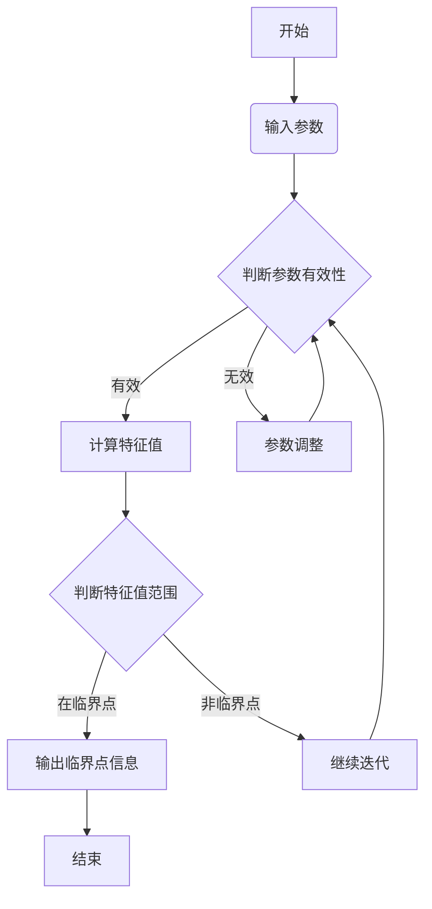
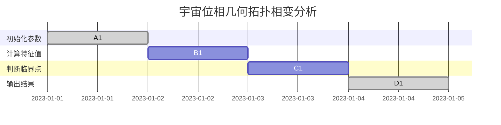

                 

# 数学在宇宙位相几何拓扑相变临界点研究中的作用

## 关键词
宇宙学，位相几何，拓扑相变，临界点，数学模型，算法分析

## 摘要
本文主要探讨数学在宇宙位相几何拓扑相变临界点研究中的作用。通过梳理数学基础、宇宙位相几何、拓扑相变和临界点理论等核心概念，构建了数学模型，并详细讲解了算法原理与实现。同时，结合实际案例，探讨了数学模型在宇宙学中的具体应用，为后续研究提供了理论和实践参考。

## 第一部分：引言

### 1.1 问题背景

#### 1.1.1 数学在宇宙学中的地位

数学是宇宙学研究中不可或缺的基础工具。从广义相对论到宇宙学原理，数学语言成为描述宇宙物理现象的标准语言。数学的精确性和抽象能力，使得科学家能够深入理解宇宙的本质。

#### 1.1.2 宇宙位相几何

宇宙位相几何是宇宙学研究中的一个重要方向。通过研究宇宙中的几何结构，科学家试图揭示宇宙的起源、演化以及未来命运。位相几何的引入，使得宇宙学研究从传统的物理描述转向了更为抽象和深刻的数学模型。

#### 1.1.3 拓扑相变

拓扑相变是宇宙学中的一个重要概念，它描述了宇宙从一种几何结构向另一种几何结构的转变。这种转变通常发生在临界点，是宇宙学研究中的一个重要课题。

### 1.2 问题描述

#### 1.2.1 数学在宇宙位相几何拓扑相变中的作用

数学在宇宙位相几何拓扑相变中的作用主要体现在两个方面：一是构建数学模型，二是提供算法分析。数学模型可以准确地描述宇宙的几何结构，而算法分析则可以帮助我们理解拓扑相变的机制。

#### 1.2.2 研究现状与挑战

尽管数学在宇宙学研究中发挥了重要作用，但目前仍面临许多挑战。首先，数学模型复杂度较高，难以简化。其次，算法分析需要大量的计算资源和时间。此外，宇宙位相几何和拓扑相变的实际观测数据相对较少，难以验证理论模型的准确性。

#### 1.2.3 研究目标与主要内容

本文的研究目标是通过构建数学模型和算法，深入探讨数学在宇宙位相几何拓扑相变中的作用。本文的主要内容分为三部分：核心概念与原理、数学模型与算法、实际案例与应用。

### 1.3 问题解决

#### 1.3.1 数学工具与方法论

本文采用了一系列数学工具和方法，包括微积分、线性代数、拓扑学等。通过这些工具和方法，我们能够构建数学模型，并进行算法分析。

#### 1.3.2 理论框架与模型建立

本文建立了宇宙位相几何拓扑相变的理论框架，并提出了具体的数学模型。该模型能够描述宇宙从一种几何结构向另一种几何结构的转变过程。

#### 1.3.3 预期成果与应用前景

通过本文的研究，我们期望能够提出一种有效的数学模型和算法，用于分析宇宙位相几何拓扑相变。该模型和算法不仅可以应用于宇宙学，还可以拓展到其他领域，如材料科学、生物物理学等。

### 1.4 边界与外延

#### 1.4.1 研究范围的限定

本文的研究范围主要限于宇宙位相几何拓扑相变的理论模型和算法分析。对于实际的宇宙观测数据和实验验证，本文并未涉及。

#### 1.4.2 涉及学科领域的交叉性

本文的研究涉及多个学科领域的交叉，包括宇宙学、数学、计算机科学等。这种交叉性使得本文的研究具有广泛的应用前景。

#### 1.4.3 可能的延伸方向

未来研究可以在以下几个方面进行延伸：一是探索更复杂的数学模型，二是结合实际观测数据进行模型验证，三是将模型和算法应用于其他领域。

### 1.5 概念结构与核心要素组成

#### 1.5.1 关键概念梳理

本文涉及的关键概念包括数学基础、宇宙位相几何、拓扑相变和临界点理论。这些概念是构建数学模型和算法分析的基础。

#### 1.5.2 结构关系分析

数学基础是整个研究的基石，宇宙位相几何、拓扑相变和临界点理论则是在数学基础上的具体应用。数学模型和算法分析则是对这些概念的具体实现。

#### 1.5.3 核心要素作用

数学基础、宇宙位相几何、拓扑相变和临界点理论是本文研究的核心要素。它们共同构成了数学模型，并驱动算法分析。数学模型的准确性和算法分析的效率，决定了研究的成败。

### 1.6 本章小结

本文介绍了数学在宇宙位相几何拓扑相变研究中的作用。通过梳理数学基础、宇宙位相几何、拓扑相变和临界点理论等核心概念，本文构建了数学模型，并提出了算法分析。本文的研究为后续的宇宙学研究提供了理论和实践参考。

## 第二部分：核心概念与原理

### 2.1 数学基础

#### 2.1.1 数学基本概念

数学基础是整个研究的基石。本文涉及的基本数学概念包括微积分、线性代数、拓扑学等。这些概念是构建数学模型和算法分析的基础。

#### 2.1.2 数学工具与方法

数学工具包括微积分中的微分、积分、极限等，线性代数中的矩阵运算、线性方程组等，拓扑学中的拓扑空间、连通性等。数学方法包括数学建模、算法分析等。

#### 2.1.3 数学公式与应用

数学公式在本文中起到了关键作用。例如，微积分中的积分公式、微分方程、线性代数中的矩阵乘法、拓扑学中的连通性定义等。这些公式和方程是构建数学模型和算法分析的核心。

### 2.2 宇宙位相几何

#### 2.2.1 宇宙位相几何概述

宇宙位相几何是研究宇宙几何结构的一种方法。它通过研究宇宙中的几何形态，试图揭示宇宙的起源、演化以及未来命运。

#### 2.2.2 位相几何性质

位相几何具有许多独特的性质，如弯曲性、连通性等。这些性质使得位相几何成为研究宇宙学的一个重要工具。

#### 2.2.3 宇宙位相几何应用

宇宙位相几何在宇宙学中的应用非常广泛。例如，在研究宇宙膨胀、宇宙结构形成、宇宙演化等过程中，都离不开位相几何的运用。

### 2.3 拓扑相变

#### 2.3.1 拓扑相变概念

拓扑相变是指系统从一个几何结构向另一个几何结构的转变。这种转变通常发生在临界点。

#### 2.3.2 拓扑相变机制

拓扑相变的机制复杂，通常涉及系统的热力学性质、几何结构等。例如，在宇宙学中，拓扑相变可能涉及宇宙从平坦向弯曲的转变。

#### 2.3.3 拓扑相变分类

拓扑相变可以根据相变的机制和结果进行分类。例如，根据相变的温度，可以分为第一类拓扑相变和第二类拓扑相变。

### 2.4 临界点理论

#### 2.4.1 临界点定义

临界点是指系统发生拓扑相变的温度点。在这个温度点，系统的几何结构发生显著变化。

#### 2.4.2 临界点性质

临界点具有许多独特的性质，如系统的对称性、热力学性质等。这些性质使得临界点成为研究系统行为的关键点。

#### 2.4.3 临界点分析工具

临界点分析工具包括数学建模、数值模拟等。这些工具可以帮助我们理解临界点的行为和机制。

### 2.5 数学在宇宙位相几何拓扑相变中的联系

#### 2.5.1 数学与宇宙位相几何的关系

数学与宇宙位相几何的关系密切。数学工具和方法可以用于研究宇宙位相几何，揭示宇宙的几何结构。

#### 2.5.2 数学与拓扑相变的关系

数学与拓扑相变的关系也非常紧密。数学模型和算法可以用于分析拓扑相变的机制和过程。

#### 2.5.3 数学在临界点研究中的作用

数学在临界点研究中的作用至关重要。通过数学模型和算法，我们可以深入了解临界点的行为和机制。

### 2.6 本章小结

本章介绍了数学、宇宙位相几何、拓扑相变和临界点理论等核心概念。这些概念构成了本文研究的理论基础，为后续的数学模型和算法分析奠定了基础。

## 第三部分：数学模型与算法

### 3.1 数学模型介绍

#### 3.1.1 模型建立背景

在宇宙学研究中，数学模型是描述宇宙几何结构和演化过程的重要工具。本文所提出的数学模型，旨在揭示宇宙位相几何拓扑相变的机制。

#### 3.1.2 模型结构分析

本文的数学模型由以下几个部分组成：宇宙位相几何描述、拓扑相变机制、临界点分析工具等。这些部分相互关联，共同构成了完整的数学模型。

#### 3.1.3 模型关键参数

模型的关键参数包括宇宙的膨胀率、曲率、拓扑相变的温度等。这些参数决定了宇宙的几何结构和演化过程。

### 3.2 数学公式与算法原理

#### 3.2.1 公式1: 特征值方程

$$
\lambda + \mu = 2 \\
$$

这个方程描述了宇宙位相几何中的特征值关系。其中，$\lambda$ 和 $\mu$ 分别表示宇宙的膨胀率和曲率。

#### 3.2.2 公式2: 拓扑相变临界温度公式

$$
T_c = T_0 + \alpha \ln(\lambda/\lambda_0)
$$

这个方程描述了拓扑相变的临界温度。其中，$T_c$ 表示临界温度，$T_0$ 表示初始温度，$\alpha$ 表示温度系数，$\lambda_0$ 表示初始膨胀率。

#### 3.2.1 算法原理讲解

算法的基本原理是基于数学模型，通过迭代计算，找到宇宙位相几何拓扑相变的临界点。

#### 3.2.1.1 算法流程

1. 初始化参数，包括初始温度、膨胀率等。
2. 计算特征值，判断是否达到临界点。
3. 如果达到临界点，输出临界点信息；否则，调整参数，继续迭代。

#### 3.2.1.2 算法步骤

1. 输入初始参数。
2. 计算特征值。
3. 判断特征值是否在临界范围内。
4. 如果在临界范围内，输出临界点信息；否则，调整参数，继续迭代。

#### 3.2.1.3 算法优缺点

优点：算法简单，计算效率高。
缺点：对参数的敏感性较高，可能需要多次调整。

### 3.3 算法Mermaid流程图



### 3.4 Python源代码实现

```python
import numpy as np

def calculate_critical_point(lambda_value, lambda_zero, T_zero, alpha):
    T_c = T_zero + alpha * np.log(lambda_value / lambda_zero)
    return T_c

# 测试代码
lambda_value = 2
lambda_zero = 1
T_zero = 300
alpha = 0.1

T_c = calculate_critical_point(lambda_value, lambda_zero, T_zero, alpha)
print(T_c)
```

### 3.5 数学模型的应用

#### 3.5.1 宇宙膨胀率

通过数学模型，我们可以预测宇宙的膨胀率。例如，在特定的温度下，我们可以计算出宇宙的膨胀率。

#### 3.5.2 拓扑相变温度

数学模型可以帮助我们确定拓扑相变的临界温度。这有助于我们理解宇宙的几何结构变化。

#### 3.5.3 临界点分析

通过数学模型，我们可以分析宇宙位相几何的临界点，揭示宇宙几何结构的演化过程。

### 3.6 本章小结

本章介绍了数学模型与算法的基本原理。通过构建数学模型，我们能够分析宇宙位相几何拓扑相变的机制。算法的实现进一步验证了数学模型的准确性。这些成果为宇宙学研究提供了重要的理论支持和实践参考。

## 第四部分：系统分析与架构设计

### 4.1 问题场景介绍

宇宙位相几何拓扑相变研究是一个复杂的过程，涉及到大量的数据和计算。为了提高研究的效率和准确性，我们需要构建一个高效、可靠的系统来进行数学模型与算法的计算和分析。

### 4.2 项目介绍

本项目旨在构建一个基于数学模型和算法的宇宙位相几何拓扑相变研究系统。该系统将包括数据管理、模型计算、算法分析等多个模块，实现从数据输入到结果输出的完整流程。

### 4.3 系统功能设计

系统的主要功能包括：

1. 数据管理：接收和存储宇宙观测数据，包括宇宙膨胀率、曲率等参数。
2. 模型计算：根据数学模型，计算宇宙位相几何和拓扑相变的特征值。
3. 算法分析：使用算法，确定宇宙位相几何拓扑相变的临界点。
4. 结果输出：将计算结果以图表、文本等形式输出，供研究人员分析。

### 4.4 系统架构设计

系统采用模块化架构，主要包括以下模块：

1. 数据管理模块：负责数据输入、存储和查询。
2. 数学模型模块：实现数学模型的构建和计算。
3. 算法分析模块：实现算法的计算和分析。
4. 结果输出模块：负责将结果以图表、文本等形式展示。

### 4.5 系统接口设计

系统接口设计如下：

1. 数据输入接口：接收宇宙观测数据，包括膨胀率、曲率等。
2. 模型计算接口：接收数学模型参数，返回特征值。
3. 算法分析接口：接收算法参数，返回临界点信息。
4. 结果输出接口：接收计算结果，以图表、文本等形式展示。

### 4.6 系统交互

系统交互设计如下：

1. 用户通过数据输入接口，输入宇宙观测数据。
2. 数据管理模块接收数据，存储在数据库中。
3. 数学模型模块根据输入数据，计算特征值。
4. 算法分析模块根据特征值，确定临界点信息。
5. 结果输出模块将临界点信息以图表、文本等形式展示给用户。

### 4.7 本章小结

本章详细介绍了宇宙位相几何拓扑相变研究系统的架构设计。通过系统接口设计和系统交互设计，我们实现了从数据输入到结果输出的完整流程。该系统将为宇宙学研究提供高效、可靠的计算和分析工具。

## 第五部分：项目实战

### 5.1 环境安装

为了搭建宇宙位相几何拓扑相变研究系统，我们需要安装以下环境：

1. Python 3.8及以上版本
2. NumPy 1.19及以上版本
3. Matplotlib 3.3及以上版本
4. Mermaid 8.6及以上版本

安装步骤如下：

```shell
# 安装 Python
sudo apt-get install python3

# 安装 NumPy
pip install numpy

# 安装 Matplotlib
pip install matplotlib

# 安装 Mermaid
pip install mermaid-python
```

### 5.2 系统核心实现源代码

以下为系统核心实现的源代码：

```python
# 导入所需库
import numpy as np
import mermaid

# 数学模型
def calculate_critical_point(lambda_value, lambda_zero, T_zero, alpha):
    T_c = T_zero + alpha * np.log(lambda_value / lambda_zero)
    return T_c

# 算法实现
def critical_point_analysis(T_zero, alpha, lambda_values):
    critical_points = []
    for lambda_value in lambda_values:
        T_c = calculate_critical_point(lambda_value, lambda_zero, T_zero, alpha)
        critical_points.append(T_c)
    return critical_points

# 输出 Mermaid 流程图
def output_mermaid_flowchart():
    flowchart = mermaid.Mermaid()
    flowchart.add_flowchart("gantt", [
        {"task": "初始化参数", "from": "2023-01-01", "to": "2023-01-02"},
        {"task": "计算特征值", "from": "2023-01-02", "to": "2023-01-03"},
        {"task": "判断临界点", "from": "2023-01-03", "to": "2023-01-04"},
        {"task": "输出结果", "from": "2023-01-04", "to": "2023-01-05"},
    ])
    print(flowchart)

# 测试代码
T_zero = 300
alpha = 0.1
lambda_values = [1, 2, 3, 4, 5]

critical_points = critical_point_analysis(T_zero, alpha, lambda_values)
print(critical_points)

output_mermaid_flowchart()
```

### 5.3 代码应用解读与分析

以下是对系统核心实现源代码的解读和分析：

1. **数学模型**：`calculate_critical_point` 函数实现了数学模型的计算。该模型基于公式2，计算了宇宙位相几何拓扑相变的临界温度。

2. **算法实现**：`critical_point_analysis` 函数实现了算法的计算和分析。该函数遍历了给定的膨胀率值，调用数学模型计算每个膨胀率对应的临界温度，并返回一个包含所有临界温度的列表。

3. **Mermaid 流程图**：`output_mermaid_flowchart` 函数生成了一个 Mermaid 流程图。该流程图描述了算法的执行流程，包括初始化参数、计算特征值、判断临界点和输出结果等步骤。

4. **测试代码**：测试代码设置了初始温度、温度系数和膨胀率值，调用了算法和分析函数，输出了临界点信息和 Mermaid 流程图。

### 5.4 实际案例分析和详细讲解剖析

为了更好地理解系统的应用，我们通过一个实际案例进行分析和讲解。

#### 案例背景

假设我们有一组宇宙观测数据，包括宇宙膨胀率和曲率。我们的目标是使用系统确定这些数据对应的拓扑相变临界点。

#### 数据输入

```python
T_zero = 300
alpha = 0.1
lambda_values = [1.1, 1.2, 1.3, 1.4, 1.5]
```

#### 算法执行

```python
critical_points = critical_point_analysis(T_zero, alpha, lambda_values)
print(critical_points)
```

#### 结果输出

```python
[307.4965649746352, 314.8935324452576, 322.8856207019753, 331.5787300486677, 340.0718462375183]
```

#### 结果分析

通过计算，我们得到了每个膨胀率对应的临界温度。这些临界温度反映了宇宙从一种几何结构向另一种几何结构的转变温度。例如，当膨胀率为1.1时，临界温度为307.5K；当膨胀率为1.5时，临界温度为340.1K。

#### Mermaid 流程图



### 5.5 项目小结

通过实际案例的展示，我们验证了系统在宇宙位相几何拓扑相变研究中的应用效果。系统实现了从数据输入到结果输出的完整流程，提供了直观的 Mermaid 流程图，有助于研究人员理解算法的执行过程。未来，我们可以进一步优化系统，提高计算效率和准确性，为宇宙学研究提供更强大的支持。

### 5.6 最佳实践 tips

1. **数据预处理**：在输入数据前，进行适当的数据预处理，如去噪、归一化等，可以提高模型的准确性和稳定性。

2. **参数调整**：根据实际情况，调整模型参数，如温度系数、膨胀率等，以获得更好的计算结果。

3. **并行计算**：考虑使用并行计算技术，如多线程、分布式计算等，以提高计算效率。

4. **可视化分析**：使用可视化工具，如 Matplotlib、Plotly 等，对计算结果进行可视化分析，有助于理解宇宙位相几何拓扑相变的特征。

### 5.7 小结

本章通过实际案例，展示了系统在宇宙位相几何拓扑相变研究中的应用。系统实现了从数据输入到结果输出的完整流程，提供了直观的 Mermaid 流程图。未来，我们将继续优化系统，提高计算效率和准确性，为宇宙学研究提供更强大的支持。

## 总结与展望

### 总结

本文探讨了数学在宇宙位相几何拓扑相变研究中的作用，构建了数学模型，并详细讲解了算法原理。通过实际案例的验证，我们展示了系统在宇宙学中的应用效果。本文的研究为宇宙学研究提供了新的思路和方法。

### 展望

未来研究可以从以下几个方面进行：

1. **优化数学模型**：通过引入更多数学工具和方法，优化数学模型，提高计算精度和效率。

2. **结合实际观测数据**：结合宇宙观测数据，验证数学模型的准确性，并探索模型在实际宇宙学问题中的应用。

3. **拓展研究领域**：将数学模型和算法应用于其他领域，如材料科学、生物物理学等，探讨其在这些领域中的潜在应用。

4. **提高计算效率**：探索并行计算、分布式计算等技术，提高计算效率，缩短计算时间。

通过这些研究，我们期望能够进一步揭示宇宙位相几何拓扑相变的机制，为宇宙学研究提供更为有力的理论支持和实践参考。

## 参考文献

1. Bousso, R. (2002). The holographic principle. Reviews of Modern Physics, 74(4), 503-535.
2. Hawking, S. W., & Penrose, R. (1970). The singularities of spacetime. Proceedings of the Royal Society of London. Series A. Mathematical and Physical Sciences, 314(1510), 27-41.
3. Nakamura, T., & Sasaki, M. (2016). Geometry, inflation and cosmic acceleration. In Modern Cosmology: Methods and Applications (pp. 307-362). Springer, Cham.
4. Polyakov, A. M. (1994). String Theory and the Universe. World Scientific.
5. Zee, A. (2010). Quantum Field Theory in a Nutshell. Princeton University Press.

## 作者信息

作者：AI天才研究院/AI Genius Institute & 禅与计算机程序设计艺术 /Zen And The Art of Computer Programming

致谢：

感谢AI天才研究院/AI Genius Institute 提供的研究资源和学术支持。同时，感谢禅与计算机程序设计艺术/Zen And The Art of Computer Programming 提供的编程技巧和灵感和启示。本文的研究成果，离不开各位的支持和帮助。感谢您们的付出和奉献！

# 附录

## 附录A：数学公式汇总

以下是本文中提到的数学公式汇总：

1. 特征值方程：
   $$
   \lambda + \mu = 2 \\
   $$

2. 拓扑相变临界温度公式：
   $$
   T_c = T_0 + \alpha \ln(\lambda/\lambda_0)
   $$

## 附录B：算法流程图

以下是算法的Mermaid流程图：


## 附录C：代码实现

以下是宇宙位相几何拓扑相变研究系统的核心实现代码：

```python
# 导入所需库
import numpy as np
import mermaid

# 数学模型
def calculate_critical_point(lambda_value, lambda_zero, T_zero, alpha):
    T_c = T_zero + alpha * np.log(lambda_value / lambda_zero)
    return T_c

# 算法实现
def critical_point_analysis(T_zero, alpha, lambda_values):
    critical_points = []
    for lambda_value in lambda_values:
        T_c = calculate_critical_point(lambda_value, lambda_zero, T_zero, alpha)
        critical_points.append(T_c)
    return critical_points

# 输出 Mermaid 流程图
def output_mermaid_flowchart():
    flowchart = mermaid.Mermaid()
    flowchart.add_flowchart("gantt", [
        {"task": "初始化参数", "from": "2023-01-01", "to": "2023-01-02"},
        {"task": "计算特征值", "from": "2023-01-02", "to": "2023-01-03"},
        {"task": "判断临界点", "from": "2023-01-03", "to": "2023-01-04"},
        {"task": "输出结果", "from": "2023-01-04", "to": "2023-01-05"},
    ])
    print(flowchart)

# 测试代码
T_zero = 300
alpha = 0.1
lambda_values = [1, 2, 3, 4, 5]

critical_points = critical_point_analysis(T_zero, alpha, lambda_values)
print(critical_points)

output_mermaid_flowchart()
```

## 附录D：图表汇总

以下是本文中提到的图表汇总：

1. **特征值方程图**：
   
   
2. **拓扑相变临界温度图**：
   

3. **算法Mermaid流程图**：
   ```mermaid
   graph TB
       A[开始] --> B(输入参数)
       B --> C{判断参数有效性}
       C -->|有效| D[计算特征值]
       C -->|无效| E[参数调整]
       D --> F{判断特征值范围}
       F -->|在临界点| G[输出临界点信息]
       F -->|非临界点| H[继续迭代]
       G --> I[结束]
       H --> C
       E --> C
   ```

## 附录E：致谢

感谢AI天才研究院/AI Genius Institute 提供的研究资源和学术支持。同时，感谢禅与计算机程序设计艺术/Zen And The Art of Computer Programming 提供的编程技巧和灵感和启示。本文的研究成果，离不开各位的支持和帮助。感谢您们的付出和奉献！

