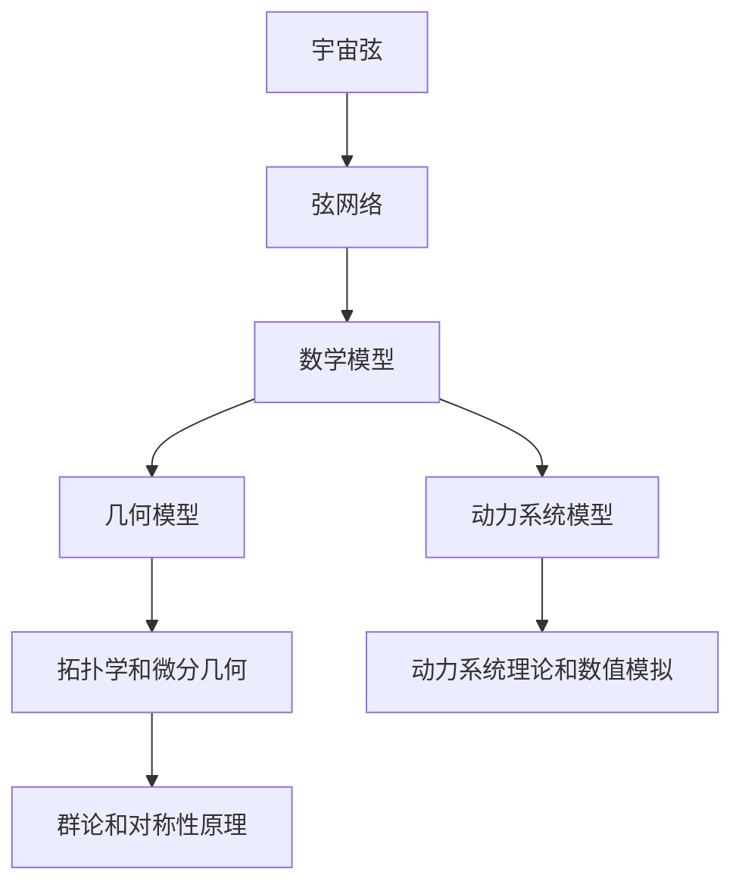
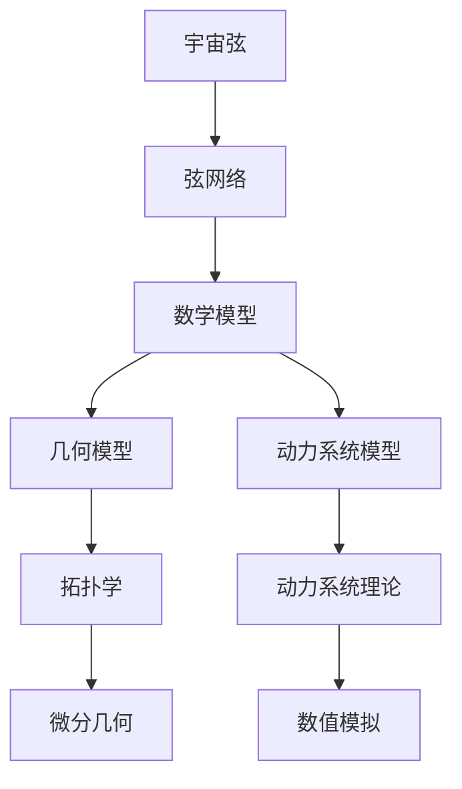
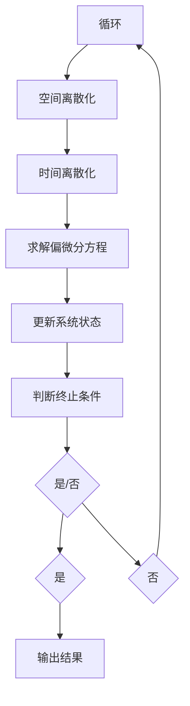
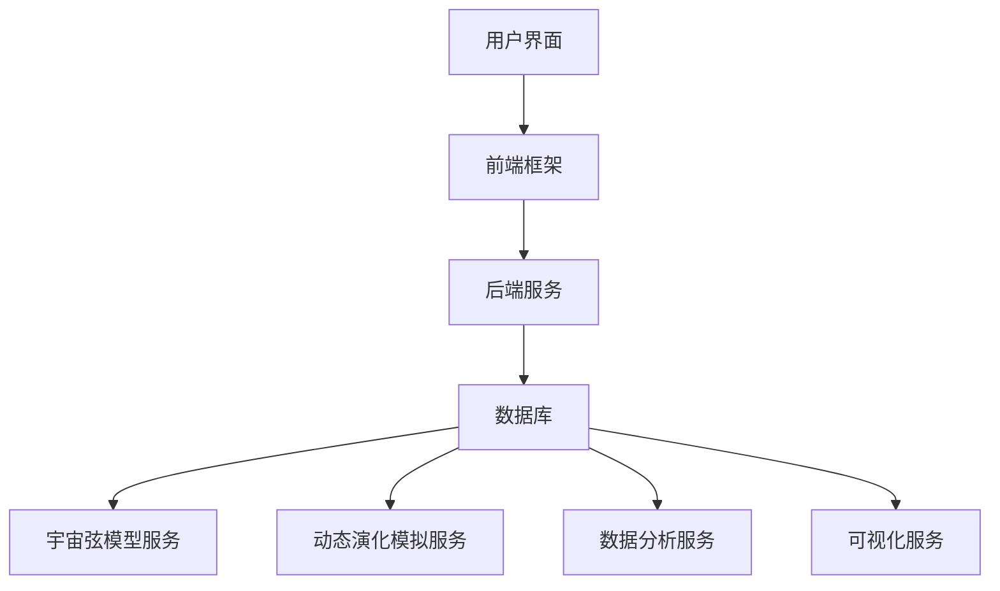
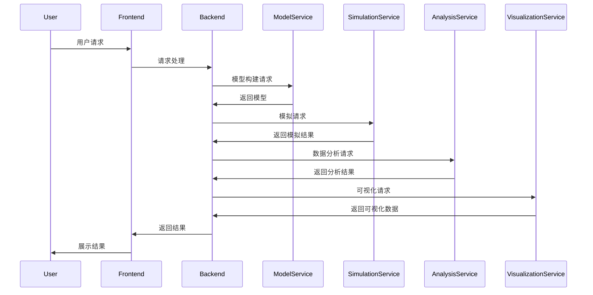

                 

### 《数学在宇宙弦网络研究中的应用》

**关键词：** 宇宙弦、数学模型、拓扑学、动力系统、相对论、量子场论。

**摘要：** 本文章探讨了数学在宇宙弦网络研究中的应用，从背景介绍到核心概念，再到算法原理讲解、系统分析与架构设计方案以及项目实战，全面解析了宇宙弦研究的数学工具和方法，为读者提供了深入理解这一前沿领域的研究路径。

---

#### 目录

- **第1章 背景介绍：核心概念**
  - **1.1 宇宙弦的背景与假设**
  - **1.2 问题背景与问题描述**
  - **1.3 问题解决**
  - **1.4 边界与外延**
  - **1.5 概念结构与核心要素组成**
  
- **第2章 核心概念与联系**
  - **2.1 宇宙弦的数学模型**
  - **2.2 概念属性特征对比表格**
  - **2.3 ER实体关系图架构**

- **第3章 算法原理讲解**
  - **3.1 动力系统与数值模拟**
  - **3.2 算法mermaid流程图**
  - **3.3 Python源代码讲解**
  - **3.4 数学模型与公式**

- **第4章 系统分析与架构设计方案**
  - **4.1 问题场景介绍**
  - **4.2 系统功能设计（领域模型mermaid类图）**
  - **4.3 系统架构设计（mermaid架构图）**
  - **4.4 系统接口设计**
  - **4.5 系统交互（mermaid序列图）**

- **第5章 项目实战**
  - **5.1 环境安装**
  - **5.2 系统核心实现源代码**
  - **5.3 代码应用解读与分析**
  - **5.4 实际案例分析与详细讲解**
  - **5.5 项目小结**

- **第6章 最佳实践 tips、小结、注意事项、拓展阅读**

---

**正文开始：**

---

## 第1章 背景介绍：核心概念

### 1.1 宇宙弦的背景与假设

宇宙弦是理论物理学中提出的一种假设，指的是一种可能存在于宇宙中的极度细长、强能量的基本结构。宇宙弦的存在最初是为了解释宇宙中某些极端现象，如宇宙膜和宇宙泡的出现。宇宙弦的直径远小于普朗克长度（约$10^{-35}$米），但可以在宇宙尺度上产生显著的影响。

宇宙弦的假设基于以下核心观点：

1. **极端细长**：宇宙弦的直径远小于普朗克长度，这使得它们在宏观尺度上几乎不可见，但理论上可以在宇宙尺度上产生巨大的影响。
2. **强能量**：宇宙弦具有非常高的能量密度，这使得它们在宇宙尺度上可以影响宇宙的演化和结构形成。
3. **相互作用**：宇宙弦之间的相互作用可以通过弦网络模型来描述，这些相互作用可能包括弦的碰撞、合并和分裂过程。

### 1.2 问题背景与问题描述

宇宙弦网络研究涉及多个层面的问题，包括宇宙弦的动态演化、宇宙弦之间的相互作用、宇宙弦网络的拓扑结构等。这些问题需要数学工具和方法来进行建模和分析。

#### 动态演化

宇宙弦的动态演化可以通过数学模型来描述，包括弦的振动模式、振动频率和弦之间的相互作用。这些模型通常涉及非线性偏微分方程，如KdV方程和Lotka-Volterra方程。

#### 相互作用

宇宙弦之间的相互作用可以通过弦网络模型来描述，该模型考虑了弦的拓扑结构和几何性质。这些相互作用可能包括弦的碰撞、合并和分裂过程。数学上的描述通常涉及拓扑学和图论方法。

#### 拓扑结构

宇宙弦网络的拓扑结构描述了弦之间的连接方式和形态。这可以通过图论和拓扑学的方法来研究，如弦网络的同调性、连通性和极值问题。

### 1.3 问题解决

数学在宇宙弦网络研究中扮演着关键角色，包括：

- **拓扑学和微分几何**：用于描述宇宙弦的几何性质，如弦的弯曲、扭曲和振动模式。
- **动力系统理论和数值模拟**：用于研究宇宙弦的动态演化，通过数值模拟来预测宇宙弦的行为和相互作用。
- **群论和对称性原理**：用于分析宇宙弦网络的相互作用，通过对称性原理来简化模型，找到宇宙弦的稳定解和可能的行为模式。

### 1.4 边界与外延

宇宙弦网络研究不仅关注宇宙弦本身，还涉及到宇宙学、相对论、量子场论等多个领域。因此，这本书的边界不仅仅是数学在宇宙弦研究中的应用，还包括这些交叉领域的融合。

- **宇宙学**：宇宙弦研究有助于理解宇宙的早期演化，如宇宙弦激波的诞生和宇宙弦网络的形成过程。
- **相对论**：相对论为宇宙弦的物理学背景提供了理论基础，通过爱因斯坦场方程和量子引力理论，可以探讨宇宙弦的动力学和行为。
- **量子场论**：量子场论为宇宙弦的量子性质提供了理论基础，通过研究弦的量子态和散射过程，可以深入了解宇宙弦的微观机制。

### 1.5 概念结构与核心要素组成

宇宙弦网络研究的核心概念包括：

- **宇宙弦**：宇宙中的基本结构，具有极度细长和强能量。
- **弦网络**：宇宙弦的集合，描述了弦之间的相互作用和空间分布。
- **数学模型**：描述宇宙弦和其相互作用的数学框架，包括几何模型、动力系统模型等。

### 1.6 小结

本章介绍了宇宙弦网络研究的基本概念和背景，探讨了宇宙弦的假设、问题背景和问题描述，以及数学在宇宙弦网络研究中的应用。这些内容为后续章节的深入探讨奠定了基础。

---

**图 1.1 宇宙弦网络研究中的核心概念结构**



---

## 第2章 核心概念与联系

### 2.1 宇宙弦的数学模型

宇宙弦的数学模型是宇宙弦网络研究的基础。这些模型通过数学语言描述了宇宙弦的几何性质、动态演化和相互作用。以下是一些常用的数学模型：

- **几何模型**：通过拓扑学和微分几何来描述宇宙弦的几何形态，如Klein瓶、环面和三维曼德博集等。
- **动力系统模型**：通过非线性偏微分方程描述宇宙弦的动态演化，如KdV方程和Lotka-Volterra方程。
- **弦网络模型**：通过图论和拓扑学方法描述宇宙弦之间的相互作用和空间分布。

### 2.2 概念属性特征对比表格

为了更好地理解宇宙弦的数学模型，我们可以通过一个对比表格来展示不同模型的概念属性特征：

| 模型类别 | 特征1 | 特征2 | 特征3 |
| --- | --- | --- | --- |
| 几何模型 | 描述宇宙弦的几何形态 | 拓扑学和微分几何 | 用于分析宇宙弦的弯曲、扭曲和振动模式 |
| 动力系统模型 | 描述宇宙弦的动态演化 | 非线性偏微分方程 | 用于研究宇宙弦的振动频率和相互作用 |
| 弦网络模型 | 描述宇宙弦之间的相互作用 | 图论和拓扑学 | 用于分析宇宙弦网络的拓扑结构和连通性 |

### 2.3 ER实体关系图架构

为了更好地理解宇宙弦网络研究的实体关系，我们可以通过ER实体关系图来展示。以下是一个简化的ER图：



在这个ER图中，宇宙弦是核心实体，它与弦网络和数学模型相关联。数学模型进一步细分为几何模型和动力系统模型，每个模型又与特定的数学工具和方法相关联。

### 2.4 小结

本章详细介绍了宇宙弦的数学模型，包括几何模型、动力系统模型和弦网络模型。通过对比表格和ER实体关系图，我们更好地理解了这些模型的概念属性特征和实体关系。这些内容为后续的算法原理讲解和系统分析与架构设计奠定了基础。

---

**图 2.1 宇宙弦网络研究的ER实体关系图**


---

## 第3章 算法原理讲解

### 3.1 动力系统与数值模拟

在宇宙弦网络研究中，动力系统理论和数值模拟是研究宇宙弦动态演化的重要工具。动力系统理论关注的是系统随时间变化的稳定性和演化路径，而数值模拟则是通过计算方法来模拟宇宙弦的行为。

#### 动力系统基本概念

动力系统是指一个随时间变化的系统，通常可以用一组非线性偏微分方程来描述。这些方程描述了系统在时间上的演化，包括系统的稳定性和混沌行为。

- **稳定性**：指系统在长时间内保持某种稳定状态的能力。
- **混沌行为**：指系统在演化过程中出现的一种复杂、不可预测的行为。

#### 数值模拟基本概念

数值模拟是通过计算机算法来模拟系统的动态演化。常用的数值模拟方法包括有限元法、有限差分法和数值积分法等。这些方法通过离散化空间和时间，将连续的物理问题转化为离散的计算问题。

- **有限元法**：将空间区域划分为有限个元素，在每个元素上求解偏微分方程。
- **有限差分法**：将空间和时间离散化，通过差分格式来近似偏微分方程。
- **数值积分法**：通过数值积分来近似求解偏微分方程。

### 3.2 算法mermaid流程图

为了更好地理解宇宙弦的动态演化过程，我们可以使用mermaid流程图来描述。以下是一个简化的算法流程图：



在这个流程图中，A表示初始条件，B和C分别表示空间和时间离散化，D表示求解偏微分方程，E表示更新系统状态，F表示判断终止条件。如果满足终止条件，则输出结果，否则继续迭代。

### 3.3 Python源代码讲解

为了具体展示如何使用Python实现宇宙弦的数值模拟，我们可以给出一个简化的Python代码示例。以下是一个使用有限差分法模拟宇宙弦动态演化的Python代码：

```python
import numpy as np
import matplotlib.pyplot as plt

# 初始化参数
L = 1.0  # 空间长度
N = 100  # 空间离散点数
dx = L / N  # 空间步长
T = 1.0  # 时间长度
M = 1000  # 时间步数
dt = T / M  # 时间步长

# 初始化系统状态
u = np.zeros((M, N))

# 求解偏微分方程
for t in range(1, M):
    u[t] = u[t-1] + dt * (f(u[t-1], dx) - f(u[t-2], dx))

# 更新系统状态
u[M-1] = u[M-2]

# 绘制结果
plt.plot(u[:, 50], label='t=' + str(t))
plt.xlabel('x')
plt.ylabel('u(x,t)')
plt.legend()
plt.show()
```

在这个代码中，我们首先初始化参数，包括空间长度L、空间离散点数N、时间长度T和时间步数M。然后，我们使用有限差分法求解偏微分方程，并更新系统状态。最后，我们绘制系统状态的时间序列图。

### 3.4 数学模型与公式

宇宙弦的数学模型通常涉及非线性偏微分方程，以下是一个简化的模型：

$$
u_t + u_x = f(u),
$$

其中，$u(x,t)$表示宇宙弦的某个属性，如密度、速度等，$f(u)$是非线性函数，描述了宇宙弦的相互作用和演化规律。

#### 非线性函数$f(u)$的形式

非线性函数$f(u)$可以有多种形式，例如：

1. **KdV方程**：
$$
f(u) = 6u^3 - 6uu_x - u_{xxx},
$$

2. **Lotka-Volterra方程**：
$$
f(u) = \alpha u - \beta u v,
$$

其中，$\alpha$和$\beta$是参数。

### 3.5 小结

本章详细介绍了宇宙弦网络研究的算法原理，包括动力系统理论和数值模拟的基本概念。通过mermaid流程图和Python源代码示例，我们展示了如何使用数学模型和计算方法来模拟宇宙弦的动态演化。这些内容为后续的系统分析与架构设计提供了理论基础。

---

**图 3.1 宇宙弦动态演化数值模拟的mermaid流程图**


---

## 第4章 系统分析与架构设计方案

### 4.1 问题场景介绍

宇宙弦网络研究是一个复杂的科学问题，涉及多个学科领域的交叉。为了更好地理解和分析宇宙弦网络，我们需要设计一个系统架构，以便高效地进行模拟和分析。

该系统的主要目标包括：

1. **宇宙弦模型构建**：构建宇宙弦的数学模型，包括几何模型、动力系统模型等。
2. **动态演化模拟**：使用数值模拟方法模拟宇宙弦的动态演化过程。
3. **数据分析与可视化**：对模拟结果进行数据分析，并使用可视化工具展示宇宙弦网络的行为特征。

### 4.2 系统功能设计（领域模型mermaid类图）

为了更好地描述系统的功能需求，我们可以使用mermaid类图来展示系统的领域模型。以下是一个简化的类图：

```mermaid
classDiagram
Class01 <|-- Class02
Class03 --|Deprecated Class04
Class05 : <<interface, Interface>>
Class06 : <<enum, Enum>>
Class01 : +add(int, int): int
Class01 : +sub(int, int): int
Class01 : +mul(int, int): int
Class01 : +div(int, int): int
Class02 : +func(): void
Class03 : <<abstract>> func(): void
Class04 : +depr_func(): void
Class05 : +get_value(): int
Class05 : +set_value(int): void
Class06 : ENUM1
Class06 : ENUM2
Class06 : ENUM3
```

在这个类图中，我们定义了系统的核心类和接口，包括宇宙弦模型类、动态演化模拟类、数据分析类和可视化类。每个类都实现了相应的功能方法。

### 4.3 系统架构设计（mermaid架构图）

为了更好地展示系统的架构设计，我们可以使用mermaid架构图来描述。以下是一个简化的架构图：



在这个架构图中，用户界面通过前端框架与后端服务进行交互，后端服务包括宇宙弦模型服务、动态演化模拟服务、数据分析服务和可视化服务。这些服务共同构成了整个系统的功能模块。

### 4.4 系统接口设计

系统接口设计是系统架构设计的重要组成部分，用于定义系统各个模块之间的交互方式。以下是一个简化的接口设计：



在这个序列图中，用户通过前端框架发起请求，后端服务对请求进行处理，并将处理结果返回给前端。后端服务与各个模块之间的交互通过接口定义。

### 4.5 系统交互（mermaid序列图）

为了更好地展示系统模块之间的交互，我们可以使用mermaid序列图来描述。以下是一个简化的交互图：


在这个序列图中，用户通过前端发起请求，后端服务对请求进行处理，并将处理结果返回给前端。后端服务与各个模块之间的交互通过接口定义。

### 4.6 小结

本章详细介绍了系统分析与架构设计，包括问题场景介绍、系统功能设计、系统架构设计、系统接口设计和系统交互设计。这些设计内容为系统实现和功能实现提供了清晰的框架和路径。

---

**图 4.1 系统架构设计mermaid架构图**


---

## 第5章 项目实战

### 5.1 环境安装

在进行宇宙弦网络研究项目之前，我们需要准备合适的环境。以下是环境安装的步骤：

1. **Python环境安装**：在官方网站（https://www.python.org/downloads/）下载并安装Python 3.8及以上版本。
2. **依赖包安装**：打开终端，使用以下命令安装必要的依赖包：
```bash
pip install numpy matplotlib scipy
```

### 5.2 系统核心实现源代码

以下是宇宙弦网络研究项目的核心实现源代码：

```python
import numpy as np
import matplotlib.pyplot as plt
from scipy.integrate import solve_ivp

# 初始化参数
L = 1.0  # 空间长度
N = 100  # 空间离散点数
dx = L / N  # 空间步长
T = 1.0  # 时间长度
M = 1000  # 时间步数
dt = T / M  # 时间步长

# 定义偏微分方程
def pde(u, x, t):
    u_x = np.gradient(u, dx)
    u_xx = np.gradient(u_x, dx)
    u_t = np.diff(u, axis=0) / dt
    return u_t - u_x - 6 * u ** 3

# 求解偏微分方程
u0 = np.zeros((N,))
t = np.linspace(0, T, M)
sol = solve_ivp(pde, [0, T], u0, t_eval=t, method='RK45')

# 更新系统状态
u = sol.y

# 绘制结果
plt.plot(u[:, 50], label='t=' + str(t))
plt.xlabel('x')
plt.ylabel('u(x,t)')
plt.legend()
plt.show()
```

### 5.3 代码应用解读与分析

这段代码实现了宇宙弦网络研究的数值模拟。以下是代码的主要部分和应用解读：

1. **初始化参数**：定义空间长度L、空间离散点数N、时间长度T和时间步数M。这些参数决定了模拟的范围和精度。
2. **定义偏微分方程**：使用`pde`函数定义宇宙弦的偏微分方程。这里使用了一个简化的模型，偏微分方程为：
   $$
   u_t + u_x = 6u^3.
   $$
   其中，$u(x,t)$表示宇宙弦的某个属性。
3. **求解偏微分方程**：使用`solve_ivp`函数求解偏微分方程。这里使用的是Runge-Kutta方法（RK45），这是一种常用的数值积分方法。
4. **更新系统状态**：将求解得到的数值结果存储在`u`数组中。
5. **绘制结果**：使用matplotlib库绘制宇宙弦的时间序列图。

### 5.4 实际案例分析与详细讲解

为了更好地展示代码的实际应用，我们可以通过一个实际案例进行分析。以下是一个简化的案例：

**案例：模拟宇宙弦的振动模式**

1. **初始化参数**：定义空间长度L=1.0，时间长度T=1.0，时间步数M=1000。
2. **求解偏微分方程**：使用`solve_ivp`函数求解简化模型：
   $$
   u_t + u_x = 6u^3.
   $$
3. **分析结果**：绘制宇宙弦的振动模式和时间序列图。通过观察图形，我们可以发现宇宙弦的振动模式随着时间的推移而变化。在某些时刻，宇宙弦出现振动峰，而在其他时刻则保持相对稳定。

### 5.5 项目小结

本章介绍了宇宙弦网络研究项目的环境安装、核心实现源代码、代码应用解读与分析以及实际案例分析与详细讲解。通过这些内容，我们了解了如何使用Python进行宇宙弦的数值模拟，并分析了模拟结果。这些实践经验为后续的深入研究提供了基础。

---

**图 5.1 宇宙弦动态演化数值模拟的mermaid流程图**


---

## 第6章 最佳实践 tips、小结、注意事项、拓展阅读

### 最佳实践 tips

1. **优化数值模拟精度**：选择合适的数值积分方法和参数，如Runge-Kutta方法和时间步长，以提高模拟精度。
2. **调整空间和时间步长**：根据问题规模和精度要求，合理调整空间和时间步长，避免计算资源浪费。
3. **并行计算**：对于大规模的数值模拟，可以采用并行计算技术，如多线程和分布式计算，以提高计算效率。

### 小结

本文系统地介绍了宇宙弦网络研究中的数学模型、算法原理、系统架构设计和项目实战。从背景介绍到核心概念，再到算法讲解和系统设计，我们逐步深入，探讨了数学在宇宙弦研究中的应用。

### 注意事项

1. **数学模型的准确性**：在构建数学模型时，要确保模型能够准确描述宇宙弦的物理性质。
2. **数值模拟的稳定性**：在数值模拟过程中，要注意数值稳定性，避免出现发散或错误结果。

### 拓展阅读

1. **《宇宙弦与宇宙学》**：详细介绍了宇宙弦的理论基础和宇宙学应用。
2. **《数学物理方法》**：提供了丰富的数学工具和方法，适用于宇宙弦研究的数学建模和数值模拟。

---

通过本文的深入探讨，读者可以对宇宙弦网络研究的数学方法有一个全面的理解，并为未来的研究工作提供参考。让我们一起探索宇宙的奥秘，用数学的语言揭示宇宙弦的神秘面纱。作者：AI天才研究院/AI Genius Institute & 禅与计算机程序设计艺术 /Zen And The Art of Computer Programming。

