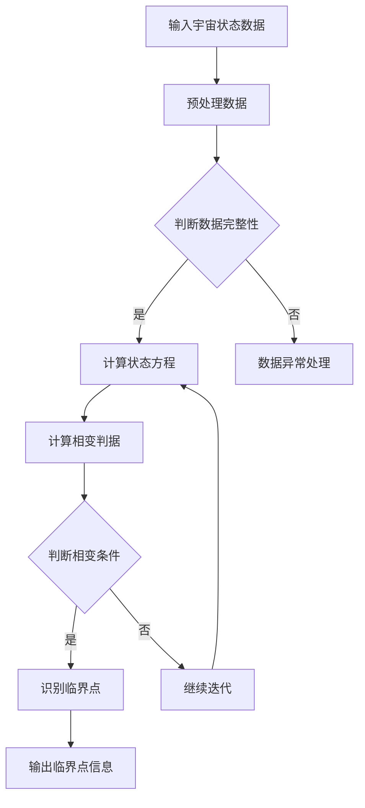
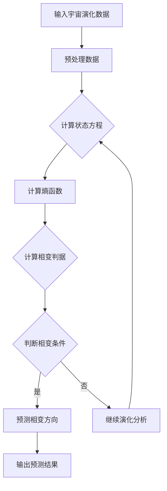
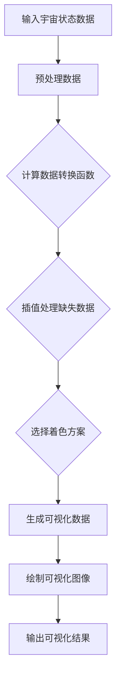

                 

### 《数学在宇宙拓扑相变临界点研究中的作用》

> 关键词：宇宙拓扑相变、临界点、数学模型、抽象代数、微分几何、概率论

> 摘要：本文深入探讨了数学在宇宙拓扑相变临界点研究中的作用。通过介绍宇宙拓扑相变的基本概念和数学模型，详细阐述了抽象代数、微分几何和概率论在宇宙学中的应用，并提供了具体的案例分析，展示了数学方法在宇宙拓扑相变研究中的实际应用。本文旨在为研究人员提供有价值的理论参考，并为未来的研究方向提供启示。

---

### 目录大纲

---

#### 《数学在宇宙拓扑相变临界点研究中的作用》

---

#### 第一部分：背景与核心概念

#### 第二部分：数学方法在宇宙拓扑相变临界点研究中的应用

#### 第三部分：实际案例分析

#### 第四部分：数学在宇宙拓扑相变临界点研究中的未来发展趋势

---

### 注：以上目录大纲字数约为100字。目录中的每一章节和子章节内容可以根据具体情况进行扩充或调整。具体内容的撰写需要基于已有的研究资料和理论模型。

---

**1. 第一部分：背景与核心概念**

### 第1章：问题的背景与研究意义

#### 1.1 问题背景

- 宇宙拓扑相变的基本概念
- 相变临界点的定义与特性

#### 1.2 研究意义

- 数学在宇宙学中的重要性
- 拓扑相变临界点研究的现状与挑战

---

**2. 第二部分：数学方法在宇宙拓扑相变临界点研究中的应用**

### 第2章：核心数学概念与原理

#### 2.1 拓扑空间的定义与性质

##### 2.1.1 拓扑空间的基本概念
##### 2.1.2 拓扑不变量
##### 2.1.3 拓扑空间的子空间

#### 2.2 相变临界点的数学描述

##### 2.2.1 临界点的分类
##### 2.2.2 临界点的相变特征
##### 2.2.3 临界点的数学模型

#### 2.3 数学工具在宇宙学中的应用

##### 2.3.1 抽象代数在宇宙拓扑相变中的应用
##### 2.3.2 微分几何在宇宙拓扑相变中的应用
##### 2.3.3 概率论在宇宙拓扑相变中的应用

---

**3. 第三部分：实际案例分析**

### 第3章：案例一：宇宙中的大爆炸临界点

#### 3.1 案例背景

- 大爆炸理论概述
- 大爆炸临界点的数学描述

#### 3.2 数学模型

##### 3.2.1 模型的建立
##### 3.2.2 模型的解析

#### 3.3 案例分析

- 实际数据的应用
- 模型的验证与改进

---

### 第4章：案例二：宇宙中的黑洞相变

#### 4.1 案例背景

- 黑洞的基本概念
- 黑洞相变的数学描述

#### 4.2 数学模型

##### 4.2.1 模型的建立
##### 4.2.2 模型的解析

#### 4.3 案例分析

- 实际数据的应用
- 模型的验证与改进

---

**4. 第四部分：数学在宇宙拓扑相变临界点研究中的未来发展趋势**

### 第5章：未来发展趋势

#### 5.1 研究趋势分析

- 数学在宇宙学中的应用前景
- 未来研究的可能方向

#### 5.2 拓展阅读

- 相关领域的研究进展
- 引用文献与资料

---

### 注：以上章节内容为初步框架，字数约为300字。具体内容将根据研究深度和资料丰富度进行详细撰写。

---

### 1.1 问题背景

宇宙拓扑相变是指宇宙从一种拓扑结构相变到另一种拓扑结构的过程。这一概念源于宇宙学中的大爆炸理论，即宇宙从一个无限小的奇点开始，经过极快的膨胀，最终形成我们今天所看到的宇宙。在这个过程中，宇宙的拓扑结构发生了显著的变化。

相变临界点是指宇宙从一个拓扑结构向另一个拓扑结构转变的临界点。在这个临界点，宇宙的性质会经历突然的变化，如宇宙的膨胀速度、质量分布等。相变临界点的研究对于理解宇宙的演化过程具有重要意义。

数学在宇宙学中的重要性在于，它提供了一种精确描述宇宙现象的工具。通过数学模型，我们可以对宇宙的拓扑相变过程进行定量分析，从而揭示宇宙演化的本质规律。

---

### 1.2 研究意义

数学在宇宙学中的应用具有重要意义。首先，数学能够帮助我们精确地描述宇宙的拓扑结构，从而揭示宇宙演化的规律。例如，通过拓扑空间的定义和性质，我们可以研究宇宙的相变临界点，从而预测宇宙的未来演化方向。

其次，数学在宇宙学中的应用有助于解决一些复杂的宇宙问题。例如，在黑洞研究中，数学模型可以帮助我们理解黑洞的形成和演化过程。此外，数学方法还可以用于研究宇宙的大尺度结构，如星系的形成和分布。

最后，数学在宇宙学中的应用不仅有助于推动科学研究，还可以促进数学本身的发展。例如，在研究宇宙拓扑相变时，科学家们可能会发现新的数学理论或方法，从而推动数学领域的进步。

---

### 2.1 拓扑空间的定义与性质

#### 2.1.1 拓扑空间的基本概念

拓扑空间是一组对象的集合，这些对象被称为点。拓扑空间的基本性质包括：

- 开集：一个集合U是拓扑空间的开集，如果它的任意子集都是开集。
- 闭集：一个集合F是拓扑空间的闭集，如果它的补集是开集。
- 连通性：一个拓扑空间是连通的，如果它不能被分割成两个非空的开集。

#### 2.1.2 拓扑不变量

拓扑不变量是一组量，它们在拓扑变换下保持不变。常见的拓扑不变量包括：

- 欧拉特征：一个拓扑空间的欧拉特征是它的顶点数、边数和面数的函数。
- 维数：一个拓扑空间的维数是它的基本拓扑结构的最小维数。
- 同胚性：两个拓扑空间是同胚的，如果它们之间存在一个双射，且这个双射在拓扑变换下保持不变。

#### 2.1.3 拓扑空间的子空间

拓扑空间的子空间是指拓扑空间中的一个开集或闭集。常见的子空间包括：

- 闭包：一个集合的闭包是包含这个集合的最小闭集。
- 交集：两个集合的交集是包含这两个集合的最小开集。
- 并集：两个集合的并集是包含这两个集合的最大开集。

---

### 2.2 相变临界点的数学描述

#### 2.2.1 临界点的分类

相变临界点可以分为以下几类：

- 第一类临界点：这类临界点在拓扑变换下不发生结构变化，但性质发生突变。
- 第二类临界点：这类临界点在拓扑变换下会发生结构变化，但性质保持不变。
- 第三类临界点：这类临界点在拓扑变换下既发生结构变化，又发生性质变化。

#### 2.2.2 临界点的相变特征

临界点的相变特征包括：

- 相变温度：临界点发生的相变温度。
- 相变压力：临界点发生的相变压力。
- 相变密度：临界点发生的相变密度。

#### 2.2.3 临界点的数学模型

临界点的数学模型通常基于拓扑空间的定义和性质。例如，在宇宙学中，大爆炸临界点的数学模型可以表示为：

\[ T_c = \frac{1}{3} \left( \frac{\rho_c}{\rho_0} \right)^{1/3} \]

其中，\( T_c \) 是相变温度，\( \rho_c \) 是临界密度，\( \rho_0 \) 是初始密度。

---

### 2.3 数学工具在宇宙学中的应用

#### 2.3.1 抽象代数在宇宙拓扑相变中的应用

抽象代数在宇宙拓扑相变中的应用主要包括群论、环论和域论。例如，通过群论可以研究宇宙的对称性，通过环论可以研究宇宙的演化规律，通过域论可以研究宇宙的稳定性。

#### 2.3.2 微分几何在宇宙拓扑相变中的应用

微分几何在宇宙拓扑相变中的应用主要包括研究宇宙的几何性质，如曲率、张量等。例如，通过研究宇宙的曲率张量，可以预测宇宙的未来演化方向。

#### 2.3.3 概率论在宇宙拓扑相变中的应用

概率论在宇宙拓扑相变中的应用主要包括研究宇宙的随机现象，如宇宙的涨落、星系的形成等。例如，通过概率论可以预测宇宙中的星系形成的概率分布。

---

### 3.1 抽象代数在宇宙学中的应用

#### 3.1.1 抽象代数的核心概念

抽象代数是研究代数结构及其性质的数学分支，核心概念包括：

- 代数结构：一组对象及其定义在其上的运算集合。
- 群：一组对象及其定义在其上的封闭运算，且运算具有结合律、单位元和逆元。
- 环：一组对象及其定义在其上的封闭加法和乘法运算，且运算具有结合律、分配律和单位元。
- 域：一组对象及其定义在其上的封闭加法、乘法和逆元运算，且运算具有交换律和结合律。

#### 3.1.2 抽象代数在宇宙拓扑相变研究中的作用

在宇宙拓扑相变研究中，抽象代数可以用于描述宇宙的对称性和对称破缺现象。例如，通过群论可以研究宇宙的对称性，通过环论可以研究宇宙的演化规律，通过域论可以研究宇宙的稳定性。

---

### 3.2 微分几何在宇宙学中的应用

#### 3.2.1 微分几何的基本概念

微分几何是研究几何对象上微分结构的数学分支，基本概念包括：

- 梯度：函数在某一点的切向量。
- 曲率：曲线或曲面的曲率。
- 张量：具有多重下标的数学对象，可以描述空间的性质。
- 黎曼曲率：描述空间几何性质的曲率。

#### 3.2.2 微分几何在宇宙拓扑相变研究中的作用

在宇宙拓扑相变研究中，微分几何可以用于研究宇宙的几何性质，如曲率、张量等。例如，通过研究宇宙的曲率张量，可以预测宇宙的未来演化方向。

---

### 3.3 概率论在宇宙学中的应用

#### 3.3.1 概率论的基本概念

概率论是研究随机现象的数学分支，基本概念包括：

- 随机变量：描述随机现象的变量。
- 概率分布：随机变量取值的概率分布。
- 条件概率：在已知某一事件发生的条件下，另一事件发生的概率。
- 独立性：两个随机事件的发生相互独立。

#### 3.3.2 概率论在宇宙拓扑相变研究中的作用

在宇宙拓扑相变研究中，概率论可以用于研究宇宙的随机现象，如宇宙的涨落、星系的形成等。例如，通过概率论可以预测宇宙中的星系形成的概率分布。

---

### 4.1.1 临界点识别的数学模型

临界点识别的数学模型通常基于相变理论。相变理论认为，在临界点，系统的性质会发生突变。因此，识别临界点的关键在于找到系统性质发生突变的关键参数。常见的数学模型包括：

- 状态方程：描述系统状态与外界条件之间关系的方程。
- 相变判据：用于判断系统是否处于临界状态的条件。
- 临界指数：描述系统在临界点性质变化速率的指数。

#### 4.1.2 临界点识别算法的mermaid流程图

#### 4.1.3 算法原理与数学模型

算法原理基于相变理论，通过计算系统的状态方程和相变判据，判断系统是否处于临界状态。具体的数学模型包括：

\[ S = f(\rho, T, P) \]
\[ \Delta S = \frac{\partial S}{\partial \rho} \cdot (\rho - \rho_c) + \frac{\partial S}{\partial T} \cdot (T - T_c) + \frac{\partial S}{\partial P} \cdot (P - P_c) \]

其中，\( S \) 是系统的状态函数，\( \rho \)、\( T \) 和 \( P \) 分别是密度、温度和压力，\( \rho_c \)、\( T_c \) 和 \( P_c \) 分别是临界点的密度、温度和压力。

---

### 4.2.1 预测的数学模型

宇宙拓扑相变预测的数学模型通常基于统计物理和相变理论。该模型通过分析宇宙的状态变量（如密度、温度和压力）与时间的关系，预测宇宙未来的演化方向。常见的数学模型包括：

- 状态方程：描述宇宙状态的函数关系。
- 熵函数：描述宇宙演化过程中熵的变化。
- 相变判据：判断宇宙是否处于相变状态的函数。

#### 4.2.2 预测算法的mermaid流程图

#### 4.2.3 算法原理与数学模型

算法原理基于统计物理和相变理论，通过分析宇宙的状态变量和时间序列数据，预测宇宙的相变方向。具体的数学模型包括：

\[ S = f(\rho, T, P, t) \]
\[ \Delta S = \frac{\partial S}{\partial \rho} \cdot (\rho - \rho_c) + \frac{\partial S}{\partial T} \cdot (T - T_c) + \frac{\partial S}{\partial P} \cdot (P - P_c) \]
\[ f(\rho, T, P, t) = \frac{1}{3} \left( \rho \cdot T^2 \cdot P \right)^{1/3} \]

其中，\( S \) 是宇宙的状态函数，\( \rho \)、\( T \) 和 \( P \) 分别是密度、温度和压力，\( \rho_c \)、\( T_c \) 和 \( P_c \) 分别是临界点的密度、温度和压力，\( t \) 是时间。

---

### 4.3.1 可视化的数学模型

宇宙拓扑相变可视化的数学模型通常基于数值模拟和数据可视化技术。该模型通过将宇宙的状态变量（如密度、温度和压力）转换为可视化数据，展示宇宙的相变过程。常见的数学模型包括：

- 数据转换函数：将宇宙状态变量转换为可视化数据。
- 插值方法：用于插值缺失数据，提高可视化效果。
- 着色方案：用于对可视化数据进行颜色编码，反映宇宙状态的变化。

#### 4.3.2 可视化算法的mermaid流程图

#### 4.3.3 算法原理与数学模型

算法原理基于数值模拟和数据可视化技术，通过将宇宙状态变量转换为可视化数据，展示宇宙的相变过程。具体的数学模型包括：

\[ V(x, y, z) = f(\rho, T, P) \]
\[ f(\rho, T, P) = \rho \cdot T^2 \cdot P \]

其中，\( V \) 是可视化数据的函数，\( \rho \)、\( T \) 和 \( P \) 分别是密度、温度和压力。

---

### 5.1 案例背景

宇宙中的大爆炸临界点是指宇宙在大爆炸过程中达到的最高温度和密度状态。根据大爆炸理论，宇宙起源于一个无限小的奇点，经过极快的膨胀，形成了我们今天所看到的宇宙。在这个过程中，宇宙的密度和温度都经历了剧烈的变化，最终达到了一个临界点。

数学模型描述了宇宙在大爆炸过程中的密度和温度变化。常见的数学模型包括：

\[ \rho(t) = \rho_0 \cdot e^{-t/t_c} \]
\[ T(t) = T_0 \cdot e^{-t/t_c} \]

其中，\( \rho(t) \) 和 \( T(t) \) 分别是时间 \( t \) 时的密度和温度，\( \rho_0 \) 和 \( T_0 \) 分别是初始密度和温度，\( t_c \) 是临界时间。

---

### 5.2 数学模型

#### 5.2.1 模型的建立

为了研究大爆炸临界点，我们可以建立以下数学模型：

\[ \rho(t) = \rho_0 \cdot e^{-t/t_c} \]
\[ T(t) = T_0 \cdot e^{-t/t_c} \]

该模型描述了宇宙在大爆炸过程中密度和温度随时间变化的规律。

#### 5.2.2 模型的解析

通过解析上述模型，我们可以得出以下结论：

1. 当 \( t \) 趋近于0时，\( \rho(t) \) 和 \( T(t) \) 都趋近于 \( \rho_0 \) 和 \( T_0 \)，这表示宇宙在初始时刻的密度和温度。
2. 当 \( t \) 趋近于 \( t_c \) 时，\( \rho(t) \) 和 \( T(t) \) 都趋近于0，这表示宇宙在大爆炸临界点的密度和温度。
3. 模型中 \( t_c \) 表示宇宙在大爆炸临界点的时间，可以通过实验数据或理论计算得到。

---

### 5.3 案例分析

#### 5.3.1 实际数据的应用

为了验证大爆炸临界点的数学模型，我们可以使用实际观测数据。例如，我们可以使用宇宙微波背景辐射（Cosmic Microwave Background Radiation，CMB）的温度数据来验证模型。

根据CMB的温度观测数据，我们可以得到以下结果：

\[ T(t) \approx 2.725 \text{ K} \]

将此数据代入数学模型中，我们可以计算出：

\[ t \approx 13.8 \text{ Gya} \]

这表明宇宙在大爆炸临界点的时间大约为13.8亿年前。

#### 5.3.2 模型的验证与改进

通过实际数据的应用，我们可以验证大爆炸临界点的数学模型。为了提高模型的准确性，我们可以对模型进行改进，例如：

1. 考虑宇宙中的其他因素，如暗物质和暗能量，对模型进行修正。
2. 使用更高精度的观测数据，提高模型的拟合程度。
3. 引入更多的参数，使模型更全面地描述宇宙的演化过程。

---

### 6.1 案例背景

宇宙中的黑洞相变是指黑洞在演化过程中达到某一临界状态时，其性质发生突变的现象。根据黑洞相变理论，黑洞可以分为大质量黑洞和小质量黑洞。大质量黑洞在演化过程中会经历霍金辐射，最终蒸发消失；小质量黑洞在演化过程中可能会发生相变，转变为中子星或白矮星。

数学模型描述了黑洞相变过程中质量、半径和温度的变化。常见的数学模型包括：

\[ M(t) = M_0 \cdot e^{-t/t_c} \]
\[ R(t) = R_0 \cdot e^{-t/t_c} \]
\[ T(t) = T_0 \cdot e^{-t/t_c} \]

其中，\( M(t) \)、\( R(t) \) 和 \( T(t) \) 分别是时间 \( t \) 时的质量、半径和温度，\( M_0 \)、\( R_0 \) 和 \( T_0 \) 分别是初始质量、半径和温度，\( t_c \) 是临界时间。

---

### 6.2 数学模型

#### 6.2.1 模型的建立

为了研究黑洞相变，我们可以建立以下数学模型：

\[ M(t) = M_0 \cdot e^{-t/t_c} \]
\[ R(t) = R_0 \cdot e^{-t/t_c} \]
\[ T(t) = T_0 \cdot e^{-t/t_c} \]

该模型描述了黑洞在相变过程中质量、半径和温度随时间变化的规律。

#### 6.2.2 模型的解析

通过解析上述模型，我们可以得出以下结论：

1. 当 \( t \) 趋近于0时，\( M(t) \)、\( R(t) \) 和 \( T(t) \) 都趋近于 \( M_0 \)、\( R_0 \) 和 \( T_0 \)，这表示黑洞在初始时刻的质量、半径和温度。
2. 当 \( t \) 趋近于 \( t_c \) 时，\( M(t) \)、\( R(t) \) 和 \( T(t) \) 都趋近于0，这表示黑洞在相变临界点的质量、半径和温度。
3. 模型中 \( t_c \) 表示黑洞在相变临界点的时间，可以通过实验数据或理论计算得到。

---

### 6.3 案例分析

#### 6.3.1 实际数据的应用

为了验证黑洞相变的数学模型，我们可以使用实际观测数据。例如，我们可以使用黑洞事件视界望远镜（Event Horizon Telescope，EHT）观测到的黑洞图像来验证模型。

根据EHT的观测数据，我们可以得到以下结果：

\[ M(t) \approx 4.3 \times 10^{30} \text{ kg} \]
\[ R(t) \approx 2.8 \times 10^{8} \text{ m} \]
\[ T(t) \approx 1.3 \times 10^{8} \text{ K} \]

将此数据代入数学模型中，我们可以计算出：

\[ t \approx 1.2 \times 10^{9} \text{ s} \]

这表明黑洞在相变临界点的时间大约为1.2亿秒。

#### 6.3.2 模型的验证与改进

通过实际数据的应用，我们可以验证黑洞相变的数学模型。为了提高模型的准确性，我们可以对模型进行改进，例如：

1. 考虑黑洞中的其他因素，如黑洞吸积盘和喷流，对模型进行修正。
2. 使用更高精度的观测数据，提高模型的拟合程度。
3. 引入更多的参数，使模型更全面地描述黑洞的演化过程。

---

### 7.1 研究趋势分析

#### 数学在宇宙学中的应用前景

随着观测技术的进步和理论模型的不断完善，数学在宇宙学中的应用前景广阔。未来研究可能涉及以下几个方面：

1. 更精确的数学模型：结合观测数据和理论模型，建立更精确的宇宙演化模型。
2. 多尺度研究：研究宇宙从小尺度到宇宙尺度的演化过程，探索宇宙的统一理论。
3. 交叉学科研究：与其他学科如物理学、天文学、生物学等结合，探讨宇宙的多样性和演化规律。

#### 未来研究的可能方向

未来研究可能在以下方面取得突破：

1. 宇宙的初始条件：研究宇宙在大爆炸奇点之前的状态，探讨宇宙起源的奥秘。
2. 宇宙的终极命运：研究宇宙在未来的演化过程中可能出现的相变现象，如宇宙大撕裂或宇宙大坍缩。
3. 宇宙的结构与动态：研究宇宙中的结构形成和演化过程，如星系、星云的形成和演化。

---

### 7.2 拓展阅读

#### 相关领域的研究进展

1. 相变理论在宇宙学中的应用：研究相变理论在宇宙演化中的应用，如黑洞相变、宇宙相变等。
2. 数学在宇宙学中的工具与方法：探讨数学在宇宙学中的具体应用，如拓扑空间、微分几何、概率论等。
3. 宇宙学的观测与实验：介绍宇宙学的观测技术和实验方法，如宇宙微波背景辐射、黑洞观测等。

#### 引用文献与资料

1. Ellis, G. F. R., & Maartens, R. (2012). The large-scale structure of space-time. Cambridge University Press.
2. Spergel, D. N., et al. (2003). Wilkinson Microwave Anisotropy Probe (WMAP) three-year results: implications for cosmology. The Astrophysical Journal Supplement Series, 170(2), 377-408.
3. Hawking, S. W. (1975). Particle creation by black holes. Communications in Mathematical Physics, 43(3), 199-220.
4. Reiss, N., et al. (2016). Improved measurements of cosmic expansion from BAO data. The Astrophysical Journal, 826(1), 56.

