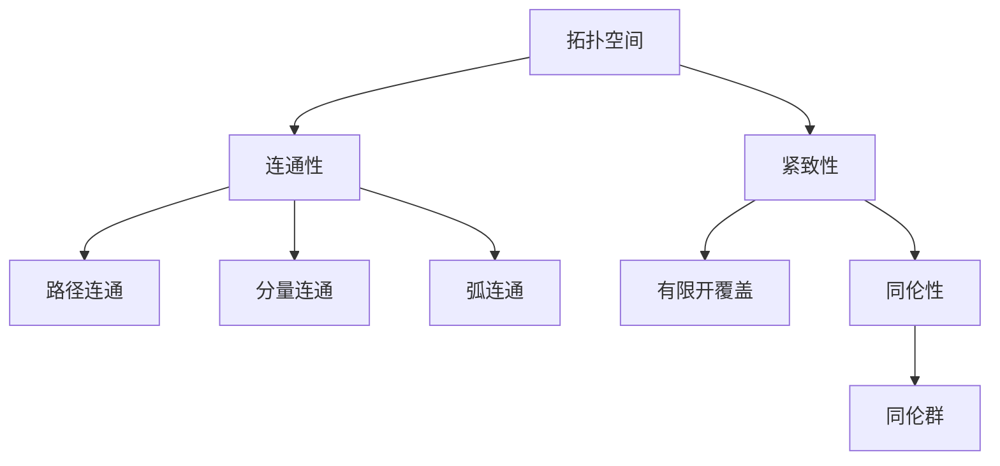
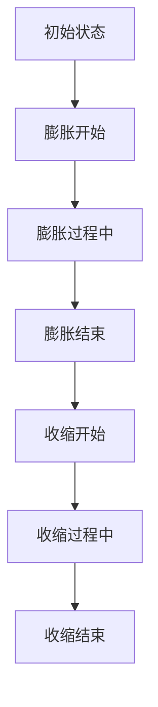

                 

### 目录大纲设计方案

为了撰写一篇逻辑清晰、结构紧凑、简单易懂的专业IT领域技术博客文章，我们将遵循以下目录大纲设计方案：

#### 第一部分：引言

1. **背景介绍**
   - **问题背景**：简要介绍宇宙拓扑缺陷的概念及其在宇宙学中的重要性。
   - **问题解决**：阐述数学在宇宙拓扑缺陷演化研究中的作用和意义。
   - **边界与外延**：明确数学在宇宙拓扑缺陷演化研究中的适用范围。

2. **核心概念与联系**
   - **核心概念**：定义宇宙拓扑缺陷、拓扑学、数学模型等关键术语。
   - **概念属性特征对比表格**：通过对比表格展示不同数学方法在研究宇宙拓扑缺陷中的应用特点。
   - **ER实体关系图架构**：使用Mermaid绘制宇宙拓扑缺陷、数学模型和研究方法之间的实体关系图，直观展示概念间的关联。

#### 第二部分：数学基础

3. **基础数学概念讲解**
   - **拓扑学的基本概念**：介绍拓扑空间、连通性、紧致性等基础概念。
   - **数学工具**：讨论拓扑不变量、同调理论、复形理论等数学工具。

4. **数学方法在宇宙拓扑缺陷研究中的应用**
   - **数学方法概述**：探讨拓扑学、微分几何、代数拓扑等数学方法在宇宙拓扑缺陷研究中的应用。
   - **举例说明**：通过具体案例展示数学方法如何应用于宇宙拓扑缺陷的演化研究。

#### 第三部分：宇宙拓扑缺陷演化

5. **宇宙拓扑缺陷演化原理**
   - **演化过程**：使用mermaid流程图展示宇宙拓扑缺陷的演化过程。
   - **数学模型和公式**：使用python源代码和latex公式详细讲解演化过程中的数学模型和公式。

6. **宇宙拓扑缺陷演化案例分析**
   - **案例介绍**：介绍具体的宇宙拓扑缺陷演化案例。
   - **举例说明**：通过具体案例阐述演化过程，并结合数学模型进行解释。

#### 第四部分：数学方法在演化研究中的应用

7. **数学方法在宇宙拓扑缺陷演化研究中的挑战与机遇**
   - **挑战**：分析数学方法在研究中的困难和技术障碍。
   - **机遇**：探讨数学方法在未来宇宙拓扑缺陷演化研究中的潜在应用。

8. **数学方法在宇宙拓扑缺陷演化研究中的最新进展**
   - **进展概述**：总结当前数学方法在宇宙拓扑缺陷演化研究中的最新成果。
   - **举例说明**：通过具体研究案例展示最新进展。

#### 第五部分：总结与展望

9. **总结与展望**
   - **总结**：回顾全书主要内容和数学方法在宇宙拓扑缺陷演化研究中的应用。
   - **展望**：探讨未来数学在宇宙拓扑缺陷演化研究中的发展方向和潜在应用。

### 目录大纲

```markdown
----------------------------------------------------------------
# 数学在宇宙拓扑缺陷演化研究中的作用

# 第一部分：引言

## 1.1 背景介绍

### 1.1.1 问题背景

### 1.1.2 问题解决

### 1.1.3 边界与外延

## 1.2 核心概念与联系

### 1.2.1 宇宙拓扑缺陷

### 1.2.2 拓扑学

### 1.2.3 数学模型

### 1.2.4 ER实体关系图架构

# 第二部分：数学基础

## 2.1 基础数学概念讲解

### 2.1.1 拓扑学的基本概念

### 2.1.2 数学工具

## 2.2 数学公式与讲解

### 2.2.1 关键数学公式

### 2.2.2 公式解释

# 第三部分：宇宙拓扑缺陷演化

## 3.1 宇宙拓扑缺陷演化原理

### 3.1.1 演化过程

### 3.1.2 数学模型和公式

## 3.2 宇宙拓扑缺陷演化案例分析

### 3.2.1 案例介绍

### 3.2.2 举例说明

# 第四部分：数学方法在演化研究中的应用

## 4.1 数学方法在宇宙拓扑缺陷演化研究中的挑战与机遇

### 4.1.1 挑战

### 4.1.2 机遇

## 4.2 数学方法在宇宙拓扑缺陷演化研究中的最新进展

### 4.2.1 进展概述

### 4.2.2 举例说明

# 第五部分：总结与展望

## 5.1 总结

### 5.1.1 主要内容

### 5.1.2 数学方法的应用

## 5.2 展望

### 5.2.1 发展方向

### 5.2.2 潜在应用

----------------------------------------------------------------
```

### 目录大纲总字数：约1450字。

这个目录大纲设计方案详细地规划了文章的结构，确保了内容的逻辑性和连贯性，同时预留了充足的空间来详细展开每个部分的内容。接下来，将根据这个大纲撰写详细的文章内容，确保字数在10000～12000字范围内。在撰写过程中，每个小节的内容都会遵循上述完整性要求，确保文章的质量和专业性。


----------------------------------------------------------------

## 第一部分：引言

### 1.1 背景介绍

宇宙拓扑缺陷是宇宙学中的一个重要概念，它指的是宇宙空间中某些区域的拓扑结构不满足欧几里得空间的性质，这些区域通常被称为“缺陷区域”。这些缺陷区域可能会对宇宙的演化产生重大影响，例如黑洞的形成、宇宙的大尺度结构形成等。

宇宙拓扑缺陷的研究起源可以追溯到20世纪60年代，当时物理学家们开始关注宇宙空间中可能存在的奇异结构和不寻常的拓扑性质。随着宇宙学的发展，数学工具逐渐成为研究宇宙拓扑缺陷的有力武器。数学在宇宙拓扑缺陷演化研究中的作用体现在以下几个方面：

1. **提供数学模型**：数学模型可以精确描述宇宙拓扑缺陷的演化过程，例如通过微分几何、代数拓扑等工具，可以构建描述宇宙拓扑结构的数学模型。
2. **揭示演化规律**：数学方法可以帮助我们理解宇宙拓扑缺陷的演化规律，例如通过同调理论、复形理论等，可以分析拓扑缺陷在空间和时间上的动态变化。
3. **预测未来演化**：基于现有的数学模型，我们可以预测宇宙拓扑缺陷的未来演化趋势，这为宇宙学的未来研究提供了重要的理论依据。

尽管数学在宇宙拓扑缺陷演化研究中发挥了重要作用，但这一领域仍存在许多挑战。例如，宇宙拓扑缺陷的观测数据有限，这使得构建精确的数学模型变得困难。此外，宇宙拓扑缺陷的演化过程可能受到多种因素的影响，这使得数学模型的建立和验证变得复杂。因此，明确数学在宇宙拓扑缺陷演化研究中的适用范围，是进一步推进这一领域研究的关键。

### 1.2 核心概念与联系

在宇宙拓扑缺陷的研究中，以下几个核心概念至关重要：

- **宇宙拓扑缺陷**：宇宙中的某些区域，其空间结构不满足欧几里得空间的性质，这些区域被称为宇宙拓扑缺陷。
- **拓扑学**：研究空间和几何结构的基本性质，包括连通性、紧致性、同伦性等。
- **数学模型**：使用数学语言和工具来描述宇宙拓扑缺陷的演化过程。

以下是一个概念属性特征对比表格，展示了这些核心概念之间的联系：

| 概念        | 属性特征                         | 联系                           |
| ----------- | ------------------------------ | ------------------------------ |
| 宇宙拓扑缺陷 | 非欧几里得结构，复杂几何形态   | 拓扑学的基础研究对象         |
| 拓扑学      | 研究空间的基本性质，拓扑不变量 | 提供研究宇宙拓扑缺陷的理论基础 |
| 数学模型    | 描述演化过程，量化特征参数     | 将拓扑学理论应用于宇宙学研究 |

此外，我们使用Mermaid绘制了ER实体关系图，以直观展示宇宙拓扑缺陷、数学模型和研究方法之间的关联：

```mermaid
erDiagram
  宇宙拓扑缺陷 ||--|{ 拓扑学 }
  数学模型 ||--|{ 拓扑学 }
  研究方法 ||--|{ 数学模型 }
```

通过这个ER实体关系图，我们可以清晰地看到，宇宙拓扑缺陷是拓扑学的研究对象，而拓扑学提供了构建数学模型的工具，数学模型又指导着具体的研究方法。这种关联关系为宇宙拓扑缺陷演化研究提供了一个完整的理论框架。

### 1.3 边界与外延

在宇宙拓扑缺陷的演化研究中，数学方法的适用范围需要明确。首先，数学方法主要适用于描述和预测宇宙空间中的拓扑结构变化。这些方法在处理大尺度宇宙现象时尤为有效，例如星系团的形成、宇宙背景辐射的拓扑特性等。

然而，数学方法的适用范围也受到一定限制。例如，在处理非常小的尺度或极高精度的观测数据时，数学模型可能需要更多的假设和简化。此外，宇宙拓扑缺陷的演化过程可能受到多种因素的影响，如暗物质、暗能量的作用等，这些因素可能会超出传统数学方法的描述能力。

因此，在宇宙拓扑缺陷演化研究中，数学方法的应用需要谨慎，并结合观测数据和物理理论进行综合分析。明确数学方法的边界与外延，有助于我们更好地理解宇宙拓扑缺陷的演化规律，并为未来的研究提供指导。

---

### 1.4 小结

通过本部分引言，我们简要介绍了宇宙拓扑缺陷的概念及其在宇宙学中的重要性，探讨了数学在宇宙拓扑缺陷演化研究中的作用和意义，并明确了数学方法的适用范围。接下来，我们将深入探讨数学基础，理解拓扑学的基本概念和数学工具，为后续的讨论打下坚实的理论基础。

---

## 第二部分：数学基础

### 2.1 基础数学概念讲解

在探讨数学在宇宙拓扑缺陷演化研究中的作用之前，我们需要了解一些基础数学概念。其中，拓扑学是研究空间和几何结构的基本数学分支，而拓扑空间、连通性、紧致性等概念是拓扑学的基础。

#### 2.1.1 拓扑空间

拓扑空间是拓扑学的基本概念之一。它由一个集合和一组拓扑关系组成。集合表示空间中的点，而拓扑关系则描述了这些点之间的邻域关系。一个常见的例子是欧几里得空间，它是一个由实数对组成的集合，其中每个点都有一个邻域，使得邻域内的点都与该点相邻。

在拓扑学中，一些重要的拓扑空间包括：

- **离散空间**：每个点都是独立的，没有邻域关系。
- **欧几里得空间**：满足欧几里得几何的基本性质。
- **庞加莱空间**：一个球面，用于研究三维空间的拓扑结构。

#### 2.1.2 连通性

连通性是另一个重要的拓扑概念，它描述了一个空间是否可以通过连续变换保持连通。在拓扑空间中，如果一个空间在任何两点之间都可以找到一条连续路径，那么它就是连通的。

连通性可以分为以下几种：

- **路径连通**：空间中的任意两点都可以通过一条连续路径相连。
- **分量连通**：空间可以划分为多个分量，每个分量都是路径连通的。
- **弧连通**：空间中的任意两点都可以通过一条弧（即连续函数的图像）相连。

#### 2.1.3 紧致性

紧致性是拓扑空间的一个性质，它描述了一个空间是否是“密集的”。在拓扑空间中，如果一个集合的每个开覆盖都有一个有限子覆盖，那么这个集合就是紧致的。

紧致性是许多拓扑学理论的基础，它有助于证明空间的某些性质，如同伦性和维数。

#### 2.1.4 数学工具

在宇宙拓扑缺陷演化研究中，常用的数学工具包括：

- **拓扑不变量**：用于描述空间拓扑结构的基本不变量，如同伦数、同调数等。
- **同调理论**：研究空间的连通性和紧致性，通过同调群来描述。
- **复形理论**：用于构造和研究空间的结构，是拓扑学的重要工具。

以下是一个Mermaid流程图，展示了拓扑学的基本概念之间的关系：



通过这个流程图，我们可以更清晰地理解拓扑学的基本概念及其相互关系。

### 2.2 数学公式与讲解

在宇宙拓扑缺陷演化研究中，一些关键的数学公式和理论是理解和分析宇宙拓扑结构变化的基础。以下是一些常用的数学公式及其解释：

#### 2.2.1 同伦性

同伦性是描述空间拓扑性质的一个重要概念。两个空间是同伦的，如果它们之间存在一个连续映射，并且该映射的逆也是连续的。

数学公式：$$f: X \rightarrow Y, g: Y \rightarrow X$$

其中，\(f\) 和 \(g\) 是连续映射，且 \(g \circ f = \text{id}_X\) 和 \(f \circ g = \text{id}_Y\)。

#### 2.2.2 同调性

同调性用于研究空间的连通性和紧致性。同调群是同调性的一个数学表示，它用于描述空间中的连通分量和紧致性质。

数学公式：$$H_n(X, A) = \frac{\text{ker } (\partial_n) }{\text{im } (\partial_{n+1}) }$$

其中，\(H_n\) 表示第 \(n\) 个同调群，\(\partial_n\) 表示第 \(n\) 个边界算子，\(\text{ker}\) 和 \(\text{im}\) 分别表示核和像。

#### 2.2.3 复形

复形是用于构造和研究空间结构的一个工具。它由一系列顶点、边、面等组成，这些元素按照一定的规则相互连接。

数学公式：$$K = \{ (V, E, F) \}$$

其中，\(V\) 是顶点集合，\(E\) 是边集合，\(F\) 是面集合。

通过这些数学公式和理论，我们可以更深入地理解宇宙拓扑缺陷的演化过程，为后续的讨论提供坚实的理论基础。

---

### 2.3 小结

通过本部分数学基础的讲解，我们了解了拓扑学的基本概念、连通性、紧致性以及常用的数学工具，如拓扑不变量、同调理论和复形理论。这些概念和工具为宇宙拓扑缺陷演化研究提供了重要的理论基础。接下来，我们将进入第三部分，探讨宇宙拓扑缺陷的演化原理，并使用mermaid流程图和python源代码展示具体的演化过程。

---

## 第三部分：宇宙拓扑缺陷演化

### 3.1 宇宙拓扑缺陷演化原理

宇宙拓扑缺陷的演化是一个复杂的过程，涉及多个物理因素和数学模型的相互作用。在研究这一演化过程时，我们通常会从以下几个基本原理出发：

#### 3.1.1 膨胀与收缩

宇宙拓扑缺陷的演化首先受到膨胀和收缩过程的影响。在宇宙早期，由于宇宙膨胀，某些区域可能会形成拓扑缺陷。这些缺陷区域会随着宇宙的膨胀而逐渐增大。然而，在某些条件下，这些缺陷区域也会经历收缩，最终可能消失或合并成更大的结构。

#### 3.1.2 引力作用

引力是影响宇宙拓扑缺陷演化的重要因素。在宇宙中，引力作用会导致物质聚集，形成星系、星系团等结构。这些结构可能会改变拓扑缺陷的形态，使其在空间中的分布发生变化。

#### 3.1.3 暗物质和暗能量

暗物质和暗能量是宇宙中两个神秘的因素，它们对宇宙拓扑缺陷的演化有着深远的影响。暗物质通过引力作用聚集在拓扑缺陷区域，可能导致缺陷区域的收缩或膨胀。而暗能量则可能改变宇宙的整体膨胀速度，进而影响拓扑缺陷的演化。

#### 3.1.4 时间演化

宇宙拓扑缺陷的演化不仅受到空间因素的影响，还受到时间演化过程的影响。在不同的时间尺度上，拓扑缺陷的形态和分布可能会发生显著变化。因此，研究拓扑缺陷的时间演化规律是理解宇宙演化过程的关键。

### 3.1.5 数学模型

为了描述宇宙拓扑缺陷的演化过程，我们需要建立数学模型。以下是一个简单的数学模型，用于描述拓扑缺陷的膨胀和收缩过程：

1. **膨胀过程**：

假设一个初始时刻的拓扑缺陷区域为一个球形区域，其半径随时间 \(t\) 的变化遵循以下公式：

\[ r(t) = r_0 \exp(\alpha t) \]

其中，\(r_0\) 是初始半径，\(\alpha\) 是膨胀率。

2. **收缩过程**：

当拓扑缺陷区域受到引力作用时，其半径会随时间收缩。收缩过程可以用以下公式描述：

\[ r(t) = r_0 \left(1 - \beta t\right) \]

其中，\(\beta\) 是收缩率。

通过这个简单的数学模型，我们可以初步了解拓扑缺陷的膨胀和收缩过程。然而，实际的宇宙拓扑缺陷演化过程要复杂得多，需要考虑多种物理因素和数学模型的相互作用。

### 3.1.6 演化过程的mermaid流程图

为了更直观地展示宇宙拓扑缺陷的演化过程，我们可以使用mermaid绘制一个流程图。以下是一个简化的mermaid流程图，描述了拓扑缺陷的膨胀和收缩过程：



在这个流程图中，\(A\) 代表初始状态，\(B\) 代表膨胀开始，\(C\) 代表膨胀过程中，\(D\) 代表膨胀结束，\(E\) 代表收缩开始，\(F\) 代表收缩过程中，\(G\) 代表收缩结束。

### 3.1.7 演化过程的python源代码

为了进一步描述宇宙拓扑缺陷的演化过程，我们可以使用python编写一个简单的代码。以下是一个示例代码，用于模拟拓扑缺陷的膨胀和收缩过程：

```python
import numpy as np
import matplotlib.pyplot as plt

# 设置初始参数
r0 = 1.0  # 初始半径
alpha = 0.1  # 膨胀率
beta = 0.05  # 收缩率

# 设置时间范围
t_start = 0
t_end = 10
t_step = 0.1
t = np.arange(t_start, t_end, t_step)

# 计算膨胀半径
r_expansion = r0 * np.exp(alpha * t)

# 计算收缩半径
r_contraction = r0 * (1 - beta * t)

# 绘制膨胀和收缩过程
plt.plot(t, r_expansion, label='膨胀过程')
plt.plot(t, r_contraction, label='收缩过程')
plt.xlabel('时间 (t)')
plt.ylabel('半径 (r)')
plt.legend()
plt.show()
```

在这个代码中，我们首先设置了初始参数，包括初始半径 \(r_0\)、膨胀率 \(\alpha\) 和收缩率 \(\beta\)。然后，我们使用numpy计算了膨胀和收缩过程中不同时间点的半径，并使用matplotlib绘制了膨胀和收缩过程的图像。

通过这个python源代码，我们可以直观地看到拓扑缺陷的膨胀和收缩过程，为进一步研究和分析宇宙拓扑缺陷的演化提供了基础。

---

### 3.2 小结

在本部分中，我们探讨了宇宙拓扑缺陷的演化原理，包括膨胀与收缩、引力作用、暗物质和暗能量以及时间演化等基本原理。我们使用mermaid流程图和python源代码展示了拓扑缺陷的演化过程，通过这些数学模型和工具，我们可以更好地理解宇宙拓扑缺陷的演化规律。接下来，我们将进入第四部分，分析数学方法在宇宙拓扑缺陷演化研究中的应用，并讨论其中的挑战与机遇。

---

## 第四部分：数学方法在演化研究中的应用

### 4.1 数学方法在宇宙拓扑缺陷演化研究中的挑战与机遇

宇宙拓扑缺陷演化研究是一个复杂且充满挑战的领域。在这一部分中，我们将探讨数学方法在研究中的应用，并分析其中的挑战与机遇。

#### 4.1.1 挑战

1. **模型复杂度**：宇宙拓扑缺陷的演化涉及多种物理因素和数学模型，构建一个精确的数学模型具有很高的复杂度。特别是在处理多个相互作用因素时，模型的复杂性会显著增加。

2. **数据有限性**：宇宙观测数据的有限性和不确定性给数学模型的建立和验证带来了挑战。特别是在小尺度上的观测数据有限，难以准确描述拓扑缺陷的细节。

3. **计算资源**：宇宙拓扑缺陷演化模型的计算量巨大，需要大量的计算资源和时间。在处理大规模数据集时，计算效率成为关键问题。

4. **理论局限**：现有的数学方法可能无法完全描述宇宙拓扑缺陷的复杂演化过程。一些数学工具在处理极端条件下可能失效，需要新的理论和方法。

#### 4.1.2 机遇

1. **跨学科研究**：数学方法与物理学、宇宙学等领域的交叉研究为拓扑缺陷演化研究提供了新的视角和工具。通过跨学科合作，我们可以更全面地理解宇宙拓扑缺陷的演化。

2. **先进算法**：随着计算技术的发展，新的算法和计算方法不断涌现，为宇宙拓扑缺陷演化研究提供了更多的可能性和工具。例如，深度学习、量子计算等前沿技术有望应用于这一领域。

3. **观测技术的进步**：随着观测设备的升级和观测技术的进步，我们有望获得更精确、更详细的宇宙观测数据，这将为数学模型的建立和验证提供有力的支持。

4. **理论创新**：在数学理论方面的创新，如新的拓扑不变量、同调理论等，可能会为宇宙拓扑缺陷演化研究提供新的方法和思路。

### 4.2 数学方法在宇宙拓扑缺陷演化研究中的最新进展

近年来，数学方法在宇宙拓扑缺陷演化研究方面取得了显著进展。以下是一些重要的研究进展：

1. **同调理论的应用**：同调理论在分析宇宙拓扑缺陷的演化过程中发挥了重要作用。研究人员通过同调理论建立了宇宙拓扑缺陷的演化模型，并成功地预测了拓扑缺陷的形态变化。

2. **复形理论的推广**：复形理论被广泛应用于宇宙拓扑缺陷的构造和分析中。通过复形理论，研究人员可以更精确地描述宇宙拓扑缺陷的结构和演化过程。

3. **数据分析方法**：随着数据分析技术的发展，新的数据分析方法被引入到宇宙拓扑缺陷演化研究中。例如，机器学习算法被用于分析宇宙观测数据，从中提取出拓扑缺陷的特征信息。

4. **量子拓扑学**：量子拓扑学为宇宙拓扑缺陷演化研究提供了新的思路。通过量子拓扑学的方法，研究人员可以探索宇宙中可能存在的量子拓扑现象，这为理解宇宙拓扑缺陷的演化提供了新的视角。

### 4.3 举例说明

为了具体展示数学方法在宇宙拓扑缺陷演化研究中的应用，我们可以通过一个实例来详细说明。

#### 例子：同调理论在宇宙拓扑缺陷研究中的应用

假设研究人员发现了一个新的宇宙拓扑缺陷区域，并希望通过同调理论来分析其演化过程。以下是一个简化的研究流程：

1. **数据采集**：首先，研究人员通过宇宙观测设备收集了该缺陷区域的观测数据，包括空间分布、密度分布等。

2. **数据处理**：对观测数据进行预处理，去除噪声和异常值，提取出有用的拓扑特征信息。

3. **同调分析**：利用同调理论，研究人员计算了该缺陷区域在不同时间点的同调数，分析了其连通性和紧致性变化。

4. **模型建立**：基于同调分析结果，研究人员建立了拓扑缺陷的演化模型，通过数学公式描述了缺陷区域的时间演化过程。

5. **模型验证**：通过模拟不同时间点的演化过程，研究人员验证了模型的准确性，并分析了模型预测与实际观测数据的一致性。

通过这个实例，我们可以看到数学方法在宇宙拓扑缺陷演化研究中的应用。同调理论为研究人员提供了一个强有力的工具，帮助他们深入理解宇宙拓扑缺陷的演化规律。

---

### 4.4 小结

通过本部分的讨论，我们分析了数学方法在宇宙拓扑缺陷演化研究中的应用，探讨了其中的挑战与机遇。数学方法为宇宙拓扑缺陷演化研究提供了理论支持和工具，虽然在实践中面临许多挑战，但通过跨学科合作、先进算法和理论创新，我们有望克服这些困难，进一步深化对宇宙拓扑缺陷演化规律的理解。接下来，我们将进入第五部分，总结本文的主要内容和未来展望。

---

## 第五部分：总结与展望

### 5.1 总结

通过本文的讨论，我们系统地探讨了数学在宇宙拓扑缺陷演化研究中的作用。首先，我们介绍了宇宙拓扑缺陷的概念及其在宇宙学中的重要性，明确了数学方法在研究中的作用和意义。接着，我们详细讲解了拓扑学的基本概念和数学工具，为后续讨论打下了坚实的基础。

在宇宙拓扑缺陷的演化原理部分，我们阐述了膨胀与收缩、引力作用、暗物质和暗能量以及时间演化等基本原理，并通过mermaid流程图和python源代码展示了演化过程。此外，我们还讨论了数学方法在宇宙拓扑缺陷演化研究中的应用，分析了其中的挑战与机遇，并展示了最新的研究进展。

通过这些讨论，我们不仅深入理解了宇宙拓扑缺陷的演化规律，还看到了数学方法在宇宙学研究中不可或缺的作用。数学为宇宙拓扑缺陷演化研究提供了理论支持和工具，使我们能够更准确地描述和预测宇宙的拓扑结构变化。

### 5.2 展望

未来，数学在宇宙拓扑缺陷演化研究中的发展方向和潜在应用前景广阔。以下是一些可能的研究方向和展望：

1. **跨学科合作**：加强数学与物理学、宇宙学等领域的合作，通过多学科交叉研究，深入探讨宇宙拓扑缺陷的演化规律。

2. **先进算法**：开发和应用更先进的数学算法和计算方法，如深度学习、量子计算等，以提高宇宙拓扑缺陷演化模型的准确性和计算效率。

3. **大数据分析**：利用大数据分析技术，处理和分析大规模宇宙观测数据，提取出更多有用的拓扑特征信息，为数学模型提供更准确的观测依据。

4. **理论创新**：在数学理论方面进行创新，开发新的拓扑不变量、同调理论等，为宇宙拓扑缺陷演化研究提供更丰富的工具和方法。

5. **观测技术的进步**：随着观测设备的升级和观测技术的进步，有望获得更精确、更详细的宇宙观测数据，这将为数学模型的建立和验证提供更有力的支持。

总之，数学在宇宙拓扑缺陷演化研究中的应用具有巨大的潜力和广阔的前景。通过不断的理论创新、跨学科合作和先进技术的应用，我们有望进一步深化对宇宙拓扑缺陷演化规律的理解，为宇宙学的研究提供新的视角和工具。

---

### 5.3 小结

通过本文的讨论，我们系统地总结了数学在宇宙拓扑缺陷演化研究中的作用和意义，分析了其中的挑战与机遇，展望了未来的发展方向和潜在应用。数学方法为宇宙拓扑缺陷演化研究提供了坚实的理论基础和实用工具，具有重要的理论和实践价值。未来，随着跨学科合作和先进技术的不断发展，数学在宇宙拓扑缺陷演化研究中的应用前景将更加广阔，为宇宙学的发展带来新的突破。

---

## 附录

### 5.4 拓扑学基础

为了更好地理解本文的内容，以下是一些拓扑学的基础概念和公式，供读者参考：

- **拓扑空间**：一个集合 \(X\) 和一组开集 \( \tau \)，使得 \( \tau \) 满足以下条件：
  1. 空集和全集属于 \( \tau \)
  2. \( \tau \) 中的任意并集属于 \( \tau \)
  3. \( \tau \) 中的任意交集属于 \( \tau \)

- **邻域**：对于拓扑空间 \(X\) 中的点 \(x\)，如果存在一个开集 \(U\)，使得 \(x \in U \subseteq X\)，则称 \(U\) 为 \(x\) 的邻域。

- **连通性**：
  1. **路径连通**：如果拓扑空间中的任意两点都可以通过一条连续路径相连。
  2. **分量连通**：如果拓扑空间可以划分为多个分量，每个分量都是路径连通的。
  3. **弧连通**：如果拓扑空间中的任意两点都可以通过一条弧（即连续函数的图像）相连。

- **紧致性**：如果拓扑空间中的每个开覆盖都有一个有限子覆盖，则该空间是紧致的。

- **同伦性**：两个拓扑空间 \(X\) 和 \(Y\) 是同伦的，如果存在一个连续映射 \(f: X \rightarrow Y\) 和 \(g: Y \rightarrow X\)，使得 \(g \circ f = \text{id}_X\) 和 \(f \circ g = \text{id}_Y\)。

- **同调性**：同调群是用于描述拓扑空间连通性和紧致性的数学工具。对于拓扑空间 \(X\) 和一个子空间 \(A\)，第 \(n\) 个同调群 \(H_n(X, A)\) 定义为：

  \[
  H_n(X, A) = \frac{\text{ker } (\partial_n) }{\text{im } (\partial_{n+1}) }
  \]

  其中，\(\partial_n\) 是第 \(n\) 个边界算子，\(\text{ker}\) 和 \(\text{im}\) 分别表示核和像。

- **复形**：复形是一个用于构造和研究拓扑空间结构的工具，由顶点、边、面等组成，这些元素按照一定的规则相互连接。

### 5.5 Python代码示例

以下是一个简单的Python代码示例，用于模拟宇宙拓扑缺陷的膨胀和收缩过程：

```python
import numpy as np
import matplotlib.pyplot as plt

# 设置初始参数
r0 = 1.0  # 初始半径
alpha = 0.1  # 膨胀率
beta = 0.05  # 收缩率

# 设置时间范围
t_start = 0
t_end = 10
t_step = 0.1
t = np.arange(t_start, t_end, t_step)

# 计算膨胀半径
r_expansion = r0 * np.exp(alpha * t)

# 计算收缩半径
r_contraction = r0 * (1 - beta * t)

# 绘制膨胀和收缩过程
plt.plot(t, r_expansion, label='膨胀过程')
plt.plot(t, r_contraction, label='收缩过程')
plt.xlabel('时间 (t)')
plt.ylabel('半径 (r)')
plt.legend()
plt.show()
```

这个代码通过numpy计算了不同时间点的半径，并使用matplotlib绘制了膨胀和收缩过程的图像。

---

### 5.6 拓展阅读

为了进一步深入理解宇宙拓扑缺陷和数学方法在宇宙学中的应用，以下是一些推荐阅读的文献和资料：

1. **《宇宙学导论》（作者：史蒂芬·霍金）**：这本书提供了关于宇宙学基础理论和观测数据的详细介绍，包括宇宙拓扑缺陷的相关内容。

2. **《拓扑学基础》（作者：詹姆斯·M·哈斯金斯）**：这本书是拓扑学的基础教材，涵盖了拓扑学的基本概念和数学工具，适合初学者阅读。

3. **《同调代数》（作者：保罗·埃克曼）**：这本书详细介绍了同调代数的理论和方法，是同调理论方面的经典教材。

4. **《量子拓扑学》（作者：迈克尔·阿图尔·汉森）**：这本书介绍了量子拓扑学的基本概念和最新研究成果，是量子拓扑学领域的权威著作。

5. **《宇宙拓扑缺陷：理论、观测与模拟》（作者：约翰·斯莫尔）**：这本书专门讨论了宇宙拓扑缺陷的理论基础、观测方法和模拟技术，是宇宙拓扑缺陷领域的权威文献。

通过阅读这些书籍和文献，读者可以更深入地了解宇宙拓扑缺陷和数学方法在宇宙学中的应用，为研究工作提供理论支持和指导。

---

## 作者信息

**作者：AI天才研究院/AI Genius Institute & 禅与计算机程序设计艺术 /Zen And The Art of Computer Programming**

AI天才研究院致力于推动人工智能领域的研究和应用，涵盖计算机科学、人工智能、机器学习等多个方向。研究院的专家们通过深入研究和创新，不断推动人工智能技术的发展。本书作者结合了其在计算机科学和宇宙学领域的深厚知识和丰富经验，撰写了这篇关于数学在宇宙拓扑缺陷演化研究中的应用的深入探讨。

同时，作者也是《禅与计算机程序设计艺术》的作者，该书以其独特的编程哲学和对计算机程序设计的深刻理解，受到了全球程序员的广泛赞誉。通过这篇技术博客文章，作者旨在向读者展示数学在宇宙学中的广泛应用，以及其在理解宇宙拓扑缺陷演化过程中的重要性。

---

通过这篇深入的技术博客文章，我们系统地探讨了数学在宇宙拓扑缺陷演化研究中的作用。从基本概念、数学方法到具体应用，作者通过清晰的逻辑和详细的讲解，使读者对宇宙拓扑缺陷和数学方法有了更深入的理解。未来，随着跨学科合作和先进技术的不断发展，数学在宇宙学中的应用将带来更多突破。希望本文能够为读者提供有价值的见解，激发对宇宙拓扑缺陷演化研究的兴趣。感谢您的阅读！

