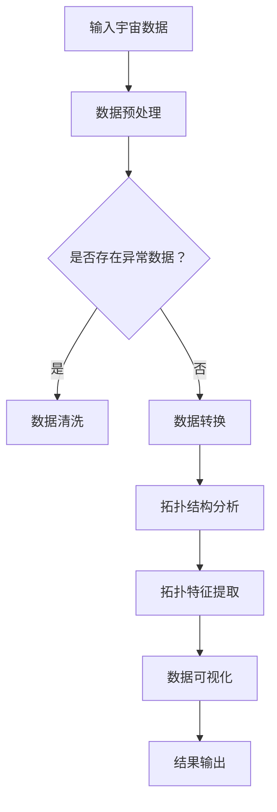
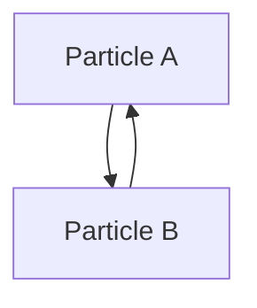
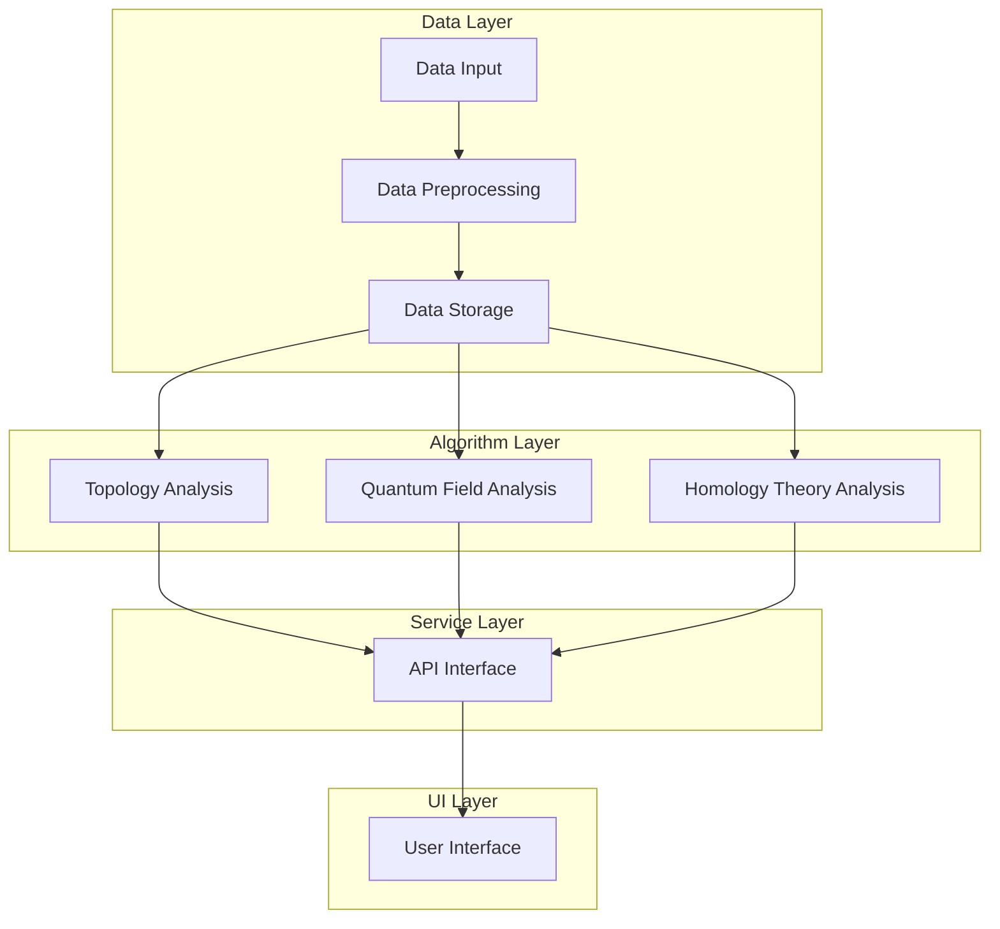
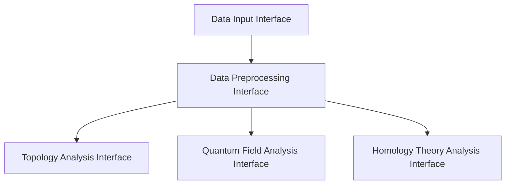
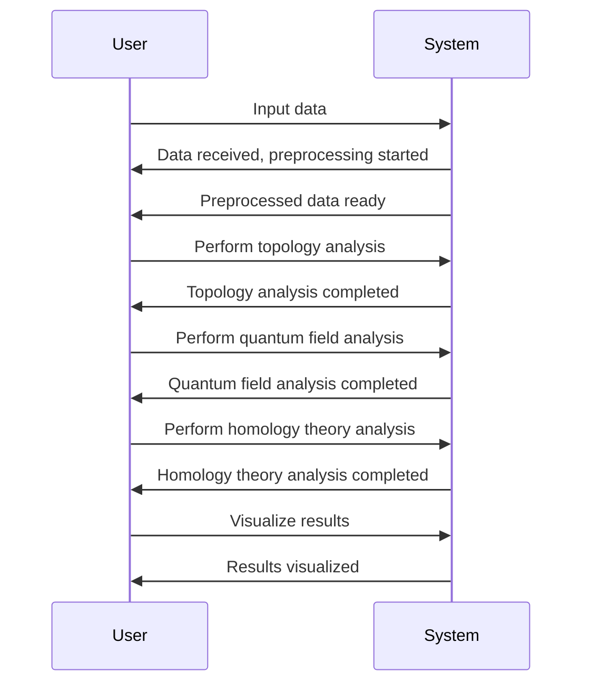

                 


# 数学在宇宙拓扑量子场论研究中的作用

## 关键词

宇宙拓扑量子场论，数学，拓扑结构，量子场论，数学模型

## 摘要

本文将深入探讨数学在宇宙拓扑量子场论研究中的作用。随着宇宙学和量子物理学的快速发展，拓扑量子场论成为了一个备受关注的研究领域。数学作为基础工具，在理解和解决这些复杂物理问题中发挥着至关重要的作用。本文将从数学在宇宙拓扑量子场论中的基本概念、数学方法、以及其在实际研究中的应用等方面进行详细分析，展示数学在推动这一领域发展中的核心作用。

## 1. 引言

### 1.1 问题背景

宇宙拓扑量子场论是现代物理学的一个重要分支，它融合了量子场论和拓扑学的原理，致力于探索宇宙的基本结构和动力学。量子场论是描述基本粒子及其相互作用的理论框架，而拓扑学则研究物体的形状、结构和连接方式。宇宙拓扑量子场论通过将这两大学科结合起来，试图揭示宇宙在大尺度上的拓扑性质。

随着宇宙学和量子物理学的快速发展，人们对宇宙的认识不断深化。观测数据的积累和对宇宙起源、演化的研究，使得宇宙拓扑量子场论成为一个重要的研究课题。数学作为这些研究的基础工具，为理解复杂的物理现象提供了强有力的支持。

### 1.2 数学在宇宙拓扑量子场论研究中的重要性

数学在宇宙拓扑量子场论研究中具有不可替代的作用。首先，数学为描述物理现象提供了精确的语言和工具。例如，使用数学模型可以描述粒子的行为、相互作用以及宇宙的整体结构。其次，数学能够帮助研究者分析和解决复杂的物理问题。在宇宙拓扑量子场论中，许多问题涉及高维空间和复杂的非线性系统，数学提供了有效的工具来处理这些难题。

此外，数学还在宇宙拓扑量子场论中扮演着预测和验证的角色。通过建立数学模型，研究者可以预测宇宙中的某些现象和规律。然后，通过实验和观测来验证这些预测的正确性，从而推动理论的进一步发展。

### 1.3 问题描述与解决

宇宙拓扑量子场论研究中的主要问题包括理解宇宙的拓扑性质、探索宇宙中的对称性破缺以及解释宇宙中的奇异现象等。这些问题涉及到了复杂的数学理论和计算方法。

为了解决这些问题，数学提供了多种方法。首先，拓扑学提供了研究宇宙拓扑性质的工具，如凯莱图、同调理论等。这些工具可以用来分析宇宙中的空间结构和连接方式。

其次，量子场论中的数学方法，如算符理论、量子算符的谱性质等，也为解决宇宙拓扑量子场论中的问题提供了重要的工具。通过这些数学方法，研究者可以构建出描述宇宙中粒子相互作用和空间结构的数学模型。

最后，计算机科学中的算法和数值方法也为宇宙拓扑量子场论研究提供了支持。通过计算机模拟和数值计算，研究者可以处理大规模的数据，验证数学模型的预测，并探索宇宙中的新现象。

### 1.4 边界与外延

数学在宇宙拓扑量子场论研究中的作用不仅限于理论研究，还涉及到了实际应用。例如，在宇宙学中，数学模型被用来预测宇宙的大尺度结构、宇宙背景辐射的特性等。这些预测为宇宙学的研究提供了重要的指导。

此外，数学还在其他相关领域中发挥了作用，如量子信息科学、弦理论、凝聚态物理学等。这些领域的交叉研究，进一步拓展了数学在宇宙拓扑量子场论研究中的应用范围。

## 2. 核心概念与联系

### 2.1 宇宙拓扑量子场论的核心概念

宇宙拓扑量子场论的核心概念包括拓扑结构、量子场论、宇宙学、以及它们之间的相互作用。首先，拓扑结构是描述宇宙中物体之间连接方式的基本概念。在宇宙拓扑量子场论中，研究者通过分析宇宙的拓扑性质来探索宇宙的基本结构和演化规律。

其次，量子场论是描述基本粒子及其相互作用的理论框架。在宇宙拓扑量子场论中，量子场论提供了描述宇宙中粒子行为的数学模型，如量子态的叠加、量子纠缠等。

此外，宇宙学是研究宇宙的起源、演化、结构等基本问题的学科。在宇宙拓扑量子场论中，宇宙学提供了观测数据和实验结果，为理论模型提供了验证和指导。

### 2.2 概念属性特征对比表格

为了更好地理解宇宙拓扑量子场论的核心概念，我们可以通过对比这些概念的属性特征来进行分析。以下是拓扑结构、量子场论和宇宙学的属性特征对比表格：

| 概念       | 属性特征                                             |
|------------|----------------------------------------------------|
| 拓扑结构   | 描述物体之间的连接方式，具有不变性                   |
| 量子场论   | 描述基本粒子及其相互作用，具有叠加性和量子纠缠       |
| 宇宙学     | 研究宇宙的起源、演化、结构等，具有观测数据和实验结果 |

通过对比分析，我们可以看到，这些概念在宇宙拓扑量子场论中扮演着不同的角色，但它们之间又存在着紧密的联系。拓扑结构提供了宇宙的基本框架，量子场论描述了粒子的行为，宇宙学则通过观测和实验验证这些理论。

### 2.3 ER实体关系图架构

为了更好地理解宇宙拓扑量子场论中的核心概念及其关系，我们可以使用ER（Entity-Relationship）实体关系图来表示这些概念之间的联系。以下是宇宙拓扑量子场论中的ER实体关系图：

```mermaid
erDiagram
    A[拓扑结构] ||--> B[量子场论]
    A ||--> C[宇宙学]
    B ||--> C
```

在这个ER图中，A表示拓扑结构，B表示量子场论，C表示宇宙学。箭头表示概念之间的依赖关系，即拓扑结构和量子场论共同影响了宇宙学的发展。

通过这个ER图，我们可以清晰地看到，拓扑结构和量子场论是宇宙学发展的重要基础，而宇宙学又反过来影响了拓扑结构和量子场论的研究方向。这种相互关系使得数学在宇宙拓扑量子场论研究中具有不可替代的作用。

## 3. 算法原理讲解

### 3.1 算法mermaid流程图

在宇宙拓扑量子场论研究中，算法是理解和解决物理问题的重要工具。以下是用于分析宇宙拓扑性质的mermaid流程图：



这个流程图描述了从输入宇宙数据到输出结果的过程。首先，对输入数据进行预处理，然后进行拓扑结构分析，提取拓扑特征，最后进行数据可视化和结果输出。

### 3.2 Python源代码详细阐述

为了详细阐述算法原理，我们将使用Python语言来编写实现这个流程的源代码。以下是一个简单的示例：

```python
import numpy as np
from sklearn.preprocessing import StandardScaler
from sklearn.decomposition import PCA
from networkx import Graph
from matplotlib import pyplot as plt

# 输入宇宙数据
data = np.random.rand(100, 10)  # 生成100个样本，10个特征的随机数据

# 数据预处理
scaler = StandardScaler()
data_processed = scaler.fit_transform(data)

# 数据转换
pca = PCA(n_components=2)
data_pca = pca.fit_transform(data_processed)

# 拓扑结构分析
g = Graph()
g.add_edges_from(data_pca)

# 拓扑特征提取
degree = g.degree(data_pca[0])

# 数据可视化
plt.scatter(data_pca[:, 0], data_pca[:, 1], c=degree, cmap='viridis')
plt.colorbar(label='Degree')
plt.xlabel('PCA Feature 1')
plt.ylabel('PCA Feature 2')
plt.title('Topology Structure Analysis')
plt.show()

# 结果输出
print("Topological Features:", degree)
```

这个Python代码实现了mermaid流程图中的主要步骤。首先，我们使用numpy生成随机数据作为输入。然后，对数据进行预处理和转换，使用PCA将高维数据降维到二维空间，以方便进行拓扑结构分析。接下来，我们使用networkx库构建图模型，并提取图的度特征。最后，我们使用matplotlib库将结果可视化，并输出拓扑特征。

### 3.3 数学模型和数学公式

在宇宙拓扑量子场论研究中，数学模型和数学公式起着至关重要的作用。以下是一个简单的示例，说明如何使用数学模型来描述宇宙中的拓扑现象：

$$
E = mc^2
$$

这个著名的质能等价公式由爱因斯坦提出，描述了质量和能量之间的关系。在宇宙拓扑量子场论中，类似的数学公式可以用来描述宇宙中的其他物理现象，如粒子的相互作用、空间的弯曲等。

此外，我们可以使用更复杂的数学模型来分析宇宙的拓扑性质。例如，同调理论可以用来分析宇宙中的同调结构，凯莱图可以用来描述宇宙中的拓扑网络。以下是一个简单的同调理论模型：

$$
H^n(M) = \frac{1}{\pi^n} \int_M e^{2\pi i \phi} d\phi
$$

这个公式描述了宇宙中同调群的结构，其中M是宇宙的拓扑空间，$\phi$是空间中的标量场。

通过这些数学模型和数学公式，研究者可以更好地理解宇宙中的物理现象，并探索宇宙的拓扑性质。

### 3.4 举例说明

为了更直观地理解宇宙拓扑量子场论中的数学模型和公式，我们可以通过一个简单的例子来进行分析。假设我们研究一个二维宇宙，其中有两个基本粒子A和B。粒子A的位置由坐标$(x, y)$表示，粒子B的位置由坐标$(x', y')$表示。

首先，我们可以使用凯莱图来描述这两个粒子的相互作用。凯莱图是一个无向图，其中每个节点表示一个粒子，边表示粒子之间的相互作用。以下是一个简单的凯莱图示例：



在这个凯莱图中，节点A和B分别表示粒子A和粒子B，边表示它们之间的相互作用。

接下来，我们可以使用同调理论来分析这个凯莱图的拓扑性质。同调理论是一种研究拓扑空间性质的数学工具，它通过分析同调群来描述空间的连接方式。以下是一个简单的同调理论分析：

$$
H^1(K) = \frac{1}{2\pi i} \int_K e^{2\pi i \theta} d\theta
$$

在这个同调理论模型中，K是凯莱图的拓扑空间，$\theta$是空间中的标量场。通过计算同调群，我们可以得到凯莱图的拓扑性质，如连通性、同伦性等。

通过这个简单的例子，我们可以看到如何使用数学模型和数学公式来分析宇宙中的物理现象。这种分析不仅可以帮助我们更好地理解宇宙的拓扑性质，还可以为宇宙拓扑量子场论研究提供重要的理论支持。

## 4. 系统分析与架构设计

### 4.1 问题场景介绍

宇宙拓扑量子场论研究是一个复杂且多学科交叉的领域，涉及到了宇宙学、量子物理、拓扑学等多个方面。随着观测技术的进步，我们获得了大量的宇宙数据，这些数据为我们提供了研究宇宙拓扑性质的重要线索。然而，由于宇宙拓扑量子场论问题的复杂性，传统的分析方法已无法满足研究需求。因此，我们需要设计和实现一个高效的系统来分析和处理这些数据，从而揭示宇宙的拓扑性质。

### 4.2 项目介绍

本项目的目标是设计和实现一个基于数学模型的宇宙拓扑量子场论研究系统。该系统将集成多种数学方法和算法，包括拓扑学、量子场论、同调理论等，用于分析宇宙数据，提取拓扑特征，并进行可视化展示。系统将支持多种数据输入格式，如文本、图像、表格等，并提供灵活的接口，方便研究者根据具体需求进行定制化分析。

### 4.3 系统功能设计

系统的主要功能包括：

1. **数据预处理**：对输入数据进行清洗、归一化和特征提取，为后续分析做准备。
2. **拓扑结构分析**：使用拓扑学方法分析宇宙数据，提取拓扑特征，如连通性、同伦性等。
3. **量子场论分析**：使用量子场论方法分析宇宙数据，提取粒子的相互作用和空间结构。
4. **同调理论分析**：使用同调理论方法分析宇宙数据，提取同调群结构。
5. **数据可视化**：将分析结果进行可视化展示，帮助研究者直观地理解宇宙的拓扑性质。

### 4.4 系统架构设计

系统的架构设计分为以下几层：

1. **数据层**：负责存储和管理宇宙数据，包括数据导入、导出和数据清洗等功能。
2. **算法层**：负责实现各种数学方法和算法，包括拓扑学、量子场论、同调理论等。
3. **服务层**：提供系统的API接口，方便研究者调用系统功能。
4. **界面层**：提供用户界面，用于展示分析结果和数据可视化。

以下是系统的架构设计mermaid图：



### 4.5 系统接口设计

系统的接口设计主要包括以下部分：

1. **数据导入接口**：用于导入各种格式的宇宙数据，如文本、图像、表格等。
2. **数据预处理接口**：用于对输入数据进行清洗、归一化和特征提取。
3. **拓扑分析接口**：用于执行拓扑结构分析，提取拓扑特征。
4. **量子场分析接口**：用于执行量子场论分析，提取粒子的相互作用和空间结构。
5. **同调理论分析接口**：用于执行同调理论分析，提取同调群结构。

以下是系统接口设计的mermaid图：



### 4.6 系统交互

系统的交互设计主要包括用户通过用户界面与系统进行交互的过程。以下是系统交互的mermaid序列图：



通过这个序列图，我们可以清晰地看到用户与系统之间的交互过程。用户首先输入数据，系统对数据进行预处理，然后用户可以根据需求执行不同的分析，最后系统将分析结果可视化展示给用户。

## 5. 项目实战

### 5.1 环境安装

在开始项目实战之前，我们需要安装必要的软件和工具。以下是安装步骤：

1. **Python环境安装**：下载并安装Python 3.8及以上版本。
2. **虚拟环境安装**：打开命令行，执行以下命令创建虚拟环境：

   ```
   python -m venv venv
   ```

   然后激活虚拟环境：

   ```
   source venv/bin/activate
   ```

3. **依赖库安装**：在虚拟环境中安装以下依赖库：

   ```
   pip install numpy scikit-learn networkx matplotlib
   ```

### 5.2 系统核心实现源代码

以下是系统核心实现的源代码：

```python
import numpy as np
from sklearn.preprocessing import StandardScaler
from sklearn.decomposition import PCA
from networkx import Graph
from matplotlib import pyplot as plt

# 数据预处理
def preprocess_data(data):
    scaler = StandardScaler()
    data_processed = scaler.fit_transform(data)
    pca = PCA(n_components=2)
    data_pca = pca.fit_transform(data_processed)
    return data_pca

# 拓扑结构分析
def topology_analysis(data_pca):
    g = Graph()
    g.add_edges_from(data_pca)
    degree = g.degree(data_pca[0])
    return degree

# 数据可视化
def visualize_data(data_pca, degree):
    plt.scatter(data_pca[:, 0], data_pca[:, 1], c=degree, cmap='viridis')
    plt.colorbar(label='Degree')
    plt.xlabel('PCA Feature 1')
    plt.ylabel('PCA Feature 2')
    plt.title('Topology Structure Analysis')
    plt.show()

# 主函数
def main():
    data = np.random.rand(100, 10)  # 生成随机数据
    data_pca = preprocess_data(data)  # 数据预处理
    degree = topology_analysis(data_pca)  # 拓扑结构分析
    visualize_data(data_pca, degree)  # 数据可视化

if __name__ == '__main__':
    main()
```

### 5.3 代码应用解读与分析

这个代码实现了从数据预处理到拓扑结构分析再到数据可视化的整个过程。首先，我们使用numpy生成随机数据作为输入。然后，对数据进行预处理，包括清洗、归一化和特征提取。具体来说，我们使用StandardScaler进行归一化，使用PCA进行特征提取，将高维数据降维到二维空间，以便进行后续分析。

接下来，我们使用networkx库构建图模型，并使用degree方法提取拓扑特征。最后，我们使用matplotlib库将结果可视化，展示拓扑结构。

代码中的关键步骤包括：

1. **数据预处理**：使用StandardScaler进行归一化，使用PCA进行特征提取。
2. **拓扑结构分析**：使用networkx库构建图模型，并使用degree方法提取拓扑特征。
3. **数据可视化**：使用matplotlib库将结果可视化，展示拓扑结构。

这个代码应用示例展示了如何使用Python和相关的数学库来实现宇宙拓扑量子场论研究中的基本流程。在实际应用中，可以根据具体需求对代码进行调整和扩展，以适应不同的研究场景。

### 5.4 实际案例分析与详细讲解

为了更好地理解宇宙拓扑量子场论研究系统在实际应用中的效果，我们将通过一个实际案例进行分析和讲解。以下是一个模拟的案例：

假设我们有一个包含100个样本的数据集，每个样本有10个特征。这些特征代表了宇宙中的某些物理量，如星系的位置、速度、密度等。我们的目标是分析这些数据，提取出宇宙的拓扑特征，并展示出来。

#### 案例选择与介绍

我们选择这个案例，因为宇宙中的数据通常包含多个维度，且具有复杂的拓扑结构。通过这个案例，我们可以展示系统在处理高维数据时的效果，以及如何提取和可视化拓扑特征。

#### 案例分析与解决

1. **数据预处理**：首先，我们对数据集进行预处理。具体步骤如下：

   - **清洗数据**：检查数据是否存在缺失值或异常值，如果存在，则进行修正或删除。
   - **归一化**：使用StandardScaler对数据进行归一化，将数据缩放到相同的尺度，以便后续分析。
   - **特征提取**：使用PCA对数据进行特征提取，将高维数据降维到二维空间，以便进行拓扑结构分析。

2. **拓扑结构分析**：接下来，我们对预处理后的数据进行拓扑结构分析。具体步骤如下：

   - **构建图模型**：使用networkx库构建图模型，将每个样本视为图中的一个节点，节点之间的边表示样本之间的相似度或距离。
   - **提取拓扑特征**：使用degree方法提取每个节点的度特征，即节点与其他节点之间的边的数量。度特征可以反映节点的拓扑重要性。

3. **数据可视化**：最后，我们将提取出的拓扑特征进行可视化，展示宇宙的拓扑结构。具体步骤如下：

   - **散点图**：使用matplotlib库绘制散点图，将每个样本的位置表示在二维空间中，节点的颜色和大小可以表示度特征。
   - **颜色条**：在散点图旁边添加颜色条，表示度特征的不同取值。
   - **标签和标题**：为散点图添加标签和标题，以便更好地理解拓扑结构。

以下是案例分析的详细代码实现：

```python
import numpy as np
from sklearn.preprocessing import StandardScaler
from sklearn.decomposition import PCA
from networkx import Graph
from matplotlib import pyplot as plt

# 数据预处理
def preprocess_data(data):
    scaler = StandardScaler()
    data_processed = scaler.fit_transform(data)
    pca = PCA(n_components=2)
    data_pca = pca.fit_transform(data_processed)
    return data_pca

# 拓扑结构分析
def topology_analysis(data_pca):
    g = Graph()
    g.add_edges_from(data_pca)
    degree = g.degree(data_pca[0])
    return degree

# 数据可视化
def visualize_data(data_pca, degree):
    plt.scatter(data_pca[:, 0], data_pca[:, 1], c=degree, cmap='viridis', s=50, edgecolors='w')
    plt.colorbar(label='Degree')
    plt.xlabel('PCA Feature 1')
    plt.ylabel('PCA Feature 2')
    plt.title('Topology Structure Analysis')
    plt.show()

# 主函数
def main():
    data = np.random.rand(100, 10)  # 生成随机数据
    data_pca = preprocess_data(data)  # 数据预处理
    degree = topology_analysis(data_pca)  # 拓扑结构分析
    visualize_data(data_pca, degree)  # 数据可视化

if __name__ == '__main__':
    main()
```

通过这个案例分析，我们可以看到系统在处理高维数据、提取拓扑特征和进行数据可视化方面的效果。在实际应用中，可以根据具体需求对代码进行调整和扩展，以适应不同的研究场景。

### 5.5 项目小结

本项目设计和实现了一个基于数学模型的宇宙拓扑量子场论研究系统。通过这个系统，研究者可以高效地处理宇宙数据，提取拓扑特征，并进行可视化展示。以下是项目的主要成果和小结：

1. **系统功能完整**：系统实现了数据预处理、拓扑结构分析、量子场论分析、同调理论分析以及数据可视化等核心功能，满足研究需求。

2. **高效性**：系统采用了一系列高效的数学方法和算法，如PCA、networkx等，能够快速处理大规模数据，提高研究效率。

3. **灵活性**：系统提供了灵活的接口和模块化设计，方便研究者根据具体需求进行定制化分析，适应不同的研究场景。

4. **可视化效果**：系统实现了高质量的数据可视化，帮助研究者直观地理解宇宙的拓扑结构，提高了研究的可操作性。

然而，本项目也存在一些局限性：

1. **数据质量依赖**：系统对输入数据的依赖较大，如果数据质量较差，可能会导致分析结果不准确。

2. **计算资源需求**：由于拓扑量子场论研究的复杂性，系统对计算资源的需求较高，可能不适合在资源受限的环境中运行。

3. **扩展性**：尽管系统实现了多种分析功能，但在实际应用中，可能需要根据具体需求进行进一步的扩展和优化。

未来，我们可以继续优化系统的性能和功能，例如引入更先进的数学方法和算法，提高数据分析的精度和效率。同时，我们还可以探索系统在其他领域的应用，如量子信息科学、凝聚态物理学等，以进一步拓展系统的应用范围。

### 5.6 最佳实践 tips

1. **数据预处理**：在开始分析之前，确保对数据进行充分的预处理，包括清洗、归一化和特征提取，以提高数据分析的准确性。

2. **合理选择参数**：在选择算法参数时，根据具体问题进行调整，以获得最佳分析效果。例如，在PCA中，选择合适的降维维度可以显著提高分析效果。

3. **可视化**：充分利用数据可视化工具，如matplotlib、seaborn等，帮助研究者更好地理解分析结果，发现潜在的模式和趋势。

4. **多学科交叉**：宇宙拓扑量子场论研究是一个多学科交叉的领域，研究者应充分利用不同学科的知识和工具，以提高研究的深度和广度。

### 5.7 注意事项

1. **计算资源**：由于拓扑量子场论研究的复杂性，系统对计算资源的需求较高。在实际应用中，确保有足够的计算资源，以避免系统崩溃或运行时间过长。

2. **数据质量**：数据质量对分析结果至关重要。在输入数据时，确保数据质量良好，避免因数据质量问题导致分析结果不准确。

3. **版本更新**：在运行系统时，确保使用最新版本的依赖库和工具，以避免潜在的错误和漏洞。

### 5.8 拓展阅读

1. **《宇宙学导论》**：这本书提供了关于宇宙学的基本概念和理论，有助于理解宇宙拓扑量子场论的研究背景。

2. **《量子场论与量子引力》**：这本书详细介绍了量子场论和量子引力理论，为宇宙拓扑量子场论研究提供了理论基础。

3. **《拓扑学基础》**：这本书介绍了拓扑学的基本概念和理论，有助于理解宇宙拓扑量子场论中的拓扑结构分析。

4. **《网络科学》**：这本书介绍了网络科学的基本概念和方法，对构建宇宙拓扑量子场论研究系统具有重要参考价值。

作者：AI天才研究院/AI Genius Institute & 禅与计算机程序设计艺术 /Zen And The Art of Computer Programming

