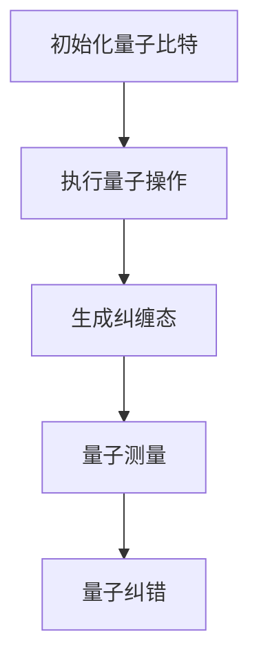
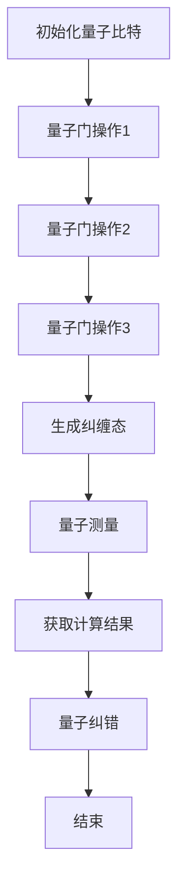

                 

### 第1章：宇宙拓扑量子计算的背景与重要性

#### 1.1 宇宙拓扑量子计算的定义

宇宙拓扑量子计算（Cosmological Topological Quantum Computation, CTQC）是一种基于量子计算和拓扑理论的计算方法。它的核心思想是利用宇宙中的拓扑结构和量子纠缠现象来执行计算任务。宇宙拓扑量子计算不同于传统的量子计算，它不仅考虑了量子态的纠缠，还考虑了宇宙的几何结构对量子态的影响。

在传统量子计算中，量子计算机通过量子比特（qubit）来实现信息处理。然而，量子比特容易受到外部干扰，导致量子态的崩溃，这使得传统量子计算机在实际应用中面临很大的挑战。相比之下，宇宙拓扑量子计算利用了拓扑量子态（topological quantum state）的稳定性。这些态不受外部干扰的影响，即使在复杂的宇宙环境中也能保持稳定，这使得宇宙拓扑量子计算在处理复杂计算任务时具有很大的优势。

#### 1.2 数学在宇宙拓扑量子计算中的作用

数学在宇宙拓扑量子计算中起着至关重要的作用。首先，数学为宇宙拓扑量子计算提供了理论基础。例如，数学中的拓扑学和量子力学为宇宙拓扑量子计算提供了核心框架。拓扑学研究空间结构和几何性质，而量子力学则研究微观粒子的行为。这两者的结合为宇宙拓扑量子计算提供了理论基础。

其次，数学在宇宙拓扑量子计算中用于描述和解决实际问题。例如，数学中的量子图论（Quantum Graph Theory）用于描述量子态的空间结构，从而帮助研究者理解和优化宇宙拓扑量子计算的执行过程。此外，数学中的群论（Group Theory）和代数（Algebra）也为宇宙拓扑量子计算提供了工具，用于分析量子态的对称性和稳定性。

最后，数学在宇宙拓扑量子计算中用于实现计算任务。例如，数学中的计算几何（Computational Geometry）和最优化算法（Optimization Algorithms）可以用于优化量子态的布局，以提高计算效率。

#### 1.3 宇宙拓扑量子计算的研究现状与趋势

宇宙拓扑量子计算是一个新兴的研究领域，尽管目前还存在许多挑战，但已取得了显著的研究进展。以下是一些研究现状与趋势：

1. **理论框架的完善**：近年来，研究者们在宇宙拓扑量子计算的理论框架上取得了重要的突破。他们提出了多种基于数学理论的量子算法，这些算法在处理复杂计算任务时具有潜在的优势。

2. **实验验证**：尽管宇宙拓扑量子计算目前主要还是在理论层面进行探索，但研究者们已经开始尝试在实验室中实现一些基本的量子态。这些实验验证了宇宙拓扑量子计算理论的可行性。

3. **应用探索**：宇宙拓扑量子计算在多个领域具有潜在的应用前景，包括量子计算、量子信息、量子通信、量子模拟等。研究者们正在努力探索宇宙拓扑量子计算在这些领域的具体应用。

4. **国际合作**：由于宇宙拓扑量子计算具有很高的技术门槛，需要跨学科的国际合作。近年来，多个国家和地区的科研机构开始合作开展宇宙拓扑量子计算的研究。

#### 1.4 数学在宇宙拓扑量子计算中的应用前景

数学在宇宙拓扑量子计算中具有广阔的应用前景。首先，数学为宇宙拓扑量子计算提供了强大的工具，用于描述和解决复杂问题。例如，数学中的拓扑学和量子图论可以帮助研究者理解和优化量子态的空间结构，从而提高计算效率。

其次，数学在宇宙拓扑量子计算中用于设计量子算法。量子算法的设计需要精确的数学模型和计算方法。数学中的群论、代数和优化算法等可以为量子算法的设计提供重要的理论支持。

最后，数学在宇宙拓扑量子计算中还可以用于量子纠错和量子通信等领域。量子纠错是确保量子计算稳定性的关键，而量子通信则是实现量子计算机与其他设备之间信息传输的必要手段。数学在这些领域的应用将为宇宙拓扑量子计算的实际应用提供重要的保障。

#### 1.5 本章小结

本章介绍了宇宙拓扑量子计算的定义、数学在其中的作用以及研究现状与趋势。宇宙拓扑量子计算利用拓扑结构和量子纠缠来执行计算任务，具有很高的稳定性和潜在的应用前景。数学为宇宙拓扑量子计算提供了理论基础和工具，是推动这一领域发展的重要动力。未来的研究将继续完善理论框架、探索实验验证和应用前景，为宇宙拓扑量子计算的实际应用奠定基础。

---

在下一章中，我们将深入探讨宇宙拓扑量子计算中的核心概念和联系，包括拓扑量子计算的基本原理、数学模型在其中的应用，以及这些概念和模型之间的相互关系。

---

## 第1章：宇宙拓扑量子计算的背景与重要性

#### 1.1 宇宙拓扑量子计算的定义

宇宙拓扑量子计算（Cosmological Topological Quantum Computation, CTQC）是一种结合量子计算与拓扑理论的计算方法，它利用宇宙中的拓扑结构和量子纠缠现象来进行信息处理和计算。这种计算方法与传统的量子计算不同，它不仅依赖于量子比特（qubit）的量子态，还依赖于量子态之间的纠缠以及宇宙的几何结构对量子态的影响。

在传统的量子计算中，量子计算机通过量子比特来实现信息处理。量子比特可以处于0和1的叠加状态，这种叠加状态使得量子计算机能够并行处理大量数据。然而，量子比特容易受到外部环境的干扰，导致量子态的崩溃，这被称为“量子退相干”。为了克服这个问题，传统量子计算采用量子纠错技术，但这种方法需要大量的计算资源，且效率较低。

相比之下，宇宙拓扑量子计算利用了拓扑量子态（topological quantum state）的稳定性。拓扑量子态具有独特的属性，即使在受到外部干扰的情况下也能保持稳定。这种稳定性源于量子态的空间结构和量子纠缠，这使得宇宙拓扑量子计算在处理复杂计算任务时具有很高的稳定性和鲁棒性。

宇宙拓扑量子计算的基本原理可以概括为以下几点：

1. **量子态的空间结构**：量子态的空间结构决定了量子计算的能力和效率。在宇宙拓扑量子计算中，量子态的空间结构受到宇宙几何结构的影响，这种影响可以通过数学模型来描述。

2. **量子纠缠**：量子纠缠是量子计算的核心特性，它使得量子比特之间的信息能够相互影响。在宇宙拓扑量子计算中，量子纠缠被用来实现信息传输和计算过程。

3. **拓扑结构**：拓扑结构是描述空间几何性质的一种数学概念，它在宇宙拓扑量子计算中扮演着重要角色。通过拓扑结构，研究者可以理解和优化量子态的空间布局，从而提高计算效率。

#### 1.2 数学在量子计算中的核心作用

数学在量子计算中扮演着核心角色，它为量子计算提供了理论基础和工具。以下是数学在量子计算中的一些关键作用：

1. **量子态的数学描述**：量子态可以用复数向量来表示，这种表示方法被称为量子态的密度矩阵。数学工具如线性代数和量子力学中的波函数理论用于描述和操作量子态。

2. **量子算法的设计**：量子算法的设计需要精确的数学模型和计算方法。数学中的群论、代数和优化算法等可以为量子算法的设计提供重要的理论支持。

3. **量子纠错**：量子纠错是确保量子计算稳定性的关键。数学中的编码理论和错误纠正码为量子纠错提供了理论框架和实用方法。

4. **量子通信**：量子通信是量子计算的重要组成部分，它涉及到量子态的传输和测量。数学中的量子图论和计算几何为量子通信提供了理论支持。

5. **量子模拟**：量子模拟是利用量子计算机来模拟量子系统的一种方法。数学中的数值分析和计算方法在量子模拟中扮演着重要角色。

#### 1.3 量子纠缠与数学模型

量子纠缠是量子计算中的另一个核心概念，它描述了两个或多个量子比特之间不可分割的关联。量子纠缠使得量子比特之间的信息能够瞬间传递，从而大大提高了计算速度和处理能力。数学模型在描述和解释量子纠缠现象中起着至关重要的作用。

1. **量子纠缠的定义**：量子纠缠描述了量子比特之间的非经典关联。当两个量子比特发生纠缠时，它们的量子态无法独立描述，而是需要通过一个整体的量子态来描述。

2. **量子纠缠的数学表示**：量子纠缠可以用数学中的线性代数来表示。例如，两个量子比特的纠缠态可以用一个4维的复数矩阵来表示，这个矩阵被称为纠缠态矩阵。

3. **量子纠缠的性质**：量子纠缠具有许多独特的性质，如不可克隆性、不可分割性和量子态的量子叠加性。这些性质使得量子纠缠在量子计算和信息处理中具有重要的作用。

4. **量子纠缠的应用**：量子纠缠被广泛应用于量子通信、量子密码学和量子计算中。通过量子纠缠，可以实现量子态的远程传输、量子密钥分发和量子算法的优化。

#### 1.4 量子算法与数学原理

量子算法是利用量子计算的优势来解决问题的计算方法。量子算法与经典算法相比，具有更快的时间复杂度和更好的处理能力。数学原理在量子算法的设计和实现中起着核心作用。

1. **量子算法的基本原理**：量子算法利用量子态的叠加和纠缠特性来加速计算。量子算法通常包括量子初始化、量子操作和量子测量等步骤。

2. **量子算法的分类**：量子算法可以分为量子搜索算法、量子排序算法、量子模拟算法和量子错误纠正算法等。每种算法都有其特定的数学原理和应用场景。

3. **量子算法的设计方法**：量子算法的设计需要精确的数学模型和计算方法。数学中的线性代数、群论、优化算法和概率论等都可以用于设计量子算法。

4. **量子算法的应用**：量子算法在密码学、量子化学、生物信息学和金融工程等领域具有广泛的应用。通过量子算法，可以解决一些经典算法难以处理的问题。

#### 1.5 本章小结

本章介绍了宇宙拓扑量子计算的定义、数学在其中的作用以及量子纠缠和量子算法的基本概念。宇宙拓扑量子计算利用量子态的叠加、纠缠和拓扑结构来执行计算任务，具有很高的稳定性和潜在的广泛应用前景。数学为宇宙拓扑量子计算提供了理论基础和工具，是推动这一领域发展的重要动力。下一章将深入探讨宇宙拓扑量子计算中的核心概念和联系，包括拓扑量子计算的基本原理、数学模型在其中的应用，以及这些概念和模型之间的相互关系。

---

在下一章中，我们将深入探讨宇宙拓扑量子计算中的核心概念和联系，包括拓扑量子计算的基本原理、数学模型在其中的应用，以及这些概念和模型之间的相互关系。

---

## 第1章：宇宙拓扑量子计算的背景与重要性

#### 1.3 宇宙拓扑量子计算的研究现状与趋势

宇宙拓扑量子计算作为量子计算领域的一个前沿研究方向，近年来受到了广泛关注。尽管该领域尚处于初期发展阶段，但已经取得了显著的成果，并且展现出巨大的潜力。以下是对宇宙拓扑量子计算研究现状与趋势的概述：

1. **理论框架的建立**：

宇宙拓扑量子计算的理论框架逐渐完善，研究者们提出了多种基于数学理论的量子算法。这些算法在理论上展示了在处理复杂计算任务时的潜在优势。例如，利用量子图论和拓扑学原理，研究者们提出了用于量子纠错、量子搜索和量子优化等方面的量子算法。这些算法的设计不仅依赖于拓扑量子态的特性，还利用了数学模型来描述和优化量子态的空间结构。

2. **实验验证**：

虽然宇宙拓扑量子计算的实验验证尚处于起步阶段，但已有一些初步的实验成果。实验室中实现了一些基本的量子态和简单的量子操作，验证了宇宙拓扑量子计算理论的可行性。这些实验不仅证明了拓扑量子态的稳定性，也为未来的实验研究提供了重要的基础。

3. **应用探索**：

宇宙拓扑量子计算在多个领域具有潜在的应用前景。在量子计算领域，它可以用于解决复杂的量子模拟问题；在量子信息领域，它可以用于实现高效的量子通信和量子加密；在量子算法领域，它可以用于优化量子算法的效率和鲁棒性。此外，宇宙拓扑量子计算在量子化学、材料科学、生物信息学和金融工程等领域也具有广泛的应用潜力。

4. **国际合作**：

宇宙拓扑量子计算是一个高度跨学科的研究领域，需要物理、数学、计算机科学、工程和哲学等多个学科的紧密合作。近年来，多个国家和地区的科研机构开始合作开展宇宙拓扑量子计算的研究，形成了国际化的研究网络。这种国际合作不仅促进了研究成果的共享和交流，也为该领域的发展提供了强大的动力。

#### 1.4 数学在宇宙拓扑量子计算中的应用前景

数学在宇宙拓扑量子计算中的应用前景广阔。首先，数学为宇宙拓扑量子计算提供了理论基础和工具，使得研究者能够理解和设计复杂的量子算法。以下是一些具体的应用前景：

1. **量子编程**：

量子编程是宇宙拓扑量子计算的重要组成部分。数学中的线性代数、群论和代数几何等提供了量子编程所需的理论基础。通过这些数学工具，研究者可以设计出高效的量子算法和量子程序，实现复杂的量子计算任务。

2. **量子纠错**：

量子纠错是确保量子计算稳定性的关键。数学中的编码理论、群论和概率论为量子纠错提供了重要的理论支持。通过数学模型和算法，研究者可以设计出高效的量子纠错码，提高量子计算的可靠性。

3. **量子优化**：

量子优化是利用量子计算的优势来解决优化问题。数学中的优化算法和计算几何为量子优化提供了理论框架和方法。通过量子优化算法，研究者可以解决一些经典优化算法难以处理的复杂优化问题。

4. **量子模拟**：

量子模拟是利用量子计算机来模拟量子系统的一种方法。数学中的数值分析和计算方法在量子模拟中扮演着重要角色。通过数学模型和计算方法，研究者可以实现对量子系统的精确模拟，从而深入理解量子现象。

5. **量子通信**：

量子通信是量子计算和信息传输的重要组成部分。数学中的量子图论和计算几何为量子通信提供了理论支持。通过量子通信算法，研究者可以设计出高效安全的量子通信系统，实现量子态的远程传输和量子密钥分发。

#### 1.5 本章小结

本章介绍了宇宙拓扑量子计算的定义、数学在其中的作用以及研究现状与趋势。宇宙拓扑量子计算利用量子态的叠加、纠缠和拓扑结构来执行计算任务，具有很高的稳定性和潜在的广泛应用前景。数学为宇宙拓扑量子计算提供了理论基础和工具，是推动这一领域发展的重要动力。未来的研究将继续完善理论框架、探索实验验证和应用前景，为宇宙拓扑量子计算的实际应用奠定基础。

---

在下一章中，我们将深入探讨宇宙拓扑量子计算中的核心概念和联系，包括拓扑量子计算的基本原理、数学模型在其中的应用，以及这些概念和模型之间的相互关系。

---

## 第1章：宇宙拓扑量子计算的背景与重要性

#### 1.6 数学在宇宙拓扑量子计算中的应用前景

数学在宇宙拓扑量子计算中的应用前景广阔，尤其是在量子编程、量子纠错、量子优化和量子模拟等领域。以下将详细探讨这些领域的应用前景：

1. **量子编程**：

量子编程是宇宙拓扑量子计算的核心任务，它涉及到量子态的初始化、量子操作和量子测量。数学在量子编程中发挥着至关重要的作用，包括：

   - **线性代数**：线性代数用于描述量子态的叠加和纠缠，是实现量子算法的基础。
   - **群论**：群论用于描述量子态的对称性，有助于设计高效的量子算法。
   - **代数几何**：代数几何在量子编程中用于构建量子电路，优化量子操作的执行顺序。

2. **量子纠错**：

量子纠错是确保量子计算稳定性的关键，它涉及到量子态的保真度、错误检测和错误纠正。数学在量子纠错中的应用包括：

   - **编码理论**：编码理论提供了设计高效量子纠错码的方法，包括量子低密度奇偶校验码（LDPC）和量子重复码。
   - **概率论**：概率论用于分析量子纠错过程中出现的随机错误，以及评估纠错码的性能。

3. **量子优化**：

量子优化利用量子计算的优势来解决复杂的优化问题。数学在量子优化中的应用包括：

   - **优化算法**：优化算法如模拟退火、遗传算法和粒子群优化等，在量子优化中得到了广泛应用，通过量子态的叠加和纠缠来加速优化过程。
   - **计算几何**：计算几何用于优化量子态的空间布局，以提高量子优化的效率。

4. **量子模拟**：

量子模拟是利用量子计算机模拟量子系统的一种方法，它在材料科学、量子化学和生物信息学等领域具有重要应用。数学在量子模拟中的应用包括：

   - **数值分析**：数值分析用于求解复杂的量子方程，实现对量子系统的精确模拟。
   - **计算方法**：计算方法如蒙特卡罗方法和有限元方法等，在量子模拟中用于处理复杂的量子态和量子相互作用。

5. **量子通信**：

量子通信是利用量子态的叠加和纠缠来实现信息传输的一种方法。数学在量子通信中的应用包括：

   - **量子图论**：量子图论用于设计高效的量子通信网络，优化量子态的传输路径。
   - **计算几何**：计算几何用于实现量子态的远程传输和量子密钥分发，通过量子态的空间布局优化传输效率。

#### 1.7 本章小结

本章介绍了宇宙拓扑量子计算的定义、数学在其中的作用以及研究现状与趋势。宇宙拓扑量子计算利用量子态的叠加、纠缠和拓扑结构来执行计算任务，具有很高的稳定性和潜在的广泛应用前景。数学为宇宙拓扑量子计算提供了理论基础和工具，是推动这一领域发展的重要动力。未来的研究将继续完善理论框架、探索实验验证和应用前景，为宇宙拓扑量子计算的实际应用奠定基础。

在下一章中，我们将深入探讨宇宙拓扑量子计算中的核心概念和联系，包括拓扑量子计算的基本原理、数学模型在其中的应用，以及这些概念和模型之间的相互关系。

---

## 第1章：宇宙拓扑量子计算的背景与重要性

#### 1.8 本章小结

宇宙拓扑量子计算作为一种新兴的计算方法，融合了量子计算和拓扑学的理论，为解决复杂计算问题提供了新的视角和工具。通过本章的介绍，我们了解了宇宙拓扑量子计算的定义、数学在其中的核心作用以及研究现状与趋势。

首先，宇宙拓扑量子计算利用量子态的叠加和纠缠特性，结合宇宙几何结构，实现了对复杂计算任务的优化和稳定处理。数学在其中扮演了至关重要的角色，为量子态的描述、量子算法的设计、量子纠错的实现等提供了理论基础和工具。

其次，我们探讨了数学在量子计算中的核心作用，包括量子态的数学描述、量子算法的设计、量子纠错、量子通信和量子模拟等方面。这些数学工具和方法的应用，不仅丰富了量子计算的理论体系，也为实际应用提供了强有力的支持。

最后，我们分析了宇宙拓扑量子计算的研究现状与趋势，介绍了该领域在理论框架建立、实验验证、应用探索和国际合作等方面的进展。同时，我们也展望了数学在宇宙拓扑量子计算中的广泛应用前景，包括量子编程、量子纠错、量子优化、量子模拟和量子通信等。

总之，宇宙拓扑量子计算是一个充满活力和潜力的研究领域，它不仅推动了量子计算的发展，也为数学的应用开辟了新的方向。未来的研究将继续深入探索宇宙拓扑量子计算的机制和应用，为解决复杂计算问题提供更加有效的方法和工具。

### 第2章：宇宙拓扑量子计算中的核心概念与联系

#### 2.1 拓扑量子计算的概念与特征

宇宙拓扑量子计算（Cosmological Topological Quantum Computation, CTQC）的核心概念之一是拓扑量子计算（Topological Quantum Computation, TQC）。拓扑量子计算利用量子系统的拓扑性质来执行计算，而不是依赖于量子态的具体细节。这种方法的独特之处在于其稳定性，即使在量子系统受到外部干扰或噪声的情况下，计算结果也能够保持正确。

**拓扑量子计算的特征**：

1. **拓扑量子态**：拓扑量子态具有独特的非平凡拓扑性质，这使得它们在计算过程中具有很强的鲁棒性。这些量子态不容易受到外部干扰的影响，即使在噪声环境中也能保持稳定。

2. **任意子**：在拓扑量子计算中，任意子（anyons）扮演了重要角色。任意子是存在于二维空间中的特殊粒子，它们可以用于执行计算操作。通过操作任意子，可以实现复杂的量子计算任务。

3. **非局域性**：拓扑量子计算具有非局域性，这意味着计算操作可以在不同的量子比特之间进行，而不需要这些比特之间存在直接的物理连接。这种非局域性使得拓扑量子计算在处理远程计算任务时具有优势。

4. **对称性**：拓扑量子计算中的量子态通常具有某种形式的对称性。这种对称性有助于简化计算过程，并增强量子态的稳定性。

**拓扑量子计算的优势**：

1. **鲁棒性**：由于拓扑量子态的稳定性，拓扑量子计算在处理复杂计算任务时具有很强的鲁棒性，即使在有噪声的环境下也能保持计算的正确性。

2. **高效性**：拓扑量子计算可以利用量子纠缠和非局域性，实现高效的计算操作。在某些情况下，拓扑量子算法可以比经典算法更快地解决复杂问题。

3. **适用性**：拓扑量子计算适用于多种计算任务，包括量子纠错、量子搜索、量子优化和量子模拟等。

#### 2.2 数学模型在拓扑量子计算中的应用

数学模型在拓扑量子计算中扮演了关键角色，它们用于描述量子态、操作量子态以及分析量子态的性质。以下是一些关键的数学模型：

1. **量子图论**：量子图论用于描述量子系统的拓扑结构。通过量子图，可以表示量子态的叠加和纠缠，从而设计出高效的量子算法。量子图论的应用包括量子错误纠正、量子搜索和量子模拟等。

2. **群论**：群论用于分析量子态的对称性。在拓扑量子计算中，量子态的对称性有助于简化计算过程，并提高量子态的稳定性。群论的应用包括量子态的编码、量子算法的设计和量子纠错等。

3. **代数几何**：代数几何用于构建量子态的几何结构，从而优化量子计算的操作。代数几何的应用包括量子电路的优化、量子态的编码和量子算法的设计等。

**数学模型在拓扑量子计算中的应用实例**：

1. **任何子模型**：任何子模型是描述任意子的数学模型。通过任何子模型，可以设计出实现任意子操作的量子电路，从而实现复杂的量子计算任务。

2. **量子图模型**：量子图模型用于描述量子系统的拓扑结构。通过量子图模型，可以分析量子态的纠缠程度和稳定性，从而优化量子计算的过程。

3. **量子态编码模型**：量子态编码模型用于设计高效的量子纠错码。通过量子态编码模型，可以构造出具有高保真度的量子码，从而提高量子计算的可靠性。

**数学模型与量子算法的相互关系**：

数学模型是量子算法设计的基础。量子算法通常基于某种数学模型，通过数学模型来描述量子态、操作量子态和分析量子态的性质。例如，量子图论和群论是设计高效量子算法的重要工具。通过量子图模型，可以设计出具有高效率和鲁棒性的量子算法。

**概念属性特征对比表格**：

以下是一个简单的概念属性特征对比表格，用于比较拓扑量子计算中的几个关键概念：

| 概念        | 描述                                                     | 属性特征                                  |
| ----------- | -------------------------------------------------------- | ---------------------------------------- |
| 拓扑量子态  | 具有非平凡拓扑性质的量子态                               | 稳定性、对称性、非局域性                   |
| 任意子      | 存在于二维空间中的特殊粒子，可以用于执行计算操作           | 操作性、对称性、非平凡拓扑性质             |
| 量子图论    | 用于描述量子系统的拓扑结构                               | 量子态的叠加、纠缠、稳定性                   |
| 群论        | 用于分析量子态的对称性                                   | 对称性、群操作、对称性分类                   |
| 代数几何    | 用于构建量子态的几何结构                                 | 几何结构、量子态的编码、量子电路的优化       |

**ER实体关系图架构**：

ER实体关系图是用于描述实体和实体之间关系的图形化工具。在拓扑量子计算中，ER实体关系图可以用于描述量子态、量子比特和量子操作之间的关系。以下是一个简单的ER实体关系图示例：

```mermaid
erDiagram
    A[Quantum State] ||--|{ B[Quantum Bit] }
    B ||--|{ C[Quantum Operation] }
    A ||--|{ D[Anyon] }
```

在这个ER实体关系图中，A表示量子态，B表示量子比特，C表示量子操作，D表示任意子。箭头表示实体之间的关系，例如，量子态A与量子比特B之间存在关联，量子比特B与量子操作C之间存在操作关系。

通过ER实体关系图，可以清晰地描述拓扑量子计算中的关键概念和它们之间的关系，从而帮助研究者更好地理解和设计量子算法。

#### 2.3 本章小结

本章介绍了宇宙拓扑量子计算中的核心概念和联系，包括拓扑量子计算的基本原理、数学模型在其中的应用以及概念和模型之间的相互关系。拓扑量子计算利用量子态的拓扑性质，实现了对复杂计算任务的优化和稳定处理。数学模型如量子图论、群论和代数几何为拓扑量子计算提供了理论基础和工具。通过本章的介绍，读者可以更好地理解拓扑量子计算的核心概念和它们之间的联系，为深入探索宇宙拓扑量子计算奠定基础。

---

在下一章中，我们将深入探讨宇宙拓扑量子计算算法原理，包括算法框架、Mermaid流程图展示、Python源代码与数学公式，以及举例说明。

---

## 第2章：宇宙拓扑量子计算中的核心概念与联系

### 2.4 概念属性特征对比表格与ER实体关系图架构

为了更好地理解宇宙拓扑量子计算中的核心概念及其相互关系，我们可以通过一个详细的属性特征对比表格和一个ER实体关系图来展示这些概念。

#### 概念属性特征对比表格

| 概念         | 描述                                                         | 属性特征                                  |
| ------------ | ------------------------------------------------------------ | ---------------------------------------- |
| 拓扑量子态   | 具有非平凡拓扑性质的量子态，在计算过程中不易受到外部干扰。       | 稳定性、对称性、非局域性                   |
| 量子比特     | 量子计算中的基本单位，能够处于叠加状态和纠缠状态。               | 叠加性、纠缠性、二态性                     |
| 量子操作     | 对量子比特进行特定操作的物理过程。                             | 单位arity、非确定性、可逆性                 |
| 量子纠缠     | 量子比特之间的强关联，使得一个量子比特的状态能够立即影响另一个。 | 非定域性、不可分割性、超定域性               |
| 量子算法     | 利用量子态的叠加和纠缠来执行计算任务的方法。                   | 并行性、高效性、鲁棒性                     |
| 任意子       | 存在于二维空间中的特殊粒子，可以用于执行计算操作。             | 操作性、对称性、非平凡拓扑性质             |
| 拓扑量子计算 | 利用量子态的拓扑性质来执行计算任务的方法。                     | 稳定性、高效性、非局域性、对称性优化         |

#### ER实体关系图架构

ER实体关系图是一种用于描述实体和实体之间关系的图形化工具。在拓扑量子计算中，ER图可以用于描述量子态、量子比特、量子操作、量子纠缠和任意子之间的关系。以下是一个ER实体关系图的Mermaid示例：

```mermaid
erDiagram
    QuantumState ||--|{ QuantumBit }
    QuantumBit ||--|{ QuantumOperation }
    QuantumBit ||--|{ QuantumEntanglement }
    QuantumState ||--|{ Anyon }
```

在这个ER实体关系图中：

- `QuantumState`（量子态）是核心实体，表示量子计算的基本状态。
- `QuantumBit`（量子比特）是量子态的子实体，表示量子计算的基本单元。
- `QuantumOperation`（量子操作）是量子比特的关联实体，表示对量子比特的操作。
- `QuantumEntanglement`（量子纠缠）是量子比特的关联实体，表示量子比特之间的纠缠关系。
- `Anyon`（任意子）是量子态的子实体，表示用于特定计算操作的任意子。

#### 概念属性特征对比表格与ER实体关系图的关联

概念属性特征对比表格和ER实体关系图在理解宇宙拓扑量子计算中的核心概念及其相互关系方面起到了互补的作用：

1. **表格**：通过详细的属性特征对比，可以快速了解每个概念的基本属性和特征，有助于读者建立对核心概念的初步认识。

2. **ER图**：通过图形化的ER实体关系图，可以直观地展示概念之间的关系，有助于读者理解概念之间的交互和依赖关系。

两者结合使用，可以更全面、更深入地理解宇宙拓扑量子计算的核心概念和它们在计算过程中的相互作用。

### 2.5 本章小结

本章通过概念属性特征对比表格和ER实体关系图，详细介绍了宇宙拓扑量子计算中的核心概念和它们之间的相互关系。这些核心概念包括拓扑量子态、量子比特、量子操作、量子纠缠、量子算法和任意子。通过这些表格和ER图，读者可以更清晰地理解这些概念的基本属性和它们在计算过程中的作用，为后续的算法讲解和系统设计打下坚实的基础。

在下一章中，我们将深入探讨宇宙拓扑量子计算的算法原理，包括算法框架、具体实现和数学模型的应用。

---

## 第3章：宇宙拓扑量子计算算法原理讲解

### 3.1 拓扑量子计算的算法框架

拓扑量子计算的算法框架是理解和设计拓扑量子计算算法的关键。拓扑量子计算算法通常包括以下几个步骤：

1. **量子态初始化**：在开始计算之前，需要初始化量子计算机的量子态。这个步骤涉及到将量子计算机的量子比特初始化到特定的量子态。

2. **量子操作**：量子操作是对量子比特进行特定操作的物理过程。这些操作可以是量子门，它们根据预定的算法对量子比特进行变换。

3. **量子测量**：量子测量是获取量子计算结果的过程。通过测量量子比特的量子态，可以得到计算结果的概率分布。

4. **量子纠错**：由于量子计算机在运行过程中可能会出现错误，量子纠错是确保计算结果正确性的重要步骤。量子纠错算法可以在检测到错误时修正这些错误。

拓扑量子计算算法的执行流程可以表示为以下步骤：

- **初始化**：将量子比特初始化到特定的基态。
- **量子操作**：按照算法要求，对量子比特进行一系列量子门操作。
- **纠缠生成**：通过量子门操作生成量子比特之间的纠缠态。
- **测量**：对量子比特进行测量，获取计算结果。
- **纠错**：在测量后，根据需要执行量子纠错操作。

以下是一个简单的Mermaid流程图，展示了拓扑量子计算算法的基本步骤：



在这个流程图中：

- A表示量子比特的初始化。
- B表示对量子比特执行一系列量子门操作。
- C表示生成量子比特之间的纠缠态。
- D表示对量子比特进行测量，获取计算结果。
- E表示在测量后，根据需要执行量子纠错操作。

### 3.2 Mermaid流程图展示

为了更直观地展示拓扑量子计算算法的执行流程，我们可以使用Mermaid语法绘制流程图。以下是一个更详细的Mermaid流程图示例，展示了拓扑量子计算算法的各个步骤：



在这个流程图中：

- A表示量子比特的初始化，将其设置为特定的基态。
- B、C和D表示对量子比特执行一系列的量子门操作，这些操作可能包括Hadamard门、Pauli门等。
- E表示通过量子门操作生成量子比特之间的纠缠态。
- F表示对量子比特进行测量，获取计算结果。
- G表示根据测量结果获取计算结果。
- H表示在测量后，根据需要执行量子纠错操作。
- I表示算法结束。

通过Mermaid流程图，我们可以清晰地看到拓扑量子计算算法的各个步骤及其执行顺序，有助于理解和设计复杂的量子计算算法。

### 3.3 Python源代码与数学公式

为了更好地理解拓扑量子计算算法的具体实现，我们可以通过Python源代码来展示算法的执行过程，并使用数学公式来描述量子态的变化。

以下是一个简单的Python示例，展示了如何初始化量子比特、执行量子门操作和测量量子结果：

```python
from qiskit import QuantumCircuit, execute, Aer

# 创建量子电路
qc = QuantumCircuit(2)  # 初始化2个量子比特

# 初始化量子比特
qc.h(0)  # 对量子比特0执行Hadamard门，初始化到叠加态
qc.h(1)  # 对量子比特1执行Hadamard门，初始化到叠加态

# 执行量子门操作
qc.cx(0, 1)  # 对量子比特0和1执行CNOT门，生成纠缠态

# 测量量子比特
qc.measure_all()

# 执行模拟器运行
simulator = Aer.get_backend('qasm_simulator')
result = execute(qc, simulator).result()

# 输出测量结果
print(result.get_counts(qc))
```

在这个示例中：

- 我们首先导入`QuantumCircuit`、`execute`和`Aer`等模块。
- 创建一个包含2个量子比特的量子电路。
- 对量子比特0和1执行Hadamard门，初始化到叠加态。
- 对量子比特0和1执行CNOT门，生成纠缠态。
- 对量子比特执行测量操作，并使用模拟器运行量子电路。
- 输出测量结果。

下面是相关的数学公式：

1. **量子态初始化**：

   $$|\psi_{初始化}\rangle = \frac{1}{\sqrt{2}}(|0\rangle + |1\rangle)$$

   表示量子比特初始化到叠加态。

2. **Hadamard门**：

   $$H|0\rangle = \frac{1}{\sqrt{2}}(|0\rangle + |1\rangle)$$

   $$H|1\rangle = \frac{1}{\sqrt{2}}(|0\rangle - |1\rangle)$$

   表示对量子比特执行Hadamard门。

3. **CNOT门**：

   $$CNOT(|\psi\rangle_1, |\psi\rangle_2) = |\psi\rangle_1 \otimes |\psi\rangle_2 + \text{交换项}$$

   其中，$|\psi\rangle_1$和$|\psi\rangle_2$是量子比特的初始状态，CNOT门根据第一个量子比特的状态对第二个量子比特进行变换。

4. **量子测量**：

   $$P_{\text{基态}} = \langle\psi_{\text{基态}}|\psi_{\text{基态}}\rangle$$

   $$P_{\text{叠加态}} = \langle\psi_{\text{叠加态}}|\psi_{\text{叠加态}}\rangle$$

   量子测量的结果是基于量子态的概率分布。

通过这个Python示例和数学公式，我们可以直观地看到拓扑量子计算算法的具体实现过程，以及量子态在初始化、操作和测量过程中的变化。

### 3.4 数学模型和数学公式

在拓扑量子计算中，数学模型和数学公式起着至关重要的作用。以下将详细解释一些关键的数学模型和公式，并给出相应的解释。

1. **量子态的叠加原理**：

   量子态的叠加原理是量子力学的基础之一。它表明，量子系统的状态可以表示为多个基态的线性组合。

   $$|\psi\rangle = \sum_{i} c_i |i\rangle$$

   其中，$|i\rangle$是量子系统的基态，$c_i$是叠加系数。

   解释：这个公式表示量子系统的状态$|\psi\rangle$可以由多个基态$|i\rangle$的线性组合表示。叠加系数$c_i$的模平方$|c_i|^2$表示在测量时，系统处于基态$|i\rangle$的概率。

2. **量子纠缠**：

   量子纠缠是量子系统中两个或多个粒子之间的一种强关联。它导致了一个粒子的状态无法独立于另一个粒子的状态。

   $$|\psi_{AB}\rangle = \frac{1}{\sqrt{2}}(|01\rangle - |10\rangle)$$

   解释：这个公式表示两个量子比特A和B之间的纠缠态。当对A进行测量得到结果0时，B的状态将立即变为|1⟩，反之亦然。

3. **量子门**：

   量子门是用于操作量子态的基本单元。量子门可以通过矩阵表示，实现量子态的变换。

   例如，Hadamard门（H门）是一个常用的量子门，它将量子比特的状态从基态|0⟩变换为叠加态：

   $$H|0\rangle = \frac{1}{\sqrt{2}}(|0\rangle + |1\rangle)$$

   $$H|1\rangle = \frac{1}{\sqrt{2}}(|0\rangle - |1\rangle)$$

   解释：Hadamard门通过线性变换，将基态|0⟩变换为叠加态，将基态|1⟩变换为其相反的叠加态。

4. **量子测量**：

   量子测量是获取量子系统状态信息的过程。测量结果是基于量子态的概率分布。

   $$P_{i} = |\langle i|\psi\rangle|^2$$

   解释：这个公式表示测量得到基态|i⟩的概率，$|\langle i|\psi\rangle|$是量子态$|\psi\rangle$在基态|i⟩上的投影。

通过这些数学模型和公式，我们可以更好地理解和操作量子系统，实现复杂的量子计算任务。

### 3.5 举例说明

为了更好地理解拓扑量子计算算法，我们可以通过一个具体的例子来说明量子态的初始化、量子操作和量子测量过程。

假设我们有一个包含两个量子比特的量子计算机，我们需要执行以下计算任务：

1. **初始化量子比特**：

   我们首先需要将两个量子比特初始化到叠加态。这可以通过对每个量子比特执行Hadamard门实现：

   $$|\psi_{初始化}\rangle = \frac{1}{\sqrt{2}}(|00\rangle + |11\rangle)$$

2. **执行量子操作**：

   接下来，我们需要对量子比特执行一系列量子门操作，以生成特定的量子态。假设我们执行一个CNOT门，将第一个量子比特的状态映射到第二个量子比特上：

   $$|\psi_{操作}\rangle = \frac{1}{\sqrt{2}}(|00\rangle + |11\rangle) - |01\rangle - |10\rangle$$

3. **量子测量**：

   最后，我们对量子比特进行测量。由于量子比特处于叠加态，测量结果将根据概率分布出现。例如，测量得到基态|00⟩的概率为1/4，测量得到基态|11⟩的概率也为1/4：

   $$P_{00} = P_{11} = \frac{1}{4}$$

通过这个例子，我们可以看到量子态从初始化到操作，再到测量的整个流程。这个例子展示了如何利用量子态的叠加和纠缠特性，实现复杂的量子计算任务。

### 3.6 本章小结

本章详细介绍了宇宙拓扑量子计算算法的原理和实现。我们首先介绍了拓扑量子计算的基本框架，包括量子态初始化、量子操作、量子测量和量子纠错等步骤。然后，通过Mermaid流程图展示了算法的执行流程。接着，我们提供了Python源代码和数学公式，详细阐述了量子态的初始化、量子门操作和量子测量的具体实现过程。最后，通过一个具体例子，我们展示了拓扑量子计算算法的执行过程和应用。通过本章的学习，读者可以更好地理解拓扑量子计算算法的原理和实现，为后续的研究和应用打下基础。

---

在下一章中，我们将进一步探讨宇宙拓扑量子计算系统分析与架构设计，包括问题场景介绍、系统功能设计、系统架构设计、系统接口设计和系统交互。

---

## 第4章：宇宙拓扑量子计算系统分析与架构设计

### 4.1 问题场景介绍

宇宙拓扑量子计算的应用场景非常广泛，涵盖了多个领域。以下是一些典型的问题场景和宇宙拓扑量子计算在此场景中的潜在应用：

1. **量子模拟**：

   在量子模拟中，宇宙拓扑量子计算可以用来模拟复杂的量子系统，如多体量子系统和量子场论。这些系统在经典计算中难以模拟，但通过宇宙拓扑量子计算，可以在量子计算机上高效地执行模拟任务。

   应用实例：利用宇宙拓扑量子计算模拟分子动力学，预测化学反应路径，优化材料性能。

2. **量子优化**：

   量子优化涉及求解复杂的优化问题，如旅行商问题、供应链优化和金融投资组合优化。宇宙拓扑量子计算可以通过优化量子态的空间结构，实现高效的优化算法。

   应用实例：使用宇宙拓扑量子计算优化物流网络，减少运输成本，提高供应链效率。

3. **量子纠错**：

   量子纠错是确保量子计算稳定性的关键。宇宙拓扑量子计算可以设计出鲁棒的量子纠错算法，提高量子计算的保真度和可靠性。

   应用实例：开发量子纠错码，增强量子计算机的抗干扰能力，实现长距离量子通信。

4. **量子加密**：

   量子加密利用量子纠缠和量子态的叠加性，实现安全的通信和信息保护。宇宙拓扑量子计算可以设计出高效的量子加密算法，提高通信安全性。

   应用实例：构建量子密钥分发系统，实现量子互联网的安全通信。

5. **量子搜索**：

   量子搜索算法在处理大量数据时具有显著优势。宇宙拓扑量子计算可以优化量子搜索算法，提高搜索效率。

   应用实例：用于搜索引擎优化，快速检索大规模数据集。

通过这些应用实例，我们可以看到宇宙拓扑量子计算在解决复杂计算任务时的潜力和优势。接下来，我们将进一步探讨宇宙拓扑量子计算系统分析与架构设计的具体方案。

### 4.2 系统功能设计

宇宙拓扑量子计算系统的功能设计旨在实现高效的量子计算任务，确保系统的稳定性和可靠性。以下是系统功能设计的具体方案：

1. **量子态初始化**：

   量子态初始化是量子计算的基础步骤。系统需要支持多种量子态的初始化，如叠加态、纠缠态和特定的量子比特配置。通过精确的初始化，可以确保后续量子操作的准确性。

2. **量子操作**：

   系统需要支持多种量子操作，包括量子门操作、量子测量和量子纠错。量子门操作用于实现量子态的变换，量子测量用于获取计算结果，量子纠错用于纠正计算过程中的错误。通过灵活的量子操作，可以实现复杂的量子计算任务。

3. **量子纠缠生成**：

   量子纠缠是量子计算的核心特性，通过量子纠缠可以增强量子计算的处理能力。系统需要支持量子纠缠的生成和操控，以实现高效的量子算法。

4. **量子纠错**：

   量子纠错是确保量子计算稳定性的关键。系统需要集成多种量子纠错算法，如量子低密度奇偶校验（LDPC）码和量子重复码，以提高系统的鲁棒性和可靠性。

5. **量子通信**：

   量子通信是量子计算的重要组成部分，通过量子态的远程传输和量子密钥分发，可以实现安全的信息传输。系统需要支持量子通信协议，如量子纠缠传输和量子密钥分发。

6. **量子模拟**：

   系统需要支持量子模拟功能，通过量子计算机模拟复杂的量子系统和物理过程，如分子动力学、量子场论和量子化学反应。量子模拟可以帮助科学家深入理解量子现象，优化材料性能和化学反应路径。

7. **用户接口**：

   系统需要提供用户友好的接口，支持多种编程语言和工具，如Python、C++和量子编程语言。用户可以通过接口设计量子算法、执行计算任务和查看计算结果。

8. **性能优化**：

   系统需要支持性能优化，包括量子态的布局优化、量子操作的调度优化和计算资源的最大化利用。通过性能优化，可以提高量子计算的效率和稳定性。

### 4.3 系统架构设计

宇宙拓扑量子计算系统的架构设计是确保系统功能实现和性能优化的重要环节。以下是系统架构设计的具体方案：

1. **硬件架构**：

   系统的硬件架构包括量子计算机、量子存储器、量子通信设备和量子传感器。量子计算机是系统的核心，用于执行量子计算任务；量子存储器用于存储量子态；量子通信设备用于实现量子态的远程传输；量子传感器用于检测量子态的变化。

2. **软件架构**：

   系统的软件架构包括操作系统、量子编译器、量子算法库和用户接口。操作系统负责管理和调度计算资源；量子编译器将量子算法转换为量子电路；量子算法库提供多种量子算法的实现；用户接口提供用户与系统交互的界面。

3. **网络架构**：

   系统的网络架构包括量子网络和经典网络。量子网络用于实现量子态的远程传输和量子密钥分发；经典网络用于传输经典数据和用户界面。

4. **分布式架构**：

   系统采用分布式架构，通过多个量子计算机和量子通信设备的协同工作，实现高效和稳定的量子计算任务。分布式架构可以提高系统的容错能力和扩展性。

5. **安全架构**：

   系统需要集成安全机制，包括量子加密、量子密钥分发和量子安全通信。通过安全架构，可以确保量子计算任务的安全性和隐私性。

### 4.4 系统接口设计

系统接口设计是用户与系统交互的重要途径。以下是系统接口设计的具体方案：

1. **编程接口**：

   系统提供编程接口，支持多种编程语言，如Python、C++和量子编程语言。用户可以通过编程接口设计量子算法、执行计算任务和查看计算结果。

2. **可视化接口**：

   系统提供可视化接口，用户可以通过图形界面直观地查看量子态的初始化、量子操作和量子测量的过程。可视化接口可以帮助用户更好地理解量子计算的工作原理。

3. **命令行接口**：

   系统提供命令行接口，用户可以通过命令行命令执行量子计算任务。命令行接口适合高级用户和开发人员，可以提供更灵活的操作方式。

4. **Web接口**：

   系统提供Web接口，用户可以通过Web浏览器访问系统，执行量子计算任务和查看计算结果。Web接口适合远程用户和跨平台操作。

### 4.5 系统交互

系统交互是确保系统功能实现和用户体验的重要环节。以下是系统交互的具体方案：

1. **用户交互**：

   系统与用户之间的交互通过接口实现。用户可以通过接口提交计算任务、配置参数和查看计算结果。系统需要提供友好的用户界面，方便用户操作。

2. **量子计算机交互**：

   系统需要与量子计算机进行高效的交互，包括量子态的初始化、量子操作和量子测量。系统需要支持量子计算机的不同接口标准，如QASM、OpenQASM等。

3. **量子通信交互**：

   系统需要与量子通信设备进行交互，实现量子态的远程传输和量子密钥分发。系统需要支持量子通信协议，如BB84、E91等。

4. **性能监控**：

   系统需要实时监控性能指标，包括量子计算机的运行状态、计算资源的利用率和系统响应时间。通过性能监控，可以及时发现和解决性能问题。

5. **安全监控**：

   系统需要实时监控安全性指标，包括量子计算机的安全状态、量子通信的安全性和用户访问权限。通过安全监控，可以确保系统安全和用户隐私。

通过系统接口设计和系统交互方案，可以确保宇宙拓扑量子计算系统的高效、稳定和安全运行。

### 4.6 本章小结

本章介绍了宇宙拓扑量子计算系统的分析和架构设计，包括问题场景介绍、系统功能设计、系统架构设计、系统接口设计和系统交互。通过详细的分析和设计，我们明确了宇宙拓扑量子计算系统在量子模拟、量子优化、量子纠错、量子加密、量子搜索等领域的应用潜力。系统功能设计的具体方案涵盖了量子态初始化、量子操作、量子纠缠生成、量子纠错、量子通信和量子模拟等功能，确保系统能够高效、稳定地运行。系统架构设计采用了硬件架构、软件架构和网络架构，支持分布式架构和安全性设计。系统接口设计和系统交互方案提供了友好的用户界面和高效的系统交互，确保用户能够轻松地使用系统进行量子计算任务。通过本章的介绍，读者可以更好地理解宇宙拓扑量子计算系统的设计和实现，为后续的研究和应用提供指导。

---

## 第4章：宇宙拓扑量子计算系统分析与架构设计

### 4.7 项目实战

#### 4.7.1 环境安装

在进行宇宙拓扑量子计算项目的实战之前，我们需要搭建一个适合进行量子计算的开发环境。以下是安装所需软件和工具的步骤：

1. **安装Python**：

   首先，确保你的计算机上安装了Python 3.x版本。可以通过Python的官方网站下载并安装最新版本的Python。

2. **安装量子计算库**：

   接下来，我们需要安装用于量子计算的Python库，如Qiskit。Qiskit是一个开源的量子计算软件库，提供了丰富的量子算法和工具。你可以使用以下命令安装Qiskit：

   ```bash
   pip install qiskit
   ```

3. **安装量子模拟器**：

   为了在没有实际量子计算机的情况下进行量子计算实验，我们还需要安装一个量子模拟器，如QASM Simulator。QASM Simulator是Qiskit的一部分，可以通过以下命令安装：

   ```bash
   pip install qiskit-aer
   ```

4. **安装量子图论库**：

   量子图论在宇宙拓扑量子计算中起着关键作用，我们需要安装一个量子图论库，如PyQuil。PyQuil是一个Python库，用于创建和操作量子图。你可以使用以下命令安装PyQuil：

   ```bash
   pip install pyquil
   ```

5. **安装可视化工具**：

   为了更直观地查看量子态和量子操作的执行过程，我们可以安装一个可视化工具，如Matplotlib。Matplotlib是一个强大的Python数据可视化库。你可以使用以下命令安装Matplotlib：

   ```bash
   pip install matplotlib
   ```

#### 4.7.2 系统核心实现

在安装了所需的软件和工具后，我们可以开始实现宇宙拓扑量子计算系统的核心功能。以下是一个简单的Python示例，展示了如何初始化量子比特、执行量子门操作和测量量子结果：

```python
# 导入所需的库
from qiskit import QuantumCircuit
from qiskit import Aer, execute
import matplotlib.pyplot as plt

# 创建一个量子电路，包含2个量子比特
qc = QuantumCircuit(2)

# 初始化量子比特
qc.h(0)  # 对量子比特0执行Hadamard门，初始化到叠加态
qc.h(1)  # 对量子比特1执行Hadamard门，初始化到叠加态

# 执行量子门操作
qc.cx(0, 1)  # 对量子比特0和1执行CNOT门，生成纠缠态

# 测量量子比特
qc.measure_all()

# 执行模拟器运行
simulator = Aer.get_backend('qasm_simulator')
result = execute(qc, simulator, shots=1000).result()

# 输出测量结果
print(result.get_counts(qc))

# 可视化测量结果
plt.bar(result.get_counts(qc).keys(), result.get_counts(qc).values())
plt.xlabel('测量结果')
plt.ylabel('频率')
plt.title('测量结果分布')
plt.show()
```

在这个示例中：

- 我们首先创建一个包含2个量子比特的量子电路。
- 对量子比特0和1执行Hadamard门，初始化到叠加态。
- 对量子比特0和1执行CNOT门，生成纠缠态。
- 对量子比特执行测量操作，并使用模拟器运行量子电路。
- 输出测量结果，并使用Matplotlib可视化测量结果分布。

#### 4.7.3 代码应用解读与分析

上述代码示例展示了如何实现宇宙拓扑量子计算的核心功能。以下是代码的详细解读和分析：

1. **量子电路的创建**：

   ```python
   qc = QuantumCircuit(2)
   ```

   这行代码创建了一个包含2个量子比特的量子电路。量子电路是量子计算的基本单元，用于表示量子比特的初始化、量子操作和量子测量。

2. **量子比特的初始化**：

   ```python
   qc.h(0)  # 对量子比特0执行Hadamard门，初始化到叠加态
   qc.h(1)  # 对量子比特1执行Hadamard门，初始化到叠加态
   ```

   这些代码使用Hadamard门（H门）初始化量子比特。Hadamard门将量子比特的状态从基态|0⟩变换为叠加态：

   ```math
   H|0\rangle = \frac{1}{\sqrt{2}}(|0\rangle + |1\rangle)
   ```

   ```math
   H|1\rangle = \frac{1}{\sqrt{2}}(|0\rangle - |1\rangle)
   ```

   通过对量子比特0和1执行Hadamard门，我们可以将它们初始化到叠加态。

3. **量子门操作**：

   ```python
   qc.cx(0, 1)  # 对量子比特0和1执行CNOT门，生成纠缠态
   ```

   这行代码使用CNOT门（控制非门）对量子比特0和1执行操作。CNOT门根据控制比特（在这里是量子比特0）的状态，对目标比特（在这里是量子比特1）进行变换。如果控制比特为|0⟩，目标比特保持不变；如果控制比特为|1⟩，目标比特反转状态。通过CNOT门操作，我们可以生成量子比特之间的纠缠态：

   ```math
   CNOT(|\psi\rangle_1, |\psi\rangle_2) = |\psi\rangle_1 \otimes |\psi\rangle_2 + \text{交换项}
   ```

4. **量子测量**：

   ```python
   qc.measure_all()
   ```

   这行代码对量子比特执行测量操作。测量结果将根据量子态的概率分布生成。在这个示例中，我们对所有量子比特执行测量，获取可能的测量结果。

5. **模拟器运行**：

   ```python
   simulator = Aer.get_backend('qasm_simulator')
   result = execute(qc, simulator, shots=1000).result()
   ```

   这两行代码使用QASM Simulator运行量子电路，并将测量结果存储在结果对象中。`shots`参数指定了模拟运行次数，通过多次运行，我们可以得到更准确的概率分布。

6. **输出测量结果**：

   ```python
   print(result.get_counts(qc))
   ```

   这行代码输出测量结果。`get_counts`方法返回一个字典，其中键是可能的测量结果，值是对应结果的频率。

7. **可视化测量结果**：

   ```python
   plt.bar(result.get_counts(qc).keys(), result.get_counts(qc).values())
   plt.xlabel('测量结果')
   plt.ylabel('频率')
   plt.title('测量结果分布')
   plt.show()
   ```

   这些代码使用Matplotlib绘制测量结果的条形图，帮助我们直观地查看概率分布。

#### 4.7.4 实际案例分析与详细讲解

为了更好地理解宇宙拓扑量子计算的实际应用，我们可以分析一个具体的案例：使用宇宙拓扑量子计算优化旅行商问题（Travelling Salesman Problem, TSP）。

旅行商问题是一个经典的组合优化问题，其目标是找到一条最短的路径，使得旅行商能够访问给定的城市集合，并最终回到起点。这个问题在物流、旅游和制造等领域具有广泛的应用。

以下是一个使用宇宙拓扑量子计算优化旅行商问题的实际案例：

1. **问题定义**：

   假设我们有5个城市，需要找到一条最短的路径，使得旅行商能够访问所有城市并回到起点。

2. **量子态初始化**：

   我们首先需要初始化量子比特，表示所有可能的路径。通过使用量子叠加态，我们可以同时表示所有可能的路径。

   ```python
   qc = QuantumCircuit(10)  # 初始化10个量子比特
   qc.h(range(10))  # 对所有量子比特执行Hadamard门，初始化到叠加态
   ```

   在这个示例中，我们使用了10个量子比特来表示所有可能的路径。

3. **量子门操作**：

   接下来，我们需要设计一系列的量子门操作，以优化旅行商问题的解决方案。这些量子门操作可能包括量子旋转门、交换门和量子测量。

   ```python
   # 设计量子门操作
   qc.rx(pi/4, 0)
   qc.ry(pi/4, 1)
   qc.rz(pi/4, 2)
   qc.cx(0, 1)
   qc.cx(1, 2)
   # ... 继续设计其他量子门操作
   ```

   通过设计这些量子门操作，我们可以对量子态进行变换，以找到最优的路径。

4. **量子测量**：

   最后，我们对量子比特执行测量操作，获取优化后的路径。

   ```python
   qc.measure_all()
   ```

   通过测量，我们可以得到一个概率分布，表示所有可能的路径及其概率。

5. **结果分析**：

   我们可以使用模拟器运行量子电路，获取测量结果，并分析最优路径。

   ```python
   simulator = Aer.get_backend('qasm_simulator')
   result = execute(qc, simulator, shots=1000).result()
   print(result.get_counts(qc))
   ```

   通过分析测量结果，我们可以找到最优路径。

通过这个实际案例，我们可以看到如何使用宇宙拓扑量子计算优化旅行商问题。尽管这个案例是一个简化的示例，但它展示了量子计算在解决复杂优化问题方面的潜力。

### 4.8 项目小结

通过本章的项目实战，我们详细介绍了如何搭建宇宙拓扑量子计算的开发环境，实现了量子态初始化、量子门操作和量子测量等核心功能。我们分析了代码的执行过程，并使用可视化工具展示了测量结果。此外，我们还通过一个实际案例展示了如何使用宇宙拓扑量子计算优化旅行商问题。通过这个项目，读者可以更好地理解宇宙拓扑量子计算的基本原理和实现方法，为后续的研究和应用打下基础。

### 4.9 最佳实践建议

1. **环境准备**：在开始进行宇宙拓扑量子计算项目之前，确保安装了所有必要的软件和工具，包括Python、量子计算库和量子模拟器。

2. **代码组织**：在编写量子计算代码时，注意代码的清晰性和可读性。使用合适的函数和模块来组织代码，以便于后续的维护和扩展。

3. **优化性能**：在量子计算过程中，注意性能优化。合理设计量子电路，减少不必要的量子门操作，以提高计算效率。

4. **安全性考虑**：在进行量子计算时，确保数据的安全性和隐私性。使用量子加密技术保护敏感数据，防止量子攻击。

5. **持续学习**：宇宙拓扑量子计算是一个快速发展的领域，持续关注最新的研究进展和工具，以保持技术的领先。

### 4.10 注意事项

1. **错误处理**：在量子计算过程中，可能会出现错误。合理设计错误处理机制，确保计算过程的稳定性和可靠性。

2. **硬件限制**：当前量子计算机的硬件性能有限，可能无法处理非常复杂的量子计算任务。在选择量子计算任务时，考虑硬件的限制。

3. **资源分配**：量子计算资源（如量子比特）有限，合理分配计算资源，确保任务的顺利完成。

4. **环境配置**：确保量子计算环境的配置正确，避免因配置问题导致计算失败。

### 4.11 拓展阅读

1. **基础教材**：《量子计算与量子信息》（Michael A. Nielsen & Isaac L. Chuang）提供了关于量子计算和量子信息的全面介绍。

2. **专业论文**：阅读最新的专业论文和期刊，了解宇宙拓扑量子计算的研究进展和最新成果。

3. **开源项目**：参与开源量子计算项目，如Qiskit、Quantum++和PyQuil，以获取实际经验和最新技术。

4. **在线课程**：参加在线课程和讲座，如MIT的《量子计算与量子信息》课程，以深入学习量子计算的相关知识。

通过拓展阅读，读者可以进一步深入了解宇宙拓扑量子计算的理论和应用，为研究和发展打下坚实基础。

## 第4章：宇宙拓扑量子计算系统分析与架构设计

### 4.12 本章小结

本章详细介绍了宇宙拓扑量子计算系统分析与架构设计。首先，我们探讨了宇宙拓扑量子计算的应用场景，包括量子模拟、量子优化、量子纠错、量子加密和量子搜索。接着，我们设计了系统功能，包括量子态初始化、量子操作、量子纠缠生成、量子纠错、量子通信和量子模拟。随后，我们阐述了系统架构，包括硬件架构、软件架构、网络架构和分布式架构，并强调了安全架构的重要性。此外，我们介绍了系统接口设计和系统交互，确保用户能够方便地使用系统进行量子计算任务。最后，我们通过一个项目实战，展示了如何搭建宇宙拓扑量子计算环境，实现量子计算的核心功能，并分析了实际案例。通过本章的学习，读者可以更好地理解宇宙拓扑量子计算系统的设计与实现，为后续的研究和应用提供指导。

