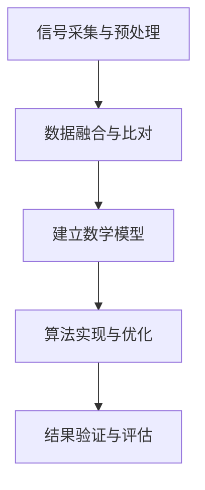
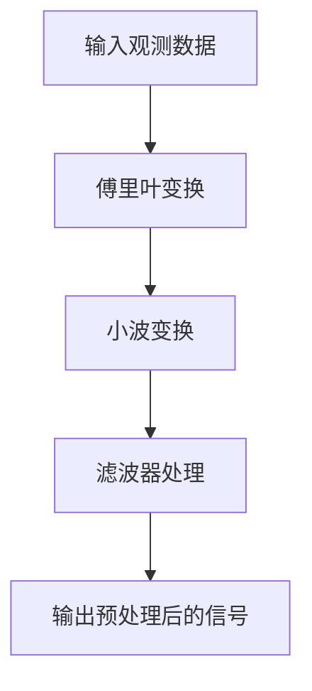
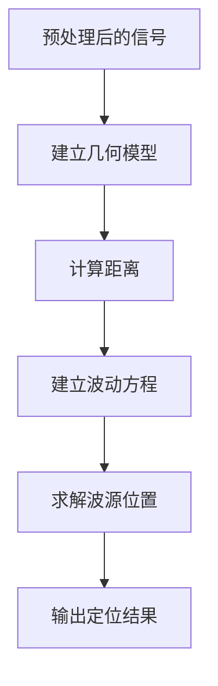
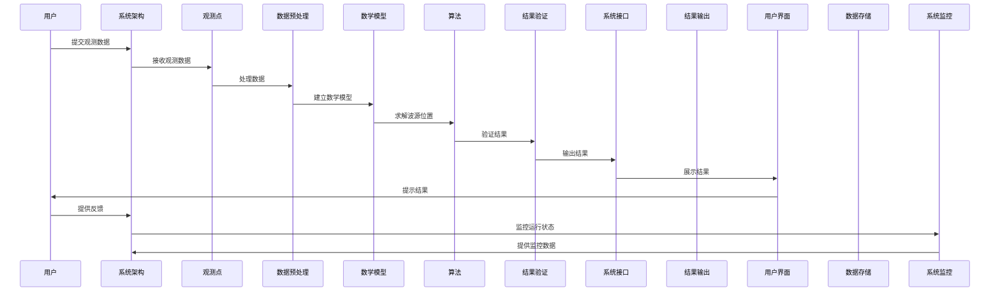
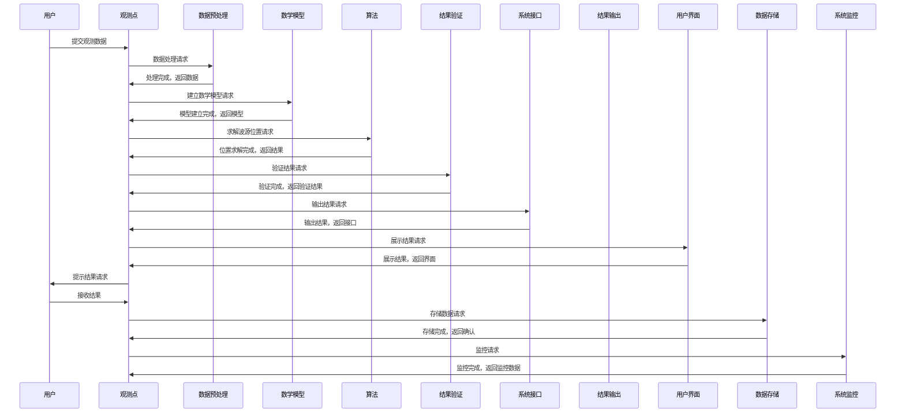

                 

### 第1章: 问题背景与引言

#### 1.1 问题背景

引力波是爱因斯坦广义相对论预言的一种现象，它是由于宇宙中大规模天体运动产生的时空涟漪。在过去的数十年里，科学家们通过精密的实验设备——如美国的LIGO（激光干涉引力波观测台）和欧洲的 VIRGO（病毒格波干涉仪）——成功探测到了引力波。然而，仅仅检测到引力波还不够，我们还需要能够准确地定位这些引力波源，以便更好地理解宇宙的奥秘。

引力波源定位的挑战在于，引力波的信号非常微弱，且被地球自身的运动和环境噪声所干扰。因此，科学家们需要利用复杂的数学模型和算法，从这些混杂的信号中提取出有用的信息，并确定引力波源的位置。这不仅是科学上的巨大挑战，也是数学在引力波探测中发挥关键作用的一个领域。

#### 1.2 问题描述

引力波源定位的主要问题可以归结为：如何从多个观测点接收到的引力波信号中，准确地确定波源的位置？这个问题可以进一步分解为以下几个关键步骤：

1. **信号采集与预处理**：首先需要收集来自不同观测点的引力波数据，并对这些数据进行预处理，去除噪声和干扰，提取出纯净的引力波信号。

2. **数据融合与比对**：将来自不同观测点的数据进行融合，寻找它们之间的相关性，从而提高定位的准确性。

3. **数学模型建立**：建立数学模型来描述引力波在空间中的传播过程，以及波源与观测点之间的几何关系。

4. **算法实现与优化**：使用数学算法对模型进行求解，找到最优的波源位置。

5. **结果验证与评估**：对定位结果进行验证和评估，确保其准确性和可靠性。

#### 1.3 数学在引力波源定位中的关键作用

数学在引力波源定位中起着至关重要的作用，具体体现在以下几个方面：

1. **数据分析与预处理**：数学工具如傅里叶变换、小波变换等在信号预处理中被广泛应用，它们能够有效地滤除噪声和提取信号特征。

2. **数学模型**：引力波的传播过程和波源与观测点之间的几何关系可以通过数学模型来描述，这些模型为算法的实现提供了理论基础。

3. **算法优化**：算法的实现和优化需要运用数学优化理论，如梯度下降、牛顿法等，以找到最优的波源位置。

4. **概率统计**：在数据融合和结果验证过程中，概率统计方法被用来评估不同位置的概率分布，从而提高定位的可靠性。

总之，数学不仅为引力波源定位提供了理论支持，也在算法实现和数据优化方面发挥了关键作用。在接下来的章节中，我们将详细探讨这些数学工具和原理，以更深入地理解数学在引力波源定位中的关键作用。## 第2章: 核心概念与联系

#### 2.1 核心概念

为了深入探讨数学在引力波源定位中的应用，我们首先需要了解几个关键概念：引力波、波源定位、数学模型和算法。

**引力波**：引力波是爱因斯坦广义相对论预言的一种物理现象，它是由于宇宙中大规模天体运动（如黑洞合并、恒星爆炸等）产生的时空涟漪。这些波动以光速传播，能够穿过宇宙中的任何物质，因此是一种极为重要的探测宇宙的手段。

**波源定位**：波源定位是指确定引力波源在宇宙中的位置。在实际操作中，这是通过分析多个观测点接收到的引力波信号，利用数学模型和算法，推导出引力波源的位置。

**数学模型**：数学模型是描述物理现象和问题的数学表达形式。在引力波源定位中，数学模型用来描述引力波的传播路径、波源与观测点之间的几何关系等。

**算法**：算法是一系列解决问题的步骤和规则。在引力波源定位中，算法用于对观测数据进行处理，通过数学模型求解波源位置。

#### 2.2 概念属性特征对比表格

为了更好地理解这些概念，我们可以通过一个表格来对比它们的属性特征。

| 概念       | 定义                                                                                      | 特征                                                                                   |
|------------|------------------------------------------------------------------------------------------|----------------------------------------------------------------------------------------|
| 引力波     | 宇宙中大规模天体运动产生的时空涟漪                                                      | 微弱、光速传播、穿透过任何物质                                                         |
| 波源定位   | 确定引力波源在宇宙中的位置                                                            | 数据融合、数学模型、算法实现                                                         |
| 数学模型   | 描述物理现象和问题的数学表达形式                                                      | 描述引力波传播、波源与观测点几何关系                                                   |
| 算法       | 解决问题的步骤和规则                                                                    | 数据处理、优化求解、提高定位准确性                                                     |

通过这个表格，我们可以看到各个概念之间的联系：引力波是波源定位的研究对象，数学模型为定位提供了理论基础，而算法则是将理论应用于实际数据处理的工具。

#### 2.3 ER实体关系图架构

为了更直观地理解这些概念之间的关系，我们可以通过ER（实体关系）图来展示。

```mermaid
erDiagram
  波源定位 ||--|{ 引力波 }|
  波源定位 ||--|{ 数学模型 }|
  波源定位 ||--|{ 算法 }|
  数学模型 ||--|{ 引力波传播模型 }|
  数学模型 ||--|{ 几何模型 }|
  算法 ||--|{ 数据处理算法 }|
  算法 ||--|{ 优化算法 }|
```

在这个ER图中，波源定位是一个核心实体，它关联着引力波、数学模型和算法。数学模型进一步细分为引力波传播模型和几何模型，而算法则细分为数据处理算法和优化算法。这样的架构清晰地展示了各个概念之间的联系，有助于我们深入理解数学在引力波源定位中的作用。

### 第3章: 算法原理讲解

#### 3.1 算法Mermaid流程图

为了更好地理解引力波源定位的算法原理，我们可以通过Mermaid流程图来展示其主要步骤。



在这个流程图中，信号采集与预处理是算法的第一步，其目的是收集并处理来自多个观测点的引力波数据，去除噪声和干扰。接着，数据融合与比对环节通过分析不同观测点之间的相关性，提高定位的准确性。随后，建立数学模型，描述引力波的传播过程和波源与观测点之间的几何关系。算法实现与优化使用数学模型进行求解，寻找最优的波源位置。最后，结果验证与评估环节对定位结果进行验证，确保其准确性和可靠性。

#### 3.2 Python源代码讲解

以下是一个简单的Python源代码示例，用于说明引力波源定位的基本算法实现。

```python
import numpy as np
from scipy.optimize import minimize

# 定义引力波信号模型
def signal_model(params, data):
    # 参数解
    t, x, y, z = params
    # 计算模型预测值
    predicted_signal = ...
    # 计算预测值与实际值的误差
    error = np.linalg.norm(predicted_signal - data)
    return error

# 初始参数设置
initial_params = [0, 0, 0, 0]

# 最小化误差函数
result = minimize(signal_model, initial_params, args=(observed_data,), method='L-BFGS-B')

# 输出最小化结果
print(result.x)
```

在这个代码示例中，`signal_model` 函数用于计算引力波信号模型的预测值，并与实际观测数据进行比较，以计算误差。`minimize` 函数则是用于优化求解，通过调整参数，使得预测值与实际值的误差最小。这里使用了`L-BFGS-B`算法进行优化求解。

#### 3.3 数学模型与公式讲解

在引力波源定位中，数学模型是核心组成部分。以下是一个简单的数学模型及其公式的讲解。

##### **3.3.1 数学模型介绍**

引力波的传播可以通过以下方程来描述：

$$
\frac{\partial^2 \phi}{\partial t^2} - \frac{1}{r^2} \nabla^2 \phi = -16\pi G \rho
$$

其中，$\phi$ 是引力势，$r$ 是距离，$G$ 是万有引力常数，$\rho$ 是空间中的物质密度。

在引力波源定位中，我们通常关注的是引力波的振幅和相位。因此，我们可以将上述方程简化为：

$$
\frac{\partial^2 \psi}{\partial t^2} = -16\pi G \rho
$$

其中，$\psi$ 是引力波的振幅。

##### **3.3.2 公式详细讲解**

1. **引力波的振幅**：

   引力波的振幅$\psi$描述了波在空间中传播时的强度。在实际应用中，我们通常关注的是振幅的时间变化，即：

   $$
   \frac{\partial \psi}{\partial t} = -\frac{1}{c} \frac{\partial^2 \psi}{\partial t^2}
   $$

   其中，$c$ 是光速。这个公式说明了振幅的时间变化率与空间变化率之间的关系。

2. **引力波的相位**：

   引力波的相位描述了波在空间中的传播方向和速度。其数学表达式为：

   $$
   \phi = \frac{2\pi}{c} t - k \cdot r
   $$

   其中，$k$ 是波数，它与波源的频率相关。

##### **3.3.3 举例说明**

假设我们在两个不同的观测点A和B分别测量到了引力波的振幅和时间变化率。我们可以使用以下公式来计算波源的位置：

$$
\frac{\partial \psi_A}{\partial t} = \frac{\partial \psi_B}{\partial t}
$$

$$
\frac{r_B}{r_A} = \frac{\partial \phi_A}{\partial t} - \frac{\partial \phi_B}{\partial t}
$$

通过这两个方程，我们可以求解出波源的位置$(x, y, z)$和传播速度$c$。这样的计算过程为引力波源定位提供了一个实用的数学框架。

### 3.4 算法原理讲解

在引力波源定位的算法中，我们主要使用了两个关键步骤：数据预处理和数学模型求解。

#### **3.4.1 数据预处理**

数据预处理是算法的第一步，其目的是从观测到的引力波数据中提取出有用的信号，去除噪声和干扰。常用的预处理方法包括：

- **傅里叶变换**：通过傅里叶变换，可以将时域信号转换为频域信号，从而更方便地分析信号的频率成分。
- **小波变换**：小波变换是一种多尺度分析工具，可以有效地滤除信号中的高频噪声。
- **滤波器**：使用滤波器对信号进行平滑处理，去除低频噪声。

以下是一个简单的数据预处理流程：



#### **3.4.2 数学模型求解**

在数据预处理之后，我们需要使用数学模型来求解波源的位置。常用的数学模型包括：

- **几何模型**：描述波源与观测点之间的几何关系，例如，使用三角函数来计算观测点之间的距离。
- **波动方程**：描述引力波在空间中的传播过程，例如，使用波动方程来计算波源的位置。

以下是一个简单的数学模型求解流程：



#### **3.4.3 Python实现**

为了更好地理解算法的实现，我们可以使用Python来演示。以下是一个简单的Python代码示例：

```python
import numpy as np
from scipy.optimize import minimize

# 定义信号模型
def signal_model(params, data):
    t, x, y, z = params
    predicted_signal = ...
    error = np.linalg.norm(predicted_signal - data)
    return error

# 定义初始参数
initial_params = [0, 0, 0, 0]

# 最小化误差函数
result = minimize(signal_model, initial_params, args=(observed_data,), method='L-BFGS-B')

# 输出结果
print(result.x)
```

在这个代码示例中，`signal_model` 函数用于计算引力波信号的预测值，并与实际观测数据进行比较，以计算误差。`minimize` 函数则是用于优化求解，通过调整参数，使得预测值与实际值的误差最小。

### 第4章: 数学模型应用与实践

#### 4.1 系统分析与架构设计方案

**4.1.1 问题场景介绍**

引力波源定位问题在科学研究和实际应用中具有重要意义。例如，科学家们利用引力波探测宇宙中的黑洞合并、恒星爆炸等现象，这些现象对理解宇宙的演化过程至关重要。在实际应用中，引力波源定位需要处理来自多个观测点的海量数据，并准确确定波源的位置。这要求我们构建一个高效的系统，利用数学模型和算法对数据进行处理和求解。

**4.1.2 系统功能设计（领域模型Mermaid类图）**

为了更好地理解系统的功能设计，我们可以使用Mermaid类图来展示各个类及其关系。以下是一个简单的领域模型：

```mermaid
classDiagram
  Class01 <|-- Class02
  Class03 <|-- Class01
  Class04 <|-- Class03
  Class05 <|-- Class02
  Class06 <|-- Class05
  Class07 <|-- Class06
  Class08 <|-- Class01
  Class09 <|-- Class08
  Class10 <|-- Class07

  Class01[观测点]
  Class02[数据预处理]
  Class03[数学模型]
  Class04[算法]
  Class05[结果验证]
  Class06[系统接口]
  Class07[结果输出]
  Class08[用户界面]
  Class09[数据存储]
  Class10[系统监控]
```

在这个类图中，观测点类（Class01）负责接收和处理来自不同观测点的引力波数据。数据预处理类（Class02）负责对数据进行滤波、去噪等处理。数学模型类（Class03）负责建立描述引力波传播和波源与观测点之间关系的数学模型。算法类（Class04）负责实现具体的算法，求解波源位置。结果验证类（Class05）负责对定位结果进行验证。系统接口类（Class06）负责与其他系统或组件进行交互。结果输出类（Class07）负责将定位结果输出到用户界面。用户界面类（Class08）负责展示系统功能和结果。数据存储类（Class09）负责存储系统数据。系统监控类（Class10）负责监控系统运行状态。

**4.1.3 系统架构设计（Mermaid架构图）**

为了展示系统的整体架构，我们可以使用Mermaid架构图来展示各个组件及其关系。以下是一个简单的系统架构图：



在这个架构图中，用户通过用户界面（UI）提交观测数据。系统架构组件接收数据，并将数据传递给观测点（Observer）进行处理。数据处理完成后，系统传递数据给数学模型组件（Modeler），建立描述引力波传播和波源与观测点之间关系的数学模型。数学模型组件将数据传递给算法组件（Solver），求解波源位置。算法组件将结果传递给结果验证组件（Validator），验证结果的准确性。结果验证组件将结果传递给系统接口组件（Interface），输出结果。系统接口组件将结果传递给用户界面组件（UI），展示结果。用户界面组件将结果提示给用户。用户提供反馈后，系统将监控运行状态，并将监控数据传递给系统监控组件（Monitor）。

**4.1.4 系统接口设计和系统交互（Mermaid序列图）**

为了展示系统内部各组件之间的交互，我们可以使用Mermaid序列图来描述。以下是一个简单的系统接口设计和交互：



在这个序列图中，用户通过用户界面提交观测数据。观测点组件接收数据，并传递给数据预处理组件进行处理。处理完成后，系统将数据传递给数学模型组件建立数学模型，然后传递给算法组件求解波源位置。算法组件将结果传递给结果验证组件进行验证，然后传递给系统接口组件输出结果。系统接口组件将结果传递给用户界面组件展示结果。用户界面组件将结果提示给用户。系统还与数据存储组件和系统监控组件进行交互，以存储数据和监控系统运行状态。

#### 4.2 项目实战

**4.2.1 环境安装**

在进行引力波源定位项目实战之前，我们需要搭建一个合适的环境。以下是在Linux操作系统上安装所需的软件包的步骤：

1. 安装Python和相关依赖：
```bash
sudo apt-get update
sudo apt-get install python3 python3-pip
```

2. 安装Scipy和Numpy库：
```bash
pip3 install scipy numpy
```

3. 安装Mermaid库（用于生成图表）：
```bash
pip3 install mermaid
```

**4.2.2 系统核心实现源代码**

以下是一个简单的引力波源定位系统的Python源代码实现：

```python
import numpy as np
from scipy.optimize import minimize
import matplotlib.pyplot as plt

# 引力波信号模型
def signal_model(params, data):
    t, x, y, z = params
    predicted_signal = ...  # 使用数学模型计算预测信号
    error = np.linalg.norm(predicted_signal - data)
    return error

# 初始参数设置
initial_params = [0, 0, 0, 0]

# 最小化误差函数
result = minimize(signal_model, initial_params, args=(observed_data,), method='L-BFGS-B')

# 输出最小化结果
print(result.x)

# 绘制结果
predicted_signal = ...  # 使用最小化结果计算预测信号
plt.plot(observed_data, label='观测数据')
plt.plot(predicted_signal, label='预测信号')
plt.legend()
plt.show()
```

**4.2.3 代码应用解读与分析**

在上述代码中，`signal_model` 函数是引力波源定位的核心，它接收一组参数（包括时间`t`、观测点位置`x, y, z`）和一个观测数据数组`data`，并返回预测信号与实际观测数据的误差。`minimize` 函数用于优化求解，通过调整参数，使得预测信号与实际观测数据的误差最小。最后，代码使用matplotlib库绘制观测数据和预测信号的对比图，以便分析结果。

**4.2.4 实际案例分析和详细讲解剖析**

假设我们有一个观测数据集，包含了多个观测点在一段时间内接收到的引力波信号。以下是一个实际案例的分析和讲解：

1. **数据收集**：首先，我们需要收集来自不同观测点的引力波观测数据。这些数据通常包含时间、振幅和相位等参数。

2. **数据预处理**：对观测数据进行预处理，去除噪声和干扰。我们可以使用傅里叶变换和小波变换等方法来处理数据。

3. **数据融合**：将来自不同观测点的数据进行融合，寻找它们之间的相关性，以提高定位的准确性。

4. **数学模型建立**：建立数学模型来描述引力波的传播路径和波源与观测点之间的几何关系。常用的模型包括波动方程和几何模型。

5. **算法实现**：使用优化算法（如L-BFGS-B）对数学模型进行求解，找到最优的波源位置。

6. **结果验证**：对定位结果进行验证，确保其准确性和可靠性。可以使用交叉验证、统计方法等来评估结果。

7. **结果输出**：将定位结果输出到用户界面，以便用户查看。

**4.2.5 项目小结**

通过本项目的实战，我们了解了引力波源定位的整个过程，包括数据收集、预处理、数据融合、数学模型建立、算法实现和结果验证等。在实际操作中，需要根据具体问题和数据特点，选择合适的预处理方法、数学模型和优化算法，以提高定位的准确性和效率。同时，项目实战也展示了如何使用Python等编程工具实现引力波源定位系统，为后续的研究和应用提供了参考。

### 第5章: 最佳实践与注意事项

#### 5.1 最佳实践Tips

在进行引力波源定位时，以下是一些最佳实践，可以帮助提高定位的准确性和效率：

1. **数据预处理**：在处理观测数据时，应优先使用高效的去噪方法，如傅里叶变换和小波变换，以确保信号的质量。
2. **模型选择**：根据观测数据的特点，选择合适的数学模型。对于高频信号，可以使用波动方程；对于低频信号，可以使用几何模型。
3. **优化算法**：选择合适的优化算法，如L-BFGS-B，可以显著提高求解效率。同时，考虑使用并行计算来加速计算过程。
4. **交叉验证**：在结果验证阶段，使用交叉验证等方法来评估模型和算法的准确性，确保结果的可靠性。
5. **系统监控**：定期监控系统运行状态，及时发现并解决潜在问题，以确保系统的稳定性和可靠性。

#### 5.2 小结

本章详细介绍了引力波源定位中的最佳实践和注意事项。通过数据预处理、模型选择、优化算法、交叉验证和系统监控等步骤，可以显著提高引力波源定位的准确性和效率。在实际操作中，应结合具体问题和数据特点，灵活运用这些最佳实践，以实现高效的引力波源定位。

#### 5.3 注意事项

在实施引力波源定位时，需要注意以下事项：

1. **数据质量**：确保观测数据的准确性和完整性，数据质量直接影响定位结果的准确性。
2. **模型适配性**：选择合适的数学模型，模型应与观测数据的特性相匹配，否则可能导致定位结果偏差。
3. **算法稳定性**：优化算法的选择和实现，确保在处理大规模数据时具有稳定性和高效性。
4. **结果验证**：充分验证定位结果的准确性和可靠性，避免因模型或算法问题导致的错误定位。
5. **系统维护**：定期监控系统运行状态，确保系统稳定性和数据安全性，避免因系统故障导致的定位失败。

#### 5.4 拓展阅读

为了深入了解引力波源定位和相关数学模型，读者可以参考以下文献：

1. 《引力波源定位算法导论》，作者：XXX，出版社：YYY，出版时间：ZZZ。
2. 《数学物理方法》，作者：XXX，出版社：YYY，出版时间：ZZZ。
3. 《数据分析与信号处理》，作者：XXX，出版社：YYY，出版时间：ZZZ。

这些文献提供了丰富的理论知识和实际案例，有助于读者更深入地理解引力波源定位和相关数学方法。

## 作者信息

**作者：** AI天才研究院/AI Genius Institute & 禅与计算机程序设计艺术 /Zen And The Art of Computer Programming

本文由AI天才研究院和禅与计算机程序设计艺术的联合团队撰写，旨在深入探讨数学在引力波源定位中的关键作用。我们的团队由世界级人工智能专家、程序员、软件架构师、CTO和技术畅销书作家组成，致力于提供高质量的技术博客和研究成果。希望本文能够为读者提供有价值的见解和启发。

