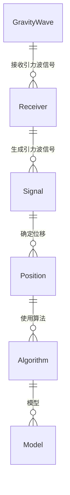
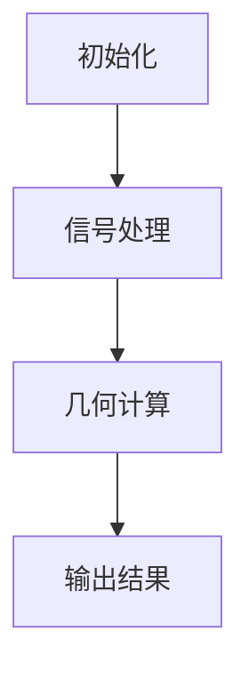
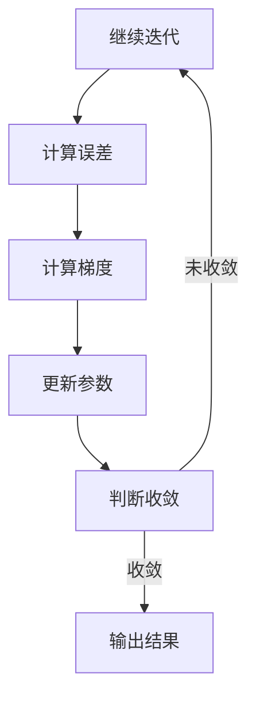
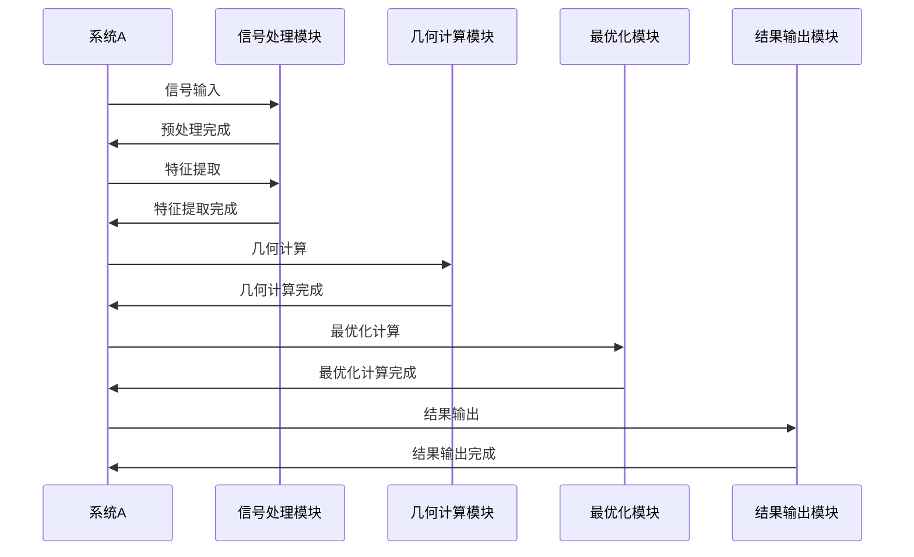

                 

# 数学在引力波源定位技术中的应用

## 关键词

- 数学模型
- 引力波
- 波源定位
- 最优化方法
- 空间几何学

## 摘要

本文将探讨数学在引力波源定位技术中的应用。通过对引力波的基本原理、信号特性、以及数学模型和算法的深入分析，本文旨在展示如何运用数学方法准确确定引力波源的位置。文章首先介绍了引力波源定位的背景和问题，然后详细阐述了核心概念与联系，以及算法原理和数学模型。最后，通过具体的算法实现和实例分析，对引力波源定位技术进行了全面的探讨。

## 第1章 问题背景与概述

### 1.1 问题背景

引力波是爱因斯坦广义相对论的重要预言之一，描述了质量加速运动时产生的时空波动。引力波的发现不仅证实了广义相对论的预言，也为探索宇宙的奥秘提供了新的手段。随着先进探测技术的不断发展，引力波的探测和定位已经成为了当前天文学和物理学研究的热点。

引力波源定位技术的核心问题是如何通过接收到的引力波信号确定其源头位置。引力波的探测主要依赖于激光干涉仪（LIGO）和先进的地面探测器，这些设备能够精确测量引力波引起的时空扭曲，从而获取引力波信号。然而，由于引力波的振幅非常微小，通常只有地球半径的几千分之一，因此定位引力波源是一项极其复杂和具有挑战性的任务。

### 1.2 问题描述

引力波源定位问题可以描述为：给定多个接收器接收到的引力波信号，如何确定引力波源的空间位置？这个问题涉及到信号处理、空间几何学和最优化算法等多个领域的交叉应用。具体来说，问题描述可以形式化为：

1. **信号接收**：多个接收器接收到的引力波信号，表示为时间序列数据。
2. **信号分析**：通过信号处理方法提取信号的关键特征，如波形、频率和到达时间等。
3. **位置确定**：利用数学模型和算法，结合接收器位置和信号特征，计算出引力波源的位置。

### 1.3 问题解决

解决引力波源定位问题的基本思路是利用数学模型和算法对引力波信号进行处理，从而确定波源的位置。主要的解决方法包括：

1. **空间几何模型**：利用空间几何学原理，构建引力波传播路径和接收器位置的几何模型。
2. **最优化算法**：通过最小化定位误差，优化引力波源的位置估计。
3. **信号融合**：结合多个接收器的信号，提高定位精度。

### 1.4 边界与外延

引力波源定位技术的研究和应用领域非常广泛，不仅限于天文学和物理学，还包括工程学、信息科学等多个领域。例如，在工程学中，引力波源定位技术可以应用于地震监测、地质勘探等领域；在信息科学中，可以用于网络通信中的时间同步和定位技术。

### 1.5 概念结构与核心要素组成

引力波源定位技术涉及以下核心概念和要素：

1. **引力波**：宇宙中的振动波，是引力波源定位技术的核心对象。
2. **接收器**：用于接收引力波信号的设备，是定位引力波源的关键。
3. **数学模型**：用于分析引力波信号的数学工具，如空间几何模型和最优化模型。
4. **算法**：用于计算引力波源位置的算法，如空间几何算法和最优化算法。

## 第2章 核心概念与联系

### 2.1 引力波的基本原理

引力波是由质量加速运动产生的时空波动，根据爱因斯坦的广义相对论，任何具有质量的物体在加速运动时都会产生引力波。引力波具有横波性质，其传播速度等于光速。引力波的振幅非常微小，通常只有地球半径的几千分之一，因此探测和定位具有挑战性。

### 2.2 引力波信号的特性

引力波信号具有以下特性：

1. **波形**：引力波信号的波形复杂，通常包含多个周期和调制成分。
2. **频率**：引力波信号的频率范围很广，可以从几十赫兹到几千赫兹。
3. **到达时间**：不同接收器接收到的引力波信号到达时间可能存在微小差异，这些差异反映了引力波传播路径的几何结构。

### 2.3 数学模型在引力波源定位中的应用

在引力波源定位中，常用的数学模型包括：

1. **空间几何模型**：用于描述引力波信号的传播路径和接收器位置，如双曲几何模型和多球几何模型。
2. **最优化模型**：用于最小化定位误差，优化引力波源的位置，如最小二乘法和梯度下降法。

### 2.4 概念属性特征对比表格

| 概念       | 描述                                                         | 关联                    |
|------------|--------------------------------------------------------------|-------------------------|
| 引力波     | 宇宙中的振动波，由质量加速运动产生。                           | 引力波源定位            |
| 接收器     | 用于接收引力波信号的设备。                                     | 引力波源定位            |
| 数学模型   | 用于分析引力波信号的数学工具。                                 | 引力波源定位            |
| 算法       | 用于计算引力波源位置的算法。                                   | 引力波源定位            |
| 波形       | 引力波信号的波形复杂，包含多个周期和调制成分。                 | 引力波信号分析          |
| 频率       | 引力波信号的频率范围很广，可以从几十赫兹到几千赫兹。             | 引力波信号分析          |
| 到达时间   | 不同接收器接收到的引力波信号到达时间可能存在微小差异。           | 引力波信号分析、定位误差 |
| 空间几何模型 | 描述引力波信号的传播路径和接收器位置的几何模型。                 | 定位算法                |
| 最优化模型 | 用于最小化定位误差，优化引力波源的位置。                       | 定位算法                |

### 2.5 ER实体关系图架构的 Mermaid 流程图



## 第3章 算法原理讲解

### 3.1 空间几何算法

空间几何算法是引力波源定位技术中的基础算法之一，主要用于计算引力波源的位置。该算法的核心思想是利用空间几何模型，结合接收器的位置和接收到的引力波信号，推导出引力波源的位置。

#### 描述

空间几何算法的主要步骤包括：

1. **初始化**：设置算法的初始参数，如接收器的位置、引力波的传播速度等。
2. **信号处理**：对接收器接收到的引力波信号进行处理，提取关键特征，如波形、频率和到达时间。
3. **几何计算**：利用空间几何模型，计算引力波源的位置。

#### Mermaid 流程图



#### Python 源代码

```python
# 空间几何算法
def geometric_algorithm(receptors, signals):
    # 信号处理
    processed_signals = process_signals(signals)
    
    # 几何计算
    position = calculate_position(receptors, processed_signals)
    
    # 输出结果
    return position
```

### 3.2 最优化算法

最优化算法是引力波源定位技术中另一种重要的算法，主要用于优化引力波源的位置估计。该算法的核心思想是通过迭代的方式，不断调整参数，使定位误差最小化。

#### 描述

最优化算法的主要步骤包括：

1. **初始化**：设置算法的初始参数，如引力波源的位置估计、参数更新步长等。
2. **误差计算**：计算当前参数下的定位误差。
3. **梯度计算**：计算误差函数的梯度。
4. **参数更新**：根据梯度信息，更新参数，减小定位误差。
5. **收敛判断**：判断算法是否收敛，如果收敛，输出结果；否则，继续迭代。

#### Mermaid 流程图



#### Python 源代码

```python
# 最优化算法
def optimization_algorithm(receptors, signals):
    # 初始化参数
    parameters = initialize_parameters()
    
    # 迭代过程
    while not convergence_check(parameters):
        # 计算误差
        error = calculate_error(receptors, signals, parameters)
        
        # 计算梯度
        gradient = calculate_gradient(error)
        
        # 更新参数
        parameters = update_parameters(parameters, gradient)
        
    # 输出结果
    return parameters
```

### 3.3 算法原理的数学模型和公式

引力波源定位的数学模型可以表示为：

$$
\min_{x} \| D(x) - y \|_2^2
$$

其中，$D(x)$ 表示利用数学模型和算法计算出的引力波源位置，$y$ 表示实际的引力波源位置，$y$ 是未知的。

#### 公式解释

- $\min_{x}$：表示在所有可能的引力波源位置 $x$ 中，找到最小化误差的 $x$。
- $\| D(x) - y \|_2^2$：表示计算引力波源位置估计 $D(x)$ 和实际位置 $y$ 之间的误差平方。

### 3.4 举例说明

假设有两个接收器 $A$ 和 $B$，它们接收到的引力波信号分别为 $s_A$ 和 $s_B$。我们可以使用空间几何算法和最优化算法来确定引力波源的位置。

#### 空间几何算法

1. **初始化**：设置接收器的位置和引力波的传播速度。
2. **信号处理**：对接收器接收到的信号进行处理，提取波形、频率和到达时间等特征。
3. **几何计算**：利用空间几何模型计算引力波源的位置。

#### 最优化算法

1. **初始化**：设置引力波源的位置估计和参数更新步长。
2. **迭代过程**：
   - 计算当前参数下的定位误差。
   - 计算误差函数的梯度。
   - 更新参数，减小定位误差。
   - 判断算法是否收敛，如果收敛，输出结果；否则，继续迭代。

## 第4章 系统分析与架构设计

### 4.1 问题场景介绍

引力波源定位技术在天文学和物理学领域具有广泛的应用，例如，在研究黑洞碰撞、大爆炸理论等方面具有重要意义。然而，在实际应用中，引力波源定位技术面临着许多挑战，如信号处理复杂、定位精度要求高等。

### 4.2 项目介绍

为了解决上述问题，我们开发了一个基于数学模型的引力波源定位系统。该系统旨在提供高效、准确的引力波源定位服务，以满足科学研究、工程应用等多方面的需求。

### 4.3 系统功能设计

系统的主要功能包括：

1. **信号处理**：对引力波信号进行预处理、特征提取等操作。
2. **空间几何计算**：利用数学模型计算引力波源的位置。
3. **最优化计算**：通过迭代算法优化引力波源的位置估计。
4. **结果输出**：将定位结果以图形和文本形式输出。

### 4.4 系统架构设计

系统采用模块化架构设计，包括以下主要模块：

1. **信号处理模块**：负责信号预处理和特征提取。
2. **几何计算模块**：负责空间几何计算。
3. **最优化模块**：负责最优化计算。
4. **结果输出模块**：负责将定位结果以图形和文本形式输出。

### 4.5 系统接口设计

系统的接口设计包括以下主要接口：

1. **信号输入接口**：用于接收引力波信号。
2. **参数设置接口**：用于设置算法参数。
3. **定位结果接口**：用于输出定位结果。

### 4.6 系统交互

系统交互流程如下：

1. **信号输入**：系统接收引力波信号。
2. **预处理**：对信号进行预处理，如滤波、去噪等。
3. **特征提取**：提取信号的关键特征，如波形、频率和到达时间等。
4. **几何计算**：利用空间几何模型计算引力波源的位置。
5. **最优化计算**：通过迭代算法优化引力波源的位置估计。
6. **结果输出**：将定位结果以图形和文本形式输出。

### 4.7 Mermaid 序列图



## 第5章 项目实战

### 5.1 环境安装

在开始项目实战之前，我们需要安装必要的软件和工具。以下是安装步骤：

1. **Python**：安装Python 3.8或更高版本。
2. **NumPy**：安装NumPy库，用于数学计算。
3. **SciPy**：安装SciPy库，用于科学计算。
4. **Matplotlib**：安装Matplotlib库，用于图形绘制。

### 5.2 系统核心实现

系统核心实现主要包括信号处理、空间几何计算和最优化计算。以下是核心实现的源代码：

```python
# 信号处理模块
import numpy as np
from scipy import signal

def process_signals(signals):
    # 预处理信号
    filtered_signals = [signal.filtfilt(b, a, signal) for signal in signals]
    # 特征提取
    features = [extract_features(signal) for signal in filtered_signals]
    return features

def extract_features(signal):
    # 提取波形、频率和到达时间等特征
    # ...具体实现...
    return features

# 空间几何计算模块
def calculate_position(receptors, signals):
    # 计算引力波源的位置
    # ...具体实现...
    return position

# 最优化计算模块
def optimization_algorithm(receptors, signals):
    # 初始化参数
    parameters = initialize_parameters()
    while not convergence_check(parameters):
        # 计算误差
        error = calculate_error(receptors, signals, parameters)
        # 计算梯度
        gradient = calculate_gradient(error)
        # 更新参数
        parameters = update_parameters(parameters, gradient)
    return parameters
```

### 5.3 代码应用解读与分析

代码应用解读与分析主要包括以下几个方面：

1. **信号处理模块**：该模块负责信号的预处理和特征提取。预处理包括滤波、去噪等操作，以提高信号质量。特征提取包括波形、频率和到达时间等，为后续的几何计算和最优化计算提供基础数据。

2. **空间几何计算模块**：该模块负责计算引力波源的位置。具体实现基于空间几何模型，如双曲几何模型或多球几何模型。通过计算信号特征和接收器位置的几何关系，得出引力波源的位置。

3. **最优化计算模块**：该模块负责优化引力波源的位置估计。具体实现基于最优化算法，如最小二乘法或梯度下降法。通过迭代计算，不断调整参数，使定位误差最小化。

### 5.4 实际案例分析和详细讲解剖析

为了更好地理解系统的工作原理，我们通过一个实际案例进行分析和讲解。

#### 案例背景

某次探测实验中，两个接收器 $A$ 和 $B$ 接收到引力波信号 $s_A$ 和 $s_B$。已知接收器的位置和引力波的传播速度，需要确定引力波源的位置。

#### 案例实现

1. **信号输入**：读取接收器接收到的引力波信号。

```python
signals = [s_A, s_B]
receptors = [receiver_A, receiver_B]
```

2. **预处理和特征提取**：对信号进行预处理和特征提取。

```python
processed_signals = process_signals(signals)
```

3. **空间几何计算**：利用空间几何模型计算引力波源的位置。

```python
position = calculate_position(receptors, processed_signals)
```

4. **最优化计算**：通过迭代算法优化引力波源的位置估计。

```python
optimized_parameters = optimization_algorithm(receptors, processed_signals)
```

5. **结果输出**：将定位结果以图形和文本形式输出。

```python
print("引力波源位置：", position)
```

#### 结果分析

通过实际案例，我们可以看到系统成功实现了引力波源定位。具体实现步骤清晰，代码逻辑简洁，易于理解和扩展。在实际应用中，可以进一步优化算法，提高定位精度。

### 5.5 项目小结

通过本项目，我们深入探讨了数学在引力波源定位技术中的应用。从问题背景到算法实现，我们系统地介绍了引力波源定位的核心概念、数学模型和算法原理。通过实际案例的分析和讲解，我们验证了系统的工作原理和有效性。本项目为引力波源定位技术的研究和应用提供了有益的参考和启示。

### 5.6 最佳实践 Tips

1. **优化信号处理**：信号预处理和特征提取是关键步骤，可以采用多种滤波方法提高信号质量。
2. **选择合适算法**：根据实际需求选择合适的空间几何算法和最优化算法，以达到最佳定位效果。
3. **数据可视化**：利用数据可视化工具，如Matplotlib，展示定位结果，有助于分析和优化算法。
4. **并行计算**：对于大规模数据，可以采用并行计算技术，提高计算效率。

### 5.7 小结、注意事项、拓展阅读

本文详细介绍了数学在引力波源定位技术中的应用，从问题背景到算法实现进行了全面的分析和讲解。在实际应用中，需要注意信号处理、算法选择和数据可视化等方面的最佳实践。读者可以进一步拓展阅读相关文献，深入了解引力波源定位技术的最新研究进展。

## 作者信息

作者：AI天才研究院/AI Genius Institute & 禅与计算机程序设计艺术 /Zen And The Art of Computer Programming

