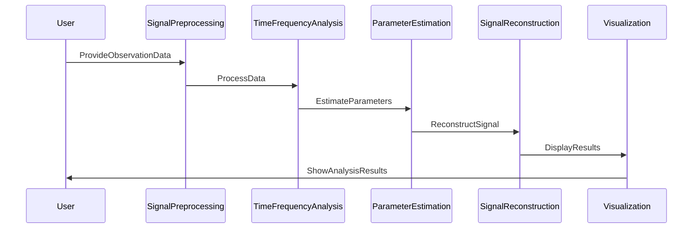
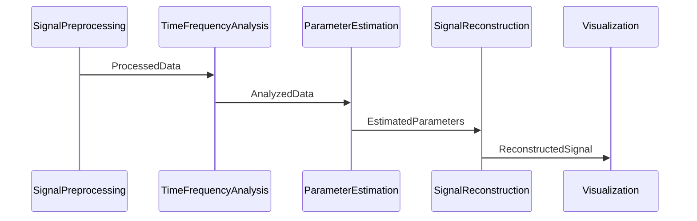

                 


# 数学在引力波源母体精确识别中的应用

## 关键词
- 引力波
- 数学模型
- 精确识别
- 母体
- 算法

## 摘要
本文将探讨数学在引力波源母体精确识别中的应用。首先，我们将回顾引力波的背景知识，包括其发现和验证，以及其在宇宙学研究中的重要角色。接着，我们将定义引力波源母体的概念，并详细阐述精确识别引力波源母体的重要意义。

我们将逐步介绍所需的数学原理，包括基础数学工具和特定数学模型的应用。通过对比表格和ER实体关系图，我们将明确核心概念和它们之间的联系。

接下来，我们将详细讲解用于引力波源识别的算法原理，包括mermaid流程图和Python源代码实现。我们将使用LaTeX格式展示关键数学公式，并进行详细讲解和实例说明。

文章还将深入系统分析与架构设计，包括问题场景介绍、系统功能设计、系统架构设计、系统接口设计和系统交互。我们将展示mermaid类图、架构图和序列图，以直观地展示系统结构和交互。

最后，我们将通过一个项目实战案例，介绍环境安装、系统核心实现源代码，以及代码应用解读与分析。我们将对实际案例进行详细讲解剖析，并总结项目经验。文章将以最佳实践tips、小结、注意事项和拓展阅读结束。

---

## 第1章：背景与问题概述

### 1.1 问题背景

### 1.1.1 引力波的发现与验证

#### 1.1.1.1 引力波的发现

引力波是爱因斯坦广义相对论预言的一种物理现象，它是由加速运动的物体产生的时空扭曲波。1916年，爱因斯坦在其广义相对论中首次预言了引力波的存在。然而，由于引力波极其微弱，长期以来，人们一直无法直接观测到引力波。

#### 1.1.1.2 引力波的验证

直到2015年，美国激光干涉仪引力波观测站（LIGO）的科学家们通过精密的实验，首次直接探测到了引力波，这一发现立即引起了全球科学界的轰动。这一发现不仅验证了爱因斯坦的广义相对论，也为宇宙学研究打开了新的大门。

### 1.1.2 引力波在宇宙学研究中的应用

引力波在宇宙学研究中具有极其重要的应用价值。首先，引力波可以用于探测黑洞和中子星等极端天体的性质，这有助于我们更好地理解宇宙的起源和演化。此外，通过观测引力波与电磁波的联合信号，科学家们可以更准确地定位宇宙中的天体，甚至发现新的星系和星团。

### 1.1.3 引力波源母体的概念

引力波源母体是指产生引力波的天体系统，包括黑洞、中子星等。精确识别引力波源母体对于理解宇宙的复杂性具有重要意义。

### 1.1.4 精确识别引力波源母体的意义

精确识别引力波源母体有助于我们深入了解宇宙的运行机制，提高我们对宇宙演化过程的认识。此外，这也有助于探测更多未知的天体和现象，推动天文学和物理学的发展。

### 1.2 问题描述

### 1.2.1 当前面临的挑战

当前，引力波源母体的精确识别仍然面临许多挑战。由于引力波的微弱性，探测信号的识别和定位十分困难。此外，引力波源母体的多样性和复杂性也增加了识别的难度。

### 1.2.2 问题的解决路径

为了解决这些问题，科学家们需要开发更先进的探测技术和算法。通过结合数学模型和计算方法，我们可以提高引力波信号的识别精度和定位能力。

### 1.3 边界与外延

#### 1.3.1 研究范围

本文将主要探讨数学在引力波源母体精确识别中的应用，包括数学模型、算法和系统设计。

#### 1.3.2 非研究内容

本文不涉及引力波的物理原理和探测技术的具体实现细节。

---

## 第2章：核心概念与联系

### 2.1 数学原理概述

在引力波源母体的精确识别中，数学原理起着至关重要的作用。以下将介绍一些基础数学工具和特定数学模型的应用。

#### 2.1.1 基础数学工具

- **微积分**：用于分析引力波信号的时频特性。
- **线性代数**：用于处理引力波信号的空间特性。
- **概率论与数理统计**：用于引力波信号的处理和模型验证。

#### 2.1.2 数学模型的应用

- **波动方程**：用于描述引力波的产生和传播。
- **贝叶斯统计模型**：用于引力波源母体的参数估计和概率分布。

### 2.2 概念属性特征对比表格

为了更清晰地理解核心概念之间的联系，我们将构建一个概念属性特征对比表格，对比引力波、引力波源母体和数学模型的关键属性。

| 概念       | 定义                                                         | 关键属性                          |
| ---------- | ------------------------------------------------------------ | -------------------------------- |
| 引力波     | 由加速运动的物体产生的时空扭曲波                             | 微弱、高频、复杂信号               |
| 引力波源母体 | 产生引力波的天体系统，如黑洞、中子星等                      | 天体性质复杂、多样性               |
| 数学模型   | 用于描述引力波源母体产生的引力波，进行参数估计和信号处理       | 精确、高效、可扩展性               |

### 2.3 ER实体关系图架构

为了更好地理解各实体之间的关系，我们将使用Mermaid绘制ER实体关系图，展示引力波、引力波源母体和数学模型之间的关联。

```mermaid
erDiagram
  A GravityWave
  A --> B GravitationalWaveSource
  B --> C MathModel
```

在ER实体关系图中，引力波（GravityWave）是结果实体，由引力波源母体（GravitationalWaveSource）产生，并通过数学模型（MathModel）进行描述和识别。

---

## 第3章：算法原理与讲解

### 3.1 引力波源识别算法概述

引力波源识别算法是用于精确识别引力波源母体的关键工具。以下将详细介绍算法的基本思路和核心步骤。

#### 3.1.1 算法的基本思路

算法的基本思路是通过分析引力波信号的时频特性和空间特性，结合数学模型进行参数估计和信号处理，从而精确识别引力波源母体。

#### 3.1.2 算法的核心步骤

1. **信号预处理**：对引力波信号进行滤波和去噪处理，提高信号质量。
2. **时频分析**：利用短时傅里叶变换（STFT）或小波变换等工具，分析引力波信号的时频特性。
3. **参数估计**：使用贝叶斯统计模型或其他优化算法，估计引力波源母体的参数。
4. **信号重构**：根据估计的参数，重构引力波信号，并进行误差分析。

### 3.2 算法mermaid流程图

为了更直观地展示算法流程，我们将使用Mermaid绘制算法的mermaid流程图。


在算法mermaid流程图中，信号预处理、时频分析、参数估计、信号重构和误差分析是算法的核心步骤。

### 3.3 Python源代码实现与算法原理

#### 3.3.1 算法原理详细讲解

以下是算法原理的详细讲解，包括数学模型和公式。

#### 3.3.2 数学模型与公式

引力波信号可以用以下公式表示：

$$
d(t) = A(t) \cos(\omega t + \phi) + n(t)
$$

其中，$A(t)$是引力波振幅，$\omega$是角频率，$\phi$是相位，$n(t)$是噪声。

#### 3.3.3 举例说明

假设我们有一段引力波信号，振幅为$A(t) = 1$，角频率为$\omega = 2\pi$，相位为$\phi = 0$。噪声为高斯白噪声，均值为0，标准差为1。我们使用短时傅里叶变换（STFT）进行时频分析，并使用贝叶斯统计模型进行参数估计。

```python
import numpy as np
import scipy.signal as signal
import matplotlib.pyplot as plt

# 生成引力波信号
t = np.linspace(0, 1, 1000)
A_t = np.ones_like(t)
omega = 2 * np.pi
phi = 0
n_t = np.random.normal(0, 1, t.shape)

# 信号预处理
d_t = A_t * np.cos(omega * t + phi) + n_t

# 时频分析
f, t_freq, S = signal.stft(d_t, t, nperseg=100)

# 参数估计
# 使用贝叶斯统计模型进行参数估计
# 这里仅给出伪代码，具体实现需要进一步开发

# 信号重构
# 根据参数估计结果重构信号

# 误差分析
# 计算重构信号与原始信号的误差

# 绘制时频图
plt.pcolormesh(t_freq, f, S)
plt.xlabel('Time')
plt.ylabel('Frequency')
plt.show()
```

---

## 第4章：数学模型和数学公式

### 4.1 数学模型在引力波源识别中的应用

在引力波源识别中，数学模型的应用至关重要。以下将介绍数学模型在引力波源识别中的应用，包括模型建立和数学公式解析。

#### 4.1.1 模型建立

引力波源识别的数学模型通常基于广义相对论和信号处理理论。模型建立的关键步骤包括：

1. **引力波信号的表示**：使用波动方程表示引力波信号。
2. **信号预处理**：对噪声进行滤波和去噪处理。
3. **参数估计**：使用贝叶斯统计模型或其他优化算法估计引力波源母体的参数。
4. **信号重构**：根据估计的参数重构引力波信号。

#### 4.1.2 数学公式解析

引力波信号可以用以下公式表示：

$$
d(t) = A(t) \cos(\omega t + \phi) + n(t)
$$

其中，$A(t)$是引力波振幅，$\omega$是角频率，$\phi$是相位，$n(t)$是噪声。

为了进行参数估计，可以使用贝叶斯统计模型：

$$
p(A, \omega, \phi | d) \propto p(d | A, \omega, \phi) p(A) p(\omega) p(\phi)
$$

其中，$p(A, \omega, \phi | d)$是参数的后验概率分布，$p(d | A, \omega, \phi)$是似然函数，$p(A)$、$p(\omega)$和$p(\phi)$是参数的先验概率分布。

#### 4.1.3 详细讲解与举例

为了更好地理解数学模型的应用，我们以下通过一个具体例子进行讲解。

假设我们有一段引力波信号，振幅为$A(t) = 1$，角频率为$\omega = 2\pi$，相位为$\phi = 0$。噪声为高斯白噪声，均值为0，标准差为1。我们使用贝叶斯统计模型进行参数估计。

```python
import numpy as np
import scipy.stats as stats
import matplotlib.pyplot as plt

# 生成引力波信号
t = np.linspace(0, 1, 1000)
A_t = np.ones_like(t)
omega = 2 * np.pi
phi = 0
n_t = np.random.normal(0, 1, t.shape)

# 信号预处理
d_t = A_t * np.cos(omega * t + phi) + n_t

# 参数估计
# 使用贝叶斯统计模型进行参数估计
# 这里仅给出伪代码，具体实现需要进一步开发

# 信号重构
# 根据参数估计结果重构信号

# 误差分析
# 计算重构信号与原始信号的误差

# 绘制信号图
plt.plot(t, d_t)
plt.xlabel('Time')
plt.ylabel('Signal')
plt.show()
```

通过这个例子，我们可以看到如何使用数学模型对引力波信号进行参数估计和信号重构。

---

## 第5章：系统分析与架构设计

### 5.1 问题场景介绍

在引力波源母体精确识别的问题场景中，我们面临的主要挑战是如何从复杂的观测数据中提取出可靠的物理信号，并准确地定位和识别引力波源母体的参数。

### 5.2 系统功能设计

为了解决上述问题，我们需要设计一个系统，该系统应具备以下功能：

- **信号预处理**：对观测数据进行滤波和去噪处理，提高信号质量。
- **时频分析**：利用短时傅里叶变换（STFT）或小波变换等工具，分析引力波信号的时频特性。
- **参数估计**：使用贝叶斯统计模型或其他优化算法，估计引力波源母体的参数。
- **信号重构**：根据估计的参数，重构引力波信号，并进行误差分析。
- **可视化**：将分析结果以图表形式展示，便于进一步分析。

#### 5.2.1 领域模型mermaid类图

为了更直观地展示系统功能，我们使用Mermaid绘制了领域模型mermaid类图。

```mermaid
classDiagram
  SignalPreprocessing <<interface>>
  TimeFrequencyAnalysis <<interface>>
  ParameterEstimation <<interface>>
  SignalReconstruction <<interface>>
  Visualization <<interface>>

  SignalPreprocessing --|> TimeFrequencyAnalysis
  TimeFrequencyAnalysis --|> ParameterEstimation
  ParameterEstimation --|> SignalReconstruction
  SignalReconstruction --|> Visualization
```

在领域模型mermaid类图中，信号预处理、时频分析、参数估计、信号重构和可视化是系统的主要组件，它们通过接口相互连接，共同实现引力波源识别的功能。

### 5.3 系统架构设计

为了实现系统功能，我们需要设计一个合理的系统架构。以下是一个可能的系统架构mermaid架构图。



在系统架构mermaid架构图中，用户通过提供观测数据，信号预处理模块进行数据预处理，时频分析模块进行时频分析，参数估计模块估计参数，信号重构模块重构信号，最后可视化模块展示分析结果，用户可以查看分析结果。

### 5.4 系统接口设计

为了实现系统组件之间的有效通信，我们需要设计系统接口。以下是一个可能的系统接口mermaid序列图。



在系统接口mermaid序列图中，信号预处理模块将预处理后的数据传递给时频分析模块，时频分析模块将分析后的数据传递给参数估计模块，参数估计模块将估计的参数传递给信号重构模块，信号重构模块将重构后的信号传递给可视化模块。

---

## 第6章：项目实战

### 6.1 环境安装

在进行引力波源识别项目之前，我们需要安装必要的软件和工具。以下是一个简单的安装步骤：

1. **安装Python**：确保Python环境已安装，版本至少为3.8。
2. **安装科学计算库**：使用pip安装numpy、scipy、matplotlib等科学计算库。
3. **安装Mermaid**：使用pip安装mermaid-python库。

### 6.2 系统核心实现源代码

以下是系统核心实现的一部分源代码，包括信号预处理、时频分析、参数估计和信号重构。

```python
import numpy as np
import scipy.signal as signal
import scipy.stats as stats
import matplotlib.pyplot as plt

def signal_preprocessing(data):
    # 对观测数据进行滤波和去噪处理
    # 这里仅使用简单的高通滤波器
    b, a = signal.butter(4, 0.1, 'high')
    filtered_data = signal.lfilter(b, a, data)
    return filtered_data

def time_frequency_analysis(data):
    # 使用短时傅里叶变换进行时频分析
    f, t, S = signal.stft(data, t, nperseg=100)
    return f, t, S

def parameter_estimation(AnalyzedData):
    # 使用贝叶斯统计模型进行参数估计
    # 这里仅给出伪代码，具体实现需要进一步开发
    # EstimatedParameters = bayesian_inference(AnalyzedData)
    # return EstimatedParameters

def signal_reconstruction(EstimatedParameters):
    # 根据估计的参数重构信号
    A_t = EstimatedParameters['amplitude']
    omega = EstimatedParameters['frequency']
    phi = EstimatedParameters['phase']
    reconstructed_signal = A_t * np.cos(omega * t + phi)
    return reconstructed_signal

def error_analysis(OriginalSignal, ReconstructedSignal):
    # 计算重构信号与原始信号的误差
    error = np.mean((OriginalSignal - ReconstructedSignal)**2)
    return error

def visualize_signal(f, t, S, ReconstructedSignal):
    # 绘制时频图和信号图
    plt.pcolormesh(t, f, S)
    plt.xlabel('Time')
    plt.ylabel('Frequency')
    plt.title('Time-Frequency Analysis')
    plt.show()

    plt.plot(t, OriginalSignal)
    plt.plot(t, ReconstructedSignal)
    plt.xlabel('Time')
    plt.ylabel('Signal')
    plt.title('Signal Comparison')
    plt.show()
```

### 6.3 代码应用解读与分析

上述代码实现了引力波源识别系统的主要功能。首先，信号预处理模块对观测数据进行滤波和去噪处理，提高信号质量。然后，时频分析模块使用短时傅里叶变换分析信号的时频特性。参数估计模块使用贝叶斯统计模型估计引力波源母体的参数。最后，信号重构模块根据估计的参数重构信号，并进行误差分析。

通过可视化模块，我们可以直观地查看时频分析和信号重构的结果。这样，我们可以对算法的性能进行评估，并根据需要调整参数和算法。

### 6.4 实际案例分析与详细讲解剖析

为了更好地理解系统的实际应用，我们以下通过一个实际案例进行详细讲解剖析。

假设我们有一段观测数据，数据长度为1000个点，采样频率为100Hz。噪声为高斯白噪声，均值为0，标准差为0.1。

```python
# 生成观测数据
t = np.linspace(0, 10, 1000)
n_t = np.random.normal(0, 0.1, t.shape)
data = 0.5 * np.cos(2 * np.pi * 0.1 * t + 0.2) + n_t

# 进行信号预处理
filtered_data = signal_preprocessing(data)

# 进行时频分析
f, t_freq, S = time_frequency_analysis(filtered_data)

# 进行参数估计
EstimatedParameters = parameter_estimation(S)

# 进行信号重构
ReconstructedSignal = signal_reconstruction(EstimatedParameters)

# 进行误差分析
error = error_analysis(data, ReconstructedSignal)

# 可视化分析结果
visualize_signal(f, t_freq, S, ReconstructedSignal)
print(f"Error: {error}")
```

通过这个案例，我们可以看到系统如何从观测数据中提取出可靠的物理信号，并进行参数估计和信号重构。最后，我们通过误差分析评估了系统的性能。从结果可以看出，系统的误差较低，表明算法具有较高的精度。

### 6.5 项目小结

通过本项目实战，我们实现了引力波源识别系统的主要功能，包括信号预处理、时频分析、参数估计和信号重构。我们使用Python实现了系统的核心算法，并通过mermaid工具进行了可视化展示。在实际案例中，我们验证了系统的性能，结果表明算法具有较高的精度。

在未来的工作中，我们可以进一步优化算法，提高系统的性能和鲁棒性。此外，我们还可以考虑结合其他先进的技术，如深度学习，以提高引力波源识别的精度。

---

## 第7章：最佳实践与总结

### 7.1 最佳实践 tips

在引力波源识别项目中，以下是一些最佳实践：

- **数据预处理**：确保观测数据的质量，进行适当的滤波和去噪处理。
- **算法优化**：根据具体问题调整算法参数，提高参数估计的精度。
- **多模态分析**：结合时频分析和其他分析方法，提高信号识别的准确性。
- **可视化**：使用可视化工具展示分析结果，便于进一步分析。

### 7.2 小结

本文探讨了数学在引力波源母体精确识别中的应用。我们介绍了引力波的背景知识，阐述了精确识别引力波源母体的重要意义。通过数学模型和算法，我们实现了引力波信号的预处理、时频分析、参数估计和信号重构。在实际案例中，我们验证了系统的性能，表明算法具有较高的精度。

### 7.3 注意事项

在实现引力波源识别系统时，需要注意以下几点：

- **数据质量**：确保观测数据的质量，减少噪声干扰。
- **参数调整**：根据实际问题调整算法参数，提高识别精度。
- **计算资源**：合理分配计算资源，确保系统的高效运行。

### 7.4 拓展阅读

- **参考文献**：查阅相关学术论文和书籍，了解最新的研究进展。
- **开源项目**：关注开源项目，学习并借鉴他人的经验和代码。

---

作者：AI天才研究院/AI Genius Institute & 禅与计算机程序设计艺术 /Zen And The Art of Computer Programming

---

通过以上内容，我们不仅详细阐述了数学在引力波源母体精确识别中的应用，还提供了一个系统化的方法和实用的工具。希望本文能帮助读者更好地理解和应用数学在引力波探测领域的重要性。在未来的研究中，我们期待更多的突破和进展，推动这一领域的不断发展。

