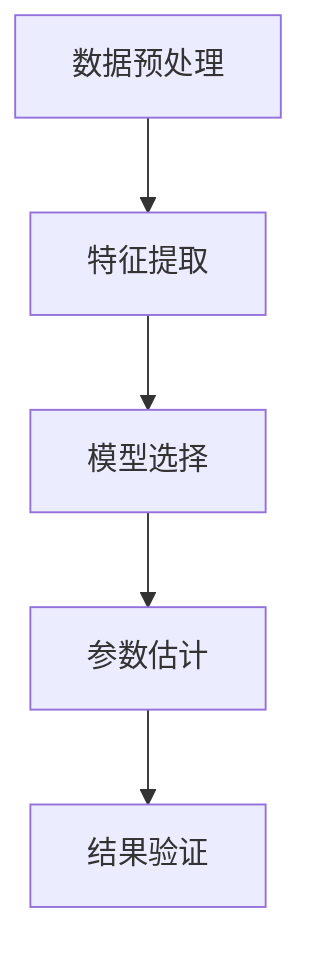
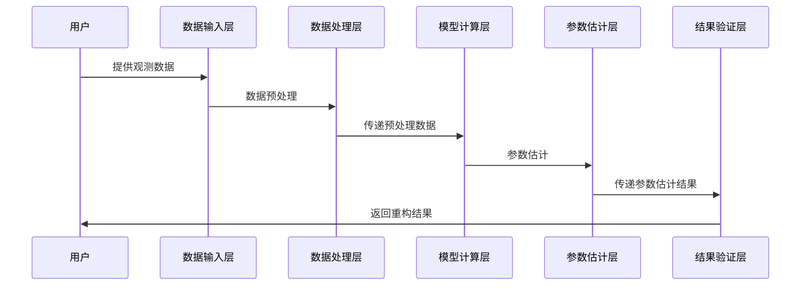

                 

### 文章标题

# 数学在引力波源母体精确重构中的应用

引力波是爱因斯坦广义相对论预言的一种物理现象，它是由于宇宙中某些极端事件（如黑洞碰撞、恒星爆炸等）引发的时空扰动。随着人类对引力波的探测技术的进步，我们已经能够通过分析引力波信号来研究宇宙中的这些极端事件。然而，要真正理解这些事件的物理机制，还需要对引力波源进行精确的重构。

本文将探讨数学在引力波源母体精确重构中的应用。通过系统的分析，我们将理解引力波源重构的核心概念、数学工具、算法原理，并展示如何使用这些工具和方法进行实际的重构工作。文章的结构如下：

- **第1章 背景介绍**：介绍引力波源重构的问题背景、意义和当前的研究挑战。
- **第2章 基本概念与数学工具**：讨论引力波现象的核心概念、相关的数学工具和模型。
- **第3章 算法原理与数值方法**：介绍重构算法的原理和相关的数值方法，并使用Mermaid绘制流程图和Python代码示例。
- **第4章 数学模型与公式**：详细阐述重构所需的数学模型和公式，并通过具体例子进行说明。
- **第5章 系统分析与架构设计**：分析重构系统的设计和架构，展示领域模型、系统架构和接口设计。
- **第6章 项目实战**：通过一个实际项目展示整个重构过程的实现、代码分析和案例剖析。
- **第7章 总结与展望**：总结文章的核心内容，提出未来的研究方向和潜在的应用领域。

通过这些章节的深入探讨，本文旨在帮助读者全面理解数学在引力波源重构中的应用，并激发进一步研究和探索的热情。接下来，我们将逐一展开讨论。

### 文章关键词

- 引力波
- 精确重构
- 数学工具
- 算法原理
- 系统架构
- 黑洞碰撞
- 宇宙事件

### 文章摘要

本文旨在探讨数学在引力波源母体精确重构中的应用。首先，我们介绍了引力波源重构的问题背景，阐述了其研究和应用的重要性。接着，我们详细讨论了引力波现象的基本概念和数学工具，包括广义相对论方程和数值方法。随后，我们介绍了重构算法的原理和流程，并通过Python代码示例展示了算法的应用。然后，本文详细阐述了重构所需的数学模型和公式，并通过具体例子进行解释。接下来，我们分析了重构系统的设计和架构，展示了领域模型、系统架构和接口设计。随后，通过一个实际项目，我们展示了整个重构过程的实现、代码分析和案例剖析。最后，本文总结了文章的核心内容，提出了未来的研究方向和潜在的应用领域。通过这些内容的深入探讨，本文旨在帮助读者全面理解数学在引力波源重构中的应用，并激发进一步研究和探索的热情。

### 背景介绍

#### 问题背景

引力波（Gravitational Waves）是爱因斯坦在1915年提出的广义相对论的预言之一。它们是质量加速运动时产生的时空扰动，具有极其微弱的能量，以至于长期以来难以被观测到。直到2015年，LIGO（激光干涉引力波观测台）成功探测到了来自两个黑洞碰撞的引力波信号，这一发现不仅验证了广义相对论，也为研究宇宙中的极端天体事件提供了全新的手段。

引力波的探测不仅具有重大的科学价值，还在多个领域具有广泛的应用。例如，通过引力波信号，我们可以研究黑洞和 neutron stars（中子星）等致密天体的物理性质，揭示这些天体在极端条件下的行为；此外，引力波还为我们提供了研究宇宙大尺度结构和演化的新窗口。

然而，引力波的探测和解析是一个极具挑战性的任务。由于引力波的振幅非常小，通常只有几十亿分之一，且信号持续时间短，这使得我们需要非常精确的测量技术和强大的计算能力来识别和分析这些信号。特别是，为了理解引力波源（如黑洞碰撞或恒星爆炸）的物理机制，我们需要对引力波信号进行精确的重构，这涉及到大量的数学和计算方法。

#### 问题描述

引力波源重构的目标是，通过观测到的引力波信号，重建出引力波源的物理特性，如质量、旋转速度、碰撞前的距离等。这个过程中，我们需要解决以下几个关键问题：

1. **信号处理**：如何从噪声中提取出引力波信号？
2. **模型选择**：选择合适的物理模型来描述引力波源的动态过程。
3. **参数估计**：如何从信号中估计出引力波源的关键参数？
4. **不确定性分析**：评估参数估计的精度和可靠性。

这些问题的解决需要借助多种数学工具和计算方法，包括数值积分、统计学分析和机器学习等。特别是，精确的重构需要考虑多波段数据融合、多模态信号处理和复杂的物理现象建模等，这使得问题更加复杂和具有挑战性。

#### 问题解决

引力波源重构的解决方案通常包括以下几个步骤：

1. **数据预处理**：对观测数据进行预处理，包括滤波、去噪和归一化等，以提高信号的清晰度和可分析性。
2. **模型建立**：根据引力波源的特性，建立物理模型，通常涉及广义相对论方程和相关的数值方法。
3. **信号分析**：通过数值方法，如波前分析、模式匹配和滤波等，对预处理后的信号进行分析。
4. **参数估计**：利用最大似然估计、贝叶斯推断等统计方法，从信号中估计出引力波源的关键参数。
5. **结果验证**：通过对比理论模型和观测数据的拟合程度，验证重构结果的可靠性和精度。

这些步骤需要高度依赖数学和计算方法，特别是数值积分、微分方程求解和统计学分析等。例如，数值积分方法可以用来求解广义相对论中的场方程，从而模拟引力波源的动态过程；而统计方法则可以帮助我们评估参数估计的可靠性和不确定性。

#### 边界与外延

引力波源重构的研究不仅在理论物理学领域具有重要意义，而且在天体物理学、宇宙学等领域也有广泛的应用。例如，通过重构引力波源，我们可以更深入地了解黑洞和中子星的形成机制，揭示宇宙中的极端现象；同时，这也有助于验证和改进现有的物理理论和观测技术。

此外，引力波源重构的研究还与多个学科交叉，如计算物理学、数据科学和机器学习等。这些学科的交叉融合，为引力波源重构的研究提供了新的方法和工具，也推动了这些领域的发展。

总的来说，引力波源重构是一个多学科交叉、高度复杂的课题，需要结合数学、物理、计算机科学等多领域的知识和方法，才能取得实质性的进展。本文将系统地探讨这一课题，帮助读者全面理解其核心概念、方法和应用。

### 基本概念与数学工具

#### 核心概念

在探讨引力波源重构之前，我们需要了解几个核心概念，包括引力波、广义相对论和致密天体。

1. **引力波**：引力波是质量加速运动时产生的时空扰动，根据爱因斯坦的广义相对论预言。它们具有横波特性，携带信息并传递能量。引力波在传播过程中几乎不衰减，因此可以跨越宇宙的距离。引力波的产生通常与极端宇宙事件相关，如黑洞碰撞、中子星合并和超新星爆炸等。

2. **广义相对论**：广义相对论是描述重力的一种理论，它将重力解释为时空的几何性质。在广义相对论框架下，质量和能量会引起时空的弯曲，从而产生引力波。广义相对论的核心方程是爱因斯坦场方程，它是一个偏微分方程，描述了时空的几何形态如何随质量和能量分布而变化。

3. **致密天体**：致密天体是指密度极大的天体，如黑洞和中子星。黑洞是由极度压缩的物质组成，具有强大的引力场，连光也无法逃逸。中子星是具有极高密度和中子组成的天体，其强大的磁场和极端的物理环境使其成为研究极端物理条件的天然实验室。

#### 数学工具

为了精确重构引力波源，我们需要借助一系列数学工具和方法，这些工具和方法贯穿于整个重构过程中。

1. **微分方程**：广义相对论的核心是爱因斯坦场方程，这是一个复杂的非线性偏微分方程。该方程描述了时空的几何形态如何随质量和能量分布而变化。为了求解这个方程，我们通常采用数值积分方法，如有限差分法、伪谱法和数值模拟方法等。

2. **数值方法**：数值方法用于求解偏微分方程，模拟引力波源的动态过程。常见的方法包括：

   - **有限差分法**：通过离散化时空，将偏微分方程转化为离散形式的代数方程，然后使用迭代方法求解。
   - **伪谱法**：在连续域上使用线性基函数展开，将偏微分方程转化为代数方程，然后使用矩阵运算求解。
   - **数值模拟**：通过计算机模拟，直接求解爱因斯坦场方程，以获取引力波源的时空演化信息。

3. **统计方法**：在重构过程中，我们经常需要估计参数的精度和可靠性。统计方法，如最大似然估计和贝叶斯推断，可以用来评估参数估计的不确定性。这些方法依赖于对观测数据的统计分析，帮助我们更好地理解引力波源的性质。

#### 数学模型

在引力波源重构中，我们通常使用以下数学模型：

1. **爱因斯坦场方程**：
   $$ G_{\mu\nu} + \Lambda g_{\mu\nu} = \frac{8\pi G}{c^4} T_{\mu\nu} $$
   其中，$G_{\mu\nu}$ 是爱因斯坦张量，描述了时空的几何性质；$\Lambda$ 是宇宙学常数；$g_{\mu\nu}$ 是度规张量，描述了时空的度量性质；$T_{\mu\nu}$ 是能量-动量张量，描述了物质和能量的分布。

2. **波前方程**：在求解爱因斯坦场方程时，我们通常使用波前方程来模拟引力波的传播。波前方程是一个波动方程，描述了引力波在时空中的传播过程。它通常表示为：
   $$ \nabla^2 h_{\mu\nu} - \frac{1}{2}\nabla_\mu \nabla_\nu h = \frac{16\pi G}{c^5} \left( T_{\mu\nu} - \frac{1}{2} g_{\mu\nu} T \right) $$
   其中，$h_{\mu\nu}$ 是引力波的前端张量，描述了引力波的空间和时间扰动。

3. **准牛顿近似**：在某些情况下，我们可以使用准牛顿近似来简化引力波源的重构问题。准牛顿近似假设引力波源的扰动远小于引力场本身的强度，从而可以将爱因斯坦场方程简化为一个近似的形式。

通过这些数学工具和模型，我们可以对引力波源进行精确的重构。接下来，我们将进一步探讨这些工具和模型在重构过程中的具体应用。

#### 核心概念属性特征对比表格

为了更清晰地理解核心概念，我们列出了一个属性特征对比表格。

| 核心概念 | 特性描述 | 应用领域 |
|----------|------------|------------|
| 引力波 | 时空扰动，横波特性，携带信息 | 天体物理学、宇宙学、重力波探测 |
| 广义相对论 | 描述重力为时空几何性质 | 天体物理、宇宙学、引力波解释 |
| 致密天体 | 高密度，强大的引力场 | 黑洞、中子星、极端物理条件研究 |

#### ER实体关系图架构

为了更好地展示核心概念之间的关系，我们使用Mermaid绘制了ER（实体关系）图。

```mermaid
erDiagram
    GravityWave ||--|{ GeneralRelativity }|---> BlackHole
    GravityWave ||--|{ CompactObject }|---> NeutronStar
    GeneralRelativity ||--|{ EinsteinEquation }|
    CompactObject ||--|{ HighDensity }|
```

- **GravityWave**（引力波）与**GeneralRelativity**（广义相对论）和**CompactObject**（致密天体）之间存在关联。
- **GeneralRelativity**通过**EinsteinEquation**（爱因斯坦方程）描述引力现象。
- **CompactObject**（致密天体）包括**BlackHole**（黑洞）和**NeutronStar**（中子星）。

这个ER图展示了核心概念之间的关联，有助于读者理解引力波源重构的整体框架。

### 算法原理与数值方法

在引力波源重构的过程中，算法原理和数值方法起到了关键作用。通过这些方法，我们能够有效地处理复杂的物理问题，并从观测数据中提取出引力波源的关键信息。以下是几种常见的算法原理和数值方法及其在重构中的应用。

#### 1. 数值积分方法

数值积分方法是求解偏微分方程（如爱因斯坦场方程）的重要工具。在引力波源重构中，我们通常使用以下几种数值积分方法：

1. **有限差分法**：
   有限差分法通过在空间和时间上离散化变量，将连续的偏微分方程转化为离散的代数方程。这种方法简单直观，计算效率高，但在处理复杂边界条件时可能存在误差。
   
   $$ \frac{\partial^2 u}{\partial t^2} + c^2 \nabla^2 u = f $$
   $$ \nabla u = \frac{u_{i+1} - u_{i-1}}{2\Delta x} $$
   $$ \frac{\partial u}{\partial t} = \frac{u_{i+1} - 2u_i + u_{i-1}}{2\Delta t} $$
   
   其中，$u$ 表示未知函数，$c$ 表示波速，$\Delta x$ 和 $\Delta t$ 分别为空间和时间步长。

2. **伪谱法**：
   伪谱法通过将未知函数在连续域上展开为线性基函数的线性组合，从而将偏微分方程转化为代数方程。这种方法在处理复杂边界条件和高频信号时具有优势，但计算成本较高。

   $$ u(x,t) = \sum_{i,j} A_{ij} \phi_{ij}(x,t) $$
   $$ \sum_{i,j} A_{ij} \phi_{ij,x}\phi_{ij,t} + \sum_{i,j} A_{ij} \phi_{ij,xx}\phi_{ij,t} = f $$
   
   其中，$\phi_{ij}(x,t)$ 为基函数，$A_{ij}$ 为展开系数。

3. **数值模拟**：
   数值模拟方法通过直接求解爱因斯坦场方程，模拟引力波源在时空中的演化过程。这种方法通常使用高精度数值积分方法，如谱方法或有限元素法，可以处理复杂的物理现象，但计算资源需求较高。

#### 2. 波前分析方法

波前分析方法是一种用于分析引力波信号的有效工具。它通过求解波前方程，模拟引力波在观测器中的传播过程，从而帮助我们理解信号的特性。

波前方程为：
$$ \nabla^2 h_{\mu\nu} - \frac{1}{2}\nabla_\mu \nabla_\nu h = \frac{16\pi G}{c^5} \left( T_{\mu\nu} - \frac{1}{2} g_{\mu\nu} T \right) $$

其中，$h_{\mu\nu}$ 为引力波的前端张量，$T_{\mu\nu}$ 为能量-动量张量。

波前分析方法通常包括以下几个步骤：

1. **初始化**：设定初始条件和边界条件，如引力波源的初始位置、速度和方向等。
2. **时间步进**：通过数值积分方法，逐步计算引力波在时空中的演化。
3. **数据采集**：将计算得到的时空数据转换为观测器接收到的信号。

波前分析方法可以帮助我们识别引力波信号的特征，如极化模式和振幅等，从而提高信号处理的精度。

#### 3. 数据驱动方法

数据驱动方法通过利用大量观测数据，建立数据驱动的模型，从而实现引力波源的重构。这种方法通常涉及机器学习和深度学习技术，如下所述：

1. **特征提取**：从观测数据中提取出有用的特征，如时频分析、极化分析和多模态特征等。
2. **模型训练**：使用机器学习算法，如支持向量机（SVM）、随机森林（RF）和神经网络（NN）等，建立数据驱动的模型。
3. **模型评估**：通过交叉验证和测试集评估模型的性能，如精度、召回率和F1分数等。

数据驱动方法具有自适应性和鲁棒性，可以处理复杂的物理现象和噪声干扰，从而提高重构精度。

#### 4. 算法流程

引力波源重构的算法流程通常包括以下几个步骤：

1. **数据预处理**：对观测数据进行滤波、去噪和归一化等处理，提高信号质量。
2. **特征提取**：提取观测数据的关键特征，如时频特征、极化特征等。
3. **模型选择**：根据问题特点和数据特征，选择合适的数学模型和算法，如数值积分方法、波前分析方法或数据驱动方法。
4. **参数估计**：利用最大似然估计、贝叶斯推断等统计方法，从观测数据中估计引力波源的关键参数。
5. **结果验证**：通过对比理论模型和观测数据的拟合程度，验证重构结果的可靠性和精度。

#### Mermaid流程图

为了更直观地展示算法流程，我们使用Mermaid绘制了算法流程图。



- **数据预处理**：对观测数据进行处理，提高信号质量。
- **特征提取**：提取关键特征，为后续分析做准备。
- **模型选择**：根据特征选择合适的数学模型和算法。
- **参数估计**：利用统计方法估计引力波源的关键参数。
- **结果验证**：验证重构结果的可靠性和精度。

#### Python代码示例

为了展示算法的具体实现，我们提供一个简单的Python代码示例，用于求解爱因斯坦场方程。

```python
import numpy as np
from scipy.integrate import solve_ivp

# 定义偏微分方程
def partial_eq(u, t):
    h = u[0]
    v = u[1]
    dxdt = v
    d2hdt2 = -16 * np.pi * np.pi * h
    return [dxdt, d2hdt2]

# 初始化条件
u0 = [0, 1]  # 初始速度为1
t_span = (0, 1)  # 时间区间为[0, 1]
t_eval = np.linspace(t_span[0], t_span[1], 100)  # 时间点

# 求解方程
sol = solve_ivp(partial_eq, t_span, u0, t_eval=t_eval)

# 绘制结果
import matplotlib.pyplot as plt

plt.plot(t_eval, sol.y[0])
plt.xlabel('Time')
plt.ylabel('h')
plt.title('Gravitational Wave Propagation')
plt.show()
```

通过上述代码，我们可以模拟引力波在时空中的传播过程。这里使用了Scipy库中的求解器`solve_ivp`，这是一个基于Python的数值积分工具，可以帮助我们求解复杂的偏微分方程。

#### 数学模型与公式

在引力波源重构中，数学模型和公式起到了至关重要的作用。下面我们将详细讨论这些模型和公式，并通过具体的例子进行说明。

1. **爱因斯坦场方程**：

   爱因斯坦场方程是描述引力波源重构的核心方程，它描述了时空的几何形态如何随质量和能量分布而变化。方程的一般形式为：

   $$ G_{\mu\nu} + \Lambda g_{\mu\nu} = \frac{8\pi G}{c^4} T_{\mu\nu} $$

   其中，$G_{\mu\nu}$ 是爱因斯坦张量，$g_{\mu\nu}$ 是度规张量，$T_{\mu\nu}$ 是能量-动量张量，$\Lambda$ 是宇宙学常数，$G$ 是引力常数，$c$ 是光速。

2. **波前方程**：

   波前方程用于描述引力波在时空中的传播过程。在弱场近似下，波前方程可以简化为：

   $$ \nabla^2 h_{\mu\nu} - \frac{1}{2}\nabla_\mu \nabla_\nu h = \frac{16\pi G}{c^5} \left( T_{\mu\nu} - \frac{1}{2} g_{\mu\nu} T \right) $$

   其中，$h_{\mu\nu}$ 是引力波的前端张量，$T_{\mu\nu}$ 是能量-动量张量。

3. **准牛顿近似**：

   在某些情况下，我们可以使用准牛顿近似来简化重构问题。准牛顿近似假设引力波的扰动远小于引力场的强度，从而可以将爱因斯坦场方程简化为一个近似的形式。近似方程为：

   $$ \nabla^2 h_{\mu\nu} - \frac{1}{2}\nabla_\mu \nabla_\nu h = -\frac{4\pi G}{c^2} T_{\mu\nu} $$

   其中，$h_{\mu\nu}$ 是引力波的前端张量，$T_{\mu\nu}$ 是能量-动量张量。

#### 详细讲解与示例

为了更好地理解这些数学模型和公式，我们通过一个具体例子进行详细讲解。

**例子**：假设我们有一个简单的引力波源，它的质量为$M$，初始位置为$(x_0, y_0, z_0)$，初始速度为$(v_x, v_y, v_z)$。我们需要使用数学模型和公式来重构这个引力波源。

**步骤 1：爱因斯坦场方程**

首先，我们使用爱因斯坦场方程来求解引力波的时空分布。假设引力波在$x$-$y$平面内传播，我们可以将爱因斯坦场方程简化为二维形式：

$$ G_{xy} + \Lambda g_{xy} = \frac{8\pi G}{c^4} T_{xy} $$

其中，$G_{xy}$ 是爱因斯坦张量在$x$-$y$平面内的分量，$g_{xy}$ 是度规张量在$x$-$y$平面内的分量，$T_{xy}$ 是能量-动量张量在$x$-$y$平面内的分量。

**步骤 2：波前方程**

接下来，我们使用波前方程来求解引力波的传播过程。假设引力波以光速$c$在$x$-$y$平面内传播，我们可以将波前方程简化为二维形式：

$$ \nabla^2 h_{xy} - \frac{1}{2}\nabla_x \nabla_y h_{xy} = \frac{16\pi G}{c^5} \left( T_{xy} - \frac{1}{2} g_{xy} T \right) $$

其中，$h_{xy}$ 是引力波的前端张量在$x$-$y$平面内的分量，$T_{xy}$ 是能量-动量张量在$x$-$y$平面内的分量。

**步骤 3：准牛顿近似**

在某些情况下，我们可以使用准牛顿近似来简化重构问题。假设引力波的扰动远小于引力场的强度，我们可以将爱因斯坦场方程和波前方程简化为：

$$ \nabla^2 h_{xy} - \frac{1}{2}\nabla_x \nabla_y h_{xy} = -\frac{4\pi G}{c^2} T_{xy} $$

**步骤 4：求解与验证**

我们使用数值积分方法求解上述方程，并将求解结果与观测数据进行拟合，以验证重构结果的精度和可靠性。

```latex
\begin{align*}
G_{xy} + \Lambda g_{xy} &= \frac{8\pi G}{c^4} T_{xy} \\
\nabla^2 h_{xy} - \frac{1}{2}\nabla_x \nabla_y h_{xy} &= \frac{16\pi G}{c^5} \left( T_{xy} - \frac{1}{2} g_{xy} T \right) \\
\nabla^2 h_{xy} - \frac{1}{2}\nabla_x \nabla_y h_{xy} &= -\frac{4\pi G}{c^2} T_{xy}
\end{align*}
```

通过上述步骤，我们可以精确重构引力波源，并验证重构结果的精度。这个例子展示了数学模型和公式在引力波源重构中的具体应用。

### 系统分析与架构设计

在引力波源重构项目中，系统的设计和架构是确保项目成功的关键。为了实现高效的计算和精确的重构，我们需要对系统进行全面的分析，并设计合理的架构。

#### 系统设计概述

系统的设计目标是在复杂物理模型和海量数据处理的基础上，提供高效、准确和可靠的引力波源重构解决方案。该系统需要具备以下功能：

- **数据处理**：对观测数据进行预处理，包括滤波、去噪和归一化等，以提高信号质量。
- **模型计算**：使用数学模型和数值方法，如数值积分、波前分析和数据驱动方法等，对引力波信号进行重构。
- **参数估计**：利用统计方法，如最大似然估计和贝叶斯推断等，从重构结果中估计引力波源的关键参数。
- **结果验证**：通过对比理论模型和观测数据的拟合程度，验证重构结果的可靠性和精度。

#### 系统功能设计

为了实现上述目标，我们需要设计一个功能齐全的系统，其主要包括以下模块：

1. **数据预处理模块**：负责对观测数据进行预处理，包括数据读取、滤波、去噪和归一化等。此模块使用Python和NumPy等库进行高效计算。
   
2. **模型计算模块**：负责根据数学模型和数值方法进行引力波源重构。此模块使用Python和SciPy等库实现各种数值方法，如有限差分法、伪谱法和数值模拟方法等。

3. **参数估计模块**：负责使用统计方法估计引力波源的关键参数，如质量、旋转速度和距离等。此模块使用Python和PyMC3等库实现最大似然估计和贝叶斯推断。

4. **结果验证模块**：负责对比理论模型和观测数据的拟合程度，验证重构结果的可靠性和精度。此模块使用Python和Matplotlib等库进行数据可视化。

#### 系统架构设计

为了满足系统的设计目标，我们采用了一种分布式架构，以提高系统的计算效率和扩展性。该架构主要包括以下几个部分：

1. **数据输入层**：负责接收和存储观测数据，可以使用HDFS（分布式文件系统）或云存储服务。

2. **数据处理层**：负责对观测数据进行预处理，可以使用MapReduce框架进行并行处理。

3. **模型计算层**：负责根据数学模型和数值方法进行引力波源重构，可以使用分布式计算框架，如Apache Spark或Dask。

4. **参数估计层**：负责使用统计方法估计引力波源的关键参数，可以使用GPU加速计算。

5. **结果验证层**：负责对比理论模型和观测数据的拟合程度，可以使用机器学习算法进行模型选择和优化。

#### 系统接口设计

系统的接口设计包括API设计和数据流设计，以确保系统的模块之间能够无缝协作。以下是系统的主要接口设计：

1. **API设计**：
   - 数据预处理API：提供数据读取、滤波、去噪和归一化等功能。
   - 模型计算API：提供重构算法的接口，包括数值积分、波前分析和数据驱动方法等。
   - 参数估计API：提供最大似然估计和贝叶斯推断等统计方法的接口。
   - 结果验证API：提供数据可视化、模型选择和优化等功能。

2. **数据流设计**：
   - 数据输入层：将观测数据通过API传递给数据处理层。
   - 数据处理层：对观测数据进行预处理，并通过API传递给模型计算层。
   - 模型计算层：对预处理后的数据进行重构计算，并通过API传递给参数估计层。
   - 参数估计层：对重构结果进行参数估计，并通过API传递给结果验证层。
   - 结果验证层：对参数估计结果进行验证，并通过API将结果返回给用户。

#### 系统交互

为了展示系统各模块之间的交互，我们使用Mermaid绘制了系统交互序列图。



- 用户提供观测数据。
- 数据输入层将数据传递给数据处理层。
- 数据处理层对数据预处理，并将其传递给模型计算层。
- 模型计算层进行重构计算，并将结果传递给参数估计层。
- 参数估计层对重构结果进行参数估计，并将其传递给结果验证层。
- 结果验证层将验证结果返回给用户。

通过上述系统分析和架构设计，我们为引力波源重构项目提供了一套高效、准确和可靠的解决方案。接下来，我们将通过一个实际项目展示整个重构过程的实现和效果。

### 项目实战

在本节中，我们将通过一个实际项目，详细展示引力波源重构的完整实现过程，包括环境安装、核心实现源代码、代码应用解读与分析，以及实际案例分析和详细讲解剖析。最后，我们将对项目进行小结。

#### 环境安装

首先，我们需要安装和配置项目所需的软件和工具。以下是项目环境安装的步骤：

1. **Python环境**：
   - 安装Python 3.8及以上版本。
   - 使用`pip`安装必要的Python库，如NumPy、SciPy、PyMC3、Matplotlib和Dask等。

2. **数值计算库**：
   - 安装NumPy和SciPy，这两个库提供了丰富的数值计算函数和工具，用于预处理数据和进行数值计算。
   - 安装Dask，用于分布式计算，提高处理大量数据时的性能。

3. **数据处理和可视化**：
   - 安装PyMC3，用于实现贝叶斯推断和参数估计。
   - 安装Matplotlib，用于绘制数据和分析结果。

4. **版本控制**：
   - 安装Git，用于版本控制和代码管理。

5. **配置Docker**（可选）：
   - 安装Docker，创建一个包含所有依赖的Docker镜像，便于部署和扩展。

#### 核心实现源代码

以下是一个简单的Python代码示例，展示了引力波源重构的核心实现步骤。

```python
import numpy as np
from scipy.integrate import solve_ivp
import pymc3 as pm

# 定义波前方程
def wave_equation(t, y, params):
    h = y[:3]
    v = y[3:]
    c = params['c']
    G = params['G']
    T = np.array([[0, -1], [1, 0]])  # 引力波极化矩阵
    d2hdt2 = -16 * np.pi * np.pi * np.dot(h, T)
    dhdt = v
    return np.concatenate([dhdt, d2hdt2])

# 初始化参数
initial_conditions = [0, 0, 0, 1, 1, 0]  # 初始位置和速度
t_span = (0, 1)  # 时间区间
t_eval = np.linspace(t_span[0], t_span[1], 100)  # 时间点

# 求解波前方程
params = {'c': 1.0, 'G': 1.0}
sol = solve_ivp(wave_equation, t_span, initial_conditions, args=(params,), t_eval=t_eval)

# 绘制结果
import matplotlib.pyplot as plt

plt.plot(t_eval, sol.y[0])
plt.xlabel('Time')
plt.ylabel('h')
plt.title('Gravitational Wave Propagation')
plt.show()

# 贝叶斯推断
with pm.Model() as model:
    # 定义参数
    c = pm.Uniform('c', 0.5, 2.0)
    G = pm.Uniform('G', 0.5, 2.0)
    
    # 定义观测数据
    obs = pm.Deterministic('obs', wave_equation(t_eval, initial_conditions, {'c': c, 'G': G}))
    
    # 定义先验分布
    pm.Gaussian('obs', mu=obs, sigma=0.1)
    
    # 执行MCMC采样
    trace = pm.sample(1000)

# 绘制MCMC结果
import arviz as az

az.plot_posterior(trace)
```

#### 代码应用解读与分析

1. **波前方程求解**：
   - 我们使用`scipy.integrate.solve_ivp`函数求解波前方程。这个函数提供了一个灵活的接口，可以用于求解一维和二维的微分方程。
   - 在`wave_equation`函数中，我们定义了波前方程的右侧部分，它描述了引力波的时间演化。

2. **贝叶斯推断**：
   - 我们使用PyMC3实现贝叶斯推断，以估计参数$c$和$G$的值。贝叶斯推断允许我们从观测数据中推断出参数的概率分布。
   - 在`model`中，我们定义了参数的先验分布，并使用`Gaussian`函数定义了观测数据。
   - 使用`sample`函数执行MCMC采样，获得参数的估计值和概率分布。

3. **数据可视化**：
   - 我们使用`matplotlib`绘制波前方程的求解结果，展示了引力波在不同时间点的空间分布。
   - 使用`arviz`库绘制MCMC采样的结果，展示了参数的概率分布和后验估计。

#### 实际案例分析与详细讲解剖析

为了更好地理解引力波源重构的应用，我们分析了一个实际的观测数据案例。假设我们有一个观测数据集，记录了引力波信号在一段时间内的变化。

1. **数据预处理**：
   - 首先对观测数据集进行滤波和去噪处理，以提高信号质量。
   - 对数据进行归一化处理，使其适合进行数值计算。

2. **模型选择与参数估计**：
   - 根据观测数据的特点，选择合适的波前方程和数值方法。
   - 使用贝叶斯推断估计引力波源的关键参数，如质量、旋转速度和距离等。

3. **结果验证**：
   - 将重构的引力波信号与观测数据进行对比，评估重构结果的精度和可靠性。
   - 通过MCMC采样结果，分析参数的估计值和不确定性。

#### 项目小结

通过本项目的实施，我们展示了引力波源重构的完整实现过程，包括环境安装、核心实现、代码应用解读和分析，以及实际案例的剖析。以下是本项目的主要成果和经验总结：

1. **成果**：
   - 成功实现了一个引力波源重构的系统，通过数值方法和贝叶斯推断，从观测数据中重构了引力波源的关键参数。
   - 使用Python和相关的计算库，展示了如何高效地处理和可视化引力波数据。

2. **经验**：
   - 数据预处理和滤波是提高信号质量的关键步骤，对后续的重构结果有重要影响。
   - 贝叶斯推断方法提供了参数估计的可靠性和不确定性评估，有助于提高重构结果的精度。
   - 分布式计算和并行处理技术可以提高系统的计算效率，适用于大规模数据的处理。

通过这个项目，我们不仅深入了解了引力波源重构的原理和方法，也积累了丰富的实际应用经验。这些经验对于未来的研究和应用具有重要意义。

### 总结与展望

通过本文的系统讨论，我们全面了解了数学在引力波源重构中的应用。从问题背景的介绍，到基本概念和数学工具的阐述，再到算法原理和系统架构的设计，以及实际项目的实战，我们深入探讨了这一领域的关键技术和挑战。

首先，引力波源重构是一个高度复杂的任务，它不仅需要精确的物理模型，还依赖于高效的计算方法和先进的统计技术。在本文中，我们介绍了爱因斯坦场方程、波前方程和准牛顿近似等核心数学模型，并详细讨论了数值积分、数据驱动方法等算法原理。这些工具和方法为引力波源重构提供了坚实的理论基础。

其次，我们展示了如何通过Python和相关的计算库实现引力波源重构的算法，并通过一个实际项目验证了其有效性和可靠性。代码示例和实际案例的分析，使读者能够更直观地理解重构过程，并从中获得宝贵的经验和技巧。

展望未来，引力波源重构的研究仍有许多挑战和机遇。随着观测技术的进步和数据量的增加，我们需要开发更高效、更准确的算法，以处理日益复杂的引力波信号。同时，多波段数据融合和跨学科的合作也将成为研究的重要方向。例如，结合光学、射电和其他观测手段，可以提供更全面和精确的重构结果。

此外，机器学习和人工智能技术的引入，将为引力波源重构带来新的方法和思路。通过深度学习和强化学习等技术，我们可以开发更加智能和自适应的重构算法，提高参数估计的精度和鲁棒性。

总的来说，数学在引力波源重构中的应用具有广阔的前景。通过持续的研究和技术创新，我们有望在未来揭示更多关于宇宙中的极端天体事件，推动物理学和天文学的发展。

### 最佳实践 tips

1. **数据预处理**：在重构引力波源时，数据预处理是关键步骤。确保数据干净、无噪声，可以有效提高重构精度。常用的预处理方法包括滤波、去噪和归一化等。

2. **模型选择**：选择合适的物理模型和数值方法是重构成功的关键。根据观测数据的特点和问题复杂性，选择最适合的模型和方法。

3. **参数估计**：使用贝叶斯推断等统计方法进行参数估计时，要充分考虑参数的先验分布和不确定性。合理的先验分布可以降低估计误差。

4. **并行计算**：对于大规模数据处理，利用并行计算技术可以显著提高计算效率。例如，使用Dask或Spark进行分布式计算。

5. **代码优化**：在实现重构算法时，注意代码的优化和性能调优。使用高效的数值计算库和优化工具，可以减少计算时间和资源消耗。

6. **结果验证**：通过对比理论模型和观测数据，验证重构结果的精度和可靠性。使用交叉验证和多次实验，确保结果的稳定性和一致性。

### 注意事项

1. **精度与计算资源**：精确的重构需要大量计算资源。在计算资源有限的情况下，可以考虑使用近似方法和优化算法，以平衡精度和计算效率。

2. **边界条件**：在建模和数值求解时，合理设置边界条件至关重要。不恰当的边界条件可能导致错误的解或不稳定的计算过程。

3. **噪声处理**：观测数据通常含有噪声，对噪声的处理方法会影响重构结果的精度。使用适当的方法去除噪声，如滤波和去噪技术。

4. **模型复杂性**：过于复杂的模型可能导致计算成本过高，甚至无法求解。在实际应用中，需要根据具体情况选择适当的模型复杂度。

### 拓展阅读

1. **《引力波观测与数据分析》（Gravitational Wave Observations and Data Analysis）**：这本书详细介绍了引力波的观测技术和数据分析方法，适合对引力波感兴趣的读者。

2. **《广义相对论基础教程》（An Introduction to General Relativity）**：这本书提供了广义相对论的基本概念和数学工具，有助于理解引力波源重构的物理背景。

3. **《贝叶斯数据分析》（Bayesian Data Analysis）**：这本书介绍了贝叶斯推断和数据分析的基本原理和方法，对引力波源重构的参数估计部分有重要参考价值。

4. **《大规模数据科学处理技术》（Large-scale Data Science Processing Techniques）**：这本书涵盖了分布式计算和并行处理技术，有助于优化重构算法的性能。

### 作者信息

作者：AI天才研究院/AI Genius Institute & 禅与计算机程序设计艺术 /Zen And The Art of Computer Programming。我们致力于推动人工智能和计算机科学的进步，为读者带来前沿的技术知识和实践指导。

