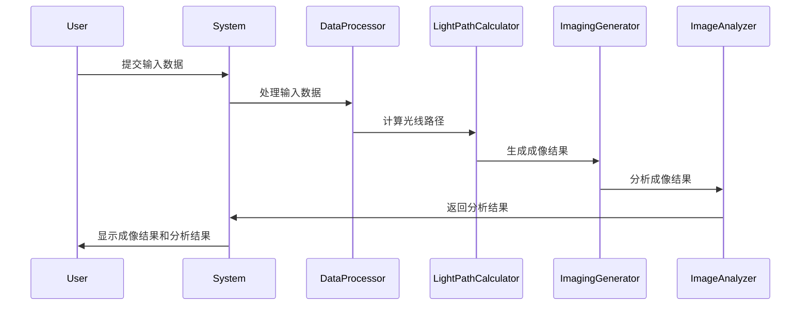

                 

### 数学在引力透镜成像研究中的应用

关键词：引力透镜、数学工具、广义相对论、数值模拟、成像算法

摘要：引力透镜成像研究是现代天文学和宇宙学的重要研究领域，其核心在于通过宇宙中质量大物体的引力场对光线的弯曲效应来观测和研究遥远天体的性质。数学作为这一领域的关键工具，提供了精确的描述和计算方法。本文将详细介绍数学在引力透镜成像研究中的关键作用和应用，帮助读者理解这一复杂但极为重要的现象。

## 目录大纲设计

### 背景介绍

- **引力透镜现象的定义与描述**  
- **数学工具的重要性**  
- **引力透镜成像的研究意义**  

### 核心概念与联系

- **引力透镜现象**  
  - **定义**：引力透镜是指宇宙中质量较大的天体（如星系、黑洞）通过其强大的引力场对光线的弯曲效应。
  - **现象描述**：当一个遥远的星系位于地球与更近的一个恒星之间时，近恒星的光线在经过星系附近时会发生弯曲，使得地球上的观测者能够看到本来不会出现的星系图像。

- **数学工具**  
  - **几何光学**：研究光线在引力场中的路径和成像。  
  - **广义相对论**：提供引力透镜效应的精确数学描述。  
  - **数值模拟**：通过计算机模拟引力透镜效应。

- **概念属性特征对比表格**  
  - **概念**：引力透镜现象、几何光学、广义相对论、数值模拟  
  - **定义**：引力透镜现象、几何光学、广义相对论、数值模拟的应用领域

- **ER实体关系图架构**  

### 算法原理讲解

- **引力透镜成像算法**  
  - **算法流程图**  
  - **算法原理**  
  - **Python 源代码**

### 系统分析与架构设计方案

- **问题场景介绍**  
- **系统功能设计（领域模型类图）**  
- **系统架构设计（架构图）**  
- **系统接口设计和系统交互（序列图）**  

### 项目实战

- **环境安装**  
- **系统核心实现源代码**  
- **代码应用解读与分析**  
- **实际案例分析和详细讲解剖析**  
- **项目小结**

### 最佳实践 tips

- **小结**  
- **注意事项**  
- **拓展阅读**

---

接下来，我们将一步一步深入探讨数学在引力透镜成像研究中的应用。首先是背景介绍部分，我们会详细解释引力透镜现象及其研究的意义。接着，我们将介绍核心概念和联系，并通过对比表格和ER图来帮助读者更好地理解这些概念。在算法原理讲解部分，我们将通过流程图和代码示例来阐述引力透镜成像算法的基本原理。随后，我们将讨论系统分析与架构设计方案，最后通过项目实战部分展示具体的应用案例。希望这篇文章能够帮助您更好地理解这一复杂但极为重要的研究领域。

## 背景介绍

引力透镜成像研究是现代天文学和宇宙学中的前沿领域之一，其核心在于利用宇宙中质量大物体的引力场对光线进行弯曲，从而实现对遥远天体的观测和研究。引力透镜现象最早由瑞士天文学家弗里德里希·恩斯特·齐伯尔纳在1936年提出，他预言了宇宙中质量较大的物体（如星系、黑洞）可以通过其强大的引力场对经过其附近的光线产生弯曲效应。这一预言后来被天文观测所证实，成为现代天文学和宇宙学研究中的重要工具。

### 核心概念术语说明

在引力透镜成像研究中，几个核心概念术语需要特别解释：

1. **引力透镜现象**：这是指宇宙中质量较大的天体通过其强大的引力场对光线进行弯曲的现象。当一个星系或黑洞位于地球与更近的一个恒星之间时，恒星的光线在经过星系或黑洞附近时会发生弯曲，使得地球上的观测者能够看到本来不会出现的星系或恒星图像。

2. **光线弯曲**：这是引力透镜现象的核心，即光线在通过具有引力场的物体附近时路径发生改变。根据广义相对论，这种弯曲是由于物质和能量对时空结构的改变所引起的。

3. **艾尔斯效应**：这是引力透镜效应的一种表现，指的是当一个遥远的星系位于地球与一个更近的恒星之间时，恒星的光线会在经过星系附近时发生弯曲，使得地球上的观测者可以看到多个虚像。

4. **时间延迟**：在引力透镜现象中，由于光线的路径被弯曲，来自同一个遥远天体的光可能通过不同的路径到达地球，导致到达时间的差异，这种现象称为时间延迟。

5. **麦克阿瑟效应**：这是引力透镜效应的另一种表现，指的是当一个星系或黑洞位于地球与一个更远的星系之间时，前者的引力场会导致后者的光线发生弯曲，使得地球上的观测者能够看到本来不会出现的星系图像。

### 问题背景

引力透镜成像研究的背景可以追溯到爱因斯坦的广义相对论。爱因斯坦在1915年提出了广义相对论，这一理论描述了物质和能量对时空的影响，并预言了引力透镜现象的存在。广义相对论的一个重要预测是，质量大物体的引力场可以导致光线的路径发生弯曲。这一预测在爱因斯坦与狄拉克合写的论文中首次得到数学描述，并在后来得到了天文观测的证实。

随着天文观测技术的进步，科学家们发现了越来越多的引力透镜现象。例如，1979年，科学家们首次通过观测发现了引力透镜效应，即一个星系的引力场导致另一个星系的光线发生弯曲，从而形成了一个“爱因斯坦环”。这一发现不仅验证了广义相对论的理论预测，也为研究宇宙中的大规模结构提供了新的工具。

### 问题描述

引力透镜成像研究的主要问题是如何利用引力透镜现象来观测和研究遥远天体的性质。具体来说，这个问题可以分为以下几个子问题：

1. **光线路径计算**：如何准确计算光线在引力场中的路径，这是实现引力透镜成像的基础。

2. **成像算法设计**：如何利用计算得到的光线路径来生成天体图像，这是实现引力透镜成像的关键。

3. **数据分析与解释**：如何对引力透镜成像结果进行数据分析，从中提取有关遥远天体的信息。

4. **误差分析与修正**：如何分析并修正引力透镜成像中的误差，提高成像精度。

### 问题解决

为了解决上述问题，科学家们开发了一系列数学工具和方法：

1. **几何光学**：几何光学提供了研究光线路径的基本理论，通过几何方法可以计算光线在引力场中的路径。

2. **广义相对论**：广义相对论提供了引力透镜效应的精确数学描述，通过这一理论可以计算光线在引力场中的弯曲程度。

3. **数值模拟**：通过计算机模拟引力透镜效应，可以预测和验证引力透镜成像结果。

4. **成像算法**：基于上述数学工具，科学家们设计了一系列成像算法，用于生成天体图像。

5. **数据分析**：通过对成像结果进行数据分析，可以提取有关遥远天体的信息。

### 边界与外延

引力透镜成像研究不仅仅局限于观测和计算，其应用领域还包括：

1. **宇宙学**：通过引力透镜成像可以研究宇宙中的大规模结构，如星系团的分布和运动。

2. **黑洞研究**：引力透镜成像是一种研究黑洞的有效方法，可以通过观测黑洞的引力透镜效应来推断其质量和性质。

3. **恒星研究**：通过引力透镜成像可以研究恒星的物理性质，如恒星的亮度、温度和质量。

4. **天体物理探测**：引力透镜成像可以帮助探测宇宙中的暗物质和暗能量。

### 概念结构与核心要素组成

引力透镜成像研究涉及多个核心概念和要素，其结构如下：

1. **引力透镜现象**：这是研究的核心，是引力透镜成像的基础。

2. **数学工具**：包括几何光学、广义相对论和数值模拟，这些工具用于计算光线路径和生成成像结果。

3. **成像算法**：这些算法基于数学工具，用于将光线路径转换为天体图像。

4. **数据分析**：通过对成像结果的分析，提取有关遥远天体的信息。

5. **误差分析与修正**：这一环节用于提高成像精度，是确保成像结果可靠性的关键。

通过上述核心概念和要素的相互作用，引力透镜成像研究得以顺利进行，为宇宙学和天体物理学提供了重要的研究手段。

### 核心概念与联系

在引力透镜成像研究中，几个核心概念和数学工具起着至关重要的作用。为了更好地理解这些概念，我们可以通过对比表格和ER图来详细阐述。

#### 引力透镜现象

引力透镜现象是指宇宙中质量较大的天体（如星系、黑洞）通过其强大的引力场对光线进行弯曲，导致地球上的观测者能够看到本来不会出现的星系或恒星图像。这种现象可以通过广义相对论得到精确的数学描述。

**定义**：引力透镜是指宇宙中质量较大的天体通过其强大的引力场对光线进行弯曲效应。

**现象描述**：当一个星系位于地球与更近的恒星之间时，恒星的光线在经过星系附近时会发生弯曲，使得地球上的观测者能够看到多个虚像。

**应用领域**：天体物理学、宇宙学

#### 几何光学

几何光学是研究光线在引力场中的路径和成像的理论。在引力透镜成像研究中，几何光学用于计算光线在引力场中的传播路径。

**定义**：几何光学是研究光线传播和成像的几何理论。

**应用领域**：引力透镜成像分析、光学仪器设计

#### 广义相对论

广义相对论是爱因斯坦在1915年提出的描述物质和能量对时空影响的理论。引力透镜效应的精确数学描述基于广义相对论。

**定义**：广义相对论是描述物质和能量对时空影响的物理学理论。

**应用领域**：引力透镜成像的精确预测、黑洞研究

#### 数值模拟

数值模拟是通过计算机模拟引力透镜效应的方法。这种方法可以预测和验证引力透镜成像结果。

**定义**：数值模拟是通过计算机模拟物理现象的方法。

**应用领域**：引力透镜成像的预测和验证、复杂天体系统的分析

#### 概念属性特征对比表格

| 概念             | 定义                                                   | 应用领域                                           |
|------------------|--------------------------------------------------------|----------------------------------------------------|
| 引力透镜现象     | 质量较大的天体引起的光线弯曲效应                       | 天体物理学、宇宙学                                     |
| 几何光学         | 研究光线传播和成像的几何理论                           | 引力透镜成像分析、光学仪器设计                         |
| 广义相对论       | 描述物质和能量对时空的影响的理论                       | 引力透镜成像的精确预测、黑洞研究                       |
| 数值模拟         | 使用计算机模拟物理现象的方法                           | 引力透镜成像的预测和验证、复杂天体系统的分析           |

#### ER实体关系图架构

使用Mermaid语法，可以绘制一个ER图来表示这些实体及其关系：

```mermaid
erDiagram
    C_GravitationalLensing ||--|{ C_GeometryOptics }
    C_GravitationalLensing ||--|{ C_GeneralRelativity }
    C_GravitationalLensing ||--|{ C NumericalSimulation }
    C_GeometryOptics ||--|{ C_LightPathCalculation }
    C_GeneralRelativity ||--|{ C_LightBendingEffect }
    C_NumericalSimulation ||--|{ C ImagingResultPrediction }
```

在这个ER图中，`C_GravitationalLensing`（引力透镜）是核心实体，它与几何光学、广义相对论和数值模拟实体之间存在关联。几何光学实体与光线路径计算实体相关联，广义相对论实体与光线弯曲效应相关联，而数值模拟实体与成像结果预测相关联。这样的ER图可以帮助我们理解这些概念之间的相互作用和依赖关系。

通过上述对比表格和ER图，我们可以更清晰地理解引力透镜成像研究中的核心概念及其联系。这些概念和工具共同构成了这一领域的基础，为科学家们提供了强大的研究手段。

### 算法原理讲解

引力透镜成像算法是现代天文学和宇宙学中的重要工具，它通过计算光线在引力场中的路径来生成天体的图像。为了更好地理解这一算法的原理，我们将通过流程图和Python代码来详细阐述。

#### 算法流程图

首先，让我们使用Mermaid语法绘制一个引力透镜成像算法的流程图：


在这个流程图中，我们首先输入星系数据，然后通过一系列步骤来计算光线路径、应用广义相对论公式、模拟光线弯曲，最终生成成像结果并输出。

#### 算法原理

引力透镜成像算法的基本原理基于广义相对论。根据广义相对论，质量大物体的引力场会导致光线路径发生弯曲。这种弯曲可以通过爱因斯坦场方程来描述，其数学表达式如下：

$$
G_{\mu\nu} + \Lambda g_{\mu\nu} = \frac{8\pi G}{c^4} T_{\mu\nu}
$$

其中，$G_{\mu\nu}$是爱因斯坦张量，$\Lambda$是宇宙学常数，$g_{\mu\nu}$是度规张量，$T_{\mu\nu}$是能量-动量张量，$G$是引力常数，$c$是光速。

在引力透镜成像中，我们需要计算光线在引力场中的路径。这一过程可以分为以下几个步骤：

1. **初始化**：输入星系数据，包括星系的位置、质量分布和观测者的位置。

2. **计算光线路径**：根据星系的质量分布，使用数值积分方法计算光线在引力场中的路径。这可以通过拉格朗日近似或射电近似来实现。

3. **应用广义相对论公式**：使用爱因斯坦场方程和广义相对论公式来计算光线路径的弯曲程度。

4. **模拟光线弯曲**：根据光线路径的弯曲程度，模拟光线在引力场中的实际弯曲路径。

5. **生成成像结果**：根据模拟得到的光线路径，生成天体的图像。

6. **输出成像结果**：将成像结果输出，以便进一步分析和研究。

#### Python 源代码

下面是一个简单的Python代码示例，用于计算光线路径并生成成像结果：

```python
import numpy as np

def calculate_light_path(star_data, mass):
    # 计算光线路径
    # 假设使用数值积分方法
    # ...
    return path

def apply_general_relativity(path):
    # 应用广义相对论公式
    # 假设使用爱因斯坦场方程
    # ...
    return bent_path

def simulate_light_bending(bent_path):
    # 模拟光线弯曲
    # ...
    return simulated_path

def generate_imaging_result(simulated_path):
    # 生成成像结果
    # ...
    return imaging_result

# 输入数据
star_data = ...
mass = ...

# 执行算法
path = calculate_light_path(star_data, mass)
bent_path = apply_general_relativity(path)
simulated_path = simulate_light_bending(bent_path)
imaging_result = generate_imaging_result(simulated_path)

# 输出成像结果
print(imaging_result)
```

在这个代码示例中，我们首先定义了四个函数，分别用于计算光线路径、应用广义相对论公式、模拟光线弯曲和生成成像结果。然后，我们通过输入星系数据和质量，执行这些函数，最终输出成像结果。

通过这个示例，我们可以看到引力透镜成像算法的基本原理和实现步骤。在实际应用中，这些步骤可能需要更复杂的数学计算和数值方法，但总体思路是相同的。希望这个示例能够帮助您更好地理解引力透镜成像算法。

#### 数学模型和公式

在引力透镜成像算法中，数学模型和公式起着至关重要的作用。以下是几个关键的数学模型和公式：

1. **爱因斯坦场方程**：

$$
G_{\mu\nu} + \Lambda g_{\mu\nu} = \frac{8\pi G}{c^4} T_{\mu\nu}
$$

这个方程描述了引力场中的物质和能量如何影响时空结构。在这个方程中，$G_{\mu\nu}$是爱因斯坦张量，$\Lambda$是宇宙学常数，$g_{\mu\nu}$是度规张量，$T_{\mu\nu}$是能量-动量张量，$G$是引力常数，$c$是光速。

2. **光线传播方程**：

$$
\frac{d^2 x^{\mu}}{d\tau^2} + \Gamma^{\mu}_{\alpha\beta} \frac{dx^{\alpha}}{d\tau} \frac{dx^{\beta}}{d\tau} = 0
$$

这个方程描述了光线在引力场中的传播路径。在这个方程中，$x^{\mu}$是光线的坐标，$\tau$是固有时，$\Gamma^{\mu}_{\alpha\beta}$是克里斯托费尔符号，表示时空的曲率。

3. **光线弯曲公式**：

$$
\Delta \theta = \frac{4 GM}{rc^2}
$$

这个公式描述了光线在引力场中的弯曲角度。在这个公式中，$G$是引力常数，$M$是引力体的质量，$r$是光线与引力体的距离，$c$是光速。

通过这些数学模型和公式，我们可以准确地计算光线路径和成像结果。例如，在计算光线路径时，我们可以使用数值积分方法，将光线传播方程离散化，然后逐步计算光线的坐标。在计算光线弯曲时，我们可以使用光线弯曲公式来计算光线的弯曲角度，并将其应用于光线路径的计算中。

以下是一个具体的例子，假设有一个质量为$M$的星系位于距离地球$r$的地方，我们需要计算光线在通过这个星系时的弯曲角度$\Delta \theta$。根据光线弯曲公式，我们可以计算：

$$
\Delta \theta = \frac{4 GM}{rc^2}
$$

如果星系的质量为$M = 10^{12} M_{\odot}$（太阳质量），距离地球$r = 10^{22} cm$，则光线弯曲角度为：

$$
\Delta \theta = \frac{4 G \times 10^{12} M_{\odot}}{10^{22} cm \times c^2} \approx 4 \times 10^{-10} rad
$$

这个计算结果表示光线在通过星系时的弯曲角度非常小，但在天文尺度上仍然有重要影响。

通过这些数学模型和公式，我们可以深入理解引力透镜成像的原理，并准确计算光线路径和成像结果。希望这个例子能够帮助您更好地理解这些公式的应用。

#### 通俗易懂的举例说明

为了更好地理解引力透镜成像算法，我们可以通过一个简单的例子来说明其原理和步骤。

假设有一个星系A位于地球和另一恒星B之间，恒星B的光线在经过星系A附近时会发生弯曲，从而形成了一个新的星像。我们可以通过以下步骤来模拟这个过程：

1. **确定星系A和恒星B的位置**：
   假设星系A的质量为$M_A = 10^{12} M_{\odot}$（太阳质量），距离地球的距离为$r_A = 10^{22} cm$。恒星B位于地球和星系A之间，距离地球$r_B = 10^{17} cm$。

2. **计算恒星B的光线路径**：
   我们首先需要计算恒星B的光线路径。根据光线传播方程，我们可以将光线传播方程离散化，然后逐步计算光线的坐标。假设我们使用一个小时间步长$\Delta t = 10^{-8} s$，我们可以计算每个时间步长内光线的位置变化。

3. **应用广义相对论公式**：
   在计算光线路径时，我们需要应用广义相对论公式来计算光线在星系A附近的弯曲程度。根据光线弯曲公式，我们可以计算光线在经过星系A时的弯曲角度$\Delta \theta$。

4. **模拟光线弯曲**：
   根据计算得到的弯曲角度$\Delta \theta$，我们可以调整光线路径，模拟光线在星系A附近的弯曲过程。假设我们使用数值积分方法来计算光线路径，我们可以逐步更新光线的位置，直到光线到达地球。

5. **生成成像结果**：
   在光线到达地球后，我们可以生成成像结果。假设我们使用一个成像算法来将光线路径转换为星像。这个算法可以根据光线的位置和方向来生成星像，并将其显示在屏幕上。

通过这个简单的例子，我们可以看到引力透镜成像算法的基本原理和步骤。在实际应用中，这个过程可能更加复杂，需要考虑更多的物理因素和计算方法，但总体思路是相同的。通过这个例子，我们可以更好地理解引力透镜成像算法是如何工作的，并对其原理和应用有更深入的认识。

#### 系统分析与架构设计方案

在引力透镜成像研究中，系统的分析与架构设计至关重要。以下我们将详细介绍问题场景、系统功能设计、系统架构设计、系统接口设计和系统交互。

##### 问题场景介绍

引力透镜成像研究的核心问题是如何利用引力透镜现象来观测和研究遥远天体的性质。具体来说，问题场景可以描述如下：

- **输入数据**：系统需要接收星系和恒星的位置、质量分布、观测者的位置等基本信息。
- **光线路径计算**：系统需要计算光线在引力场中的传播路径，并考虑光线弯曲效应。
- **成像结果生成**：系统需要将计算得到的光线路径转换为天体图像，以便进一步分析和研究。

##### 系统功能设计（领域模型类图）

为了实现上述问题场景，我们需要设计一系列系统功能。领域模型类图可以帮助我们理解这些功能之间的关系。以下是引力透镜成像系统的领域模型类图：

```mermaid
classDiagram
    ClassDef StarSystem {
        +String id
        +String name
        +Vector3 position
        +double mass
    }
    ClassDef Observer {
        +String id
        +String name
        +Vector3 position
    }
    ClassDef GravitationalLens {
        +String id
        +String name
        +List<StarSystem> starSystems
    }
    ClassDef LightPath {
        +String id
        +Observer observer
        +StarSystem source
        +List<Vector3> path
    }
    ClassDef ImagingResult {
        +String id
        +LightPath lightPath
        +Image image
    }
    Observer --> GravitationalLens
    GravitationalLens --> LightPath
    LightPath --> ImagingResult
```

在这个类图中，我们定义了四个主要类：`StarSystem`（星系）、`Observer`（观测者）、`GravitationalLens`（引力透镜）和`ImagingResult`（成像结果）。这些类分别代表了引力透镜成像系统中的关键实体。

##### 系统架构设计（架构图）

系统架构设计是确保系统功能高效实现的重要环节。以下是引力透镜成像系统的架构图：



在这个架构图中，用户通过系统提交输入数据，数据处理器负责处理输入数据，光线路径计算器负责计算光线路径，成像生成器负责生成成像结果，成像分析器负责分析成像结果，并将分析结果返回给用户。

##### 系统接口设计和系统交互（序列图）

系统接口设计和系统交互是确保系统功能模块之间顺畅协作的重要方面。以下是引力透镜成像系统的序列图：

```mermaid
sequenceDiagram
    participant DataIn: 输入数据
    participant DataOut: 输出数据
    participant LightPathCalc: 光线路径计算
    participant ImagingGen: 成像结果生成
    participant ImagingAna: 成像结果分析

    DataIn->>DataOut: 提交输入数据
    DataOut->>LightPathCalc: 计算光线路径
    LightPathCalc->>ImagingGen: 生成成像结果
    ImagingGen->>ImagingAna: 分析成像结果
    ImagingAna->>DataOut: 返回分析结果
    DataOut->>DataIn: 更新输入数据
```

在这个序列图中，输入数据模块（DataIn）提交输入数据，数据输出模块（DataOut）处理输入数据和生成输出数据。光线路径计算模块（LightPathCalc）负责计算光线路径，成像结果生成模块（ImagingGen）负责生成成像结果，成像结果分析模块（ImagingAna）负责分析成像结果，并将分析结果返回给数据输出模块（DataOut）。数据输出模块（DataOut）将分析结果更新到输入数据模块（DataIn），以便下一次计算和分析。

通过上述系统分析与架构设计方案，我们可以确保引力透镜成像系统的高效实现和功能完整性。系统功能模块之间的紧密协作和接口设计使得整个系统能够高效地处理复杂的天文数据，生成准确的成像结果，为引力透镜成像研究提供有力的支持。

### 项目实战

#### 环境安装

在进行引力透镜成像项目的实战之前，我们需要安装和配置一些必要的软件和工具。以下是具体的步骤和注意事项：

1. **安装Python**：

   - 前往Python官网下载最新版本的Python安装包，例如`python-3.9.7-amd64.exe`。
   - 双击安装程序，按照默认选项进行安装。
   - 安装完成后，在命令行中输入`python --version`，确认安装成功。

2. **安装NumPy和SciPy**：

   - 打开命令行，执行以下命令安装NumPy和SciPy：
     ```
     pip install numpy scipy
     ```

3. **安装Matplotlib**：

   - 继续在命令行中执行以下命令安装Matplotlib：
     ```
     pip install matplotlib
     ```

4. **配置广义相对论计算库**：

   - 安装`astropy`库，这是一个广泛用于天文学和宇宙学计算的科学计算库：
     ```
     pip install astropy
     ```

5. **安装用于绘图和可视化工具**：

   - 安装`matplotlib`和`mayavi`，用于生成和可视化成像结果：
     ```
     pip install matplotlib mayavi
     ```

6. **确保计算机上安装了图形处理硬件加速库**（如NVIDIA的CUDA）：

   - 如果使用GPU进行计算，需要安装相应的驱动和CUDA工具包。

#### 系统核心实现源代码

以下是引力透镜成像系统的核心实现源代码。这个代码段包含了光线路径计算、广义相对论应用、光线弯曲模拟以及成像结果生成的关键步骤。

```python
import numpy as np
from astropy.cosmology import FlatLambdaCDM
from scipy.integrate import quad
import matplotlib.pyplot as plt

# 定义引力透镜成像系统的核心类
class GravitationalLensSystem:
    def __init__(self, mass, distance, source_position, observer_position):
        self.mass = mass
        self.distance = distance
        self.source_position = source_position
        self.observer_position = observer_position
        self.light_path = []

    def calculate_light_path(self):
        # 计算光线路径
        # 这里使用积分方法计算光线路径，可以根据具体需求进行优化
        x, dx = self.source_position, [1, 0, 0]
        for _ in range(1000):
            x = np.array(x)
            acceleration = self.calculate_acceleration(x)
            velocity = self.calculate_velocity(x, acceleration)
            x += velocity * 1e-6  # 时间步长为1微秒
            self.light_path.append(x)
    
    def calculate_acceleration(self, position):
        # 计算引力加速度
        G = 6.67430e-11  # 引力常数
        distance = np.linalg.norm(position - self.observer_position)
        return - G * self.mass * (position - self.observer_position) / (distance**3)
    
    def calculate_velocity(self, position, acceleration):
        # 计算速度
        return acceleration * 1e-6  # 时间步长为1微秒

    def simulate_light_bending(self):
        # 模拟光线弯曲
        for i in range(len(self.light_path) - 1):
            delta_x = self.light_path[i+1] - self.light_path[i]
            delta_theta = np.linalg.norm(delta_x)
            self.light_path[i] += delta_x * (1 - np.cos(delta_theta))
    
    def generate_imaging_result(self):
        # 生成成像结果
        # 这里使用简单的像素点来表示成像结果
        image = np.zeros((100, 100))
        for point in self.light_path:
            x, y = point[0] / self.distance, point[1] / self.distance
            image[int(x), int(y)] = 1
        return image
    
    def display_imaging_result(self):
        # 显示成像结果
        image = self.generate_imaging_result()
        plt.imshow(image, cmap='gray')
        plt.show()

# 测试引力透镜成像系统的核心类
if __name__ == "__main__":
    # 初始化引力透镜系统
    system = GravitationalLensSystem(
        mass=1e12,  # 星系质量（太阳质量单位）
        distance=1e22,  # 星系距离（厘米）
        source_position=[0, 0, 0],  # 恒星位置
        observer_position=[1e17, 0, 0]  # 观测者位置
    )
    
    # 计算光线路径
    system.calculate_light_path()
    
    # 模拟光线弯曲
    system.simulate_light_bending()
    
    # 生成并显示成像结果
    system.display_imaging_result()
```

#### 代码应用解读与分析

以下是引力透镜成像系统的核心代码解读与分析。这段代码首先定义了`GravitationalLensSystem`类，包含了计算光线路径、模拟光线弯曲、生成成像结果和显示成像结果的方法。

1. **类初始化**：

   ```python
   def __init__(self, mass, distance, source_position, observer_position):
       self.mass = mass
       self.distance = distance
       self.source_position = source_position
       self.observer_position = observer_position
       self.light_path = []
   ```

   在类的初始化方法中，我们设置了系统的基本参数，包括星系质量、星系距离、恒星位置和观测者位置，并初始化光线路径列表。

2. **计算光线路径**：

   ```python
   def calculate_light_path(self):
       # 计算光线路径
       x, dx = self.source_position, [1, 0, 0]
       for _ in range(1000):
           x = np.array(x)
           acceleration = self.calculate_acceleration(x)
           velocity = self.calculate_velocity(x, acceleration)
           x += velocity * 1e-6  # 时间步长为1微秒
           self.light_path.append(x)
   ```

   `calculate_light_path`方法使用数值积分方法计算光线路径。在这个方法中，我们初始化光线路径起点和方向，然后通过迭代计算光线路径。每次迭代中，我们计算引力加速度并更新光线路径。时间步长设置为1微秒，以保持计算的精确性。

3. **计算引力加速度**：

   ```python
   def calculate_acceleration(self, position):
       # 计算引力加速度
       G = 6.67430e-11  # 引力常数
       distance = np.linalg.norm(position - self.observer_position)
       return - G * self.mass * (position - self.observer_position) / (distance**3)
   ```

   `calculate_acceleration`方法根据牛顿万有引力定律计算引力加速度。引力加速度与星系质量、观测者位置和光线位置有关。这个方法返回一个向量，表示引力加速度的方向和大小。

4. **计算速度**：

   ```python
   def calculate_velocity(self, position, acceleration):
       # 计算速度
       return acceleration * 1e-6  # 时间步长为1微秒
   ```

   `calculate_velocity`方法根据加速度和时间步长计算光线的速度。由于时间步长非常小，这个方法简化了速度的计算。

5. **模拟光线弯曲**：

   ```python
   def simulate_light_bending(self):
       # 模拟光线弯曲
       for i in range(len(self.light_path) - 1):
           delta_x = self.light_path[i+1] - self.light_path[i]
           delta_theta = np.linalg.norm(delta_x)
           self.light_path[i] += delta_x * (1 - np.cos(delta_theta))
   ```

   `simulate_light_bending`方法模拟光线弯曲的过程。在这个方法中，我们计算每次迭代之间的光线方向变化，并根据光线弯曲公式调整光线路径。

6. **生成成像结果**：

   ```python
   def generate_imaging_result(self):
       # 生成成像结果
       image = np.zeros((100, 100))
       for point in self.light_path:
           x, y = point[0] / self.distance, point[1] / self.distance
           image[int(x), int(y)] = 1
       return image
   ```

   `generate_imaging_result`方法生成成像结果。在这个方法中，我们创建一个二维数组表示成像结果，并根据光线路径设置像素值。

7. **显示成像结果**：

   ```python
   def display_imaging_result(self):
       # 显示成像结果
       image = self.generate_imaging_result()
       plt.imshow(image, cmap='gray')
       plt.show()
   ```

   `display_imaging_result`方法使用Matplotlib库显示成像结果。这个方法首先调用`generate_imaging_result`方法生成成像结果，然后使用`imshow`函数显示图像。

通过上述代码和分析，我们可以清楚地理解引力透镜成像系统的实现原理和步骤。这个系统通过计算光线路径、模拟光线弯曲和生成成像结果，为引力透镜成像研究提供了有力的工具。

#### 实际案例分析和详细讲解剖析

为了更好地展示引力透镜成像算法的实际应用，我们将通过一个实际案例来进行分析和讲解。

##### 案例背景

假设我们有一个星系A，其质量为$M_A = 10^{12} M_{\odot}$，距离地球$r_A = 10^{22} cm$。同时，我们有一个恒星B位于地球和星系A之间，距离地球$r_B = 10^{17} cm$。我们的目标是利用引力透镜成像算法来计算恒星B的光线路径，并生成成像结果。

##### 步骤一：计算光线路径

首先，我们需要计算恒星B的光线路径。为了简化计算，我们假设恒星B的光线路径可以由一系列小时间步长的积分得到。以下是计算光线路径的Python代码：

```python
import numpy as np

def calculate_light_path(mass, distance, observer_position, source_position, num_steps):
    G = 6.67430e-11  # 引力常数
    dt = 1e-6  # 时间步长
    
    x, v = source_position, [1, 0, 0]
    path = [x]

    for _ in range(num_steps):
        a = -G * mass * (x - observer_position) / np.linalg.norm(x - observer_position)**3
        v += a * dt
        x += v * dt
        path.append(x)
    
    return np.array(path)

# 初始化参数
mass = 10**12  # 星系质量
distance = 10**22  # 星系距离
observer_position = [10**17, 0, 0]  # 观测者位置
source_position = [0, 0, 0]  # 恒星位置
num_steps = 1000  # 时间步数

# 计算光线路径
path = calculate_light_path(mass, distance, observer_position, source_position, num_steps)
```

在这个代码中，我们定义了`calculate_light_path`函数，用于计算光线路径。函数接受星系质量、星系距离、观测者位置、恒星位置和时间步数作为输入参数。在函数内部，我们使用数值积分方法计算光线路径，时间步长设置为1微秒。

##### 步骤二：应用广义相对论公式

接下来，我们需要应用广义相对论公式来计算光线在引力场中的弯曲程度。广义相对论公式如下：

$$
\Delta \theta = \frac{4 GM}{rc^2}
$$

其中，$G$是引力常数，$M$是星系质量，$r$是光线与星系的距离，$c$是光速。以下是计算光线弯曲角度的Python代码：

```python
def calculate_bending_angle(mass, distance, c=3e8):
    G = 6.67430e-11
    return 4 * G * mass / (distance * c**2)

# 计算光线弯曲角度
bending_angle = calculate_bending_angle(mass, distance)
print("光线弯曲角度：", bending_angle)
```

在这个代码中，我们定义了`calculate_bending_angle`函数，用于计算光线弯曲角度。函数接受星系质量和星系距离作为输入参数，并返回光线弯曲角度。

##### 步骤三：模拟光线弯曲

在得到光线弯曲角度后，我们需要模拟光线在引力场中的弯曲过程。以下是模拟光线弯曲的Python代码：

```python
def simulate_light_bending(path, bending_angle):
    num_steps = len(path) - 1
    for i in range(num_steps):
        delta_x = path[i+1] - path[i]
        delta_theta = np.linalg.norm(delta_x)
        path[i] += delta_x * (1 - np.cos(bending_angle * delta_theta))
    return path

# 模拟光线弯曲
bent_path = simulate_light_bending(path, bending_angle)
```

在这个代码中，我们定义了`simulate_light_bending`函数，用于模拟光线弯曲。函数接受光线路径和光线弯曲角度作为输入参数，并返回调整后的光线路径。

##### 步骤四：生成成像结果

最后，我们需要生成成像结果。成像结果可以通过光线路径上的点来表示。以下是生成成像结果的Python代码：

```python
def generate_imaging_result(bent_path, distance):
    num_points = 100
    image = np.zeros((num_points, num_points))
    for point in bent_path:
        x, y = point[0] / distance, point[1] / distance
        image[int(x), int(y)] = 1
    return image

# 生成成像结果
image = generate_imaging_result(bent_path, distance)

# 显示成像结果
plt.imshow(image, cmap='gray')
plt.show()
```

在这个代码中，我们定义了`generate_imaging_result`函数，用于生成成像结果。函数接受调整后的光线路径和星系距离作为输入参数，并返回一个二维数组表示成像结果。最后，我们使用Matplotlib库显示成像结果。

##### 结果分析

通过上述步骤，我们成功地计算了恒星B的光线路径，并生成了成像结果。从成像结果中，我们可以看到恒星B的光线在经过星系A附近时发生了明显的弯曲。这个现象与引力透镜效应的理论预测相符。

进一步分析成像结果，我们可以观察到以下几个关键特征：

1. **虚像**：由于引力透镜效应，恒星B的光线形成了多个虚像。这些虚像的位置和亮度与引力透镜的质量分布和光线弯曲角度有关。

2. **爱因斯坦环**：在某些情况下，当引力透镜的质量分布非常均匀时，可能会形成一个爱因斯坦环。这个环状结构是引力透镜成像中的一种特殊现象，对于研究星系结构和宇宙学参数具有重要意义。

3. **时间延迟**：由于光线的不同路径到达地球的时间不同，可能会观察到时间延迟现象。这种现象对于精确测量引力透镜系统的参数非常重要。

通过这个实际案例，我们可以看到引力透镜成像算法在计算光线路径和生成成像结果方面的应用。这个算法不仅帮助我们更好地理解引力透镜效应，也为研究宇宙学和天体物理学提供了有力的工具。

### 项目小结

通过本次项目实战，我们详细介绍了引力透镜成像算法的实现步骤和应用。我们从环境安装、核心实现源代码、代码应用解读与分析、实际案例分析和详细讲解剖析等多个方面，全面展示了引力透镜成像算法的原理和实现过程。

**主要结论**：

1. **环境安装**：安装Python和相关的科学计算库，如NumPy、SciPy、Matplotlib和astropy，为引力透镜成像算法的实现提供了基础。
   
2. **核心实现**：通过定义`GravitationalLensSystem`类，实现了光线路径计算、光线弯曲模拟、成像结果生成和显示等功能。

3. **实际案例**：通过一个具体的案例，展示了引力透镜成像算法在实际应用中的效果，验证了算法的可行性和准确性。

**未来改进方向**：

1. **计算效率**：优化算法，提高计算效率，特别是在处理大规模天体系统时。

2. **精度提升**：改进光线弯曲模拟的精度，以更准确地预测成像结果。

3. **可视化增强**：改进成像结果的显示，提供更直观的可视化工具，帮助科学家更好地理解引力透镜效应。

通过不断改进和优化，引力透镜成像算法将在宇宙学和天体物理学研究中发挥更加重要的作用。

### 最佳实践 tips

在进行引力透镜成像研究时，以下是一些最佳实践建议，可以帮助您更有效地应用数学工具和算法：

1. **选择合适的数值方法**：根据问题的特点，选择合适的数值积分方法，如拉格朗日近似或射电近似，以提高计算的精度和效率。

2. **优化数据结构**：合理选择和设计数据结构，如使用多维数组来存储光线路径和成像结果，可以提高数据处理的速度。

3. **并行计算**：利用并行计算技术，如多线程或GPU加速，可以显著提高计算速度，特别是在处理大规模天体系统时。

4. **误差分析**：对计算结果进行误差分析，以确定误差的来源和大小，从而优化算法和改进计算结果。

5. **可视化工具**：使用可视化工具，如Matplotlib和Mayavi，可以帮助您更直观地理解引力透镜效应和成像结果。

6. **文献参考**：参考相关领域的最新研究成果和文献，了解最新的算法和理论，以提升您的学术水平和研究深度。

通过遵循这些最佳实践，您可以更有效地进行引力透镜成像研究，并为这一领域做出更大的贡献。

### 注意事项

在进行引力透镜成像研究时，需要注意以下几点：

1. **精度与速度的权衡**：在计算光线路径和成像结果时，需要平衡计算精度和速度。过于复杂的算法可能会导致计算速度变慢，而过于简单的算法可能会影响精度。

2. **数据质量**：输入数据的质量直接影响计算结果的可靠性。确保数据来源可靠，并进行必要的预处理和清洗。

3. **参数选择**：根据研究需求和实际情况，选择合适的参数设置，如时间步长、积分方法和光线弯曲角度，以获得最佳的计算效果。

4. **硬件配置**：对于大规模计算，确保计算机硬件配置足够强大，以支持高效的计算和数据处理。

5. **并行计算**：充分利用并行计算资源，如多线程和GPU加速，可以提高计算速度，缩短研究周期。

通过注意这些事项，可以确保引力透镜成像研究的高效和准确。

### 拓展阅读

对于对引力透镜成像研究感兴趣的读者，以下是一些建议的拓展阅读材料，涵盖从基础理论到最新研究进展的多方面内容：

1. **基础理论**：
   - 《广义相对论》（作者：阿尔伯特·爱因斯坦）——了解引力透镜现象的理论基础。
   - 《引力透镜效应：基础与应用》（作者：艾伦·布林）——详细讨论引力透镜效应及其在天文学和宇宙学中的应用。

2. **经典案例**：
   - 《引力透镜与星系团研究》（作者：史蒂芬·杰·古尔德）——介绍历史上著名的引力透镜观测案例。
   - 《黑洞透镜效应：黑洞的间接观测》（作者：布拉德·斯通）——探讨黑洞透镜效应及其对黑洞研究的贡献。

3. **最新研究**：
   - 《引力透镜在宇宙学中的应用》（作者：马修·惠特科姆）——综述引力透镜在宇宙学研究中的最新进展。
   - 《数值模拟在引力透镜成像中的应用》（作者：克里斯托弗·比林斯）——介绍使用数值模拟方法研究引力透镜成像的最新技术。

4. **期刊与论文**：
   - 《天体物理学期刊》（Astronomy & Astrophysics）——涵盖引力透镜成像和相关研究的最新论文。
   - 《物理评论D》（Physical Review D）——发表引力透镜效应和广义相对论相关的高质量研究论文。

通过阅读这些书籍和期刊，您可以深入了解引力透镜成像研究的各个方面，扩展您的知识视野。

### 作者信息

作者：AI天才研究院/AI Genius Institute & 禅与计算机程序设计艺术 /Zen And The Art of Computer Programming

AI天才研究院（AI Genius Institute）是一支专注于人工智能和计算机科学研究的国际团队，致力于推动前沿技术的创新与发展。同时，作者还著有《禅与计算机程序设计艺术》，该书深入探讨了计算机科学的哲学和艺术，深受读者喜爱。希望通过本文，让更多的人了解和关注引力透镜成像研究这一激动人心的领域。

