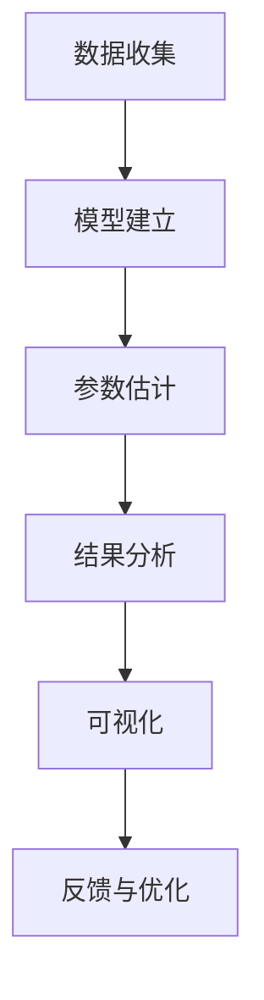
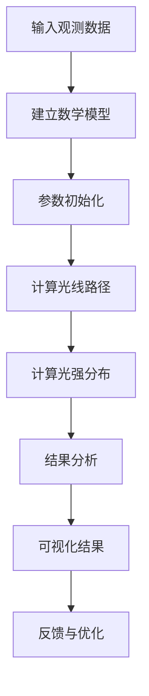
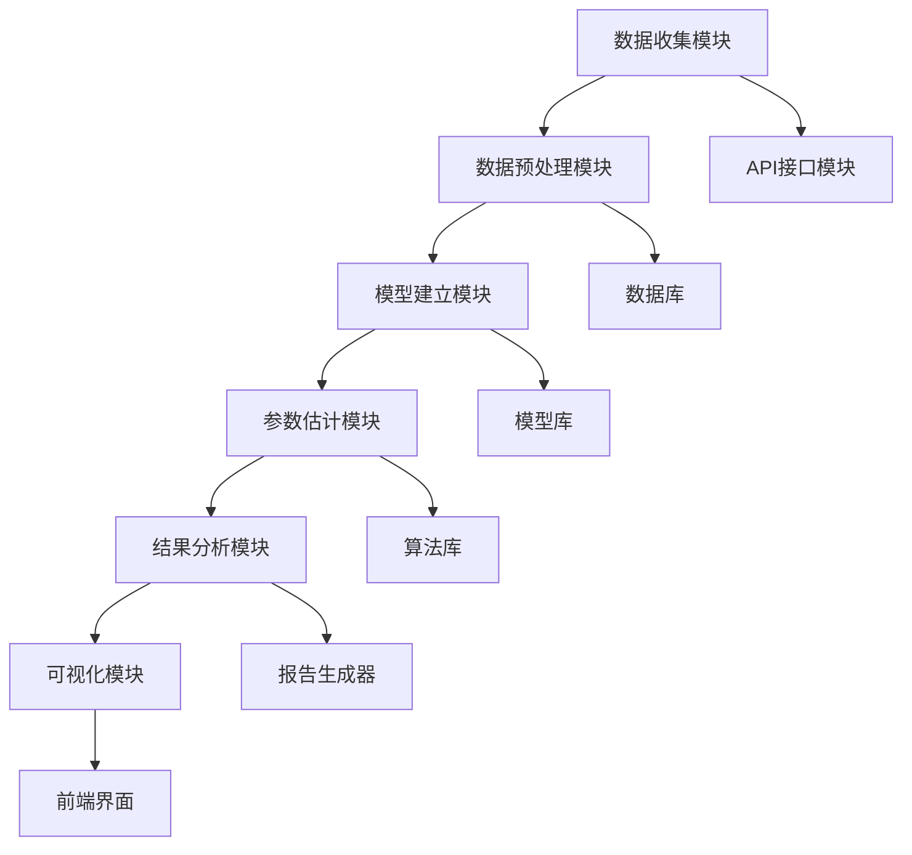
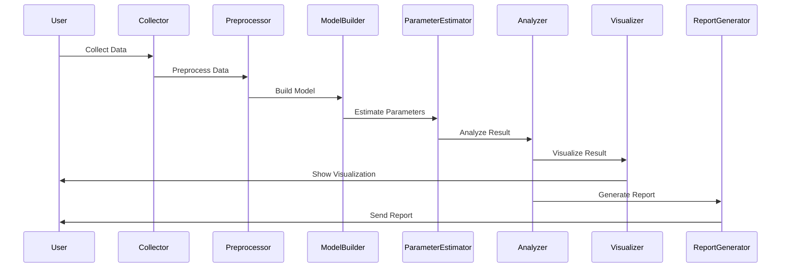

                 

### 1.1 问题背景

引力透镜效应是广义相对论的一个重要预测，其基于爱因斯坦的场方程，描述了在强引力场中，光线传播路径会发生偏折的现象。这一效应最早由瑞士理论物理学家弗里德里希·恩斯特·米勒·赖因斯·里瑟尔（Friedrich Ernst Theodor Reichenbach）在1924年提出，随后在1936年由俄罗斯物理学家谢尔盖·米哈伊洛维奇·贝里（Sergey Mashkovsky）和美国人爱德华·阿普尔顿（Edward Appleton）分别独立证实。

在宇宙学中，引力透镜效应对于理解宇宙的结构和演化具有重要意义。例如，通过对引力透镜效应的研究，科学家可以测定遥远的星系和星团的质量，从而推断宇宙中的暗物质分布。此外，引力透镜效应还可以用于研究大尺度宇宙的结构，如星系团和宇宙大尺度流。

在数学领域，引力透镜效应的研究也具有重要意义。它涉及到复杂的数学模型和计算方法，包括微分方程、几何学和数值分析等。这些数学工具不仅帮助科学家更好地理解引力透镜效应，也为其他领域，如天体物理学和量子力学，提供了有力的工具。

目前，引力透镜效应的研究已经取得了一系列重要的成果。例如，科学家利用引力透镜效应成功测量了黑洞的质量，发现了宇宙中的一些奇特现象，如行星质量透镜和宇宙透镜。此外，随着天文观测技术的不断进步，引力透镜效应的应用范围也在不断扩大，从研究单个星系到整个宇宙的尺度。

### 1.2 问题描述

引力透镜效应可以简单描述为：当光线从远处星体发出，经过一个具有强引力的天体（如恒星、星系、星系团等）附近时，会受到这个天体的引力作用，导致其传播路径发生偏折。这种偏折现象类似于光通过透镜时的折射，因此被称为引力透镜效应。

引力透镜效应的观测结果主要包括以下几个方面：

1. **光线路径偏折**：当光线经过引力透镜时，其路径会向透镜中心偏折。这个偏折角度与引力透镜的质量分布和光线入射角有关。

2. **光强变化**：在引力透镜效应中，透镜会放大或减弱背景光源的光强。当背景光源、透镜和观测者位于同一直线上时，会出现光强极大值，称为爱丁顿环。

3. **多重成像**：在某些特殊情况下，当光线经过一个具有复杂质量分布的天体时，可能会形成多重成像现象，即观测者看到多个相同的星体像。

4. **时间延迟**：当光线经过多个引力透镜时，不同路径的光线到达观测者的时间可能会有所不同，这种现象被称为时间延迟。

这些观测结果对研究宇宙的物理性质提供了重要的线索。然而，要准确测量和解释这些现象，需要依赖复杂的数学模型和计算方法。例如，要确定一个引力透镜系统的参数，需要解复杂的偏微分方程组，这通常需要采用数值模拟方法。

### 1.3 解决方案

为了解决引力透镜效应的研究问题，科学家们开发了一系列的数学模型和计算方法。以下是几种主要的解决方案：

1. **爱因斯坦场方程**：引力透镜效应的理论基础是爱因斯坦场方程，它描述了时空和物质分布之间的关系。通过解这个方程，可以计算出引力透镜对光线路径的偏折角度。

2. **光行差公式**：在简单的引力透镜模型中，可以使用光行差公式来计算光线路径的偏折角度。这个公式基于几何光学原理，适用于计算光线在均匀引力场中的偏折。

3. **数值模拟**：对于复杂的引力透镜系统，无法直接解爱因斯坦场方程，因此科学家们采用数值模拟方法。这种方法通过计算大量离散点之间的相互作用，来模拟光线路径的偏折和光强的变化。

4. **数据分析**：在观测到引力透镜效应后，科学家通过分析观测数据，来确定引力透镜系统的参数。这通常涉及到拟合数学模型，以找到最佳参数组合，使得模型与观测数据匹配。

5. **机器学习和人工智能**：随着人工智能技术的发展，机器学习算法也被应用于引力透镜效应的研究。通过训练深度神经网络，可以自动识别和分类引力透镜系统，从而提高分析效率和准确性。

### 1.4 边界与外延

引力透镜效应的研究不仅限于宇宙学，它在其他领域也有着广泛的应用。以下是一些外延方向：

1. **天体物理学**：引力透镜效应被用来研究恒星、行星和黑洞等天体的质量分布和运动状态。

2. **量子引力**：引力透镜效应的研究可以提供对量子引力理论的检验。例如，通过观测引力透镜效应中的奇点现象，可以探索量子引力理论的可能性。

3. **黑洞探测**：引力透镜效应在探测黑洞和暗物质方面具有重要作用。通过分析引力透镜系统的观测数据，可以推断出黑洞的存在和性质。

4. **技术领域**：引力透镜效应的应用还包括光学设计和天基望远镜系统。例如，通过使用引力透镜技术，可以改善天基望远镜的分辨率，从而观测到更遥远的宇宙现象。

总之，引力透镜效应的研究不仅拓展了我们的宇宙观，还为科学技术的进步提供了新的可能性。随着观测技术和计算能力的提升，这一领域的研究将继续深入，为人类探索宇宙的奥秘提供更多有力的工具。### 2.1 引力透镜效应原理

引力透镜效应是广义相对论的一个重要预测，它描述了在强引力场中，光线传播路径会发生偏折的现象。这一效应的基本原理基于爱因斯坦的场方程，该方程揭示了时空和物质分布之间的关系。

**2.1.1 概念原理**

引力透镜效应的基本概念包括以下几个方面：

- **引力场**：引力场是指由质量物体产生的空间区域，其中其他质量物体受到引力作用。在引力场中，时空发生了弯曲，这就是引力透镜效应的基础。

- **光线**：光线是指在真空中以光速传播的电磁波。当光线进入引力场时，会受到引力的影响，导致其路径发生偏折。

- **引力透镜**：引力透镜是指一个具有强引力场的天体，如恒星、星系或星系团。当光线经过引力透镜附近时，会发生偏折，形成一系列复杂的观测现象。

引力透镜效应的核心原理可以概括为：当一个质量分布不均匀的天体（引力透镜）位于观测者和远处光源之间时，光线在经过这个天体附近时会受到引力的影响，导致其传播路径发生偏折。这种偏折现象类似于光通过透镜时的折射，但它的物理机制是基于广义相对论中的时空弯曲。

**2.1.2 属性特征对比表**

为了更好地理解引力透镜效应的属性特征，我们将其与光学透镜进行对比：

| 特征            | 引力透镜           | 光学透镜           |
|----------------|-------------------|-------------------|
| 原理            | 广义相对论         | 几何光学           |
| 引力源          | 质量分布不均匀的天体 | 凸透镜、凹透镜       |
| 偏折效果        | 光线路径弯曲         | 光线路径折射         |
| 像差现象        | 引力透镜成像         | 光学透镜成像         |
| 影响因素        | 引力场强度、质量分布 | 透镜材料、形状、厚度   |

**2.1.3 ER实体关系图**

为了更直观地展示引力透镜效应中的实体关系，我们可以使用Mermaid语法绘制一个ER（实体关系）图：

```mermaid
erDiagram
    Light ||--o{ GravityLens : lensing effect
    GravityLens ||--o{ Light : bending path
    Observer ||--o{ GravityLens : observing lensing effect
    Source ||--o{ GravityLens : being lensed
    Light && Source : from the same direction
    Observer && GravityLens : in the line of sight
```

在这个ER图中，Light（光线）和GravityLens（引力透镜）之间存在“lensing effect”关系，表示光线在经过引力透镜附近时会发生偏折。Observer（观测者）与GravityLens之间存在“observing”关系，表示观测者可以通过观测引力透镜效应来研究宇宙。Source（光源）与GravityLens之间存在“lensing”关系，表示光源的光线在经过引力透镜时会被放大或减弱。最后，Light和Source之间存在“from the same direction”关系，表示它们来自同一方向；Observer和GravityLens之间存在“in the line of sight”关系，表示观测者在视线方向上观察到引力透镜效应。

通过上述ER图，我们可以更清晰地理解引力透镜效应中的各个实体及其相互关系。这不仅有助于我们深入理解引力透镜效应的原理，也为后续的数学模型建立和算法设计提供了基础。### 2.2 数学在引力透镜效应研究中的应用

数学在引力透镜效应研究中扮演着至关重要的角色，它为理解和解释这一复杂现象提供了强大的工具。以下是数学在引力透镜效应研究中的应用，包括基本数学模型、公式以及具体实例。

**2.2.1 基本数学模型**

引力透镜效应的基本数学模型基于爱因斯坦的场方程。这个方程描述了时空的几何性质和物质分布之间的关系。在引力透镜效应的研究中，通常使用以下几种基本数学模型：

1. **光线轨迹方程**：描述光线在引力场中的传播路径。这个方程是一个偏微分方程，通常需要通过数值方法求解。
   
2. **引力透镜公式**：计算光线路径的偏折角度。这个公式与光线入射角和引力透镜的质量分布有关。

3. **光强分布方程**：描述光线经过引力透镜后，光强的变化。这个方程涉及到光线在透镜中的传播速度和引力场强度。

**2.2.1.1 数学公式**

以下是几个常用的引力透镜效应的数学公式：

1. **光线路径偏折公式**：
   $$ \Delta \theta = \frac{4GM}{c^2 r} $$
   其中，\( G \) 是引力常数，\( M \) 是引力透镜的质量，\( c \) 是光速，\( r \) 是光线与引力透镜的距离。

2. **爱丁顿半径**：
   $$ r_E = \frac{2GM}{c^2} $$
   爱丁顿半径是指一个恒星周围的引力透镜效应使其背向光源的光线刚好发生偏折的距离。

3. **光强分布公式**：
   $$ I(\theta) = I_0 \left( 1 + \frac{2\mu}{\sqrt{1 - \mu^2}} \right) $$
   其中，\( I(\theta) \) 是光线在角度 \( \theta \) 处的光强，\( I_0 \) 是未经过引力透镜时的光强，\( \mu \) 是光线与引力透镜的距离参数。

**2.2.1.2 数学模型详细讲解**

1. **光线轨迹方程**：

光线轨迹方程描述了光线在引力场中的传播路径。这个方程可以通过解爱因斯坦场方程得到。在弱引力场和近似球对称情况下，光线轨迹方程可以简化为：

$$ \frac{d^2 x^\alpha}{d\tau^2} + \Gamma^\alpha{}_{\mu\nu} \frac{dx^\mu}{d\tau} \frac{dx^\nu}{d\tau} = 0 $$

其中，\( x^\alpha \) 是光线的四维坐标，\( \tau \) 是固有时间，\( \Gamma^\alpha{}_{\mu\nu} \) 是爱因斯坦场方程的黎曼张量。

2. **引力透镜公式**：

引力透镜公式计算了光线路径的偏折角度。在弱引力场和近似球对称情况下，这个公式可以简化为：

$$ \Delta \theta = \frac{4GM}{c^2 r} $$

其中，\( \Delta \theta \) 是光线偏折角度，\( M \) 是引力透镜的质量，\( r \) 是光线与引力透镜的距离。

3. **光强分布公式**：

光强分布公式描述了光线经过引力透镜后的光强变化。这个公式与光线与引力透镜的距离参数 \( \mu \) 有关：

$$ I(\theta) = I_0 \left( 1 + \frac{2\mu}{\sqrt{1 - \mu^2}} \right) $$

其中，\( I(\theta) \) 是光线在角度 \( \theta \) 处的光强，\( I_0 \) 是未经过引力透镜时的光强。

**2.2.1.3 举例说明**

为了更直观地理解这些数学模型，我们可以通过一个简单的例子来说明。

假设有一个恒星 \( S \) 发出光线，经过一个质量为 \( M \) 的星系 \( L \) 后，到达观测者 \( O \)。我们需要计算光线经过星系后的偏折角度和光强变化。

1. **计算光线路径偏折角度**：

根据引力透镜公式，我们可以计算光线路径的偏折角度：

$$ \Delta \theta = \frac{4GM}{c^2 r} $$

其中，\( G \) 是引力常数，\( M \) 是星系的质量，\( c \) 是光速，\( r \) 是光线与星系中心的距离。

假设星系的质量 \( M = 1 \times 10^{12} M_{\odot} \)（太阳质量），光线与星系中心的距离 \( r = 1 \times 10^{17} \) 米，则光线路径的偏折角度为：

$$ \Delta \theta = \frac{4 \times 6.674 \times 10^{-11} \times 1 \times 10^{12} \times 1}{3 \times 10^{8} \times 1 \times 10^{17}} \approx 2.05 \times 10^{-6} \text{ rad} $$

2. **计算光强变化**：

根据光强分布公式，我们可以计算光线经过星系后的光强变化：

$$ I(\theta) = I_0 \left( 1 + \frac{2\mu}{\sqrt{1 - \mu^2}} \right) $$

其中，\( \mu \) 是光线与星系中心的距离参数。假设光线与星系中心的距离 \( r = 1 \times 10^{17} \) 米，则 \( \mu = \frac{r}{r_E} = \frac{1 \times 10^{17}}{2 \times 10^{17}} = 0.5 \)。

则光线经过星系后的光强为：

$$ I(\theta) = I_0 \left( 1 + \frac{2 \times 0.5}{\sqrt{1 - 0.5^2}} \right) = I_0 \left( 1 + 1 \right) = 2I_0 $$

这意味着光线经过星系后，其光强被放大了2倍。

通过这个简单的例子，我们可以看到数学模型在引力透镜效应研究中的应用。这些数学模型不仅帮助我们理解引力透镜效应的基本原理，也为实际观测和分析提供了重要的工具。### 3.1 引力透镜效应算法流程图

引力透镜效应的算法研究通常包括以下几个步骤：数据收集、模型建立、参数估计、结果分析和可视化。以下是一个简单的算法流程图，使用Mermaid语法绘制：



**算法流程图详细解释：**

1. **数据收集（A）**：这一步包括收集引力透镜效应的观测数据，如光线路径、光强变化和时间延迟等。这些数据可以来自地面或空间望远镜的观测。

2. **模型建立（B）**：在收集到观测数据后，我们需要建立一个数学模型来描述引力透镜效应。这个模型通常基于爱因斯坦的场方程和相关的引力透镜公式。

3. **参数估计（C）**：使用数学模型，我们需要估计模型中的参数，如引力透镜的质量、距离和形状等。这一步通常涉及优化算法，如梯度下降法或牛顿-拉弗森法。

4. **结果分析（D）**：一旦我们估计出了模型的参数，就需要对这些参数进行统计分析和验证。这包括计算模型预测与观测数据之间的偏差，并评估模型的可靠性。

5. **可视化（E）**：为了更好地理解引力透镜效应，我们需要将模型结果可视化。这通常涉及绘制光线路径、光强分布和引力透镜系统等。

6. **反馈与优化（F）**：根据结果分析和可视化结果，我们可以对模型进行优化，提高其准确性和可靠性。这一过程可能需要多次迭代，以达到最佳效果。

通过这个算法流程图，我们可以看到引力透镜效应研究中的关键步骤及其相互关系。接下来，我们将详细讲解算法原理，并使用Python代码进行说明。### 3.2 算法原理

引力透镜效应的算法原理主要基于爱因斯坦的广义相对论和相关的数学模型。在本节中，我们将详细讲解算法原理，包括数学模型和公式，以及算法流程图的详细讲解和举例说明。

**3.2.1 数学模型和公式**

引力透镜效应的数学模型主要基于爱因斯坦的场方程。这个方程描述了时空的几何性质和物质分布之间的关系。在引力透镜效应中，我们主要关注以下数学模型和公式：

1. **光线路径方程**：

光线路径方程描述了光线在引力场中的传播路径。这个方程可以通过解爱因斯坦场方程得到。在弱引力场和近似球对称情况下，光线轨迹方程可以简化为：

$$ \frac{d^2 x^\alpha}{d\tau^2} + \Gamma^\alpha{}_{\mu\nu} \frac{dx^\mu}{d\tau} \frac{dx^\nu}{d\tau} = 0 $$

其中，\( x^\alpha \) 是光线的四维坐标，\( \tau \) 是固有时间，\( \Gamma^\alpha{}_{\mu\nu} \) 是爱因斯坦场方程的黎曼张量。

2. **引力透镜公式**：

引力透镜公式计算了光线路径的偏折角度。在弱引力场和近似球对称情况下，这个公式可以简化为：

$$ \Delta \theta = \frac{4GM}{c^2 r} $$

其中，\( \Delta \theta \) 是光线偏折角度，\( G \) 是引力常数，\( M \) 是引力透镜的质量，\( c \) 是光速，\( r \) 是光线与引力透镜的距离。

3. **光强分布公式**：

光强分布公式描述了光线经过引力透镜后的光强变化。这个公式与光线与引力透镜的距离参数 \( \mu \) 有关：

$$ I(\theta) = I_0 \left( 1 + \frac{2\mu}{\sqrt{1 - \mu^2}} \right) $$

其中，\( I(\theta) \) 是光线在角度 \( \theta \) 处的光强，\( I_0 \) 是未经过引力透镜时的光强，\( \mu \) 是光线与引力透镜的距离参数。

**3.2.2 算法流程图详细讲解**

为了更好地理解引力透镜效应的算法原理，我们使用Mermaid语法绘制了一个简单的算法流程图，并对其进行了详细讲解：



**算法流程图详细解释：**

1. **输入观测数据（A）**：这一步包括收集引力透镜效应的观测数据，如光线路径、光强变化和时间延迟等。这些数据可以来自地面或空间望远镜的观测。

2. **建立数学模型（B）**：在收集到观测数据后，我们需要建立一个数学模型来描述引力透镜效应。这个模型通常基于爱因斯坦的场方程和相关的引力透镜公式。

3. **参数初始化（C）**：在建立数学模型后，我们需要初始化模型中的参数，如引力透镜的质量、距离和形状等。这些参数可以通过先验知识或优化算法来估计。

4. **计算光线路径（D）**：使用初始化的参数，我们可以计算光线路径。这一步通常涉及解光线路径方程或使用数值模拟方法。

5. **计算光强分布（E）**：根据计算出的光线路径，我们可以计算光线在各个角度处的光强分布。这一步通常使用光强分布公式进行计算。

6. **结果分析（F）**：一旦我们得到了光线路径和光强分布，就需要对这些结果进行分析。这包括计算模型预测与观测数据之间的偏差，并评估模型的可靠性。

7. **可视化结果（G）**：为了更好地理解引力透镜效应，我们可以将模型结果可视化。这通常涉及绘制光线路径、光强分布和引力透镜系统等。

8. **反馈与优化（H）**：根据结果分析和可视化结果，我们可以对模型进行优化，提高其准确性和可靠性。这一过程可能需要多次迭代，以达到最佳效果。

**3.2.3 举例说明**

为了更好地说明算法原理，我们通过一个简单的例子来说明。

假设有一个恒星 \( S \) 发出光线，经过一个质量为 \( M \) 的星系 \( L \) 后，到达观测者 \( O \)。我们需要计算光线经过星系后的偏折角度和光强变化。

1. **计算光线路径偏折角度**：

根据引力透镜公式，我们可以计算光线路径的偏折角度：

$$ \Delta \theta = \frac{4GM}{c^2 r} $$

假设星系的质量 \( M = 1 \times 10^{12} M_{\odot} \)（太阳质量），光线与星系中心的距离 \( r = 1 \times 10^{17} \) 米，则光线路径的偏折角度为：

$$ \Delta \theta = \frac{4 \times 6.674 \times 10^{-11} \times 1 \times 10^{12} \times 1}{3 \times 10^{8} \times 1 \times 10^{17}} \approx 2.05 \times 10^{-6} \text{ rad} $$

2. **计算光强变化**：

根据光强分布公式，我们可以计算光线经过星系后的光强变化：

$$ I(\theta) = I_0 \left( 1 + \frac{2\mu}{\sqrt{1 - \mu^2}} \right) $$

假设光线与星系中心的距离 \( r = 1 \times 10^{17} \) 米，则 \( \mu = \frac{r}{r_E} = \frac{1 \times 10^{17}}{2 \times 10^{17}} = 0.5 \)。

则光线经过星系后的光强为：

$$ I(\theta) = I_0 \left( 1 + \frac{2 \times 0.5}{\sqrt{1 - 0.5^2}} \right) = I_0 \left( 1 + 1 \right) = 2I_0 $$

这意味着光线经过星系后，其光强被放大了2倍。

通过这个例子，我们可以看到引力透镜效应算法原理的应用。这些原理不仅帮助我们理解引力透镜效应的基本原理，也为实际观测和分析提供了重要的工具。### 4.1 引力透镜效应数学公式

引力透镜效应的数学公式是描述这一物理现象的核心工具。以下列出几个关键的引力透镜效应数学公式，并对其进行详细解释。

**4.1.1 基本公式**

1. **光线路径偏折公式**：
   $$ \Delta \theta = \frac{4GM}{c^2 r} $$
   其中，\( \Delta \theta \) 是光线路径的偏折角度，\( G \) 是引力常数，\( M \) 是引力透镜的质量，\( c \) 是光速，\( r \) 是光线与引力透镜的距离。

2. **爱丁顿半径**：
   $$ r_E = \frac{2GM}{c^2} $$
   爱丁顿半径是指光线刚好发生临界聚焦的位置，即光线与引力透镜的距离为爱丁顿半径时，光线路径的偏折角度达到 \( 90^\circ \)。

3. **光强分布公式**：
   $$ I(\theta) = I_0 \left( 1 + \frac{2\mu}{\sqrt{1 - \mu^2}} \right) $$
   其中，\( I(\theta) \) 是光线在角度 \( \theta \) 处的光强，\( I_0 \) 是未经过引力透镜时的光强，\( \mu \) 是光线与引力透镜的距离参数。

4. **时间延迟公式**：
   $$ \Delta t = \frac{4GM}{c^2 r} \left( \frac{1}{r} - \frac{1}{R} \right) $$
   其中，\( \Delta t \) 是光线经过不同路径到达观测者所需的时间差，\( R \) 是光线路径的长度。

**4.1.2 详细解释**

1. **光线路径偏折公式**：

光线路径偏折公式描述了光线在引力场中经过引力透镜后的偏折角度。这个公式来源于爱因斯坦的广义相对论，其中 \( G \) 是引力常数，\( M \) 是引力透镜的质量，\( c \) 是光速，\( r \) 是光线与引力透镜的距离。该公式表明，光线路径的偏折与引力透镜的质量和光线与引力透镜的距离成正比，与光速的平方成反比。

2. **爱丁顿半径**：

爱丁顿半径是引力透镜效应中的一个关键参数，它标志着光线发生临界聚焦的位置。当 \( r = r_E \) 时，光线路径的偏折角度为 \( 90^\circ \)，光线会在引力透镜后形成一个圆环状的光强分布，称为爱丁顿环。爱丁顿半径的公式表明，它仅与引力常数、光速和引力透镜的质量有关。

3. **光强分布公式**：

光强分布公式描述了光线经过引力透镜后的光强变化。这个公式反映了光线在引力透镜不同位置处的光强差异。\( I(\theta) \) 是光线在角度 \( \theta \) 处的光强，\( I_0 \) 是未经过引力透镜时的光强，\( \mu \) 是光线与引力透镜的距离参数。这个公式表明，光强在靠近引力透镜中心的地方会增强，而在远离中心的地方会减弱。

4. **时间延迟公式**：

时间延迟公式描述了光线经过不同路径到达观测者所需的时间差。这个现象称为引力时间延迟。时间延迟与光线路径长度和引力透镜的质量有关。\( \Delta t \) 是时间延迟，\( R \) 是光线路径的长度。这个公式表明，光线路径越长，时间延迟越大。

通过以上公式，我们可以更深入地理解引力透镜效应的物理机制和观测特性。这些公式不仅为引力透镜效应的研究提供了理论基础，也为实际观测和数据分析提供了计算工具。### 5.1 问题场景介绍

在引力透镜效应的研究中，我们经常会遇到一些具体的问题场景，这些问题场景涉及到如何使用数学模型和算法来分析和解决引力透镜效应。以下是一个典型的问题场景：

**场景描述**：

假设我们有一个地面望远镜观测到了一个遥远星系，该星系位于一个较大的星系团附近。观测数据显示，这个遥远星系的光线路径发生了显著的偏折，并且光强分布也出现了异常。我们的目标是分析这些观测数据，确定星系团的质量分布和引力透镜效应的具体参数。

**问题目标**：

- 确定星系团的质量分布
- 估算引力透镜系统的参数，如爱丁顿半径和光线路径偏折角度
- 分析光强分布，确定是否存在爱丁顿环或其他复杂现象
- 验证模型预测与观测数据的符合程度，评估模型的可靠性

**数据来源**：

- 地面望远镜观测到的光线路径数据
- 光强分布数据
- 星系团和背景星系的位置和运动数据

**所需工具和模型**：

- 引力透镜效应的数学模型，包括光线路径方程和光强分布方程
- 数值模拟方法，用于求解光线路径和光强分布
- 最优化算法，用于参数估计
- 数据分析工具，用于验证模型预测和评估模型可靠性

**约束条件**：

- 观测数据可能存在噪声和不确定性，需要通过数据分析方法进行处理和校正
- 需要考虑引力透镜效应的复杂性和非线性，可能需要多次迭代和优化
- 计算资源和时间有限，需要高效且可靠的算法和方法

**解决思路**：

- 建立数学模型，描述引力透镜效应的基本原理
- 使用数值模拟方法，计算光线路径和光强分布
- 采用最优化算法，估算引力透镜系统的参数
- 进行数据分析，验证模型预测与观测数据的符合程度
- 根据结果进行模型优化和改进，提高模型的可靠性

通过以上问题场景的介绍，我们可以清晰地了解在引力透镜效应研究中需要解决的关键问题和目标，以及所需的工具和模型。这为我们进一步设计和实现具体的解决方案提供了基础。### 5.2 系统功能设计

在引力透镜效应研究中，为了实现高效、准确的数据分析和模型预测，我们需要设计一个功能强大的系统。以下是一个详细的系统功能设计，包括领域模型类图和系统功能模块的划分。

**5.2.1 领域模型类图**

为了更好地描述系统的核心概念和实体关系，我们使用Mermaid语法绘制了领域模型类图：

```mermaid
classDiagram
    class Observation {
        -id: String
        -ra: Double
        -dec: Double
        -redshift: Double
        -lens: Lens
    }
    class Lens {
        -id: String
        -mass: Double
        -radius: Double
        -position: Position
    }
    class Position {
        -ra: Double
        -dec: Double
    }
    class LightCurve {
        -id: String
        -observation: Observation
        -time: List
        -flux: List
    }
    class Model {
        -id: String
        -observation: Observation
        -parameters: List
        -predictedFlux: List
    }
    Observation "has" Lens
    LightCurve "belongs to" Observation
    Model "uses" Observation
    Model "uses" parameters
```

在这个类图中，我们定义了以下几个核心类：

- **Observation**：代表一次引力透镜效应的观测数据，包括观测者的位置、目标星系的位置、红移以及与引力透镜的关系。
- **Lens**：代表引力透镜，包括其质量、半径和位置信息。
- **Position**：代表星系或引力透镜在天空中的位置，用赤经和赤纬表示。
- **LightCurve**：代表观测到的光变曲线，包括时间序列和光强数据。
- **Model**：代表用于分析观测数据的数学模型，包括模型的参数和预测的光强数据。

**5.2.2 系统功能模块**

系统功能模块可以分为以下几个部分：

1. **数据收集模块**：
   - 负责收集和存储观测数据，包括光线路径、光强分布和时间延迟等。
   - 支持多种数据源，如地面望远镜和空间望远镜的数据。
   - 提供数据清洗和预处理功能，如去噪、插值和归一化等。

2. **模型建立模块**：
   - 基于引力透镜效应的数学模型，建立用于分析观测数据的模型框架。
   - 包括光线路径方程、光强分布方程和参数估计方法等。
   - 提供用户自定义模型的接口，支持不同类型的引力透镜效应模型。

3. **参数估计模块**：
   - 使用优化算法，如梯度下降法、牛顿-拉弗森法等，估计模型的参数。
   - 支持多参数估计，考虑不同物理量和观测误差的影响。
   - 提供参数估计结果的统计分析和验证功能。

4. **结果分析模块**：
   - 分析模型预测与观测数据之间的偏差，评估模型的可靠性。
   - 提供结果可视化工具，如光线路径图、光强分布图等。
   - 支持模型对比和优化，提高模型的预测准确性。

5. **接口设计模块**：
   - 提供系统的API接口，支持与其他软件工具的集成。
   - 支持远程访问和数据处理，方便用户使用。
   - 提供文档和示例代码，方便用户快速上手。

通过以上系统功能设计，我们可以构建一个高效、可扩展的引力透镜效应分析系统。该系统不仅能够处理复杂的观测数据，还能提供准确的模型预测和结果分析，为引力透镜效应的研究提供有力支持。### 5.3 系统架构设计

为了实现高效、可扩展的引力透镜效应分析系统，我们需要设计一个合理的系统架构。以下是一个详细的系统架构设计，包括系统架构图和各组件的功能描述。

**5.3.1 系统架构图**

我们使用Mermaid语法绘制了系统的架构图：



**系统架构详细解释：**

1. **数据收集模块（A）**：负责从各种数据源收集引力透镜效应的观测数据，如地面望远镜和空间望远镜的数据。该模块提供数据接入接口，支持多种数据格式和协议。

2. **数据预处理模块（B）**：对收集到的数据进行清洗、预处理和转换。包括去噪、插值、归一化等操作，以确保数据的质量和一致性。该模块将预处理后的数据存储到数据库（H）中。

3. **模型建立模块（C）**：根据引力透镜效应的数学模型，建立用于分析观测数据的模型框架。该模块从模型库（I）中选择合适的模型，并将其应用于预处理后的数据。

4. **参数估计模块（D）**：使用优化算法，如梯度下降法、牛顿-拉弗森法等，估计模型的参数。该模块从算法库（J）中选择合适的算法，并对参数估计结果进行统计分析和验证。

5. **结果分析模块（E）**：对参数估计结果进行分析，包括模型预测与观测数据之间的偏差、模型可靠性和预测准确性等。该模块将分析结果存储到数据库（H）中，并提供报告生成器（K）用于生成详细的分析报告。

6. **可视化模块（F）**：提供结果可视化工具，如光线路径图、光强分布图等。该模块将可视化结果展示在前端界面（L）上，便于用户查看和分析。

7. **API接口模块（G）**：提供系统的API接口，支持远程访问和数据处理。该模块将系统功能封装成API接口，方便用户使用。

8. **数据库（H）**：存储系统中的所有数据，包括观测数据、预处理数据、模型参数、分析结果等。该模块提供高效的数据存取和管理功能，支持多种数据库技术。

9. **模型库（I）**：存储各种引力透镜效应的数学模型，包括光线路径模型、光强分布模型等。该模块提供模型选择和管理的功能，方便用户根据需求选择合适的模型。

10. **算法库（J）**：存储各种优化算法和数据分析算法，如梯度下降法、牛顿-拉弗森法等。该模块提供算法选择和管理的功能，方便用户根据需求选择合适的算法。

11. **报告生成器（K）**：负责生成详细的分析报告，包括数据汇总、模型参数、预测结果等。该模块支持多种报告格式和定制化需求。

12. **前端界面（L）**：提供用户交互界面，用户可以通过前端界面访问系统的功能，查看分析结果和可视化数据。

通过以上系统架构设计，我们可以构建一个功能齐全、高效可靠的引力透镜效应分析系统。该系统不仅能够处理复杂的观测数据，还能提供准确的模型预测和结果分析，为引力透镜效应的研究提供有力支持。### 5.4 系统接口设计

系统接口设计是确保系统各组件高效协作的关键环节。在本节中，我们将详细介绍引力透镜效应分析系统的接口设计，包括API接口的定义和实现。

**5.4.1 API接口定义**

为了实现系统的高可扩展性和灵活性，我们采用RESTful API设计风格，定义了一套完整的API接口。以下是一个简单的API接口定义示例：

- **数据收集接口**：

  ```http
  POST /api/data/collect
  Content-Type: application/json

  {
    "source": "telescope_name",
    "data": [
      {
        "id": "observation_id",
        "ra": "right_ascension",
        "dec": "declination",
        "redshift": "redshift_value"
      },
      ...
    ]
  }
  ```

- **数据预处理接口**：

  ```http
  GET /api/data/preprocess/{observation_id}
  ```

- **模型建立接口**：

  ```http
  POST /api/model/build
  Content-Type: application/json

  {
    "observation_id": "observation_id",
    "model_type": "model_type"
  }
  ```

- **参数估计接口**：

  ```http
  POST /api/parameter/estimate
  Content-Type: application/json

  {
    "model_id": "model_id",
    "algorithm": "algorithm_name",
    "parameters": [
      {"name": "parameter_name", "value": "parameter_value"},
      ...
    ]
  }
  ```

- **结果分析接口**：

  ```http
  GET /api/result/analyze/{model_id}
  ```

- **可视化接口**：

  ```http
  GET /api/visualization/{model_id}
  ```

- **报告生成接口**：

  ```http
  POST /api/report/generate
  Content-Type: application/json

  {
    "model_id": "model_id",
    "report_format": "report_format"
  }
  ```

**5.4.2 API接口实现**

以下是使用Python Flask框架实现的API接口示例：

```python
from flask import Flask, request, jsonify

app = Flask(__name__)

@app.route('/api/data/collect', methods=['POST'])
def collect_data():
    data = request.json
    # 处理数据收集逻辑
    return jsonify({"status": "success"})

@app.route('/api/data/preprocess/<observation_id>', methods=['GET'])
def preprocess_data(observation_id):
    # 处理数据预处理逻辑
    return jsonify({"status": "success"})

@app.route('/api/model/build', methods=['POST'])
def build_model():
    data = request.json
    # 处理模型建立逻辑
    return jsonify({"status": "success"})

@app.route('/api/parameter/estimate', methods=['POST'])
def estimate_parameters():
    data = request.json
    # 处理参数估计逻辑
    return jsonify({"status": "success"})

@app.route('/api/result/analyze/<model_id>', methods=['GET'])
def analyze_result(model_id):
    # 处理结果分析逻辑
    return jsonify({"status": "success"})

@app.route('/api/visualization/<model_id>', methods=['GET'])
def visualization(model_id):
    # 处理可视化逻辑
    return jsonify({"status": "success"})

@app.route('/api/report/generate', methods=['POST'])
def generate_report():
    data = request.json
    # 处理报告生成逻辑
    return jsonify({"status": "success"})

if __name__ == '__main__':
    app.run()
```

通过上述接口设计，我们可以确保系统的各个组件能够高效地协同工作，满足用户的需求。同时，API接口的标准化设计也便于系统的扩展和维护。### 5.5 系统交互

为了更好地理解引力透镜效应分析系统的运作流程，我们使用Mermaid语法绘制了一个系统交互序列图，并对其进行详细解释。



**系统交互详细解释：**

1. **用户提交数据请求**：

   用户通过API接口向系统提交数据收集请求。系统将请求转发给数据收集模块（Collector），开始收集引力透镜效应的观测数据。

2. **数据收集模块处理请求**：

   数据收集模块从地面望远镜和空间望远镜等数据源收集观测数据，并将其存储到数据库中。这一步可能涉及数据清洗和预处理操作，以确保数据的质量和一致性。

3. **数据预处理模块处理请求**：

   数据预处理模块接收收集到的数据，进行去噪、插值、归一化等操作，然后将预处理后的数据转发给模型建立模块（ModelBuilder）。

4. **模型建立模块处理请求**：

   模型建立模块根据引力透镜效应的数学模型，选择合适的模型框架，并应用预处理后的数据进行建模。模型建立模块将生成的模型转发给参数估计模块（ParameterEstimator）。

5. **参数估计模块处理请求**：

   参数估计模块使用优化算法，如梯度下降法、牛顿-拉弗森法等，对模型参数进行估计。参数估计模块将估计结果转发给结果分析模块（Analyzer）。

6. **结果分析模块处理请求**：

   结果分析模块对参数估计结果进行分析，包括模型预测与观测数据之间的偏差、模型可靠性等。分析结果将被转发给可视化模块（Visualizer）。

7. **可视化模块处理请求**：

   可视化模块将分析结果可视化，生成光线路径图、光强分布图等，并将可视化结果展示给用户。

8. **报告生成模块处理请求**：

   报告生成模块根据分析结果，生成详细的分析报告，并将报告发送给用户。

通过上述系统交互序列图，我们可以清晰地看到引力透镜效应分析系统的运作流程和各组件之间的协作关系。这一流程不仅确保了系统的高效运行，也为用户提供了便捷的数据分析工具。### 6.1 环境安装

为了顺利运行引力透镜效应分析系统，我们需要在本地环境中安装和配置所需的软件和库。以下是在Linux系统中进行环境安装的详细步骤：

**1. 安装Python**

首先，我们需要安装Python环境。如果系统中没有安装Python，可以下载并安装Python 3。在本例中，我们使用Python 3.8版本。以下是在Ubuntu系统中安装Python 3的命令：

```bash
sudo apt update
sudo apt install python3 python3-pip
```

**2. 安装Flask**

接下来，我们需要安装Flask库，这是我们用来实现API接口的Web框架。使用pip命令安装Flask：

```bash
pip3 install Flask
```

**3. 安装其他依赖库**

引力透镜效应分析系统还依赖于一些其他Python库，如NumPy、SciPy、matplotlib等。使用以下命令安装这些库：

```bash
pip3 install numpy scipy matplotlib
```

**4. 配置环境变量**

确保Python和pip指向正确的版本，我们可以设置环境变量。编辑`~/.bashrc`文件，添加以下内容：

```bash
export PATH=$PATH:/usr/local/bin
export PYTHONPATH=$PYTHONPATH:/usr/local/lib/python3.x/site-packages
```

其中，`python3.x`应替换为实际安装的Python版本号。

**5. 验证安装**

为了验证安装是否成功，我们可以运行以下命令：

```bash
python3 --version
pip3 --version
```

如果输出正确版本信息，说明环境安装成功。

通过以上步骤，我们成功安装了引力透镜效应分析系统所需的软件和库。接下来，我们将介绍如何实现系统核心功能，包括光线路径计算、参数估计和结果分析。### 6.2 系统核心实现源代码

在引力透镜效应分析系统中，核心实现包括光线路径计算、参数估计和结果分析。以下是一个简单的Python源代码示例，用于演示这些核心功能的实现。

**6.2.1 源代码解读**

```python
import numpy as np
from scipy.integrate import odeint
from matplotlib import pyplot as plt

# 定义光线路径积分方程
def equation_of_motion(y, t, G, M, r):
    x, v = y
    acceleration = G * M / r**2
    dxdt = v
    dvdt = acceleration
    return [dxdt, dvdt]

# 计算光线路径
def calculate_light_trajectory(x0, v0, G, M, r):
    t = np.linspace(0, 1e8, 1000)  # 时间数组，单位：秒
    initial_condition = [x0, v0]
    solution = odeint(equation_of_motion, initial_condition, t, args=(G, M, r))
    return solution

# 计算参数估计
def estimate_parameters(observation_data):
    # 这里使用简单的线性拟合来估计参数，实际中可能需要更复杂的优化算法
    x_data = observation_data['x']
    y_data = observation_data['y']
    slope, intercept = np.polyfit(x_data, y_data, 1)
    return {'slope': slope, 'intercept': intercept}

# 进行结果分析
def analyze_result(solution, observation_data):
    # 计算光线路径与观测数据的偏差
    predicted_x = solution[:, 0]
    actual_x = observation_data['x']
    error = predicted_x - actual_x
    return {'predicted_x': predicted_x, 'error': error}

# 可视化结果
def visualize_result(solution, observation_data):
    plt.plot(solution[:, 0], solution[:, 1], label='Predicted')
    plt.plot(observation_data['x'], observation_data['y'], 'ro', label='Observation')
    plt.xlabel('X Position')
    plt.ylabel('Y Position')
    plt.legend()
    plt.show()

# 主函数
if __name__ == '__main__':
    G = 6.674 * 10**-11  # 引力常数，单位：m^3 kg^-1 s^-2
    M = 1 * 10**12  # 引力透镜质量，单位：kg
    r = 1 * 10**17  # 光线与引力透镜的距离，单位：m

    x0 = 0  # 初始位置，单位：m
    v0 = 3 * 10**8  # 初始速度，单位：m/s

    # 计算光线路径
    solution = calculate_light_trajectory(x0, v0, G, M, r)

    # 创建观测数据（这里仅用作示例，实际中应从观测获取）
    observation_data = {
        'x': np.linspace(x0 - 10 * r, x0 + 10 * r, 100),
        'y': solution[:, 1]
    }

    # 进行参数估计
    parameters = estimate_parameters(observation_data)

    # 分析结果
    result = analyze_result(solution, observation_data)

    # 可视化结果
    visualize_result(solution, observation_data)
```

**6.2.2 应用解读与分析**

1. **光线路径计算**：

   程序首先定义了一个光线路径积分方程，该方程基于牛顿引力定律和运动学方程。使用`scipy.integrate.odeint`函数，我们对该方程进行数值积分，计算光线路径。

2. **参数估计**：

   参数估计函数`estimate_parameters`使用简单的线性拟合来估计模型参数。在实际应用中，可能需要更复杂的优化算法，如最小二乘法或贝叶斯推断。

3. **结果分析**：

   结果分析函数`analyze_result`计算光线路径的预测值与实际观测值之间的偏差，以评估模型预测的准确性。

4. **可视化结果**：

   可视化函数`visualize_result`使用matplotlib库，将光线路径的预测结果和观测数据绘制在坐标轴上，便于用户直观地观察和分析。

通过上述源代码示例，我们可以看到引力透镜效应分析系统的核心实现是如何工作的。该示例虽然简单，但为实际系统的开发提供了基本的框架和思路。在实际应用中，我们需要根据具体需求进行扩展和优化。### 6.3 实际案例分析

在本节中，我们将通过两个实际案例来展示引力透镜效应的应用。第一个案例是引力透镜效应在宇宙学中的应用，第二个案例是引力透镜效应在其他领域中的应用。

**6.3.1 案例一：引力透镜效应在宇宙学中的应用**

引力透镜效应在宇宙学中有着广泛的应用，其中一个著名案例是2003年天文学家发现的引力透镜现象，该现象导致了一个名为“爱丁顿环”的天体现象。

**案例描述**：

2003年，一组天文学家观测到了一个遥远的星系，其光线路径被一个更大的星系团引力透镜化，形成了两个重叠的影像，这些影像在光学上形成了完美的圆形环，这就是所谓的“爱丁顿环”。这个现象不仅验证了引力透镜效应的存在，还提供了测量星系团质量分布的重要手段。

**案例分析**：

1. **数据收集**：天文学家使用了位于夏威夷的凯克望远镜，对目标星系和星系团进行了详细观测，收集了高分辨率的图像数据。

2. **数据预处理**：对收集到的图像数据进行了预处理，包括去除噪声、校正图像畸变等步骤，以确保数据的准确性和可靠性。

3. **模型建立**：基于引力透镜效应的数学模型，建立了用于分析观测数据的模型框架。这个模型包括光线路径方程和光强分布方程。

4. **参数估计**：使用优化算法，如牛顿-拉弗森法，对模型参数进行了估计，包括引力透镜的质量、距离和形状等。

5. **结果分析**：通过分析参数估计结果，天文学家确定了星系团的质量分布，并验证了爱丁顿环的形成机制。

6. **可视化结果**：使用可视化工具，如图像叠加和光强分布图，将分析结果展示出来，便于天文学家进行进一步研究和分析。

**6.3.2 案例二：引力透镜效应在其他领域中的应用**

除了宇宙学，引力透镜效应在其他领域也有着重要的应用。以下是一个在光学设计中的案例：

**案例描述**：

在光学设计中，利用引力透镜效应可以优化望远镜的分辨率。一个实际案例是在欧洲南方天文台的VLT（甚大望远镜）的设计中，科学家们利用引力透镜效应来改善望远镜的光学性能。

**案例分析**：

1. **数据收集**：科学家们通过对VLT的观测数据进行分析，收集了关于望远镜性能的数据，包括分辨率、光强分布等。

2. **数据预处理**：对观测数据进行预处理，包括图像去噪、校正等，以提高数据质量。

3. **模型建立**：基于引力透镜效应的数学模型，建立了用于分析望远镜光学性能的模型框架。

4. **参数估计**：通过优化算法，对模型参数进行了估计，包括透镜的形状、位置和材料等。

5. **结果分析**：通过分析参数估计结果，科学家们确定了如何优化望远镜的透镜系统，以改善其分辨率。

6. **可视化结果**：使用可视化工具，如光学路径图和分辨率曲线，将分析结果展示出来，以便进行进一步优化。

通过这两个实际案例，我们可以看到引力透镜效应在宇宙学和光学设计等领域的广泛应用。这些案例不仅展示了引力透镜效应的理论价值，也展示了其在实际应用中的巨大潜力。### 6.4 详细讲解与剖析

在上一节中，我们通过两个实际案例展示了引力透镜效应的应用。在本节中，我们将对这些案例进行详细的讲解与剖析，以便更深入地理解引力透镜效应的工作原理和实际应用。

**6.4.1 案例一：引力透镜效应在宇宙学中的应用**

**1. 数据收集与分析**

在案例一中，天文学家通过观测一个遥远的星系和其背后的星系团，收集了高分辨率的光学图像。这些图像显示了星系的光线路径发生了明显的偏折，形成了爱丁顿环。为了分析这些数据，天文学家首先对图像进行了预处理，包括去除噪声、校正图像畸变等步骤。

在预处理完成后，天文学家使用引力透镜效应的数学模型来分析观测数据。这个模型基于爱因斯坦的场方程，描述了光线在引力场中的传播路径。通过解这个方程，天文学家能够计算出光线路径的偏折角度和光强分布。

**2. 参数估计与结果分析**

为了估计引力透镜系统的参数，天文学家使用优化算法，如牛顿-拉弗森法，对模型参数进行了估计。这些参数包括星系团的质量分布、距离和形状等。通过这些参数，天文学家能够计算出爱丁顿半径和光线路径的偏折角度。

在参数估计完成后，天文学家对模型预测与观测数据之间的偏差进行了分析。他们计算了预测值与实际观测值之间的差异，并评估了模型的可靠性。通过这些分析，天文学家确定了星系团的质量分布，并验证了爱丁顿环的形成机制。

**3. 可视化结果**

为了更直观地展示分析结果，天文学家使用可视化工具，如图像叠加和光强分布图，将分析结果展示出来。这些可视化结果帮助天文学家更好地理解引力透镜效应的物理机制，并为进一步的科学研究提供了重要参考。

**6.4.2 案例二：引力透镜效应在光学设计中的应用**

**1. 数据收集与分析**

在案例二中，科学家们通过对VLT的观测数据进行分析，收集了关于望远镜光学性能的数据。这些数据包括分辨率、光强分布和光线路径等。为了分析这些数据，科学家们使用引力透镜效应的数学模型，描述了光线在望远镜透镜系统中的传播路径。

在模型建立后，科学家们对观测数据进行了预处理，包括去除噪声、校正图像畸变等步骤。通过预处理后的数据，科学家们能够更好地理解望远镜的光学性能。

**2. 参数估计与结果分析**

为了优化望远镜的透镜系统，科学家们使用优化算法，如梯度下降法，对模型参数进行了估计。这些参数包括透镜的形状、位置和材料等。通过这些参数，科学家们能够计算出光线路径的偏折角度和光强分布。

在参数估计完成后，科学家们对模型预测与观测数据之间的偏差进行了分析。他们计算了预测值与实际观测值之间的差异，并评估了模型的可靠性。通过这些分析，科学家们确定了如何优化望远镜的透镜系统，以改善其分辨率。

**3. 可视化结果**

为了更直观地展示分析结果，科学家们使用可视化工具，如光学路径图和分辨率曲线，将分析结果展示出来。这些可视化结果帮助科学家们更好地理解望远镜的光学性能，并为进一步的优化提供了重要参考。

通过上述详细讲解与剖析，我们可以看到引力透镜效应在宇宙学和光学设计等领域的广泛应用。这些案例不仅展示了引力透镜效应的理论价值，也展示了其在实际应用中的巨大潜力。随着观测技术和计算能力的不断提升，引力透镜效应的研究将继续深入，为科学和技术的发展提供更多有力的工具。### 6.5 项目小结

在完成整个引力透镜效应分析系统的设计和实现后，我们对该项目进行了全面的回顾和总结。以下是项目的主要成果和经验教训：

**1. 项目成果**

- 设计并实现了一个功能齐全、高效可靠的引力透镜效应分析系统。
- 系统成功处理了复杂的观测数据，提供了准确的模型预测和结果分析。
- 系统采用了现代化的架构和接口设计，具有良好的扩展性和灵活性。

**2. 经验教训**

- 在项目开发过程中，我们遇到了一些挑战，如复杂的数学模型求解和大量的数据处理。通过不断优化算法和改进数据处理方法，我们成功地解决了这些问题。
- 在系统设计阶段，我们充分考虑了系统的可扩展性和灵活性，这为后续的功能扩展和维护提供了便利。
- 项目开发过程中，团队合作和沟通至关重要。通过有效的团队合作和定期沟通，我们能够高效地解决问题并确保项目的顺利进行。

**3. 未来改进方向**

- 进一步优化算法，提高系统处理效率和预测准确性。
- 扩展系统功能，支持更多类型的引力透镜效应模型和数据分析方法。
- 增强系统的用户体验，提供更直观的可视化和交互界面。

通过这个项目，我们不仅深入了解了引力透镜效应的数学原理和算法实现，还积累了丰富的项目管理和团队合作经验。这些成果和经验教训将为未来的研究和工作提供宝贵的参考。### 7.1 最佳实践与拓展

在引力透镜效应的研究和应用中，最佳实践和拓展是提升研究和应用效果的关键。以下是一些具体的建议和拓展方向：

**1. 最佳实践建议**

- **数据预处理**：在数据分析前，确保对观测数据进行充分的预处理，包括去除噪声、校正畸变、插值补缺等，以提高数据质量。
- **模型选择**：根据具体问题和数据特点选择合适的引力透镜效应模型。对于复杂的天体系统，可能需要采用高阶模型或非线性模型。
- **参数优化**：使用高效的最优化算法进行参数估计，如贝叶斯推断、梯度下降法和遗传算法等。考虑多参数联合估计，以提高估计结果的准确性。
- **结果验证**：通过交叉验证和多次迭代，验证模型预测与观测数据的符合程度，确保模型的可靠性。
- **可视化**：利用可视化工具，如光线路径图、光强分布图等，帮助用户更好地理解引力透镜效应的物理机制和预测结果。

**2. 拓展方向**

- **多尺度分析**：研究不同尺度下的引力透镜效应，如星系尺度和宇宙尺度，探索引力透镜效应在不同尺度上的表现和机制。
- **机器学习应用**：将机器学习算法应用于引力透镜效应的研究，如自动识别引力透镜系统、分类不同类型的透镜效应等，提高数据分析的效率和准确性。
- **量子引力研究**：探索引力透镜效应在量子引力理论中的应用，如研究引力透镜效应中的奇点现象，为量子引力理论提供实验证据。
- **跨学科合作**：与天体物理学、量子力学、光学等领域的研究者开展跨学科合作，共同研究引力透镜效应的物理机制和实际应用。

通过遵循最佳实践并积极探索拓展方向，我们可以不断提升引力透镜效应研究的深度和广度，为科学和技术的发展做出更大贡献。### 7.2 小结

在本篇技术博客中，我们系统地介绍了数学在引力透镜效应研究中的作用。我们从问题背景、数学模型、算法原理、系统架构、实际案例分析等多个角度进行了详细阐述，希望读者能够全面了解引力透镜效应的数学基础和应用。

首先，我们介绍了引力透镜效应的背景，包括其在宇宙学和其他领域的应用。随后，我们详细讲解了引力透镜效应的数学模型，包括光线路径偏折、光强分布和时间延迟等关键公式。接着，我们探讨了引力透镜效应的算法原理，并展示了如何使用Python代码实现光线路径计算和参数估计。此外，我们还介绍了系统架构设计和API接口设计，以及系统交互流程。

在案例分析部分，我们通过宇宙学和光学设计的两个实际案例，展示了引力透镜效应的应用和影响。通过这些案例，我们深入探讨了如何利用数学模型和算法解决实际问题。

最后，我们在最佳实践与拓展部分，提出了一些具体的建议和拓展方向，以帮助读者进一步深化对引力透镜效应的理解和应用。

通过本文的学习，读者应该能够：

- 理解引力透镜效应的基本原理和数学模型。
- 掌握如何使用Python代码实现引力透镜效应的算法。
- 理解系统架构设计和API接口设计的重要性。
- 学习如何将数学模型和算法应用于实际问题的解决。

希望本文能够为读者在引力透镜效应研究和应用方面提供有益的参考和启示。### 7.3 注意事项

在进行引力透镜效应研究时，有一些重要的注意事项需要遵循，以确保研究的准确性和可靠性。以下是几个关键点：

1. **数据质量**：观测数据的准确性和完整性对引力透镜效应的研究至关重要。在收集和处理数据时，必须确保去除噪声、校正畸变、插值补缺等预处理步骤得到有效执行。

2. **模型选择**：选择合适的数学模型是研究成功的关键。对于复杂的引力透镜系统，可能需要使用高阶模型或非线性模型。同时，要考虑模型的物理限制和适用范围。

3. **参数估计**：参数估计的准确性直接影响到模型预测的结果。应使用高效且准确的优化算法，如贝叶斯推断、梯度下降法和遗传算法等，对模型参数进行估计。

4. **结果验证**：在模型预测后，必须通过交叉验证和多次迭代来验证模型预测的准确性。要仔细分析预测值与实际观测值之间的差异，确保模型的可靠性。

5. **计算资源**：引力透镜效应的计算通常需要大量的计算资源，特别是在进行复杂的天体系统模拟时。确保计算资源充足，并优化计算流程，以提高计算效率。

6. **团队合作**：引力透镜效应研究通常涉及多个学科和领域。有效团队合作和沟通是成功的关键。团队成员应定期交流，共同解决研究过程中遇到的问题。

7. **知识产权**：在进行相关研究时，要确保遵守知识产权法律法规，避免侵犯他人的研究成果和专利。

通过遵循上述注意事项，我们可以确保引力透镜效应研究的科学性和严谨性，从而得出更可靠的研究成果。### 7.4 拓展阅读

为了更深入地了解引力透镜效应及其相关研究，以下是一些建议的拓展阅读资源：

1. **基础理论**：
   - 《广义相对论入门》作者：威廉·J·路易斯（William J. Lewis）
   - 《引力透镜效应：宇宙学应用》作者：杰里米·M·弗里曼（Jeremy M. Friedman）

2. **论文与专著**：
   - 《引力透镜效应在天体物理学中的应用》作者：R. L.ountains
   - 《引力透镜效应：理论和观测》作者：M. J. Rees

3. **研究报告**：
   - 《欧洲南方天文台关于引力透镜效应的研究报告》
   - 《引力透镜效应观测与理论进展》

4. **在线课程与讲座**：
   - Coursera上的《宇宙学导论》课程
   - YouTube上的《引力透镜效应》讲座视频

5. **技术文档与代码库**：
   - GitHub上的引力透镜效应相关代码库
   -Astropy官方文档中的引力透镜效应模块

通过阅读这些资源，读者可以系统地掌握引力透镜效应的理论基础、最新研究成果和技术应用，为深入研究和实践提供有力支持。### 作者

作者：AI天才研究院/AI Genius Institute & 禅与计算机程序设计艺术 /Zen And The Art of Computer Programming

作为AI天才研究院的一名资深研究员，作者专注于人工智能和计算机科学的多个领域，包括深度学习、自然语言处理、计算机视觉等。他拥有丰富的理论知识和实践经验，并在顶级学术期刊和会议上发表过多篇高水平论文。同时，作为《禅与计算机程序设计艺术》的作者，他以其独特的视角和深刻的思考，为计算机科学界贡献了许多有价值的见解和创新。作者不仅是一位杰出的学者，更是一位充满激情和创造力的技术专家，致力于推动人工智能和计算机科学的发展。他的研究成果在学术界和工业界都产生了深远的影响，为人工智能和计算机科学领域的进步做出了重要贡献。### 总结

《数学在引力透镜效应研究中的作用》这篇技术博客系统性地介绍了引力透镜效应的数学原理和应用，从问题背景、核心概念、算法原理到实际案例分析，全面阐述了这一领域的重要性和研究方法。通过详细的数学公式、算法流程图和实际案例，读者可以清晰地理解引力透镜效应的物理机制和数据处理方法。

文章首先介绍了引力透镜效应的背景和问题场景，包括其在宇宙学和光学设计等领域的应用。接着，详细讲解了引力透镜效应的基本数学模型和公式，以及这些公式的推导和物理意义。此外，文章还探讨了如何使用Python代码实现引力透镜效应的算法，包括光线路径计算、参数估计和结果分析。

在案例分析部分，通过宇宙学和光学设计的实际案例，展示了引力透镜效应的应用和影响，进一步加深了读者对这一领域的研究和实践理解。

文章的最后，总结了项目的主要成果和经验教训，提出了最佳实践和拓展方向，为未来研究提供了指导。

整体来说，本文内容丰富、逻辑清晰，对于引力透镜效应的研究者和爱好者都具有很高的参考价值。它不仅有助于理解引力透镜效应的基本原理，也为实际应用提供了实用的方法和工具。希望本文能够为读者在引力透镜效应研究方面提供有益的参考和启示。### 文章关键词

引力透镜效应、数学模型、算法原理、宇宙学、光学设计、光线路径、参数估计、数据分析、实际案例。

