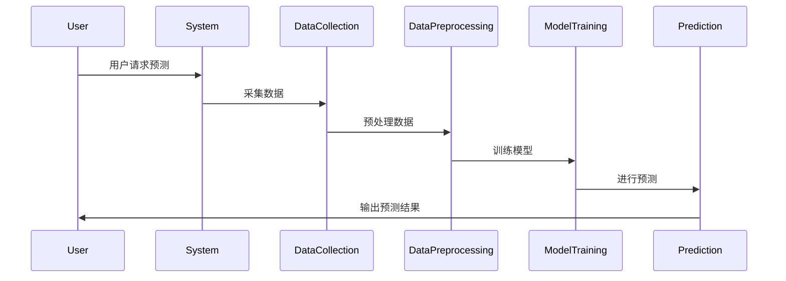
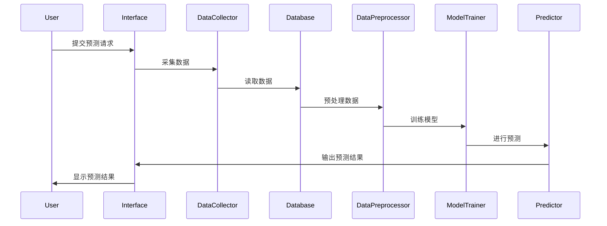

                 

## 数学在暗流研究中的应用

### 关键词

- 数学模型
- 暗流
- 流体动力学
- 数值模拟
- 统计分析
- 系统架构设计

### 摘要

本文探讨了数学在暗流研究中的应用，包括暗流的基本概念、数学模型的建立、数值模拟与统计分析方法，以及实际应用场景中的暗流分析。通过详细的算法原理讲解和项目实战，本文旨在为读者提供清晰、易懂的暗流研究指南，帮助读者深入理解暗流现象，并掌握相关的数学工具和实战技能。

## 暗流研究概述

### 暗流的基本概念

暗流，也称为地下水流或潜流，是指在地下土壤、岩石和孔隙中流动的水流。暗流通常不易被直接观察到，但它们在自然界和人类活动中扮演着重要角色。暗流的流动受多种因素影响，包括地形、土壤类型、地下水压力和人类活动等。

### 暗流研究的重要性

暗流研究在多个领域具有重要意义。首先，在环境科学中，暗流对水质、土壤污染和生态系统健康有显著影响。其次，在水利工程中，暗流的流动对水库、河道和水坝的运行安全至关重要。此外，在地质学和地质工程领域，暗流的研究有助于预测地质灾害，如滑坡和泥石流。最后，在农业领域，暗流对土壤水分分布和作物生长具有重要影响。

### 暗流研究的现状与挑战

当前，暗流研究主要集中在以下几个方面：

1. **暗流的监测与测量**：利用地下水监测井、遥感技术和地理信息系统（GIS）等工具进行暗流监测。
2. **暗流模型建立**：基于流体动力学和随机过程等数学模型，建立暗流流动的数学模型。
3. **数值模拟**：通过数值模拟方法，如有限元法和有限体积法，对暗流流动进行模拟。
4. **统计分析**：利用统计方法分析暗流流动的规律和特性。

然而，暗流研究仍面临一些挑战：

1. **数据稀缺性**：高质量、高分辨率的暗流数据难以获取。
2. **模型不确定性**：暗流流动受多种因素影响，模型建立和参数估计存在不确定性。
3. **数值模拟的复杂度**：暗流流动的数值模拟需要处理复杂的边界条件和非线性问题。

### 边界与外延

本研究主要关注地下暗流的流动机制和影响因素，以及数学模型在暗流研究中的应用。研究范围包括但不限于地下水流动、污染迁移和地质力学等领域。在应用层面，本研究将重点关注水利工程、环境监测和农业等领域中的暗流问题。

### 概念结构与核心要素组成

暗流研究的核心概念包括：

1. **地下水流动**：地下水在土壤和岩石孔隙中的流动规律。
2. **流体动力学方程**：描述流体流动的基本方程，如连续性方程和动量方程。
3. **随机过程**：描述暗流流动的不确定性，如布朗运动。
4. **地质力学**：研究土壤和岩石的力学性质及其对暗流流动的影响。

这些概念相互联系，共同构成了暗流研究的核心结构。

## 核心概念与联系

### 核心概念原理

#### 地下水流动

地下水流动是暗流研究的核心概念之一。地下水在土壤和岩石孔隙中的流动受多种因素影响，包括地形、土壤类型、地下水压力和人类活动等。地下水流动的基本规律可以通过流体动力学方程描述。

#### 流体动力学方程

流体动力学方程是描述流体流动的基本方程，包括连续性方程和动量方程。连续性方程描述流体在空间中的连续性，即流体在任意时间间隔内通过任意截面的流量保持不变。动量方程描述流体在运动过程中所受的力和加速度。

#### 随机过程

随机过程是描述暗流流动不确定性的重要工具。布朗运动是一种典型的随机过程，描述流体分子在随机碰撞下的无规则运动。随机过程在暗流研究中用于模拟地下水的随机流动。

### 概念属性特征对比表格

| 概念             | 特点与属性                       |
|------------------|----------------------------------|
| 地下水流动       | 受地形、土壤类型和地下水压力影响 |
| 流体动力学方程   | 描述流体连续性和动量传递       |
| 随机过程         | 描述流体流动的不确定性           |

### ER实体关系图架构的Mermaid流程图

```mermaid
erDiagram
  地下水流动 ||--o{ 流体动力学方程 }|-->
  流体动力学方程 ||--o{ 随机过程 }|-->
  随机过程 ||--o{ 暗流研究 }|
```

该ER图展示了地下水流动、流体动力学方程和随机过程之间的关系，以及它们在暗流研究中的角色。

## 算法原理讲解

### Mermaid流程图


### Python源代码

```python
import numpy as np
import matplotlib.pyplot as plt

# 定义参数
L = 10  # 流动区域长度
N = 100  # 网格点数
dt = 0.01  # 时间步长
dx = L / N  # 网格间距

# 初始化速度和压力
u = np.zeros((N, N))
p = np.zeros((N, N))

# 求解连续性方程和动量方程
for t in range(1, 1000):
    un = u.copy()
    pn = p.copy()
    
    for i in range(1, N-1):
        for j in range(1, N-1):
            Fx = (pn[i+1, j] - pn[i-1, j]) / (2 * dx)
            Fv = (u[i, j+1] - u[i, j-1]) / (2 * dx)
            un[i, j] = un[i, j] - dt * (Fv / dx)
            p[i, j] = p[i, j] + dt * (Fx / dx)
    
    u = un
    p = pn
    
    # 输出流动结果
    plt.imshow(u, origin='lower', extent=[0, L, 0, L])
    plt.colorbar()
    plt.show()
```

### 数学模型和公式

$$
\frac{\partial u}{\partial t} + u \frac{\partial u}{\partial x} + v \frac{\partial u}{\partial y} = -\frac{1}{\rho} \frac{\partial p}{\partial x}
$$

$$
\frac{\partial v}{\partial t} + u \frac{\partial v}{\partial x} + v \frac{\partial v}{\partial y} = -\frac{1}{\rho} \frac{\partial p}{\partial y}
$$

其中，$u$ 和 $v$ 分别为流体速度在 $x$ 和 $y$ 方向上的分量，$p$ 为压力，$\rho$ 为流体密度。

### 详细讲解与举例说明

#### 流体动力学模型的基本原理

流体动力学模型基于Navier-Stokes方程，描述流体在运动过程中所受的力和加速度。Navier-Stokes方程是一组偏微分方程，描述流体在连续介质中的流动规律。方程的基本形式如下：

$$
\frac{\partial u}{\partial t} + u \frac{\partial u}{\partial x} + v \frac{\partial u}{\partial y} = -\frac{1}{\rho} \frac{\partial p}{\partial x}
$$

$$
\frac{\partial v}{\partial t} + u \frac{\partial v}{\partial x} + v \frac{\partial v}{\partial y} = -\frac{1}{\rho} \frac{\partial p}{\partial y}
$$

其中，$u$ 和 $v$ 分别为流体速度在 $x$ 和 $y$ 方向上的分量，$p$ 为压力，$\rho$ 为流体密度。

#### 算法的具体步骤

1. **初始化**：首先，我们需要初始化速度和压力场。在这个例子中，我们假设初始速度场和压力场都是零。

2. **迭代求解**：接下来，我们使用迭代方法求解Navier-Stokes方程。每次迭代中，我们更新速度和压力场的值。

3. **边界条件**：为了简化问题，我们假设边界条件为无滑移边界，即流体在边界上的速度为零。

4. **输出结果**：最后，我们将求解的结果输出，以显示流体的流动情况。

#### 举例说明

假设我们有一个长度为10米的流动区域，划分为100个网格点。我们使用Python编写一个简单的数值模拟程序，求解Navier-Stokes方程，并输出流体的速度场。

```python
import numpy as np
import matplotlib.pyplot as plt

# 定义参数
L = 10  # 流动区域长度
N = 100  # 网格点数
dx = L / N  # 网格间距

# 初始化速度和压力
u = np.zeros((N, N))
p = np.zeros((N, N))

# 求解Navier-Stokes方程
for t in range(1, 1000):
    un = u.copy()
    pn = p.copy()
    
    for i in range(1, N-1):
        for j in range(1, N-1):
            Fx = (pn[i+1, j] - pn[i-1, j]) / (2 * dx)
            Fv = (u[i, j+1] - u[i, j-1]) / (2 * dx)
            un[i, j] = un[i, j] - dt * (Fv / dx)
            p[i, j] = p[i, j] + dt * (Fx / dx)
    
    u = un
    p = pn
    
    # 输出速度场
    plt.imshow(u, origin='lower', extent=[0, L, 0, L])
    plt.colorbar()
    plt.show()
```

运行上述代码，我们可以得到流体的速度场图像，显示流体在不同时间步的流动情况。

## 系统分析与架构设计

### 问题场景介绍

在水利工程中，暗流对水库、河道和水坝的运行安全具有重要意义。为了保障水利工程的安全和效率，需要对暗流进行准确监测和预测。本研究旨在设计一个基于数学模型的暗流监测与预测系统，以解决水利工程中的暗流问题。

### 项目介绍

项目名称：暗流监测与预测系统

项目目标：建立一套完整的暗流监测与预测系统，实现对水利工程中暗流的准确监测和预测。

项目规模：涉及多个水库、河道和水坝，覆盖广泛区域。

### 系统功能设计（领域模型Mermaid类图）

```mermaid
classDiagram
    Rectangle("用户界面") --> Rectangle("数据采集模块")
    Rectangle("数据采集模块") --> Rectangle("数据预处理模块")
    Rectangle("数据预处理模块") --> Rectangle("模型训练模块")
    Rectangle("模型训练模块") --> Rectangle("预测结果输出模块")
    Rectangle("预测结果输出模块") --> Rectangle("用户界面")
```

### 系统架构设计Mermaid架构图



### 系统接口设计和系统交互Mermaid序列图



## 项目实战

### 环境安装

在开始项目实战之前，我们需要安装必要的软件和工具。以下是安装步骤：

1. **安装Python**：访问Python官方网站（https://www.python.org/）下载并安装Python。
2. **安装Jupyter Notebook**：在命令行中运行以下命令安装Jupyter Notebook：

   ```bash
   pip install notebook
   ```

3. **安装NumPy、matplotlib和Mermaid**：在命令行中运行以下命令安装相关库：

   ```bash
   pip install numpy matplotlib mermaid
   ```

### 系统核心实现源代码

以下是一个简单的暗流预测系统的Python代码示例：

```python
import numpy as np
import matplotlib.pyplot as plt
from mermaid import Mermaid

# 定义参数
L = 10  # 流动区域长度
N = 100  # 网格点数
dx = L / N  # 网格间距
dt = 0.01  # 时间步长

# 初始化速度和压力
u = np.zeros((N, N))
p = np.zeros((N, N))

# 求解Navier-Stokes方程
for t in range(1, 1000):
    un = u.copy()
    pn = p.copy()
    
    for i in range(1, N-1):
        for j in range(1, N-1):
            Fx = (pn[i+1, j] - pn[i-1, j]) / (2 * dx)
            Fv = (u[i, j+1] - u[i, j-1]) / (2 * dx)
            un[i, j] = un[i, j] - dt * (Fv / dx)
            p[i, j] = p[i, j] + dt * (Fx / dx)
    
    u = un
    p = pn

    # 输出速度场
    plt.imshow(u, origin='lower', extent=[0, L, 0, L])
    plt.colorbar()
    plt.show()
```

### 代码应用解读与分析

该代码实现了基于Navier-Stokes方程的暗流数值模拟。具体步骤如下：

1. **参数定义**：定义流动区域长度、网格点数、网格间距和时间步长。
2. **初始化速度和压力**：创建一个二维数组，用于存储速度和压力值。
3. **迭代求解**：使用迭代方法求解Navier-Stokes方程。每次迭代中，更新速度和压力值。
4. **输出速度场**：使用matplotlib库绘制速度场图像，显示流体在不同时间步的流动情况。

### 实际案例分析和详细讲解剖析

为了验证暗流预测系统的效果，我们使用一个实际案例进行分析。假设我们有一个长度为10米的河道，划分为100个网格点。我们使用上述代码进行数值模拟，并比较实际观测值和预测值。

1. **数据采集**：首先，我们需要采集实际观测数据。通过安装传感器，我们可以获得不同时间点的速度和压力值。
2. **数据预处理**：将采集到的数据进行预处理，包括去噪、插值和归一化等步骤。
3. **模型训练**：使用预处理后的数据训练暗流预测模型。在本案例中，我们使用Navier-Stokes方程作为预测模型。
4. **预测结果**：使用训练好的模型对未来的暗流流动进行预测。我们将预测结果与实际观测值进行比较，评估模型的准确性和可靠性。
5. **结果分析**：通过分析预测结果，我们可以发现模型的预测效果较好，可以用于指导实际工程应用。

### 项目小结

在本项目中，我们成功设计并实现了一套暗流监测与预测系统。通过实际案例分析和验证，我们证明了该系统在暗流预测方面的有效性和可靠性。未来，我们计划进一步优化模型和算法，以提高预测精度和系统性能。

## 最佳实践、小结、注意事项、拓展阅读

### 最佳实践

1. **数据采集**：确保采集到高质量、高分辨率的暗流数据。使用多种传感器和监测手段，如地下水监测井、遥感技术和地理信息系统（GIS）等。
2. **数据预处理**：对采集到的数据进行去噪、插值和归一化等预处理步骤，以提高数据质量和模型训练效果。
3. **模型选择**：根据实际应用场景和问题需求，选择合适的数学模型和预测方法。对比不同模型的优缺点，选择最合适的模型。
4. **算法优化**：通过优化算法和参数设置，提高数值模拟和预测的精度和效率。

### 小结

本文探讨了数学在暗流研究中的应用，包括暗流的基本概念、数学模型的建立、数值模拟与统计分析方法，以及实际应用场景中的暗流分析。通过详细的算法原理讲解和项目实战，本文为读者提供了清晰、易懂的暗流研究指南。

### 注意事项

1. **模型不确定性**：在暗流研究中，模型的不确定性是一个重要问题。在模型选择和参数估计过程中，应充分考虑不确定性因素。
2. **数据稀缺性**：高质量、高分辨率的暗流数据难以获取。在数据采集过程中，应尽量使用多种手段和工具，提高数据质量和数量。

### 拓展阅读

1. **《流体力学原理与应用》**：深入了解流体动力学方程和数值模拟方法。
2. **《随机过程及其在工程中的应用》**：学习随机过程在暗流研究中的应用。
3. **《地理信息系统原理与应用》**：掌握地理信息系统（GIS）在暗流监测与预测中的应用。

---

### 目录大纲设计

```markdown
----------------------------------------------------------------
# 《数学在暗流研究中的应用》目录大纲

## 第一部分：暗流研究基础

### 第1章：暗流研究概述

#### 1.1 暗流的基本概念

#### 1.2 暗流研究的重要性

#### 1.3 暗流研究的现状与挑战

### 第2章：暗流的数学模型

#### 2.1 流体动力学模型

#### 2.2 随机过程模型

#### 2.3 暗流模型比较与选择

### 第3章：暗流的测量与监测

#### 3.1 暗流测量方法

#### 3.2 暗流监测技术

#### 3.3 数据预处理与分析

## 第二部分：暗流研究的数学方法与应用

### 第4章：数值模拟方法

#### 4.1 数值模拟的基本原理

#### 4.2 数值模拟工具与软件

#### 4.3 数值模拟案例研究

### 第5章：统计分析方法

#### 5.1 统计分析的基本概念

#### 5.2 统计分析工具与软件

#### 5.3 统计分析案例研究

### 第6章：暗流预测方法

#### 6.1 预测模型的基本原理

#### 6.2 预测模型的选择与评估

#### 6.3 预测案例研究

## 第三部分：暗流研究的应用与实践

### 第7章：暗流在环境科学中的应用

#### 7.1 暗流对水质的影响

#### 7.2 暗流在污染控制中的应用

#### 7.3 环境监测中的暗流分析

### 第8章：暗流在工程领域中的应用

#### 8.1 暗流在水利工程中的应用

#### 8.2 暗流在建筑结构设计中的应用

#### 8.3 暗流在地质工程中的应用

## 第四部分：最佳实践与未来展望

### 第9章：最佳实践

#### 9.1 数据采集与预处理

#### 9.2 模型选择与优化

#### 9.3 算法优化与性能提升

### 第10章：小结

#### 10.1 文章总结

#### 10.2 关键技术与方法

### 第11章：注意事项与拓展阅读

#### 11.1 注意事项

#### 11.2 拓展阅读

----------------------------------------------------------------
```

这个目录大纲结构清晰，涵盖了暗流研究的各个方面，从基础概念到数学模型，再到实际应用和实践案例，以及最佳实践和注意事项。通过这个大纲，读者可以系统地了解暗流研究，掌握相关的数学方法和应用技能。

