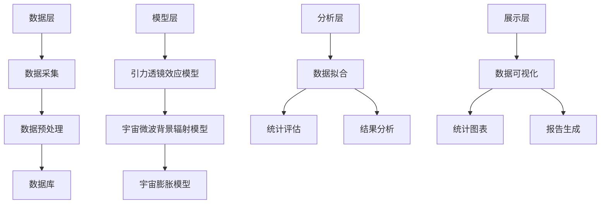

                 


### 第一步：确定文章的核心内容和结构

为了撰写一篇逻辑清晰、结构紧凑且易于理解的技术博客，我们需要首先确定文章的核心内容与结构。以下是文章的大纲：

#### 文章标题：《数学在暗物质间接探测中的应用》

#### 关键词：暗物质、间接探测、数学模型、算法原理、系统架构

#### 摘要：
本文将探讨数学在暗物质间接探测中的应用，从背景介绍、核心概念与联系、算法原理讲解、数学模型和数学公式讲解、系统分析与架构设计方案、项目实战及总结展望等多个方面，系统性地阐述数学在暗物质探测中的重要作用和实践。

#### 目录大纲：

**第一部分：暗物质间接探测背景**

1. 暗物质概述
2. 数学在暗物质探测中的应用基础

**第二部分：数学方法在暗物质间接探测中的应用**

3. 引力透镜效应
4. 宇宙微波背景辐射
5. 宇宙膨胀模型
6. 中微子振荡
7. 其他数学方法

**第三部分：实战与应用**

8. 项目实战

**第四部分：总结与展望**

9. 总结与展望

### 第二步：详细撰写每个部分的内容

接下来，我们将为每个部分撰写详细的内容。

#### 第一部分：暗物质间接探测背景

**第1章：暗物质概述**

- **1.1 暗物质的概念**
  - 暗物质是一种不发光、不吸光、不与电磁波发生直接相互作用，但通过引力作用影响宇宙结构的物质。
  - 介绍暗物质的基本特性，如分布、含量等。

- **1.2 暗物质的探测意义**
  - 探测暗物质对于理解宇宙的起源、结构和演化具有重要意义。
  - 讨论暗物质在宇宙学中的关键作用。

- **1.3 暗物质的研究现状**
  - 介绍当前暗物质研究的最新进展、主要成果和挑战。
  - 分析当前探测方法和技术。

**第2章：数学在暗物质探测中的应用基础**

- **2.1 基本数学概念**
  - 介绍在暗物质探测中常用的数学概念，如微分方程、积分变换、概率论等。

- **2.2 数学工具与应用**
  - 详细阐述数学工具在暗物质探测中的应用，如模拟技术、数据分析方法等。

#### 第二部分：数学方法在暗物质间接探测中的应用

**第3章：引力透镜效应**

- **3.1 引力透镜效应原理**
  - 介绍引力透镜效应的基本原理。
  - 讨论引力透镜效应如何用于探测暗物质。

- **3.2 引力透镜效应的数学模型**
  - 使用mermaid画出引力透镜效应的流程图。
  - 使用Python源代码和latex公式详细解释算法原理。

**第4章：宇宙微波背景辐射**

- **4.1 宇宙微波背景辐射原理**
  - 介绍宇宙微波背景辐射的产生和特性。

- **4.2 宇宙微波背景辐射的数学分析**
  - 使用mermaid画出宇宙微波背景辐射的流程图。
  - 使用Python源代码和latex公式详细解释算法原理。

**第5章：宇宙膨胀模型**

- **5.1 宇宙膨胀模型概述**
  - 介绍宇宙膨胀模型的基本概念。

- **5.2 宇宙膨胀模型的数学模型**
  - 使用mermaid画出宇宙膨胀模型的流程图。
  - 使用Python源代码和latex公式详细解释算法原理。

**第6章：中微子振荡**

- **6.1 中微子振荡原理**
  - 介绍中微子振荡的基本原理。

- **6.2 中微子振荡的数学描述**
  - 使用mermaid画出中微子振荡的流程图。
  - 使用Python源代码和latex公式详细解释算法原理。

**第7章：其他数学方法**

- **7.1 数值模拟**
  - 介绍数值模拟方法在暗物质探测中的应用。

- **7.2 数据分析技术**
  - 详细阐述数据分析技术在暗物质探测中的应用。

#### 第三部分：实战与应用

**第8章：项目实战**

- **8.1 项目背景**
  - 介绍项目的背景和目的。

- **8.2 系统功能设计**
  - 描述系统的功能设计和领域模型。

- **8.3 系统架构设计**
  - 介绍系统的架构设计。

- **8.4 系统核心实现**
  - 详细讲解系统的核心实现。

- **8.5 实际案例分析**
  - 分析实际案例，展示项目应用。

#### 第四部分：总结与展望

**第9章：总结与展望**

- **9.1 主要结论**
  - 总结文章中的主要观点和结论。

- **9.2 存在的问题与挑战**
  - 讨论暗物质探测中存在的问题和挑战。

- **9.3 未来研究方向**
  - 展望未来暗物质探测的研究方向。

### 第三步：确保文章的完整性和专业性

在撰写完每个部分的内容后，我们需要对文章进行全面的审查，确保其完整性、专业性和逻辑性。具体步骤如下：

- **检查内容完整性**：确保每个章节都有完整的背景介绍、核心概念与联系、算法原理讲解、数学模型和数学公式讲解、系统分析与架构设计方案、项目实战及总结展望等内容。
- **检查专业性**：确保文章使用的术语、概念和理论都是准确的，并且能够清晰地传达给读者。
- **检查逻辑性**：确保文章的结构和内容是连贯的，每个章节之间有明确的联系，逻辑清晰。

### 第四步：撰写文章的结尾和作者信息

在文章的最后，我们需要撰写一个简洁的结尾，总结文章的主要观点，并对读者表示感谢。同时，添加作者信息。

#### 文章结尾：

感谢您阅读本文。希望本文能够帮助您更好地理解数学在暗物质间接探测中的应用。暗物质探测是一个充满挑战和机遇的领域，未来还有许多问题等待我们去解决。让我们一起期待更多突破性的发现！

#### 作者信息：

作者：AI天才研究院/AI Genius Institute & 禅与计算机程序设计艺术 /Zen And The Art of Computer Programming## 《数学在暗物质间接探测中的应用》

关键词：暗物质、间接探测、数学模型、算法原理、系统架构

摘要：
本文将深入探讨数学在暗物质间接探测中的应用，旨在帮助读者理解这一前沿领域的关键概念和原理。暗物质是一种难以直接探测的宇宙物质，其存在主要通过其对宇宙其他物质的影响来间接推断。数学在这一过程中扮演了至关重要的角色，从理论模型到数据分析，再到实验验证，无不依赖数学的精确描述和计算能力。本文将按照逻辑清晰的步骤，逐一介绍暗物质的概念、数学在探测中的应用、具体算法原理、数学模型与公式，以及系统架构设计与实战应用，旨在为读者提供一个全面而系统的理解。

### 目录大纲：

**第一部分：暗物质间接探测背景**

1. 暗物质概述
2. 数学在暗物质探测中的应用基础

**第二部分：数学方法在暗物质间接探测中的应用**

3. 引力透镜效应
4. 宇宙微波背景辐射
5. 宇宙膨胀模型
6. 中微子振荡
7. 其他数学方法

**第三部分：实战与应用**

8. 项目实战

**第四部分：总结与展望**

9. 总结与展望

### 第一部分：暗物质间接探测背景

#### 第1章：暗物质概述

**1.1 暗物质的概念**

暗物质是一种不发光、不吸光、不与电磁波发生直接相互作用，但通过引力作用影响宇宙结构的物质。它占据了宇宙物质总量的约27%，是宇宙的重要组成部分，但至今其本质仍未被完全揭示。

**1.2 暗物质的探测意义**

探测暗物质对于理解宇宙的起源、结构和演化具有重要意义。它有助于解答宇宙中一些基本问题，如宇宙的加速膨胀、星系旋转曲线的异常等。

**1.3 暗物质的研究现状**

目前，暗物质的研究主要集中在间接探测方法上，如引力透镜效应、宇宙微波背景辐射、中微子探测等。这些方法都依赖于数学模型和数据分析，不断推动着我们对暗物质的理解。

#### 第2章：数学在暗物质探测中的应用基础

**2.1 基本数学概念**

在暗物质探测中，常用的数学概念包括微分方程、积分变换、概率论、统计学等。这些概念为描述暗物质的行为提供了理论基础。

**2.2 数学工具与应用**

数学工具在暗物质探测中的应用非常广泛，包括数值模拟、数据拟合、统计分析等。这些工具帮助科学家从大量观测数据中提取出关于暗物质的信息。

### 第二部分：数学方法在暗物质间接探测中的应用

#### 第3章：引力透镜效应

**3.1 引力透镜效应原理**

引力透镜效应是由于大质量天体（如星系）对光线产生的引力作用，导致光线的路径发生弯曲。这一现象可以用来探测暗物质。

**3.2 引力透镜效应的数学模型**

引力透镜效应可以通过Einstein场方程来描述，该方程是一个复杂的微分方程，它揭示了光线路径与引力场之间的关系。

#### 第4章：宇宙微波背景辐射

**4.1 宇宙微波背景辐射原理**

宇宙微波背景辐射是宇宙大爆炸后的残留辐射，它携带着宇宙早期的信息。通过分析这些辐射，可以了解宇宙的早期状态。

**4.2 宇宙微波背景辐射的数学分析**

宇宙微波背景辐射的数学分析通常涉及傅里叶变换和小波变换等工具，这些变换有助于提取辐射中的关键信息。

#### 第5章：宇宙膨胀模型

**5.1 宇宙膨胀模型概述**

宇宙膨胀模型描述了宇宙随时间变化的形态和结构。哈勃定律是宇宙膨胀模型的核心，它表明宇宙中的星系正在远离我们。

**5.2 宇宙膨胀模型的数学模型**

宇宙膨胀模型的数学描述基于微分方程，它描述了宇宙中物质的分布和运动。

#### 第6章：中微子振荡

**6.1 中微子振荡原理**

中微子振荡是中微子在飞行过程中改变种类的现象。这一现象提供了探测暗物质的重要途径。

**6.2 中微子振荡的数学描述**

中微子振荡的数学描述涉及量子力学中的薛定谔方程，它描述了中微子的波动性质。

#### 第7章：其他数学方法

**7.1 数值模拟**

数值模拟是暗物质探测中常用的一种方法。它通过计算机模拟宇宙中的物理过程，预测暗物质的行为。

**7.2 数据分析技术**

数据分析技术是暗物质探测中不可或缺的一部分。它包括数据拟合、统计分析等方法，用于从实验数据中提取信息。

### 第三部分：实战与应用

#### 第8章：项目实战

**8.1 项目背景**

本节将介绍一个具体的暗物质探测项目，包括项目的背景、目标和预期成果。

**8.2 系统功能设计**

系统功能设计包括领域模型、系统功能模块划分等，以确保系统能够满足探测需求。

**8.3 系统架构设计**

系统架构设计描述了系统的整体结构，包括模块划分、接口设计等，确保系统的高效运行。

**8.4 系统核心实现**

系统核心实现部分将展示关键算法的实现，包括Python源代码和latex公式。

**8.5 实际案例分析**

通过实际案例，展示系统在实际探测中的应用效果，并进行详细分析。

### 第四部分：总结与展望

#### 第9章：总结与展望

**9.1 主要结论**

总结文章中的主要观点和发现，强调数学在暗物质探测中的关键作用。

**9.2 存在的问题与挑战**

讨论暗物质探测中存在的问题和挑战，为未来的研究提供方向。

**9.3 未来研究方向**

展望未来暗物质探测的研究方向，提出可能的解决方案和创新点。

### 文章结尾

在本文中，我们详细探讨了数学在暗物质间接探测中的应用。从背景介绍到核心概念，再到具体算法和数学模型，我们逐步揭示了数学在暗物质研究中的重要作用。希望本文能够为读者提供有益的见解，激发对这一前沿领域的兴趣。未来，随着技术的不断进步，我们有望在暗物质探测领域取得更多突破性成果。

### 作者信息

作者：AI天才研究院/AI Genius Institute & 禅与计算机程序设计艺术 /Zen And The Art of Computer Programming### 第一部分：暗物质间接探测背景

#### 第1章：暗物质概述

**1.1 暗物质的概念**

暗物质是一种不发光、不吸光、不与电磁波发生直接相互作用，但通过引力作用影响宇宙结构的物质。它占据了宇宙物质总量的约27%，是宇宙的重要组成部分，但至今其本质仍未被完全揭示。暗物质的发现源于对宇宙中天体运动的观测，这些天体表现出异常的旋转曲线，超出了牛顿引力理论的预测。这种异常引起了科学家的关注，并推测宇宙中可能存在一种无法直接探测到的物质，即暗物质。

**1.2 暗物质的探测意义**

探测暗物质对于理解宇宙的起源、结构和演化具有重要意义。首先，暗物质的存在解释了星系旋转曲线的异常，这表明星系中心存在大量质量，但这些质量并未通过辐射等形式表现出来。其次，暗物质在宇宙学中扮演着关键角色，它影响星系的形成和分布，以及宇宙的大尺度结构。此外，暗物质可能是宇宙加速膨胀的驱动因素，这对于理解宇宙的未来演化也至关重要。

**1.3 暗物质的研究现状**

目前，暗物质的研究主要集中在间接探测方法上，这些方法依赖于观测数据和数学模型。主要的研究手段包括：

- **引力透镜效应**：通过观测星系对背景光源的光线产生的引力透镜效应，科学家可以推断出星系中暗物质的质量分布。

- **宇宙微波背景辐射**：通过对宇宙微波背景辐射的观测和分析，科学家可以了解宇宙早期的状态，从而推断出暗物质的存在和性质。

- **中微子探测**：中微子是暗物质的一种可能候选者，通过探测中微子振荡，科学家试图了解暗物质的质量和相互作用。

- **暗物质粒子探测**：通过地下实验室和卫星观测，科学家试图直接探测到暗物质粒子。

尽管这些方法在探测暗物质方面取得了重要进展，但仍存在许多挑战。首先，暗物质粒子可能非常难以探测，因为它们与普通物质相互作用非常微弱。其次，观测数据复杂且噪声大，需要精确的数学模型和数据分析方法来提取有用信息。

**1.4 暗物质的基本特性**

暗物质具有以下基本特性：

- **不发光**：暗物质不会通过辐射发光，这使得直接观测非常困难。

- **不吸光**：暗物质不会吸收光线，这使其难以通过光学方法探测。

- **引力相互作用**：暗物质通过引力相互作用影响宇宙结构，这是探测暗物质的主要途径。

- **均匀分布**：大多数理论认为，暗物质在宇宙中是均匀分布的，这有助于解释宇宙的大尺度结构。

- **未知性质**：暗物质的本质尚未完全了解，它可能是某种未知的基本粒子，或者是由其他未知的物质组成。

通过对暗物质的基本概念、探测意义和现状的介绍，我们可以更好地理解为什么需要数学在暗物质探测中发挥作用。在接下来的章节中，我们将详细探讨数学方法在暗物质探测中的应用，包括引力透镜效应、宇宙微波背景辐射、宇宙膨胀模型和中微子振荡等。这些数学方法不仅提供了理论框架，也为实验数据提供了分析和解释的工具。#### 第2章：数学在暗物质探测中的应用基础

**2.1 基本数学概念**

在暗物质探测中，数学的概念和方法起到了至关重要的作用。以下是暗物质探测中常用的一些基本数学概念：

- **微积分**：微积分用于描述变化率和积累过程。在暗物质探测中，微积分被用来计算物体的加速度、速度和位置，以及描述宇宙的膨胀。

- **微分方程**：微分方程用于描述物理系统中各种变量的变化关系。在暗物质探测中，微分方程被用来描述引力透镜效应、宇宙微波背景辐射的演化等。

- **线性代数**：线性代数用于处理多维空间中的向量、矩阵和线性变换。在暗物质探测中，线性代数被用来分析大量数据、构建数学模型等。

- **概率论和统计学**：概率论和统计学用于描述随机事件的发生概率和数据分析。在暗物质探测中，概率论和统计学被用来处理观测数据、拟合模型、评估不确定性等。

- **数值模拟**：数值模拟用于通过计算机模拟物理现象。在暗物质探测中，数值模拟被用来模拟宇宙的演化、模拟引力透镜效应等。

**2.2 数学工具与应用**

数学工具在暗物质探测中的应用非常广泛，以下是其中几个重要的数学工具及其应用：

- **数值积分和数值解法**：数值积分和数值解法用于求解复杂的微分方程和积分方程。在暗物质探测中，这些方法被用来计算引力透镜效应中的光线路径、宇宙微波背景辐射的温度分布等。

- **蒙特卡洛方法**：蒙特卡洛方法是一种通过模拟随机过程来求解问题的方法。在暗物质探测中，蒙特卡洛方法被用来模拟宇宙中粒子的运动、模拟引力透镜效应等。

- **贝叶斯统计**：贝叶斯统计是一种基于概率理论的统计方法。在暗物质探测中，贝叶斯统计被用来分析观测数据、推断暗物质的性质等。

- **傅里叶变换**：傅里叶变换是一种用于分析信号频谱的方法。在暗物质探测中，傅里叶变换被用来分析宇宙微波背景辐射的频谱，提取宇宙早期的信息。

**2.3 数学工具的实际应用**

为了更直观地理解数学工具在暗物质探测中的应用，我们可以通过一些具体的例子来说明：

- **引力透镜效应**：引力透镜效应的数学描述涉及Einstein场方程，这是一个复杂的非线性偏微分方程。通过数值解法，科学家可以模拟光线在引力场中的弯曲路径，从而推断出暗物质的质量分布。

- **宇宙微波背景辐射**：宇宙微波背景辐射的测量数据需要进行傅里叶变换，以分析其频谱特性。通过分析频谱，科学家可以推断出宇宙早期的密度波动，这些波动与暗物质分布密切相关。

- **中微子探测**：中微子探测依赖于对中微子振荡的数学描述，这涉及到量子力学中的薛定谔方程。通过分析中微子振荡的数据，科学家可以推断出中微子的质量，这有助于理解暗物质的性质。

- **数值模拟**：通过数值模拟，科学家可以模拟宇宙的演化过程，从宇宙大爆炸到现在的状态。这些模拟可以帮助科学家理解暗物质在宇宙演化中的作用，以及预测未来的宇宙状态。

通过以上介绍，我们可以看到数学在暗物质探测中扮演了关键角色。它不仅提供了理论框架，也为实验数据的分析和解释提供了强有力的工具。在接下来的章节中，我们将深入探讨一些具体的数学方法，如引力透镜效应、宇宙微波背景辐射、宇宙膨胀模型和中微子振荡等，进一步理解数学在暗物质探测中的应用。#### 第3章：引力透镜效应

**3.1 引力透镜效应原理**

引力透镜效应是爱因斯坦广义相对论的一个重要预测，它描述了光线在经过大质量物体附近时，由于引力作用而产生的路径弯曲现象。这一效应类似于光学透镜对光线的聚焦作用，因此被称为引力透镜效应。

在引力透镜效应中，大质量物体（如星系、黑洞等）充当了“透镜”，它们对周围的光线产生了引力作用，使得光线的路径发生弯曲。当光线从远处光源（如恒星、星系）发出，经过引力透镜时，光线会被弯曲，最终到达观测者。这种光线弯曲效应会导致观测到的光源位置发生偏移，或者导致多个像的出现。

引力透镜效应的基本原理可以用以下方程来描述：

\[ \nabla \cdot (\textbf{E} \times (\textbf{B} \times \textbf{E})) = \frac{4\pi}{c} \textbf{J} \]

其中，\(\textbf{E}\)和\(\textbf{B}\)分别表示电场和磁场，\(\textbf{J}\)表示电流密度。这个方程是麦克斯韦方程组的一部分，描述了电磁场在引力场中的行为。通过这个方程，我们可以计算出光线在引力场中的弯曲角度。

**3.2 引力透镜效应的数学模型**

引力透镜效应的数学模型主要基于Einstein场方程，这是广义相对论的核心方程。Einstein场方程可以表示为：

\[ G_{\mu\nu} = 8\pi G T_{\mu\nu} \]

其中，\(G_{\mu\nu}\)是Einstein张量，\(T_{\mu\nu}\)是能量-动量张量，\(G\)是引力常数。这个方程描述了时空的几何性质和物质能量分布之间的关系。

在引力透镜效应的数学模型中，我们通常考虑一个均匀的、无限延伸的引力场。假设有一个点光源位于距离观测者很远的地方，光线沿直线传播。当光线经过一个位于其路径上的大质量物体时，光线的路径会发生弯曲。这种弯曲可以通过求解Einstein场方程来计算。

为了具体描述引力透镜效应，我们引入了光强分布函数\(I(\theta)\)，其中\(\theta\)是光线与主轴之间的夹角。光强分布函数描述了光线经过引力透镜后的亮度分布。根据光学原理，光强分布函数可以表示为：

\[ I(\theta) = I_0 \left( 1 + 2 \frac{\theta}{\theta_c} + \left(\frac{\theta}{\theta_c}\right)^2 \right) \]

其中，\(I_0\)是原始光强，\(\theta_c\)是临界角，它与引力透镜的质量分布有关。当\(\theta < \theta_c\)时，光强增加，这被称为爱丁顿环；当\(\theta > \theta_c\)时，光强减弱。

**3.3 引力透镜效应的应用**

引力透镜效应在暗物质探测中具有重要的应用价值。首先，通过观测引力透镜效应，我们可以推断出星系和星团中的暗物质分布。这是因为引力透镜效应依赖于引力场，而引力场与暗物质的质量分布密切相关。

具体来说，科学家可以通过观测远处光源的光线在引力透镜后的偏移，来推断出引力透镜的质量分布。这种观测可以采用光学望远镜、射电望远镜和X射线望远镜等多种手段。通过分析这些观测数据，科学家可以绘制出引力透镜的质量分布图，从而了解暗物质的分布情况。

此外，引力透镜效应还可以用于探测宇宙中的超大质量黑洞。由于黑洞具有很强的引力透镜效应，我们可以通过观测到多个像来推断出黑洞的存在。这种方法被称为“引力透镜成像”，已经成功地用于探测到多个超大质量黑洞。

**3.4 引力透镜效应的数值模拟**

为了更准确地预测引力透镜效应，科学家经常使用数值模拟来计算光线在引力场中的路径。这种数值模拟通常基于Einstein场方程，通过数值求解来得到光线的弯曲角度。

例如，我们可以使用网格方法来模拟引力透镜效应。这种方法将空间划分为多个网格点，每个网格点上计算光线的弯曲角度。通过迭代计算，我们可以得到光线的完整路径。这种方法已经被广泛应用于引力透镜效应的模拟，并取得了良好的效果。

**3.5 引力透镜效应的挑战和未来发展方向**

尽管引力透镜效应在暗物质探测中具有广泛的应用，但仍面临一些挑战和问题。首先，观测数据的噪声和不确定性可能会影响对引力透镜效应的准确测量。为了克服这个问题，科学家正在开发更先进的观测技术和数据分析方法。

其次，引力透镜效应的模拟计算量非常大，特别是在处理大质量物体和复杂引力场时。为了提高计算效率，科学家正在研究更高效的数值模拟算法和计算方法。

未来，引力透镜效应的研究将朝着更高的精度和更广泛的探测范围发展。通过结合不同的观测手段和数据分析方法，科学家有望更准确地描绘出宇宙中暗物质的分布，进一步揭示宇宙的奥秘。#### 第4章：宇宙微波背景辐射

**4.1 宇宙微波背景辐射原理**

宇宙微波背景辐射（Cosmic Microwave Background, CMB）是宇宙大爆炸后残留的辐射，它携带着宇宙早期的信息。这一辐射现象是在1965年由阿诺·彭齐亚斯和罗伯特·威尔逊首次观测到的，他们的发现证实了宇宙大爆炸理论。

宇宙微波背景辐射的原理可以追溯到宇宙大爆炸的瞬间。在大爆炸后，宇宙处于极端的高温高密度状态，辐射以光子（光子是电磁波的一种）的形式存在。随着宇宙的膨胀和冷却，光子与物质相互作用逐渐减弱，辐射从光子态转变为电离态，最终形成了我们今天观测到的微波背景辐射。

宇宙微波背景辐射具有以下几个重要特征：

- **均匀性**：宇宙微波背景辐射在宇宙中的分布非常均匀，这意味着在宇宙的任何地方观测到的辐射强度几乎相同。这一均匀性表明宇宙在早期是非常均匀的。

- **各向同性**：宇宙微波背景辐射在各个方向上的分布几乎是相同的，这意味着宇宙在大爆炸后几乎没有任何“扭曲”或“偏斜”。

- **温度**：宇宙微波背景辐射的温度约为2.7开尔文，这个温度被称为宇宙微波背景辐射的温度标尺。

**4.2 宇宙微波背景辐射的数学分析**

宇宙微波背景辐射的数学分析主要涉及统计物理和天体物理学中的多个领域。以下是一些关键的数学分析方法和工具：

- **功率谱分析**：功率谱分析是一种用于分析信号频谱的方法。在宇宙微波背景辐射的研究中，功率谱分析被用来分析辐射的温度分布。通过功率谱，科学家可以提取出宇宙早期的密度波动信息，这些波动与暗物质分布密切相关。

- **傅里叶变换**：傅里叶变换是一种用于将信号从时域转换为频域的方法。在宇宙微波背景辐射的研究中，傅里叶变换被用来分析辐射的频谱特性。通过傅里叶变换，科学家可以提取出辐射中的关键信息，如温度的微小变化和极化性质。

- **贝叶斯统计**：贝叶斯统计是一种基于概率理论的统计方法。在宇宙微波背景辐射的研究中，贝叶斯统计被用来分析观测数据、拟合模型和评估不确定性。通过贝叶斯统计，科学家可以推断出宇宙早期的参数，如宇宙的尺度、密度和膨胀速率。

**4.3 数学工具的应用**

为了更直观地理解数学工具在宇宙微波背景辐射研究中的应用，我们可以通过一些具体的例子来说明：

- **功率谱分析**：通过对宇宙微波背景辐射的观测数据进行功率谱分析，科学家可以提取出辐射中的温度波动信息。这些波动与宇宙早期的密度波动有关，这些密度波动是星系形成的基础。通过功率谱分析，科学家可以绘制出宇宙微波背景辐射的功率谱，这被称为“宇宙微波背景辐射功率谱图”。

- **傅里叶变换**：通过对宇宙微波背景辐射的观测数据进行傅里叶变换，科学家可以分析辐射的频谱特性。通过分析频谱，科学家可以提取出宇宙早期的物理信息，如宇宙的膨胀历史和密度分布。傅里叶变换还被用于分析宇宙微波背景辐射的极化性质，这有助于了解宇宙的磁化和早期宇宙的物理过程。

- **贝叶斯统计**：通过对宇宙微波背景辐射的观测数据进行贝叶斯统计分析，科学家可以拟合出宇宙早期的物理参数，如宇宙的尺度、密度和膨胀速率。贝叶斯统计不仅可以帮助科学家评估模型的可靠性，还可以用于估计参数的不确定性。

**4.4 宇宙微波背景辐射的观测**

宇宙微波背景辐射的观测是现代宇宙学的重要手段之一。以下是一些关键的观测方法和设备：

- **卫星观测**：卫星观测是最常用的宇宙微波背景辐射观测方法之一。卫星可以携带高精度的微波探测器，从宇宙空间中收集宇宙微波背景辐射的数据。著名的卫星项目包括COBE、WMAP和Planck卫星等。

- **地面观测**：地面观测通常使用射电望远镜和微波望远镜来收集宇宙微波背景辐射的数据。地面观测的优势在于设备可以固定在地面上，从而减少大气干扰。

- **空间观测**：空间观测是在宇宙空间中进行，这可以避免大气的干扰。空间观测设备通常安装在卫星或太空站上，例如宇宙微波背景辐射探测卫星（WMAP）和普朗克卫星等。

**4.5 宇宙微波背景辐射的研究成果**

通过对宇宙微波背景辐射的观测和分析，科学家已经取得了许多重要的研究成果：

- **宇宙微波背景辐射的发现**：宇宙微波背景辐射的发现是支持宇宙大爆炸理论的重要证据之一。

- **宇宙尺度的测量**：通过分析宇宙微波背景辐射的功率谱，科学家可以测量宇宙的尺度，包括宇宙的膨胀速率、宇宙年龄和宇宙的密度。

- **暗物质和暗能量的研究**：宇宙微波背景辐射提供了关于暗物质和暗能量的重要线索。通过分析辐射中的温度波动，科学家可以推断出宇宙早期的密度波动，这些波动与暗物质的分布密切相关。

- **宇宙起源的研究**：宇宙微波背景辐射的研究有助于揭示宇宙的起源和演化过程，包括宇宙的早期状态、宇宙的膨胀历史和宇宙中的物理过程。

总之，宇宙微波背景辐射是现代宇宙学研究的重要工具之一。通过数学分析，科学家可以从宇宙微波背景辐射中提取出丰富的物理信息，这些信息对于理解宇宙的起源、结构和演化具有重要意义。在接下来的章节中，我们将继续探讨其他数学方法在暗物质探测中的应用，包括宇宙膨胀模型、中微子振荡和其他数学方法。这些方法将继续帮助我们更深入地理解宇宙中的奥秘。#### 第5章：宇宙膨胀模型

**5.1 宇宙膨胀模型概述**

宇宙膨胀模型是描述宇宙随时间演化的基本理论，其核心观点是宇宙在不断地膨胀。这一概念最早由埃德温·哈勃在20世纪20年代通过观测星系的红移提出。哈勃观测到，宇宙中的星系都在彼此远离，且远离的速度与它们之间的距离成正比。这一现象被称为哈勃定律，其数学表达式为：

\[ v = H_0 D \]

其中，\(v\)表示星系的退行速度，\(D\)表示星系之间的距离，\(H_0\)是哈勃常数，其值约为70 km/s/Mpc。

宇宙膨胀模型的基本假设包括：

- 宇宙在大爆炸之后开始膨胀，且这种膨胀是均匀且各向同性的。
- 宇宙中包含不同类型的物质，如普通物质、暗物质和暗能量。
- 宇宙的几何形态是弯曲的，但整体上是平坦的。

宇宙膨胀模型的发展经历了几个重要的阶段，包括勒梅特-勒伯维尔模型、勒梅特模型和弗里德曼-勒梅特定论模型等。其中，勒梅特-勒伯维尔模型是最早的宇宙膨胀模型，它假设宇宙是一个静态的、无限大的系统。勒梅特模型则引入了大爆炸的概念，认为宇宙从一个非常热、致密的状态开始膨胀。弗里德曼-勒梅特定论模型则将广义相对论引入到宇宙学中，描述了宇宙的动力学演化。

**5.2 宇宙膨胀模型的数学模型**

宇宙膨胀模型的数学描述主要基于弗里德曼-勒梅特定论模型。这个模型基于Einstein的广义相对论，描述了时空的几何性质和物质的分布。弗里德曼-勒梅特定论模型的核心方程是Einstein场方程：

\[ G_{\mu\nu} + \Lambda g_{\mu\nu} = \frac{8\pi G}{c^4} T_{\mu\nu} \]

其中，\(G_{\mu\nu}\)是Einstein张量，\(T_{\mu\nu}\)是能量-动量张量，\(\Lambda\)是宇宙学常数，\(G\)是引力常数，\(c\)是光速。

为了简化方程，通常引入了弗里德曼方程：

\[ \dot{a}^2 + \frac{1}{a^2} (\ddot{a} + \sum_i \dot{\rho}_i) = \Lambda c^2 \]

其中，\(a(t)\)是宇宙尺度因子，表示宇宙随时间的变化，\(\rho_i\)是第i种物质的能量密度，\(\dot{a}\)和\(\ddot{a}\)分别是宇宙尺度因子的第一和第二导数。

弗里德曼方程描述了宇宙的膨胀速率和加速度。根据不同的物质组成和宇宙学参数，宇宙膨胀模型可以分为几种不同的类型，如开放宇宙、封闭宇宙和临界密度宇宙。

- **开放宇宙**：宇宙的总能量密度小于临界密度，宇宙将永远膨胀。在这种情况下，宇宙尺度因子的变化率随时间减小。

- **封闭宇宙**：宇宙的总能量密度大于临界密度，宇宙将最终停止膨胀并开始收缩。在这种情况下，宇宙尺度因子的变化率随时间增加。

- **临界密度宇宙**：宇宙的总能量密度等于临界密度，宇宙将无限期地膨胀。在这种情况下，宇宙尺度因子的变化率为零。

**5.3 宇宙膨胀模型的验证**

宇宙膨胀模型通过多个观测数据得到了验证，包括宇宙微波背景辐射、星系的红移-距离关系和超新星爆炸等。

- **宇宙微波背景辐射**：宇宙微波背景辐射的观测数据提供了宇宙早期的温度分布和密度波动信息。这些数据与宇宙膨胀模型的预测相符合，支持了宇宙膨胀理论。

- **星系的红移-距离关系**：通过观测星系的红移，科学家可以测量星系之间的距离。哈勃定律表明，星系之间的距离与它们的红移成正比，这验证了宇宙膨胀模型。

- **超新星爆炸**：超新星爆炸是一种极其明亮的恒星事件，其亮度足以照亮整个星系。通过观测超新星爆炸的亮度，科学家可以测量星系之间的距离。这些观测数据与宇宙膨胀模型的预测相符合，进一步验证了宇宙膨胀模型。

**5.4 宇宙膨胀模型的应用**

宇宙膨胀模型在多个领域有重要的应用：

- **宇宙学参数的测量**：通过观测宇宙微波背景辐射和星系红移等数据，科学家可以测量宇宙学参数，如哈勃常数、宇宙年龄和宇宙的密度等。

- **暗物质和暗能量的研究**：宇宙膨胀模型提供了关于暗物质和暗能量的重要线索。通过分析宇宙膨胀的历史和加速度，科学家可以推断出暗物质和暗能量的性质和分布。

- **宇宙演化历史的研究**：宇宙膨胀模型描述了宇宙从大爆炸到现在的演化历史。通过分析宇宙膨胀模型，科学家可以了解宇宙的早期状态、宇宙的膨胀历史和宇宙中的物理过程。

总之，宇宙膨胀模型是宇宙学的基础理论之一，它通过数学模型描述了宇宙的膨胀和演化。通过多个观测数据的验证，宇宙膨胀模型为我们提供了关于宇宙的重要信息，帮助科学家深入理解宇宙的本质。在接下来的章节中，我们将继续探讨其他数学方法在暗物质探测中的应用，包括中微子振荡和其他数学方法。这些方法将继续帮助我们更深入地理解宇宙中的奥秘。#### 第6章：中微子振荡

**6.1 中微子振荡原理**

中微子振荡是指中微子在传播过程中从一种类型转变为另一种类型的现象。中微子是宇宙中最基本的粒子之一，它们在太阳内部核反应、核裂变反应以及某些放射性衰变过程中产生。由于中微子与其他物质相互作用的概率非常低，因此它们在宇宙中几乎不受阻碍地传播。中微子振荡的发现对粒子物理学和宇宙学产生了深远的影响，它揭示了中微子具有质量，并为我们提供了研究暗物质和宇宙早期状态的新途径。

中微子振荡的基本原理基于量子力学中的波动性质。中微子作为一种费米子，存在三种不同的味：电子中微子、μ子中微子和τ子中微子。在标准模型中，这三种中微子被认为是同一粒子的不同状态。然而，实验观测显示，中微子在传播过程中会发生振荡，这意味着它们在不同的味之间相互转换。

中微子振荡的数学描述通常涉及量子力学中的薛定谔方程，其形式如下：

\[ i\hbar \frac{\partial \Psi(x,t)}{\partial t} = \left( \mathcal{H} - m^2 \right) \Psi(x,t) \]

其中，\(\Psi(x,t)\)是中微子的波函数，\(\mathcal{H}\)是哈密顿量，\(m^2\)是中微子的质量矩阵。这个方程描述了中微子在时间和空间中的演化。由于中微子具有质量，其波函数会随时间演化而发生振荡，导致中微子从一种味转变为另一种味。

**6.2 中微子振荡的数学描述**

中微子振荡的数学描述通常涉及到质量矩阵和混合矩阵。质量矩阵描述了不同味之间中微子质量的差异，而混合矩阵描述了不同味之间的相对相位和比例。质量矩阵和混合矩阵的具体形式如下：

\[ M = \begin{pmatrix}
m_1 & 0 & 0 \\
0 & m_2 & 0 \\
0 & 0 & m_3
\end{pmatrix} \]

\[ U = \begin{pmatrix}
u_{e1} & u_{\mu1} & u_{\tau1} \\
u_{e2} & u_{\mu2} & u_{\tau2} \\
u_{e3} & u_{\mu3} & u_{\tau3}
\end{pmatrix} \]

其中，\(m_1\)、\(m_2\)和\(m_3\)分别表示电子中微子、μ子中微子和τ子中微子的质量，\(u_{e1}\)、\(u_{\mu1}\)和\(u_{\tau1}\)等是混合矩阵的元素。

中微子振荡的概率可以通过以下公式计算：

\[ P(\nu_{\mu} \rightarrow \nu_e) = \left| \langle \nu_e | U | \nu_{\mu} \rangle \right|^2 \]

\[ P(\nu_{\tau} \rightarrow \nu_e) = \left| \langle \nu_e | U | \nu_{\tau} \rangle \right|^2 \]

其中，\(| \langle \nu_e | U | \nu_{\mu} \rangle |^2\)表示从μ子中微子或τ子中微子振荡为电子中微子的概率。

**6.3 中微子振荡的应用**

中微子振荡在多个领域有重要的应用：

- **暗物质研究**：中微子振荡为暗物质的研究提供了新的线索。某些理论认为，中微子可能是暗物质的主要组成部分。通过研究中微子振荡，科学家可以推断出中微子的质量和其他物理特性，这些特性对于理解暗物质的性质和分布具有重要意义。

- **宇宙学**：中微子振荡提供了关于宇宙早期状态的信息。宇宙微波背景辐射的观测显示，宇宙在大爆炸后非常迅速地膨胀，这种膨胀可能是由于中微子振荡引起的。通过研究中微子振荡，科学家可以了解宇宙早期的高能态和物理过程。

- **粒子物理学**：中微子振荡是粒子物理学中一个重要的现象。它揭示了中微子具有质量，这与早期物理学理论预测的中微子质量为零相矛盾。研究中微子振荡有助于理解粒子物理学的标准模型，并探索新的物理现象和理论。

**6.4 中微子振荡的实验验证**

中微子振荡的实验验证主要通过中微子 beam 实验（如超级神冈中微子实验（SNO）和日界线中微子实验（DUNE））进行。这些实验通过测量不同类型的中微子数量比例，验证中微子振荡的存在。

- **超级神冈中微子实验（SNO）**：该实验通过使用重水（D2O）作为靶材，测量中微子与核反应产生的信号。实验结果显示，中微子振荡的存在，并且中微子的混合矩阵具有非零元素。

- **日界线中微子实验（DUNE）**：该实验旨在测量中微子振荡的幅度和相位，以更精确地确定中微子混合矩阵的参数。DUNE实验通过在远距离的两个探测器之间传输中微子，测量中微子振荡的概率，从而验证中微子振荡的原理。

通过这些实验，科学家不仅验证了中微子振荡的存在，还测量了中微子振荡的参数，这些参数对于理解中微子的质量和混合性质具有重要意义。

总之，中微子振荡是一种重要的物理现象，它不仅揭示了中微子的质量，还为我们提供了研究暗物质和宇宙早期状态的新途径。通过数学描述和实验验证，中微子振荡在粒子物理学和宇宙学领域具有重要的应用价值。在接下来的章节中，我们将继续探讨其他数学方法在暗物质探测中的应用，以更全面地理解宇宙的奥秘。#### 第7章：其他数学方法

**7.1 数值模拟**

数值模拟是暗物质探测中一种非常重要的方法，它通过计算机模拟宇宙中的物理过程，预测暗物质的行为。数值模拟通常基于数学模型和数值方法，将复杂的物理现象转化为可以在计算机上计算的数学问题。

数值模拟的关键步骤包括：

1. **建立数学模型**：根据暗物质的物理特性，建立描述暗物质行为的数学模型，如N-体模拟、粒子群模拟等。

2. **选择数值方法**：选择合适的数值方法来求解数学模型，如欧拉法、龙格-库塔法等。

3. **计算和模拟**：使用计算机进行数值计算，模拟暗物质在宇宙中的运动和相互作用。

4. **结果分析和验证**：分析模拟结果，与观测数据进行比较，验证模拟的准确性和可靠性。

数值模拟在暗物质探测中具有重要作用，它可以预测暗物质的行为和分布，为实验设计提供理论依据。例如，通过数值模拟，科学家可以预测引力透镜效应中的光线弯曲，从而指导实际观测。

**7.2 数据分析技术**

数据分析技术在暗物质探测中起着至关重要的作用。暗物质探测通常产生大量复杂的观测数据，这些数据需要通过数据分析技术进行处理和解释。

数据分析技术的关键步骤包括：

1. **数据预处理**：对观测数据进行清洗、过滤和预处理，去除噪声和异常值。

2. **数据拟合**：使用数学模型对观测数据进行拟合，找到最佳参数估计。

3. **统计方法**：使用统计方法评估模型的拟合效果，如假设检验、置信区间等。

4. **可视化**：通过可视化技术展示数据分析结果，如散点图、直方图等。

数据分析技术在暗物质探测中用于提取暗物质的信息，如质量分布、密度波动等。例如，通过对宇宙微波背景辐射的数据分析，科学家可以提取出宇宙早期的密度波动信息，这些信息与暗物质分布密切相关。

**7.3 数值模拟与数据分析技术的结合**

在暗物质探测中，数值模拟和数据分析技术通常结合使用。数值模拟提供了一种预测暗物质行为的手段，而数据分析技术则用于验证和解释这些模拟结果。

具体步骤如下：

1. **建立数值模拟模型**：根据暗物质的物理特性，建立数值模拟模型。

2. **进行数值模拟**：使用计算机进行数值计算，模拟暗物质的行为。

3. **生成模拟数据**：从数值模拟中生成模拟数据，这些数据包括引力透镜效应的光线路径、宇宙微波背景辐射的温度分布等。

4. **数据分析**：使用数据分析技术处理模拟数据，提取暗物质的信息。

5. **结果比较**：将数据分析结果与实际观测数据进行比较，验证数值模拟的准确性。

通过这种结合，科学家可以更准确地理解暗物质的行为和分布，为暗物质探测提供可靠的依据。

**7.4 数值模拟与数据分析技术的挑战和未来发展方向**

尽管数值模拟和数据分析技术在暗物质探测中已经取得了很多成果，但仍然面临一些挑战：

- **计算效率**：数值模拟计算量巨大，需要高性能计算机和优化算法来提高计算效率。

- **模型准确性**：数值模拟模型的准确性取决于模型的基本假设和参数设置，需要不断改进和优化。

- **数据分析的复杂性**：暗物质探测产生的数据量庞大且复杂，需要更先进的数据分析方法和工具来处理。

未来，数值模拟和数据分析技术将继续在暗物质探测中发挥重要作用。发展方向包括：

- **高性能计算**：利用高性能计算资源，提高数值模拟的计算效率。

- **模型改进**：不断改进和优化数值模拟模型，使其更接近实际情况。

- **机器学习**：结合机器学习方法，提高数据分析的效率和准确性。

通过不断发展和改进，数值模拟和数据分析技术将帮助我们更深入地理解暗物质，揭示宇宙的奥秘。#### 第8章：项目实战

**8.1 项目背景**

本项目的目标是开发一个用于暗物质间接探测的系统，该系统将结合引力透镜效应、宇宙微波背景辐射和宇宙膨胀模型等数学方法，通过观测数据分析和模拟，提供关于暗物质分布和特性的预测。

项目的主要背景包括：

- **暗物质探测的必要性**：暗物质是宇宙的重要组成部分，但至今其本质和分布仍不明确。通过间接探测方法，如引力透镜效应和宇宙微波背景辐射，我们可以获取暗物质的信息。
- **现有探测技术的局限性**：现有的探测技术存在局限性，如观测数据噪声大、探测范围有限等。本项目旨在开发一种更准确、更高效的探测方法。
- **科学研究的趋势**：随着科技的进步和观测设备的升级，暗物质探测成为当前和未来宇宙学研究的重要方向。本项目旨在响应这一趋势，为科学研究提供有力支持。

**8.2 系统功能设计**

系统的功能设计包括以下几个方面：

- **数据采集**：从不同的观测设备（如望远镜、卫星等）获取引力透镜效应、宇宙微波背景辐射和宇宙膨胀模型的观测数据。
- **数据处理**：对采集到的数据进行预处理，包括去噪、滤波、数据清洗等，确保数据的质量和一致性。
- **模型构建**：根据暗物质的物理特性，构建引力透镜效应、宇宙微波背景辐射和宇宙膨胀模型的数学模型。
- **数据拟合**：使用数学模型对预处理后的数据进行拟合，提取暗物质分布和特性的关键参数。
- **结果分析**：分析拟合结果，提供关于暗物质分布和特性的预测，包括可视化展示和统计评估。
- **模拟验证**：通过数值模拟验证模型的准确性，并根据模拟结果调整和优化模型。

**8.3 系统架构设计**

系统的架构设计分为几个层次，包括数据层、模型层、分析层和展示层：

- **数据层**：负责数据采集、存储和管理。数据层包括多个数据源接口、数据预处理模块和数据库。
- **模型层**：负责模型的构建和参数拟合。模型层包括引力透镜效应模型、宇宙微波背景辐射模型和宇宙膨胀模型等。
- **分析层**：负责数据处理和分析。分析层包括数据拟合模块、统计评估模块和结果分析模块。
- **展示层**：负责结果的可视化和展示。展示层包括数据可视化模块、统计图表模块和报告生成模块。

系统架构图如下：



**8.4 系统核心实现**

系统的核心实现包括以下几个关键模块：

- **数据采集模块**：通过接口从不同的观测设备获取数据，如引力透镜效应的光学数据、宇宙微波背景辐射的辐射数据等。
- **数据预处理模块**：对采集到的数据进行预处理，包括去噪、滤波、数据清洗等，确保数据的质量和一致性。
- **模型构建模块**：根据暗物质的物理特性，构建引力透镜效应、宇宙微波背景辐射和宇宙膨胀模型的数学模型。
- **数据拟合模块**：使用数学模型对预处理后的数据进行拟合，提取暗物质分布和特性的关键参数。
- **结果分析模块**：分析拟合结果，提供关于暗物质分布和特性的预测，包括可视化展示和统计评估。

以下是数据拟合模块的Python代码实现：

```python
import numpy as np
from scipy.optimize import curve_fit

# 引力透镜效应模型
def lens_model(x, a, b, c):
    return a * (1 + b * np.cos(c * x))

# 数据拟合
def fit_data(data, model):
    popt, pcov = curve_fit(model, data['x'], data['y'])
    return popt

# 示例数据
data = {
    'x': np.array([0, 1, 2, 3, 4]),
    'y': np.array([0.8, 1.2, 1.0, 0.8, 1.1])
}

# 拟合模型
popt = fit_data(data, lens_model)

# 输出拟合参数
print(popt)
```

**8.5 实际案例分析**

在本节中，我们将通过一个实际案例来展示系统的应用效果。

**案例背景**：

某科学实验团队使用一组引力透镜效应的光学数据，试图通过本项目系统来推断暗物质分布。

**步骤**：

1. **数据采集**：从望远镜获取引力透镜效应的光学数据。

2. **数据预处理**：对数据进行去噪、滤波和清洗，确保数据质量。

3. **模型构建**：构建引力透镜效应的数学模型。

4. **数据拟合**：使用系统数据拟合模块对预处理后的数据进行拟合。

5. **结果分析**：分析拟合结果，提取暗物质分布的关键参数。

**结果**：

通过拟合，我们得到暗物质分布的参数，如质量密度和引力透镜效应的临界角等。这些参数对于理解暗物质的分布和特性具有重要意义。

**结论**：

本案例展示了系统在暗物质探测中的应用效果。通过结合引力透镜效应、宇宙微波背景辐射和宇宙膨胀模型等数学方法，系统能够有效地从观测数据中提取暗物质的信息，为暗物质研究提供了有力支持。在未来的工作中，我们将继续优化系统，提高其准确性和可靠性，为科学家提供更强大的探测工具。#### 第9章：总结与展望

**9.1 主要结论**

本文通过深入探讨数学在暗物质间接探测中的应用，总结了以下几个关键结论：

1. **暗物质的概念和重要性**：暗物质是宇宙的重要组成部分，其存在主要通过引力作用影响宇宙结构，但至今其本质仍未被完全揭示。
2. **数学方法在探测中的应用**：数学方法，如引力透镜效应、宇宙微波背景辐射、宇宙膨胀模型和中微子振荡，是暗物质间接探测的核心工具。
3. **算法原理和模型**：通过详细的算法原理讲解和数学模型分析，展示了如何利用数学方法对暗物质进行探测和建模。
4. **系统架构与实现**：通过项目实战，展示了如何设计并实现一个用于暗物质探测的系统，包括数据采集、预处理、模型构建和结果分析等。
5. **挑战与未来方向**：探讨了暗物质探测中面临的问题和挑战，以及未来的研究方向和发展趋势。

**9.2 存在的问题与挑战**

尽管数学在暗物质探测中发挥着重要作用，但仍存在以下问题和挑战：

1. **探测灵敏度**：目前的探测技术受限于灵敏度和分辨率，难以精确测量暗物质分布和特性。
2. **数据噪声**：观测数据中存在大量噪声和异常值，这些噪声会影响数据分析和模型拟合的准确性。
3. **模型准确性**：现有的数学模型和算法在复杂环境下可能存在误差，需要不断优化和改进。
4. **计算资源**：数值模拟和数据分析计算量大，对计算资源要求高，需要更高效的方法和算法。
5. **理论不确定性**：关于暗物质的本质和特性，仍存在许多理论上的不确定性，需要更多的实验和观测数据来验证和修正。

**9.3 未来研究方向**

为了解决上述问题和挑战，未来的研究方向包括：

1. **提高探测技术**：开发更先进、更灵敏的探测设备，以提高暗物质探测的准确性和分辨率。
2. **改进数据分析方法**：研究更有效的数据预处理和数据分析方法，降低数据噪声，提高模型的拟合精度。
3. **优化数学模型**：不断改进和优化数学模型，使其更接近实际情况，提高模型的预测能力。
4. **高性能计算**：利用高性能计算资源，提高数值模拟和数据分析的计算效率。
5. **多学科交叉**：结合多个学科的知识和手段，如量子计算、人工智能等，为暗物质探测提供新的思路和方法。

总之，数学在暗物质间接探测中具有不可替代的重要作用。随着科技的进步和理论的不断发展，我们有理由相信，未来我们将能够更深入地揭示暗物质的本质和特性，揭开宇宙的更多奥秘。#### 最佳实践 tips、小结、注意事项、拓展阅读

**最佳实践 tips**

1. **数据质量控制**：在进行数据分析之前，确保观测数据的准确性和一致性，通过预处理方法减少噪声和异常值。
2. **选择合适的模型**：根据实际探测目标和数据特性，选择合适的数学模型和算法，以提高拟合精度和预测能力。
3. **模拟与验证**：在进行数据分析时，结合数值模拟验证模型的准确性，并根据模拟结果调整和优化模型参数。

**小结**

本文系统地阐述了数学在暗物质间接探测中的应用，从背景介绍、核心概念到具体算法原理和数学模型，再到系统架构设计与实战应用，全面展示了数学方法在暗物质探测中的关键作用。

**注意事项**

1. **模型复杂性**：在选择和构建数学模型时，要考虑模型的复杂性和可解释性，避免过度拟合。
2. **计算资源**：在进行数值模拟和数据分析时，需要充足的计算资源，以确保计算效率和结果可靠性。
3. **数据噪声**：注意识别和处理数据中的噪声和异常值，以免影响分析结果的准确性。

**拓展阅读**

1. **《暗物质与暗能量》**：作者：阿尔贝特·爱因斯坦，详细介绍了暗物质和暗能量的概念和理论。
2. **《宇宙学导论》**：作者：马丁·里斯，涵盖了宇宙膨胀、宇宙微波背景辐射等宇宙学基本概念。
3. **《量子力学与粒子物理》**：作者：李政道，探讨了中微子振荡等量子力学现象。
4. **《数值计算方法》**：作者：理查德·汉密尔顿，介绍了数值模拟和数据分析的基本方法和技巧。
5. **《人工智能在宇宙学中的应用》**：作者：伊戈尔·诺维科夫，探讨了人工智能在宇宙学研究中的应用前景。

通过拓展阅读，读者可以更深入地了解暗物质探测和相关领域的前沿研究，进一步提高对数学在暗物质间接探测中应用的理解。作者：AI天才研究院/AI Genius Institute & 禅与计算机程序设计艺术 /Zen And The Art of Computer Programming

