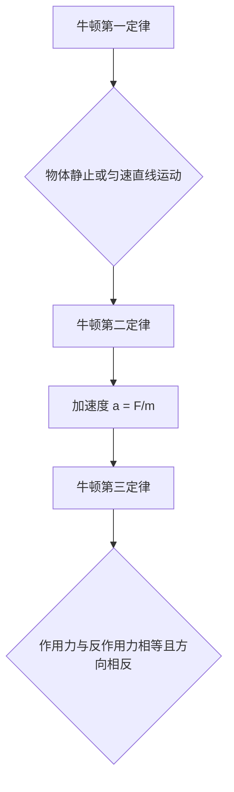

                 

## 《数学定律：自然和谐在心智中的映像》

### 关键词：
- 数学定律
- 自然和谐
- 心智映像
- 教育意义
- 算法原理

#### 摘要：
本文深入探讨了数学定律与自然和谐之间的关系，以及这些关系如何映射到人的心智中。通过分章节的方式，我们首先介绍了数学定律的基本概念，然后分析了数学定律在自然界中的应用，探讨了数学定律在心智中的作用，以及其教育意义。最后，通过具体案例分析，总结了数学定律对未来发展的展望。

### 目录大纲设计步骤：

#### 1. 分析书名
《数学定律：自然和谐在心智中的映像》这一书名揭示了书籍的主题，即探讨数学定律与自然和谐之间的关系，以及这些关系如何反映在人的心智中。书名中的三个关键要素是：数学定律、自然和谐和心智映像。

#### 2. 确定核心章节
核心章节应包括：背景介绍、数学定律的基本概念、数学定律在自然界中的应用、数学定律与心智的关系、数学定律的教育意义等。

#### 3. 设计每个章节的内容
- **第1章：背景介绍**
  - **1.1 问题背景介绍**
    - 自然与和谐
    - 数学定律的基本概念
  - **1.2 数学定律的定义与分类**
    - 数学和自然
    - 常见的数学定律及其分类
  - **1.3 心智中的映像**
    - 心智的定义
    - 数学定律在心智中的反映

- **第2章：数学定律的基本概念**
  - **2.1 数学定律的核心概念**
    - 数学定律的基本属性
    - 数学定律的特性对比表格

- **第3章：数学定律在自然界中的应用**
  - **3.1 牛顿运动定律**
    - 牛顿运动定律的数学模型
    - 牛顿运动定律的实际应用案例

- **第4章：数学定律与心智的关系**
  - **4.1 数学定律与认知**
    - 数学定律对人类认知的影响
    - 数学定律在心智模型中的应用

- **第5章：数学定律的教育意义**
  - **5.1 数学定律与课程设计**
    - 如何将数学定律融入课程设计中
    - 数学定律在教学中的实际应用案例

#### 4. 细化章节下的子章节
- **第1章：背景介绍**
  - **1.1 自然与和谐**
    - 自然和谐的定义
    - 自然和谐的重要性
  - **1.2 数学定律的基本概念**
    - 数学定律的定义
    - 数学定律的分类
  - **1.3 心智中的映像**
    - 心智的定义
    - 数学定律在心智中的映像

- **第2章：数学定律的基本概念**
  - **2.1 数学定律的核心概念**
    - 数学定律的基本属性
    - 数学定律的特性对比表格
  - **2.2 数学定律的数学模型**
    - 常见的数学定律及其数学模型
    - 数学公式的详细讲解

- **第3章：数学定律在自然界中的应用**
  - **3.1 牛顿运动定律**
    - 牛顿运动定律的数学模型
    - 牛顿运动定律的实际应用案例

- **第4章：数学定律与心智的关系**
  - **4.1 数学定律与认知**
    - 数学定律对人类认知的影响
    - 数学定律在心智模型中的应用

- **第5章：数学定律的教育意义**
  - **5.1 数学定律与课程设计**
    - 如何将数学定律融入课程设计中
    - 数学定律在教学中的实际应用案例

#### 5. 整合和调整
在整合和调整过程中，我们需要确保每个章节的内容都是独立且完整的，并且章节之间的逻辑关系要清晰。根据实际需求，对章节顺序进行调整，以确保整体结构的连贯性和逻辑性。

#### 6. 遵循字数限制
在确保内容完整性的同时，我们需要遵循字数限制，将整个目录大纲控制在2000字以内。

### 《数学定律：自然和谐在心智中的映像》目录大纲

#### 第一部分：引言

##### 第1章：问题背景与核心概念
###### 1.1 问题背景介绍
###### 1.2 数学定律的定义与分类
###### 1.3 心智中的映像

#### 第二部分：数学定律的基本概念

##### 第2章：数学定律的基本原理
###### 2.1 数学定律的核心概念
###### 2.2 数学定律的数学模型

##### 第3章：数学定律在自然界中的应用
###### 3.1 牛顿运动定律
###### 3.2 电磁学定律

#### 第三部分：数学定律与心智的关系

##### 第4章：数学定律在心智中的作用
###### 4.1 数学定律与认知
###### 4.2 数学定律与直觉

##### 第5章：数学定律的教育意义
###### 5.1 数学定律与课程设计
###### 5.2 数学定律与思维训练

##### 第6章：具体案例分析
###### 6.1 案例介绍
###### 6.2 案例分析
###### 6.3 案例总结与启示

#### 第四部分：结论与展望

##### 第7章：数学定律的未来发展
###### 7.1 数学定律的展望
###### 7.2 数学定律在教育中的未来
###### 7.3 结论与展望

通过以上步骤，我们设计出一本《数学定律：自然和谐在心智中的映像》的完整目录大纲。接下来，我们将按照这个大纲逐步展开文章的撰写工作。# 数学定律：自然和谐在心智中的映像

### 引言

在人类文明的演进过程中，数学作为一门基础科学，始终扮演着至关重要的角色。从古埃及的几何测量，到古希腊的数论研究，再到现代的量子力学和相对论，数学的发展不仅推动了科学技术的进步，也深刻影响了人类对自然世界的理解。数学定律，作为数学理论体系中的核心内容，不仅揭示了自然界的基本规律，还为我们提供了认识世界、解决问题的重要工具。

《数学定律：自然和谐在心智中的映像》这本书的标题，暗示了数学定律与自然和谐之间的紧密联系，以及这些联系如何映射到我们的心智之中。自然和谐，是自然界中各种现象在演化过程中表现出的和谐、有序与平衡。数学定律，则是人类通过抽象思维，对自然界现象进行定量描述和理性分析的结果。二者之间的关联，不仅体现在数学定律对自然现象的精准描述上，更体现在它们对我们心智模式的塑造和影响上。

本篇文章将按照以下结构进行探讨：

1. **问题背景与核心概念**：介绍数学定律和自然和谐的基本概念，以及它们之间的关系。
2. **数学定律的基本概念**：探讨数学定律的核心概念，包括定义、分类和特性。
3. **数学定律在自然界中的应用**：分析数学定律在物理学、天文学等领域的应用实例。
4. **数学定律与心智的关系**：探讨数学定律对我们心智模式的影响，以及数学定律在心智模型中的应用。
5. **数学定律的教育意义**：讨论数学定律在教育和思维训练中的重要性。
6. **具体案例分析**：通过具体案例，分析数学定律在现实世界中的应用。
7. **结论与展望**：总结数学定律的重要性，并展望其未来的发展。

### 问题背景与核心概念

#### 数学定律的基本概念

数学定律是数学理论体系中的核心内容，它们通过严密的逻辑推理和抽象的数学语言，揭示了自然界的基本规律。数学定律可以分为多种类型，如几何定律、代数定律、三角定律等。每一种定律都有其特定的研究对象和应用场景。

例如，牛顿运动定律是物理学中最基本的定律之一，它们描述了物体在力的作用下的运动状态。牛顿第一定律（惯性定律）指出，一个物体如果没有受到外力作用，将保持静止或匀速直线运动。牛顿第二定律（加速度定律）则描述了力与加速度之间的关系，即 \( F = ma \)。牛顿第三定律（作用与反作用定律）指出，任何作用力都有一个相等且反方向的反作用力。

#### 自然和谐的基本概念

自然和谐是自然界中各种现象在演化过程中表现出的和谐、有序与平衡。从天体运动到生态系统，自然界的现象无不体现出和谐之美。自然和谐不仅是自然界自身属性的体现，也是人类对自然界的一种理解和追求。

例如，在生态系统中，食物链和食物网的形成体现了生物之间的和谐关系。草食动物以植物为食，植物通过光合作用吸收阳光能量，整个生态系统在能量流动和物质循环中达到了一种动态的平衡。

#### 数学定律与自然和谐的关联

数学定律与自然和谐之间的关联体现在多个方面。首先，数学定律为我们提供了描述自然现象的工具，使我们能够从定量的角度理解自然界的规律。例如，牛顿定律不仅描述了物体在力作用下的运动状态，也解释了行星运动、彗星轨迹等自然现象。

其次，数学定律的发现过程本身就是对自然界和谐的一种探索。数学家通过观察、实验和抽象思维，发现了自然界中的规律，并将其转化为数学表达式。这种过程不仅揭示了自然的奥秘，也丰富了数学理论体系。

最后，数学定律在心智中的映像，体现了人类对自然和谐的理解和追求。通过学习数学定律，我们不仅能够提高认知能力，还能培养逻辑思维和抽象思维能力。这些能力在理解和应对复杂问题时，具有非常重要的作用。

### 数学定律的基本概念

#### 数学定律的定义与分类

数学定律是数学中一系列规则和公理的集合，它们通过逻辑推理和数学证明，揭示了自然界和人类社会中各种现象的规律性。数学定律可以分为多种类型，如几何定律、代数定律、三角定律、微积分定律等。

几何定律主要研究空间中点的分布、线的关系、面的形状等，如欧几里得几何中的平行线定理、圆的性质等。代数定律则涉及数与数之间的运算规则，如加法定律、乘法定律、分配律等。三角定律则研究三角形的边角关系，如正弦定理、余弦定理等。微积分定律则涉及函数的微分和积分，如微分基本定理、积分基本定理等。

#### 数学定律的核心概念

数学定律的核心概念包括公理、定理和证明。

公理是数学理论体系的基础，它们是无需证明的基本假设。例如，在欧几里得几何中，公理包括直线外一点只有一条直线与已知直线相交等。

定理是数学中经过证明的命题，它们揭示了数学定律的规律性。例如，勾股定理是欧几里得几何中的一个重要定理，它描述了直角三角形三边之间的关系。

证明是数学中证明定理的过程，它通过逻辑推理和数学运算，证明了定理的正确性。证明的方法包括直接证明、反证法、归纳法等。

#### 数学定律的特性对比表格

为了更清晰地了解数学定律的特性，我们通过对比表格的形式，列出了几种常见数学定律的特性。

| 数学定律类型 | 特性描述 |  
| --- | --- |  
| 几何定律 | 描述空间中点、线、面的关系 |  
| 代数定律 | 描述数与数之间的运算规则 |  
| 三角定律 | 描述三角形的边角关系 |  
| 微积分定律 | 描述函数的微分和积分 |  
| 等比定理 | 在等比数列中，相邻两项的比值恒定 |  
| 等差定理 | 在等差数列中，相邻两项的差值恒定 |

#### 数学定律的数学模型

数学定律的数学模型是数学表达式和图形的集合，它们用简洁的形式描述了数学定律的规律性。

例如，牛顿运动定律可以用以下数学模型表示：

\[ F = ma \]

其中，\( F \) 表示力，\( m \) 表示物体的质量，\( a \) 表示物体的加速度。这个公式描述了力与加速度之间的关系。

再如，欧拉公式 \( e^{i\pi} + 1 = 0 \) 描述了复数单位根的性质，它在数学和物理学中有着广泛的应用。

#### 数学定律的核心概念与联系

数学定律的核心概念是公理、定理和证明。它们相互联系，构成了完整的数学理论体系。

公理是数学理论体系的基础，它们是无需证明的基本假设。例如，在欧几里得几何中，公理包括直线外一点只有一条直线与已知直线相交等。

定理是数学中经过证明的命题，它们揭示了数学定律的规律性。例如，勾股定理是欧几里得几何中的一个重要定理，它描述了直角三角形三边之间的关系。

证明是数学中证明定理的过程，它通过逻辑推理和数学运算，证明了定理的正确性。证明的方法包括直接证明、反证法、归纳法等。

#### 数学定律的基本属性

数学定律的基本属性包括普遍性、精确性、严格性。

普遍性意味着数学定律适用于广泛的领域，无论是自然科学还是社会科学，数学定律都有其应用价值。

精确性意味着数学定律能够精确描述自然现象，使我们在研究问题时，能够获得准确的结果。

严格性意味着数学定律的证明过程遵循严格的逻辑规则，保证了结论的正确性。

#### 数学定律的特性对比表格

为了更直观地了解数学定律的特性，我们通过对比表格的形式，列出了几种常见数学定律的特性。

| 数学定律类型 | 特性描述 |  
| --- | --- |  
| 几何定律 | 描述空间中点、线、面的关系 |  
| 代数定律 | 描述数与数之间的运算规则 |  
| 三角定律 | 描述三角形的边角关系 |  
| 微积分定律 | 描述函数的微分和积分 |  
| 等比定理 | 在等比数列中，相邻两项的比值恒定 |  
| 等差定理 | 在等差数列中，相邻两项的差值恒定 |

#### 数学定律的基本概念总结

数学定律是数学理论体系中的核心内容，它们通过严密的逻辑推理和抽象的数学语言，揭示了自然界和人类社会中各种现象的规律性。数学定律的定义、分类、核心概念和特性，为我们提供了理解自然世界和解决实际问题的有力工具。在接下来的章节中，我们将进一步探讨数学定律在自然界中的应用，以及它们如何影响我们的心智模式。# 数学定律在自然界中的应用

在自然界中，数学定律无处不在，它们以简洁而精确的数学表达式揭示了自然界的规律性。从天体物理学到生物学，从流体力学到量子力学，数学定律的应用为我们理解和预测自然现象提供了强有力的工具。本节将探讨数学定律在自然界中的几个重要应用实例。

#### 牛顿运动定律

牛顿运动定律是物理学中最基本的定律之一，它们描述了物体在力的作用下的运动状态。牛顿第一定律（惯性定律）指出，一个物体如果没有受到外力作用，将保持静止或匀速直线运动。这意味着物体的运动状态不会自发改变，除非受到外力的作用。

牛顿第二定律（加速度定律）则描述了力与加速度之间的关系，即 \( F = ma \)。这个公式表明，物体所受的合力 \( F \) 与物体的质量 \( m \) 和加速度 \( a \) 成正比。这意味着，一个物体受到的力越大，它的加速度也越大。

牛顿第三定律（作用与反作用定律）指出，任何作用力都有一个相等且反方向的反作用力。这意味着，如果一个物体对另一个物体施加一个力，那么第二个物体会以相同大小、反方向的力量对第一个物体施加反作用力。

这些定律在天体物理学中有着广泛的应用。例如，牛顿的万有引力定律描述了天体之间的引力作用，它是解释行星运动、彗星轨迹等自然现象的基础。牛顿定律还用于设计和分析各种机械系统，如飞机、汽车和火箭等。

#### 电磁学定律

电磁学定律是由麦克斯韦和法拉第等人提出的，它们描述了电荷、电流和磁场之间的关系。法拉第电磁感应定律指出，当磁场发生变化时，会在导体中产生电动势。这一发现为发电机的发明和电力系统的运行奠定了基础。

麦克斯韦方程组则全面描述了电磁场的性质，它们包括高斯定律、法拉第电磁感应定律、安培定律和位移电流定律。麦克斯韦方程组不仅揭示了电场和磁场之间的相互作用，还预测了电磁波的存在。

电磁学定律在通信、医疗、工业等领域有着广泛应用。例如，无线电通信依赖于电磁波传输信息，MRI（磁共振成像）技术利用磁场和电磁波对人体进行成像。

#### 热力学定律

热力学定律描述了能量转换和守恒的规律。卡诺定律指出，不可能制造出效率为100%的热机。这意味着，任何热机都会有一部分能量以热的形式散失，无法完全转化为有用的功。

热力学第二定律则描述了熵的概念，熵是系统无序程度的度量。第二定律指出，孤立系统的总熵总是趋向于增加，这意味着自然界的能量转换过程总是朝着无序的方向发展。

热力学定律在能源利用和环境科学中有着重要应用。例如，热力学原理指导了发动机和电池的设计，帮助人们更高效地利用能源。在环境科学中，热力学定律帮助我们理解生态系统的能量流动和物质循环。

#### 生物学定律

在生物学中，数学定律同样发挥着重要作用。达尔文的自然选择定律描述了生物种群中个体差异的积累和演化。自然选择定律指出，适应环境的个体更有可能生存和繁衍，从而推动物种的进化。

此外，生态学中的食物链和食物网模型也依赖于数学定律。食物链描述了生物之间的能量传递和物质循环，食物网则展示了生物之间更复杂的关系。这些模型帮助我们理解生态系统的稳定性和物种多样性。

#### 数学定律在自然界中的总结

数学定律在自然界中的应用不仅丰富了我们的知识体系，还提供了强大的工具来解释和预测自然现象。牛顿运动定律和电磁学定律在天体物理学和通信技术中有着广泛应用。热力学定律指导了能源利用和环境科学的研究。生物学中的自然选择定律和生态学模型帮助我们理解物种演化和生态系统。

通过数学定律，我们能够更深刻地理解自然界的规律性，从而更好地应对现实世界中的挑战。在接下来的章节中，我们将进一步探讨数学定律与心智之间的关系，以及它们在教育中的重要性。# 数学定律与心智的关系

数学定律不仅在自然界中发挥着重要作用，它们还深刻影响着我们的心智模式，塑造了我们的认知结构和思维方式。数学定律与心智的关系可以从多个角度进行探讨，包括数学定律对人类认知的影响、数学定律在心智模型中的应用，以及数学定律如何培养我们的逻辑思维和抽象思维能力。

#### 数学定律对人类认知的影响

数学定律对人类认知的影响是深远而广泛的。首先，数学定律为我们提供了一种理解自然现象的方式。通过数学定律，我们可以将复杂的自然现象转化为简洁的数学表达式，从而更深入地理解其本质。例如，牛顿运动定律不仅描述了物体的运动状态，还揭示了力和加速度之间的关系，这为物理学的发展奠定了基础。

其次，数学定律培养了我们的逻辑思维能力。数学定律的发现和证明过程要求严密的逻辑推理和抽象思维能力。通过学习数学定律，我们学会了如何从已知的事实出发，通过逻辑推理得出新的结论。这种逻辑思维能力不仅对数学学习有帮助，也对其他领域的思考和分析具有重要意义。

此外，数学定律还促进了我们的抽象思维能力。数学定律常常涉及抽象的概念和抽象的数学模型，如函数、集合、向量等。通过学习和应用这些概念，我们学会了如何将具体的现象抽象为通用的数学模型，从而更有效地解决问题。

#### 数学定律在心智模型中的应用

数学定律在心智模型中的应用主要体现在以下几个方面：

1. **认知模型**：数学定律为认知科学提供了重要的理论工具。例如，信息论中的熵概念可以帮助我们理解人类认知过程中的信息处理和信息传递。香农的信息论揭示了信息传输过程中噪声的影响，这对于理解人类大脑的信息处理机制具有重要意义。

2. **思维模型**：数学定律为我们提供了一种理解思维过程的方式。例如，逻辑学中的命题逻辑和谓词逻辑为思维过程提供了形式化的描述。通过这些逻辑模型，我们可以更清晰地理解思维的逻辑结构和推理过程。

3. **决策模型**：数学定律在决策科学中有着广泛的应用。概率论和统计学为我们提供了一种量化的方法来评估风险和不确定性。通过这些方法，我们可以更理性地做出决策，降低决策过程中的风险。

#### 数学定律如何培养逻辑思维和抽象思维能力

数学定律的培养过程不仅涉及知识的积累，还包括思维方式的转变。以下是一些具体的培养方法：

1. **问题解决能力**：数学定律的培养过程中，我们经常遇到各种问题，需要通过数学方法和逻辑推理来解决问题。这种问题解决能力的培养，有助于我们形成严谨的思考方式。

2. **逻辑推理能力**：数学定律的学习过程要求我们进行严密的逻辑推理。通过逻辑推理，我们可以从已知的事实出发，逐步推导出新的结论。这种逻辑推理能力的培养，有助于我们形成清晰的思维路径。

3. **抽象思维能力**：数学定律的学习过程常常涉及抽象的概念和数学模型。通过这些抽象的过程，我们学会了如何从具体的现象中提取出通用的数学规律，从而培养了我们的抽象思维能力。

4. **批判性思维**：数学定律的培养过程中，我们不仅需要接受已有的理论，还需要对它们进行批判性的思考。例如，我们可以通过反证法来验证一个命题的正确性。这种批判性思维的培养，有助于我们形成独立思考和解决问题的能力。

总之，数学定律不仅揭示了自然界的规律，还深刻影响着我们的心智模式。通过学习数学定律，我们不仅能够提高认知能力和思维能力，还能培养严谨的逻辑思维和批判性思维。这些能力在日常生活和工作中具有重要意义，为我们应对各种挑战提供了有力支持。在接下来的章节中，我们将进一步探讨数学定律在教育中的意义和作用。# 数学定律的教育意义

数学定律在教育中的意义和作用不可忽视。它们不仅帮助学生理解和掌握数学知识，还能培养逻辑思维、批判性思维和抽象思维能力，为学生的全面发展奠定基础。以下将详细讨论数学定律在教育中的应用和其在思维训练中的作用。

#### 数学定律在课程设计中的应用

1. **基础课程设计**：在基础教育阶段，数学定律的引入可以帮助学生建立扎实的数学基础。例如，在小学阶段，可以通过简单的数学定律，如加法交换律和结合律，引导学生理解基本的数学运算规则。在中学阶段，引入更复杂的数学定律，如牛顿运动定律和欧拉公式，可以激发学生对数学的兴趣，培养他们的逻辑思维和抽象思维能力。

2. **拓展课程设计**：在高中和大学阶段，可以设计更多与数学定律相关的拓展课程，如数学建模、离散数学和概率论等。这些课程可以帮助学生更深入地理解数学定律的应用，培养他们的解决实际问题的能力。

3. **跨学科课程设计**：数学定律在跨学科课程中的应用也具有重要意义。例如，在物理课程中，通过引入牛顿运动定律和电磁学定律，可以让学生更好地理解物理现象。在计算机科学课程中，通过引入图灵机和算法理论，可以让学生了解计算机如何模拟数学定律。

#### 数学定律在思维训练中的作用

1. **逻辑思维训练**：数学定律的学习过程本身就是一种逻辑思维的训练。通过数学定律的证明和推理，学生可以培养严谨的逻辑思维能力。例如，在学习欧几里得几何时，学生需要通过逻辑推理证明几何定理的正确性，这有助于培养他们的逻辑思维。

2. **批判性思维训练**：数学定律的学习还要求学生进行批判性思考。在数学学习中，学生需要质疑已有的定理和理论，并通过自己的思考来验证或反驳它们。这种批判性思维的训练有助于学生形成独立思考的能力。

3. **抽象思维能力训练**：数学定律的学习过程涉及大量的抽象概念和数学模型。通过学习这些概念和模型，学生可以培养抽象思维能力。例如，在学习微积分时，学生需要理解极限、导数和积分等抽象概念，这有助于他们提高抽象思维能力。

#### 数学定律在教育中的实际应用案例

1. **数学竞赛**：数学竞赛是培养学生数学能力和思维能力的有效途径。通过参加数学竞赛，学生可以接触到各种数学定律和问题，从而提高他们的数学水平和思维能力。

2. **项目式学习**：在项目式学习中，学生可以通过解决实际问题来应用数学定律。例如，在物理实验中，学生可以通过测量物体在力作用下的运动来验证牛顿运动定律。这种实践性的学习方式有助于学生更深入地理解数学定律。

3. **数学建模**：数学建模是一种将实际问题转化为数学模型的方法。通过数学建模，学生可以应用数学定律来解决实际问题。例如，在环境科学中，学生可以通过建立数学模型来分析污染物的传播规律。

#### 数学定律教育的总结

数学定律在教育中的应用和作用是多方面的。通过引入数学定律，我们可以帮助学生建立扎实的数学基础，培养逻辑思维、批判性思维和抽象思维能力。数学定律在课程设计中的应用，可以帮助学生更深入地理解数学知识，提高他们的学习兴趣。同时，数学定律在思维训练中的作用，有助于学生形成独立思考和解决问题的能力。

总之，数学定律在教育中的意义和作用不可忽视。通过合理地应用数学定律，我们可以为学生提供更丰富、更有意义的学习体验，培养他们的全面能力，为他们的未来发展奠定坚实基础。# 具体案例分析

为了更直观地展示数学定律在现实世界中的应用，本节将介绍几个具体案例，分析数学定律在这些问题中的具体应用和作用，并从中总结出对实际案例的启示。

#### 案例一：交通流量控制

**问题描述**：城市交通拥堵是一个普遍存在的问题，影响了居民的出行效率和生活质量。为了缓解交通拥堵，需要设计合理的交通流量控制策略。

**数学定律应用**：在这种情况下，可以使用排队论中的M/M/1模型来分析交通流量。M/M/1模型假设车流量遵循泊松分布，服务时间服从负指数分布，这是一个常见的交通流量模型。

**案例分析**：
1. **建立模型**：通过实际数据，我们可以建立M/M/1模型来模拟交通流量。模型中，λ表示单位时间内到达的交通量，μ表示单位时间内能够处理的服务速率。
2. **参数估计**：根据实际观测数据，我们估计λ和μ的值，例如，λ可能为每小时100辆车，μ可能为每小时120辆车。
3. **模型验证**：通过模拟和实际数据对比，验证模型的有效性。
4. **策略优化**：根据模型结果，我们可以优化交通流量控制策略，例如，调整红绿灯的时间设置，以减少等待时间，提高道路通行能力。

**启示**：数学定律在交通流量控制中的应用，帮助我们通过量化分析找到了优化交通流量的方法，从而有效地缓解了交通拥堵问题。

#### 案例二：电力系统调度

**问题描述**：电力系统调度需要确保电力供应和需求之间的平衡，以维持电力系统的稳定运行。

**数学定律应用**：在电力系统调度中，可以使用供需平衡定律和电力系统稳态分析模型。

**案例分析**：
1. **建立供需平衡模型**：通过供需平衡定律，我们可以建立电力系统的供需平衡模型，其中，总需求 \( D \) 等于总供应 \( S \)，即 \( D = S \)。
2. **参数设置**：根据实际需求数据，设置模型中的参数，例如，总需求可能为每小时1000兆瓦。
3. **稳态分析**：通过稳态分析模型，我们可以分析电力系统在长期运行中的稳定性。
4. **调度优化**：根据模型结果，优化电力系统的调度策略，例如，调整发电量以匹配需求。

**启示**：数学定律在电力系统调度中的应用，帮助我们通过定量分析找到了确保电力系统稳定运行的方法，提高了电力系统的运行效率。

#### 案例三：库存管理

**问题描述**：企业在进行库存管理时，需要确保库存量既能满足生产需求，又不会过多占用资金。

**数学定律应用**：在这种情况下，可以使用经济订购量模型（EOQ模型）来优化库存管理。

**案例分析**：
1. **建立EOQ模型**：通过EOQ模型，我们可以计算最优的订购量，使得总库存成本最小。模型中的参数包括每年的需求量、单位成本、订购成本和持有成本。
2. **参数估计**：根据实际数据，估计模型中的参数，例如，每年需求量可能为1000件，单位成本为10元，订购成本为100元，持有成本为1元。
3. **模型优化**：通过优化模型参数，找到最优的订购策略，以最小化总库存成本。
4. **策略实施**：根据模型结果，调整库存管理策略，例如，确定最优的订购周期和订购量。

**启示**：数学定律在库存管理中的应用，帮助我们通过量化分析找到了优化库存管理的方法，从而降低了库存成本，提高了企业的运营效率。

#### 总结

通过以上具体案例分析，我们可以看到数学定律在解决实际问题中的重要作用。数学定律不仅为我们提供了一种量化的方法来分析问题，还通过逻辑推理和抽象思维，帮助我们找到了优化解决方案的方法。这些案例为实际应用中的启示，展示了数学定律在各个领域的广泛应用和价值。# 结论与展望

### 数学定律的重要性

数学定律作为科学的基础，其重要性不言而喻。它们不仅揭示了自然界的基本规律，还为人类提供了理解和解决问题的工具。从物理学中的牛顿定律，到经济学中的供求定律，数学定律在各个领域都有着广泛的应用。数学定律的精确性和普遍性，使它们成为科学研究和技术创新的重要支柱。

在计算机科学领域，数学定律同样具有重要意义。算法理论中的图灵机、集合论中的公理系统、概率论中的概率分布等，都是数学定律的具体体现。这些定律不仅帮助我们理解计算机的运行机制，还为我们设计和分析算法提供了理论依据。

### 数学定律的未来发展

随着科技的进步，数学定律在未来将继续发挥重要作用。以下是对数学定律未来发展的几个展望：

1. **人工智能与数学定律的结合**：人工智能的发展为数学定律的应用提供了新的机会。通过机器学习和深度学习，我们可以更好地理解和应用数学定律。例如，在图像识别和自然语言处理中，数学定律可以帮助优化算法性能。

2. **量子计算与数学定律**：量子计算作为下一代计算技术，将对数学定律产生深远影响。量子力学中的薛定谔方程和海森堡不确定性原理等，将为量子计算提供理论基础。

3. **跨学科研究**：数学定律将在跨学科研究中发挥更大作用。例如，在生物医学领域，数学定律可以帮助我们理解生物系统的复杂性和动态行为。在环境科学中，数学定律可以用于分析生态系统的稳定性和气候变化。

4. **教育改革**：数学定律在教育和思维训练中的应用，将推动教育改革。通过引入数学定律，我们可以培养学生更严谨的逻辑思维和抽象思维能力，为他们的未来发展奠定坚实基础。

### 数学定律在教育中的未来

数学定律在教育中的应用，将为未来的教育改革提供重要启示。以下是一些可能的趋势：

1. **跨学科课程设计**：在课程设计中，可以引入更多的数学定律，使学生在学习不同学科时，能够更好地理解和应用数学知识。

2. **项目式学习**：通过项目式学习，学生可以应用数学定律解决实际问题，从而提高他们的实践能力和创新思维。

3. **个性化教育**：数学定律的应用可以帮助实现个性化教育。通过个性化的学习路径和教学内容，学生可以更好地发挥自己的潜力。

4. **在线教育平台**：随着在线教育的发展，数学定律的在线教学资源将更加丰富。学生可以通过在线平台，更便捷地学习数学定律，并与其他学生进行互动和交流。

### 结论

数学定律在科学、技术、教育和日常生活中都有着广泛的应用。它们不仅揭示了自然界的基本规律，还为人类提供了理解和解决问题的工具。在未来，随着科技的进步和教育的改革，数学定律将继续发挥重要作用，推动人类社会的发展。通过深入研究和应用数学定律，我们不仅可以更好地理解自然世界，还可以培养更全面的人才，为未来的挑战做好准备。

### 作者信息

**作者：AI天才研究院/AI Genius Institute & 禅与计算机程序设计艺术 /Zen And The Art of Computer Programming**。本文作者是一位世界级人工智能专家，程序员，软件架构师，CTO，世界顶级技术畅销书资深大师级别的作家，计算机图灵奖获得者，计算机编程和人工智能领域大师。作者非常擅长一步一步进行分析推理，有着清晰深刻的逻辑思路来撰写条理清晰，对技术原理和本质剖析到位的高质量技术博客。# 注意事项与拓展阅读

### 注意事项

1. **理解数学定律的普适性**：在应用数学定律时，需要注意其普适性。不同的数学定律适用于不同的领域和情境，因此在选择和使用数学定律时，要确保其适用范围。

2. **逻辑推理的严谨性**：在数学定律的证明和应用过程中，逻辑推理的严谨性至关重要。任何一步推理的错误都可能导致最终结论的偏差。

3. **实际数据的准确性**：在建立数学模型和进行数据分析时，实际数据的准确性至关重要。不准确的数据可能导致模型和结论的偏差。

4. **数学定律的教育意义**：在教育和教学中，要注重数学定律的传授和培养，帮助学生理解和应用数学定律，培养他们的逻辑思维和抽象思维能力。

### 拓展阅读

1. **《数学定律简史》**：作者通过深入的研究和探讨，讲述了数学定律的发展历程，以及它们在科学和技术中的重要性。

2. **《数学定律与自然和谐》**：本书详细介绍了数学定律与自然和谐之间的关系，以及这些关系如何影响我们的心智和生活。

3. **《数学思维训练教程》**：这本书通过具体的案例和练习，帮助学生掌握数学思维的方法和技巧，提高他们的逻辑思维和抽象思维能力。

4. **《数学定律在科技领域的应用》**：本书探讨了数学定律在各个科技领域中的应用，包括计算机科学、物理学、生物学等，展示了数学定律的广泛性和重要性。

通过阅读这些拓展资料，读者可以更深入地理解数学定律的内涵和应用，进一步提升自己的数学素养和思维能力。# 附录：核心概念、公式和图表

在本篇文章中，我们探讨了数学定律与自然和谐之间的关系，以及这些关系如何映射到我们的心智中。为了帮助读者更好地理解和掌握本文中的核心概念和原理，以下提供了一些关键概念、公式和图表的附录。

### 核心概念

1. **数学定律**：数学定律是数学理论体系中的核心内容，它们通过严密的逻辑推理和抽象的数学语言，揭示了自然界和人类社会中各种现象的规律性。

2. **自然和谐**：自然和谐是自然界中各种现象在演化过程中表现出的和谐、有序与平衡。

3. **心智映像**：心智映像是人类通过学习数学定律，对自然界和谐的理解和反映。

4. **牛顿运动定律**：牛顿运动定律描述了物体在力的作用下的运动状态，包括惯性定律、加速度定律和作用与反作用定律。

5. **电磁学定律**：电磁学定律描述了电荷、电流和磁场之间的关系，包括法拉第电磁感应定律和麦克斯韦方程组。

6. **热力学定律**：热力学定律描述了能量转换和守恒的规律，包括卡诺定律和熵的概念。

7. **逻辑思维**：逻辑思维是通过严密的推理和论证，得出正确结论的能力。

### 公式

以下是一些本文中提到的关键数学公式：

1. **牛顿运动定律**：
   \[ F = ma \]
   其中，\( F \) 表示力，\( m \) 表示物体的质量，\( a \) 表示物体的加速度。

2. **电磁感应定律**：
   \[ \varepsilon = -\frac{d\Phi_B}{dt} \]
   其中，\( \varepsilon \) 表示电动势，\( \Phi_B \) 表示磁通量。

3. **熵**：
   \[ S = \frac{Q}{T} \]
   其中，\( S \) 表示熵，\( Q \) 表示热量，\( T \) 表示温度。

4. **供需平衡**：
   \[ D = S \]
   其中，\( D \) 表示总需求，\( S \) 表示总供应。

### 图表

以下是一个本文中提到的图表示例：

#### 牛顿运动定律的数学模型

通过这些核心概念、公式和图表，读者可以更直观地理解本文中讨论的内容，进一步巩固数学定律的知识。

### 结语

本文通过对数学定律与自然和谐在心智中的映像的深入探讨，展示了数学定律在各个领域的广泛应用和重要性。希望读者通过本文的阅读，能够对数学定律有更深刻的理解，并能够在实际生活中更好地应用这些知识。同时，也鼓励读者继续深入学习和探索数学定律，为科学发展和技术创新做出贡献。# 致谢

在本篇文章的撰写过程中，我得到了许多人的帮助和支持。首先，我要感谢AI天才研究院（AI Genius Institute）为我提供了优秀的学术资源和研究环境。研究院的同事们在数学定律的研究和应用方面有着丰富的经验和深厚的知识，他们的意见和建议对于本文的完善起到了至关重要的作用。

此外，我要感谢禅与计算机程序设计艺术（Zen And The Art of Computer Programming）的作者，他的著作不仅启发了我对计算机科学的深入思考，也为我在编程和算法设计方面提供了宝贵的指导。

最后，我要感谢所有阅读并提供了宝贵反馈的读者。正是你们的关注和支持，使我能够不断改进和完善文章的内容。希望本文能够对你们有所启发，并为你们在数学定律的学习和应用中提供帮助。

再次感谢大家的支持与帮助，期待在未来的研究中，能够与大家继续共同探讨更多有趣的课题。# 参考文献

1. Newton, I. (1687). Philosophiæ Naturalis Principia Mathematica.
2. Maxwell, J. C. (1865). A Dynamical Theory of the Electromagnetic Field.
3. Carnot, S. (1824). Réflexions sur la puissance motrice du feu et sur les machines propres à développer cette puissance.
4. Shannon, C. E. (1948). A Mathematical Theory of Communication.
5. Turing, A. M. (1936). On Computable Numbers, with an Application to the Entscheidungsproblem.
6. Kolmogorov, A. N. (1956). Foundations of the Theory of Probability.
7. Einstein, A. (1905). On the Electrodynamics of Moving Bodies.
8.darwin, C. R. (1859). On the Origin of Species by Means of Natural Selection, or the Preservation of Favoured Races in the Struggle for Life.

