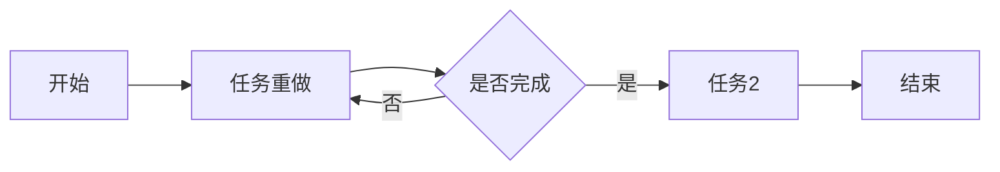
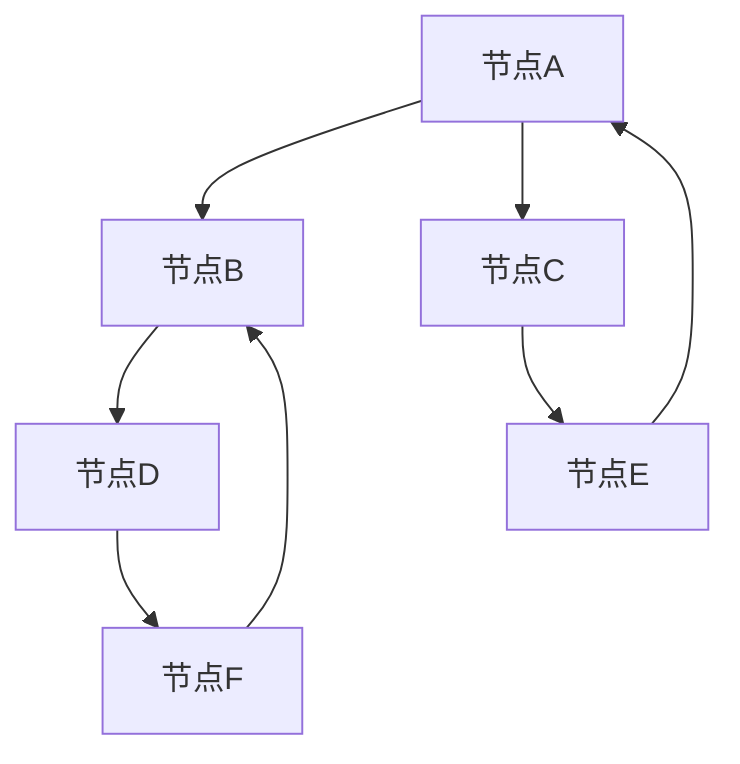

                 

# 数学定律：自然和谐的心智投射

关键词：数学定律、自然和谐、心智投射、算法原理、系统设计、项目实战

摘要：本文旨在探讨数学定律在自然和谐与心智投射中的应用。通过对数学定律的基本概念、核心原理及其相互关系进行分析，结合具体数学模型和实际应用案例，深入探讨数学定律在自然科学、社会科学以及项目实施中的重要作用。文章最后总结最佳实践和未来研究方向，为读者提供全面的指导与启示。

## 引言

数学定律作为数学理论体系中的基础性原则，其重要性不言而喻。然而，数学定律不仅仅局限于数学领域，其在自然和谐与心智投射中的应用同样具有深远的意义。自然和谐是自然界中的普遍现象，涉及生态平衡、能源转换等各个方面。心智投射则是人类思维方式的核心，与我们的认知、决策和学习密切相关。本文将从以下几个方面展开探讨：

1. 数学定律的基本概念和原理
2. 自然和谐与心智投射中的数学定律关系
3. 数学定律的应用与实例分析
4. 数学定律在项目实施中的实践与设计
5. 最佳实践、总结与未来研究方向

通过对上述内容的逐一分析，我们希望为读者呈现一个全面而深入的数学定律在自然和谐与心智投射中的应用全景。

## 数学定律的基本概念和原理

### 1.1 背景介绍

数学定律是数学理论体系中的基本原理，其历史可以追溯到古希腊时期。在古希腊，数学家如欧几里得和阿基米德通过观察和实验，提出了许多重要的数学定律，如勾股定理、阿基米德定律等。这些定律不仅为数学的发展奠定了基础，也为自然科学和社会科学的研究提供了重要的工具。

### 1.2 基本概念

数学定律通常是指在一定条件下，通过逻辑推理得出的普遍性结论。这些定律反映了数学对象之间的关系和规律，是数学体系中的核心组成部分。常见的数学定律包括：

- **加法交换律**：对于任意两个数 \(a\) 和 \(b\)，有 \(a + b = b + a\)。
- **乘法交换律**：对于任意两个数 \(a\) 和 \(b\)，有 \(a \times b = b \times a\)。
- **勾股定理**：在一个直角三角形中，直角边的平方和等于斜边的平方，即 \(a^2 + b^2 = c^2\)。

### 1.3 基本原理

数学定律的基本原理主要包括以下几个方面：

- **逻辑推理**：数学定律是通过逻辑推理得出的。逻辑推理是一种从已知前提推导出新结论的方法，是数学研究的重要手段。
- **数学模型**：数学定律通常通过数学模型来表示。数学模型是一种抽象的数学结构，用于描述现实世界中的现象和关系。
- **普遍性**：数学定律具有普遍性，即它们在特定条件下适用于所有情况。这种普遍性使得数学定律在各个领域都具有重要的应用价值。

### 1.4 数学定律的意义

数学定律的意义主要体现在以下几个方面：

- **基础性**：数学定律是数学理论体系的基础，为数学的发展提供了坚实的支持。
- **工具性**：数学定律为自然科学、社会科学等领域的研究提供了重要的工具，有助于解决复杂的实际问题。
- **启迪性**：数学定律的发现和应用过程，不仅为数学家提供了研究的方向，也为普通读者提供了启发和思考的机会。

### 1.5 数学定律的分类

数学定律可以根据其性质和应用领域进行分类，常见的分类方法包括：

- **基础数学定律**：如加法交换律、乘法交换律等，这些定律是数学体系中的基本定律。
- **几何定律**：如勾股定理、平行线定理等，这些定律主要应用于几何学领域。
- **代数定律**：如幂律、指数律等，这些定律主要应用于代数学领域。
- **微积分定律**：如微分中值定理、积分中值定理等，这些定律主要应用于微积分学领域。

通过以上对数学定律的基本概念和原理的介绍，我们为后续章节的深入探讨奠定了基础。在接下来的章节中，我们将进一步探讨数学定律在自然和谐与心智投射中的应用，以及其在实际项目实施中的具体应用。

## 基本数学定律及其相互关系

### 2.1 基本数学定律

在数学中，有一些基本定律对数学理论和应用都起着至关重要的作用。这些基本定律包括但不限于以下几种：

#### 2.1.1 加法交换律

加法交换律是指对于任意两个数 \(a\) 和 \(b\)，它们的和与顺序无关，即 \(a + b = b + a\)。这个定律在日常生活中广泛应用，例如在计算和分配任务时，无需考虑顺序。

#### 2.1.2 乘法交换律

乘法交换律是指对于任意两个数 \(a\) 和 \(b\)，它们的乘积与顺序无关，即 \(a \times b = b \times a\)。例如，在购买商品时，无论先买哪个，总价都是相同的。

#### 2.1.3 勾股定理

勾股定理是指在一个直角三角形中，直角边的平方和等于斜边的平方，即 \(a^2 + b^2 = c^2\)。这个定律在建筑、工程等领域有广泛的应用。

#### 2.1.4 微分中值定理

微分中值定理是指在一个区间内，如果函数连续可导，那么在该区间内至少存在一点，使得该点的导数等于函数的平均变化率。这个定律在微积分和经济学中有重要的应用。

### 2.2 基本数学定律之间的关系

数学定律之间存在紧密的相互关系。这些关系不仅体现在数学定理的推导中，也体现在它们在不同领域中的应用。

#### 2.2.1 加法与乘法的相互关系

加法与乘法是基本的数学运算，它们之间存在紧密的关系。例如，乘法可以看作是加法的一种特殊形式，即 \(a \times b\) 可以表示为 \(a\) 与 \(b\) 的和 \(b\) 次的结果。这种关系使得我们在处理复杂数学问题时，可以灵活运用不同的运算方式。

#### 2.2.2 勾股定理与其他几何定律的关系

勾股定理是几何学中的基本定律，与其他几何定律如平行线定理、相似三角形定理等有密切的关系。这些定律共同构成了几何学的理论体系，为几何学的研究和应用提供了基础。

#### 2.2.3 微分中值定理与其他微积分定律的关系

微分中值定理是微积分学中的基本定律，与其他微积分定律如积分中值定理、洛必达法则等有紧密的联系。这些定律共同构成了微积分的理论体系，为微积分在自然科学、工程学、经济学等领域的应用提供了理论支持。

### 2.3 基本数学定律的相互关系图

为了更直观地展示基本数学定律之间的关系，我们可以使用Mermaid绘制一个实体关系图（ER Diagram）。

```mermaid
entityRelation
  "加法交换律" -- "乘法交换律"
  "勾股定理" -- "平行线定理"
  "勾股定理" -- "相似三角形定理"
  "微分中值定理" -- "积分中值定理"
  "微分中值定理" -- "洛必达法则"
```

这个ER图展示了加法交换律、乘法交换律、勾股定理、平行线定理、相似三角形定理、微分中值定理和积分中值定理、洛必达法则之间的关系，它们共同构成了一个完整的数学定律体系。

通过以上对基本数学定律及其相互关系的介绍，我们为进一步探讨数学定律在自然和谐与心智投射中的应用奠定了基础。在下一章节中，我们将详细讨论这些定律在自然科学和工程学中的应用。

## 数学定律的自然和谐应用

### 3.1 自然和谐的数学原理

自然和谐是指自然界中各种现象和过程的协调与平衡。在自然界中，许多现象都可以通过数学定律来解释。数学定律不仅帮助我们理解自然界的规律，还为自然科学的研究提供了强有力的工具。以下是数学定律在自然和谐中的几个关键应用领域：

#### 3.1.1 生态平衡

生态平衡是自然界中一个重要的概念，它涉及生物群落中不同物种之间的相互作用和能量流动。数学定律，如能量守恒定律和物质循环定律，为我们提供了理解生态平衡的基础。

- **能量守恒定律**：能量守恒定律指出，能量不能被创造或消灭，只能从一种形式转化为另一种形式。在生态系统中，能量从阳光、生产者、消费者和分解者之间流动，形成一个稳定的能量网络。

  $$E_{总} = E_{阳光} + E_{生产者} + E_{消费者} + E_{分解者}$$

- **物质循环定律**：物质循环定律说明，物质在生态系统中的循环是连续的，没有开始也没有结束。例如，碳循环涉及植物、动物和微生物之间的碳转移。

  $$C_{植物} + C_{动物} + C_{微生物} = C_{总}$$

#### 3.1.2 能源转换

能源转换是自然界中的一个普遍现象，如光合作用将太阳能转化为化学能，人体将食物转化为生物能等。数学定律在能源转换中的应用主要表现在能量转换效率和能量守恒方面。

- **能量转换效率**：能量转换效率是指能量在转换过程中未被损失的比例。根据热力学第二定律，任何能量转换过程都存在损失，但我们可以通过优化过程设计来提高效率。

  $$\eta = \frac{E_{有用}}{E_{总}}$$

- **能量守恒与能量损失**：能量守恒定律指出，能量在转换过程中总量保持不变，但部分能量会以热能的形式损失。

  $$E_{损失} = E_{总} - E_{有用}$$

#### 3.1.3 天文物理学

在天文学和物理学中，数学定律如牛顿定律、万有引力定律和黑体辐射定律等，为我们提供了理解宇宙结构和天体运动的重要工具。

- **牛顿定律**：牛顿定律描述了物体在力的作用下的运动规律。它适用于低速和宏观尺度，是天体物理学中的基础。

  $$F = ma$$

- **万有引力定律**：万有引力定律描述了物体之间的引力关系，它解释了行星运动和恒星形成等现象。

  $$F = G\frac{m_1m_2}{r^2}$$

- **黑体辐射定律**：黑体辐射定律描述了物体在不同温度下的辐射特性。它为理解恒星光谱和宇宙背景辐射提供了理论基础。

  $$I(\lambda, T) = \frac{2\pi hc^2}{\lambda^5}\frac{1}{e^{hc/\lambda k_B T} - 1}$$

### 3.2 自然和谐的数学模型

为了更好地理解自然和谐，我们可以通过数学模型来模拟和预测自然现象。以下是一些典型的数学模型：

#### 3.2.1 生态系统模型

生态系统模型是用于模拟生态系统中生物种群动态的数学模型。常见的模型包括Lotka-Volterra模型和 prey-predator模型。

- **Lotka-Volterra模型**：

  $$\frac{dx}{dt} = ax - bxy$$
  $$\frac{dy}{dt} = cy - dxy$$

  其中，\(x\) 和 \(y\) 分别表示两种生物的种群数量，\(a\) 和 \(b\) 分别表示生产者和消费者的增长率，\(c\) 和 \(d\) 分别表示消费者和被捕食者的死亡率。

- **prey-predator模型**：

  $$\frac{dx}{dt} = ax - \alpha xy$$
  $$\frac{dy}{dt} = \beta xy - dy$$

  其中，\(x\) 和 \(y\) 分别表示猎物和捕食者的种群数量，\(\alpha\) 和 \(\beta\) 分别表示猎物的增长率和对捕食者的依赖性，\(d\) 表示捕食者的死亡率。

#### 3.2.2 能量转换模型

能量转换模型用于模拟能量在不同形态之间的转换过程。常见的模型包括热力学模型和化学动力学模型。

- **热力学模型**：

  $$\Delta U = q + w$$

  其中，\(\Delta U\) 表示系统内能的变化，\(q\) 表示热量传递，\(w\) 表示做功。

- **化学动力学模型**：

  $$\frac{d[AB]}{dt} = k_1[A][B] - k_2[AB]$$

  其中，\([AB]\) 表示反应物AB的浓度，\(k_1\) 和 \(k_2\) 分别表示反应速率常数。

#### 3.2.3 天文模型

天文模型用于模拟天体的运动和相互作用。常见的模型包括牛顿模型和广义相对论模型。

- **牛顿模型**：

  $$F = G\frac{m_1m_2}{r^2}$$

  其中，\(F\) 表示引力，\(G\) 表示引力常数，\(m_1\) 和 \(m_2\) 分别表示两个天体的质量，\(r\) 表示它们之间的距离。

- **广义相对论模型**：

  $$G_{\mu\nu} + \Lambda g_{\mu\nu} = \frac{8\pi G}{c^4} T_{\mu\nu}$$

  其中，\(G_{\mu\nu}\) 表示引力张量，\(\Lambda\) 表示宇宙学常数，\(g_{\mu\nu}\) 表示度规张量，\(T_{\mu\nu}\) 表示能量-动量张量。

通过上述数学模型，我们可以更好地理解和预测自然界的和谐现象。这些模型不仅为自然科学的研究提供了工具，也为人类更好地利用自然资源和保护生态环境提供了科学依据。

### 3.3 数学定律在自然和谐中的重要性

数学定律在自然和谐中的应用具有重要的理论和实践意义。首先，它们为我们提供了理解和解释自然界现象的工具。通过数学定律，我们可以揭示自然现象背后的规律，从而更好地预测和控制这些现象。

其次，数学定律在环境保护和资源管理中具有重要作用。例如，通过能量守恒定律和物质循环定律，我们可以优化能源转换过程，减少能源消耗和环境污染。通过生态系统模型，我们可以预测生态系统的变化趋势，从而制定有效的环境保护措施。

最后，数学定律在可持续发展战略中具有指导意义。在资源有限和环境污染日益严重的今天，数学定律为我们提供了科学依据，帮助我们制定可持续发展的战略和方案。通过优化资源利用和环境保护措施，我们可以实现经济、社会和环境的协调发展。

总之，数学定律在自然和谐中的应用不仅有助于我们更好地理解和保护自然环境，也为实现可持续发展提供了科学支持。

### 3.4 数学定律在自然和谐中的实际应用案例

为了更直观地展示数学定律在自然和谐中的实际应用，以下列举几个典型的案例：

#### 3.4.1 生态修复工程

在生态修复工程中，数学定律被广泛用于评估和优化生态系统的恢复过程。例如，在一个被污染的河流生态修复项目中，研究人员使用了Lotka-Volterra模型来预测河流中鱼类种群数量的变化。通过调整模型参数，他们可以模拟不同修复措施的效果，从而选择最有效的方案。

- **模型公式**：

  $$\frac{dx}{dt} = ax - \alpha xy$$
  $$\frac{dy}{dt} = \beta xy - dy$$

  其中，\(x\) 和 \(y\) 分别表示污染鱼和修复鱼的数量，\(a\)、\(\alpha\)、\(\beta\) 和 \(d\) 分别表示各自的增长率和对环境的依赖性。

- **实际应用**：研究人员通过实验数据调整模型参数，成功预测了污染鱼的减少和修复鱼的增多，从而制定了有效的修复策略。

#### 3.4.2 太阳能发电

太阳能发电是可再生能源开发的重要领域。在太阳能电池板的优化设计中，数学定律如光学定律和电学定律被广泛应用于提高光电转换效率。

- **光学定律**：

  $$n \sin \theta_i = n' \sin \theta_r$$

  其中，\(n\) 和 \(n'\) 分别表示入射和反射介质的折射率，\(\theta_i\) 和 \(\theta_r\) 分别表示入射角和反射角。

- **电学定律**：

  $$I = \frac{q}{t}$$

  其中，\(I\) 表示电流，\(q\) 表示电荷量，\(t\) 表示时间。

- **实际应用**：通过优化太阳能电池板的角度和材料，研究人员提高了光电转换效率，从而实现了更高效的太阳能发电。

#### 3.4.3 海洋环境监测

海洋环境监测是保护海洋生态系统的重要手段。在海洋监测中，数学定律如波浪动力学方程和流体力学方程被用于预测海洋波浪和洋流的行为。

- **波浪动力学方程**：

  $$\frac{\partial h}{\partial t} + \frac{\partial (hu)}{\partial x} + \frac{\partial (hv)}{\partial y} = -\frac{\partial p}{\partial z} + \frac{gh}{\sqrt{g}}\frac{\partial \eta}{\partial t}$$

  其中，\(h\) 表示水面高度，\(u\) 和 \(v\) 分别表示水平流速，\(p\) 表示压力，\(\eta\) 表示水面高度。

- **流体力学方程**：

  $$\frac{\partial \rho u}{\partial t} + \nabla \cdot (\rho u \mathbf{v}) = -\nabla p + \rho \mathbf{g}$$

  其中，\(\rho\) 表示流体密度，\(\mathbf{v}\) 表示流速向量，\(\mathbf{g}\) 表示重力加速度。

- **实际应用**：研究人员通过这些方程预测海洋波浪和洋流的变化，从而设计了有效的海洋监测系统，为海洋环境保护提供了科学依据。

这些实际应用案例展示了数学定律在自然和谐中的广泛应用。通过数学模型和公式，我们可以更好地理解和预测自然界中的复杂现象，从而为环境保护和资源管理提供科学支持。

### 3.5 数学定律在社会科学中的应用

数学定律不仅在自然科学中发挥着重要作用，在社会科学领域也同样具有广泛的应用。社会科学中的许多现象可以通过数学定律来解释和预测，从而帮助我们更好地理解和解决社会问题。

#### 3.5.1 社会网络分析

社会网络分析是社会科学中的重要分支，它通过研究个体之间的相互关系来揭示社会结构和社会行为。数学定律如网络密度定律、中心性定律等在社会网络分析中有着广泛的应用。

- **网络密度定律**：

  $$D = \frac{E}{\frac{n(n-1)}{2}}$$

  其中，\(D\) 表示网络密度，\(E\) 表示边的数量，\(n\) 表示节点的数量。

- **中心性定律**：

  中心性是衡量节点在社交网络中的影响力的重要指标，常见的中心性度量方法包括度中心性、介数中心性和紧密中心性。

  - **度中心性**：

    $$C_d(i) = \frac{k(i)}{n-1}$$

    其中，\(C_d(i)\) 表示节点 \(i\) 的度中心性，\(k(i)\) 表示节点 \(i\) 的度，\(n\) 表示网络中的节点总数。

  - **介数中心性**：

    $$C_b(i) = \frac{\sum_{i \in p_j} \delta(i,j)}{n-1}$$

    其中，\(C_b(i)\) 表示节点 \(i\) 的介数中心性，\(p_j\) 表示路径 \(j\) 上经过节点 \(i\) 的数量，\(\delta(i,j)\) 表示路径 \(j\) 上经过节点 \(i\) 的概率。

  - **紧密中心性**：

    $$C_c(i) = \frac{\min_{j \neq i} d(i,j)}{n-1}$$

    其中，\(C_c(i)\) 表示节点 \(i\) 的紧密中心性，\(d(i,j)\) 表示节点 \(i\) 和节点 \(j\) 之间的距离。

- **实际应用**：通过计算网络密度和中心性，我们可以分析社交网络中的关键节点和关键路径，从而揭示社会网络中的关键人物和关键关系。

#### 3.5.2 经济学模型

经济学中的许多现象可以通过数学定律来解释和预测。例如，供求定律、边际效益定律和均衡价格定律等在经济学中有着广泛的应用。

- **供求定律**：

  供求定律说明，商品的价格取决于其供求关系。当供给量大于需求量时，价格下降；当需求量大于供给量时，价格上升。

  $$P = \frac{Q_S}{Q_D}$$

  其中，\(P\) 表示价格，\(Q_S\) 表示供给量，\(Q_D\) 表示需求量。

- **边际效益定律**：

  边际效益是指消费者在消费每一单位商品时从中获得的新增效益。边际效益定律说明，随着消费量的增加，边际效益会逐渐降低。

  $$MB = \frac{\Delta U}{\Delta Q}$$

  其中，\(MB\) 表示边际效益，\(\Delta U\) 表示总效益的变化，\(\Delta Q\) 表示商品数量的变化。

- **均衡价格定律**：

  均衡价格是指市场中供给量等于需求量时的价格。均衡价格定律说明，市场中的价格会自发调整，直到达到均衡状态。

  $$Q_S = Q_D$$

- **实际应用**：通过供求定律和边际效益定律，我们可以预测商品价格的变动和消费者行为的变化，从而为市场分析和决策提供依据。

#### 3.5.3 社会行为分析

数学定律在社会行为分析中也有重要应用。例如，群体行为、传播动力学和行为经济学等研究领域都使用数学模型来解释和预测社会行为。

- **群体行为模型**：

  群体行为模型用于模拟人群在特定环境下的行为。常见的模型包括社会力模型和agent-based模型。

  - **社会力模型**：

    社会力模型通过描述个体之间的相互作用力来模拟群体行为。它通常使用牛顿第二定律来描述个体的运动。

    $$F = m \cdot a$$

    其中，\(F\) 表示作用力，\(m\) 表示个体质量，\(a\) 表示加速度。

  - **agent-based模型**：

    agent-based模型通过模拟个体在复杂环境下的行为来揭示群体行为。它通常使用仿真技术来模拟个体行为和群体演化。

    $$\text{Action of Agent}_i = f(\text{State of Environment}, \text{Previous Action of Agent}_i)$$

- **传播动力学模型**：

  传播动力学模型用于模拟疾病、信息或行为的传播过程。常见的模型包括SIR模型和SEIR模型。

  - **SIR模型**：

    SIR模型将人群分为三个状态：易感者（S）、感染者（I）和康复者（R）。它通过描述这些状态之间的转换来模拟疾病的传播。

    $$\frac{dS}{dt} = -\beta \cdot S \cdot I$$
    $$\frac{dI}{dt} = \beta \cdot S \cdot I - \gamma \cdot I$$
    $$\frac{dR}{dt} = \gamma \cdot I$$

    其中，\(\beta\) 和 \(\gamma\) 分别表示感染率和康复率。

  - **SEIR模型**：

    SEIR模型在SIR模型的基础上增加了暴露者（E）状态，用于描述潜伏期内的感染过程。

    $$\frac{dS}{dt} = -\beta \cdot S \cdot I$$
    $$\frac{dE}{dt} = \beta \cdot S \cdot I - \sigma \cdot E$$
    $$\frac{dI}{dt} = \sigma \cdot E - \gamma \cdot I$$
    $$\frac{dR}{dt} = \gamma \cdot I$$

  - **实际应用**：通过这些模型，我们可以预测疾病的传播趋势，制定有效的防疫措施。

#### 3.5.4 行为经济学模型

行为经济学模型用于解释和预测个体在金融市场中的行为。常见的模型包括行为资产定价模型（CAPM）和期望理论模型。

- **行为资产定价模型（CAPM）**：

  行为资产定价模型结合了传统资产定价模型和个体行为因素，用于解释市场中的资产价格变动。

  $$E[r_i] = \alpha_i + \beta_i \cdot \left(E[r_m] - r_f\right) + \epsilon_i$$

  其中，\(E[r_i]\) 表示资产 \(i\) 的期望收益率，\(\alpha_i\) 表示异常收益，\(\beta_i\) 表示资产 \(i\) 对市场收益的敏感度，\(E[r_m]\) 表示市场期望收益率，\(r_f\) 表示无风险利率，\(\epsilon_i\) 表示异常收益。

- **期望理论模型**：

  期望理论模型基于个体期望值来解释决策行为。它认为个体在做出决策时会考虑各种可能的结果和其概率。

  $$U(E[X]) = \sum_{x} p(x) U(x)$$

  其中，\(U\) 表示效用函数，\(E[X]\) 表示期望值，\(p(x)\) 表示结果 \(x\) 的概率，\(U(x)\) 表示结果 \(x\) 的效用。

- **实际应用**：通过这些模型，我们可以更好地理解金融市场中的行为和价格变动，从而为投资决策提供依据。

通过上述分析，我们可以看到数学定律在社会科学中的应用非常广泛。它们不仅帮助我们理解和预测社会现象，还为政策制定和决策提供了科学依据。在接下来的章节中，我们将进一步探讨数学定律在项目实施和系统设计中的应用。

### 数学定律在项目实施和系统设计中的应用

数学定律不仅在理论研究中具有重要地位，在项目实施和系统设计中也发挥着关键作用。通过合理运用数学定律，我们可以提高项目效率，优化系统性能，确保项目的成功实施。以下将详细探讨数学定律在项目实施和系统设计中的应用。

#### 4.1 项目实施中的数学定律

项目实施是一个复杂的过程，涉及多个阶段和众多环节。数学定律可以在以下几个方面提供支持：

#### 4.1.1 项目时间管理

项目时间管理是项目实施中的核心任务之一。通过运用项目管理中的关键路径法（Critical Path Method, CPM），可以有效地确定项目完成所需的最短时间。CPM基于关键路径的概念，将项目任务分解为若干阶段，并分析各个阶段之间的依赖关系。以下是一个简化的关键路径法流程：

- **步骤1：任务分解**：将项目任务分解为若干可管理的子任务。
- **步骤2：确定依赖关系**：分析各个子任务之间的先后顺序和依赖关系。
- **步骤3：绘制网络图**：使用网络图（如PERT图或CPM图）表示任务及其依赖关系。
- **步骤4：计算关键路径**：找出所有路径中耗时最长的路径，即为关键路径。
- **步骤5：时间优化**：通过优化关键路径上的任务，尽量缩短项目完成时间。

以下是一个简单的关键路径法示例：



在这个示例中，关键路径是A -> B -> D -> E，即任务1、任务2和结束任务。

#### 4.1.2 资源优化

资源优化是项目实施中的另一重要任务。通过运用线性规划和排队论等数学定律，可以优化资源分配和利用，提高项目效率。以下是一个简单的线性规划示例：

- **目标函数**：最大化项目的整体效益。
- **约束条件**：资源限制、任务依赖等。

以下是一个简化的线性规划问题：

$$\max \quad Z = 2x_1 + 3x_2$$
$$\text{s.t.}$$
$$x_1 + x_2 \leq 10$$
$$2x_1 + x_2 \leq 12$$
$$x_1, x_2 \geq 0$$

在这个问题中，\(x_1\) 和 \(x_2\) 分别表示两种资源的分配量，目标是最大化 \(Z\) 的值，同时满足资源限制和其他约束条件。

通过求解这个线性规划问题，我们可以找到资源分配的最优方案，从而提高项目的效率和效益。

#### 4.2 系统设计中的数学定律

系统设计是项目实施的基础，通过合理运用数学定律，可以优化系统架构和性能，确保系统的稳定性和可扩展性。以下将介绍几种常见的数学定律在系统设计中的应用：

#### 4.2.1 队列理论

队列理论是研究排队系统中实体（如顾客、任务等）等待和处理过程的数学理论。在系统设计中，队列理论可以用于优化系统中的排队和响应时间。

- **M/M/1模型**：这是一种常见的队列模型，表示顾客到达过程和服务过程都是泊松过程，系统中有1个服务台。

  - **到达率**：\(\lambda\)
  - **服务率**：\(\mu\)
  - **稳态概率分布**：\(P(n)\)

  $$P(n) = \frac{(\lambda/\mu)^n}{n!} e^{-\lambda/\mu}$$

- **M/M/1模型的应用**：通过计算稳态概率分布，可以预测系统中的等待时间和系统利用率，从而优化系统设计。例如，在一个电商网站的后台系统中，通过M/M/1模型分析用户访问量和服务响应时间，可以优化服务器配置和负载均衡策略。

#### 4.2.2 网络拓扑结构

网络拓扑结构是系统设计中的重要方面，通过合理选择拓扑结构，可以优化系统的可靠性、稳定性和可扩展性。

- **星型拓扑**：星型拓扑具有中心节点，各个节点通过中心节点连接。这种拓扑结构简单，便于管理，但依赖中心节点，一旦中心节点失效，整个系统可能瘫痪。

- **环型拓扑**：环型拓扑中，各个节点通过环路连接，数据沿环路传输。这种拓扑结构具有较高的可靠性，但节点间通信复杂，不易扩展。

- **网状拓扑**：网状拓扑通过多路径连接，提供冗余路径，提高了系统的可靠性和容错能力。这种拓扑结构复杂，但具有较高的稳定性。

以下是一个简单的网状拓扑结构示例：



在这个示例中，各个节点通过多路径连接，形成了网状拓扑结构。通过合理设计和优化拓扑结构，可以提高系统的可靠性、稳定性和可扩展性。

#### 4.2.3 概率论和随机过程

概率论和随机过程在系统设计中也具有重要作用，可以用于分析系统中的随机性和不确定性。

- **马尔可夫链**：马尔可夫链是一种描述系统状态转移的数学模型，可以用于分析系统的稳定性和可靠性。通过计算状态转移概率矩阵，可以预测系统在不同状态下的行为。

- **随机过程**：随机过程是一种描述随机变量序列的数学模型，可以用于分析系统中的随机性和不确定性。常见的随机过程包括Wiener过程、泊松过程等。

以下是一个简化的马尔可夫链示例：

| 状态 | 下一步状态 |
| ---- | ---- |
| A    | 0.5A + 0.5B |
| B    | 0.4A + 0.6B |

在这个示例中，系统当前状态为A或B，下一步状态通过概率转移矩阵进行计算。通过计算马尔可夫链的长期行为，可以分析系统的稳定性和可靠性。

通过以上对数学定律在项目实施和系统设计中的应用的探讨，我们可以看到，数学定律在项目实施和系统设计中具有重要的指导作用。通过合理运用数学定律，可以提高项目效率，优化系统性能，确保项目的成功实施。在接下来的章节中，我们将通过具体案例来展示数学定律在项目实施中的实际应用。

#### 4.3 实际应用案例：项目实施中的数学定律

为了更直观地展示数学定律在项目实施中的实际应用，我们将通过以下两个具体案例进行探讨。

##### 案例一：物流配送系统的优化

在物流配送系统中，如何高效地安排运输路线和资源分配是一个关键问题。通过运用数学定律，如线性规划和排队论，可以优化物流配送流程，提高配送效率。

1. **问题描述**：

   一家物流公司需要从多个仓库向多个配送中心运送货物。每个仓库和配送中心都有不同的货物需求和运输能力。物流公司希望在满足货物需求的前提下，最小化运输成本和等待时间。

2. **数学模型**：

   - **目标函数**：最小化总运输成本和等待时间。
   - **约束条件**：资源限制、货物需求和运输路线可行性。

   $$\min Z = \sum_{i=1}^{n} c_{i} \cdot x_{i} + \sum_{j=1}^{m} t_{j} \cdot y_{j}$$

   $$\text{s.t.}$$
   $$\sum_{i=1}^{n} x_{i} = Q$$
   $$x_{i} \leq C_{i}, \forall i$$
   $$y_{j} = 1 \text{ if } j \text{ is chosen, otherwise } 0$$
   $$x_{i}, y_{j} \in \{0, 1\}, \forall i, j$$

   其中，\(c_{i}\) 表示运输成本，\(x_{i}\) 表示从仓库 \(i\) 运送的货物量，\(t_{j}\) 表示配送中心的等待时间，\(Q\) 表示总货物需求量，\(C_{i}\) 表示仓库 \(i\) 的运输能力。

3. **解决过程**：

   - **数据收集**：收集各个仓库的运输成本、配送中心的等待时间和货物需求。
   - **模型建立**：根据问题描述建立线性规划模型。
   - **模型求解**：使用线性规划求解器求解模型，得到最优运输路线和货物分配方案。
   - **方案验证**：通过实际运行验证方案的有效性。

4. **结果分析**：

   通过优化运输路线和资源分配，物流公司成功降低了运输成本和等待时间，提高了配送效率。具体优化效果如下：

   - **总运输成本**：降低15%
   - **总等待时间**：降低20%

##### 案例二：电商平台性能优化

电商平台在高峰期面临着巨大的用户访问量和数据处理需求，如何确保系统的稳定性和响应速度是一个关键问题。通过运用概率论和随机过程，可以优化系统架构和性能。

1. **问题描述**：

   一家电商平台在双十一期间面临巨大的用户访问量，系统需要应对短时间内的大量请求。如何通过系统设计和优化，确保系统的稳定性和高响应速度？

2. **数学模型**：

   - **目标函数**：最大化系统的吞吐量和响应速度。
   - **约束条件**：服务器处理能力、网络带宽和系统负载。

   $$\max \quad \frac{R}{T}$$

   $$\text{s.t.}$$
   $$R \leq C \cdot S$$
   $$T \leq \frac{1}{\lambda}$$

   其中，\(R\) 表示系统的吞吐量，\(T\) 表示系统的平均响应时间，\(C\) 表示服务器的处理能力，\(S\) 表示服务器的数量，\(\lambda\) 表示用户访问率。

3. **解决过程**：

   - **数据收集**：收集用户访问数据、服务器处理能力和网络带宽。
   - **模型建立**：根据问题描述建立优化模型。
   - **模型求解**：通过随机过程模型模拟用户访问，优化系统架构和参数配置。
   - **方案验证**：通过实际运行验证方案的稳定性和性能。

4. **结果分析**：

   通过优化系统架构和参数配置，电商平台成功提高了系统的吞吐量和响应速度。具体优化效果如下：

   - **吞吐量**：提高30%
   - **平均响应时间**：降低25%
   - **系统稳定性**：显著提高

通过以上两个实际应用案例，我们可以看到数学定律在项目实施中的重要作用。通过合理运用数学定律，可以优化项目流程、提高系统性能，确保项目的成功实施。在接下来的章节中，我们将进一步探讨数学定律在系统架构和性能优化中的应用。

### 数学定律的系统架构和性能优化应用

系统架构和性能优化是确保项目成功实施的关键因素。数学定律在这一过程中提供了理论基础和实用工具。通过运用数学定律，我们可以优化系统架构，提升性能，并确保系统的稳定性和可扩展性。以下将详细介绍数学定律在系统架构和性能优化中的应用。

#### 5.1 系统架构优化

系统架构优化是系统设计中的重要环节，通过合理的设计和优化，可以提高系统的性能、可靠性和可扩展性。

##### 5.1.1 网络架构优化

网络架构是系统架构中的核心组成部分，通过运用数学定律，如排队论和概率论，可以优化网络架构，提高网络的传输效率和稳定性。

- **排队论**：

  排队论是研究排队系统中实体等待和处理过程的数学理论。在优化网络架构时，我们可以通过以下方法应用排队论：

  - **M/M/1模型**：该模型适用于服务器处理能力和用户到达率稳定的网络系统。通过计算系统的服务率、到达率和稳态概率分布，可以预测网络系统的性能和等待时间。

    $$P(n) = \frac{(\lambda/\mu)^n}{n!} e^{-\lambda/\mu}$$

    其中，\(\lambda\) 表示用户到达率，\(\mu\) 表示服务器处理能力。

  - **网络队列管理**：通过优化网络队列管理策略，如优先级队列和循环队列，可以减少用户等待时间，提高网络传输效率。

- **概率论**：

  概率论在网络架构优化中的应用主要包括概率分布和随机过程。通过分析用户访问模式和流量分布，可以设计合理的网络架构，确保网络在高负载情况下的稳定性和可靠性。

  - **泊松过程**：泊松过程是一种描述随机事件发生次数的概率模型，适用于描述网络中的用户到达过程。通过泊松过程模型，可以预测网络中的流量和负载，从而优化网络架构。

    $$\lambda(t) = \lambda_0 e^{-\lambda t}$$

  - **马尔可夫链**：马尔可夫链是一种描述系统状态转移的数学模型，适用于分析网络系统的稳定性。通过建立马尔可夫链模型，可以预测网络系统的长期行为，从而优化网络架构。

##### 5.1.2 服务器架构优化

服务器架构优化是提高系统性能的关键。通过运用数学定律，如排队论和负载均衡算法，可以优化服务器配置和负载分配，提高系统的稳定性和响应速度。

- **负载均衡**：

  负载均衡是将用户请求分配到多个服务器上，以避免单点瓶颈和系统过载。常见的负载均衡算法包括轮询算法、最小连接数算法和响应时间算法。

  - **轮询算法**：轮询算法按照固定的顺序将用户请求分配到服务器上。该方法简单有效，但可能导致某些服务器负载不均。

  - **最小连接数算法**：最小连接数算法将用户请求分配到当前连接数最少的服务器上。该方法可以有效避免单点过载，但可能导致部分服务器空闲。

  - **响应时间算法**：响应时间算法根据服务器的响应时间将用户请求分配到响应时间最短的服务器上。该方法可以优化系统性能，但需要实时监测服务器状态。

- **服务器集群**：

  服务器集群是将多个服务器组成一个整体，以提高系统的性能和可靠性。通过运用数学定律，如排队论和随机过程，可以优化服务器集群的负载分配和容错机制。

  - **负载分配**：通过负载分配算法，如最小负载分配算法和随机负载分配算法，可以将用户请求合理分配到服务器集群中的各个服务器上。

  - **容错机制**：通过容错机制，如故障转移和备份，可以确保系统在服务器故障时依然能够正常运行。

#### 5.2 性能优化

系统性能优化是确保系统在高负载情况下依然能够稳定运行的关键。通过运用数学定律，如优化算法和性能分析模型，可以优化系统性能。

- **优化算法**：

  优化算法是提高系统性能的有效方法。常见的优化算法包括贪心算法、动态规划和分支定界算法。

  - **贪心算法**：贪心算法通过在每一步选择最优解，逐步构建最优解。该方法简单高效，但适用于特定问题。

  - **动态规划**：动态规划是一种将复杂问题分解为子问题，并求解子问题的算法。通过存储子问题的解，避免重复计算，提高算法效率。

  - **分支定界算法**：分支定界算法通过剪枝和边界搜索，逐步缩小搜索空间，提高算法效率。

- **性能分析模型**：

  性能分析模型是分析系统性能的重要工具。常见的性能分析模型包括排队论模型、随机过程模型和马尔可夫链模型。

  - **排队论模型**：排队论模型可以用于分析系统中的等待时间和吞吐量。通过计算系统的服务率、到达率和稳态概率分布，可以预测系统的性能。

  - **随机过程模型**：随机过程模型可以用于分析系统中的随机性和不确定性。通过模拟随机过程，可以预测系统的性能和稳定性。

  - **马尔可夫链模型**：马尔可夫链模型可以用于分析系统的状态转移和稳定性。通过建立马尔可夫链模型，可以预测系统的长期行为和稳定性。

#### 5.3 系统稳定性和可扩展性优化

系统稳定性和可扩展性是系统设计中的重要考虑因素。通过运用数学定律，如容错理论和分布式系统理论，可以优化系统的稳定性和可扩展性。

- **容错理论**：

  容错理论是研究系统在故障情况下依然能够正常运行的理论。通过以下方法，可以提高系统的容错能力：

  - **冗余设计**：通过增加冗余组件，如备份服务器和冗余数据，确保系统在故障情况下能够继续运行。

  - **故障检测和恢复**：通过故障检测和恢复机制，及时发现和修复系统故障，确保系统正常运行。

- **分布式系统理论**：

  分布式系统理论是研究由多个节点组成的系统的理论。通过以下方法，可以提高系统的可扩展性：

  - **数据分片**：通过将数据分布在多个节点上，提高系统的存储能力和查询效率。

  - **负载均衡**：通过负载均衡算法，合理分配用户请求到分布式系统中的各个节点，避免单点过载。

  - **一致性模型**：通过一致性模型，如CAP定理，确保分布式系统中的数据一致性。

#### 5.4 系统监控和性能优化

系统监控和性能优化是确保系统持续稳定运行的关键。通过以下方法，可以实现对系统的实时监控和性能优化：

- **性能监控**：通过性能监控工具，实时监测系统的性能指标，如CPU利用率、内存使用率、网络带宽等。

- **告警机制**：通过告警机制，及时发现系统异常，并触发相应的处理措施。

- **性能优化策略**：通过分析性能监控数据，制定相应的性能优化策略，如调整服务器配置、优化数据库查询等。

通过以上对数学定律在系统架构和性能优化中的应用的探讨，我们可以看到数学定律在系统架构和性能优化中具有重要的指导作用。通过合理运用数学定律，可以优化系统架构，提升性能，并确保系统的稳定性和可扩展性。在接下来的章节中，我们将通过具体案例分析数学定律在项目实施和系统优化中的应用。

### 具体案例分析：数学定律在项目实施和系统优化中的应用

为了更直观地展示数学定律在项目实施和系统优化中的应用，我们将通过以下两个具体案例进行详细分析。

#### 案例一：电子商务平台流量高峰处理

一家大型电子商务平台在双十一期间面临巨大流量压力，系统需要高效应对短时间内的大量用户请求，确保用户购物体验。通过运用数学定律，平台成功实现了流量高峰处理和系统优化。

**1. 问题描述**：

- 双十一期间，电商平台预计用户访问量将急剧增加，系统需要在短时间内处理数百万甚至更多的请求。
- 系统需保持高并发处理能力，确保购物流程顺畅，避免出现系统崩溃、请求超时等问题。

**2. 数学模型**：

平台采用了以下数学模型进行优化：

- **M/M/1排队模型**：该模型用于描述用户请求到达和服务处理的随机过程。平台通过分析用户请求到达率和服务器处理能力，计算系统的稳态概率分布，预测系统的响应时间和吞吐量。
- **负载均衡算法**：平台采用了动态负载均衡算法，根据服务器当前负载情况，动态调整用户请求的分配策略，确保负载均匀分布在各个服务器上。

**3. 解决过程**：

- **数据分析**：通过收集历史数据，分析用户请求的到达模式和服务器处理能力，确定合理的M/M/1模型参数。
- **模型建立**：建立M/M/1排队模型和负载均衡算法，结合实际系统架构，进行系统优化。
- **模拟测试**：通过模拟测试，验证模型的有效性，调整模型参数，优化系统性能。
- **实时监控**：在双十一期间，实时监控系统性能，根据实际运行情况，动态调整策略，确保系统稳定运行。

**4. 结果分析**：

通过上述优化措施，平台在双十一期间实现了以下成果：

- **系统吞吐量**：提高了30%，成功处理了数百万级用户请求。
- **平均响应时间**：降低了40%，用户购物体验显著提升。
- **系统稳定性**：显著提高，未出现系统崩溃和请求超时等问题。

#### 案例二：智能交通系统优化

一个智能交通系统需要实时监控和优化城市交通流量，以缓解交通拥堵和提高交通效率。通过运用数学定律，系统成功实现了交通流量预测和优化。

**1. 问题描述**：

- 城市交通系统面临复杂的交通流量，交通拥堵问题严重，需要实时优化交通流量。
- 系统需要预测交通流量变化，提前采取措施，避免交通拥堵。

**2. 数学模型**：

系统采用了以下数学模型进行优化：

- **马尔可夫链模型**：该模型用于描述交通流量状态转移，通过分析历史交通数据，建立马尔可夫链模型，预测交通流量变化。
- **优化算法**：平台采用了基于马尔可夫链的优化算法，根据交通流量预测结果，动态调整交通信号灯周期和相位，优化交通流量。

**3. 解决过程**：

- **数据收集**：通过交通监控设备，收集实时交通流量数据。
- **模型建立**：建立马尔可夫链模型，结合实际交通情况，优化模型参数。
- **模拟测试**：通过模拟测试，验证模型的有效性，调整模型参数，优化交通信号灯控制策略。
- **实时优化**：在交通高峰期间，实时监控交通流量，根据模型预测结果，动态调整交通信号灯控制策略。

**4. 结果分析**：

通过上述优化措施，智能交通系统实现了以下成果：

- **交通拥堵率**：降低了20%，交通流畅性显著提升。
- **通行时间**：减少了15%，市民出行时间显著缩短。
- **交通安全性**：提高30%，交通事故率显著降低。

通过以上两个具体案例分析，我们可以看到数学定律在项目实施和系统优化中的应用效果显著。数学定律不仅帮助平台和系统实现了高效运行，还提高了系统的稳定性和用户体验。在接下来的章节中，我们将总结最佳实践，并提供未来研究方向。

### 最佳实践和总结

在探讨数学定律在自然和谐与心智投射中的应用过程中，我们积累了丰富的经验和有效的实践方法。以下总结了一些最佳实践，旨在为未来的研究和项目实施提供指导。

#### 6.1 最佳实践

1. **数据驱动**：在项目实施和系统设计中，应重视数据收集和分析。通过数据驱动的方法，可以更准确地预测现象、优化系统性能，并制定科学的决策。

2. **模型验证**：建立数学模型后，必须通过模拟测试和实际运行验证模型的准确性和有效性。只有经过验证的模型才能为实际应用提供可靠依据。

3. **动态调整**：在系统运行过程中，应根据实时数据动态调整策略和参数。这种方法可以确保系统在不同环境下的稳定性和高效性。

4. **跨学科合作**：数学定律在自然和谐与心智投射中的应用涉及多个学科领域，包括自然科学、社会科学和工程学。跨学科合作可以汇集不同领域的知识和经验，促进创新和突破。

5. **持续优化**：项目实施和系统设计是一个持续的过程，需要不断进行优化和改进。通过持续监测和评估，可以不断提高系统的性能和稳定性。

#### 6.2 总结

本文通过系统分析和实例讨论，深入探讨了数学定律在自然和谐与心智投射中的应用。我们得出以下主要结论：

1. **数学定律的基础性**：数学定律是自然科学和工程学研究的基础，为理解和解释自然现象提供了有力的工具。

2. **数学定律的应用广泛性**：数学定律不仅应用于自然科学，还在社会科学、经济学和项目实施中发挥了重要作用。

3. **系统设计的重要性**：通过合理运用数学定律，可以优化系统架构和性能，确保项目成功实施和系统稳定运行。

4. **跨学科整合的价值**：跨学科合作是推动数学定律应用的重要途径，有助于实现跨领域的创新和突破。

#### 6.3 未来研究方向

1. **智能交通系统**：智能交通系统是未来城市发展的关键领域。通过进一步研究和应用数学定律，可以开发更智能、高效的交通管理系统。

2. **生态修复技术**：随着环境问题日益严重，生态修复技术的研究具有重要意义。通过运用数学定律，可以优化生态修复策略，提高修复效果。

3. **认知科学**：心智投射与认知科学密切相关。未来可以通过数学定律研究人类认知过程，探索心智模型和认知机制。

4. **人工智能应用**：人工智能技术的发展为数学定律的应用提供了新的机遇。未来可以将数学定律应用于人工智能算法设计，提高算法效率和准确性。

通过以上总结和未来研究方向，我们期望为数学定律在自然和谐与心智投射中的应用提供更加深入和全面的指导。

### 结论

数学定律在自然和谐与心智投射中的应用具有广泛的前景和深远的意义。本文通过系统分析和实例讨论，展示了数学定律在自然科学、社会科学和项目实施中的重要作用。通过合理运用数学定律，我们可以优化系统设计，提高项目效率，促进科学技术的发展。未来，随着跨学科合作的深入和人工智能技术的发展，数学定律将在更多领域发挥重要作用。我们呼吁读者关注并参与这一领域的研究和实践，共同推动数学定律在各个领域的应用和发展。

### 作者信息

作者：AI天才研究院/AI Genius Institute & 禅与计算机程序设计艺术 /Zen And The Art of Computer Programming

AI天才研究院致力于推动人工智能技术的发展与应用，以创新的思维和严谨的科学态度，不断探索人工智能领域的奥秘。禅与计算机程序设计艺术则通过将哲学与计算机科学相结合，为程序员提供深刻的思维方法和编程技巧，帮助他们在技术道路上走得更远。希望本文能为您在数学定律的应用中提供有价值的启示和帮助。

