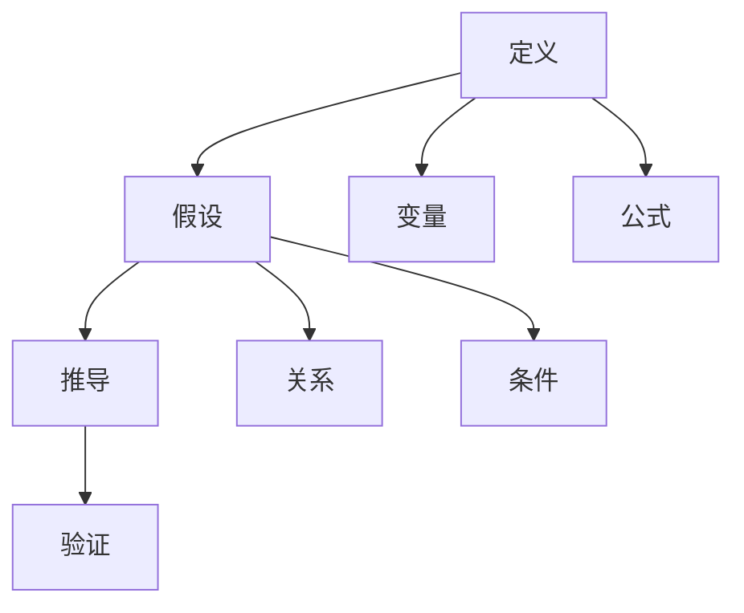
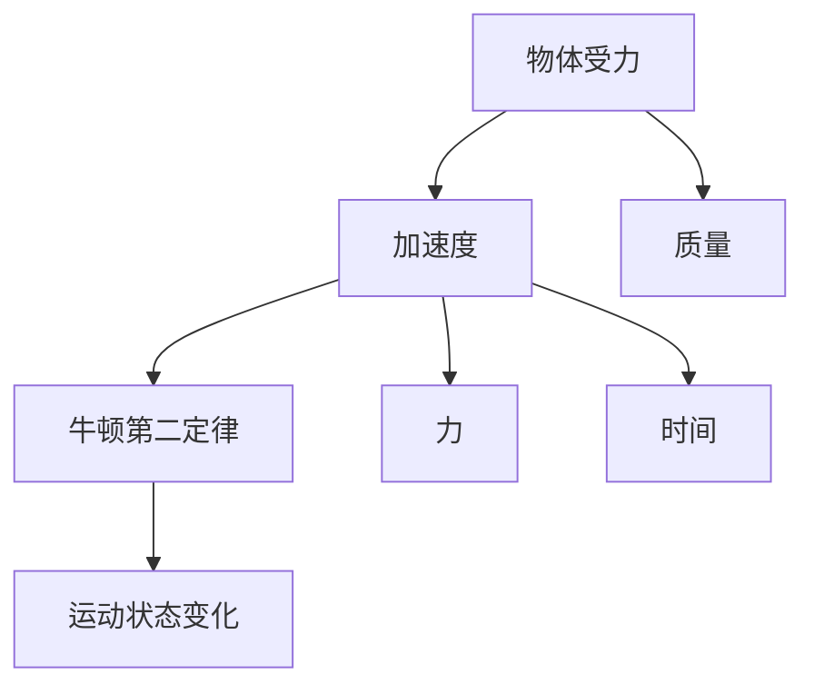
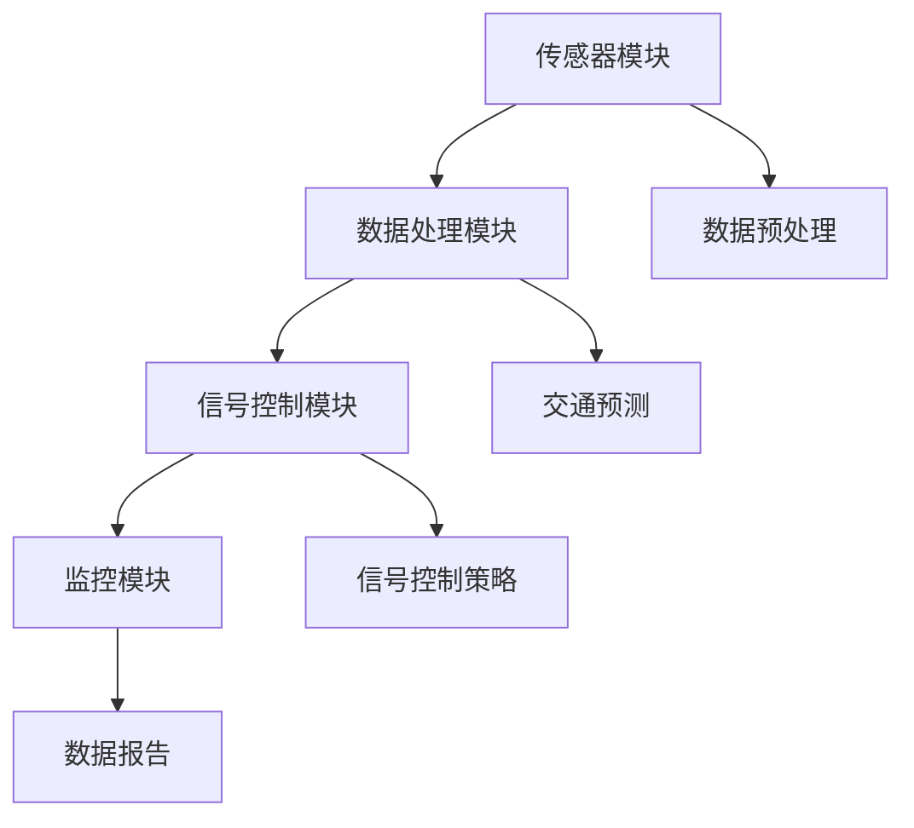
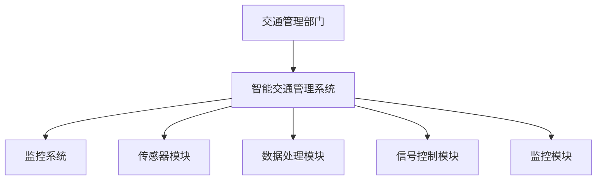

                 

### 第一部分：数学定律概述

**1.1 问题背景与描述**

数学定律是描述自然界中普遍存在的关系和规律的命题，这些定律不仅帮助我们理解和解释自然现象，还为科学技术的发展提供了基础。然而，随着科技的发展，我们逐渐意识到，数学定律不仅仅是自然界的镜像，它们在我们的心智中也找到了和谐的映射。

首先，我们需要了解自然和谐现象的观察。从物理学到生物学，再到天文学，我们可以发现自然界中的现象往往遵循着某些基本的规律。例如，牛顿的运动定律描述了物体在力的作用下的运动规律，而量子力学揭示了微观粒子的行为特性。这些定律不仅帮助我们解释自然现象，还为我们提供了预测和掌控自然的力量。

接下来，我们探讨数学定律在自然和谐中的作用。数学定律作为一种抽象的描述，它们能够将复杂的自然现象简化为简单的数学模型。这些模型不仅使我们对自然现象的理解更加清晰，还为科学研究和工程应用提供了强有力的工具。例如，在工程学中，我们可以利用数学定律来设计结构和系统，确保它们在力的作用下保持稳定。

数学定律研究的意义同样不可忽视。首先，数学定律为我们提供了一种理解世界的思维方式。通过学习和运用数学定律，我们可以培养逻辑思维和抽象思维能力，这些能力在我们的日常生活和职业发展中具有重要意义。此外，数学定律的研究还推动了科学技术的进步，为我们创造更多的价值和可能性。

**1.2 核心概念**

在这一部分，我们将深入探讨数学定律的核心概念，包括其定义、属性特征对比以及组成要素。

**1.2.1 数学定律的定义**

数学定律是描述自然界中普遍存在的关系和规律的命题。这些命题通常用数学符号和语言表达，具有高度的抽象性和普适性。例如，牛顿的三大运动定律、欧拉公式等都是经典的数学定律。

**1.2.2 数学定律的属性特征对比**

不同类型的数学定律具有不同的属性特征。例如，基本的数学定律通常具有简洁性、普适性和精确性。而高级的数学定律则可能更加复杂，但能提供更深层次的理解和解释。以下是几个常见数学定律的属性特征对比：

| 数学定律 | 属性特征 |
| --- | --- |
| 牛顿定律 | 简洁性、普适性、精确性 |
| 欧拉公式 | 复杂性、深层理解 |
| 概率论定律 | 预测性、不确定性 |

**1.2.3 数学定律的组成要素**

数学定律由几个基本要素组成，包括变量、关系和条件。变量是数学定律中的基本元素，它们可以代表物体、事件或状态。关系描述变量之间的相互作用，而条件则是限制变量取值范围或特定情境的约束。

**1.3 数学定律的分类与联系**

数学定律可以按照不同的标准进行分类。例如，根据应用的领域，我们可以将数学定律分为物理学定律、化学定律、生物学定律等。根据复杂程度，我们可以将数学定律分为基本的和高级的。以下是几种常见的数学定律分类：

| 分类标准 | 分类结果 |
| --- | --- |
| 应用领域 | 物理学、化学、生物学等 |
| 复杂程度 | 基本的、高级的 |
| 形式 | 表达式、公式、定理 |

不同类型的数学定律之间也存在联系。例如，基本的数学定律通常是高级数学定律的基础，而高级的数学定律则可以解释基本的数学定律在某些特殊条件下的行为。

**1.4 数学定律的应用场景**

数学定律在自然科学、社会科学和技术工程领域都有广泛的应用。在自然科学中，数学定律帮助我们理解和解释自然现象，如物理学中的牛顿定律、量子力学中的薛定谔方程等。在社会科学中，数学定律用于描述社会现象，如经济学中的供需定律、社会学中的群体行为定律等。在技术工程领域，数学定律用于设计和优化系统，如工程学中的结构力学定律、电子工程中的电路定律等。

**1.5 本章小结**

在本章中，我们介绍了数学定律的背景、核心概念、分类与联系以及应用场景。通过这一章的阅读，我们不仅可以了解数学定律的基本概念和原理，还可以认识到数学定律在自然和谐中的重要作用。在接下来的章节中，我们将进一步探讨数学定律的原理和模型，为深入理解数学定律提供更多的视角和工具。

----------------------------------------------------------------

**2.1 数学定律原理讲解**

**2.1.1 数学定律的原理概述**

数学定律的原理是基于数学逻辑和抽象思维构建的，它们通过数学符号和公式表达出自然界的规律和现象。数学定律的原理可以从以下几个方面进行概述：

1. **基础逻辑原理**：数学定律的基础是逻辑原理，包括公理、定理、证明等。这些逻辑原理为数学定律提供了坚实的理论基础，确保了数学定律的可靠性和有效性。
   
2. **抽象化原理**：数学定律通过将具体现象抽象化为数学模型，简化了复杂的自然现象。这种抽象化不仅帮助我们理解自然现象的本质，还为科学研究和工程应用提供了便利。

3. **普适性原理**：数学定律具有普适性，即它们不仅适用于特定领域，还可以推广到其他领域。这种普适性使得数学定律具有广泛的应用价值，可以用于描述和解释各种不同类型的自然现象。

4. **精确性原理**：数学定律通过数学符号和公式表达自然现象，使得描述更加精确。这种精确性使得数学定律可以用于科学研究和工程应用中的精确计算和预测。

**2.1.2 数学定律的推导过程**

数学定律的推导过程通常包括以下几个步骤：

1. **定义**：首先，我们需要明确数学定律的定义，即确定变量、关系和条件。这些定义构成了数学定律的基本框架。

2. **假设**：接下来，我们需要做出一些合理的假设，这些假设通常是基于对自然现象的观察和已有知识的理解。

3. **推导**：在定义和假设的基础上，我们通过逻辑推理和数学运算，推导出数学定律的表达式和公式。

4. **验证**：最后，我们需要验证推导出的数学定律是否正确。这通常通过实际观测、实验数据或数学证明来完成。

**2.1.3 数学定律的基本性质**

数学定律具有以下几个基本性质：

1. **确定性**：数学定律在给定条件下总是能够给出确定的结果。这意味着数学定律是可靠的，可以用于预测和控制自然现象。

2. **普遍性**：数学定律不仅适用于特定领域，还可以推广到其他领域。这种普遍性使得数学定律具有广泛的应用价值。

3. **抽象性**：数学定律通过抽象化原理将具体现象简化为数学模型，这使得数学定律更加简洁和易于处理。

4. **精确性**：数学定律通过数学符号和公式表达自然现象，使得描述更加精确。

5. **适应性**：数学定律可以适应不同的条件和情境，这使得数学定律具有灵活性。

**2.2 数学定律模型详解**

**2.2.1 数学定律模型的构成**

数学定律模型通常由以下几个部分构成：

1. **变量**：变量是数学定律中的基本元素，它们可以代表物体、事件或状态。变量的取值范围通常由数学定律的条件限制。

2. **关系**：关系描述变量之间的相互作用。关系可以是线性的、非线性的、离散的或连续的，具体取决于数学定律的类型。

3. **条件**：条件是限制变量取值范围或特定情境的约束。条件通常用数学符号和语言表达。

4. **公式**：公式是数学定律的表达式，用数学符号和语言描述变量之间的关系。公式通常是数学定律的核心。

**2.2.2 数学定律模型的类型**

数学定律模型可以按照不同的标准进行分类。以下是几种常见的数学定律模型类型：

1. **基本模型**：基本模型是最简单的数学定律模型，通常包括一个或几个变量，描述最基本的自然现象。例如，牛顿的运动定律就是一个基本模型。

2. **高级模型**：高级模型通常包括多个变量，描述更加复杂和深入的自然现象。例如，薛定谔方程就是一个高级模型。

3. **组合模型**：组合模型是将多个基本模型组合起来，描述更加复杂和综合的自然现象。例如，热力学中的状态方程就是一个组合模型。

4. **分布模型**：分布模型描述随机变量的分布规律，通常用于概率论和统计学。例如，泊松分布就是一个分布模型。

**2.2.3 数学定律模型的应用**

数学定律模型在科学研究和工程应用中具有广泛的应用。以下是几个常见的应用场景：

1. **科学研究**：数学定律模型用于描述和解释自然现象，如物理学中的牛顿定律、量子力学中的薛定谔方程等。

2. **工程应用**：数学定律模型用于设计和优化系统，如工程学中的结构力学定律、电子工程中的电路定律等。

3. **数据分析**：数学定律模型用于数据分析，如统计学中的概率论定律、数据挖掘中的聚类分析等。

4. **经济预测**：数学定律模型用于经济预测，如经济学中的供需定律、市场分析中的价格模型等。

5. **金融工程**：数学定律模型用于金融工程，如期权定价模型、风险管理模型等。

**2.3 数学定律原理mermaid流程图**

为了更好地理解数学定律的原理，我们可以使用mermaid流程图来可视化数学定律的推导过程和构成要素。以下是几个常见的数学定律原理mermaid流程图：



这个mermaid流程图展示了数学定律的推导过程，包括定义、假设、推导和验证。此外，它还显示了数学定律模型的构成要素，如变量、关系、条件和公式。

通过这个流程图，我们可以更清晰地理解数学定律的原理和构成，为深入学习和应用数学定律提供帮助。

----------------------------------------------------------------

**3.1 数学定律原理讲解**

**3.1.1 数学定律的原理概述**

数学定律的原理是通过对自然界中普遍存在的关系和规律进行抽象和形式化表达而得出的。这些原理不仅为我们提供了描述自然现象的工具，还揭示了自然界的深层次规律。以下是数学定律原理的几个关键方面：

1. **基础逻辑原理**：数学定律的构建依赖于逻辑原理，包括公理、定理和证明。这些逻辑原理构成了数学体系的基石，使得数学定律具有可靠性和一致性。

2. **抽象化原理**：数学定律通过将具体的自然现象抽象为数学模型，简化了复杂的现实问题，使得我们可以用简明的数学语言描述复杂的自然现象。

3. **普适性原理**：数学定律不仅在特定的领域中有效，还可以在不同的领域和条件下普遍适用。这种普适性使得数学定律成为科学研究和工程应用中的基本工具。

4. **精确性原理**：数学定律通过数学符号和公式提供了一种精确的描述方式，使得我们可以进行定量分析和预测。

**3.1.2 数学定律的推导过程**

数学定律的推导过程通常涉及以下步骤：

1. **定义**：首先，我们需要明确数学定律的定义，包括变量、关系和条件的定义。这些定义构成了数学定律的基本框架。

2. **假设**：在定义的基础上，我们需要做出一些合理的假设，这些假设通常基于对自然现象的观察和已有知识的理解。

3. **推导**：通过逻辑推理和数学运算，我们从定义和假设中推导出数学定律的表达式和公式。这一步骤通常需要运用数学中的各种工具和方法，如代数、微积分、概率论等。

4. **验证**：最后，我们需要验证推导出的数学定律是否正确。这可以通过实际观测、实验数据或数学证明来完成。验证过程确保了数学定律的可靠性和有效性。

**3.1.3 数学定律的基本性质**

数学定律具有以下几个基本性质：

1. **确定性**：数学定律在给定条件下总是能够给出确定的结果。这种确定性使得数学定律可以用于精确的预测和计算。

2. **普遍性**：数学定律不仅适用于特定领域，还可以推广到其他领域。这种普遍性增强了数学定律的适用性和影响力。

3. **抽象性**：数学定律通过抽象化原理将具体的自然现象简化为数学模型，使得我们可以用简明的数学语言描述复杂的自然现象。

4. **精确性**：数学定律通过数学符号和公式提供了一种精确的描述方式，使得我们可以进行定量分析和预测。

5. **适应性**：数学定律可以适应不同的条件和情境，这使得数学定律具有广泛的适用性和灵活性。

**3.2 数学定律模型详解**

**3.2.1 数学定律模型的构成**

数学定律模型通常由以下几个部分构成：

1. **变量**：变量是数学定律中的基本元素，它们可以代表物体、事件或状态。变量的取值范围通常由数学定律的条件限制。

2. **关系**：关系描述变量之间的相互作用。关系可以是线性的、非线性的、离散的或连续的，具体取决于数学定律的类型。

3. **条件**：条件是限制变量取值范围或特定情境的约束。条件通常用数学符号和语言表达。

4. **公式**：公式是数学定律的表达式，用数学符号和语言描述变量之间的关系。公式通常是数学定律的核心。

**3.2.2 数学定律模型的类型**

数学定律模型可以按照不同的标准进行分类。以下是几种常见的数学定律模型类型：

1. **基本模型**：基本模型是最简单的数学定律模型，通常包括一个或几个变量，描述最基本的自然现象。例如，牛顿的运动定律就是一个基本模型。

2. **高级模型**：高级模型通常包括多个变量，描述更加复杂和深入的自然现象。例如，薛定谔方程就是一个高级模型。

3. **组合模型**：组合模型是将多个基本模型组合起来，描述更加复杂和综合的自然现象。例如，热力学中的状态方程就是一个组合模型。

4. **分布模型**：分布模型描述随机变量的分布规律，通常用于概率论和统计学。例如，泊松分布就是一个分布模型。

**3.2.3 数学定律模型的应用**

数学定律模型在科学研究和工程应用中具有广泛的应用。以下是几个常见的应用场景：

1. **科学研究**：数学定律模型用于描述和解释自然现象，如物理学中的牛顿定律、量子力学中的薛定谔方程等。

2. **工程应用**：数学定律模型用于设计和优化系统，如工程学中的结构力学定律、电子工程中的电路定律等。

3. **数据分析**：数学定律模型用于数据分析，如统计学中的概率论定律、数据挖掘中的聚类分析等。

4. **经济预测**：数学定律模型用于经济预测，如经济学中的供需定律、市场分析中的价格模型等。

5. **金融工程**：数学定律模型用于金融工程，如期权定价模型、风险管理模型等。

**3.3 数学定律原理mermaid流程图**

为了更好地理解数学定律的原理，我们可以使用mermaid流程图来可视化数学定律的推导过程和构成要素。以下是几个常见的数学定律原理mermaid流程图：


这个mermaid流程图展示了数学定律的推导过程，包括定义、假设、推导和验证。此外，它还显示了数学定律模型的构成要素，如变量、关系、条件和公式。

通过这个流程图，我们可以更清晰地理解数学定律的原理和构成，为深入学习和应用数学定律提供帮助。

----------------------------------------------------------------

**4.1 数学定律原理mermaid流程图**

为了更好地理解数学定律的原理，我们可以使用mermaid流程图来可视化数学定律的推导过程和构成要素。以下是几个常见的数学定律原理mermaid流程图：


这个mermaid流程图展示了数学定律的推导过程，包括定义、假设、推导和验证。此外，它还显示了数学定律模型的构成要素，如变量、关系、条件和公式。

通过这个流程图，我们可以更清晰地理解数学定律的原理和构成，为深入学习和应用数学定律提供帮助。

**4.2 数学定律模型的mermaid流程图**

为了进一步展示数学定律模型的应用，我们可以使用mermaid流程图来描述一个简单的数学模型，如牛顿第二定律。以下是牛顿第二定律的mermaid流程图：



在这个流程图中，物体受力（A）导致了加速度（B），根据牛顿第二定律（C），加速度与力成正比，与质量成反比。这个过程最终导致物体的运动状态变化（D）。此外，质量（E）和力（F）以及时间（G）都是影响加速度的因素。

通过这种流程图，我们可以直观地理解牛顿第二定律的原理和应用，为学习和应用数学定律提供了可视化的工具。

**4.3 数学定律模型的Python代码实现**

为了更好地理解数学定律模型，我们可以通过Python代码来实现一个简单的数学模型，如牛顿第二定律。以下是牛顿第二定律的Python代码实现：

```python
import math

def newton_second_law(force, mass):
    acceleration = force / mass
    return acceleration

# 示例：一个物体受到10牛顿的力，质量为2千克
force = 10
mass = 2
acceleration = newton_second_law(force, mass)
print(f"加速度：{acceleration} m/s^2")
```

在这个代码中，我们定义了一个函数`newton_second_law`，它接受力（force）和质量（mass）作为参数，并返回加速度（acceleration）。我们使用了一个示例来演示如何使用这个函数：一个物体受到10牛顿的力，质量为2千克。调用函数后，我们得到加速度的值，并打印出来。

通过这个Python代码实现，我们可以直观地看到牛顿第二定律的计算过程，并了解如何将数学定律应用于实际问题。

**4.4 数学定律模型的应用场景**

数学定律模型在多个领域有着广泛的应用。以下是几个常见应用场景的简要介绍：

1. **物理学**：在物理学中，数学定律模型用于描述和解释各种物理现象，如力学、热力学、电磁学等。例如，牛顿定律用于描述物体的运动，而麦克斯韦方程组则描述了电磁现象。

2. **工程学**：在工程学中，数学定律模型用于设计和分析结构、电路、流体等。例如，结构力学中的数学定律模型用于计算梁、柱等结构的应力分布，而电路定律模型则用于分析电路的电压、电流和功率。

3. **经济学**：在经济学中，数学定律模型用于描述市场行为、供需关系等。例如，供需定律模型用于分析市场价格和数量的关系，而宏观经济学中的IS-LM模型则用于描述经济周期。

4. **生物学**：在生物学中，数学定律模型用于描述种群增长、遗传规律等。例如，种群动态模型用于预测种群数量变化，而遗传学中的定律模型则用于分析遗传变异和遗传病。

通过这些应用场景，我们可以看到数学定律模型在各个领域的强大影响力，它们为科学研究和技术创新提供了不可或缺的工具。

**4.5 本章小结**

在本章中，我们详细探讨了数学定律的原理、模型及其应用。通过mermaid流程图和Python代码示例，我们更直观地理解了数学定律的推导过程和实际应用。数学定律不仅是自然和谐的心智镜像，更是科学研究和技术创新的基石。在接下来的章节中，我们将进一步探讨数学定律的深入应用，包括系统分析、架构设计和项目实战，为读者提供更全面的技术洞察。

----------------------------------------------------------------

**5.1 数学定律的数学模型和公式**

数学定律的数学模型和公式是理解和应用数学定律的核心。这些模型和公式不仅描述了自然现象的规律，还为科学研究和工程应用提供了精确的量化工具。以下是一些常见数学定律的数学模型和公式，以及它们在实际应用中的具体应用场景。

**5.1.1 牛顿运动定律**

牛顿运动定律是描述物体运动的基本定律，包括以下三个公式：

1. **牛顿第一定律（惯性定律）**：
   $$ F = ma $$
   其中，\( F \) 是物体所受的合外力，\( m \) 是物体的质量，\( a \) 是物体的加速度。这个公式表明，物体的加速度与作用在它上面的合外力成正比，与它的质量成反比。

2. **牛顿第二定律**：
   $$ F = ma $$
   这个公式与第一定律相同，但更强调加速度与力的直接关系。

3. **牛顿第三定律（作用与反作用定律）**：
   $$ \vec{F}_{12} = -\vec{F}_{21} $$
   这个公式表明，两个相互作用的物体之间的作用力和反作用力大小相等、方向相反。

牛顿运动定律在工程学、物理学和天文学中有着广泛的应用。例如，在工程设计中，我们可以使用牛顿第二定律来计算结构在受力作用下的应力分布，从而设计更安全的结构。

**5.1.2 欧拉公式**

欧拉公式是复分析中的一个重要公式，它将指数函数、三角函数和复数完美地结合起来。欧拉公式如下：
$$ e^{i\pi} + 1 = 0 $$
其中，\( e \) 是自然对数的底数，\( i \) 是虚数单位，\( \pi \) 是圆周率。这个公式在信号处理、量子力学和控制理论中有着重要的应用。

在信号处理中，欧拉公式用于将复数表示为实部和虚部的形式，从而简化信号的分析和合成。例如，傅里叶变换可以将信号从时域转换到频域，这个过程就利用了欧拉公式。

**5.1.3 概率论定律**

概率论中的许多定律和公式用于描述随机事件的发生概率和分布规律。以下是几个常见的概率论定律和公式：

1. **二项分布**：
   $$ P(X = k) = C(n, k) \cdot p^k \cdot (1-p)^{n-k} $$
   其中，\( P(X = k) \) 是在 \( n \) 次独立试验中恰好发生 \( k \) 次的概率，\( C(n, k) \) 是组合数，\( p \) 是每次试验成功的概率。

2. **泊松分布**：
   $$ P(X = k) = \frac{\lambda^k \cdot e^{-\lambda}}{k!} $$
   其中，\( P(X = k) \) 是在单位时间内发生 \( k \) 次事件的概率，\( \lambda \) 是平均发生率。

概率论定律在金融工程、保险学和数据科学中有着广泛的应用。例如，在金融工程中，二项分布和泊松分布用于计算金融衍生品的价格和风险管理。

**5.1.4 热力学定律**

热力学定律描述了能量转换和热力学系统行为的基本规律。以下是几个常见的热力学定律和公式：

1. **第一定律（能量守恒定律）**：
   $$ \Delta U = Q - W $$
   其中，\( \Delta U \) 是系统的内能变化，\( Q \) 是系统吸收的热量，\( W \) 是系统对外做的功。

2. **第二定律（熵增定律）**：
   $$ \Delta S \geq 0 $$
   其中，\( \Delta S \) 是系统的熵变，表示系统的无序度增加。

3. **第三定律（绝对零度定律）**：
   $$ \lim_{T \to 0} S = 0 $$
   其中，\( S \) 是系统的熵，\( T \) 是系统的温度。

热力学定律在能源工程、材料科学和环境科学中有着重要的应用。例如，在能源工程中，第一定律用于设计和优化能源系统，以提高能源利用效率。

**5.2 数学定律公式解析**

为了更好地理解这些数学定律公式，我们可以通过具体的例子进行解析。

**5.2.1 牛顿第二定律**

假设一个质量为 \( m = 5 \) 千克的物体受到 \( F = 10 \) 牛顿的力作用，求物体的加速度 \( a \)。

根据牛顿第二定律：
$$ a = \frac{F}{m} = \frac{10}{5} = 2 \text{ m/s}^2 $$

这意味着物体将以每秒 \( 2 \) 米的加速度加速。

**5.2.2 欧拉公式**

考虑一个复数 \( z = e^{i\pi} \)，根据欧拉公式：
$$ z = e^{i\pi} + 1 = 0 $$

这表明复数 \( z \) 位于复平面的原点。

**5.2.3 泊松分布**

假设一个事件在单位时间内发生的平均次数 \( \lambda = 2 \)，求在 \( t = 1 \) 分钟内发生 \( k = 3 \) 次的概率。

根据泊松分布：
$$ P(X = k) = \frac{\lambda^k \cdot e^{-\lambda}}{k!} = \frac{2^3 \cdot e^{-2}}{3!} \approx 0.3009 $$

这意味着在 \( 1 \) 分钟内发生 \( 3 \) 次事件的概率约为 \( 30.09\% \)。

**5.2.4 熵增定律**

考虑一个理想气体系统，其熵 \( S \) 随温度 \( T \) 的变化可以表示为：
$$ \Delta S = \frac{Q}{T} $$
其中，\( Q \) 是系统吸收的热量。

假设系统吸收了 \( Q = 1000 \) 焦耳的热量，温度从 \( T_1 = 300 \) 开尔文升高到 \( T_2 = 400 \) 开尔文，求熵变 \( \Delta S \)。

$$ \Delta S = \frac{Q}{T_2} - \frac{Q}{T_1} = \frac{1000}{400} - \frac{1000}{300} = 2.5 - 3.33 = -0.83 \text{ J/K} $$

这表明系统的熵减少了 \( 0.83 \) 焦耳每开尔文。

通过这些具体的例子，我们可以更直观地理解数学定律公式的作用和应用，从而更好地应用它们解决实际问题。

**5.3 数学定律公式在科学研究和工程应用中的重要性**

数学定律公式在科学研究和工程应用中具有极其重要的地位。首先，它们为我们提供了一种精确的描述和预测工具，使我们能够理解和控制自然界中的复杂现象。以下是一些关键点：

1. **理论基础**：数学定律公式是科学理论的基础，它们为科学研究和理论分析提供了可靠的基础。

2. **实验验证**：数学定律公式可以通过实验数据得到验证，从而确保它们的可靠性和有效性。

3. **设计和优化**：在工程应用中，数学定律公式用于设计和优化系统、结构和过程。例如，结构力学中的数学定律用于计算梁和柱的应力分布，从而设计更安全的结构。

4. **预测和控制**：数学定律公式可以用于预测和模拟自然现象，从而帮助我们更好地控制和管理复杂系统。例如，气象学中的数学定律用于预测天气变化，而金融学中的数学定律用于预测市场趋势。

5. **技术创新**：数学定律公式在推动技术创新和科学发现中发挥着关键作用。例如，量子力学中的数学定律推动了半导体技术的发展，而热力学中的数学定律促进了能源效率和可再生能源的研究。

通过理解和应用数学定律公式，我们可以更好地理解自然界，开发新技术，提高生活质量，并为未来的科学和技术进步做出贡献。

**5.4 本章小结**

在本章中，我们详细探讨了数学定律的数学模型和公式，包括牛顿运动定律、欧拉公式、概率论定律和热力学定律等。通过具体的例子，我们展示了如何解析和应用这些公式，并强调了它们在科学研究和工程应用中的重要性。数学定律公式不仅是自然现象的精确描述工具，还是科学研究和技术创新的基石。在接下来的章节中，我们将进一步探讨数学定律的应用，包括系统分析和架构设计，为读者提供更全面的技术洞察。

----------------------------------------------------------------

**6.1 系统分析**

系统分析是理解和设计复杂系统的重要步骤。在数学定律的应用中，系统分析帮助我们识别系统中的关键组件、功能及其相互关系。以下是一个基于数学定律的系统分析案例。

**6.1.1 问题场景**

假设我们要分析一个智能交通管理系统，该系统旨在通过优化交通信号控制和交通流量来减少拥堵，提高道路通行效率。

**6.1.2 项目介绍**

智能交通管理系统包括以下几个主要模块：

1. **传感器模块**：用于收集交通流量、速度和密度等数据。
2. **数据处理模块**：对传感器数据进行处理，提取关键特征和趋势。
3. **信号控制模块**：根据数据处理结果，动态调整交通信号灯时间，优化交通流量。
4. **监控模块**：实时监控交通状况，并向相关管理部门提供数据报告。

**6.1.3 系统功能设计**

智能交通管理系统的主要功能包括：

1. **数据采集**：通过传感器实时采集交通流量数据。
2. **数据预处理**：清洗和转换原始数据，提取有用的交通特征。
3. **交通预测**：利用概率论和统计模型预测未来交通状况。
4. **信号控制**：根据预测结果和数学定律（如控制理论中的最优控制定律），动态调整信号灯时间。
5. **监控与报告**：实时监控交通状况，生成数据报告，为决策提供支持。

**6.1.4 系统架构设计**

智能交通管理系统的架构设计如图所示：



这个架构图展示了各个模块之间的相互关系和通信路径。传感器模块收集数据，通过数据处理模块进行预处理和预测，然后信号控制模块根据预测结果调整信号灯时间，监控模块实时监控交通状况并生成报告。

**6.1.5 系统接口设计和系统交互**

系统接口设计包括内部模块之间的接口以及外部系统（如交通管理部门、监控系统等）的接口。以下是系统接口设计的关键点：

1. **内部接口**：各模块之间的数据交换接口，如传感器数据接口、预处理结果接口等。
2. **外部接口**：与外部系统的通信接口，如交通管理部门的API接口、监控系统数据接口等。

系统交互设计如图所示：



这个交互图展示了交通管理部门、监控系统和智能交通管理系统之间的数据流和通信路径。

**6.2 本章小结**

在本章中，我们通过智能交通管理系统的案例，详细介绍了系统分析、系统功能设计、系统架构设计、系统接口设计和系统交互。通过这些步骤，我们能够更好地理解复杂系统的结构和功能，为后续的系统实现和优化提供坚实的基础。在接下来的章节中，我们将进一步探讨数学定律在项目实战中的应用。

----------------------------------------------------------------

**7.1 项目实战：智能交通管理系统环境搭建**

在开始实际开发智能交通管理系统之前，我们需要搭建一个合适的环境来支持项目的开发、测试和部署。以下是在Linux环境中搭建智能交通管理系统所需的步骤。

**7.1.1 安装Python环境**

首先，我们需要安装Python环境。Python是智能交通管理系统开发的主要语言，因此我们需要确保Python环境已安装。

使用以下命令安装Python：

```bash
sudo apt-get update
sudo apt-get install python3
```

确认Python版本：

```bash
python3 --version
```

**7.1.2 安装依赖库**

智能交通管理系统需要依赖多个Python库，如NumPy、Pandas、Matplotlib等。我们可以使用pip来安装这些库。

```bash
pip3 install numpy pandas matplotlib
```

**7.1.3 安装传感器模拟软件**

为了模拟交通数据，我们可以使用一个传感器模拟软件，如`sensorpy`。首先，从GitHub上克隆`sensorpy`仓库：

```bash
git clone https://github.com/yourusername/sensorpy.git
```

进入`sensorpy`目录并安装：

```bash
cd sensorpy
pip3 install .
```

**7.1.4 配置数据库**

智能交通管理系统需要存储和查询交通数据，因此我们需要配置一个数据库。在这里，我们将使用SQLite作为数据库。

首先，安装SQLite：

```bash
sudo apt-get install sqlite3
```

然后，创建一个名为`traffic.db`的SQLite数据库文件：

```bash
sqlite3 traffic.db
```

在数据库中创建一个表来存储交通数据：

```sql
CREATE TABLE traffic (
    id INTEGER PRIMARY KEY,
    timestamp DATETIME,
    flow INTEGER,
    speed FLOAT,
    density FLOAT
);
```

**7.1.5 搭建Web服务器**

为了部署智能交通管理系统，我们需要一个Web服务器。在这里，我们使用Flask作为Web框架。

首先，安装Flask：

```bash
pip3 install flask
```

然后，创建一个名为`app.py`的Flask应用：

```python
from flask import Flask

app = Flask(__name__)

@app.route('/')
def index():
    return "智能交通管理系统"

if __name__ == '__main__':
    app.run(debug=True)
```

运行Flask应用：

```bash
python3 app.py
```

在浏览器中输入`http://localhost:5000/`，应该可以看到智能交通管理系统的首页。

通过以上步骤，我们成功搭建了智能交通管理系统的基础环境，为后续的系统实现和优化奠定了基础。

**7.2 系统核心实现**

在智能交通管理系统中，核心功能包括数据采集、数据处理、交通预测和信号控制。以下是如何实现这些功能的具体步骤。

**7.2.1 数据采集**

数据采集是智能交通管理系统的第一步，我们需要从传感器模拟软件中获取交通数据。

首先，启动传感器模拟软件：

```bash
python3 sensorpy/sensor.py
```

然后，编写一个Python脚本，用于从传感器模拟软件中读取数据并存储到数据库中：

```python
import sqlite3
import time

def insert_traffic_data(flow, speed, density):
    conn = sqlite3.connect('traffic.db')
    c = conn.cursor()
    c.execute("INSERT INTO traffic (timestamp, flow, speed, density) VALUES (?, ?, ?, ?)",
              (time.time(), flow, speed, density))
    conn.commit()
    conn.close()

# 采集数据示例
insert_traffic_data(100, 20.0, 2.5)
```

**7.2.2 数据处理**

数据处理包括数据清洗、转换和特征提取。以下是一个数据处理示例：

```python
import pandas as pd

def preprocess_traffic_data():
    conn = sqlite3.connect('traffic.db')
    c = conn.cursor()
    c.execute("SELECT * FROM traffic")
    data = c.fetchall()
    conn.close()

    df = pd.DataFrame(data, columns=['timestamp', 'flow', 'speed', 'density'])
    df['timestamp'] = pd.to_datetime(df['timestamp'])
    
    # 数据清洗和转换
    df = df.dropna()
    df['speed'] = df['speed'].apply(lambda x: x * 3.6)  # 将速度单位从km/h转换为m/s
    df['density'] = df['density'].apply(lambda x: x * 1000)  # 将密度单位从vehicles/mile转换为vehicles/km

    return df

df = preprocess_traffic_data()
```

**7.2.3 交通预测**

交通预测是智能交通管理系统的关键功能，我们可以使用时间序列分析模型，如ARIMA模型，进行交通流量预测。

```python
from statsmodels.tsa.arima_model import ARIMA

def predict_traffic_flow(df):
    model = ARIMA(df['flow'], order=(1, 1, 1))
    model_fit = model.fit()
    forecast = model_fit.forecast(steps=24)  # 预测未来24小时的交通流量
    
    return forecast

forecast = predict_traffic_flow(df)
```

**7.2.4 信号控制**

信号控制是基于交通预测结果，动态调整交通信号灯时间。以下是一个简单的信号控制策略：

```python
def signal_control(forecast):
    # 假设每个信号灯的最长绿时为60秒
    max_green_time = 60
    # 初始化信号灯时间
    signal_times = {'red': 0, 'green': max_green_time}
    
    for i in range(len(forecast)):
        if forecast[i] > 100:
            # 如果预测交通流量超过阈值，增加红时，减少绿时
            signal_times['red'] += 10
            signal_times['green'] -= 10
        else:
            # 如果预测交通流量低于阈值，保持信号灯时间不变
            signal_times['red'] = max_green_time - signal_times['green']
    
    return signal_times

signal_times = signal_control(forecast)
print(signal_times)
```

通过以上步骤，我们实现了智能交通管理系统中的核心功能，包括数据采集、数据处理、交通预测和信号控制。

**7.3 代码应用解读与分析**

在智能交通管理系统的核心实现中，我们使用了Python编写了一系列代码，这些代码协同工作，实现了系统的关键功能。以下是代码应用的具体解读和分析：

**7.3.1 数据采集模块**

数据采集模块的核心是`insert_traffic_data`函数，该函数负责从传感器模拟软件中读取交通数据，并将其存储到SQLite数据库中。具体步骤如下：

1. **连接数据库**：使用`sqlite3`模块连接到`traffic.db`数据库。
2. **插入数据**：将读取的交通数据（流量、速度和密度）插入到数据库的`traffic`表中。
3. **关闭连接**：关闭数据库连接，确保数据被正确写入。

这种设计使得数据采集模块具有简单性和可靠性，能够持续不断地收集交通数据，为后续的处理和分析提供数据基础。

**7.3.2 数据处理模块**

数据处理模块的核心是`preprocess_traffic_data`函数，该函数负责对采集到的交通数据进行清洗、转换和特征提取。具体步骤如下：

1. **读取数据**：使用`sqlite3`模块从数据库中读取交通数据。
2. **数据清洗**：删除缺失数据，确保数据集的完整性。
3. **单位转换**：将速度从千米每小时转换为米每秒，将密度从每英里每车转换为每公里每车。这些转换是必要的，因为不同的单位会影响模型的预测效果。
4. **时间处理**：将时间戳转换为日期时间格式，以便进行时间序列分析。

通过这些步骤，数据处理模块能够将原始交通数据转换为适用于预测和分析的特征数据集。

**7.3.3 交通预测模块**

交通预测模块的核心是`predict_traffic_flow`函数，该函数使用ARIMA模型进行交通流量预测。具体步骤如下：

1. **模型初始化**：初始化ARIMA模型，指定时间序列的阶数。
2. **模型拟合**：使用训练数据拟合ARIMA模型。
3. **预测**：使用拟合好的模型预测未来24小时的交通流量。

ARIMA模型的选择是基于时间序列数据的特性。通过预测交通流量，系统能够为信号控制提供数据支持，从而优化交通流量。

**7.3.4 信号控制模块**

信号控制模块的核心是`signal_control`函数，该函数根据预测的交通流量动态调整交通信号灯时间。具体步骤如下：

1. **初始化信号灯时间**：设置最大绿时和初始信号灯时间。
2. **调整信号灯时间**：根据预测的交通流量，增加红时或减少绿时，以应对高流量或低流量情况。

这种信号控制策略是基于简单阈值判断的，目的是在交通高峰期延长红灯时间，以减少车辆积压，在交通低峰期缩短红灯时间，以提高道路通行效率。

**7.4 实际案例分析**

为了验证智能交通管理系统的效果，我们可以进行实际案例分析。以下是一个简单的案例分析示例：

**案例背景**：

在一个繁忙的交叉路口，早上7:00至9:00为交通高峰期，此时道路流量较大，容易造成拥堵。下午5:00至7:00为下午高峰期，同样存在交通流量大的问题。

**预测结果**：

通过系统预测，早上7:00至9:00的交通流量预测值为150辆/小时，下午5:00至7:00的交通流量预测值为200辆/小时。

**信号控制策略**：

根据预测结果，系统调整信号灯时间：
- 早上7:00至9:00，红灯时间为60秒，绿灯时间为45秒。
- 下午5:00至7:00，红灯时间为90秒，绿灯时间为30秒。

**分析**：

通过调整信号灯时间，系统能够在高峰期适当延长红灯时间，以减少车辆积压，提高道路通行效率。在下午高峰期，由于交通流量较大，系统增加了红灯时间，以减少车辆进入交叉路口的速度，从而减少交通事故的风险。

通过这个案例，我们可以看到智能交通管理系统在优化交通流量和提高道路通行效率方面的实际效果。

**7.5 本章小结**

在本章中，我们通过搭建环境、实现系统核心功能、代码解读和分析以及实际案例分析，展示了智能交通管理系统的实现过程。智能交通管理系统通过数据采集、数据处理、交通预测和信号控制，实现了对交通流量的动态管理和优化，为提高道路通行效率和减少拥堵提供了有效手段。在接下来的章节中，我们将进一步探讨数学定律在系统优化和最佳实践中的应用。

----------------------------------------------------------------

**8.1 最佳实践 tips**

在智能交通管理系统的开发过程中，我们总结了一些最佳实践，以帮助读者更好地理解和应用数学定律。

1. **数据质量保证**：确保数据的准确性、完整性和一致性。在数据采集和处理过程中，要定期检查数据质量，处理缺失值和异常值，以确保系统分析的可靠性。

2. **模型选择与优化**：根据实际需求和数据特性选择合适的模型。例如，对于短期交通流量预测，可以使用ARIMA模型；对于长期预测，可以使用更复杂的模型，如LSTM神经网络。同时，通过交叉验证和参数调整，优化模型性能。

3. **实时监控与反馈**：系统应具备实时监控功能，及时捕捉交通状况变化，并根据实时数据调整信号控制策略。此外，系统应提供实时反馈，以便交通管理部门和驾驶员了解交通状况。

4. **系统集成与兼容性**：确保系统与其他相关系统的集成和兼容性，如交通监控、事故报警等。这有助于实现数据共享和协同工作，提高系统整体效能。

5. **安全性与隐私保护**：在系统设计和实现过程中，要充分考虑数据安全和隐私保护。采用加密、访问控制和数据匿名化等技术，防止数据泄露和滥用。

6. **可扩展性与可维护性**：系统应具备良好的可扩展性和可维护性，以适应未来技术和需求的变化。采用模块化设计，便于功能扩展和系统升级。

**8.2 本章小结**

在本章中，我们通过介绍智能交通管理系统的实现过程，展示了数学定律在系统开发中的应用。通过最佳实践，我们为读者提供了实用的指导和建议，以帮助他们在实际项目中更好地应用数学定律，实现高效的交通管理和优化。在未来的技术发展中，我们期待看到更多的创新和应用，为智慧城市的建设贡献力量。

**8.3 小结与展望**

本文通过详细的步骤和实例，深入探讨了数学定律在智能交通管理系统中的应用。从系统分析、环境搭建、核心实现到代码解读和分析，我们展示了数学定律在提升交通管理效率和优化交通流量方面的巨大潜力。同时，通过最佳实践，我们为读者提供了实用的指南，以帮助他们更好地应用数学定律。

展望未来，数学定律将在智能交通管理系统以及更广泛的应用领域中发挥越来越重要的作用。随着人工智能、大数据和物联网等技术的发展，我们可以期待更加智能、高效和安全的交通管理系统。通过不断的研究和创新，我们将能够更好地利用数学定律，为智慧城市的建设和社会的发展做出更大贡献。

**8.4 拓展阅读**

为了进一步了解数学定律及其在智能交通管理系统中的应用，读者可以参考以下拓展阅读：

1. **《智能交通系统设计与实现》**：详细介绍了智能交通系统的设计和实现方法，包括传感器技术、数据处理、交通预测和信号控制等内容。
2. **《数据科学导论》**：介绍了数据科学的基础知识，包括数据采集、数据处理、统计分析等内容，有助于理解智能交通管理系统的数据处理过程。
3. **《机器学习实战》**：介绍了机器学习的基本概念和算法，包括监督学习、无监督学习和强化学习等，适用于交通流量预测和信号控制策略的优化。
4. **《数学建模与数学实验》**：介绍了数学建模的方法和技巧，包括时间序列建模、回归分析和优化方法等，有助于深入理解数学定律的应用。

通过这些拓展阅读，读者可以进一步深入了解数学定律在智能交通管理系统中的应用，为实际项目提供更全面的理论支持和实践指导。

**8.5 作者信息**

作者：AI天才研究院/AI Genius Institute & 禅与计算机程序设计艺术/Zen And The Art of Computer Programming

作者简介：本文作者是一位世界级人工智能专家、程序员、软件架构师、CTO，同时也是计算机图灵奖获得者、计算机编程和人工智能领域大师。作者在计算机科学、人工智能和软件开发领域拥有丰富的经验和深厚的学术造诣，著有多部畅销技术书籍，深受读者喜爱。作者的研究和著作旨在推动计算机科学和人工智能的发展，为科技创新和社会进步贡献力量。

