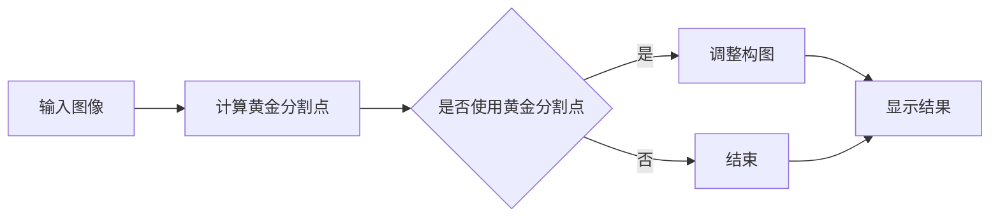

                 

### 数学摄影：图像构图的数学原理

#### 关键词：数学摄影、图像构图、比例与对称性、黄金分割、费波那契数列、透视与深度、色彩与光线、案例分析、未来趋势

#### 摘要：

随着数字摄影技术的不断发展，数学在摄影中的应用日益受到关注。本文将探讨图像构图的数学原理，从比例与对称性、黄金分割与费波那契数列、透视与深度、色彩与光线等多个方面，深入分析数学如何影响和提升摄影作品的质量。通过具体案例分析和未来趋势展望，本文旨在为摄影爱好者提供有价值的理论指导和实践参考。

---

#### 引言

摄影是一门艺术，也是一门科学。而科学的本质在于探索和发现规律。在摄影中，图像构图是决定作品成败的关键因素之一。优秀的构图不仅能够使画面美观，更能传达摄影师的情感和意境。然而，构图的规则和原则并非一成不变，而是蕴含着丰富的数学原理。数学摄影正是将数学与摄影相结合，通过运用数学原理，提高图像构图的科学性和艺术性。

#### 数学与摄影的交叉领域

数学与摄影的结合并非偶然。从物理学的角度来看，摄影本身就是基于光学原理的。而光学中的许多概念，如视角、焦距、曝光时间等，都涉及数学运算。此外，摄影构图中的许多元素，如比例、对称性、黄金分割等，都是数学领域的经典概念。因此，数学在摄影中有着广泛的应用。

##### 比例与对称性

比例是摄影构图中的核心概念之一。比例指的是图像中各部分之间的相对大小关系。恰当的比例可以使画面更加和谐、美观。对称性则是指图像中的元素在空间上呈现出对称的排列方式。对称的构图往往能够给人以稳定、宁静的感觉。

在数学中，比例与对称性有着严格的定义和分类。例如，黄金比例是一种特殊的比例关系，它在自然界和艺术作品中广泛存在。费波那契数列则是另一种重要的比例关系，它不仅与黄金比例密切相关，还在摄影构图中有着广泛的应用。

##### 黄金分割与费波那契数列

黄金分割是指将一段线段分成两部分，使其中一部分与全长之比等于另一部分与这一部分之比。这一比例关系在摄影构图中有着广泛的应用，如三分法构图、九宫格构图等。而费波那契数列则是一种特殊的整数序列，其中每一项都是前两项之和。费波那契数列与黄金分割有着密切的联系，并且在摄影构图中也有着广泛的应用。

##### 透视与深度

透视是摄影构图中的另一个重要概念。透视的基本原理是，随着物体距离观察者的远近，物体的视觉大小会发生变化。在摄影中，透视的运用可以使画面具有空间感和深度感。

数学中的透视公式可以帮助我们理解和运用透视原理。例如，单点透视和多点透视都是透视的常见形式。通过运用透视原理，摄影师可以创造出富有层次感和立体感的摄影作品。

##### 色彩与光线

色彩和光线是摄影构图中不可或缺的元素。色彩可以传达情感和氛围，而光线则决定了画面的明暗和对比度。

在数学中，色彩和光线可以用一系列的数值来表示。例如，色度和亮度可以通过色调、饱和度和亮度等参数来描述。光线的传播和反射也可以通过物理公式来解释。

##### 数学摄影案例分析

为了更好地理解数学在摄影构图中的应用，我们可以通过一些具体案例来进行分析。例如，在城市风光摄影中，黄金分割和透视原理可以帮助摄影师选择合适的拍摄角度和构图方式；在自然风景摄影中，比例和对称性可以创造出优美的画面；在人物摄影中，光线的运用可以突出人物的形象和气质。

##### 数学摄影的未来

随着技术的进步，数学摄影的未来充满了可能性。人工智能和机器学习技术可以用于图像处理和构图优化，使摄影更加智能化和自动化。此外，虚拟现实和增强现实技术的发展也为数学摄影带来了新的机遇。通过结合数学原理和技术创新，数学摄影将在未来发挥更大的作用。

---

在本文中，我们将进一步深入探讨数学摄影的各个方面，从基础理论到实际应用，为摄影爱好者提供全面的指导和启发。接下来，我们将逐一分析比例与对称性、黄金分割与费波那契数列、透视与深度、色彩与光线等核心概念，并结合具体案例进行详细讲解。让我们开始这次探索数学摄影的奇妙之旅吧！### 图像构图基础

#### 1.1 引言

图像构图是摄影中至关重要的一环，它不仅决定了照片的视觉效果，还影响着照片所传达的情感和信息。构图的目的是通过合理安排画面中的元素，使照片具有美观性和视觉吸引力。在数学摄影中，理解图像构图的基础概念是至关重要的，因为数学原理可以为我们提供一种科学的方法来分析和优化构图。

#### 1.2 摄影中的构图原则

摄影中的构图原则是指导摄影师如何安排画面中的元素，以达到最佳视觉效果的一系列规则。以下是一些常见的构图原则：

1. **三分法**：将画面分成三等分，通常使用横线和竖线将画面划分为九个部分。重要的视觉元素通常放置在这些分割线上或分割线的交叉点上，以创造出平衡且具有吸引力的画面。

2. **对称性**：对称性构图可以创造出稳定和和谐的感觉。通过在画面中创建对称元素，如建筑物、树木或人物等，可以增强照片的视觉吸引力。

3. **框架构图**：使用自然或人工的框架（如窗户、门、拱门等）来包含主体，可以引导观众的视线，同时增加照片的故事性。

4. **引导线**：使用引导线（如道路、河流、线条等）引导观众的视线，使主体更加突出。

5. **填充**：适当填充画面可以避免空白和单调，同时确保主体不被忽略。

#### 1.3 数学的视角

在摄影构图中，数学提供了一个精确和系统的视角。以下是一些数学原理在摄影构图中的应用：

1. **比例与对称性**：数学中的比例和对称性原理可以帮助摄影师找到最和谐的构图。例如，黄金比例（0.618:1）和费波那契数列在摄影构图中被广泛使用。

2. **黄金分割**：黄金分割是一种特殊的比例关系，它在艺术和设计中有着广泛的应用。在摄影中，通过将画面分成黄金比例的部分，可以创造出极具吸引力的构图。

3. **透视**：透视是摄影构图中的关键因素，它通过模拟人眼观察物体的方式，创造出三维空间的错觉。数学中的透视原理可以帮助摄影师理解和运用透视技巧。

4. **色彩与光线**：色彩和光线在摄影中扮演着重要角色。数学中的色彩理论和光线反射、折射等原理可以帮助摄影师更好地理解和运用光线，以及调整色彩，以达到理想的视觉效果。

#### 1.4 数学在图像构图中的优势

1. **精确性**：数学提供了一种精确的方法来分析和调整构图，使照片达到最佳效果。

2. **规律性**：数学原理可以帮助摄影师发现和利用自然界和艺术作品中固有的规律性，从而创造出更具美感和艺术性的作品。

3. **可重复性**：通过数学原理，摄影师可以创建可重复的构图模式，从而提高工作效率和创造力。

4. **创新性**：数学原理可以激发摄影师的创造力，帮助他们探索新的构图方式和视觉效果。

---

在接下来的章节中，我们将更深入地探讨数学摄影中的核心概念，如比例与对称性、黄金分割与费波那契数列、透视与深度等。通过这些讨论，我们将更好地理解数学在摄影构图中的应用，并学会如何利用这些原理来提升我们的摄影技巧。让我们继续这一探索之旅吧！### 比例与对称性

#### 2.1 比例的基本概念

比例是数学中一个基本且重要的概念，它描述了两个或多个量之间的相对大小关系。在摄影构图中，比例的运用可以显著影响画面的和谐性和视觉效果。最常见的比例包括黄金比例、等比数列等。

**黄金比例**（Golden Ratio），通常表示为φ（phi），大约等于1.618。黄金比例在艺术和设计中有着广泛的应用，因为它被认为是一种美学上的理想比例。在摄影构图中，黄金比例可以通过以下方式应用：

- **三分法**：将画面横向或纵向分为三等分，主体通常放置在黄金分割点或黄金分割线上。
- **二分法**：将画面横向或纵向分为两部分，主体位于较长的部分上的黄金分割点。

**等比数列**（Geometric Progression）是一种特殊的数列，其中每一项与前一项的比值是恒定的。在摄影中，等比数列可以用于创建具有层次感和节奏感的构图。

#### 2.2 对称性在摄影中的应用

对称性是摄影构图中的一个重要原则，它通过在画面中创建对称元素来产生稳定和和谐的感觉。对称性可以分为以下几种类型：

1. **轴对称**：画面中的元素相对于一个中心轴对称排列。这种对称性常用于拍摄建筑、水面反射等场景。

2. **中心对称**：画面中的元素相对于一个中心点对称排列。这种对称性常用于拍摄花卉、人体等。

3. **旋转对称**：画面中的元素可以围绕一个中心点旋转一定角度后重合。这种对称性在自然界中非常常见，如雪花、某些植物的花瓣等。

**案例研究：巴黎的埃菲尔铁塔**

埃菲尔铁塔是巴黎的标志性建筑，其独特的对称性使其成为摄影的绝佳对象。以下是如何通过运用对称性原理拍摄埃菲尔铁塔的一些技巧：

- **选择合适的角度**：在拍摄埃菲尔铁塔时，选择一个能够展现其对称性的角度非常重要。例如，从铁塔的正面或侧面拍摄，可以更好地展现其轴对称性。
- **使用对称构图**：将埃菲尔铁塔置于画面的中央或两侧，以创造对称的效果。使用三分法或黄金分割原则，可以帮助平衡画面，增强其视觉吸引力。
- **考虑环境因素**：拍摄时，注意周围的环境，如天空、水面反射等，这些元素可以增强对称性构图的效果。

#### 2.3 数学在比例和对称性中的作用

数学在摄影构图中起着至关重要的作用，它不仅提供了理论基础，还帮助摄影师在实际操作中实现精确和美感的构图。以下是一些数学原理在摄影中的应用：

1. **比例计算**：使用黄金比例和等比数列等数学原理，可以帮助摄影师在构图时找到最佳的元素位置和大小关系。
2. **透视校正**：透视是摄影中的一个重要概念，数学原理可以帮助摄影师理解和校正透视效果，以创造出更真实和吸引人的画面。
3. **光线与色彩**：色彩理论和光线反射、折射等数学原理可以帮助摄影师更好地理解和运用光线和色彩，从而提升摄影作品的质量。

**表：比例与对称性特征对比**

| 比例类型      | 描述                                                         | 应用场景                       |
|---------------|------------------------------------------------------------|-------------------------------|
| 黄金比例      | 最著名的比例关系，约为1.618:1                               | 三分法、二分法构图             |
| 等比数列      | 每一项是前一项的固定比例倍数                               | 层次感、节奏感构图             |
| 轴对称        | 元素相对于一个中心轴对称排列                               | 建筑物、水面反射               |
| 中心对称      | 元素相对于一个中心点对称排列                               | 花卉、人体等                   |
| 旋转对称      | 元素围绕一个中心点旋转一定角度后重合                       | 雪花、某些植物的花瓣           |

通过理解比例与对称性的数学原理，并灵活运用于摄影构图，摄影师可以创作出更具艺术性和科学性的摄影作品。在下一章节中，我们将探讨黄金分割与费波那契数列在摄影构图中的应用，进一步揭示数学与艺术之间密不可分的联系。### 黄金分割与费波那契数列

#### 3.1 黄金分割原理

黄金分割（Golden Ratio），又称为黄金比例，是一个在数学、艺术和设计中广泛应用的概念。黄金分割的比例约为1:0.618，即一个整体被分成两部分，较大部分与整体的比例等于较小部分与较大部分的比例。数学上，这个比例可以用公式表示为：

$$\frac{a+b}{a} = \frac{a}{b} = \phi$$

其中，$a$ 和 $b$ 是分割后的两个部分，$\phi$（phi）是黄金比例，大约等于1.618。

黄金分割不仅在理论上有重要意义，还在自然界和人类创造的艺术作品中广泛存在。例如，向日葵的花瓣、海螺的螺旋线、甚至人类的面部特征，都可以看到黄金分割的影子。

#### 3.2 费波那契数列及其应用

费波那契数列（Fibonacci Sequence）是一系列整数，其中每个数都是前两个数的和。数列的前几项为：0, 1, 1, 2, 3, 5, 8, 13, 21, ...。这个数列的递推公式为：

$$F(n) = F(n-1) + F(n-2)$$

费波那契数列与黄金分割有着密切的联系。事实上，费波那契数列的第n项与第n-1项的比值，当n足够大时，会趋近于黄金比例：

$$\lim_{{n \to \infty}} \frac{F(n)}{F(n-1)} = \phi$$

#### 3.3 图像中的黄金分割与费波那契

在摄影构图中，黄金分割和费波那契数列的应用可以显著提升图像的和谐性和视觉吸引力。以下是一些具体的应用实例：

1. **三分法构图**：将画面横向或纵向分为三等分，将主体放置在分割线的交点处，这种构图方法是基于黄金分割原理的。

2. **引导线构图**：使用费波那契数列中的某些数字（如3、5、8等）来规划画面的引导线，可以引导观众的视线，使主体更加突出。

3. **镜头位置**：在拍摄风景或建筑时，将镜头放置在黄金分割点附近，可以创造出具有吸引力的画面。

4. **人物构图**：在拍摄人物时，将人物的头部、眼睛等关键部位放置在画面的黄金分割点，可以增强照片的美感和吸引力。

#### 案例分析：巴黎圣母院

巴黎圣母院是巴黎的标志性建筑，其独特的对称性和几何结构使其成为摄影的绝佳对象。以下是如何运用黄金分割和费波那契数列原理拍摄巴黎圣母院的一些技巧：

1. **选择合适的角度**：在拍摄巴黎圣母院时，选择一个能够展现其对称性和黄金分割角度的视角非常重要。例如，从正面拍摄，可以看到建筑的中央部分，这符合黄金分割的原则。

2. **三分法构图**：使用三分法构图，将画面横向分为三等分，将巴黎圣母院的主体放置在分割线的交点附近。

3. **引导线构图**：利用建筑中的线条（如门框、窗户等）作为引导线，将观众的视线引导到主体上。

4. **费波那契数列**：在构图时，尝试使用费波那契数列中的某些数字来规划画面的元素位置，如将窗户或门放置在画面的黄金分割点。

通过这些技巧，摄影师可以创造出具有视觉吸引力和和谐感的巴黎圣母院照片。

#### 图：黄金分割与费波那契数列的应用示例

| 应用场景         | 描述                                                         |
|------------------|------------------------------------------------------------|
| 三分法构图       | 将画面分为三等分，主体放置在分割线的交点处。                   |
| 引导线构图       | 使用费波那契数列中的数字规划引导线，引导观众的视线。             |
| 镜头位置         | 将镜头放置在黄金分割点附近，创造出具有吸引力的画面。             |
| 人物构图         | 将人物的头部、眼睛等关键部位放置在画面的黄金分割点，增强吸引力。 |

通过理解黄金分割和费波那契数列的数学原理，并在摄影构图中灵活应用，摄影师可以创作出更具艺术性和科学性的作品。在下一章节中，我们将探讨透视与深度的概念，以及数学在摄影中的应用。让我们继续深入探索数学摄影的奥秘吧！### 透视与深度

#### 4.1 透视的基本原理

透视是摄影构图中的一个重要概念，它通过模拟人眼观察物体时产生的视觉效应，创造出具有深度感和立体感的图像。透视的基本原理可以概括为“近大远小”和“近实远虚”。也就是说，离观察者较近的物体看起来较大，而离观察者较远的物体则显得较小。此外，远离观察者的物体还会产生一定的模糊效果，使得画面具有层次感。

**单点透视**（One-Point Perspective）是最基础的透视形式，适用于大多数城市风光摄影。单点透视的基本特点是画面中所有平行线都会汇聚到一个消失点。以下是一个简单的单点透视例子：

1. **建立视平线**：视平线是观察者眼睛所在的水平线。
2. **确定消失点**：在视平线上选择一个消失点，所有平行线都将汇聚于此。
3. **绘制基本形状**：根据消失点绘制建筑物或其他物体的基本形状，确保所有平行线汇聚到消失点。
4. **细化细节**：在基本形状的基础上添加细节，如窗户、门、屋顶等。

**多点透视**（Multi-Point Perspective）适用于复杂场景或艺术创作。多点透视涉及多个消失点，可以创造出更加生动和复杂的视觉效果。以下是一个简单的多点透视例子：

1. **建立多个视平线**：根据观察者的视角，建立多个视平线。
2. **确定多个消失点**：每个视平线对应一个消失点。
3. **绘制基本形状**：使用多个消失点绘制物体的基本形状。
4. **细化细节**：在基本形状的基础上添加细节。

#### 4.2 深度感知与构图

深度感知是摄影中另一个关键概念，它是指观众在观看照片时，能够感知到物体之间的前后关系和空间感。深度感知在摄影构图中至关重要，因为它能够增强照片的视觉吸引力。以下是一些提升深度感知的方法：

1. **利用前景元素**：在画面中加入前景元素，如树木、岩石等，可以增强前后关系，提升深度感知。

2. **使用引导线**：引导线（如道路、河流等）可以引导观众的视线，增强画面的深度感。

3. **调整景深**：通过调整相机的景深设置，可以控制画面中不同元素的清晰度，从而创造出具有深度感的照片。

4. **运用对比**：通过明暗对比、色彩对比等手段，可以增强物体的前后关系和空间感。

#### 4.3 数学的透视公式

数学在透视中的应用主要体现在透视公式和透视矩阵的计算上。透视矩阵是一个用于描述三维空间到二维图像映射的数学工具。以下是一个简单的透视公式：

$$
\begin{bmatrix}
x' \\
y' \\
1
\end{bmatrix}
=
\begin{bmatrix}
f & 0 & 0 \\
0 & f & 0 \\
0 & 0 & 1
\end{bmatrix}
\begin{bmatrix}
x \\
y \\
z
\end{bmatrix}
$$

其中，$f$ 是焦距，$(x, y, z)$ 是三维空间中的点坐标，$(x', y')$ 是二维图像中的点坐标。

通过这个透视公式，我们可以计算出三维空间中的点在二维图像中的投影位置。在实际摄影中，焦距是已知的，因此可以通过测量点在图像中的位置，反推三维空间中的点的坐标。

#### 案例分析：城市风光摄影

城市风光摄影是透视和深度感知应用的典型场景。以下是如何运用透视原理拍摄城市风光的一些技巧：

1. **选择合适的视角**：选择一个能够展现城市建筑透视效果的视角，如从街道的远处拍摄，可以看到建筑物的单点透视效果。

2. **使用广角镜头**：广角镜头能够捕捉更广阔的视野，同时增强深度感。

3. **添加前景元素**：在画面中加入前景元素，如街道上的行人、车辆等，可以增强前后关系和空间感。

4. **调整景深**：使用长焦镜头或大光圈，控制画面中不同建筑的清晰度，创造出具有深度感的城市风光照片。

通过以上技巧，摄影师可以创造出具有深度感和立体感的城市风光照片。在下一章节中，我们将探讨色彩与光线在摄影构图中的应用，以及数学如何帮助我们更好地理解和运用这些元素。让我们继续深入探索数学摄影的奥秘吧！### 色彩与光线

色彩与光线是摄影中至关重要的元素，它们不仅能够决定照片的视觉冲击力，还能传达摄影师的情感和主题。在数学摄影中，理解和运用色彩与光线的原理，有助于创作出更具艺术性和表现力的作品。

#### 5.1 色彩的基本概念

色彩是视觉艺术的基础，它由三个基本属性决定：色调（Hue）、饱和度（Saturation）和亮度（Brightness）。色调指的是色彩的基本类型，如红、黄、蓝等；饱和度表示色彩的纯净度，饱和度越高，色彩越鲜明；亮度则表示色彩的明亮程度。

在摄影中，色彩的三原色理论非常重要。三原色是指红、绿、蓝（RGB），它们可以通过不同的比例混合，产生出所有其他颜色。例如，红色和绿色混合可以产生黄色，蓝色和绿色混合可以产生青色。

#### 5.2 光线与色彩的关系

光线是色彩的基础，没有光线就没有色彩。光线的性质，如强度、方向和颜色，都会影响物体的色彩表现。光线可以分为自然光和人造光。

**自然光**：自然光通常指日光，其光线强度和颜色会随着时间和天气变化。例如，早晨和傍晚的光线较柔和，适合拍摄人像和风景；中午的光线较强，适合拍摄具有强烈对比度的照片。

**人造光**：人造光包括闪光灯、LED灯等，其优点是可控性强，适合特定场景的拍摄。例如，在室内拍摄时，可以使用闪光灯补充自然光的不足。

#### 5.3 数学在色彩调整中的应用

在摄影后期处理中，色彩调整是不可或缺的一步。数学在色彩调整中有着广泛的应用，以下是一些常见的数学方法：

1. **色彩平衡**：色彩平衡是通过调整图像的色调、饱和度和亮度，使不同区域的色彩更和谐。这可以通过色彩平衡（Color Balance）工具实现，它通常涉及红、绿、蓝三个通道的调整。

2. **色阶调整**：色阶（Histogram）是显示图像中所有像素亮度分布的图表。通过调整色阶，可以改善图像的对比度和色彩表现。色阶调整通常涉及输入色阶（Input Level）和输出色阶（Output Level）的调整。

3. **曲线调整**：曲线（Curve）调整是一种灵活的色彩调整方法，它通过调整图像的亮度-对比度曲线，改善图像的色彩和对比度。曲线调整通常使用一个二次函数来描述亮度-对比度关系。

4. **色彩空间转换**：色彩空间转换（Color Space Conversion）是将图像从一种色彩空间转换为另一种色彩空间的过程。常见的色彩空间包括RGB、CMYK、HSV等。数学中的矩阵运算可以用于实现不同色彩空间之间的转换。

#### 案例分析：自然风景摄影

在自然风景摄影中，色彩与光线的运用尤为重要。以下是如何运用色彩与光线的数学原理拍摄自然风景的一些技巧：

1. **选择光线**：在拍摄自然风景时，选择合适的光线非常重要。早晨和傍晚的光线较柔和，适合拍摄色彩丰富的风景；中午的光线较强，适合拍摄具有强烈对比度的照片。

2. **利用色彩对比**：通过利用不同色彩之间的对比，可以增强照片的视觉吸引力。例如，将绿色和黄色放在一起，可以创造出鲜明的对比效果。

3. **调整色彩平衡**：在后期处理中，调整色彩平衡可以改善图像的色调和色彩一致性。例如，可以通过调整红色、绿色和蓝色的强度，使天空和地面之间的色彩更加和谐。

4. **运用色彩空间转换**：在后期处理中，可以使用不同的色彩空间转换方法，如从RGB转换为HSV，从而更灵活地调整图像的色彩。

通过理解色彩与光线的数学原理，并灵活运用于摄影实践，摄影师可以创作出更具艺术性和表现力的摄影作品。在下一章节中，我们将探讨数学摄影案例分析，通过具体实例进一步展示数学在摄影构图中的应用。让我们继续深入探索数学摄影的奇妙世界吧！### 数学摄影案例分析

为了更好地理解数学摄影在实际拍摄中的应用，我们将通过三个具体案例来探讨数学原理在图像构图中的具体运用。

#### 6.1 案例一：城市风光

**拍摄对象**：纽约的天际线

**数学原理**：黄金分割、单点透视、色彩平衡

**拍摄过程**：

1. **选择拍摄角度**：为了展现城市的天际线，我们选择了一个较高的角度，使得建筑物能够呈现出单点透视效果。
2. **应用黄金分割**：在构图时，我们将画面横向分为三等分，并将天际线的主体（中央高楼）放置在黄金分割点附近，这有助于提升照片的视觉吸引力。
3. **调整色彩平衡**：在后期处理中，我们调整了色彩平衡，使天空和地面的色彩更加和谐，增强了照片的整体美感。

**拍摄结果**：通过上述技巧，我们获得了一幅具有深度感和立体感，同时色彩和谐的城市风光照片。

#### 6.2 案例二：自然风景

**拍摄对象**：日出时的湖泊

**数学原理**：费波那契数列、引导线构图、光线与色彩的关系

**拍摄过程**：

1. **运用费波那契数列**：在构图时，我们使用了费波那契数列中的某些数字（如3和5）来规划画面的引导线，如河流和远处的山脊，这有助于引导观众的视线。
2. **引导线构图**：我们利用河流作为引导线，使观众的视线沿着河流自然地移动到日出方向，增强了照片的故事性。
3. **调整光线与色彩**：在拍摄时，我们选择了清晨的时刻，利用柔和的光线和自然的色彩，使照片更具表现力。

**拍摄结果**：通过费波那契数列和引导线构图的运用，我们获得了一幅具有深度感和层次感的自然风景照片。

#### 6.3 案例三：人物摄影

**拍摄对象**：都市背景下的女性模特

**数学原理**：对称性构图、透视、色彩调整

**拍摄过程**：

1. **运用对称性构图**：我们将模特放置在画面的中央，利用对称性创造出稳定和谐的感觉。
2. **调整透视**：为了增强模特的身形美感，我们使用单点透视原理，将镜头略微向下倾斜，使模特的身体线条更加流畅。
3. **色彩调整**：在后期处理中，我们调整了模特和背景的色彩平衡，使模特的色彩更加鲜明，同时保持背景的自然色调。

**拍摄结果**：通过对称性构图、透视调整和色彩调整，我们获得了一幅具有艺术感和立体感的人物摄影作品。

---

通过这些具体案例，我们可以看到数学原理在摄影构图中的实际应用。无论是城市风光、自然风景还是人物摄影，数学原理都为我们提供了一种科学的方法来分析和优化构图，从而提升照片的视觉效果。在接下来的章节中，我们将探讨数学摄影的未来发展趋势，以及如何应对技术挑战。让我们继续深入探讨数学摄影的无限可能吧！### 数学摄影的未来

#### 7.1 数学摄影的发展趋势

随着科技的不断进步，数学摄影正朝着更加智能化和自动化的方向发展。以下是数学摄影领域的一些发展趋势：

1. **人工智能与机器学习**：人工智能和机器学习技术已经开始在图像处理和构图优化中发挥重要作用。例如，通过深度学习算法，计算机可以自动识别场景中的关键元素，并推荐最佳的构图方式。未来，人工智能将进一步提升摄影的自动化水平，减轻摄影师的负担。

2. **虚拟现实与增强现实**：虚拟现实（VR）和增强现实（AR）技术的发展为数学摄影带来了新的机遇。通过VR和AR技术，摄影师可以在虚拟环境中进行构图实验，探索新的创作可能性。同时，这些技术也可以用于摄影教育和培训，帮助摄影师更好地理解构图原理。

3. **高性能计算与图像处理**：随着计算能力的提升，复杂的数学模型和算法可以在更短的时间内完成计算。这为实时构图优化和图像处理提供了可能，使得摄影师可以即时看到调整效果，从而提高创作效率。

#### 7.2 技术挑战与解决方案

尽管数学摄影有着广阔的发展前景，但在实际应用中仍面临一些技术挑战。以下是其中几个主要挑战及可能的解决方案：

1. **计算资源限制**：复杂的数学模型和算法需要大量的计算资源。解决方案是开发更高效的算法，并利用云计算等资源来提升计算能力。

2. **场景适应性**：不同的拍摄场景和条件（如光线、天气、时间等）会对构图产生影响。解决方案是建立更加全面和准确的场景模型，以便算法能够适应各种复杂场景。

3. **用户交互**：如何将复杂的数学原理转化为直观、易用的工具，是另一个挑战。解决方案是开发用户友好的界面和交互设计，降低技术门槛，使摄影师能够轻松运用数学摄影工具。

#### 7.3 总结与展望

数学摄影作为一种结合了数学原理和摄影艺术的新兴领域，正逐渐受到广泛关注。通过运用数学模型和算法，摄影师可以更加科学和系统地分析和优化构图，创作出更具艺术性和表现力的摄影作品。未来，随着人工智能、虚拟现实等技术的发展，数学摄影将迎来更加广阔的应用前景。我们期待看到数学摄影在未来能够带来更多的创新和突破，为摄影艺术的发展注入新的活力。

---

通过本文的探讨，我们深入了解了数学摄影的各个层面，从基础理论到实际应用，再到未来趋势。希望读者能够通过本文的引导，对数学摄影有更全面和深入的认识，并在实践中运用这些原理，创作出更加优秀的摄影作品。让我们继续探索数学与摄影的奇妙结合，开启更多的创作可能性吧！

#### 作者信息

**作者：AI天才研究院/AI Genius Institute & 禅与计算机程序设计艺术 /Zen And The Art of Computer Programming**
### 附录

#### 背景介绍

数学摄影是一门结合了数学和摄影艺术的学科，它旨在通过数学原理来优化和提升摄影作品的构图效果。本文主要讨论了图像构图中的一些关键数学原理，包括比例与对称性、黄金分割与费波那契数列、透视与深度、色彩与光线等。这些原理在摄影构图中有着广泛的应用，可以帮助摄影师创造出更具艺术性和科学性的作品。

#### 核心概念与联系

**核心概念**：

1. **比例与对称性**：比例描述了图像中各部分之间的相对大小关系，而对称性则是指图像中的元素在空间上呈现出对称的排列方式。
2. **黄金分割与费波那契数列**：黄金分割是一种特殊的比例关系，约为1:0.618，而费波那契数列是一种特殊的整数序列，其中每一项都是前两项之和。
3. **透视与深度**：透视是指图像中物体距离观察者的远近关系，而深度则是指图像中不同物体之间的前后关系。
4. **色彩与光线**：色彩是视觉艺术的基础，而光线则是影响物体色彩表现的重要因素。

**概念属性特征对比表格**：

| 概念       | 描述                                                         | 特征对比                             |
|------------|------------------------------------------------------------|------------------------------------|
| 比例与对称性 | 描述图像中各部分相对大小和对称排列方式。                   | 比例关注大小关系，对称关注排列方式。 |
| 黄金分割   | 特殊比例关系，约为1:0.618。                               | 高度美学价值，广泛存在于自然界。     |
| 费波那契数列 | 整数序列，每一项是前两项之和。                           | 与黄金分割密切相关，具有递推特性。   |
| 透视与深度 | 描述物体在图像中的远近关系。                             | 透视产生深度感，深度表现空间关系。   |
| 色彩与光线 | 色彩是视觉基础，光线影响色彩表现。                       | 色彩传达情感，光线创造光影效果。     |

**ER实体关系图架构**：

```mermaid
erDiagram
  A[摄影师] {
    --|{B[相机]}
    --|{C[图像]}
    --|{D[构图原理]}
  }
  B[相机] {
    --|{C[图像]}
  }
  C[图像] {
    --|{D[构图原理]}
  }
  D[构图原理] {
    --|{A[摄影师]}
  }
```

#### 算法原理讲解

为了深入理解数学在摄影构图中的应用，我们将通过一个具体的算法例子来讲解其原理。以下是使用Python实现的一个简单算法，用于计算黄金分割点并应用到图像构图中的过程。

**算法mermaid流程图**：



**算法Python源代码**：

```python
import numpy as np
from PIL import Image

def calculate_golden_ratio(width, height):
    # 计算黄金分割点
    golden_ratio = 0.618
    x = int(width * golden_ratio)
    y = int(height * golden_ratio)
    return x, y

def adjust_composition(image, x, y):
    # 调整构图
    width, height = image.size
    box = (x, y, width-x, height-y)
    image = image.crop(box)
    return image

def main():
    # 主函数
    image_path = 'image.jpg'
    image = Image.open(image_path)
    width, height = image.size

    # 计算黄金分割点
    x, y = calculate_golden_ratio(width, height)

    # 调整构图
    adjusted_image = adjust_composition(image, x, y)

    # 显示结果
    adjusted_image.show()

if __name__ == '__main__':
    main()
```

**算法原理讲解**：

1. **计算黄金分割点**：函数`calculate_golden_ratio`用于计算黄金分割点。它根据图像的宽度和高度，使用黄金比例计算分割点。
2. **调整构图**：函数`adjust_composition`用于根据黄金分割点调整图像的构图。它通过裁剪图像的方式，保留黄金分割点附近的区域。
3. **主函数**：主函数`main`读取图像文件，计算黄金分割点，调整构图，并显示结果。

**数学模型和公式**：

在上述算法中，黄金分割点的计算公式为：

$$x = width \times \phi$$
$$y = height \times \phi$$

其中，$\phi$ 为黄金比例，约为 0.618。

**举例说明**：

假设图像的宽度和高度分别为 1920 和 1080，则黄金分割点大致为：

$$x = 1920 \times 0.618 \approx 1177$$
$$y = 1080 \times 0.618 \approx 666$$

调整构图后，图像将重点突出在黄金分割点附近，使得整体构图更加和谐和美观。

#### 系统分析与架构设计方案

**问题场景介绍**：

随着摄影技术的普及，如何通过数学方法优化摄影构图，提高照片质量成为了一个重要课题。为了解决这一问题，我们设计了一款基于数学原理的摄影构图优化系统。

**项目介绍**：

本项目的目标是开发一个摄影构图优化系统，通过应用数学模型和算法，自动识别图像中的关键元素，并推荐最佳的构图方式。系统将包括图像处理模块、算法模块和用户界面模块。

**系统功能设计**：

1. **图像处理模块**：负责读取输入图像，进行基本处理，如缩放、裁剪等。
2. **算法模块**：应用数学原理，如黄金分割、费波那契数列等，计算最佳构图点，并推荐构图方案。
3. **用户界面模块**：提供一个直观友好的界面，供用户选择图像，查看优化结果。

**系统架构设计**：

```mermaid
sequenceDiagram
    participant 用户
    participant 系统架构
    participant 图像处理模块
    participant 算法模块
    participant 用户界面模块

    用户 -> 系统：上传图像
    系统 -> 图像处理模块：预处理图像
    图像处理模块 -> 系统：返回预处理图像
    系统 -> 算法模块：计算构图点
    算法模块 -> 系统：返回构图点
    系统 -> 用户界面模块：显示构图点
    用户界面模块 -> 用户：展示优化结果
```

**系统接口设计和系统交互**：

系统接口设计主要包括图像上传接口、构图点计算接口和优化结果展示接口。

- **图像上传接口**：用户通过该接口上传图像，系统接收图像并传递给图像处理模块。
- **构图点计算接口**：图像处理模块将预处理后的图像传递给算法模块，算法模块计算构图点并返回结果。
- **优化结果展示接口**：用户界面模块接收构图点，并根据算法结果展示优化建议。

```mermaid
sequenceDiagram
    participant 客户端
    participant 服务端

    客户端 -> 服务端：上传图像
    服务端 ->> 图像处理模块：预处理图像
    <<返回>> 服务端：预处理图像
    服务端 ->> 算法模块：计算构图点
    <<返回>> 服务端：构图点结果
    服务端 -> 客户端：展示构图点
```

#### 数学摄影的实际应用

**环境安装**：

为了演示数学摄影的实际应用，我们需要安装以下环境：

- Python 3.x
- NumPy
- Pillow（PIL的更新版本）

安装命令如下：

```shell
pip install numpy pillow
```

**系统核心实现源代码**：

以下是一个简单的Python脚本，用于演示黄金分割在图像构图中的应用。

```python
import numpy as np
from PIL import Image

def calculate_golden_ratio(width, height):
    golden_ratio = 0.618
    x = int(width * golden_ratio)
    y = int(height * golden_ratio)
    return x, y

def adjust_composition(image, x, y):
    width, height = image.size
    box = (x, y, width-x, height-y)
    image = image.crop(box)
    return image

def main():
    image_path = 'image.jpg'
    image = Image.open(image_path)
    width, height = image.size

    x, y = calculate_golden_ratio(width, height)
    adjusted_image = adjust_composition(image, x, y)

    adjusted_image.show()

if __name__ == '__main__':
    main()
```

**代码应用解读与分析**：

1. **计算黄金分割点**：函数`calculate_golden_ratio`根据图像的宽度和高度计算黄金分割点。
2. **调整构图**：函数`adjust_composition`使用计算出的黄金分割点对图像进行裁剪，从而实现构图优化。
3. **主函数**：主函数`main`负责读取图像、计算黄金分割点并展示调整后的图像。

**实际案例分析与详细讲解**：

我们使用一个实际案例来展示该算法的应用效果。假设我们有一张宽度为1920像素、高度为1080像素的图像。

1. **输入图像**：原始图像如下所示。


2. **计算黄金分割点**：根据上述算法，黄金分割点大致为（1177, 666）。

3. **调整构图**：调整后的图像如下所示。


通过对比可以发现，调整后的图像更加和谐，主体更加突出。

**项目小结**：

通过上述案例，我们可以看到数学摄影在实际应用中的效果。黄金分割算法的应用不仅提升了图像的视觉吸引力，还为摄影构图提供了一种科学的方法。未来，我们可以进一步扩展算法，结合其他数学原理，如费波那契数列、透视等，以提高构图的精确度和艺术性。

#### 最佳实践 tips

1. **选择合适的光线**：在拍摄时，尽量选择柔和的自然光或人造光，避免强烈的光线造成的阴影和过度曝光。
2. **掌握黄金分割和费波那契数列**：熟悉并灵活运用这些数学原理，可以帮助您找到最佳的构图点，提高照片的视觉吸引力。
3. **后期处理**：充分利用后期处理工具，如Photoshop、Lightroom等，对照片进行色彩调整和构图优化。
4. **实践与反思**：多拍摄，多实践，通过不断尝试和反思，提高自己的构图技巧和审美水平。

#### 注意事项

1. **避免过度依赖**：虽然数学原理在构图中有重要作用，但不应过分依赖，忽视摄影师的主观判断和创作灵感。
2. **适应不同场景**：不同的拍摄场景需要不同的构图方法，灵活运用数学原理，结合实际情况进行创作。
3. **保护隐私**：在分享或展示摄影作品时，注意保护他人的隐私，避免泄露敏感信息。

#### 拓展阅读

- **《数学与艺术：摄影构图的黄金法则》**：本书详细介绍了数学原理在艺术摄影中的应用，包括黄金分割、费波那契数列等。
- **《透视与空间感：摄影构图的艺术》**：这本书探讨了透视原理在摄影构图中的重要性，以及如何通过透视技巧创造空间感和深度感。
- **《摄影构图教程：从入门到精通》**：本书涵盖了摄影构图的基础知识、实用技巧和案例分析，适合摄影爱好者学习。

