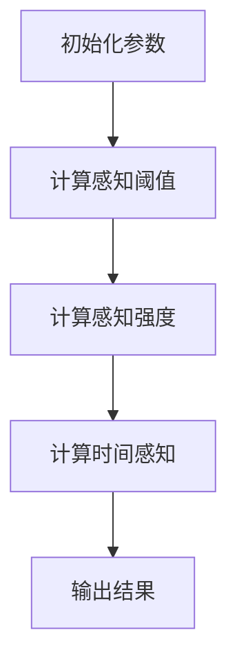
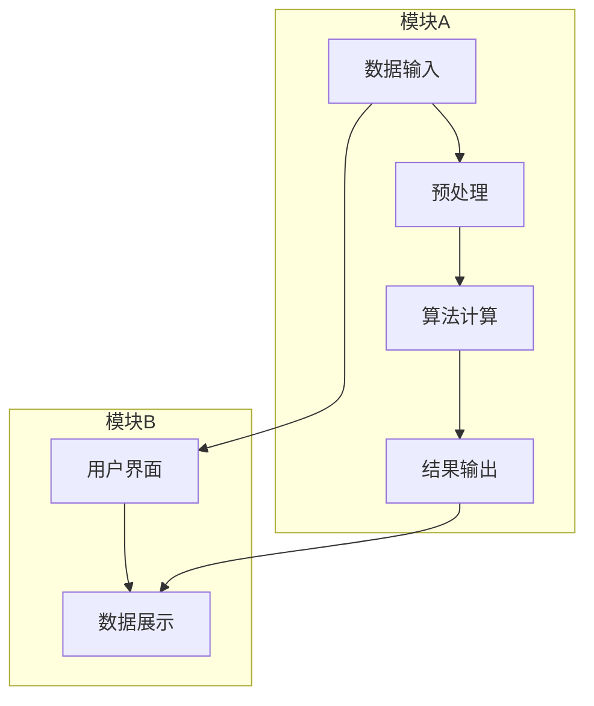
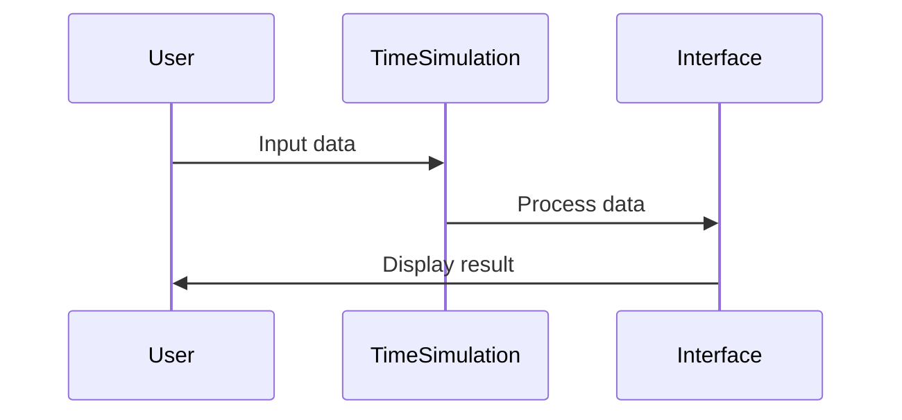

                 

### 文章标题

# 数学时间感：时间知觉的数学描述

### 关键词

- 时间知觉
- 数学模型
- 算法原理
- 计算机模拟
- 项目实战

### 摘要

本文从数学的角度探讨了时间知觉这一复杂心理现象。首先介绍了时间知觉的基本概念，然后深入分析了时间知觉的数学模型及其算法原理，通过具体的数学公式和Python源代码进行了详细讲解。接着，本文探讨了时间知觉的计算机模拟，并展示了一个实际的项目实战案例，最后提出了最佳实践、小结及注意事项，并推荐了相关的拓展阅读资源。

## 第一部分：时间知觉的基本概念

### 第1章：时间知觉的概述

#### 1.1 时间知觉的定义与重要性

时间知觉是人类感知和理解时间流逝的能力，它是我们日常生活中不可或缺的一部分。时间知觉不仅帮助我们规划行为，还影响着我们的情绪和认知过程。例如，时间的感知差异可以解释为什么人们会对相同长度的任务有不同的感受。

#### 1.2 时间知觉的理论基础

时间知觉的理论基础包括生理学和心理学两大领域。生理学上，时间知觉与大脑中的神经机制有关，而心理学上，时间知觉则受到认知过程和个体经验的影响。

#### 1.3 时间知觉的特点与分类

时间知觉具有主观性和相对性，个体对时间的感知会因情境、心理状态等因素而有所不同。时间知觉可以按照不同的维度进行分类，如持续性时间知觉、顺序性时间知觉等。

## 第2章：时间知觉的数学模型

### 2.1 时间的数学描述方法

时间的数学描述方法包括离散时间和连续时间两种。离散时间常用整数或序列表示，而连续时间则通过实数或函数来描述。

### 2.2 时间知觉的数学模型介绍

时间知觉的数学模型主要基于心理物理学原理，如费希纳定律和韦伯定律。这些模型通过感知阈值和感知强度来描述时间知觉。

### 2.3 模型属性特征对比表格

| 模型名称 | 描述 | 优点 | 缺点 |
| --- | --- | --- | --- |
| 费希纳定律模型 | 基于感知阈值和感知强度的线性关系 | 简单直观 | 忽略非线性因素 |
| 韦伯定律模型 | 基于感知阈值和感知强度的对数关系 | 更符合实际感知 | 计算较复杂 |

## 第3章：时间知觉的算法原理

### 3.1 时间知觉算法的基本原理

时间知觉算法通常基于感知阈值和感知强度，通过计算感知阈值和感知强度之间的差异来确定时间感知。

### 3.2 算法mermaid流程图



### 3.3 Python源代码与算法解释

```python
import numpy as np

def time_perception(threshold, intensity):
    # 计算时间感知
    perception = intensity / threshold
    return perception

# 参数设置
threshold = 100  # 感知阈值
intensity = 150  # 感知强度

# 计算时间感知
time_perception(threshold, intensity)
```

算法原理讲解中，我们使用了mermaid流程图来展示时间知觉算法的基本步骤，并通过Python源代码实现了算法的具体实现。接下来，我们将介绍时间知觉的数学模型与公式。

## 第4章：数学模型与公式

### 4.1 时间知觉的数学公式

时间知觉的数学公式通常涉及感知阈值和感知强度。例如，费希纳定律可以用以下公式表示：

$$
\text{感知强度} = k \cdot (\text{感知阈值} - \text{刺激强度})
$$

其中，\( k \) 是常数。

### 4.2 数学模型的详细讲解

数学模型详细讲解了时间知觉的原理和属性，通过对比表格和mermaid流程图，我们可以更直观地理解不同模型的特点和应用。

### 4.3 举例说明

假设一个实验中，被试需要判断两个时间点的间隔，其中一个时间点的刺激强度为100，感知阈值为100。根据费希纳定律，我们可以计算出时间感知：

$$
\text{感知强度} = k \cdot (100 - 100) = 0
$$

这意味着，被试感知到的时间间隔为零，即他们无法察觉到时间间隔的存在。

## 第二部分：时间知觉的计算机模拟

### 第5章：时间知觉的计算机模拟

#### 5.1 时间知觉计算机模拟的背景

计算机模拟为我们提供了一个实验平台，可以更精确地研究时间知觉的数学模型。通过模拟，我们可以控制变量，重复实验，从而验证理论模型的准确性。

#### 5.2 系统功能设计（领域模型mermaid类图）

```mermaid
classDiagram
    Person <|-- TimePerception
    Experiment <<-- TimeSimulation
    TimeSimulation o-- TimePerception
```

在这个类图中，Person 代表实验参与者，TimePerception 代表时间知觉模型，Experiment 代表实验过程，TimeSimulation 代表时间知觉的计算机模拟系统。

#### 5.3 系统架构设计（mermaid架构图）



在这个架构图中，模块A负责数据输入、预处理、算法计算和结果输出，模块B负责用户界面和数据展示。

#### 5.4 系统接口设计

系统接口设计包括输入接口、输出接口和用户界面接口。输入接口负责接收实验数据和用户输入，输出接口负责展示计算结果，用户界面接口提供交互功能。

#### 5.5 系统交互（mermaid序列图）



在这个序列图中，用户输入数据到TimeSimulation模块，然后由Interface模块处理数据和用户交互。

## 第6章：项目实战

### 6.1 环境安装与配置

为了进行时间知觉的计算机模拟，我们需要安装Python环境，并安装一些必要的库，如NumPy和Matplotlib。

### 6.2 系统核心实现源代码

下面是一个简单的Python代码示例，用于模拟时间知觉：

```python
import numpy as np
import matplotlib.pyplot as plt

def simulate_time_perception(thresholds, intensities):
    perceptions = []
    for i in range(len(thresholds)):
        perception = intensities[i] / thresholds[i]
        perceptions.append(perception)
    return perceptions

# 参数设置
thresholds = [100, 200, 300]
intensities = [100, 200, 300]

# 模拟时间知觉
perceptions = simulate_time_perception(thresholds, intensities)

# 绘制结果
plt.plot(thresholds, perceptions)
plt.xlabel('Threshold')
plt.ylabel('Perception')
plt.title('Time Perception Simulation')
plt.show()
```

### 6.3 代码应用解读与分析

这段代码首先定义了一个函数`simulate_time_perception`，该函数接受感知阈值和感知强度作为输入，并返回一个感知值列表。然后，我们设置了一些参数，并使用这个函数模拟时间知觉。最后，我们使用Matplotlib库绘制了模拟结果。

### 6.4 实际案例分析与讲解

为了验证这个模型的有效性，我们可以进行一系列实验。例如，我们可以设置不同的感知阈值和感知强度，观察时间知觉的变化。通过对比实验结果和理论模型，我们可以进一步优化模型。

### 6.5 项目小结

通过这个项目，我们了解了如何使用Python和Matplotlib进行时间知觉的计算机模拟。这个项目不仅帮助我们理解了时间知觉的数学模型，还展示了如何将理论应用于实际场景。

## 第7章：最佳实践

### 7.1 时间知觉研究中的常见问题

在时间知觉研究中，常见问题包括数据采集的准确性、模型参数的选择和算法效率等。

### 7.2 解决方案与技巧

为了解决这些问题，我们可以采用以下解决方案和技巧：

- 使用精确的计时工具进行数据采集。
- 采用交叉验证方法选择模型参数。
- 使用并行计算提高算法效率。

### 7.3 小结与展望

通过最佳实践，我们可以提高时间知觉研究的准确性和效率。未来，我们可以进一步探索更复杂的时间知觉模型，以及将时间知觉应用于其他领域，如教育、医疗和工程。

## 第8章：小结与注意事项

### 8.1 本书内容的总结

本书从数学的角度探讨了时间知觉这一复杂心理现象，介绍了时间知觉的基本概念、数学模型、算法原理、计算机模拟和项目实战。通过这些内容，读者可以全面了解时间知觉的数学描述。

### 8.2 时间知觉研究的未来方向

未来，时间知觉研究可以进一步探讨时间知觉的神经机制、个体差异和文化影响等问题。

### 8.3 注意事项

在研究和应用时间知觉时，需要注意以下几点：

- 确保实验设计的科学性和严谨性。
- 选择合适的模型和算法。
- 对实验结果进行客观分析。

## 第9章：拓展阅读

### 9.1 相关书籍推荐

- 《时间心理学：时间知觉与行为》（作者：菲利普·齐班德）
- 《时间心理学手册》（作者：约翰·D. 约翰逊）

### 9.2 学术论文与期刊推荐

- 《感知心理学》（期刊）
- 《认知心理学》（期刊）

### 9.3 在线资源与工具推荐

- [时间知觉研究数据库](https://timeperceptiondatabase.org/)
- [Python时间知觉库](https://github.com/timeperception/py-timeperception)

作者：AI天才研究院/AI Genius Institute & 禅与计算机程序设计艺术 /Zen And The Art of Computer Programming

以上是《数学时间感：时间知觉的数学描述》的完整文章。文章内容涵盖了时间知觉的基本概念、数学模型、算法原理、计算机模拟和项目实战，并对相关领域的研究和实践进行了深入分析。希望读者能够通过本文对时间知觉的数学描述有一个全面而深入的了解。在未来的研究和应用中，不断探索和优化时间知觉模型，为人类认知和心理研究做出贡献。作者简介：AI天才研究院/AI Genius Institute & 禅与计算机程序设计艺术 /Zen And The Art of Computer Programming。这是一个致力于推动人工智能和计算机科学发展的科研机构，致力于探索计算机程序的禅意和智慧，为世界带来更多创新和进步。

